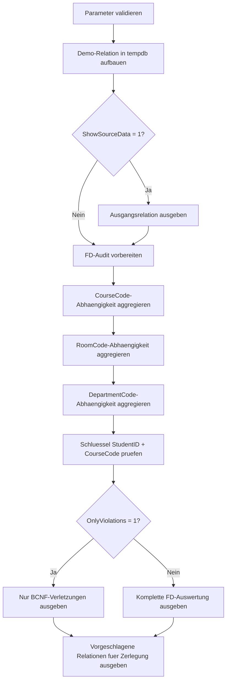

# BcnfDecompositionStarter.sql

Dieses Skript ist als didaktischer Einstieg fuer die Zerlegung einer denormalisierten Beispielrelation in Richtung Boyce-Codd-Normalform angelegt. Die SQL-Datei zeigt eine Demo-Relation, prueft ausgewaehlte funktionale Abhaengigkeiten gegen die Beispieldaten und skizziert daraus eine moegliche Zerlegung in kleinere Relationen.

## Uebersicht

<!-- SQLDOC:SUMMARY_TABLE:BEGIN -->
| Feld | Wert |
|---|---|
| Script | [BcnfDecompositionStarter.sql](BcnfDecompositionStarter.sql) |
| Version | `1.0` |
| Typ | `didactic-lab` |
| Kapitel | `01_Normalformen` |
| Sicherheit | `read-only-tempdb` |
| Zweck | Didaktischer Startpunkt fuer BCNF-Zerlegung mit Demo-Daten und FD-Pruefung. |
<!-- SQLDOC:SUMMARY_TABLE:END -->

## Einordnung

Die Beispielrelation kombiniert Einschreibungen, Kursdaten, Raumdaten und Department-Informationen in einer einzigen Tabelle. Dadurch entstehen bewusst Redundanzen, die als Ausgangspunkt fuer die Diskussion ueber funktionale Abhaengigkeiten und BCNF-Verletzungen dienen.

## Annahmen

- Es handelt sich um eine didaktische Erstversion ohne produktive Quelltabellen.
- Die zusammengesetzte Kombination aus `StudentID` und `CourseCode` wird als Einschreibeschluessel behandelt.
- Die Abhaengigkeiten `CourseCode -> CourseTitle, LecturerID, LecturerName, RoomCode`, `RoomCode -> DepartmentCode, DepartmentName` und `DepartmentCode -> DepartmentName` werden auf Demo-Daten illustriert.
- Die vorgeschlagene Zerlegung ist ein fachlich plausibler Startpunkt fuer Unterricht und Review, keine vollautomatische Normalformanalyse.

## Anwendungsfall

Das Skript eignet sich fuer Kapitelbesprechungen, Whiteboard-Diskussionen und erste Refactorings von Tabellenmodellen. Besonders nuetzlich ist es, wenn Lernende sehen sollen, wie aus einer breiten Relation schrittweise kleinere, besser motivierte Relationen abgeleitet werden koennen.

## Parameter

<!-- SQLDOC:PARAMETERS_TABLE:BEGIN -->
| Parameter | SQL-Typ | Pflicht | Beschreibung |
|---|---|---|---|
| `@ShowSourceData` | `BIT` | Nein | Gibt bei `1` eine Vorschau der denormalisierten Ausgangsrelation aus. |
| `@OnlyViolations` | `BIT` | Nein | Beschraenkt die FD-Auswertung bei `1` auf erkannte BCNF-Verletzungen. |
<!-- SQLDOC:PARAMETERS_TABLE:END -->

## Abhaengigkeiten

<!-- SQLDOC:DEPENDENCIES_LIST:BEGIN -->
- `tempdb` fuer temporaere Tabellen
- `GROUP BY`
- `COUNT(DISTINCT ...)`
- `UNION ALL`
<!-- SQLDOC:DEPENDENCIES_LIST:END -->

## Hinweise

- Die FD-Pruefung ist datengetrieben und didaktisch modelliert. Sie zeigt, ob die Demo-Daten die jeweilige Abhaengigkeit konsistent tragen.
- `candidate_key_ok` markiert im Ergebnis den zusammengesetzten Einschreibeschluessel als didaktisch akzeptierte Referenz fuer die volle Zeile.
- `violates_bcnf` bedeutet hier: Die Abhaengigkeit wirkt auf den Demo-Daten stabil, aber der Determinant ist nicht als Schluessel der Gesamtbeziehung modelliert.

## Versionshistorie

<!-- SQLDOC:VERSION_HISTORY_TABLE:BEGIN -->
| Version | Datum | User | Beschreibung |
|---|---|---|---|
| `1.0` | `2026-04-16` | `ER` | Erstversion des didaktischen BCNF-Zerlegungsstarters |
<!-- SQLDOC:VERSION_HISTORY_TABLE:END -->

## Ablauf

<!-- SQLDOC:MERMAID:BEGIN -->

<!-- SQLDOC:MERMAID:END -->

## SQL-Code

<!-- SQLDOC:SQL_CODE:BEGIN -->
```sql
/*
BEGIN:SQL-HEADER v1
---
sql_header: v1
script_name: "BcnfDecompositionStarter.sql"
script_version: "1.0"
script_type: "didactic-lab"
chapter: "01_Normalformen"

purpose: >
  Liefert einen didaktischen Startpunkt fuer die Zerlegung einer
  Beispielrelation in Richtung Boyce-Codd-Normalform. Das Skript macht
  funktionale Abhaengigkeiten sichtbar, markiert BCNF-Verletzungen und
  zeigt eine moegliche Aufteilung in kleinere Relationen.

parameters:
  - name: "@ShowSourceData"
    sql_type: "BIT"
    direction: "IN"
    required: false
    description: "1 = Vorschau der denormalisierten Ausgangsrelation ausgeben"
  - name: "@OnlyViolations"
    sql_type: "BIT"
    direction: "IN"
    required: false
    description: "1 = in der FD-Auswertung nur BCNF-Verletzungen zeigen"

result_sets:
  - name: "SourceRelationPreview"
    description: "Optionale Vorschau der denormalisierten Beispielrelation"
  - name: "FunctionalDependencyCheck"
    description: "Prueft didaktisch modellierte funktionale Abhaengigkeiten gegen die Beispieldaten"
  - name: "ProposedBcnfDecomposition"
    description: "Zeigt eine moegliche Zerlegung in kleinere Relationen Richtung BCNF"

dependencies:
  - "tempdb temporary tables"
  - "GROUP BY"
  - "COUNT(DISTINCT ...)"
  - "UNION ALL"

safety:
  level: "read-only-tempdb"
  writes_data: false

documentation:
  markdown_file: "T-SQL/01_Normalformen/SQLScripts/BcnfDecompositionStarter.md"
  sync_blocks:
    - "SUMMARY_TABLE"
    - "PARAMETERS_TABLE"
    - "DEPENDENCIES_LIST"
    - "VERSION_HISTORY_TABLE"
    - "SQL_CODE"
  mermaid:
    mode: "ai-agent-from-sql"
    source: "script-body"

main_responsible:
  name: "Erhard Rainer"
  initials: "ER"

version_history:
  - version: "1.0"
    date: "2026-04-16"
    user: "ER"
    description: "Erstversion des didaktischen BCNF-Zerlegungsstarters"

notes:
  - "Die funktionalen Abhaengigkeiten werden didaktisch auf einer Demo-Relation illustriert"
  - "Die vorgeschlagene Zerlegung ist ein Einstieg fuer die Diskussion und kein automatischer BCNF-Beweis"
---
END:SQL-HEADER v1
*/

SET NOCOUNT ON;

DECLARE @ShowSourceData BIT = 1;
DECLARE @OnlyViolations BIT = 0;

IF @ShowSourceData NOT IN (0, 1)
BEGIN
    THROW 50000, '@ShowSourceData muss 0 oder 1 sein.', 1;
END;

IF @OnlyViolations NOT IN (0, 1)
BEGIN
    THROW 50001, '@OnlyViolations muss 0 oder 1 sein.', 1;
END;

DROP TABLE IF EXISTS #EnrollmentWide;
DROP TABLE IF EXISTS #DependencyAudit;
DROP TABLE IF EXISTS #ProposedRelations;

CREATE TABLE #EnrollmentWide
(
    StudentID      INT          NOT NULL,
    StudentName    VARCHAR(50)  NOT NULL,
    CourseCode     VARCHAR(20)  NOT NULL,
    CourseTitle    VARCHAR(100) NOT NULL,
    LecturerID     INT          NOT NULL,
    LecturerName   VARCHAR(50)  NOT NULL,
    RoomCode       VARCHAR(20)  NOT NULL,
    DepartmentCode VARCHAR(20)  NOT NULL,
    DepartmentName VARCHAR(100) NOT NULL
);

INSERT INTO #EnrollmentWide
(
    StudentID,
    StudentName,
    CourseCode,
    CourseTitle,
    LecturerID,
    LecturerName,
    RoomCode,
    DepartmentCode,
    DepartmentName
)
VALUES
    (1001, 'Alice Berger', 'DB100', 'Relational Basics',        10, 'Dr. Koch',  'R-101', 'CS',   'Computer Science'),
    (1002, 'Boris Klein',  'DB100', 'Relational Basics',        10, 'Dr. Koch',  'R-101', 'CS',   'Computer Science'),
    (1003, 'Cem Yilmaz',   'DB100', 'Relational Basics',        10, 'Dr. Koch',  'R-101', 'CS',   'Computer Science'),
    (1001, 'Alice Berger', 'DB220', 'Normalization Workshop',   14, 'Prof. Hahn','R-205', 'DATA', 'Data Engineering'),
    (1004, 'Dina Maurer',  'DB220', 'Normalization Workshop',   14, 'Prof. Hahn','R-205', 'DATA', 'Data Engineering'),
    (1002, 'Boris Klein',  'QA300', 'Data Quality Clinic',      18, 'Dr. Wolf',  'R-310', 'QA',   'Quality Assurance'),
    (1005, 'Eva Schmitt',  'QA300', 'Data Quality Clinic',      18, 'Dr. Wolf',  'R-310', 'QA',   'Quality Assurance'),
    (1003, 'Cem Yilmaz',   'MOD410','Model Review Lab',         21, 'Dr. Stern', 'R-410', 'ARCH', 'Architecture');

IF @ShowSourceData = 1
BEGIN
    SELECT
        ew.StudentID,
        ew.StudentName,
        ew.CourseCode,
        ew.CourseTitle,
        ew.LecturerID,
        ew.LecturerName,
        ew.RoomCode,
        ew.DepartmentCode,
        ew.DepartmentName
    FROM #EnrollmentWide AS ew
    ORDER BY
        ew.CourseCode,
        ew.StudentID;
END;

CREATE TABLE #DependencyAudit
(
    DeterminantColumns VARCHAR(100) NOT NULL,
    DependentColumns   VARCHAR(100) NOT NULL,
    SampleMeaning      VARCHAR(200) NOT NULL,
    DistinctDeterminants INT        NOT NULL,
    MaxDependentValuesPerDeterminant INT NOT NULL,
    DeterminantActsAsKey BIT        NOT NULL,
    BcnfStatus         VARCHAR(30)  NOT NULL
);

INSERT INTO #DependencyAudit
(
    DeterminantColumns,
    DependentColumns,
    SampleMeaning,
    DistinctDeterminants,
    MaxDependentValuesPerDeterminant,
    DeterminantActsAsKey,
    BcnfStatus
)
SELECT
    'CourseCode',
    'CourseTitle, LecturerID, LecturerName, RoomCode',
    'Jeder Kurscode beschreibt genau einen Kurstitel, einen Dozenten und einen Raum.',
    COUNT(*) AS DistinctDeterminants,
    MAX(CourseVariantCount) AS MaxDependentValuesPerDeterminant,
    CAST(0 AS BIT) AS DeterminantActsAsKey,
    CASE
        WHEN MAX(CourseVariantCount) = 1 THEN 'violates_bcnf'
        ELSE 'not_a_dependency'
    END AS BcnfStatus
FROM
(
    SELECT
        ew.CourseCode,
        COUNT(DISTINCT CONCAT(ew.CourseTitle, '|', ew.LecturerID, '|', ew.LecturerName, '|', ew.RoomCode)) AS CourseVariantCount
    FROM #EnrollmentWide AS ew
    GROUP BY
        ew.CourseCode
) AS CourseCheck

UNION ALL

SELECT
    'RoomCode',
    'DepartmentCode, DepartmentName',
    'Ein Raum wird didaktisch genau einem Fachbereich zugeordnet.',
    COUNT(*) AS DistinctDeterminants,
    MAX(RoomVariantCount) AS MaxDependentValuesPerDeterminant,
    CAST(0 AS BIT) AS DeterminantActsAsKey,
    CASE
        WHEN MAX(RoomVariantCount) = 1 THEN 'violates_bcnf'
        ELSE 'not_a_dependency'
    END AS BcnfStatus
FROM
(
    SELECT
        ew.RoomCode,
        COUNT(DISTINCT CONCAT(ew.DepartmentCode, '|', ew.DepartmentName)) AS RoomVariantCount
    FROM #EnrollmentWide AS ew
    GROUP BY
        ew.RoomCode
) AS RoomCheck

UNION ALL

SELECT
    'DepartmentCode',
    'DepartmentName',
    'Ein Department-Code benennt den Fachbereich eindeutig.',
    COUNT(*) AS DistinctDeterminants,
    MAX(DepartmentVariantCount) AS MaxDependentValuesPerDeterminant,
    CAST(0 AS BIT) AS DeterminantActsAsKey,
    CASE
        WHEN MAX(DepartmentVariantCount) = 1 THEN 'violates_bcnf'
        ELSE 'not_a_dependency'
    END AS BcnfStatus
FROM
(
    SELECT
        ew.DepartmentCode,
        COUNT(DISTINCT ew.DepartmentName) AS DepartmentVariantCount
    FROM #EnrollmentWide AS ew
    GROUP BY
        ew.DepartmentCode
) AS DepartmentCheck

UNION ALL

SELECT
    'StudentID, CourseCode',
    'StudentName, CourseTitle, LecturerID, LecturerName, RoomCode, DepartmentCode, DepartmentName',
    'Der zusammengesetzte Einschreibeschluessel beschreibt die restliche Zeile.',
    COUNT(*) AS DistinctDeterminants,
    MAX(EnrollmentVariantCount) AS MaxDependentValuesPerDeterminant,
    CAST(1 AS BIT) AS DeterminantActsAsKey,
    CASE
        WHEN MAX(EnrollmentVariantCount) = 1 THEN 'candidate_key_ok'
        ELSE 'not_a_dependency'
    END AS BcnfStatus
FROM
(
    SELECT
        ew.StudentID,
        ew.CourseCode,
        COUNT(DISTINCT CONCAT(ew.StudentName, '|', ew.CourseTitle, '|', ew.LecturerID, '|', ew.LecturerName, '|', ew.RoomCode, '|', ew.DepartmentCode, '|', ew.DepartmentName)) AS EnrollmentVariantCount
    FROM #EnrollmentWide AS ew
    GROUP BY
        ew.StudentID,
        ew.CourseCode
) AS EnrollmentCheck;

SELECT
    da.DeterminantColumns,
    da.DependentColumns,
    da.SampleMeaning,
    da.DistinctDeterminants,
    da.MaxDependentValuesPerDeterminant,
    da.DeterminantActsAsKey,
    da.BcnfStatus
FROM #DependencyAudit AS da
WHERE @OnlyViolations = 0
   OR da.BcnfStatus = 'violates_bcnf'
ORDER BY
    CASE da.BcnfStatus
        WHEN 'violates_bcnf' THEN 1
        WHEN 'candidate_key_ok' THEN 2
        ELSE 3
    END,
    da.DeterminantColumns;

CREATE TABLE #ProposedRelations
(
    StepNumber        INT          NOT NULL,
    TargetRelation    VARCHAR(50)  NOT NULL,
    SuggestedKey      VARCHAR(100) NOT NULL,
    ColumnsToKeep     VARCHAR(300) NOT NULL,
    Reasoning         VARCHAR(300) NOT NULL
);

INSERT INTO #ProposedRelations
(
    StepNumber,
    TargetRelation,
    SuggestedKey,
    ColumnsToKeep,
    Reasoning
)
VALUES
    (1, 'CourseOffering',      'CourseCode',            'CourseCode, CourseTitle, LecturerID, LecturerName, RoomCode', 'Loest die Abhaengigkeit CourseCode -> Kurs- und Raumattribute aus der Einschreibung.'),
    (2, 'RoomDepartment',      'RoomCode',              'RoomCode, DepartmentCode, DepartmentName',                     'Separiert die Abhaengigkeit RoomCode -> Department.'),
    (3, 'DepartmentLookup',    'DepartmentCode',        'DepartmentCode, DepartmentName',                               'Optionaler Lookup fuer den Department-Namen.'),
    (4, 'StudentEnrollment',   'StudentID, CourseCode', 'StudentID, StudentName, CourseCode',                           'Behaelt die eigentliche Einschreibung mit dem zusammengesetzten Schluessel.');

SELECT
    pr.StepNumber,
    pr.TargetRelation,
    pr.SuggestedKey,
    pr.ColumnsToKeep,
    pr.Reasoning
FROM #ProposedRelations AS pr
ORDER BY
    pr.StepNumber;
```
<!-- SQLDOC:SQL_CODE:END -->
