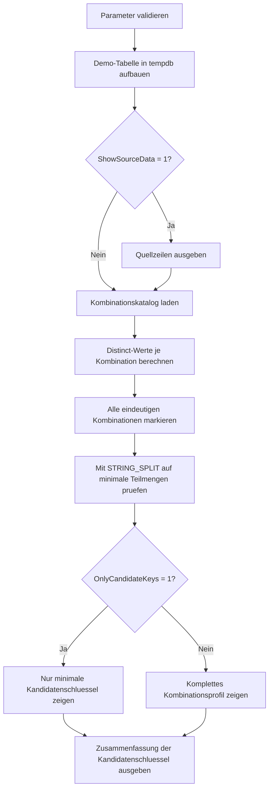

# CandidateKeySampler.sql

Dieses Skript prueft auf einer didaktischen Beispieltabelle mehrere vorbereitete Spaltenkombinationen gegen ihre Distinct-Wirkung. Dadurch wird sichtbar, welche Kombinationen in den Demo-Daten eindeutig sind und welche davon als minimale Kandidatenschluessel fuer die betrachtete Relation taugen.

## Uebersicht

<!-- SQLDOC:SUMMARY_TABLE:BEGIN -->
| Feld | Wert |
|---|---|
| Script | [CandidateKeySampler.sql](CandidateKeySampler.sql) |
| Version | `1.0` |
| Typ | `didactic-lab` |
| Kapitel | `01_Normalformen` |
| Sicherheit | `read-only-tempdb` |
| Zweck | Bewertet vorbereitete Spaltenkombinationen auf Eindeutigkeit und minimale Kandidatenschluessel. |
<!-- SQLDOC:SUMMARY_TABLE:END -->

## Einordnung

Die SQL-Datei bildet keine allgemeine Schluesselsuche fuer beliebige Tabellen nach. Stattdessen arbeitet sie mit einer kleinen, erklaerbaren Demo-Relation und einer bewusst ausgewaehlten Menge an Kombinationen. So laesst sich im Unterricht nachvollziehen, warum manche Kombinationen zwar eindeutig, aber nicht minimal sind.

## Annahmen

- Es handelt sich um eine didaktische Erstversion ohne produktive Quelltabellen.
- `EnrollmentID` repraesentiert einen Surrogatschluessel, waehrend `StudentNo + CourseCode + TermCode` als natuerlich wirkende Belegungskombination modelliert ist.
- Dieselbe Person kann denselben Kurs in mehreren Terminen belegen, weshalb `StudentNo + CourseCode` bewusst nicht als minimaler Schluessel ausreicht.
- Die Minimalitaet wird nur innerhalb der im Skript vordefinierten Kombinationen bewertet, nicht ueber alle mathematisch moeglichen Spaltenmengen.

## Anwendungsfall

Das Skript eignet sich fuer 1NF-, 2NF- und Schluesseldiskussionen, in denen Lernende Distinct-Kombinationen gezielt lesen und vergleichen sollen. Besonders nuetzlich ist es, wenn zwischen einem eindeutigem Superset und einem minimalen Kandidatenschluessel unterschieden werden soll.

## Parameter

<!-- SQLDOC:PARAMETERS_TABLE:BEGIN -->
| Parameter | SQL-Typ | Pflicht | Beschreibung |
|---|---|---|---|
| `@ShowSourceData` | `BIT` | Nein | Gibt bei `1` die Demo-Tabelle vor der Auswertung aus. |
| `@OnlyCandidateKeys` | `BIT` | Nein | Filtert bei `1` auf minimale eindeutige Kombinationen. |
<!-- SQLDOC:PARAMETERS_TABLE:END -->

## Abhaengigkeiten

<!-- SQLDOC:DEPENDENCIES_LIST:BEGIN -->
- `tempdb` fuer temporaere Tabellen
- `COUNT(DISTINCT ...)`
- `STRING_SPLIT`
- `CTE`
<!-- SQLDOC:DEPENDENCIES_LIST:END -->

## Hinweise

- `unique_but_not_minimal` markiert Kombinationen, die zwar jede Zeile eindeutig identifizieren, aber ein kleineres eindeutiges Teilset besitzen.
- `candidate_key` markiert minimale eindeutige Kombinationen innerhalb des vorbereiteten Suchraums.
- Die Demo-Daten sind so gewaehlt, dass sowohl Surrogat- als auch natuerliche Schluesselmuster und nicht-minimale Vorstufen diskutiert werden koennen.

## Versionshistorie

<!-- SQLDOC:VERSION_HISTORY_TABLE:BEGIN -->
| Version | Datum | User | Beschreibung |
|---|---|---|---|
| `1.0` | `2026-04-16` | `ER` | Erstversion des didaktischen Candidate-Key-Samplers |
<!-- SQLDOC:VERSION_HISTORY_TABLE:END -->

## Ablauf

<!-- SQLDOC:MERMAID:BEGIN -->

<!-- SQLDOC:MERMAID:END -->

## SQL-Code

<!-- SQLDOC:SQL_CODE:BEGIN -->
```sql
/*
BEGIN:SQL-HEADER v1
---
sql_header: v1
script_name: "CandidateKeySampler.sql"
script_version: "1.0"
script_type: "didactic-lab"
chapter: "01_Normalformen"

purpose: >
  Ermittelt auf einer didaktischen Beispieltabelle moegliche
  Kandidatenschluessel, indem ausgewaehlte Spaltenkombinationen auf
  Eindeutigkeit und minimale Schluessel-Eigenschaften geprueft werden.

parameters:
  - name: "@ShowSourceData"
    sql_type: "BIT"
    direction: "IN"
    required: false
    description: "1 = Vorschau der Beispieldaten ausgeben"
  - name: "@OnlyCandidateKeys"
    sql_type: "BIT"
    direction: "IN"
    required: false
    description: "1 = nur minimale eindeutige Kombinationen ausgeben"

result_sets:
  - name: "SourceDataPreview"
    description: "Optionale Vorschau der didaktischen Einschreibedaten"
  - name: "CombinationProfile"
    description: "Bewertet vorbereitete Spaltenkombinationen nach Distinct-Anteil und Minimalitaet"
  - name: "CandidateKeySummary"
    description: "Hebt minimale eindeutige Kombinationen als didaktische Kandidatenschluessel hervor"

dependencies:
  - "tempdb temporary tables"
  - "COUNT(DISTINCT ...)"
  - "STRING_SPLIT"
  - "CTE"

safety:
  level: "read-only-tempdb"
  writes_data: false

documentation:
  markdown_file: "T-SQL/01_Normalformen/SQLScripts/CandidateKeySampler.md"
  sync_blocks:
    - "SUMMARY_TABLE"
    - "PARAMETERS_TABLE"
    - "DEPENDENCIES_LIST"
    - "VERSION_HISTORY_TABLE"
    - "SQL_CODE"
  mermaid:
    mode: "ai-agent-from-sql"
    source: "script-body"

main_responsible:
  name: "Erhard Rainer"
  initials: "ER"

version_history:
  - version: "1.0"
    date: "2026-04-16"
    user: "ER"
    description: "Erstversion des didaktischen Candidate-Key-Samplers"

notes:
  - "Die Kombinationen sind didaktisch vorselektiert und ersetzen keine vollstaendige Schluesselsuche"
  - "Minimale Kandidatenschluessel werden nur innerhalb der pruefbaren Beispielkombinationen bewertet"
---
END:SQL-HEADER v1
*/

SET NOCOUNT ON;

DECLARE @ShowSourceData BIT = 1;
DECLARE @OnlyCandidateKeys BIT = 0;

IF @ShowSourceData NOT IN (0, 1)
BEGIN
    THROW 50000, '@ShowSourceData muss 0 oder 1 sein.', 1;
END;

IF @OnlyCandidateKeys NOT IN (0, 1)
BEGIN
    THROW 50001, '@OnlyCandidateKeys muss 0 oder 1 sein.', 1;
END;

DROP TABLE IF EXISTS #EnrollmentAudit;
DROP TABLE IF EXISTS #CombinationCatalog;
DROP TABLE IF EXISTS #CombinationProfile;

CREATE TABLE #EnrollmentAudit
(
    EnrollmentID    INT          NOT NULL,
    StudentNo       VARCHAR(20)  NOT NULL,
    EmailAddress    VARCHAR(120) NOT NULL,
    CourseCode      VARCHAR(20)  NOT NULL,
    TermCode        VARCHAR(10)  NOT NULL,
    SectionCode     VARCHAR(10)  NOT NULL,
    AssessmentGroup VARCHAR(20)  NOT NULL,
    CampusCode      VARCHAR(10)  NOT NULL
);

INSERT INTO #EnrollmentAudit
(
    EnrollmentID,
    StudentNo,
    EmailAddress,
    CourseCode,
    TermCode,
    SectionCode,
    AssessmentGroup,
    CampusCode
)
VALUES
    (5001, 'S-1001', 'alice.berger@example.edu', 'DB100', '2026S', 'A1', 'LAB-1',  'BER'),
    (5002, 'S-1002', 'boris.klein@example.edu',  'DB100', '2026S', 'A1', 'LAB-1',  'BER'),
    (5003, 'S-1003', 'cem.yilmaz@example.edu',   'DB100', '2026S', 'A2', 'LAB-2',  'HAM'),
    (5004, 'S-1001', 'alice.berger@example.edu', 'DB220', '2026S', 'B1', 'CASE-1', 'BER'),
    (5005, 'S-1004', 'dina.maurer@example.edu',  'DB220', '2026S', 'B1', 'CASE-1', 'MUC'),
    (5006, 'S-1002', 'boris.klein@example.edu',  'QA300', '2026W', 'C1', 'AUDIT',  'BER'),
    (5007, 'S-1005', 'eva.schmitt@example.edu',  'QA300', '2026W', 'C1', 'AUDIT',  'MUC'),
    (5008, 'S-1003', 'cem.yilmaz@example.edu',   'DB100', '2026W', 'D1', 'STUDIO', 'HAM');

IF @ShowSourceData = 1
BEGIN
    SELECT
        ea.EnrollmentID,
        ea.StudentNo,
        ea.EmailAddress,
        ea.CourseCode,
        ea.TermCode,
        ea.SectionCode,
        ea.AssessmentGroup,
        ea.CampusCode
    FROM #EnrollmentAudit AS ea
    ORDER BY
        ea.EnrollmentID;
END;

CREATE TABLE #CombinationCatalog
(
    CombinationName VARCHAR(120) NOT NULL,
    ColumnCount     INT          NOT NULL,
    TokenList       VARCHAR(200) NOT NULL,
    Description     VARCHAR(200) NOT NULL
);

INSERT INTO #CombinationCatalog
(
    CombinationName,
    ColumnCount,
    TokenList,
    Description
)
VALUES
    ('EnrollmentID', 1, '|EnrollmentID|', 'Surrogatschluessel der Beispielzeile.'),
    ('EmailAddress', 1, '|EmailAddress|', 'Kontaktbezug pro Lernenden, aber nicht zwingend pro Belegung eindeutig.'),
    ('StudentNo', 1, '|StudentNo|', 'Allein nicht eindeutig, weil Lernende mehrere Belegungen haben koennen.'),
    ('StudentNo + CourseCode', 2, '|StudentNo|CourseCode|', 'Prueft Wiederholungen desselben Kurses ueber mehrere Termine.'),
    ('StudentNo + TermCode', 2, '|StudentNo|TermCode|', 'Prueft Mehrfachbelegungen eines Lernenden je Termin.'),
    ('CourseCode + TermCode + SectionCode', 3, '|CourseCode|TermCode|SectionCode|', 'Technische Gruppierung des Angebots ohne Lernendenbezug.'),
    ('StudentNo + CourseCode + TermCode', 3, '|StudentNo|CourseCode|TermCode|', 'Natuerlich wirkender didaktischer Schluessel pro Belegung.'),
    ('EmailAddress + CourseCode', 2, '|EmailAddress|CourseCode|', 'Superset eines natuerlichen Einzelschluessels fuer den Kursbezug.'),
    ('EnrollmentID + CourseCode', 2, '|EnrollmentID|CourseCode|', 'Superset eines bereits eindeutigen Surrogatschluessels.'),
    ('StudentNo + CourseCode + TermCode + SectionCode', 4, '|StudentNo|CourseCode|TermCode|SectionCode|', 'Superset der natuerlichen Belegungskombination.')
;

CREATE TABLE #CombinationProfile
(
    CombinationName      VARCHAR(120) NOT NULL,
    ColumnCount          INT          NOT NULL,
    DistinctCount        INT          NOT NULL,
    TotalRowCount        INT          NOT NULL,
    IsUniqueCombination  BIT          NOT NULL,
    IsMinimalUnique      BIT          NOT NULL,
    Classification       VARCHAR(40)  NOT NULL,
    Description          VARCHAR(200) NOT NULL
);

INSERT INTO #CombinationProfile
(
    CombinationName,
    ColumnCount,
    DistinctCount,
    TotalRowCount,
    IsUniqueCombination,
    IsMinimalUnique,
    Classification,
    Description
)
SELECT
    cc.CombinationName,
    cc.ColumnCount,
    metrics.DistinctCount,
    metrics.TotalRowCount,
    CAST(CASE WHEN metrics.DistinctCount = metrics.TotalRowCount THEN 1 ELSE 0 END AS BIT) AS IsUniqueCombination,
    CAST(0 AS BIT) AS IsMinimalUnique,
    CASE
        WHEN metrics.DistinctCount = metrics.TotalRowCount THEN 'unique_pending_minimality'
        ELSE 'non_unique'
    END AS Classification,
    cc.Description
FROM #CombinationCatalog AS cc
CROSS APPLY
(
    SELECT
        COUNT(DISTINCT combo.ComboValue) AS DistinctCount,
        COUNT(*) AS TotalRowCount
    FROM
    (
        SELECT
            CASE cc.CombinationName
                WHEN 'EnrollmentID' THEN CONCAT(ea.EnrollmentID)
                WHEN 'EmailAddress' THEN ea.EmailAddress
                WHEN 'StudentNo' THEN ea.StudentNo
                WHEN 'StudentNo + CourseCode' THEN CONCAT(ea.StudentNo, '|', ea.CourseCode)
                WHEN 'StudentNo + TermCode' THEN CONCAT(ea.StudentNo, '|', ea.TermCode)
                WHEN 'CourseCode + TermCode + SectionCode' THEN CONCAT(ea.CourseCode, '|', ea.TermCode, '|', ea.SectionCode)
                WHEN 'StudentNo + CourseCode + TermCode' THEN CONCAT(ea.StudentNo, '|', ea.CourseCode, '|', ea.TermCode)
                WHEN 'EmailAddress + CourseCode' THEN CONCAT(ea.EmailAddress, '|', ea.CourseCode)
                WHEN 'EnrollmentID + CourseCode' THEN CONCAT(ea.EnrollmentID, '|', ea.CourseCode)
                WHEN 'StudentNo + CourseCode + TermCode + SectionCode' THEN CONCAT(ea.StudentNo, '|', ea.CourseCode, '|', ea.TermCode, '|', ea.SectionCode)
            END AS ComboValue
        FROM #EnrollmentAudit AS ea
    ) AS combo
) AS metrics;

WITH UniqueCombinations AS
(
    SELECT
        cc.CombinationName,
        cc.ColumnCount,
        cc.TokenList
    FROM #CombinationCatalog AS cc
    INNER JOIN #CombinationProfile AS cp
        ON cp.CombinationName = cc.CombinationName
    WHERE cp.IsUniqueCombination = 1
)
UPDATE cp
SET
    IsMinimalUnique = CAST(
        CASE
            WHEN NOT EXISTS
            (
                SELECT 1
                FROM UniqueCombinations AS smaller
                WHERE smaller.ColumnCount < uc.ColumnCount
                  AND NOT EXISTS
                  (
                      SELECT 1
                      FROM STRING_SPLIT(smaller.TokenList, '|') AS token
                      WHERE token.value <> ''
                        AND CHARINDEX('|' + token.value + '|', uc.TokenList) = 0
                  )
            ) THEN 1
            ELSE 0
        END AS BIT
    ),
    Classification =
        CASE
            WHEN NOT EXISTS
            (
                SELECT 1
                FROM UniqueCombinations AS smaller
                WHERE smaller.ColumnCount < uc.ColumnCount
                  AND NOT EXISTS
                  (
                      SELECT 1
                      FROM STRING_SPLIT(smaller.TokenList, '|') AS token
                      WHERE token.value <> ''
                        AND CHARINDEX('|' + token.value + '|', uc.TokenList) = 0
                  )
            ) THEN 'candidate_key'
            ELSE 'unique_but_not_minimal'
        END
FROM #CombinationProfile AS cp
INNER JOIN UniqueCombinations AS uc
    ON uc.CombinationName = cp.CombinationName;

SELECT
    cp.CombinationName,
    cp.ColumnCount,
    cp.DistinctCount,
    cp.TotalRowCount,
    cp.IsUniqueCombination,
    cp.IsMinimalUnique,
    cp.Classification,
    cp.Description
FROM #CombinationProfile AS cp
WHERE @OnlyCandidateKeys = 0
   OR cp.IsMinimalUnique = 1
ORDER BY
    cp.IsMinimalUnique DESC,
    cp.IsUniqueCombination DESC,
    cp.ColumnCount,
    cp.CombinationName;

SELECT
    cp.CombinationName AS CandidateKey,
    cp.ColumnCount,
    cp.Description,
    'minimal_unique_within_sample' AS Evidence
FROM #CombinationProfile AS cp
WHERE cp.IsMinimalUnique = 1
ORDER BY
    cp.ColumnCount,
    cp.CombinationName;
```
<!-- SQLDOC:SQL_CODE:END -->
