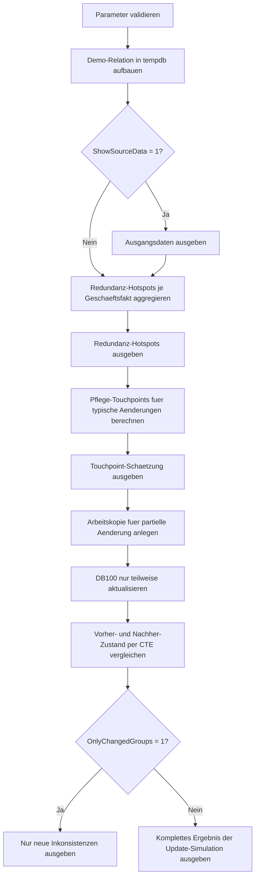

# DenormalizationImpactPreview.sql

Dieses Skript zeigt an einer breiten Demo-Relation, warum Denormalisierung nicht nur Speicherwiederholungen erzeugt, sondern auch reale Pflegekosten. Die SQL-Datei zaehlt redundante Kopien fachlicher Stammdaten, schaetzt notwendige Touchpoints fuer Aenderungen und simuliert eine absichtlich unvollstaendige Anpassung.

## Uebersicht

<!-- SQLDOC:SUMMARY_TABLE:BEGIN -->
| Feld | Wert |
|---|---|
| Script | [DenormalizationImpactPreview.sql](DenormalizationImpactPreview.sql) |
| Version | `1.0` |
| Typ | `didactic-lab` |
| Kapitel | `01_Normalformen` |
| Sicherheit | `read-only-tempdb` |
| Zweck | Visualisiert Redundanz, Pflegeaufwand und Inkonsistenzrisiken in einer denormalisierten Demo-Relation. |
<!-- SQLDOC:SUMMARY_TABLE:END -->

## Einordnung

Der Schwerpunkt liegt nicht auf einer vollstaendigen Normalisierung, sondern auf der Frage, wie oft dieselbe fachliche Aussage physisch wiederholt wird. Dadurch laesst sich im Unterricht gut zeigen, warum eine einzige logische Aenderung in einer breiten Tabelle schnell mehrere Zeilen betrifft.

## Annahmen

- Es handelt sich um eine didaktische Erstversion ohne produktive Quelltabellen.
- `CourseCode` repraesentiert Kursstammdaten, `RoomCode` eine Zuordnung zum Department und `StudentID` die Person fuer wiederholte Kontaktdaten.
- Die partielle Update-Simulation aendert bewusst nur zwei von drei `DB100`-Zeilen, damit ein inkonsistenter Zustand sichtbar wird.
- Alle Aenderungen bleiben auf temporaere Demo-Objekte beschraenkt.

## Anwendungsfall

Das Skript eignet sich fuer 1NF-, 2NF- und Redundanzdiskussionen, wenn Lernende nicht nur theoretisch ueber Wiederholungen sprechen sollen, sondern den Unterschied zwischen einem logischen Geschaeftsobjekt und mehrfach gespeicherten Zeilen sehen sollen. Besonders hilfreich ist die Gegenueberstellung von `LogicalEntitiesAffected` und `PhysicalRowsToTouch`.

## Parameter

<!-- SQLDOC:PARAMETERS_TABLE:BEGIN -->
| Parameter | SQL-Typ | Pflicht | Beschreibung |
|---|---|---|---|
| `@ShowSourceData` | `BIT` | Nein | Gibt bei `1` die denormalisierte Ausgangsrelation vor den Auswertungen aus. |
| `@OnlyChangedGroups` | `BIT` | Nein | Filtert die partielle Update-Simulation bei `1` auf fachliche Gruppen mit neuer Inkonsistenz. |
<!-- SQLDOC:PARAMETERS_TABLE:END -->

## Abhaengigkeiten

<!-- SQLDOC:DEPENDENCIES_LIST:BEGIN -->
- `tempdb` fuer temporaere Tabellen
- `UNION ALL`
- `COUNT(DISTINCT ...)`
- `CTE`
<!-- SQLDOC:DEPENDENCIES_LIST:END -->

## Hinweise

- `RedundantCopies` zaehlt, wie viele physische Wiederholungen ueber die erste fachliche Speicherung hinaus entstehen.
- `ExtraTouchpoints` schaetzt den Mehraufwand gegenueber einer logisch einmal gepflegten Stammdatenstruktur.
- `partial_update_created_inconsistency` bedeutet, dass nach der Simulation mehrere konkurrierende Werte fuer dieselbe fachliche Aussage im Datenbestand stehen.

## Versionshistorie

<!-- SQLDOC:VERSION_HISTORY_TABLE:BEGIN -->
| Version | Datum | User | Beschreibung |
|---|---|---|---|
| `1.0` | `2026-04-16` | `ER` | Erstversion der didaktischen Vorschau auf Denormalisierungsfolgen |
<!-- SQLDOC:VERSION_HISTORY_TABLE:END -->

## Ablauf

<!-- SQLDOC:MERMAID:BEGIN -->

<!-- SQLDOC:MERMAID:END -->

## SQL-Code

<!-- SQLDOC:SQL_CODE:BEGIN -->
```sql
/*
BEGIN:SQL-HEADER v1
---
sql_header: v1
script_name: "DenormalizationImpactPreview.sql"
script_version: "1.0"
script_type: "didactic-lab"
chapter: "01_Normalformen"

purpose: >
  Zeigt auf einer denormalisierten Demo-Relation, wie redundante Kurs-,
  Dozenten- und Departmentinformationen den Pflegeaufwand erhoehen. Das
  Skript vergleicht logische Geschaeftsfakten mit physisch mehrfach
  gespeicherten Wiederholungen und simuliert die Folgen einer nur teilweise
  durchgefuehrten Stammdaten-Aenderung.

parameters:
  - name: "@ShowSourceData"
    sql_type: "BIT"
    direction: "IN"
    required: false
    description: "1 = Vorschau der denormalisierten Ausgangsdaten ausgeben"
  - name: "@OnlyChangedGroups"
    sql_type: "BIT"
    direction: "IN"
    required: false
    description: "1 = in der Update-Simulation nur fachliche Gruppen mit sichtbarer Aenderung zeigen"

result_sets:
  - name: "SourceDataPreview"
    description: "Optionale Vorschau der denormalisierten Demo-Relation"
  - name: "RedundancyHotspots"
    description: "Bewertet wiederholte Geschaeftsfakten nach Anzahl redundanter Zeilen"
  - name: "MaintenanceTouchpointEstimate"
    description: "Schaetzt den Pflegeaufwand fuer ausgewaehlte Aenderungsarten"
  - name: "PartialUpdateImpact"
    description: "Simuliert eine unvollstaendige Aenderung und zeigt neue Inkonsistenzen"

dependencies:
  - "tempdb temporary tables"
  - "UNION ALL"
  - "COUNT(DISTINCT ...)"
  - "CTE"

safety:
  level: "read-only-tempdb"
  writes_data: false

documentation:
  markdown_file: "T-SQL/01_Normalformen/SQLScripts/DenormalizationImpactPreview.md"
  sync_blocks:
    - "SUMMARY_TABLE"
    - "PARAMETERS_TABLE"
    - "DEPENDENCIES_LIST"
    - "VERSION_HISTORY_TABLE"
    - "SQL_CODE"
  mermaid:
    mode: "ai-agent-from-sql"
    source: "script-body"

main_responsible:
  name: "Erhard Rainer"
  initials: "ER"

version_history:
  - version: "1.0"
    date: "2026-04-16"
    user: "ER"
    description: "Erstversion der didaktischen Vorschau auf Denormalisierungsfolgen"

notes:
  - "Alle Daten liegen nur in temporaeren Demo-Objekten vor"
  - "Die Update-Simulation nutzt bewusst eine Teilmenge der Zeilen, um Inkonsistenzen sichtbar zu machen"
---
END:SQL-HEADER v1
*/

SET NOCOUNT ON;

DECLARE @ShowSourceData BIT = 1;
DECLARE @OnlyChangedGroups BIT = 0;

IF @ShowSourceData NOT IN (0, 1)
BEGIN
    THROW 50000, '@ShowSourceData muss 0 oder 1 sein.', 1;
END;

IF @OnlyChangedGroups NOT IN (0, 1)
BEGIN
    THROW 50001, '@OnlyChangedGroups muss 0 oder 1 sein.', 1;
END;

DROP TABLE IF EXISTS #EnrollmentWide;
DROP TABLE IF EXISTS #RedundancyHotspots;
DROP TABLE IF EXISTS #MaintenanceTouchpoints;
DROP TABLE IF EXISTS #EnrollmentWideAfterPartialUpdate;

CREATE TABLE #EnrollmentWide
(
    EnrollmentID    INT           NOT NULL,
    StudentID       INT           NOT NULL,
    StudentName     VARCHAR(50)   NOT NULL,
    CourseCode      VARCHAR(20)   NOT NULL,
    CourseTitle     VARCHAR(100)  NOT NULL,
    LecturerID      INT           NOT NULL,
    LecturerName    VARCHAR(50)   NOT NULL,
    RoomCode        VARCHAR(20)   NOT NULL,
    DepartmentCode  VARCHAR(20)   NOT NULL,
    DepartmentName  VARCHAR(100)  NOT NULL,
    ContactEmail    VARCHAR(120)  NOT NULL
);

INSERT INTO #EnrollmentWide
(
    EnrollmentID,
    StudentID,
    StudentName,
    CourseCode,
    CourseTitle,
    LecturerID,
    LecturerName,
    RoomCode,
    DepartmentCode,
    DepartmentName,
    ContactEmail
)
VALUES
    (7001, 1001, 'Alice Berger', 'DB100', 'Relational Basics',      10, 'Dr. Koch',   'R-101', 'CS',   'Computer Science', 'alice.berger@example.edu'),
    (7002, 1002, 'Boris Klein',  'DB100', 'Relational Basics',      10, 'Dr. Koch',   'R-101', 'CS',   'Computer Science', 'boris.klein@example.edu'),
    (7003, 1003, 'Cem Yilmaz',   'DB100', 'Relational Basics',      10, 'Dr. Koch',   'R-101', 'CS',   'Computer Science', 'cem.yilmaz@example.edu'),
    (7004, 1004, 'Dina Maurer',  'DB220', 'Normalization Workshop', 14, 'Prof. Hahn', 'R-205', 'DATA', 'Data Engineering', 'dina.maurer@example.edu'),
    (7005, 1005, 'Eva Schmitt',  'DB220', 'Normalization Workshop', 14, 'Prof. Hahn', 'R-205', 'DATA', 'Data Engineering', 'eva.schmitt@example.edu'),
    (7006, 1006, 'Farid Omar',   'DB220', 'Normalization Workshop', 14, 'Prof. Hahn', 'R-205', 'DATA', 'Data Engineering', 'farid.omar@example.edu'),
    (7007, 1002, 'Boris Klein',  'QA300', 'Data Quality Clinic',    18, 'Dr. Wolf',   'R-310', 'QA',   'Quality Assurance', 'boris.klein@example.edu'),
    (7008, 1007, 'Greta Weiss',  'QA300', 'Data Quality Clinic',    18, 'Dr. Wolf',   'R-310', 'QA',   'Quality Assurance', 'greta.weiss@example.edu');

IF @ShowSourceData = 1
BEGIN
    SELECT
        ew.EnrollmentID,
        ew.StudentID,
        ew.StudentName,
        ew.CourseCode,
        ew.CourseTitle,
        ew.LecturerID,
        ew.LecturerName,
        ew.RoomCode,
        ew.DepartmentCode,
        ew.DepartmentName,
        ew.ContactEmail
    FROM #EnrollmentWide AS ew
    ORDER BY
        ew.CourseCode,
        ew.EnrollmentID;
END;

CREATE TABLE #RedundancyHotspots
(
    BusinessFact            VARCHAR(50)   NOT NULL,
    FactKey                 VARCHAR(100)  NOT NULL,
    StoredRows              INT           NOT NULL,
    DistinctValueVariants   INT           NOT NULL,
    RedundantCopies         INT           NOT NULL,
    Interpretation          VARCHAR(200)  NOT NULL
);

INSERT INTO #RedundancyHotspots
(
    BusinessFact,
    FactKey,
    StoredRows,
    DistinctValueVariants,
    RedundantCopies,
    Interpretation
)
SELECT
    hotspot.BusinessFact,
    hotspot.FactKey,
    hotspot.StoredRows,
    hotspot.DistinctValueVariants,
    hotspot.StoredRows - 1 AS RedundantCopies,
    hotspot.Interpretation
FROM
(
    SELECT
        'CourseMaster' AS BusinessFact,
        ew.CourseCode AS FactKey,
        COUNT(*) AS StoredRows,
        COUNT(DISTINCT CONCAT(ew.CourseTitle, '|', ew.LecturerID, '|', ew.LecturerName, '|', ew.RoomCode)) AS DistinctValueVariants,
        'Kursstammdaten stehen pro Einschreibung erneut in der breiten Tabelle.' AS Interpretation
    FROM #EnrollmentWide AS ew
    GROUP BY
        ew.CourseCode

    UNION ALL

    SELECT
        'RoomDepartment',
        ew.RoomCode,
        COUNT(*),
        COUNT(DISTINCT CONCAT(ew.DepartmentCode, '|', ew.DepartmentName)),
        'Die Zuordnung von Raum und Department wird pro Einschreibung wiederholt.'
    FROM #EnrollmentWide AS ew
    GROUP BY
        ew.RoomCode

    UNION ALL

    SELECT
        'StudentContact',
        CONVERT(VARCHAR(20), ew.StudentID),
        COUNT(*),
        COUNT(DISTINCT ew.ContactEmail),
        'Kontaktdaten des Lernenden erscheinen in jeder Belegung erneut.'
    FROM #EnrollmentWide AS ew
    GROUP BY
        ew.StudentID
) AS hotspot;

SELECT
    rh.BusinessFact,
    rh.FactKey,
    rh.StoredRows,
    rh.RedundantCopies,
    rh.DistinctValueVariants,
    rh.Interpretation
FROM #RedundancyHotspots AS rh
ORDER BY
    rh.RedundantCopies DESC,
    rh.BusinessFact,
    rh.FactKey;

CREATE TABLE #MaintenanceTouchpoints
(
    ChangeScenario          VARCHAR(80)   NOT NULL,
    LogicalEntitiesAffected INT           NOT NULL,
    PhysicalRowsToTouch     INT           NOT NULL,
    ExtraTouchpoints        INT           NOT NULL,
    RiskHint                VARCHAR(200)  NOT NULL
);

INSERT INTO #MaintenanceTouchpoints
(
    ChangeScenario,
    LogicalEntitiesAffected,
    PhysicalRowsToTouch,
    ExtraTouchpoints,
    RiskHint
)
SELECT
    scenario.ChangeScenario,
    scenario.LogicalEntitiesAffected,
    scenario.PhysicalRowsToTouch,
    scenario.PhysicalRowsToTouch - scenario.LogicalEntitiesAffected AS ExtraTouchpoints,
    scenario.RiskHint
FROM
(
    SELECT
        'Rename lecturer for DB100' AS ChangeScenario,
        1 AS LogicalEntitiesAffected,
        COUNT(*) AS PhysicalRowsToTouch,
        'Jede versaeumte Zeile fuehrt zu widerspruechlichen Kursstammdaten.'
            AS RiskHint
    FROM #EnrollmentWide AS ew
    WHERE ew.CourseCode = 'DB100'

    UNION ALL

    SELECT
        'Move QA300 to another room',
        1,
        COUNT(*),
        'Raumwechsel verteilt sich ueber alle Einschreibungen des Kursangebots.'
    FROM #EnrollmentWide AS ew
    WHERE ew.CourseCode = 'QA300'

    UNION ALL

    SELECT
        'Change student email for Boris Klein',
        1,
        COUNT(*),
        'Kontaktdaten muessen in jeder Belegung derselben Person konsistent nachgezogen werden.'
    FROM #EnrollmentWide AS ew
    WHERE ew.StudentID = 1002
) AS scenario;

SELECT
    mt.ChangeScenario,
    mt.LogicalEntitiesAffected,
    mt.PhysicalRowsToTouch,
    mt.ExtraTouchpoints,
    mt.RiskHint
FROM #MaintenanceTouchpoints AS mt
ORDER BY
    mt.ExtraTouchpoints DESC,
    mt.ChangeScenario;

SELECT
    ew.EnrollmentID,
    ew.StudentID,
    ew.StudentName,
    ew.CourseCode,
    ew.CourseTitle,
    ew.LecturerID,
    ew.LecturerName,
    ew.RoomCode,
    ew.DepartmentCode,
    ew.DepartmentName,
    ew.ContactEmail
INTO #EnrollmentWideAfterPartialUpdate
FROM #EnrollmentWide AS ew;

UPDATE ew
SET
    ew.LecturerName = 'Dr. Koch-Stein',
    ew.RoomCode = 'R-150'
FROM #EnrollmentWideAfterPartialUpdate AS ew
WHERE ew.CourseCode = 'DB100'
  AND ew.EnrollmentID IN (7001, 7002);

WITH BeforeState AS
(
    SELECT
        ew.CourseCode AS FactKey,
        COUNT(DISTINCT CONCAT(ew.LecturerName, ' | ', ew.RoomCode)) AS DistinctValueVariantsBeforeChange
    FROM #EnrollmentWide AS ew
    WHERE ew.CourseCode = 'DB100'
    GROUP BY
        ew.CourseCode
),
AfterState AS
(
    SELECT
        ew.CourseCode AS FactKey,
        COUNT(*) AS StoredRowsAfterChange,
        COUNT(DISTINCT CONCAT(ew.LecturerName, ' | ', ew.RoomCode)) AS DistinctValueVariantsAfterChange
    FROM #EnrollmentWideAfterPartialUpdate AS ew
    WHERE ew.CourseCode = 'DB100'
    GROUP BY
        ew.CourseCode
)
SELECT
    'CourseMasterAfterPartialUpdate' AS BusinessFact,
    after_state.FactKey,
    after_state.StoredRowsAfterChange,
    after_state.DistinctValueVariantsAfterChange,
    before_state.DistinctValueVariantsBeforeChange,
    CASE
        WHEN after_state.DistinctValueVariantsAfterChange > before_state.DistinctValueVariantsBeforeChange
            THEN 'partial_update_created_inconsistency'
        ELSE 'still_consistent'
    END AS UpdateOutcome
FROM AfterState AS after_state
INNER JOIN BeforeState AS before_state
    ON before_state.FactKey = after_state.FactKey
WHERE @OnlyChangedGroups = 0
   OR after_state.DistinctValueVariantsAfterChange > before_state.DistinctValueVariantsBeforeChange;
```
<!-- SQLDOC:SQL_CODE:END -->
