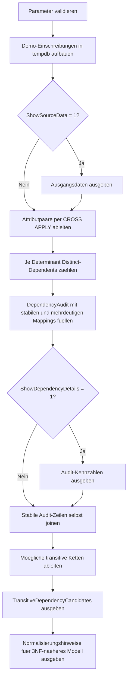

# DetectTransitiveDependencies.sql

Dieses Skript nutzt eine bewusst breite Einschreibungsrelation, um moegliche transitive Abhaengigkeiten sichtbar zu machen. Die Demo-Daten trennen nicht sauber zwischen Einschreibungsfakten, Kursstammdaten, Department-Informationen, Fakultaeten und Campus-Metadaten. Dadurch laesst sich gut zeigen, wie Attributketten wie `CourseCode -> DepartmentCode -> DepartmentName` als 3NF-Signal auffallen.

## Uebersicht

<!-- SQLDOC:SUMMARY_TABLE:BEGIN -->
| Feld | Wert |
|---|---|
| Script | [DetectTransitiveDependencies.sql](DetectTransitiveDependencies.sql) |
| Version | `1.0` |
| Typ | `didactic-lab` |
| Kapitel | `01_Normalformen` |
| Sicherheit | `read-only-tempdb` |
| Zweck | Markiert moegliche transitive Abhaengigkeiten fuer 3NF- und BCNF-Diskussionen. |
<!-- SQLDOC:SUMMARY_TABLE:END -->

## Einordnung

Der didaktische Schwerpunkt liegt auf einer typischen Problemstruktur: Eine Einschreibung identifiziert einen Kurs, der wiederum ein Department bestimmt, das wiederum einer Fakultaet zugeordnet ist. Wenn diese Zwischenstufen in derselben Relation stehen, koennen Nichtschluesselattribute ueber weitere Nichtschluesselattribute ableitbar sein.

## Annahmen

- Es handelt sich um eine didaktische Erstversion mit Demo-Daten in `tempdb`.
- Die fachliche Schluesselidee ist eine Einschreibungsrelation, deren Schluessel Attribute wie `CourseCode` und `RoomCode` mitfuehrt.
- Transitive Kandidaten werden datenbasiert aus stabil wirkenden Attributketten abgeleitet und dienen als Diskussionsgrundlage, nicht als formaler Beweis.

## Anwendungsfall

Das Skript eignet sich fuer Unterricht und Reviews zu 3NF und BCNF. Es zeigt zuerst funktional wirkende Attributpaare und leitet daraus anschliessend moegliche Ketten zwischen Nichtschluesselattributen ab. Die abschliessenden Normalisierungshinweise helfen dabei, aus der breiten Relation ein saubereres Zielmodell zu skizzieren.

## Parameter

<!-- SQLDOC:PARAMETERS_TABLE:BEGIN -->
| Parameter | SQL-Typ | Pflicht | Beschreibung |
|---|---|---|---|
| `@ShowSourceData` | `BIT` | Nein | Gibt bei `1` die didaktischen Ausgangsdaten der Einschreibungsrelation aus. |
| `@ShowDependencyDetails` | `BIT` | Nein | Gibt bei `1` die Kennzahlen zu den geprueften Attributpaaren aus. |
<!-- SQLDOC:PARAMETERS_TABLE:END -->

## Abhaengigkeiten

<!-- SQLDOC:DEPENDENCIES_LIST:BEGIN -->
- `tempdb` fuer temporaere Tabellen
- `CROSS APPLY`
- `GROUP BY`
- Self-Join auf den Audit-Ergebnissen
<!-- SQLDOC:DEPENDENCIES_LIST:END -->

## Hinweise

- `functional_dependency_supported` bedeutet hier, dass jeder beobachtete Determinantenwert genau einen abhaengigen Wert liefert.
- `transitive_dependency_likely` signalisiert eine didaktisch plausible Kette wie `EnrollmentKey -> CourseCode -> DepartmentCode -> DepartmentName`.
- Die Demo-Daten sind absichtlich stabil gehalten, damit das Normalformen-Muster klar sichtbar wird.

## Versionshistorie

<!-- SQLDOC:VERSION_HISTORY_TABLE:BEGIN -->
| Version | Datum | User | Beschreibung |
|---|---|---|---|
| `1.0` | `2026-04-16` | `ER` | Erstversion des didaktischen Audits fuer transitive Abhaengigkeiten |
<!-- SQLDOC:VERSION_HISTORY_TABLE:END -->

## Ablauf

<!-- SQLDOC:MERMAID:BEGIN -->

<!-- SQLDOC:MERMAID:END -->

## SQL-Code

<!-- SQLDOC:SQL_CODE:BEGIN -->
```sql
/*
BEGIN:SQL-HEADER v1
---
sql_header: v1
script_name: "DetectTransitiveDependencies.sql"
script_version: "1.0"
script_type: "didactic-lab"
chapter: "01_Normalformen"

purpose: >
  Analysiert eine didaktische Einschreibungsrelation auf funktionale und
  moeglich transitive Abhaengigkeiten. Das Skript zeigt, wie Nichtschluessel-
  attribute wie CourseCode, DepartmentCode oder FacultyCode weitere Attribute
  determinieren und damit Hinweise fuer 3NF- oder BCNF-Diskussionen liefern.

parameters:
  - name: "@ShowSourceData"
    sql_type: "BIT"
    direction: "IN"
    required: false
    description: "1 = Vorschau der didaktischen Ausgangsdaten ausgeben"
  - name: "@ShowDependencyDetails"
    sql_type: "BIT"
    direction: "IN"
    required: false
    description: "1 = zusaetzlich die einzelnen geprueften Attributpaare mit Kennzahlen ausgeben"

result_sets:
  - name: "SourceDataPreview"
    description: "Optionale Vorschau der denormalisierten Demo-Einschreibungen"
  - name: "DependencyAudit"
    description: "Bewertet, welche Attributpaare in den Demo-Daten wie funktionale Abhaengigkeiten aussehen"
  - name: "TransitiveDependencyCandidates"
    description: "Leitet moegliche transitive Ketten zwischen Nichtschluesselattributen ab"
  - name: "NormalizationHints"
    description: "Didaktische Hinweise fuer eine 3NF-naehere Zerlegung"

dependencies:
  - "tempdb temporary tables"
  - "CROSS APPLY"
  - "GROUP BY"
  - "self join on audit results"

safety:
  level: "read-only-tempdb"
  writes_data: false

documentation:
  markdown_file: "T-SQL/01_Normalformen/SQLScripts/DetectTransitiveDependencies.md"
  sync_blocks:
    - "SUMMARY_TABLE"
    - "PARAMETERS_TABLE"
    - "DEPENDENCIES_LIST"
    - "VERSION_HISTORY_TABLE"
    - "SQL_CODE"
  mermaid:
    mode: "ai-agent-from-sql"
    source: "script-body"

main_responsible:
  name: "Erhard Rainer"
  initials: "ER"

version_history:
  - version: "1.0"
    date: "2026-04-16"
    user: "ER"
    description: "Erstversion des didaktischen Audits fuer transitive Abhaengigkeiten"

notes:
  - "Die Demo-Daten nutzen bewusst eine breite Einschreibungsrelation statt produktiver Tabellen"
  - "Transitive Kandidaten werden datenbasiert aus stabil wirkenden Attributketten abgeleitet"
---
END:SQL-HEADER v1
*/

SET NOCOUNT ON;

DECLARE @ShowSourceData BIT = 1;
DECLARE @ShowDependencyDetails BIT = 1;

IF @ShowSourceData NOT IN (0, 1)
BEGIN
    THROW 50000, '@ShowSourceData muss 0 oder 1 sein.', 1;
END;

IF @ShowDependencyDetails NOT IN (0, 1)
BEGIN
    THROW 50001, '@ShowDependencyDetails muss 0 oder 1 sein.', 1;
END;

DROP TABLE IF EXISTS #EnrollmentWide;
DROP TABLE IF EXISTS #DependencyPairs;
DROP TABLE IF EXISTS #DependencyAudit;
DROP TABLE IF EXISTS #TransitiveCandidates;
DROP TABLE IF EXISTS #NormalizationHints;

CREATE TABLE #EnrollmentWide
(
    EnrollmentID    INT           NOT NULL,
    StudentNo       VARCHAR(20)   NOT NULL,
    TermCode        VARCHAR(20)   NOT NULL,
    CourseCode      VARCHAR(20)   NOT NULL,
    CourseTitle     VARCHAR(80)   NOT NULL,
    DepartmentCode  VARCHAR(20)   NOT NULL,
    DepartmentName  VARCHAR(80)   NOT NULL,
    FacultyCode     VARCHAR(20)   NOT NULL,
    FacultyName     VARCHAR(80)   NOT NULL,
    CampusCode      VARCHAR(20)   NOT NULL,
    CampusName      VARCHAR(80)   NOT NULL,
    RoomCode        VARCHAR(20)   NOT NULL
);

INSERT INTO #EnrollmentWide
(
    EnrollmentID,
    StudentNo,
    TermCode,
    CourseCode,
    CourseTitle,
    DepartmentCode,
    DepartmentName,
    FacultyCode,
    FacultyName,
    CampusCode,
    CampusName,
    RoomCode
)
VALUES
    (101, 'S-1001', '2026S', 'DB100', 'Relationale Grundlagen',       'CS', 'Computer Science',       'STEM', 'School of STEM',          'BER', 'Berlin Campus', 'BER-A12'),
    (102, 'S-1002', '2026S', 'DB100', 'Relationale Grundlagen',       'CS', 'Computer Science',       'STEM', 'School of STEM',          'BER', 'Berlin Campus', 'BER-A12'),
    (103, 'S-1003', '2026S', 'DB210', 'Normalization Workshop',       'CS', 'Computer Science',       'STEM', 'School of STEM',          'BER', 'Berlin Campus', 'BER-B05'),
    (104, 'S-1004', '2026S', 'QA110', 'Quality Assurance Basics',     'QA', 'Quality Engineering',    'STEM', 'School of STEM',          'MUC', 'Munich Campus', 'MUC-C02'),
    (105, 'S-1005', '2026S', 'QA110', 'Quality Assurance Basics',     'QA', 'Quality Engineering',    'STEM', 'School of STEM',          'MUC', 'Munich Campus', 'MUC-C02'),
    (106, 'S-1006', '2026S', 'PM200', 'Projektkommunikation',         'BUS', 'Business Administration', 'BUS', 'School of Business',   'HAM', 'Hamburg Campus', 'HAM-D11'),
    (107, 'S-1007', '2026W', 'DB100', 'Relationale Grundlagen',       'CS', 'Computer Science',       'STEM', 'School of STEM',          'BER', 'Berlin Campus', 'BER-A12'),
    (108, 'S-1008', '2026W', 'PM200', 'Projektkommunikation',         'BUS', 'Business Administration', 'BUS', 'School of Business',   'HAM', 'Hamburg Campus', 'HAM-D11');

IF @ShowSourceData = 1
BEGIN
    SELECT
        ew.EnrollmentID,
        ew.StudentNo,
        ew.TermCode,
        ew.CourseCode,
        ew.CourseTitle,
        ew.DepartmentCode,
        ew.DepartmentName,
        ew.FacultyCode,
        ew.FacultyName,
        ew.CampusCode,
        ew.CampusName,
        ew.RoomCode
    FROM #EnrollmentWide AS ew
    ORDER BY
        ew.EnrollmentID;
END;

CREATE TABLE #DependencyPairs
(
    DeterminantAttribute  VARCHAR(40)  NOT NULL,
    DependentAttribute    VARCHAR(40)  NOT NULL,
    DeterminantValue      VARCHAR(80)  NOT NULL,
    DependentValue        VARCHAR(80)  NOT NULL
);

INSERT INTO #DependencyPairs
(
    DeterminantAttribute,
    DependentAttribute,
    DeterminantValue,
    DependentValue
)
SELECT
    pair.DeterminantAttribute,
    pair.DependentAttribute,
    pair.DeterminantValue,
    pair.DependentValue
FROM #EnrollmentWide AS ew
CROSS APPLY
(
    VALUES
        ('CourseCode',     'CourseTitle',    ew.CourseCode,     ew.CourseTitle),
        ('CourseCode',     'DepartmentCode', ew.CourseCode,     ew.DepartmentCode),
        ('DepartmentCode', 'DepartmentName', ew.DepartmentCode, ew.DepartmentName),
        ('DepartmentCode', 'FacultyCode',    ew.DepartmentCode, ew.FacultyCode),
        ('FacultyCode',    'FacultyName',    ew.FacultyCode,    ew.FacultyName),
        ('CampusCode',     'CampusName',     ew.CampusCode,     ew.CampusName),
        ('RoomCode',       'CampusCode',     ew.RoomCode,       ew.CampusCode)
) AS pair(DeterminantAttribute, DependentAttribute, DeterminantValue, DependentValue);

CREATE TABLE #DependencyAudit
(
    DeterminantAttribute      VARCHAR(40)   NOT NULL,
    DependentAttribute        VARCHAR(40)   NOT NULL,
    DistinctDeterminants      INT           NOT NULL,
    MaxDependentValues        INT           NOT NULL,
    StableMappings            INT           NOT NULL,
    AmbiguousMappings         INT           NOT NULL,
    DependencyStatus          VARCHAR(40)   NOT NULL,
    Interpretation            VARCHAR(240)  NOT NULL
);

INSERT INTO #DependencyAudit
(
    DeterminantAttribute,
    DependentAttribute,
    DistinctDeterminants,
    MaxDependentValues,
    StableMappings,
    AmbiguousMappings,
    DependencyStatus,
    Interpretation
)
SELECT
    summary.DeterminantAttribute,
    summary.DependentAttribute,
    COUNT(*) AS DistinctDeterminants,
    MAX(summary.DependentValuesPerDeterminant) AS MaxDependentValues,
    SUM(CASE WHEN summary.DependentValuesPerDeterminant = 1 THEN 1 ELSE 0 END) AS StableMappings,
    SUM(CASE WHEN summary.DependentValuesPerDeterminant > 1 THEN 1 ELSE 0 END) AS AmbiguousMappings,
    CASE
        WHEN MAX(summary.DependentValuesPerDeterminant) = 1 THEN 'functional_dependency_supported'
        ELSE 'mapping_not_stable'
    END AS DependencyStatus,
    CASE
        WHEN MAX(summary.DependentValuesPerDeterminant) = 1 THEN 'Jeder beobachtete Determinantenwert verweist in den Demo-Daten auf genau einen abhaengigen Wert.'
        ELSE 'Mindestens ein Determinantenwert verweist auf mehrere abhaengige Werte; die Abhaengigkeit ist in den Demo-Daten nicht stabil.'
    END AS Interpretation
FROM
(
    SELECT
        dp.DeterminantAttribute,
        dp.DependentAttribute,
        dp.DeterminantValue,
        COUNT(DISTINCT dp.DependentValue) AS DependentValuesPerDeterminant
    FROM #DependencyPairs AS dp
    GROUP BY
        dp.DeterminantAttribute,
        dp.DependentAttribute,
        dp.DeterminantValue
) AS summary
GROUP BY
    summary.DeterminantAttribute,
    summary.DependentAttribute;

IF @ShowDependencyDetails = 1
BEGIN
    SELECT
        da.DeterminantAttribute,
        da.DependentAttribute,
        da.DistinctDeterminants,
        da.MaxDependentValues,
        da.StableMappings,
        da.AmbiguousMappings,
        da.DependencyStatus,
        da.Interpretation
    FROM #DependencyAudit AS da
    ORDER BY
        da.DeterminantAttribute,
        da.DependentAttribute;
END;

CREATE TABLE #TransitiveCandidates
(
    ChainLabel             VARCHAR(120)  NOT NULL,
    KeyDependency          VARCHAR(120)  NOT NULL,
    IntermediateDependency VARCHAR(120)  NOT NULL,
    FinalDependency        VARCHAR(120)  NOT NULL,
    NormalFormSignal       VARCHAR(40)   NOT NULL,
    Interpretation         VARCHAR(260)  NOT NULL
);

INSERT INTO #TransitiveCandidates
(
    ChainLabel,
    KeyDependency,
    IntermediateDependency,
    FinalDependency,
    NormalFormSignal,
    Interpretation
)
SELECT
    CONCAT('EnrollmentKey -> ', first_link.DeterminantAttribute, ' -> ', second_link.DependentAttribute) AS ChainLabel,
    CONCAT('EnrollmentKey -> ', first_link.DeterminantAttribute) AS KeyDependency,
    CONCAT(first_link.DeterminantAttribute, ' -> ', first_link.DependentAttribute) AS IntermediateDependency,
    CONCAT(second_link.DeterminantAttribute, ' -> ', second_link.DependentAttribute) AS FinalDependency,
    CASE
        WHEN second_link.DependentAttribute IN ('DepartmentName', 'FacultyCode', 'FacultyName', 'CampusName') THEN 'transitive_dependency_likely'
        ELSE 'review_needed'
    END AS NormalFormSignal,
    CASE
        WHEN second_link.DependentAttribute IN ('DepartmentName', 'FacultyCode', 'FacultyName', 'CampusName') THEN 'Die Einschreibungsrelation haelt Nichtschluesselattribute vor, die ueber ein weiteres Nichtschluesselattribut stabil ableitbar sind; das ist ein didaktischer Hinweis auf eine transitive Abhaengigkeit ausserhalb der 3NF.'
        ELSE 'Die Daten zeigen eine moegliche Attributkette, die fuer eine genauere Normalformen-Pruefung weiter untersucht werden sollte.'
    END AS Interpretation
FROM #DependencyAudit AS first_link
INNER JOIN #DependencyAudit AS second_link
    ON second_link.DeterminantAttribute = first_link.DependentAttribute
WHERE first_link.DependencyStatus = 'functional_dependency_supported'
  AND second_link.DependencyStatus = 'functional_dependency_supported'
  AND first_link.DeterminantAttribute IN ('CourseCode', 'DepartmentCode', 'RoomCode')
  AND second_link.DependentAttribute <> first_link.DeterminantAttribute;

SELECT
    tc.ChainLabel,
    tc.KeyDependency,
    tc.IntermediateDependency,
    tc.FinalDependency,
    tc.NormalFormSignal,
    tc.Interpretation
FROM #TransitiveCandidates AS tc
ORDER BY
    CASE tc.NormalFormSignal
        WHEN 'transitive_dependency_likely' THEN 1
        ELSE 2
    END,
    tc.ChainLabel;

CREATE TABLE #NormalizationHints
(
    StepNumber           INT           NOT NULL,
    SuggestedRelation    VARCHAR(60)   NOT NULL,
    SuggestedKey         VARCHAR(120)  NOT NULL,
    ColumnsToKeep        VARCHAR(220)  NOT NULL,
    Reasoning            VARCHAR(260)  NOT NULL
);

INSERT INTO #NormalizationHints
(
    StepNumber,
    SuggestedRelation,
    SuggestedKey,
    ColumnsToKeep,
    Reasoning
)
VALUES
    (1, 'Enrollment',  'EnrollmentID', 'EnrollmentID, StudentNo, TermCode, CourseCode, RoomCode', 'Die Einschreibung behaelt nur die direkt zur Registrierung gehoerenden Fakten.'),
    (2, 'Course',      'CourseCode',   'CourseCode, CourseTitle, DepartmentCode',                  'Kursstammdaten werden separat gefuehrt, damit CourseTitle und DepartmentCode nicht pro Einschreibung wiederholt werden.'),
    (3, 'Department',  'DepartmentCode', 'DepartmentCode, DepartmentName, FacultyCode',            'DepartmentName und FacultyCode haengen stabil vom DepartmentCode ab und koennen in eine eigene Relation ausgelagert werden.'),
    (4, 'Faculty',     'FacultyCode',  'FacultyCode, FacultyName',                                 'FacultyName wird als Stammdatendetail der Fakultaet getrennt gehalten.'),
    (5, 'Campus',      'CampusCode',   'CampusCode, CampusName',                                   'CampusName wird zentral ueber CampusCode gepflegt statt indirekt ueber Raum- oder Einschreibungsdaten.');

SELECT
    nh.StepNumber,
    nh.SuggestedRelation,
    nh.SuggestedKey,
    nh.ColumnsToKeep,
    nh.Reasoning
FROM #NormalizationHints AS nh
ORDER BY
    nh.StepNumber;
```
<!-- SQLDOC:SQL_CODE:END -->
