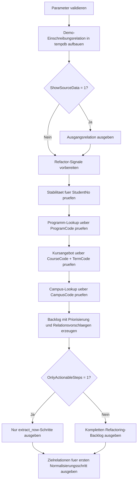

# NormalizationRefactorStarter.sql

Dieses Skript liefert einen didaktischen Startpunkt fuer die Zerlegung einer breiten Einschreibungsrelation. Die SQL-Datei arbeitet mit Demo-Daten, misst wiederholte Stammdaten je Themenbereich und leitet daraus einen priorisierten Refactoring-Backlog fuer den ersten Normalisierungsschritt ab.

## Uebersicht

<!-- SQLDOC:SUMMARY_TABLE:BEGIN -->
| Feld | Wert |
|---|---|
| Script | [NormalizationRefactorStarter.sql](NormalizationRefactorStarter.sql) |
| Version | `1.0` |
| Typ | `didactic-lab` |
| Kapitel | `01_Normalformen` |
| Sicherheit | `read-only-tempdb` |
| Zweck | Didaktischer Refactoring-Starter fuer die Zerlegung einer denormalisierten Einschreibungsrelation. |
<!-- SQLDOC:SUMMARY_TABLE:END -->

## Einordnung

Im Unterschied zu einer reinen Normalformpruefung fokussiert dieses Skript die Frage, welche Spaltengruppen zuerst aus einer breiten Tabelle ausgelagert werden sollten. Dazu werden stabile Zuordnungen gesucht, Duplikate je Kandidatenschluessel gezaehlt und daraus konkrete Relationsvorschlaege fuer den Refactoring-Start abgeleitet.

## Annahmen

- Es handelt sich um eine didaktische Erstversion mit Demo-Daten in `tempdb`.
- `StudentNo`, `ProgramCode`, `CampusCode` und `CourseCode + TermCode` dienen als plausible Identifikatoren fuer auslagerbare Teilrelationen.
- `EnrollmentID` bleibt in der Zielstruktur als einfacher Identifier fuer die Einschreibung erhalten, waehrend fachliche Stammdaten ausgelagert werden.
- Die vorgeschlagenen Zielrelationen sind ein fachlich plausibler Startpunkt fuer Unterricht und Review, keine automatische Vollnormalisierung.

## Anwendungsfall

Das Skript eignet sich fuer Workshops, Refactoring-Diskussionen und Unterrichtseinheiten, in denen nicht nur Redundanz gezeigt, sondern auch eine erste Umsetzungsreihenfolge begruendet werden soll. Besonders hilfreich ist es, wenn Lernende aus einer breiten Relation schrittweise zu kleineren Stammdaten-, Lookup- und Angebotsrelationen fuehrt werden sollen.

## Parameter

<!-- SQLDOC:PARAMETERS_TABLE:BEGIN -->
| Parameter | SQL-Typ | Pflicht | Beschreibung |
|---|---|---|---|
| `@ShowSourceData` | `BIT` | Nein | Gibt bei `1` eine Vorschau der denormalisierten Ausgangsrelation aus. |
| `@OnlyActionableSteps` | `BIT` | Nein | Filtert bei `1` den Backlog auf unmittelbar auslagerbare Refactoring-Schritte. |
<!-- SQLDOC:PARAMETERS_TABLE:END -->

## Abhaengigkeiten

<!-- SQLDOC:DEPENDENCIES_LIST:BEGIN -->
- `tempdb` fuer temporaere Tabellen
- `GROUP BY`
- `COUNT(DISTINCT ...)`
- `CASE`
<!-- SQLDOC:DEPENDENCIES_LIST:END -->

## Hinweise

- `extract_now` bedeutet hier, dass jeder beobachtete Kandidatenschluessel in den Demo-Daten genau eine stabile Attributgruppe liefert.
- `DuplicateRowsAffected` zaehlt, wie viele Wiederholungen sich durch eine Auslagerung in der breiten Einschreibungsrelation reduzieren lassen.
- Das letzte Resultset uebersetzt den Backlog in eine kompakte Zielstruktur mit vorgeschlagenen Schluesseln und Rollen im Refactoring.

## Versionshistorie

<!-- SQLDOC:VERSION_HISTORY_TABLE:BEGIN -->
| Version | Datum | User | Beschreibung |
|---|---|---|---|
| `1.0` | `2026-04-16` | `ER` | Erstversion des didaktischen Starters fuer ein Normalisierungs-Refactoring |
<!-- SQLDOC:VERSION_HISTORY_TABLE:END -->

## Ablauf

<!-- SQLDOC:MERMAID:BEGIN -->

<!-- SQLDOC:MERMAID:END -->

## SQL-Code

<!-- SQLDOC:SQL_CODE:BEGIN -->
```sql
/*
BEGIN:SQL-HEADER v1
---
sql_header: v1
script_name: "NormalizationRefactorStarter.sql"
script_version: "1.0"
script_type: "didactic-lab"
chapter: "01_Normalformen"

purpose: >
  Zeigt einen didaktischen Startpunkt fuer die Zerlegung einer
  denormalisierten Einschreibungsrelation. Das Skript identifiziert
  Redundanz-Hotspots, leitet daraus stabile Refactoring-Bausteine ab und
  skizziert eine moegliche Zielstruktur fuer den ersten Normalisierungsschritt.

parameters:
  - name: "@ShowSourceData"
    sql_type: "BIT"
    direction: "IN"
    required: false
    description: "1 = Vorschau der denormalisierten Ausgangsrelation ausgeben"
  - name: "@OnlyActionableSteps"
    sql_type: "BIT"
    direction: "IN"
    required: false
    description: "1 = nur Refactoring-Schritte mit klarer Auslagerungsempfehlung zeigen"

result_sets:
  - name: "SourceRelationPreview"
    description: "Optionale Vorschau der breiten Demo-Einschreibungsrelation"
  - name: "RefactorBacklog"
    description: "Leitet aus beobachteten Abhaengigkeiten konkrete Refactoring-Bausteine ab"
  - name: "ProposedTargetRelations"
    description: "Skizziert eine erste Zielstruktur fuer die normalisierte Aufteilung"

dependencies:
  - "tempdb temporary tables"
  - "GROUP BY"
  - "COUNT(DISTINCT ...)"
  - "CASE"

safety:
  level: "read-only-tempdb"
  writes_data: false

documentation:
  markdown_file: "T-SQL/01_Normalformen/SQLScripts/NormalizationRefactorStarter.md"
  sync_blocks:
    - "SUMMARY_TABLE"
    - "PARAMETERS_TABLE"
    - "DEPENDENCIES_LIST"
    - "VERSION_HISTORY_TABLE"
    - "SQL_CODE"
  mermaid:
    mode: "ai-agent-from-sql"
    source: "script-body"

main_responsible:
  name: "Erhard Rainer"
  initials: "ER"

version_history:
  - version: "1.0"
    date: "2026-04-16"
    user: "ER"
    description: "Erstversion des didaktischen Starters fuer ein Normalisierungs-Refactoring"

notes:
  - "Die Demo-Daten modellieren absichtlich eine breite Einschreibungsrelation mit wiederholten Stammdaten"
  - "Die Zielstruktur ist ein fachlich plausibler Refactoring-Startpunkt und keine vollautomatische Normalformbewertung"
---
END:SQL-HEADER v1
*/

SET NOCOUNT ON;

DECLARE @ShowSourceData BIT = 1;
DECLARE @OnlyActionableSteps BIT = 0;

IF @ShowSourceData NOT IN (0, 1)
BEGIN
    THROW 50000, '@ShowSourceData muss 0 oder 1 sein.', 1;
END;

IF @OnlyActionableSteps NOT IN (0, 1)
BEGIN
    THROW 50001, '@OnlyActionableSteps muss 0 oder 1 sein.', 1;
END;

DROP TABLE IF EXISTS #EnrollmentWide;
DROP TABLE IF EXISTS #RefactorSignals;
DROP TABLE IF EXISTS #RefactorBacklog;
DROP TABLE IF EXISTS #ProposedTargetRelations;

CREATE TABLE #EnrollmentWide
(
    EnrollmentID      INT          NOT NULL,
    StudentNo         VARCHAR(20)  NOT NULL,
    StudentName       VARCHAR(80)  NOT NULL,
    ProgramCode       VARCHAR(20)  NOT NULL,
    ProgramName       VARCHAR(80)  NOT NULL,
    AdvisorCode       VARCHAR(20)  NOT NULL,
    AdvisorName       VARCHAR(80)  NOT NULL,
    CampusCode        VARCHAR(20)  NOT NULL,
    CampusName        VARCHAR(80)  NOT NULL,
    CourseCode        VARCHAR(20)  NOT NULL,
    CourseTitle       VARCHAR(80)  NOT NULL,
    TermCode          VARCHAR(20)  NOT NULL,
    InstructorCode    VARCHAR(20)  NOT NULL,
    InstructorName    VARCHAR(80)  NOT NULL,
    DeliveryMode      VARCHAR(20)  NOT NULL,
    RoomCode          VARCHAR(20)  NOT NULL,
    RoomCapacity      INT          NOT NULL
);

INSERT INTO #EnrollmentWide
(
    EnrollmentID,
    StudentNo,
    StudentName,
    ProgramCode,
    ProgramName,
    AdvisorCode,
    AdvisorName,
    CampusCode,
    CampusName,
    CourseCode,
    CourseTitle,
    TermCode,
    InstructorCode,
    InstructorName,
    DeliveryMode,
    RoomCode,
    RoomCapacity
)
VALUES
    (1001, 'S-1001', 'Anna Berger',   'CS-BSC',  'Computer Science BSc',    'ADV-CS1', 'Dr. Koch',    'BER', 'Berlin Campus',  'DB100', 'Relationale Grundlagen', '2026S', 'INS-DB1', 'Prof. Winter',  'Onsite', 'R-101', 30),
    (1002, 'S-1002', 'Boris Klein',   'CS-BSC',  'Computer Science BSc',    'ADV-CS1', 'Dr. Koch',    'BER', 'Berlin Campus',  'DB100', 'Relationale Grundlagen', '2026S', 'INS-DB1', 'Prof. Winter',  'Onsite', 'R-101', 30),
    (1003, 'S-1003', 'Cem Yilmaz',    'CS-BSC',  'Computer Science BSc',    'ADV-CS2', 'Dr. Lorenz',  'HAM', 'Hamburg Campus', 'DB100', 'Relationale Grundlagen', '2026W', 'INS-DB3', 'Prof. Malik',   'Hybrid', 'H-205', 26),
    (1004, 'S-1004', 'Dina Maurer',   'QA-BSC',  'Quality Engineering BSc', 'ADV-QA1', 'Dr. Weiss',   'MUC', 'Munich Campus',  'QA210', 'Testing Foundations',    '2026S', 'INS-QA1', 'Prof. Hartmann','Onsite', 'M-120', 24),
    (1005, 'S-1005', 'Eva Schmitt',   'QA-BSC',  'Quality Engineering BSc', 'ADV-QA1', 'Dr. Weiss',   'MUC', 'Munich Campus',  'QA210', 'Testing Foundations',    '2026S', 'INS-QA1', 'Prof. Hartmann','Onsite', 'M-120', 24),
    (1006, 'S-1006', 'Farid Osman',   'BUS-MSC', 'Business Analytics MSc',  'ADV-BI1', 'Prof. Stein', 'BER', 'Berlin Campus',  'BI300', 'Analytics Sprint',       '2026S', 'INS-BI2', 'Prof. Seidel',  'Remote', 'R-330', 18),
    (1007, 'S-1007', 'Greta Nowak',   'BUS-MSC', 'Business Analytics MSc',  'ADV-BI1', 'Prof. Stein', 'BER', 'Berlin Campus',  'BI300', 'Analytics Sprint',       '2026S', 'INS-BI2', 'Prof. Seidel',  'Remote', 'R-330', 18),
    (1008, 'S-1008', 'Hasan Demir',   'CS-MSC',  'Data Engineering MSc',    'ADV-CS3', 'Prof. Adler', 'HAM', 'Hamburg Campus', 'DB220', 'Data Modeling Studio',   '2026W', 'INS-DB4', 'Prof. Kraus',   'Hybrid', 'H-410', 28);

IF @ShowSourceData = 1
BEGIN
    SELECT
        ew.EnrollmentID,
        ew.StudentNo,
        ew.StudentName,
        ew.ProgramCode,
        ew.ProgramName,
        ew.AdvisorCode,
        ew.AdvisorName,
        ew.CampusCode,
        ew.CampusName,
        ew.CourseCode,
        ew.CourseTitle,
        ew.TermCode,
        ew.InstructorCode,
        ew.InstructorName,
        ew.DeliveryMode,
        ew.RoomCode,
        ew.RoomCapacity
    FROM #EnrollmentWide AS ew
    ORDER BY
        ew.CourseCode,
        ew.TermCode,
        ew.StudentNo;
END;

CREATE TABLE #RefactorSignals
(
    RefactorArea            VARCHAR(80)   NOT NULL,
    CandidateKey            VARCHAR(80)   NOT NULL,
    ColumnsToExtract        VARCHAR(200)  NOT NULL,
    StableGroups            INT           NOT NULL,
    MaxVariantsPerKey       INT           NOT NULL,
    DuplicateRowsAffected   INT           NOT NULL,
    ExtractionReadiness     VARCHAR(30)   NOT NULL,
    WhyItMatters            VARCHAR(260)  NOT NULL
);

INSERT INTO #RefactorSignals
(
    RefactorArea,
    CandidateKey,
    ColumnsToExtract,
    StableGroups,
    MaxVariantsPerKey,
    DuplicateRowsAffected,
    ExtractionReadiness,
    WhyItMatters
)
SELECT
    'Student master data',
    'StudentNo',
    'StudentName, ProgramCode, AdvisorCode, CampusCode',
    COUNT(*) AS StableGroups,
    MAX(StudentVariantCount) AS MaxVariantsPerKey,
    SUM(StudentRows - 1) AS DuplicateRowsAffected,
    CASE
        WHEN MAX(StudentVariantCount) = 1 THEN 'extract_now'
        ELSE 'review_first'
    END AS ExtractionReadiness,
    'Studierendenstammdaten wiederholen sich ueber mehrere Einschreibungen und eignen sich fuer eine eigene Student-Relation.'
FROM
(
    SELECT
        ew.StudentNo,
        COUNT(*) AS StudentRows,
        COUNT(DISTINCT CONCAT(ew.StudentName, '|', ew.ProgramCode, '|', ew.AdvisorCode, '|', ew.CampusCode)) AS StudentVariantCount
    FROM #EnrollmentWide AS ew
    GROUP BY
        ew.StudentNo
) AS StudentCheck

UNION ALL

SELECT
    'Program lookup',
    'ProgramCode',
    'ProgramName',
    COUNT(*) AS StableGroups,
    MAX(ProgramVariantCount) AS MaxVariantsPerKey,
    SUM(ProgramRows - 1) AS DuplicateRowsAffected,
    CASE
        WHEN MAX(ProgramVariantCount) = 1 THEN 'extract_now'
        ELSE 'review_first'
    END AS ExtractionReadiness,
    'Programmbezeichnungen lassen sich als kleine Lookup-Relation auslagern und entlasten jede Einschreibungszeile.'
FROM
(
    SELECT
        ew.ProgramCode,
        COUNT(*) AS ProgramRows,
        COUNT(DISTINCT ew.ProgramName) AS ProgramVariantCount
    FROM #EnrollmentWide AS ew
    GROUP BY
        ew.ProgramCode
) AS ProgramCheck

UNION ALL

SELECT
    'Course offering',
    'CourseCode + TermCode',
    'CourseTitle, InstructorCode, InstructorName, DeliveryMode, RoomCode, RoomCapacity',
    COUNT(*) AS StableGroups,
    MAX(OfferingVariantCount) AS MaxVariantsPerKey,
    SUM(OfferingRows - 1) AS DuplicateRowsAffected,
    CASE
        WHEN MAX(OfferingVariantCount) = 1 THEN 'extract_now'
        ELSE 'review_first'
    END AS ExtractionReadiness,
    'Kursangebot und Durchfuehrung wiederholen sich je Teilnehmer und sind ein klarer Kandidat fuer eine Angebotsrelation.'
FROM
(
    SELECT
        ew.CourseCode,
        ew.TermCode,
        COUNT(*) AS OfferingRows,
        COUNT(DISTINCT CONCAT(ew.CourseTitle, '|', ew.InstructorCode, '|', ew.InstructorName, '|', ew.DeliveryMode, '|', ew.RoomCode, '|', ew.RoomCapacity)) AS OfferingVariantCount
    FROM #EnrollmentWide AS ew
    GROUP BY
        ew.CourseCode,
        ew.TermCode
) AS OfferingCheck

UNION ALL

SELECT
    'Campus lookup',
    'CampusCode',
    'CampusName',
    COUNT(*) AS StableGroups,
    MAX(CampusVariantCount) AS MaxVariantsPerKey,
    SUM(CampusRows - 1) AS DuplicateRowsAffected,
    CASE
        WHEN MAX(CampusVariantCount) = 1 THEN 'extract_now'
        ELSE 'review_first'
    END AS ExtractionReadiness,
    'Campus-Stammdaten koennen als Referenzrelation ausgelagert werden, damit Standortnamen nicht pro Einschreibung dupliziert werden.'
FROM
(
    SELECT
        ew.CampusCode,
        COUNT(*) AS CampusRows,
        COUNT(DISTINCT ew.CampusName) AS CampusVariantCount
    FROM #EnrollmentWide AS ew
    GROUP BY
        ew.CampusCode
) AS CampusCheck;

CREATE TABLE #RefactorBacklog
(
    StepNumber             INT           NOT NULL,
    RefactorArea           VARCHAR(80)   NOT NULL,
    CandidateKey           VARCHAR(80)   NOT NULL,
    ColumnsToExtract       VARCHAR(200)  NOT NULL,
    DuplicateRowsAffected  INT           NOT NULL,
    ExtractionReadiness    VARCHAR(30)   NOT NULL,
    RecommendedRelation    VARCHAR(160)  NOT NULL,
    RefactorAction         VARCHAR(260)  NOT NULL
);

INSERT INTO #RefactorBacklog
(
    StepNumber,
    RefactorArea,
    CandidateKey,
    ColumnsToExtract,
    DuplicateRowsAffected,
    ExtractionReadiness,
    RecommendedRelation,
    RefactorAction
)
SELECT
    ROW_NUMBER() OVER
    (
        ORDER BY
            CASE rs.ExtractionReadiness
                WHEN 'extract_now' THEN 0
                ELSE 1
            END,
            rs.DuplicateRowsAffected DESC,
            rs.RefactorArea
    ) AS StepNumber,
    rs.RefactorArea,
    rs.CandidateKey,
    rs.ColumnsToExtract,
    rs.DuplicateRowsAffected,
    rs.ExtractionReadiness,
    CASE rs.RefactorArea
        WHEN 'Student master data' THEN 'Student(StudentNo, StudentName, ProgramCode, AdvisorCode, CampusCode)'
        WHEN 'Program lookup' THEN 'Program(ProgramCode, ProgramName)'
        WHEN 'Course offering' THEN 'CourseOffering(CourseCode, TermCode, CourseTitle, InstructorCode, InstructorName, DeliveryMode, RoomCode, RoomCapacity)'
        WHEN 'Campus lookup' THEN 'Campus(CampusCode, CampusName)'
    END AS RecommendedRelation,
    CASE rs.RefactorArea
        WHEN 'Student master data' THEN 'Lagere Stammdaten zum Lernenden aus und behalte im Enrollment nur StudentNo als Referenz.'
        WHEN 'Program lookup' THEN 'Fuehre ProgramCode als Fremdschluessel und pflege den Namen nur noch an einer Stelle.'
        WHEN 'Course offering' THEN 'Trenne Angebotsattribute von der Einschreibung und referenziere das Angebot ueber CourseCode + TermCode.'
        WHEN 'Campus lookup' THEN 'Ersetze wiederholte Campus-Namen durch einen kompakten Lookup auf CampusCode.'
    END AS RefactorAction
FROM #RefactorSignals AS rs;

SELECT
    rb.StepNumber,
    rb.RefactorArea,
    rb.CandidateKey,
    rb.ColumnsToExtract,
    rb.DuplicateRowsAffected,
    rb.ExtractionReadiness,
    rb.RecommendedRelation,
    rb.RefactorAction
FROM #RefactorBacklog AS rb
WHERE @OnlyActionableSteps = 0
   OR rb.ExtractionReadiness = 'extract_now'
ORDER BY
    rb.StepNumber;

CREATE TABLE #ProposedTargetRelations
(
    StepNumber        INT           NOT NULL,
    RelationName      VARCHAR(80)   NOT NULL,
    SuggestedKey      VARCHAR(80)   NOT NULL,
    ColumnsToKeep     VARCHAR(220)  NOT NULL,
    RoleInRefactor    VARCHAR(260)  NOT NULL
);

INSERT INTO #ProposedTargetRelations
(
    StepNumber,
    RelationName,
    SuggestedKey,
    ColumnsToKeep,
    RoleInRefactor
)
VALUES
    (1, 'Student', 'StudentNo', 'StudentNo, StudentName, ProgramCode, AdvisorCode, CampusCode', 'Entfernt wiederholte Lernendenstammdaten aus der Einschreibungsrelation.'),
    (2, 'Program', 'ProgramCode', 'ProgramCode, ProgramName', 'Fuehrt Programmnamen als kleine Lookup-Relation.'),
    (3, 'Campus', 'CampusCode', 'CampusCode, CampusName', 'Zentralisiert Standortnamen fuer Wiederverwendung.'),
    (4, 'CourseOffering', 'CourseCode, TermCode', 'CourseCode, TermCode, CourseTitle, InstructorCode, InstructorName, DeliveryMode, RoomCode, RoomCapacity', 'Kapselt das konkrete Kursangebot eines Termins.'),
    (5, 'Enrollment', 'EnrollmentID', 'EnrollmentID, StudentNo, CourseCode, TermCode', 'Behaelt nur noch die eigentliche Einschreibung und verweist auf ausgelagerte Stammdaten.');

SELECT
    ptr.StepNumber,
    ptr.RelationName,
    ptr.SuggestedKey,
    ptr.ColumnsToKeep,
    ptr.RoleInRefactor
FROM #ProposedTargetRelations AS ptr
ORDER BY
    ptr.StepNumber;
```
<!-- SQLDOC:SQL_CODE:END -->
