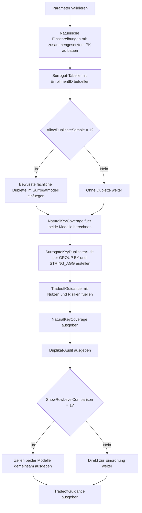

# SurrogateKeyTradeoffDemo.sql

Dieses Skript stellt zwei Modellierungsvarianten fuer dieselbe Einschreibungssituation gegenueber. Die natuerliche Variante nutzt den fachlichen Schluessel `StudentNo + CourseCode + TermCode` direkt als Primaerschluessel, waehrend die zweite Variante eine technische `EnrollmentID` verwendet und damit die Business-Regel nur noch implizit mitfuehrt.

## Uebersicht

<!-- SQLDOC:SUMMARY_TABLE:BEGIN -->
| Feld | Wert |
|---|---|
| Script | [SurrogateKeyTradeoffDemo.sql](SurrogateKeyTradeoffDemo.sql) |
| Version | `1.0` |
| Typ | `didactic-lab` |
| Kapitel | `01_Normalformen` |
| Sicherheit | `read-only-tempdb` |
| Zweck | Zeigt Vor- und Nachteile von Surrogatschluesseln gegen natuerliche Keys. |
<!-- SQLDOC:SUMMARY_TABLE:END -->

## Einordnung

Der Vergleich ist als Lernskript fuer Normalformen, Schluesseldesign und Integritaetsregeln gedacht. Das Skript zeigt nicht nur, dass ein Surrogatschluessel technische Vorteile haben kann, sondern auch, dass die fachliche Eindeutigkeit nicht automatisch mitwandert, wenn sie nicht zusaetzlich per Constraint oder Audit abgesichert wird.

## Annahmen

- Die Demo modelliert Einschreibungen mit `StudentNo + CourseCode + TermCode` als fachlich stabilem Business Key.
- Beide Modellvarianten liegen nur in temporaeren Tabellen vor und greifen nicht auf produktive Daten zu.
- Die optionale Dublette im Surrogatschluessel-Modell ist bewusst eingebaut, um den Integritaetsunterschied sichtbar zu machen.

## Anwendungsfall

Das Skript eignet sich fuer Unterricht, Architekturgespraeche und Reviews rund um Schluesseldesign. Es laesst sich gut einsetzen, um zu diskutieren, wann ein natuerlicher Schluessel selbsterklaerend genug ist und wann ein Surrogatschluessel sinnvoll wird, sofern die Business-Regel separat erhalten bleibt.

## Parameter

<!-- SQLDOC:PARAMETERS_TABLE:BEGIN -->
| Parameter | SQL-Typ | Pflicht | Beschreibung |
|---|---|---|---|
| `@AllowDuplicateSample` | `BIT` | Nein | Fuegt bei `1` im Surrogatschluessel-Modell eine fachliche Dublette ein. |
| `@ShowRowLevelComparison` | `BIT` | Nein | Gibt bei `1` die Demo-Zeilen beider Modellvarianten aus. |
<!-- SQLDOC:PARAMETERS_TABLE:END -->

## Abhaengigkeiten

<!-- SQLDOC:DEPENDENCIES_LIST:BEGIN -->
- `tempdb` fuer temporaere Tabellen
- `IDENTITY`
- `GROUP BY`
- `UNION ALL`
<!-- SQLDOC:DEPENDENCIES_LIST:END -->

## Hinweise

- Im natuerlichen Modell kann dieselbe Einschreibung nicht doppelt eingefuegt werden, weil der zusammengesetzte Primaerschluessel die Fachregel direkt repraesentiert.
- Im Surrogatmodell unterscheidet `EnrollmentID` zwar jede Zeile technisch, verhindert aber ohne weiteren `UNIQUE`-Constraint keine doppelte Einschreibung.
- Das Skript bewertet den Trade-off didaktisch: schmale technische Schluessel vereinfachen Referenzen, ersetzen aber keine fachliche Integritaetsregel.

## Versionshistorie

<!-- SQLDOC:VERSION_HISTORY_TABLE:BEGIN -->
| Version | Datum | User | Beschreibung |
|---|---|---|---|
| `1.0` | `2026-04-16` | `ER` | Erstversion des didaktischen Vergleichs zwischen natuerlichem und Surrogatschluessel |
<!-- SQLDOC:VERSION_HISTORY_TABLE:END -->

## Ablauf

<!-- SQLDOC:MERMAID:BEGIN -->

<!-- SQLDOC:MERMAID:END -->

## SQL-Code

<!-- SQLDOC:SQL_CODE:BEGIN -->
```sql
/*
BEGIN:SQL-HEADER v1
---
sql_header: v1
script_name: "SurrogateKeyTradeoffDemo.sql"
script_version: "1.0"
script_type: "didactic-lab"
chapter: "01_Normalformen"

purpose: >
  Vergleicht in einer didaktischen Einschreibungsrelation einen natuerlichen
  zusammengesetzten Schluessel mit einem Surrogatschluessel. Das Skript zeigt,
  wie natuerliche Schluessel fachliche Duplikate sichtbar machen und wie ein
  Surrogatschluessel Inserts vereinfacht, aber ohne zusaetzliche Constraints
  ungewollte Dubletten zulaesst.

parameters:
  - name: "@AllowDuplicateSample"
    sql_type: "BIT"
    direction: "IN"
    required: false
    description: "1 = demonstriert eine fachliche Dublette im Surrogatschluessel-Modell"
  - name: "@ShowRowLevelComparison"
    sql_type: "BIT"
    direction: "IN"
    required: false
    description: "1 = gibt die Demo-Zeilen aus beiden Modellvarianten aus"

result_sets:
  - name: "NaturalKeyCoverage"
    description: "Bewertet Eindeutigkeit und fachliche Aussagekraft des natuerlichen Schluessels"
  - name: "SurrogateKeyDuplicateAudit"
    description: "Zeigt, welche fachlichen Dubletten im Surrogatschluessel-Modell moeglich werden"
  - name: "RowLevelComparison"
    description: "Optionale Vorschau der Demo-Daten fuer beide Modellvarianten"
  - name: "TradeoffGuidance"
    description: "Didaktische Einordnung von Vor- und Nachteilen beider Schluesselansaetze"

dependencies:
  - "tempdb temporary tables"
  - "IDENTITY"
  - "GROUP BY"
  - "UNION ALL"

safety:
  level: "read-only-tempdb"
  writes_data: false

documentation:
  markdown_file: "T-SQL/01_Normalformen/SQLScripts/SurrogateKeyTradeoffDemo.md"
  sync_blocks:
    - "SUMMARY_TABLE"
    - "PARAMETERS_TABLE"
    - "DEPENDENCIES_LIST"
    - "VERSION_HISTORY_TABLE"
    - "SQL_CODE"
  mermaid:
    mode: "ai-agent-from-sql"
    source: "script-body"

main_responsible:
  name: "Erhard Rainer"
  initials: "ER"

version_history:
  - version: "1.0"
    date: "2026-04-16"
    user: "ER"
    description: "Erstversion des didaktischen Vergleichs zwischen natuerlichem und Surrogatschluessel"

notes:
  - "Das Skript nutzt bewusst Demo-Daten in tempdb statt produktiver Tabellen"
  - "Die fachliche Eindeutigkeit wird ueber StudentNo, CourseCode und TermCode modelliert"
---
END:SQL-HEADER v1
*/

SET NOCOUNT ON;

DECLARE @AllowDuplicateSample BIT = 1;
DECLARE @ShowRowLevelComparison BIT = 1;

IF @AllowDuplicateSample NOT IN (0, 1)
BEGIN
    THROW 50000, '@AllowDuplicateSample muss 0 oder 1 sein.', 1;
END;

IF @ShowRowLevelComparison NOT IN (0, 1)
BEGIN
    THROW 50001, '@ShowRowLevelComparison muss 0 oder 1 sein.', 1;
END;

DROP TABLE IF EXISTS #EnrollmentNatural;
DROP TABLE IF EXISTS #EnrollmentSurrogate;
DROP TABLE IF EXISTS #NaturalKeyCoverage;
DROP TABLE IF EXISTS #SurrogateKeyDuplicateAudit;
DROP TABLE IF EXISTS #TradeoffGuidance;

CREATE TABLE #EnrollmentNatural
(
    StudentNo    VARCHAR(20)  NOT NULL,
    CourseCode   VARCHAR(20)  NOT NULL,
    TermCode     VARCHAR(20)  NOT NULL,
    CourseTitle  VARCHAR(80)  NOT NULL,
    Credits      TINYINT      NOT NULL,
    Instructor   VARCHAR(80)  NOT NULL,
    CONSTRAINT PK_EnrollmentNatural PRIMARY KEY (StudentNo, CourseCode, TermCode)
);

INSERT INTO #EnrollmentNatural
(
    StudentNo,
    CourseCode,
    TermCode,
    CourseTitle,
    Credits,
    Instructor
)
VALUES
    ('S-1001', 'DB100', '2026S', 'Relationale Grundlagen', 5, 'Prof. Weber'),
    ('S-1002', 'DB100', '2026S', 'Relationale Grundlagen', 5, 'Prof. Weber'),
    ('S-1002', 'QA110', '2026S', 'Quality Assurance Basics', 4, 'Dr. Schulz'),
    ('S-1003', 'DB210', '2026W', 'Normalization Workshop', 5, 'Prof. Weber');

CREATE TABLE #EnrollmentSurrogate
(
    EnrollmentID INT IDENTITY(1, 1) NOT NULL PRIMARY KEY,
    StudentNo    VARCHAR(20)        NOT NULL,
    CourseCode   VARCHAR(20)        NOT NULL,
    TermCode     VARCHAR(20)        NOT NULL,
    CourseTitle  VARCHAR(80)        NOT NULL,
    Credits      TINYINT            NOT NULL,
    Instructor   VARCHAR(80)        NOT NULL
);

INSERT INTO #EnrollmentSurrogate
(
    StudentNo,
    CourseCode,
    TermCode,
    CourseTitle,
    Credits,
    Instructor
)
SELECT
    en.StudentNo,
    en.CourseCode,
    en.TermCode,
    en.CourseTitle,
    en.Credits,
    en.Instructor
FROM #EnrollmentNatural AS en;

IF @AllowDuplicateSample = 1
BEGIN
    INSERT INTO #EnrollmentSurrogate
    (
        StudentNo,
        CourseCode,
        TermCode,
        CourseTitle,
        Credits,
        Instructor
    )
    VALUES
        ('S-1002', 'QA110', '2026S', 'Quality Assurance Basics', 4, 'Dr. Schulz');
END;

CREATE TABLE #NaturalKeyCoverage
(
    ModelName              VARCHAR(40)   NOT NULL,
    KeyColumns             VARCHAR(120)  NOT NULL,
    RowCount               INT           NOT NULL,
    DistinctBusinessKeys   INT           NOT NULL,
    DuplicateBusinessKeys  INT           NOT NULL,
    Interpretation         VARCHAR(220)  NOT NULL
);

INSERT INTO #NaturalKeyCoverage
(
    ModelName,
    KeyColumns,
    RowCount,
    DistinctBusinessKeys,
    DuplicateBusinessKeys,
    Interpretation
)
SELECT
    'NaturalKeyModel' AS ModelName,
    'StudentNo + CourseCode + TermCode' AS KeyColumns,
    COUNT(*) AS RowCount,
    COUNT(*) AS DistinctBusinessKeys,
    0 AS DuplicateBusinessKeys,
    'Die Primaerschluesseldefinition erzwingt fachliche Eindeutigkeit direkt.' AS Interpretation
FROM #EnrollmentNatural
UNION ALL
SELECT
    'SurrogateKeyModel' AS ModelName,
    'EnrollmentID plus separates Business-Key-Wissen' AS KeyColumns,
    COUNT(*) AS RowCount,
    COUNT(DISTINCT CONCAT(es.StudentNo, '|', es.CourseCode, '|', es.TermCode)) AS DistinctBusinessKeys,
    COUNT(*) - COUNT(DISTINCT CONCAT(es.StudentNo, '|', es.CourseCode, '|', es.TermCode)) AS DuplicateBusinessKeys,
    CASE
        WHEN COUNT(*) = COUNT(DISTINCT CONCAT(es.StudentNo, '|', es.CourseCode, '|', es.TermCode))
            THEN 'Kein fachliches Duplikat beobachtet, aber die Regel wird nicht durch einen Constraint erzwungen.'
        ELSE 'Mindestens eine fachliche Dublette ist ohne zusaetzlichen Unique-Constraint moeglich.'
    END AS Interpretation
FROM #EnrollmentSurrogate AS es;

CREATE TABLE #SurrogateKeyDuplicateAudit
(
    StudentNo       VARCHAR(20)   NOT NULL,
    CourseCode      VARCHAR(20)   NOT NULL,
    TermCode        VARCHAR(20)   NOT NULL,
    DuplicateRows   INT           NOT NULL,
    EnrollmentIds   VARCHAR(200)  NOT NULL,
    AuditStatus     VARCHAR(40)   NOT NULL,
    Interpretation  VARCHAR(220)  NOT NULL
);

INSERT INTO #SurrogateKeyDuplicateAudit
(
    StudentNo,
    CourseCode,
    TermCode,
    DuplicateRows,
    EnrollmentIds,
    AuditStatus,
    Interpretation
)
SELECT
    es.StudentNo,
    es.CourseCode,
    es.TermCode,
    COUNT(*) AS DuplicateRows,
    STRING_AGG(CAST(es.EnrollmentID AS VARCHAR(20)), ', ') WITHIN GROUP (ORDER BY es.EnrollmentID) AS EnrollmentIds,
    CASE
        WHEN COUNT(*) > 1 THEN 'duplicate_business_key'
        ELSE 'single_business_key'
    END AS AuditStatus,
    CASE
        WHEN COUNT(*) > 1
            THEN 'Der Surrogatschluessel unterscheidet Zeilen technisch, obwohl dieselbe Einschreibung mehrfach vorliegt.'
        ELSE 'Aktuell genau eine Zeile pro fachlichem Einschreibungsschluessel.'
    END AS Interpretation
FROM #EnrollmentSurrogate AS es
GROUP BY
    es.StudentNo,
    es.CourseCode,
    es.TermCode;

CREATE TABLE #TradeoffGuidance
(
    Perspective     VARCHAR(40)   NOT NULL,
    Benefit         VARCHAR(220)  NOT NULL,
    RiskWithoutRule VARCHAR(220)  NOT NULL,
    RecommendedUse  VARCHAR(220)  NOT NULL
);

INSERT INTO #TradeoffGuidance
(
    Perspective,
    Benefit,
    RiskWithoutRule,
    RecommendedUse
)
VALUES
    (
        'NaturalKey',
        'Die fachliche Eindeutigkeit ist unmittelbar im Primaerschluessel sichtbar.',
        'Breite Fremdschluessel und spaetere Fachattributaenderungen koennen Folgeaufwand erzeugen.',
        'Geeignet, wenn die Business-Key-Kombination stabil und fachlich gut verstaendlich ist.'
    ),
    (
        'SurrogateKey',
        'Schmale technische Schluessel vereinfachen Referenzen und Insert-Reihenfolgen.',
        'Ohne separaten Unique-Constraint koennen fachliche Dubletten unbemerkt entstehen.',
        'Geeignet, wenn zusaetzlich eine fachliche Eindeutigkeitsregel explizit erhalten bleibt.'
    );

SELECT
    nkc.ModelName,
    nkc.KeyColumns,
    nkc.RowCount,
    nkc.DistinctBusinessKeys,
    nkc.DuplicateBusinessKeys,
    nkc.Interpretation
FROM #NaturalKeyCoverage AS nkc
ORDER BY
    nkc.ModelName;

SELECT
    skda.StudentNo,
    skda.CourseCode,
    skda.TermCode,
    skda.DuplicateRows,
    skda.EnrollmentIds,
    skda.AuditStatus,
    skda.Interpretation
FROM #SurrogateKeyDuplicateAudit AS skda
ORDER BY
    skda.DuplicateRows DESC,
    skda.StudentNo,
    skda.CourseCode,
    skda.TermCode;

IF @ShowRowLevelComparison = 1
BEGIN
    SELECT
        'NaturalKeyModel' AS ModelName,
        CAST(NULL AS INT) AS EnrollmentID,
        en.StudentNo,
        en.CourseCode,
        en.TermCode,
        en.CourseTitle,
        en.Credits,
        en.Instructor
    FROM #EnrollmentNatural AS en

    UNION ALL

    SELECT
        'SurrogateKeyModel' AS ModelName,
        es.EnrollmentID,
        es.StudentNo,
        es.CourseCode,
        es.TermCode,
        es.CourseTitle,
        es.Credits,
        es.Instructor
    FROM #EnrollmentSurrogate AS es
    ORDER BY
        ModelName,
        StudentNo,
        CourseCode,
        TermCode,
        EnrollmentID;
END;

SELECT
    tg.Perspective,
    tg.Benefit,
    tg.RiskWithoutRule,
    tg.RecommendedUse
FROM #TradeoffGuidance AS tg
ORDER BY
    tg.Perspective;
```
<!-- SQLDOC:SQL_CODE:END -->
