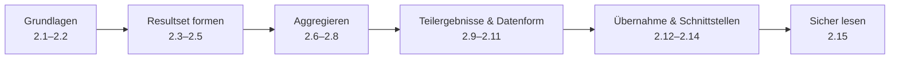
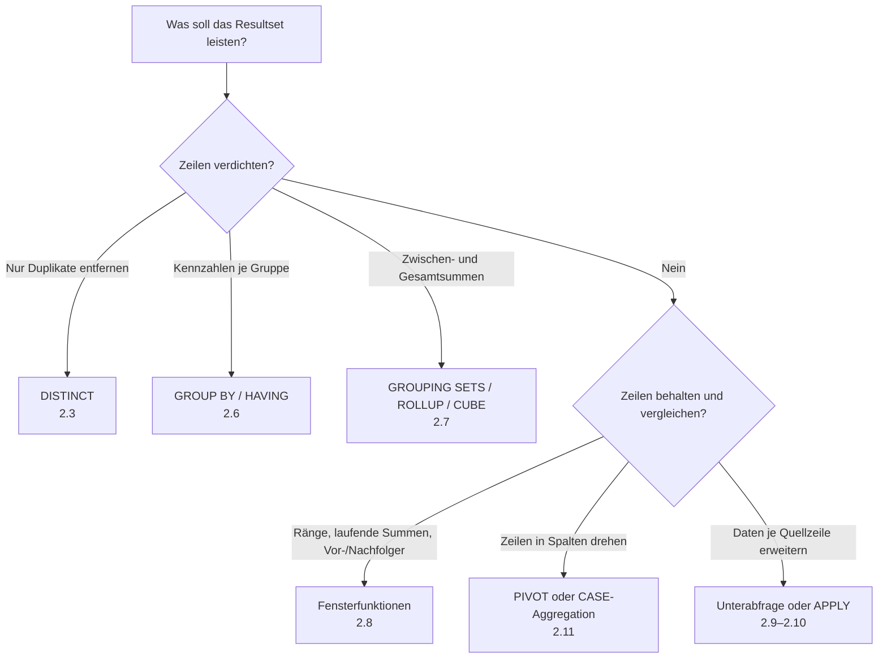
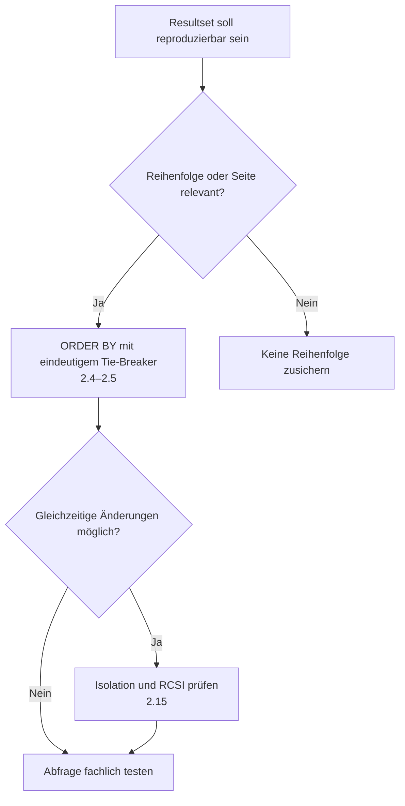

# T-SQL SELECT – Übersicht

*Projektion, Aufbereitung, Analyse und sichere Ausgabe von Daten mit T-SQL*

## Inhaltsverzeichnis

- [1 | Begriffsdefinition](#1--begriffsdefinition)
- [2 | Struktur](#2--struktur)
  - [2.0 | Lernpfad, Ressourcen und Entscheidungshilfen](#20--lernpfad-ressourcen-und-entscheidungshilfen)
  - [2.1 | SELECT-Grundlagen & Syntax](#21--select-grundlagen--syntax)
  - [2.2 | Ausdrücke, CASE, CAST/CONVERT, ISNULL/COALESCE](#22--ausdrücke-case-castconvert-isnullcoalesce)
  - [2.3 | DISTINCT vs. GROUP BY zum Dedupen](#23--distinct-vs-group-by-zum-dedupen)
  - [2.4 | TOP, WITH TIES, PERCENT & Pagination](#24--top-with-ties-percent--pagination-mit-offsetfetch)
  - [2.5 | Sortierung mit ORDER BY & Determinismus](#25--sortierung-mit-order-by--determinismus)
  - [2.6 | Aggregation mit GROUP BY & HAVING](#26--aggregation-mit-group-by--having)
  - [2.7 | Erweiterte Aggregation](#27--erweiterte-aggregation-grouping-sets-rollup-cube)
  - [2.8 | Fensterfunktionen](#28--fensterfunktionen-over-ranking-aggregate-frames)
  - [2.9 | Unterabfragen & korrelierte Abfragen](#29--unterabfragen--korrelierte-abfragen)
  - [2.10 | APPLY mit TVFs & OPENJSON](#210--apply-mit-tvfs--openjson)
  - [2.11 | PIVOT/UNPIVOT & Alternative Muster](#211--pivotunpivot--alternative-muster)
  - [2.12 | SELECT INTO vs. INSERT … SELECT](#212--select-into-vs-insert--select)
  - [2.13 | Variablenzuweisung mit SELECT](#213--variablenzuweisung-mit-select)
  - [2.14 | Ausgabe als JSON/XML](#214--ausgabe-als-jsonxml-for-json--for-xml)
  - [2.15 | Isolation, Sperren & Hints bei SELECT](#215--isolation-sperren--hints-bei-select)
- [3 | Häufige Fehler & Merksätze](#3--häufige-fehler--merksätze)
- [4 | Weiterführende Informationen](#4--weiterführende-informationen)

## 1 | Begriffsdefinition

| SQL-Term | Beschreibung |
|---|---|
| `SELECT`-Liste (Projektion) | Bestimmt, welche Spalten/Ausdrücke zurückgegeben werden; Reihenfolge/Format nur mit `ORDER BY` garantiert. |
| `FROM`-Quelle(n) | Tabellen, Views, TVFs, abgeleitete Tabellen, CTEs als Eingabe für `SELECT`. |
| Alias (`AS`) | Benennt Spalten/Tabellen zur besseren Lesbarkeit; erforderlich für berechnete Spalten ohne Namen. |
| `*` (Stern) | Alle Spalten der Quelle; für stabile Schnittstellen explizite Spalten bevorzugen. |
| `DISTINCT` | Entfernt Dubletten in der Ergebnis-Projection; wirkt nach Berechnung der `SELECT`-Ausdrücke. |
| `TOP` (`PERCENT`, `WITH TIES`) | Begrenzt Zeilenanzahl; sinnvolle Reihenfolge nur in Kombination mit `ORDER BY`. |
| `ORDER BY` + `OFFSET … FETCH` | Sortierung & Pagination im Ergebnis; ohne `ORDER BY` ist Reihenfolge nicht determiniert. |
| `GROUP BY` | Aggregation über Gruppen; nur gruppierte oder aggregierte Ausdrücke sind erlaubt. |
| `HAVING` | Filtert Aggregatsgruppen nach `GROUP BY` (im Gegensatz zu `WHERE` vor Aggregation). |
| Fensterfunktionen (`OVER`) | `ROW_NUMBER`, `SUM() OVER`, Frames (`ROWS/RANGE`), `PARTITION BY`, `ORDER BY` innerhalb der Partition. |
| `CASE`-Ausdruck | Konditionale Projektion innerhalb der `SELECT`-Liste. |
| Skalar-/Tabellenfunktionen | In der Projektion nutzbar; skalar oft performancekritisch, Inline/TVF bevorzugen. |
| Abgeleitete Tabelle / CTE | Zwischenresultate für Strukturierung/Lesbarkeit; CTE v. a. für Window-Filter, Rekursion. |
| `APPLY` (CROSS/OUTER) | Führt zeilenweise korrelierte Unterabfragen/TVFs aus und projiziert deren Spalten. |
| `PIVOT` / `UNPIVOT` | Dreht Zeilen↔Spalten für Berichte; Alternativen: `GROUP BY` + Konditionalaggregation. |
| `SELECT INTO` | Erstellt & befüllt eine neue Tabelle aus einem `SELECT`-Ergebnis (i. d. R. minimal geloggt). |
| `INSERT … SELECT` | Schreibt `SELECT`-Ergebnis in bestehende Tabelle; mit Spaltenliste kontrollieren. |
| Variablenzuweisung via `SELECT` | `SELECT @v = Col …`; Mehrzeilenverhalten beachten (letzte/undefinierte Auswahl). |
| `FOR JSON` / `FOR XML` | Serialisiert das Resultset direkt als JSON/XML. |
| Kollation & implizite Konvertierung | Beeinflussen Vergleich/Sortierung in `ORDER BY` und Typen der Ausdrücke in der Projektion. |
| Berechnete/persistierte Spalten | Vermeiden wiederkehrender Ausdrücke; können indexiert werden. |
| Berechtigungen (`SELECT`) | Objekt-/Spaltenberechtigungen steuern Sichtbarkeit; RLS kann zusätzliche Filter erzwingen. |

---

## 2 | Struktur

### 2.0 | Lernpfad, Ressourcen und Entscheidungshilfen

**Zielgruppe und Voraussetzungen:** Die Seite richtet sich an Lernende mit ersten Kenntnissen von Tabellen, Datentypen und `WHERE`. Starte mit 2.1–2.6, um sichere Resultsets zu formulieren. Die Abschnitte 2.7–2.11 vertiefen Analyse und Datenformung; 2.12–2.15 behandeln Datenübernahme, Schnittstellen und Nebenläufigkeit in praxisnahen Szenarien.

**Empfohlene Reihenfolge:**

**Ressourcen richtig nutzen:** Beginne jeweils mit dem Notebook und dem Video. Der erste Microsoft-Learn-Link ist der Referenzeinstieg, die weiteren Learn-Links dienen der Vertiefung; die Blogbeiträge beleuchten Praxis, Performance und typische Sonderfälle.

**Verwandte Kapitel im Repository:** [Normalformen und Datenmodellierung](../01_Normalformen/README.md) erklären die Grundlage sauberer Datenstrukturen, [JOINs](../03_JOIN/03_Join.md) erweitern Abfragen um mehrere Tabellen, [Unterabfragen, CTEs und temporäre Tabellen](../61_SubQuery_CTE_TMP/61_SubQuery_CTE_TMP.md) vertiefen Teilergebnisse, und [Transaktionen](../19_Transaktions/19_Transactions.md) liefert den Kontext zu konsistentem Lesen und Schreiben.

#### Schnellauswahl: Welches Abfragemuster passt?

#### Schnellauswahl: Wie bleibt das Ergebnis verlässlich?

#### Mini-Beispiele zu allen Unterkapiteln

| Kapitel | Minimaler Einstieg |
|---|---|
| 2.1 | `SELECT CustomerId, Name FROM dbo.Customer;` |
| 2.2 | `SELECT CASE WHEN Amount > 0 THEN 'Plus' ELSE 'Null/Minus' END;` |
| 2.3 | `SELECT DISTINCT City FROM dbo.Customer;` |
| 2.4 | `SELECT TOP (10) * FROM dbo.OrderHeader ORDER BY OrderDate DESC;` |
| 2.5 | `SELECT Name FROM dbo.Customer ORDER BY Name, CustomerId;` |
| 2.6 | `SELECT City, COUNT(*) FROM dbo.Customer GROUP BY City;` |
| 2.7 | `SELECT City, COUNT(*) FROM dbo.Customer GROUP BY ROLLUP (City);` |
| 2.8 | `SELECT ROW_NUMBER() OVER (ORDER BY OrderDate) AS Nr FROM dbo.OrderHeader;` |
| 2.9 | `SELECT Name FROM dbo.Customer AS c WHERE EXISTS (SELECT 1 FROM dbo.OrderHeader AS o WHERE o.CustomerId = c.CustomerId);` |
| 2.10 | `SELECT * FROM dbo.Event AS e CROSS APPLY OPENJSON(e.Payload);` |
| 2.11 | `SELECT * FROM Quelle PIVOT (SUM(Wert) FOR Jahr IN ([2024], [2025])) AS p;` |
| 2.12 | `SELECT CustomerId, Name INTO #Kunden FROM dbo.Customer;` |
| 2.13 | `SELECT @Anzahl = COUNT(*) FROM dbo.Customer;` |
| 2.14 | `SELECT CustomerId, Name FROM dbo.Customer FOR JSON PATH;` |
| 2.15 | `SELECT * FROM dbo.Queue WITH (READPAST);` |

### 2.1 | SELECT-Grundlagen & Syntax
> **Kurzbeschreibung:** Minimale Syntax, Projektion, Alias, logische Verarbeitungsreihenfolge und deterministische Ausgabe.

> **Ausführliche Beschreibung:** Dieses Kapitel schafft die Grundlage für jede Abfrage: Die `SELECT`-Liste bestimmt die zurückgegebenen Werte, `FROM` stellt die Datenquelle bereit und Aliase geben Tabellen sowie berechneten Spalten sprechende Namen. Entscheidend ist die logische Verarbeitungsreihenfolge – beispielsweise wird `WHERE` vor der Projektion ausgewertet –, während eine Ergebnisreihenfolge ausschließlich mit `ORDER BY` zugesichert wird. Verwende in produktiv genutzten Abfragen möglichst explizite Spaltenlisten statt `*`, damit Änderungen am Quellschema keine unbeabsichtigten Auswirkungen haben.

- 📓 **Notebook:**  
  - [`02_01_select_grundlagen.ipynb`](02_01_select_grundlagen.ipynb)

- 🎥 **YouTube:**  
  - [SELECT Statement – Basics (SQL Server)](https://www.youtube.com/results?search_query=sql+server+select+statement+basics)

- 📘 **Docs:**  
  - [SELECT (Transact-SQL)](https://learn.microsoft.com/en-us/sql/t-sql/queries/select-transact-sql)
  - [Logische Verarbeitungsreihenfolge einer `SELECT`-Abfrage](https://learn.microsoft.com/en-us/sql/relational-databases/performance/query-processing-architecture-guide)
  - [`FROM`-Klausel](https://learn.microsoft.com/en-us/sql/t-sql/queries/from-transact-sql)
  - [Spaltenalias mit `AS`](https://learn.microsoft.com/en-us/sql/t-sql/queries/select-transact-sql#arguments)
  - [`ORDER BY`-Klausel](https://learn.microsoft.com/en-us/sql/t-sql/queries/select-order-by-clause-transact-sql)

- 📝 **Blogs & Praxis:**
  - [Conditional `ORDER BY` – SQLPerformance](https://sqlperformance.com/2012/08/t-sql-queries/conditional-order-by)
  - [Fundamentals of Table Expressions – SQLPerformance](https://sqlperformance.com/2021/09/t-sql-queries/table-expressions-part-11)

---

### 2.2 | Ausdrücke, `CASE`, `CAST/CONVERT`, `ISNULL/COALESCE`
> **Kurzbeschreibung:** Werte berechnen, bedingt ableiten und sauber typisieren; Fallstricke mit `FORMAT()` vermeiden.

> **Ausführliche Beschreibung:** Ausdrücke machen aus Rohdaten fachlich nutzbare Ergebnisse: Mit `CASE` entstehen Kategorien und Regeln direkt in der Abfrage, `CAST` und `CONVERT` vereinheitlichen Datentypen, und `ISNULL` beziehungsweise `COALESCE` behandeln fehlende Werte. Achte dabei auf Datentyp-Prioritäten und implizite Konvertierungen, denn sie können sowohl Ergebnisse als auch die Indexnutzung verändern. `FORMAT()` ist für darstellungsorientierte Einzelfälle geeignet, für große Datenmengen aber meist deutlich langsamer als sprachnahe Konvertierungen.

- 📓 **Notebook:**  
  - [`02_02_select_ausdruecke_case_cast.ipynb`](02_02_select_ausdruecke_case_cast.ipynb)

- 🎥 **YouTube:**  
  - [CASE Expression – Patterns](https://www.youtube.com/results?search_query=sql+server+case+expression+t-sql)

- 📘 **Docs:**  
  - [`CASE` (T-SQL)](https://learn.microsoft.com/en-us/sql/t-sql/language-elements/case-transact-sql)  
  - [`CAST` und `CONVERT`](https://learn.microsoft.com/en-us/sql/t-sql/functions/cast-and-convert-transact-sql)
  - [`COALESCE` (T-SQL)](https://learn.microsoft.com/en-us/sql/t-sql/language-elements/coalesce-transact-sql)
  - [`ISNULL` (T-SQL)](https://learn.microsoft.com/en-us/sql/t-sql/functions/isnull-transact-sql)
  - [`FORMAT` (T-SQL)](https://learn.microsoft.com/en-us/sql/t-sql/functions/format-transact-sql)

- 📝 **Blogs & Praxis:**
  - [Dirty Secrets of the `CASE` Expression – SQLPerformance](https://sqlperformance.com/2014/06/t-sql-queries/dirty-secrets-of-the-case-expression)
  - [NULL Complexities – SQLPerformance](https://sqlperformance.com/2020/01/t-sql-queries/null-complexities-part-2)

---

### 2.3 | `DISTINCT` vs. `GROUP BY` zum Dedupen
> **Kurzbeschreibung:** Wann `DISTINCT` genügt und wann Aggregation sinnvoller ist; Einfluss auf Pläne & Performance.

> **Ausführliche Beschreibung:** `DISTINCT` entfernt doppelte Zeilen aus genau den projizierten Ausdrücken; es beantwortet daher die Frage „Welche unterschiedlichen Kombinationen gibt es?“. `GROUP BY` bildet dagegen Gruppen und ist die richtige Wahl, sobald pro Gruppe Kennzahlen wie `COUNT`, `SUM` oder `MAX` benötigt werden. Beide Varianten können Sortier- oder Hash-Operatoren erfordern, daher sollte Dublettenentfernung nicht fehlende Join-Bedingungen oder unklare Datenmodellierung verdecken. Prüfe insbesondere bei großen Ergebnissen, ob eine passendere Abfrage oder ein Index die Ursache besser adressiert.

- 📓 **Notebook:**  
  - [`02_03_distinct_vs_groupby.ipynb`](02_03_distinct_vs_groupby.ipynb)

- 🎥 **YouTube:**  
  - [DISTINCT vs GROUP BY](https://www.youtube.com/results?search_query=sql+server+distinct+vs+group+by)

- 📘 **Docs:**  
  - [`DISTINCT` (T-SQL)](https://learn.microsoft.com/en-us/sql/t-sql/queries/select-transact-sql#use-distinct)
  - [`GROUP BY` (T-SQL)](https://learn.microsoft.com/en-us/sql/t-sql/queries/select-group-by-transact-sql)
  - [Aggregatfunktionen (T-SQL)](https://learn.microsoft.com/en-us/sql/t-sql/functions/aggregate-functions-transact-sql)
  - [Ausführungspläne anzeigen und auswerten](https://learn.microsoft.com/en-us/sql/relational-databases/performance/display-and-save-execution-plans)
  - [Joins (T-SQL)](https://learn.microsoft.com/en-us/sql/relational-databases/performance/joins)

- 📝 **Blogs & Praxis:**
  - [When `DISTINCT` ≠ `GROUP BY` – SQLPerformance](https://sqlperformance.com/2018/03/t-sql-queries/distinct-group-by)
  - [Performance: `GROUP BY` vs. `DISTINCT` – SQLPerformance](https://sqlperformance.com/2017/01/t-sql-queries/surprises-assumptions-group-by-distinct)

---

### 2.4 | `TOP`, `WITH TIES`, `PERCENT` & Pagination mit `OFFSET/FETCH`
> **Kurzbeschreibung:** Zeilenlimitierung korrekt einsetzen und stabil sortieren; Unterschiede zwischen Limitierung und Pagination.

> **Ausführliche Beschreibung:** `TOP` begrenzt die Menge der zurückgegebenen oder verarbeiteten Zeilen und ist mit `ORDER BY` zu kombinieren, wenn „die ersten“ Zeilen fachlich eindeutig sein sollen. `WITH TIES` nimmt weitere Zeilen mit demselben letzten Sortierwert auf, `PERCENT` berechnet die Grenze relativ zur Gesamtmenge. `OFFSET … FETCH` ist für seitenweise Resultate gedacht und verlangt immer eine Sortierung; eine eindeutige, möglichst indexgestützte Sortierung verhindert überlappende oder fehlende Zeilen zwischen Seiten. Bei sehr tiefen Seiten sind Keyset-Pagination und ein geeigneter Index oft effizienter.

- 📓 **Notebook:**  
  - [`02_04_top_offset_fetch.ipynb`](02_04_top_offset_fetch.ipynb)

- 🎥 **YouTube:**  
  - [TOP & ORDER BY – Best Practices](https://www.youtube.com/results?search_query=sql+server+top+with+ties+offset+fetch)

- 📘 **Docs:**  
  - [`TOP` (Transact-SQL)](https://learn.microsoft.com/en-us/sql/t-sql/queries/top-transact-sql)  
  - [`ORDER BY` mit `OFFSET/FETCH`](https://learn.microsoft.com/en-us/sql/t-sql/queries/select-order-by-clause-transact-sql)
  - [Best Practices für `TOP` bei DML](https://learn.microsoft.com/en-us/sql/t-sql/queries/top-transact-sql#best-practices)
  - [Indexentwurf und Abfrageleistung](https://learn.microsoft.com/en-us/sql/relational-databases/sql-server-index-design-guide)
  - [Ausführungspläne anzeigen und auswerten](https://learn.microsoft.com/en-us/sql/relational-databases/performance/display-and-save-execution-plans)

- 📝 **Blogs & Praxis:**
  - [Pagination with `OFFSET/FETCH` – SQLPerformance](https://sqlperformance.com/2015/01/t-sql-queries/pagination-with-offset-fetch)
  - [Improving a `TOP`-based solution – SQLPerformance](https://sqlperformance.com/2015/08/sql-plan/improving-the-top-top-descending-median-solution)

---

### 2.5 | Sortierung mit `ORDER BY` & Determinismus
> **Kurzbeschreibung:** Stabile Sortierkriterien, Kollisionen durch `NULL`/Kollation, zufällige Reihenfolge (`ORDER BY NEWID()`).

> **Ausführliche Beschreibung:** Ohne `ORDER BY` besitzt ein Resultset keine zugesicherte Reihenfolge – auch dann nicht, wenn es bei ersten Tests stabil aussieht. Definiere deshalb alle fachlich relevanten Sortierspalten und ergänze bei Gleichständen einen eindeutigen Schlüssel, etwa die Primärschlüsselspalte. `NULL`-Werte, Groß-/Kleinschreibung und Akzentvergleich richten sich nach der Kollation und können die Sortierung sichtbar beeinflussen. Zufallssortierung über `ORDER BY NEWID()` ist praktisch für kleine Stichproben, muss auf großen Tabellen aber sorgfältig eingesetzt werden, da jede Zeile einen Zufallswert erhält.

- 📓 **Notebook:**  
  - [`02_05_order_by_determinismus.ipynb`](02_05_order_by_determinismus.ipynb)

- 🎥 **YouTube:**  
  - [ORDER BY – Do’s & Don’ts](https://www.youtube.com/results?search_query=sql+server+order+by+best+practices)

- 📘 **Docs:**  
  - [`ORDER BY` (T-SQL)](https://learn.microsoft.com/en-us/sql/t-sql/queries/select-order-by-clause-transact-sql)
  - [`COLLATE` (T-SQL)](https://learn.microsoft.com/en-us/sql/t-sql/statements/collations)
  - [Kollation und Unicode-Unterstützung](https://learn.microsoft.com/en-us/sql/relational-databases/collations/collation-and-unicode-support)
  - [`NEWID` (T-SQL)](https://learn.microsoft.com/en-us/sql/t-sql/functions/newid-transact-sql)
  - [Indexentwurf und Sortierleistung](https://learn.microsoft.com/en-us/sql/relational-databases/sql-server-index-design-guide)

- 📝 **Blogs & Praxis:**
  - [Conditional `ORDER BY` – SQLPerformance](https://sqlperformance.com/2012/08/t-sql-queries/conditional-order-by)
  - [Row Numbers with Nondeterministic Order – SQLPerformance](https://sqlperformance.com/2019/11/t-sql-queries/row-numbers-with-nondeterministic-order)

---

### 2.6 | Aggregation mit `GROUP BY` & `HAVING`
> **Kurzbeschreibung:** Klassische Aggregation, Filterung nach Aggregaten und typische Fehlerquellen.

> **Ausführliche Beschreibung:** `GROUP BY` verdichtet Eingabezeilen zu Gruppen, auf denen Aggregatfunktionen Kennzahlen berechnen. `WHERE` filtert einzelne Zeilen vor dieser Verdichtung, `HAVING` dagegen filtert die bereits gebildeten Gruppen – zum Beispiel Kunden mit mehr als zehn Bestellungen. In der `SELECT`-Liste dürfen neben Aggregaten nur Ausdrücke stehen, die durch `GROUP BY` eindeutig bestimmt sind. Gute Abfragen begrenzen Daten früh, wählen eine fachlich sinnvolle Gruppierung und berücksichtigen, dass `NULL`-Werte in einer gemeinsamen Gruppe zusammengefasst werden.

- 📓 **Notebook:**  
  - [`02_06_groupby_having.ipynb`](02_06_groupby_having.ipynb)

- 🎥 **YouTube:**  
  - [GROUP BY & HAVING Tutorial](https://www.youtube.com/results?search_query=sql+server+group+by+having+tutorial)

- 📘 **Docs:**  
  - [`GROUP BY` (T-SQL)](https://learn.microsoft.com/en-us/sql/t-sql/queries/select-group-by-transact-sql)  
  - [`HAVING` (T-SQL)](https://learn.microsoft.com/en-us/sql/t-sql/queries/select-having-transact-sql)
  - [Aggregatfunktionen (T-SQL)](https://learn.microsoft.com/en-us/sql/t-sql/functions/aggregate-functions-transact-sql)
  - [`COUNT` (T-SQL)](https://learn.microsoft.com/en-us/sql/t-sql/functions/count-transact-sql)
  - [`WHERE`-Klausel](https://learn.microsoft.com/en-us/sql/t-sql/queries/where-transact-sql)

- 📝 **Blogs & Praxis:**
  - [Grouped Concatenation – SQLPerformance](https://sqlperformance.com/2014/08/t-sql-queries/sql-server-grouped-concatenation)
  - [Performance: `GROUP BY` vs. `DISTINCT` – SQLPerformance](https://sqlperformance.com/2017/01/t-sql-queries/surprises-assumptions-group-by-distinct)

---

### 2.7 | Erweiterte Aggregation: `GROUPING SETS`, `ROLLUP`, `CUBE`
> **Kurzbeschreibung:** Mehrdimensionale Summen in einer Abfrage; `GROUPING_ID` zur Unterscheidung der Ebenen.

> **Ausführliche Beschreibung:** Mit `GROUPING SETS`, `ROLLUP` und `CUBE` lassen sich Detail-, Zwischen- und Gesamtsummen in einem einzigen Aggregationsschritt erzeugen. `ROLLUP` folgt einer Hierarchie von links nach rechts, während `CUBE` alle Kombinationen der Gruppierungsspalten erstellt und deshalb schnell sehr viele Zeilen erzeugen kann. Die durch Summenzeilen entstehenden `NULL`-Werte müssen von echten `NULL`-Werten der Daten unterschieden werden; dafür dienen `GROUPING` und `GROUPING_ID`. Diese Konstrukte eignen sich besonders für Reporting-Abfragen, wenn mehrere separate `UNION ALL`-Abfragen vermieden werden sollen.

- 📓 **Notebook:**  
  - [`02_07_grouping_sets_rollup_cube.ipynb`](02_07_grouping_sets_rollup_cube.ipynb)

- 🎥 **YouTube:**  
  - [GROUPING SETS / ROLLUP / CUBE](https://www.youtube.com/results?search_query=sql+server+grouping+sets+rollup+cube)

- 📘 **Docs:**  
  - [`GROUP BY` – Erweiterungen](https://learn.microsoft.com/en-us/sql/t-sql/queries/select-group-by-transact-sql#grouping-sets-cube-and-rollup)  
  - [`GROUPING_ID`](https://learn.microsoft.com/en-us/sql/t-sql/functions/grouping-id-transact-sql)
  - [`GROUPING` (T-SQL)](https://learn.microsoft.com/en-us/sql/t-sql/functions/grouping-transact-sql)
  - [Aggregatfunktionen (T-SQL)](https://learn.microsoft.com/en-us/sql/t-sql/functions/aggregate-functions-transact-sql)
  - [`UNION` und `UNION ALL`](https://learn.microsoft.com/en-us/sql/t-sql/language-elements/set-operators-union-transact-sql)

- 📝 **Blogs & Praxis:**
  - [Grouping Sets, Rollups, and Cubes – SQLskills](https://www.sqlskills.com/blogs/conor/grouping-sets-rollups-and-cubes-oh-my/)
  - [Grouping Sets: `CUBE` und `ROLLUP` – SQLpassion](https://www.sqlpassion.at/archive/2014/09/22/grouping-sets-the-cube-and-rollup-subclauses/)

---

### 2.8 | Fensterfunktionen (`OVER`): Ranking, Aggregate, Frames
> **Kurzbeschreibung:** Rangfolgen, laufende Summen, gleitende Fenster; richtige Frame-Definition für korrekte Ergebnisse.

> **Ausführliche Beschreibung:** Fensterfunktionen berechnen Werte über einen definierten Satz verwandter Zeilen, ohne diese wie `GROUP BY` zu einer Ergebniszeile zusammenzufassen. `PARTITION BY` grenzt unabhängige Gruppen ab, `ORDER BY` innerhalb von `OVER` legt die Reihenfolge fest; `ROWS` und `RANGE` definieren bei laufenden oder gleitenden Berechnungen den exakten Fensterrahmen. Ranking-Funktionen lösen etwa Top-N-pro-Gruppe-Aufgaben, während Fensteraggregate laufende Summen und Vergleiche mit vorherigen Zeilen ermöglichen. Eine eindeutige Sortierung und ein bewusst gewählter Frame sind zentral, damit Gleichstände nicht zu überraschenden Resultaten führen.

- 📓 **Notebook:**  
  - [`02_08_window_functions_over.ipynb`](02_08_window_functions_over.ipynb)

- 🎥 **YouTube:**  
  - [Window Functions Deep Dive](https://www.youtube.com/results?search_query=sql+server+window+functions+over+clause)

- 📘 **Docs:**  
  - [`OVER`-Klausel](https://learn.microsoft.com/en-us/sql/t-sql/queries/select-over-clause-transact-sql)  
  - [Ranking-Funktionen (`ROW_NUMBER`, `RANK`, …)](https://learn.microsoft.com/en-us/sql/t-sql/functions/ranking-functions-transact-sql)
  - [`ROW_NUMBER` (T-SQL)](https://learn.microsoft.com/en-us/sql/t-sql/functions/row-number-transact-sql)
  - [`LAG` (T-SQL)](https://learn.microsoft.com/en-us/sql/t-sql/functions/lag-transact-sql)
  - [`LEAD` (T-SQL)](https://learn.microsoft.com/en-us/sql/t-sql/functions/lead-transact-sql)

- 📝 **Blogs & Praxis:**
  - [Tips for T-SQL Window Ordering – SQLPerformance](https://sqlperformance.com/2022/05/t-sql-queries/are-you-sorted-window-ordering)
  - [Grouped Running `MAX`/`MIN` – SQLPerformance](https://sqlperformance.com/2015/10/t-sql-queries/grouped-running-max)

---

### 2.9 | Unterabfragen & korrelierte Abfragen
> **Kurzbeschreibung:** Skalar-, Mehrzeilen- und existenzbasierte Unterabfragen in der Projektion und im `FROM`.

> **Ausführliche Beschreibung:** Unterabfragen kapseln ein abhängiges oder unabhängiges Teilergebnis innerhalb einer größeren Abfrage. Skalare Unterabfragen dürfen höchstens einen Wert liefern; Mehrzeilenvarianten werden meist mit `IN`, `EXISTS`, `ANY` oder `ALL` kombiniert. Eine korrelierte Unterabfrage referenziert die aktuelle Zeile der äußeren Abfrage und ist sehr ausdrucksstark, kann aber bei ungünstiger Form oder fehlenden Indizes teuer werden. Vergleiche deshalb insbesondere `EXISTS`-Muster mit einer passenden Join- oder Fensterfunktionslösung und behandle `NULL` bei `NOT IN` bewusst.

- 📓 **Notebook:**  
  - [`02_09_subqueries_scalar_table.ipynb`](02_09_subqueries_scalar_table.ipynb)

- 🎥 **YouTube:**  
  - [Subqueries in SELECT](https://www.youtube.com/results?search_query=sql+server+subqueries+in+select)

- 📘 **Docs:**  
  - [Unterabfragen (T-SQL)](https://learn.microsoft.com/en-us/sql/t-sql/queries/subqueries)
  - [`EXISTS` (T-SQL)](https://learn.microsoft.com/en-us/sql/t-sql/language-elements/exists-transact-sql)
  - [`IN` (T-SQL)](https://learn.microsoft.com/en-us/sql/t-sql/language-elements/in-transact-sql)
  - [Joins (T-SQL)](https://learn.microsoft.com/en-us/sql/relational-databases/performance/joins)
  - [Common Table Expressions (CTE)](https://learn.microsoft.com/en-us/sql/t-sql/queries/with-common-table-expression-transact-sql)

- 📝 **Blogs & Praxis:**
  - [`NOT IN` vs. `NOT EXISTS` vs. `OUTER APPLY` – SQLPerformance](https://sqlperformance.com/2012/12/t-sql-queries/left-anti-semi-join)
  - [Row Goals bei Anti-Joins – SQLPerformance](https://sqlperformance.com/2018/03/sql-plan/row-goals-part-3-anti-joins)

---

### 2.10 | `APPLY` mit TVFs & `OPENJSON`
> **Kurzbeschreibung:** Zeilenweise Ausdehnung/Transformation; `CROSS/OUTER APPLY` für TVFs und JSON-Shredding.

> **Ausführliche Beschreibung:** `APPLY` wertet die rechte Tabellenquelle für jede Zeile der linken Quelle aus und ist damit die passende Brücke zu korrelierten Tabellenwertfunktionen, abgeleiteten Top-N-Abfragen oder JSON-Zerlegung. `CROSS APPLY` behält nur Zeilen mit einem Ergebnis, `OUTER APPLY` erhält auch linke Zeilen ohne Treffer und ergänzt dann `NULL`. Mit `OPENJSON` wird JSON strukturiert in Zeilen und Spalten überführt; ein `WITH`-Schema macht Typen und Pfade explizit. Da die rechte Seite oft wiederholt ausgewertet wird, sollten Prädikate und unterstützende Indizes besonders sorgfältig gewählt werden.

- 📓 **Notebook:**  
  - [`02_10_apply_openjson.ipynb`](02_10_apply_openjson.ipynb)

- 🎥 **YouTube:**  
  - [CROSS APPLY Patterns](https://www.youtube.com/results?search_query=sql+server+cross+apply+openjson)

- 📘 **Docs:**  
  - [`APPLY` (T-SQL)](https://learn.microsoft.com/en-us/sql/t-sql/queries/from-transact-sql#apply-operator)  
  - [`OPENJSON`](https://learn.microsoft.com/en-us/sql/t-sql/functions/openjson-transact-sql)
  - [`FROM` und `APPLY` (T-SQL)](https://learn.microsoft.com/en-us/sql/t-sql/queries/from-transact-sql#apply-operator)
  - [JSON-Daten abfragen](https://learn.microsoft.com/en-us/sql/relational-databases/json/query-json-data)
  - [Benutzerdefinierte Funktionen erstellen](https://learn.microsoft.com/en-us/sql/relational-databases/user-defined-functions/create-user-defined-functions-database-engine)
  - [Joins (T-SQL)](https://learn.microsoft.com/en-us/sql/relational-databases/performance/joins)

- 📝 **Blogs & Praxis:**
  - [`NOT IN` vs. `NOT EXISTS` vs. `OUTER APPLY` – SQLPerformance](https://sqlperformance.com/2012/12/t-sql-queries/left-anti-semi-join)
  - [Anti-Join Anti-Pattern – SQLPerformance](https://sqlperformance.com/2018/03/sql-performance/row-goals-part-4-anti-join-anti-pattern)

---

### 2.11 | `PIVOT`/`UNPIVOT` & Alternative Muster
> **Kurzbeschreibung:** Berichtsfreundliche Drehung von Daten sowie Alternativen mit `CASE`+Aggregation.

> **Ausführliche Beschreibung:** `PIVOT` wandelt Werte aus einer Zeilenspalte in feste Ausgabespalten um, `UNPIVOT` führt mehrere Spalten wieder zu Zeilen zusammen. Das ist für übersichtliche Berichte hilfreich, setzt aber voraus, dass die gewünschten Pivotspalten zur Abfragezeit bekannt sind. Für dynamische Kategorien sind dynamisches SQL oder häufig besser nachvollziehbar: bedingte Aggregation mit `SUM(CASE WHEN … THEN … END)`. Prüfe bei beiden Richtungen die Behandlung von `NULL`, kollationsbedingte Spaltennamen und ob die Transformation wirklich in SQL statt in der Berichtsschicht erfolgen sollte.

- 📓 **Notebook:**  
  - [`02_11_pivot_unpivot.ipynb`](02_11_pivot_unpivot.ipynb)

- 🎥 **YouTube:**  
  - [PIVOT Explained](https://www.youtube.com/results?search_query=sql+server+pivot+unpivot)

- 📘 **Docs:**  
  - [`PIVOT` (T-SQL)](https://learn.microsoft.com/en-us/sql/t-sql/queries/from-using-pivot-and-unpivot)  
  - [`CASE` (T-SQL)](https://learn.microsoft.com/en-us/sql/t-sql/language-elements/case-transact-sql)
  - [`GROUP BY` (T-SQL)](https://learn.microsoft.com/en-us/sql/t-sql/queries/select-group-by-transact-sql)
  - [`sp_executesql` für parametrisiertes dynamisches SQL](https://learn.microsoft.com/en-us/sql/relational-databases/system-stored-procedures/sp-executesql-transact-sql)
  - [Kollationen](https://learn.microsoft.com/en-us/sql/t-sql/statements/collations)

- 📝 **Blogs & Praxis:**
  - [T-SQL Pitfalls: `PIVOT` und `UNPIVOT` – SQLPerformance](https://sqlperformance.com/2019/09/t-sql-queries/t-sql-pitfalls-pivoting-unpivoting)
  - [PIVOT in SQL Server – SQLShack](https://www.sqlshack.com/static-and-dynamic-sql-pivot-and-unpivot-relational-operator-overview/)

---

### 2.12 | `SELECT INTO` vs. `INSERT … SELECT`
> **Kurzbeschreibung:** Tabellenanlage aus Abfrage, Minimal-Logging, Zielschemadefinition und Parallelität.

> **Ausführliche Beschreibung:** `SELECT INTO` erstellt eine neue Tabelle aus dem Abfrageergebnis und leitet Namen sowie Datentypen der Zielspalten daraus ab; Indizes, Constraints und Trigger werden dabei nicht übernommen. `INSERT … SELECT` schreibt dagegen in eine bereits definierte Tabelle und bietet mit einer expliziten Zielspaltenliste volle Kontrolle über das Schema. Welche Variante schneller oder sparsamer protokolliert wird, hängt unter anderem vom Recovery Model, den Zielobjekten und der Ausführungsumgebung ab. Für dauerhafte Tabellen ist ein bewusst angelegtes Zielschema meist robuster; `SELECT INTO` ist besonders praktisch für Staging- und temporäre Analyseschritte.

- 📓 **Notebook:**  
  - [`02_12_select_into_insert_select.ipynb`](02_12_select_into_insert_select.ipynb)

- 🎥 **YouTube:**  
  - [SELECT INTO vs INSERT SELECT](https://www.youtube.com/results?search_query=sql+server+select+into+vs+insert+select)

- 📘 **Docs:**  
  - [`SELECT INTO`](https://learn.microsoft.com/en-us/sql/t-sql/queries/select-into-clause-transact-sql)  
  - [`INSERT` (T-SQL)](https://learn.microsoft.com/en-us/sql/t-sql/statements/insert-transact-sql)
  - [Minimal Logging und Bulk Import](https://learn.microsoft.com/en-us/sql/relational-databases/import-export/prerequisites-for-minimally-logging-bulk-import)
  - [`CREATE TABLE` (T-SQL)](https://learn.microsoft.com/en-us/sql/t-sql/statements/create-table-transact-sql)
  - [Temporäre Tabellen](https://learn.microsoft.com/en-us/sql/t-sql/statements/create-table-transact-sql#temporary-tables)

- 📝 **Blogs & Praxis:**
  - [Minimal Logging mit `INSERT … SELECT` in Heaps – SQLPerformance](https://sqlperformance.com/2019/05/sql-plan/minimal-logging-insert-select-heap)
  - [Minimal Logging in leeren Clustered Tables – SQLPerformance](https://sqlperformance.com/2019/05/sql-performance/minimal-logging-empty-clustered)

---

### 2.13 | Variablenzuweisung mit `SELECT`
> **Kurzbeschreibung:** Ein-/Mehrzeilenverhalten, `SET` vs. `SELECT`, Umgang mit `NULL` und Mehrspaltenzuweisungen.

> **Ausführliche Beschreibung:** Lokale Variablen speichern einzelne skalare Werte für den weiteren Batch- oder Prozedurablauf. `SET` ist für eine einzelne Zuweisung besonders eindeutig und meldet bei einer mehrzeiligen Unterabfrage einen Fehler; `SELECT` kann mehrere Variablen in einer Anweisung setzen und ist flexibel, verlangt bei mehreren Quellzeilen aber eine ausdrücklich kontrollierte Auswahl. Ohne deterministisches `ORDER BY` ist die zuletzt zugewiesene Zeile nicht verlässlich. Beachte außerdem den Unterschied zwischen keiner gefundenen Zeile und einem tatsächlich gelesenen `NULL`-Wert, insbesondere bei bereits belegten Variablen.

- 📓 **Notebook:**  
  - [`02_13_select_variable_assignment.ipynb`](02_13_select_variable_assignment.ipynb)

- 🎥 **YouTube:**  
  - [SET vs SELECT (Variables)](https://www.youtube.com/results?search_query=sql+server+set+vs+select+variables)

- 📘 **Docs:**  
  - [`DECLARE`/`SET @local_variable`](https://learn.microsoft.com/en-us/sql/t-sql/language-elements/set-local-variable-transact-sql)  
  - [Variablenzuweisung in `SELECT`](https://learn.microsoft.com/en-us/sql/t-sql/queries/select-transact-sql#assigning-variables)
  - [`DECLARE @local_variable`](https://learn.microsoft.com/en-us/sql/t-sql/language-elements/declare-local-variable-transact-sql)
  - [`SET @local_variable`](https://learn.microsoft.com/en-us/sql/t-sql/language-elements/set-local-variable-transact-sql)
  - [Unterabfragen (T-SQL)](https://learn.microsoft.com/en-us/sql/t-sql/queries/subqueries)
  - [`ORDER BY` (T-SQL)](https://learn.microsoft.com/en-us/sql/t-sql/queries/select-order-by-clause-transact-sql)

- 📝 **Blogs & Praxis:**
  - [`SET` vs. `SELECT` bei Variablen – MSSQLTips](https://www.mssqltips.com/sqlservertip/1888/when-to-use-set-vs-select-when-assigning-values-to-variables-in-sql-server/)
  - [`SELECT` vs. `SET` – SQL Authority](https://blog.sqlauthority.com/2007/04/27/sql-server-select-vs-set-performance-comparison/)

---

### 2.14 | Ausgabe als JSON/XML: `FOR JSON` / `FOR XML`
> **Kurzbeschreibung:** Direkte Serialisierung des Resultsets; Modi (`AUTO`/`PATH`) und Größen-/NVARCHAR-Limits.

> **Ausführliche Beschreibung:** `FOR JSON` und `FOR XML` serialisieren ein Resultset direkt im SQL Server und eignen sich etwa für API-Ausgaben, Integrationen oder verschachtelte Dokumentstrukturen. `FOR JSON PATH` gibt die Form über Aliase und Punktnotation präzise vor, während `AUTO` sich an Tabellen- und Join-Strukturen orientiert; bei XML erfüllen `PATH`, `AUTO`, `RAW` und `EXPLICIT` ähnliche, aber eigene Rollen. Achte auf die semantisch korrekte Behandlung von `NULL`, auf die Größe der resultierenden `nvarchar(max)`- bzw. XML-Werte und darauf, dass Formatierung nicht die fachliche Abfrage- oder Sicherheitslogik ersetzt. JSON-Eingaben lassen sich mit `ISJSON`, `JSON_VALUE` und `OPENJSON` validieren und weiterverarbeiten.

- 📓 **Notebook:**  
  - [`02_14_for_json_for_xml.ipynb`](02_14_for_json_for_xml.ipynb)

- 🎥 **YouTube:**  
  - [FOR JSON in SQL Server](https://www.youtube.com/results?search_query=sql+server+for+json)  

- 📘 **Docs:**  
  - [`FOR JSON`](https://learn.microsoft.com/en-us/sql/relational-databases/json/format-query-results-as-json-with-for-json-sql-server)  
  - [`FOR XML`](https://learn.microsoft.com/en-us/sql/relational-databases/xml/for-xml-sql-server)
  - [JSON-Daten formatieren und abfragen](https://learn.microsoft.com/en-us/sql/relational-databases/json/json-data-sql-server)
  - [`JSON_VALUE` (T-SQL)](https://learn.microsoft.com/en-us/sql/t-sql/functions/json-value-transact-sql)
  - [`ISJSON` (T-SQL)](https://learn.microsoft.com/en-us/sql/t-sql/functions/isjson-transact-sql)
  - [`FOR XML PATH`](https://learn.microsoft.com/en-us/sql/relational-databases/xml/use-path-mode-with-for-xml)

- 📝 **Blogs & Praxis:**
  - [Working with JSON in SQL Server – Redgate Simple Talk](https://www.red-gate.com/simple-talk/databases/sql-server/t-sql-programming-sql-server/working-with-json-in-sql-server/)
  - [`FOR JSON` in SQL Server – SQLShack](https://www.sqlshack.com/for-json-clause-in-sql-server/)

---

### 2.15 | Isolation, Sperren & Hints bei `SELECT`
> **Kurzbeschreibung:** Lesesperren, `READ COMMITTED SNAPSHOT`, `NOLOCK`/`READUNCOMMITTED` Risiken, `READPAST`.

> **Ausführliche Beschreibung:** Auch eine reine Leseabfrage nimmt an der Transaktionsisolation teil und kann durch Sperren blockieren oder selbst Sperren verursachen. Das standardmäßige `READ COMMITTED` schützt vor nicht bestätigten Daten; `READ COMMITTED SNAPSHOT` kann Lesekonsistenz über Zeilenversionen liefern und damit viele Blockierungen reduzieren. `NOLOCK` beziehungsweise `READUNCOMMITTED` vermeidet nicht zuverlässig jedes Warten, erlaubt aber Dirty Reads sowie fehlende oder doppelte Zeilen und ist daher keine allgemeine Performance-Lösung. Table Hints wie `READPAST` sollten nur für klar verstandene Spezialfälle verwendet und immer im Kontext von Transaktionsgrenzen, Version Store und konkurrierenden Schreibvorgängen geprüft werden.

- 📓 **Notebook:**  
  - [`02_15_select_isolation_hints.ipynb`](02_15_select_isolation_hints.ipynb)

- 🎥 **YouTube:**  
  - [NOLOCK Explained](https://www.youtube.com/results?search_query=sql+server+nolock+read+committed+snapshot)

- 📘 **Docs:**  
  - [Table Hints (`NOLOCK`, `READPAST`, …)](https://learn.microsoft.com/en-us/sql/t-sql/queries/hints-transact-sql-table)  
  - [`SET TRANSACTION ISOLATION LEVEL`](https://learn.microsoft.com/en-us/sql/t-sql/statements/set-transaction-isolation-level-transact-sql)
  - [Transaktionssperren und Zeilenversionierung](https://learn.microsoft.com/en-us/sql/relational-databases/sql-server-transaction-locking-and-row-versioning-guide)
  - [Snapshot Isolation in SQL Server](https://learn.microsoft.com/en-us/sql/relational-databases/sql-server-transaction-locking-and-row-versioning-guide#snapshot-isolation)
  - [Sperren überwachen](https://learn.microsoft.com/en-us/sql/relational-databases/performance/monitor-and-tune-for-locking-blocked-processes)

- 📝 **Blogs & Praxis:**
  - [Why `NOLOCK` Is Bad – Brent Ozar](https://www.brentozar.com/archive/2021/08/why-nolock-is-bad-and-you-probably-shouldnt-use-it/)
  - [The Read Committed Snapshot Isolation Level – Redgate Simple Talk](https://www.red-gate.com/simple-talk/databases/sql-server/t-sql-programming-sql-server/the-read-committed-snapshot-isolation-level/)

---

## 3 | Häufige Fehler & Merksätze

| Thema | Häufiger Fehler | Merksatz |
|---|---|---|
| Reihenfolge | Sich auf die natürliche Tabellen- oder Planreihenfolge verlassen | Nur `ORDER BY` garantiert eine Ausgabereihenfolge. |
| Begrenzung | `TOP` oder Pagination ohne stabile Sortierung | Ein `TOP` ohne `ORDER BY` wählt beliebige Zeilen. |
| Duplikate | `DISTINCT` als Reparatur für fehlerhafte Joins einsetzen | Erst Ursache prüfen, dann Dubletten bewusst entfernen. |
| Aggregation | Aggregate in `WHERE` filtern | Zeilen mit `WHERE`, Gruppen mit `HAVING` filtern. |
| Fensterfunktionen | Bei Gleichständen keinen Tie-Breaker definieren | `OVER (ORDER BY ...)` bei Bedarf mit einem eindeutigen Schlüssel abschließen. |
| Unterabfragen | `NOT IN` bei möglichen `NULL`-Werten verwenden | Für Anti-Joins ist `NOT EXISTS` meist robuster. |
| Typen | Spalten implizit konvertieren lassen | Parameter und Literale zum Spaltentyp passend wählen. |
| Nebenläufigkeit | `NOLOCK` zur scheinbaren Beschleunigung verwenden | `NOLOCK` kann unvollständige oder doppelte Daten liefern; zuerst Isolation und Indizes prüfen. |

**Prüfreihenfolge vor dem Einsatz in Produktivcode:** fachliche Ergebnismenge → eindeutige Sortierung → Datentypen und `NULL`-Verhalten → Ausführungsplan/Indizes → Isolation und parallele Änderungen.

---

## 4 | Weiterführende Informationen

- 📘 Microsoft Learn: [SELECT (Transact-SQL)](https://learn.microsoft.com/en-us/sql/t-sql/queries/select-transact-sql)  
- 📘 Microsoft Learn: [`ORDER BY` & Pagination](https://learn.microsoft.com/en-us/sql/t-sql/queries/select-order-by-clause-transact-sql)  
- 📘 Microsoft Learn: [`TOP` (WITH TIES/PERCENT)](https://learn.microsoft.com/en-us/sql/t-sql/queries/top-transact-sql)  
- 📘 Microsoft Learn: [`GROUP BY` / `HAVING`](https://learn.microsoft.com/en-us/sql/t-sql/queries/select-group-by-transact-sql)  
- 📘 Microsoft Learn: [Fensterfunktionen – Überblick](https://learn.microsoft.com/en-us/sql/t-sql/queries/select-over-clause-transact-sql)  
- 📘 Microsoft Learn: [`APPLY`-Operator](https://learn.microsoft.com/en-us/sql/t-sql/queries/from-transact-sql#apply-operator)  
- 📘 Microsoft Learn: [`PIVOT`/`UNPIVOT`](https://learn.microsoft.com/en-us/sql/t-sql/queries/from-using-pivot-and-unpivot)  
- 📘 Microsoft Learn: [`SELECT INTO`](https://learn.microsoft.com/en-us/sql/t-sql/queries/select-into-clause-transact-sql)  
- 📘 Microsoft Learn: [`FOR JSON` – Leitfaden](https://learn.microsoft.com/en-us/sql/relational-databases/json/format-query-results-as-json-with-for-json-sql-server)  
- 📘 Microsoft Learn: [Abfrageverarbeitungsarchitektur](https://learn.microsoft.com/en-us/sql/relational-databases/query-processing-architecture-guide)  
- 📝 Blog (Itzik Ben-Gan): [Window Functions & Querying Patterns](https://tsql.solidq.com/)  
- 📝 Blog (SQLPerformance): [Paul White – Execution Plans & Patterns](https://www.sqlperformance.com/tag/paul-white)  
- 📝 Blog (Erik Darling): [T-SQL Anti-Patterns](https://www.erikdarlingdata.com/)  
- 🎥 YouTube: [Itzik Ben-Gan – T-SQL Talks (Window Functions)](https://www.youtube.com/results?search_query=itzik+ben+gan+window+functions)  
- 🎥 YouTube: [Brent Ozar – SQL Server Playlists](https://www.youtube.com/c/BrentOzarUnlimited/playlists)  
