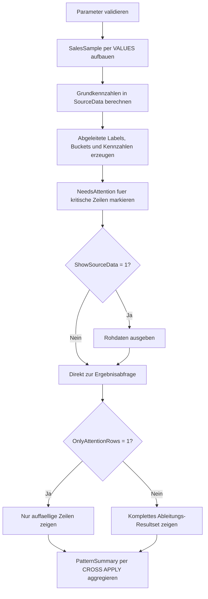

# DerivedColumnPatternLab.sql

Dieses Skript sammelt typische Muster fuer abgeleitete Spalten in `SELECT`-Listen an einem kleinen Sales-Beispiel. Es kombiniert bewusst mehrere Varianten in einem Resultset, damit Lernende Labels, Kennzahlen, Buckets, Textnormalisierung und sichere Quotienten direkt nebeneinander lesen koennen.

## Uebersicht

<!-- SQLDOC:SUMMARY_TABLE:BEGIN -->
| Feld | Wert |
|---|---|
| Script | [DerivedColumnPatternLab.sql](DerivedColumnPatternLab.sql) |
| Version | `1.0` |
| Typ | `didactic-lab` |
| Kapitel | `02_Select` |
| Sicherheit | `read-only` |
| Zweck | Demonstriert typische abgeleitete Spalten in SELECT-Listen anhand eines didaktischen Sales-Datensatzes. |
<!-- SQLDOC:SUMMARY_TABLE:END -->

## Einordnung

Im Kapitel `02_Select` ergaenzt dieses Lab die Notebooks zu Ausdruecken, `CASE`, `CAST` und `ORDER BY`. Statt nur einzelne Ausdrucksformen isoliert zu zeigen, fuehrt das Skript mehrere haeufige Ableitungsmuster in einer einzigen, nachvollziehbaren Abfrage zusammen.

## Annahmen

- Das Skript arbeitet ausschliesslich mit eingebetteten Demo-Daten und greift auf keine produktiven Tabellen zu.
- `@AsOfDate` steuert alle Statusableitungen fuer Faelligkeit und Kontaktfrische, damit die Ergebnisse reproduzierbar bleiben.
- `NeedsAttention` ist bewusst didaktisch definiert: Zeilen mit geringer Marge oder nicht mehr komfortabler Faelligkeit werden hervorgehoben.
- Die Muster priorisieren Lesbarkeit und Unterrichtsnutzen vor maximaler fachlicher Verdichtung.

## Anwendungsfall

Das Skript eignet sich fuer Besprechungen zu `CASE`, `COALESCE`, `NULLIF`, numerischen Berechnungen und kombinierten Textspalten. Besonders hilfreich ist es, wenn Lernende dieselbe Quellzeile mehrfach transformiert sehen und diskutieren sollen, welche Ableitungen fachlich stabil, lesbar und defensiv formuliert sind.

## Parameter

<!-- SQLDOC:PARAMETERS_TABLE:BEGIN -->
| Parameter | SQL-Typ | Pflicht | Beschreibung |
|---|---|---|---|
| `@AsOfDate` | `DATE` | Nein | Stichtag fuer Faelligkeits- und Kontaktableitungen. |
| `@ShowSourceData` | `BIT` | Nein | Gibt bei `1` die Rohdaten vor den abgeleiteten Spalten aus. |
| `@OnlyAttentionRows` | `BIT` | Nein | Filtert bei `1` auf Zeilen mit kritischer Faelligkeit oder geringer Marge. |
<!-- SQLDOC:PARAMETERS_TABLE:END -->

## Abhaengigkeiten

<!-- SQLDOC:DEPENDENCIES_LIST:BEGIN -->
- `CTE`
- `VALUES`-Konstruktor
- `CASE`
- `COALESCE`
- `CONCAT`
- `DATEDIFF`
- `NULLIF`
<!-- SQLDOC:DEPENDENCIES_LIST:END -->

## Hinweise

- `MarginPercent` nutzt `NULLIF`, damit ein didaktisch sichtbarer Schutz gegen Division durch null enthalten ist.
- `CommentNormalized` zeigt das typische Zusammenspiel aus `NULLIF` und `COALESCE` fuer leere oder fehlende Texte.
- `PatternSummary` verdichtet die erzeugten Labels nochmals und macht sichtbar, dass dieselben Ableitungen spaeter auch fuer Aggregationen weiterverwendet werden koennen.

## Versionshistorie

<!-- SQLDOC:VERSION_HISTORY_TABLE:BEGIN -->
| Version | Datum | User | Beschreibung |
|---|---|---|---|
| `1.0` | `2026-04-16` | `ER` | Erstversion des Labs fuer typische abgeleitete SELECT-Spalten |
<!-- SQLDOC:VERSION_HISTORY_TABLE:END -->

## Ablauf

<!-- SQLDOC:MERMAID:BEGIN -->

<!-- SQLDOC:MERMAID:END -->

## SQL-Code

<!-- SQLDOC:SQL_CODE:BEGIN -->
```sql
/*
BEGIN:SQL-HEADER v1
---
sql_header: v1
script_name: "DerivedColumnPatternLab.sql"
script_version: "1.0"
script_type: "didactic-lab"
chapter: "02_Select"

purpose: >
  Zeigt auf einem kleinen Sales-Datensatz typische abgeleitete Spalten in
  SELECT-Listen, etwa Labels per CASE, berechnete Kennzahlen, Buckets,
  Textnormalisierung und sichere Quotienten.

parameters:
  - name: "@AsOfDate"
    sql_type: "DATE"
    direction: "IN"
    required: false
    description: "Stichtag fuer Faelligkeits- und Kontaktableitungen"
  - name: "@ShowSourceData"
    sql_type: "BIT"
    direction: "IN"
    required: false
    description: "1 = Rohdaten vor den abgeleiteten Spalten zusaetzlich ausgeben"
  - name: "@OnlyAttentionRows"
    sql_type: "BIT"
    direction: "IN"
    required: false
    description: "1 = nur Zeilen mit kritischer Faelligkeit oder geringer Marge ausgeben"

result_sets:
  - name: "SourceDataPreview"
    description: "Optionale Vorschau des didaktischen Sales-Datensatzes"
  - name: "DerivedColumnPreview"
    description: "Zeigt typische abgeleitete Spalten in einer SELECT-Liste"
  - name: "PatternSummary"
    description: "Verdichtet je Ableitungsmuster die Anzahl passender Demo-Zeilen"

dependencies:
  - "CTE"
  - "VALUES constructor"
  - "CASE"
  - "COALESCE"
  - "CONCAT"
  - "DATEDIFF"
  - "NULLIF"

safety:
  level: "read-only"
  writes_data: false

documentation:
  markdown_file: "T-SQL/02_Select/SQLScripts/DerivedColumnPatternLab.md"
  sync_blocks:
    - "SUMMARY_TABLE"
    - "PARAMETERS_TABLE"
    - "DEPENDENCIES_LIST"
    - "VERSION_HISTORY_TABLE"
    - "SQL_CODE"
  mermaid:
    mode: "ai-agent-from-sql"
    source: "script-body"

main_responsible:
  name: "Erhard Rainer"
  initials: "ER"

version_history:
  - version: "1.0"
    date: "2026-04-16"
    user: "ER"
    description: "Erstversion des Labs fuer typische abgeleitete SELECT-Spalten"

notes:
  - "Die Beispiele bleiben bewusst bei Demo-Daten und ersetzen kein produktives Reporting-Modell"
  - "Die Ableitungen sind auf Lesbarkeit und Unterrichtsgespraeche optimiert"
---
END:SQL-HEADER v1
*/

SET NOCOUNT ON;

DECLARE @AsOfDate DATE = '2026-04-16';
DECLARE @ShowSourceData BIT = 1;
DECLARE @OnlyAttentionRows BIT = 0;

IF @ShowSourceData NOT IN (0, 1)
BEGIN
    THROW 50000, '@ShowSourceData muss 0 oder 1 sein.', 1;
END;

IF @OnlyAttentionRows NOT IN (0, 1)
BEGIN
    THROW 50001, '@OnlyAttentionRows muss 0 oder 1 sein.', 1;
END;

IF @AsOfDate IS NULL
BEGIN
    THROW 50002, '@AsOfDate darf nicht NULL sein.', 1;
END;

;WITH SalesSample AS
(
    SELECT
        sample.SalesOrderID,
        sample.SalesRep,
        sample.RegionCode,
        sample.OrderDate,
        sample.DueDate,
        sample.UnitPrice,
        sample.Quantity,
        sample.DiscountRate,
        sample.StandardCost,
        sample.PriorityCode,
        sample.LastContactDate,
        sample.CustomerSegment,
        sample.CommentText
    FROM
    (
        VALUES
            (1001, 'Anika', 'DE-NORTH', CAST('2026-04-03' AS DATE), CAST('2026-04-18' AS DATE), CAST(120.00 AS DECIMAL(10,2)), 4, CAST(0.05 AS DECIMAL(5,2)), CAST(88.00 AS DECIMAL(10,2)), 'A', CAST('2026-04-14' AS DATE), 'Enterprise', 'renewal confirmed'),
            (1002, 'Bora',  'DE-SOUTH', CAST('2026-04-05' AS DATE), CAST('2026-04-15' AS DATE), CAST(79.00 AS DECIMAL(10,2)), 6, CAST(0.15 AS DECIMAL(5,2)), CAST(60.00 AS DECIMAL(10,2)), 'B', CAST('2026-04-06' AS DATE), 'MidMarket', NULL),
            (1003, 'Cem',   'AT-WEST',  CAST('2026-04-07' AS DATE), CAST('2026-04-28' AS DATE), CAST(41.50 AS DECIMAL(10,2)), 15, CAST(0.00 AS DECIMAL(5,2)), CAST(24.00 AS DECIMAL(10,2)), 'C', CAST('2026-03-30' AS DATE), 'SMB', 'awaiting shipping slot'),
            (1004, 'Dina',  'CH-CENTRAL', CAST('2026-04-09' AS DATE), CAST('2026-04-13' AS DATE), CAST(250.00 AS DECIMAL(10,2)), 2, CAST(0.20 AS DECIMAL(5,2)), CAST(205.00 AS DECIMAL(10,2)), 'A', CAST('2026-04-01' AS DATE), 'Enterprise', 'urgent board review'),
            (1005, 'Emir',  'DE-NORTH', CAST('2026-04-10' AS DATE), CAST('2026-05-02' AS DATE), CAST(18.00 AS DECIMAL(10,2)), 20, CAST(0.10 AS DECIMAL(5,2)), CAST(10.50 AS DECIMAL(10,2)), 'B', CAST('2026-04-11' AS DATE), 'SMB', ''),
            (1006, 'Fina',  'AT-WEST',  CAST('2026-04-12' AS DATE), CAST('2026-04-16' AS DATE), CAST(560.00 AS DECIMAL(10,2)), 1, CAST(0.08 AS DECIMAL(5,2)), CAST(515.00 AS DECIMAL(10,2)), 'A', CAST('2026-04-15' AS DATE), 'Public', 'framework order')
    ) AS sample
    (
        SalesOrderID,
        SalesRep,
        RegionCode,
        OrderDate,
        DueDate,
        UnitPrice,
        Quantity,
        DiscountRate,
        StandardCost,
        PriorityCode,
        LastContactDate,
        CustomerSegment,
        CommentText
    )
),
SourceData AS
(
    SELECT
        s.SalesOrderID,
        s.SalesRep,
        s.RegionCode,
        s.OrderDate,
        s.DueDate,
        s.UnitPrice,
        s.Quantity,
        s.DiscountRate,
        s.StandardCost,
        s.PriorityCode,
        s.LastContactDate,
        s.CustomerSegment,
        s.CommentText,
        CAST(s.UnitPrice * s.Quantity AS DECIMAL(12,2)) AS GrossRevenue,
        CAST((s.UnitPrice * s.Quantity) * (1 - s.DiscountRate) AS DECIMAL(12,2)) AS NetRevenue,
        CAST((s.StandardCost * s.Quantity) AS DECIMAL(12,2)) AS TotalCost
    FROM SalesSample AS s
),
DerivedColumns AS
(
    SELECT
        sd.SalesOrderID,
        sd.SalesRep,
        sd.RegionCode,
        sd.CustomerSegment,
        sd.OrderDate,
        sd.DueDate,
        sd.GrossRevenue,
        sd.NetRevenue,
        sd.TotalCost,
        sd.DiscountRate,
        sd.PriorityCode,
        sd.LastContactDate,
        CONCAT(sd.RegionCode, ' | ', sd.SalesRep) AS RegionSalesLabel,
        CONCAT(YEAR(sd.OrderDate), '-', RIGHT('0' + CAST(MONTH(sd.OrderDate) AS VARCHAR(2)), 2)) AS ReportingMonth,
        CAST(sd.NetRevenue - sd.TotalCost AS DECIMAL(12,2)) AS MarginAmount,
        CAST(100.0 * (sd.NetRevenue - sd.TotalCost) / NULLIF(sd.NetRevenue, 0) AS DECIMAL(6,2)) AS MarginPercent,
        CASE sd.PriorityCode
            WHEN 'A' THEN 'Expedite'
            WHEN 'B' THEN 'Plan'
            ELSE 'Observe'
        END AS PriorityLabel,
        CASE
            WHEN DATEDIFF(DAY, @AsOfDate, sd.DueDate) < 0 THEN 'Overdue'
            WHEN DATEDIFF(DAY, @AsOfDate, sd.DueDate) <= 3 THEN 'DueSoon'
            ELSE 'OnTrack'
        END AS DueStatus,
        DATEDIFF(DAY, @AsOfDate, sd.DueDate) AS DaysUntilDue,
        CASE
            WHEN sd.NetRevenue >= 1000 THEN 'HighValue'
            WHEN sd.NetRevenue >= 400 THEN 'MediumValue'
            ELSE 'EntryValue'
        END AS RevenueBand,
        CASE
            WHEN DATEDIFF(DAY, sd.LastContactDate, @AsOfDate) <= 3 THEN 'FreshContact'
            WHEN DATEDIFF(DAY, sd.LastContactDate, @AsOfDate) <= 10 THEN 'Monitor'
            ELSE 'NeedsFollowUp'
        END AS ContactFreshness,
        COALESCE(NULLIF(sd.CommentText, ''), 'no manual comment') AS CommentNormalized,
        CASE
            WHEN sd.CustomerSegment IN ('Enterprise', 'Public') THEN 'NamedAccount'
            ELSE 'VolumeAccount'
        END AS SegmentCluster
    FROM SourceData AS sd
),
AttentionFiltered AS
(
    SELECT
        dc.SalesOrderID,
        dc.RegionSalesLabel,
        dc.ReportingMonth,
        dc.CustomerSegment,
        dc.SegmentCluster,
        dc.OrderDate,
        dc.DueDate,
        dc.DaysUntilDue,
        dc.DueStatus,
        dc.PriorityLabel,
        dc.RevenueBand,
        dc.GrossRevenue,
        dc.NetRevenue,
        dc.TotalCost,
        dc.MarginAmount,
        dc.MarginPercent,
        dc.ContactFreshness,
        dc.CommentNormalized,
        CAST(CASE WHEN dc.MarginPercent < 20 OR dc.DueStatus <> 'OnTrack' THEN 1 ELSE 0 END AS BIT) AS NeedsAttention
    FROM DerivedColumns AS dc
)
SELECT
    sd.SalesOrderID,
    sd.SalesRep,
    sd.RegionCode,
    sd.OrderDate,
    sd.DueDate,
    sd.UnitPrice,
    sd.Quantity,
    sd.DiscountRate,
    sd.StandardCost,
    sd.PriorityCode,
    sd.LastContactDate,
    sd.CustomerSegment,
    sd.CommentText
FROM SourceData AS sd
WHERE @ShowSourceData = 1
ORDER BY
    sd.SalesOrderID;

SELECT
    af.SalesOrderID,
    af.RegionSalesLabel,
    af.ReportingMonth,
    af.CustomerSegment,
    af.SegmentCluster,
    af.OrderDate,
    af.DueDate,
    af.DaysUntilDue,
    af.DueStatus,
    af.PriorityLabel,
    af.RevenueBand,
    af.GrossRevenue,
    af.NetRevenue,
    af.TotalCost,
    af.MarginAmount,
    af.MarginPercent,
    af.ContactFreshness,
    af.CommentNormalized,
    af.NeedsAttention
FROM AttentionFiltered AS af
WHERE @OnlyAttentionRows = 0
   OR af.NeedsAttention = 1
ORDER BY
    af.NeedsAttention DESC,
    af.MarginPercent,
    af.SalesOrderID;

SELECT
    summary.PatternName,
    COUNT(*) AS MatchingRows
FROM AttentionFiltered AS af
CROSS APPLY
(
    VALUES
        ('DueStatus = Overdue', CASE WHEN af.DueStatus = 'Overdue' THEN 1 ELSE 0 END),
        ('DueStatus = DueSoon', CASE WHEN af.DueStatus = 'DueSoon' THEN 1 ELSE 0 END),
        ('RevenueBand = HighValue', CASE WHEN af.RevenueBand = 'HighValue' THEN 1 ELSE 0 END),
        ('SegmentCluster = NamedAccount', CASE WHEN af.SegmentCluster = 'NamedAccount' THEN 1 ELSE 0 END),
        ('ContactFreshness = NeedsFollowUp', CASE WHEN af.ContactFreshness = 'NeedsFollowUp' THEN 1 ELSE 0 END),
        ('NeedsAttention = 1', CASE WHEN af.NeedsAttention = 1 THEN 1 ELSE 0 END)
) AS summary(PatternName, IsMatch)
WHERE summary.IsMatch = 1
GROUP BY
    summary.PatternName
ORDER BY
    summary.PatternName;

```
<!-- SQLDOC:SQL_CODE:END -->

