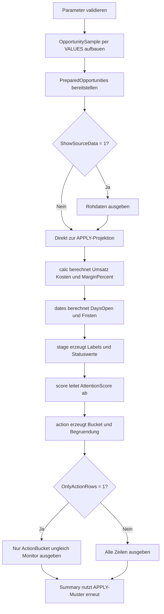

# ExpressionReuseWithApply.sql

Dieses Lab zeigt, wie wiederverwendbare Berechnungen mit `CROSS APPLY` in kleinen, lesbaren Stufen organisiert werden koennen. Statt dieselben Formeln in `SELECT`, `WHERE`, `ORDER BY` und Folgeabfragen zu wiederholen, kapselt das Skript Grundkennzahlen, Datumslogik, Statuslabels und Aktionssignale in aufeinander aufbauenden APPLY-Bloecken.

## Uebersicht

<!-- SQLDOC:SUMMARY_TABLE:BEGIN -->
| Feld | Wert |
|---|---|
| Script | [ExpressionReuseWithApply.sql](ExpressionReuseWithApply.sql) |
| Version | `1.0` |
| Typ | `didactic-lab` |
| Kapitel | `02_Select` |
| Sicherheit | `read-only` |
| Zweck | Demonstriert wiederverwendbare Berechnungen mit gestuften `CROSS APPLY`-Bloecken in `SELECT`-Abfragen. |
<!-- SQLDOC:SUMMARY_TABLE:END -->

## Einordnung

Im Kapitel `02_Select` positioniert sich das Skript zwischen einfachen Projektionen und strukturierteren Ausdruecken. Der Fokus liegt darauf, komplexere Berechnungen nicht mehrfach ausschreiben zu muessen, sondern sie mit `CROSS APPLY` einmal sauber zu benennen und danach in mehreren Teilen derselben Abfrage wiederzuverwenden.

## Annahmen

- Das Skript arbeitet ausschliesslich mit eingebetteten Demo-Daten und greift auf keine produktiven Tabellen zu.
- `@AsOfDate` steuert reproduzierbar alle Datumsableitungen fuer naechsten Schritt, Abschluss und Kontaktfrische.
- `AttentionScore` ist bewusst didaktisch modelliert und dient nur als sichtbares Beispiel fuer stufenweise Wiederverwendung.
- Die APPLY-Stufen trennen Grundkennzahlen, Datumslogik, Labels und Massnahmen, damit die Struktur leicht auf echte Reporting-Abfragen uebertragbar bleibt.

## Anwendungsfall

Das Lab eignet sich fuer Unterricht und Reviews zu `CROSS APPLY`, wenn Lernende nachvollziehen sollen, wie einmal berechnete Ausdruecke spaeter in Projektion, Filterung, Sortierung und Zusammenfassungen erneut verwendet werden. Besonders sichtbar wird der Vorteil dort, wo `MarginPercent`, `NextStepStatus` oder `AttentionScore` mehrfach auftauchen, ohne erneut ausformuliert zu werden.

## Parameter

<!-- SQLDOC:PARAMETERS_TABLE:BEGIN -->
| Parameter | SQL-Typ | Pflicht | Beschreibung |
|---|---|---|---|
| `@AsOfDate` | `DATE` | Nein | Stichtag fuer Faelligkeits-, Kontakt- und Statusableitungen. |
| `@ShowSourceData` | `BIT` | Nein | Gibt bei `1` den Demo-Datensatz vor den APPLY-Stufen zusaetzlich aus. |
| `@OnlyActionRows` | `BIT` | Nein | Filtert bei `1` auf Zeilen mit priorisiertem Handlungsbedarf. |
<!-- SQLDOC:PARAMETERS_TABLE:END -->

## Abhaengigkeiten

<!-- SQLDOC:DEPENDENCIES_LIST:BEGIN -->
- `CTE`
- `VALUES`-Konstruktor
- `CROSS APPLY`
- `CASE`
- `CONCAT`
- `DATEDIFF`
- `NULLIF`
- `CAST`
<!-- SQLDOC:DEPENDENCIES_LIST:END -->

## Hinweise

- `calc` kapselt Umsatz-, Kosten- und Margenlogik, damit `MarginPercent` spaeter direkt fuer Anzeige, Filter und Summary genutzt werden kann.
- `dates` und `stage` bauen bewusst aufeinander auf: Datumsdifferenzen werden zuerst berechnet und danach in Statuslabels umgewandelt.
- `score` und `action` zeigen, dass auch spaetere Ableitungen wieder auf frueheren APPLY-Ergebnissen aufsetzen koennen.
- Die Summary-Abfrage wiederholt das Muster auf kompakter Ebene und macht sichtbar, welche Ausdruecke sich fuer Folgeauswertungen eignen.

## Versionshistorie

<!-- SQLDOC:VERSION_HISTORY_TABLE:BEGIN -->
| Version | Datum | User | Beschreibung |
|---|---|---|---|
| `1.0` | `2026-04-19` | `ER` | Erstversion des Labs fuer wiederverwendbare Berechnungen mit CROSS APPLY |
<!-- SQLDOC:VERSION_HISTORY_TABLE:END -->

## Ablauf

<!-- SQLDOC:MERMAID:BEGIN -->

<!-- SQLDOC:MERMAID:END -->

## SQL-Code

<!-- SQLDOC:SQL_CODE:BEGIN -->
```sql
/*
BEGIN:SQL-HEADER v1
---
sql_header: v1
script_name: "ExpressionReuseWithApply.sql"
script_version: "1.0"
script_type: "didactic-lab"
chapter: "02_Select"

purpose: >
  Zeigt, wie wiederverwendbare Berechnungen mit CROSS APPLY in SELECT-Abfragen
  gekapselt und anschliessend sauber fuer Projektion, Filterung, Sortierung und
  Zusammenfassungen erneut verwendet werden.

parameters:
  - name: "@AsOfDate"
    sql_type: "DATE"
    direction: "IN"
    required: false
    description: "Stichtag fuer Faelligkeits-, Kontakt- und Statusableitungen"
  - name: "@ShowSourceData"
    sql_type: "BIT"
    direction: "IN"
    required: false
    description: "1 = den Demo-Datensatz vor den APPLY-Stufen zusaetzlich ausgeben"
  - name: "@OnlyActionRows"
    sql_type: "BIT"
    direction: "IN"
    required: false
    description: "1 = nur Zeilen mit priorisiertem Handlungsbedarf anzeigen"

result_sets:
  - name: "SourceDataPreview"
    description: "Optionale Vorschau des didaktischen Demo-Datensatzes"
  - name: "ApplyProjectionPreview"
    description: "Zeigt Berechnungen, die in gestuften CROSS APPLY-Bloecken wiederverwendet werden"
  - name: "ReusePatternSummary"
    description: "Verdichtet, welche APPLY-basierten Muster im Resultset sichtbar sind"

dependencies:
  - "CTE"
  - "VALUES constructor"
  - "CROSS APPLY"
  - "CASE"
  - "CONCAT"
  - "DATEDIFF"
  - "NULLIF"
  - "CAST"

safety:
  level: "read-only"
  writes_data: false

documentation:
  markdown_file: "T-SQL/02_Select/SQLScripts/ExpressionReuseWithApply.md"
  sync_blocks:
    - "SUMMARY_TABLE"
    - "PARAMETERS_TABLE"
    - "DEPENDENCIES_LIST"
    - "VERSION_HISTORY_TABLE"
    - "SQL_CODE"
  mermaid:
    mode: "ai-agent-from-sql"
    source: "script-body"

main_responsible:
  name: "Erhard Rainer"
  initials: "ER"

version_history:
  - version: "1.0"
    date: "2026-04-19"
    user: "ER"
    description: "Erstversion des Labs fuer wiederverwendbare Berechnungen mit CROSS APPLY"

notes:
  - "Das Skript arbeitet ausschliesslich mit Demo-Daten und zeigt keine produktiven Tabellenmuster"
  - "Die APPLY-Stufen trennen bewusst Grundkennzahlen, Statuslogik und Massnahmenempfehlungen"
---
END:SQL-HEADER v1
*/

SET NOCOUNT ON;

DECLARE @AsOfDate DATE = '2026-04-19';
DECLARE @ShowSourceData BIT = 1;
DECLARE @OnlyActionRows BIT = 0;

IF @AsOfDate IS NULL
BEGIN
    THROW 50000, '@AsOfDate darf nicht NULL sein.', 1;
END;

IF @ShowSourceData NOT IN (0, 1)
BEGIN
    THROW 50001, '@ShowSourceData muss 0 oder 1 sein.', 1;
END;

IF @OnlyActionRows NOT IN (0, 1)
BEGIN
    THROW 50002, '@OnlyActionRows muss 0 oder 1 sein.', 1;
END;

;WITH OpportunitySample AS
(
    SELECT
        sample.OpportunityID,
        sample.AccountName,
        sample.OwnerName,
        sample.RegionCode,
        sample.StageName,
        sample.PriorityCode,
        sample.OpenDate,
        sample.NextStepDate,
        sample.LastContactDate,
        sample.ExpectedCloseDate,
        sample.Quantity,
        sample.UnitPrice,
        sample.DiscountRate,
        sample.StandardCost
    FROM
    (
        VALUES
            (4101, 'Alpine Retail', 'Anika', 'DE-NORTH', 'Qualify',  'A', CAST('2026-04-03' AS DATE), CAST('2026-04-20' AS DATE), CAST('2026-04-17' AS DATE), CAST('2026-04-28' AS DATE), 12, CAST(55.00 AS DECIMAL(10,2)), CAST(0.05 AS DECIMAL(5,2)), CAST(36.00 AS DECIMAL(10,2))),
            (4102, 'Bergmann AG',   'Bora',  'AT-WEST',  'Proposal', 'B', CAST('2026-04-05' AS DATE), CAST('2026-04-16' AS DATE), CAST('2026-04-09' AS DATE), CAST('2026-04-22' AS DATE), 6,  CAST(180.00 AS DECIMAL(10,2)), CAST(0.10 AS DECIMAL(5,2)), CAST(132.00 AS DECIMAL(10,2))),
            (4103, 'City Health',   'Cem',   'CH-CENTRAL', 'Commit', 'A', CAST('2026-04-07' AS DATE), CAST('2026-04-19' AS DATE), CAST('2026-04-18' AS DATE), CAST('2026-04-20' AS DATE), 2,  CAST(920.00 AS DECIMAL(10,2)), CAST(0.03 AS DECIMAL(5,2)), CAST(660.00 AS DECIMAL(10,2))),
            (4104, 'Delta Schools', 'Dina',  'DE-SOUTH', 'Qualify',  'C', CAST('2026-04-08' AS DATE), CAST('2026-04-24' AS DATE), CAST('2026-04-08' AS DATE), CAST('2026-05-03' AS DATE), 25, CAST(21.00 AS DECIMAL(10,2)), CAST(0.00 AS DECIMAL(5,2)), CAST(13.50 AS DECIMAL(10,2))),
            (4105, 'Eiger Systems', 'Emir',  'DE-NORTH', 'Proposal', 'A', CAST('2026-04-10' AS DATE), CAST('2026-04-18' AS DATE), CAST('2026-04-11' AS DATE), CAST('2026-04-21' AS DATE), 3,  CAST(640.00 AS DECIMAL(10,2)), CAST(0.08 AS DECIMAL(5,2)), CAST(470.00 AS DECIMAL(10,2))),
            (4106, 'Fjord Clinic',  'Fina',  'AT-WEST',  'Negotiate','B', CAST('2026-04-12' AS DATE), CAST('2026-04-21' AS DATE), CAST('2026-04-16' AS DATE), CAST('2026-04-30' AS DATE), 9,  CAST(88.00 AS DECIMAL(10,2)), CAST(0.12 AS DECIMAL(5,2)), CAST(62.00 AS DECIMAL(10,2)))
    ) AS sample
    (
        OpportunityID,
        AccountName,
        OwnerName,
        RegionCode,
        StageName,
        PriorityCode,
        OpenDate,
        NextStepDate,
        LastContactDate,
        ExpectedCloseDate,
        Quantity,
        UnitPrice,
        DiscountRate,
        StandardCost
    )
),
PreparedOpportunities AS
(
    SELECT
        src.OpportunityID,
        src.AccountName,
        src.OwnerName,
        src.RegionCode,
        src.StageName,
        src.PriorityCode,
        src.OpenDate,
        src.NextStepDate,
        src.LastContactDate,
        src.ExpectedCloseDate,
        src.Quantity,
        src.UnitPrice,
        src.DiscountRate,
        src.StandardCost
    FROM OpportunitySample AS src
)
SELECT
    p.OpportunityID,
    p.AccountName,
    p.OwnerName,
    p.RegionCode,
    p.StageName,
    p.PriorityCode,
    p.OpenDate,
    p.NextStepDate,
    p.LastContactDate,
    p.ExpectedCloseDate,
    p.Quantity,
    p.UnitPrice,
    p.DiscountRate,
    p.StandardCost
FROM PreparedOpportunities AS p
WHERE @ShowSourceData = 1
ORDER BY
    p.OpportunityID;

SELECT
    p.OpportunityID,
    p.AccountName,
    stage.RegionOwnerLabel,
    stage.PipelineLabel,
    calc.GrossRevenue,
    calc.NetRevenue,
    calc.TotalCost,
    calc.MarginAmount,
    calc.MarginPercent,
    dates.DaysOpen,
    dates.DaysUntilNextStep,
    dates.DaysUntilClose,
    stage.PriorityLabel,
    stage.NextStepStatus,
    stage.ContactFreshness,
    action.ActionBucket,
    action.ActionReason,
    action.AttentionScore
FROM PreparedOpportunities AS p
CROSS APPLY
(
    SELECT
        CAST(p.Quantity * p.UnitPrice AS DECIMAL(12,2)) AS GrossRevenue,
        CAST((p.Quantity * p.UnitPrice) * (1 - p.DiscountRate) AS DECIMAL(12,2)) AS NetRevenue,
        CAST(p.Quantity * p.StandardCost AS DECIMAL(12,2)) AS TotalCost,
        CAST(((p.Quantity * p.UnitPrice) * (1 - p.DiscountRate)) - (p.Quantity * p.StandardCost) AS DECIMAL(12,2)) AS MarginAmount,
        CAST
        (
            100.0 * ((((p.Quantity * p.UnitPrice) * (1 - p.DiscountRate)) - (p.Quantity * p.StandardCost)))
            / NULLIF(((p.Quantity * p.UnitPrice) * (1 - p.DiscountRate)), 0)
            AS DECIMAL(6,2)
        ) AS MarginPercent
) AS calc
CROSS APPLY
(
    SELECT
        DATEDIFF(DAY, p.OpenDate, @AsOfDate) AS DaysOpen,
        DATEDIFF(DAY, @AsOfDate, p.NextStepDate) AS DaysUntilNextStep,
        DATEDIFF(DAY, @AsOfDate, p.ExpectedCloseDate) AS DaysUntilClose
) AS dates
CROSS APPLY
(
    SELECT
        CONCAT(p.RegionCode, ' / ', p.OwnerName) AS RegionOwnerLabel,
        CONCAT(p.StageName, ' pipeline') AS PipelineLabel,
        CASE p.PriorityCode
            WHEN 'A' THEN 'PriorityCritical'
            WHEN 'B' THEN 'PriorityPlanned'
            ELSE 'PriorityRoutine'
        END AS PriorityLabel,
        CASE
            WHEN dates.DaysUntilNextStep < 0 THEN 'NextStepOverdue'
            WHEN dates.DaysUntilNextStep <= 2 THEN 'NextStepSoon'
            ELSE 'NextStepLater'
        END AS NextStepStatus,
        CASE
            WHEN DATEDIFF(DAY, p.LastContactDate, @AsOfDate) <= 2 THEN 'FreshContact'
            WHEN DATEDIFF(DAY, p.LastContactDate, @AsOfDate) <= 7 THEN 'MonitorContact'
            ELSE 'NeedsFollowUp'
        END AS ContactFreshness
) AS stage
CROSS APPLY
(
    SELECT
        CAST
        (
            CASE WHEN p.PriorityCode = 'A' THEN 2 ELSE 0 END
            + CASE WHEN stage.NextStepStatus = 'NextStepOverdue' THEN 2 WHEN stage.NextStepStatus = 'NextStepSoon' THEN 1 ELSE 0 END
            + CASE WHEN stage.ContactFreshness = 'NeedsFollowUp' THEN 1 ELSE 0 END
            + CASE WHEN calc.MarginPercent < 25 THEN 1 ELSE 0 END
            AS INT
        ) AS AttentionScore
) AS score
CROSS APPLY
(
    SELECT
        CASE
            WHEN score.AttentionScore >= 4 THEN 'ActNow'
            WHEN score.AttentionScore >= 2 THEN 'ReviewToday'
            ELSE 'Monitor'
        END AS ActionBucket,
        CASE
            WHEN stage.NextStepStatus = 'NextStepOverdue' THEN 'Next step overdue'
            WHEN calc.MarginPercent < 25 THEN 'Margin needs review'
            WHEN stage.ContactFreshness = 'NeedsFollowUp' THEN 'Contact ageing'
            ELSE 'Pipeline remains stable'
        END AS ActionReason,
        score.AttentionScore
) AS action
WHERE @OnlyActionRows = 0
   OR action.ActionBucket <> 'Monitor'
ORDER BY
    action.AttentionScore DESC,
    calc.MarginPercent,
    p.OpportunityID;

SELECT
    summary.PatternName,
    COUNT(*) AS MatchingRows
FROM PreparedOpportunities AS p
CROSS APPLY
(
    SELECT
        CAST(p.Quantity * p.UnitPrice AS DECIMAL(12,2)) AS GrossRevenue,
        CAST((p.Quantity * p.UnitPrice) * (1 - p.DiscountRate) AS DECIMAL(12,2)) AS NetRevenue,
        CAST(p.Quantity * p.StandardCost AS DECIMAL(12,2)) AS TotalCost,
        CAST(((p.Quantity * p.UnitPrice) * (1 - p.DiscountRate)) - (p.Quantity * p.StandardCost) AS DECIMAL(12,2)) AS MarginAmount,
        CAST
        (
            100.0 * ((((p.Quantity * p.UnitPrice) * (1 - p.DiscountRate)) - (p.Quantity * p.StandardCost)))
            / NULLIF(((p.Quantity * p.UnitPrice) * (1 - p.DiscountRate)), 0)
            AS DECIMAL(6,2)
        ) AS MarginPercent
) AS calc
CROSS APPLY
(
    SELECT
        DATEDIFF(DAY, @AsOfDate, p.NextStepDate) AS DaysUntilNextStep,
        DATEDIFF(DAY, @AsOfDate, p.ExpectedCloseDate) AS DaysUntilClose
) AS dates
CROSS APPLY
(
    SELECT
        CASE p.PriorityCode
            WHEN 'A' THEN 'PriorityCritical'
            WHEN 'B' THEN 'PriorityPlanned'
            ELSE 'PriorityRoutine'
        END AS PriorityLabel,
        CASE
            WHEN dates.DaysUntilNextStep < 0 THEN 'NextStepOverdue'
            WHEN dates.DaysUntilNextStep <= 2 THEN 'NextStepSoon'
            ELSE 'NextStepLater'
        END AS NextStepStatus
) AS stage
CROSS APPLY
(
    SELECT
        CAST
        (
            CASE WHEN p.PriorityCode = 'A' THEN 2 ELSE 0 END
            + CASE WHEN stage.NextStepStatus = 'NextStepOverdue' THEN 2 WHEN stage.NextStepStatus = 'NextStepSoon' THEN 1 ELSE 0 END
            + CASE WHEN calc.MarginPercent < 25 THEN 1 ELSE 0 END
            AS INT
        ) AS AttentionScore
) AS score
CROSS APPLY
(
    VALUES
        ('PriorityCritical', CASE WHEN stage.PriorityLabel = 'PriorityCritical' THEN 1 ELSE 0 END),
        ('NextStepOverdue', CASE WHEN stage.NextStepStatus = 'NextStepOverdue' THEN 1 ELSE 0 END),
        ('CloseWithin3Days', CASE WHEN dates.DaysUntilClose <= 3 THEN 1 ELSE 0 END),
        ('MarginBelow25', CASE WHEN calc.MarginPercent < 25 THEN 1 ELSE 0 END),
        ('AttentionScoreAtLeast2', CASE WHEN score.AttentionScore >= 2 THEN 1 ELSE 0 END)
) AS summary(PatternName, IsMatch)
WHERE (@OnlyActionRows = 0 OR score.AttentionScore >= 2)
  AND summary.IsMatch = 1
GROUP BY
    summary.PatternName
ORDER BY
    summary.PatternName;
```
<!-- SQLDOC:SQL_CODE:END -->
