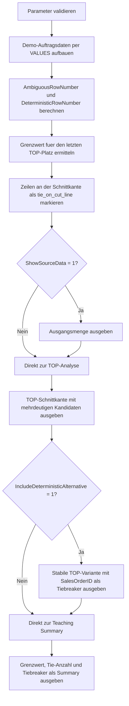

# OrderByDeterminismDemo.sql

Dieses Skript zeigt didaktisch, warum `TOP` mit einem nicht eindeutigen `ORDER BY` an der Schnittkante mehrdeutig wird. Statt auf zufaellige Engine-Effekte zu warten, macht die SQL-Datei die konkurrierenden Zeilen am Grenzwert explizit sichtbar und stellt direkt eine stabile Alternative mit Tiebreaker gegenueber.

## Uebersicht

<!-- SQLDOC:SUMMARY_TABLE:BEGIN -->
| Feld | Wert |
|---|---|
| Script | [OrderByDeterminismDemo.sql](OrderByDeterminismDemo.sql) |
| Version | `1.0` |
| Typ | `didactic-lab` |
| Kapitel | `02_Select` |
| Sicherheit | `read-only` |
| Zweck | Demonstriert, warum TOP ohne eindeutiges ORDER BY an der Schnittkante mehrdeutig wird. |
<!-- SQLDOC:SUMMARY_TABLE:END -->

## Einordnung

Im Kapitel `02_Select` schliesst dieses Lab die Luecke zwischen einem formal korrekten `ORDER BY` und einem fachlich stabilen `ORDER BY`. Das Skript zeigt, dass `ORDER BY OrderAmount DESC` zwar eine Sortierung vorgibt, aber ohne eindeutigen Zusatzschluessel mehrere Zeilen denselben letzten TOP-Platz beanspruchen koennen.

## Annahmen

- Das Skript arbeitet ausschliesslich mit eingebetteten Demo-Daten und greift auf keine produktiven Tabellen zu.
- Die Mehrdeutigkeit wird didaktisch ueber gleich hohe `OrderAmount`-Werte an der TOP-Schnittkante sichtbar gemacht.
- `SalesOrderID` dient bewusst als technischer Tiebreaker fuer die deterministische Vergleichsvariante.
- Das Skript will die Ursache der Mehrdeutigkeit erklaeren, nicht eine konkrete physische Rueckgabereihenfolge einer bestimmten Engine-Version vorhersagen.

## Anwendungsfall

Das Skript eignet sich fuer Unterricht, Code-Reviews und Style-Diskussionen rund um `TOP`, `ORDER BY`, Ranking-Funktionen und reproduzierbare Ergebnislisten. Besonders hilfreich ist es, wenn Lernende sehen sollen, warum ein scheinbar plausibles `ORDER BY` fachlich noch nicht stabil genug ist.

## Parameter

<!-- SQLDOC:PARAMETERS_TABLE:BEGIN -->
| Parameter | SQL-Typ | Pflicht | Beschreibung |
|---|---|---|---|
| `@TopCount` | `INT` | Nein | Anzahl der gewuenschten TOP-Zeilen fuer die Demo-Auswertung. |
| `@ShowSourceData` | `BIT` | Nein | Gibt bei `1` die Ausgangsmenge vor der TOP-Analyse aus. |
| `@IncludeDeterministicAlternative` | `BIT` | Nein | Gibt bei `1` die stabile Vergleichsvariante mit zusaetzlichem Tiebreaker aus. |
<!-- SQLDOC:PARAMETERS_TABLE:END -->

## Abhaengigkeiten

<!-- SQLDOC:DEPENDENCIES_LIST:BEGIN -->
- `CTE`
- `VALUES`-Konstruktor
- `ROW_NUMBER`
- `DENSE_RANK`
- `CASE`
- `COUNT(...) OVER ()`
- `MAX(...)`
<!-- SQLDOC:DEPENDENCIES_LIST:END -->

## Hinweise

- `MembershipSignal = tie_on_cut_line` markiert genau die Zeilen, fuer die `TOP` mit `ORDER BY OrderAmount DESC` keinen eindeutigen letzten Platz definieren kann.
- `AmbiguousRowNumber` zeigt die Reihenfolge einer blossen Sortierung nach `OrderAmount`, waehrend `DeterministicRowNumber` denselben Datensatz mit `SalesOrderID` stabilisiert.
- Die Teaching Summary verdichtet den Grenzwert und die Anzahl konkurrierender Zeilen, damit sich die Kernaussage auch ohne Vollresultset diskutieren laesst.

## Versionshistorie

<!-- SQLDOC:VERSION_HISTORY_TABLE:BEGIN -->
| Version | Datum | User | Beschreibung |
|---|---|---|---|
| `1.0` | `2026-04-19` | `ER` | Erstversion des Demoskripts fuer deterministische und nicht deterministische TOP-Sortierungen |
<!-- SQLDOC:VERSION_HISTORY_TABLE:END -->

## Ablauf

<!-- SQLDOC:MERMAID:BEGIN -->

<!-- SQLDOC:MERMAID:END -->

## SQL-Code

<!-- SQLDOC:SQL_CODE:BEGIN -->
```sql
/*
BEGIN:SQL-HEADER v1
---
sql_header: v1
script_name: "OrderByDeterminismDemo.sql"
script_version: "1.0"
script_type: "didactic-lab"
chapter: "02_Select"

purpose: >
  Demonstriert, warum TOP mit einem nicht eindeutigen ORDER BY an der
  Schnittkante mehrdeutig wird. Das Skript zeigt die Datenbasis, markiert
  Ties am Grenzwert und stellt eine deterministische Alternative mit
  zusaetzlichem Tiebreaker gegenueber.

parameters:
  - name: "@TopCount"
    sql_type: "INT"
    direction: "IN"
    required: false
    description: "Anzahl der gewuenschten TOP-Zeilen fuer die Demo-Auswertung"
  - name: "@ShowSourceData"
    sql_type: "BIT"
    direction: "IN"
    required: false
    description: "1 = die didaktische Ausgangsmenge vor den TOP-Auswertungen ausgeben"
  - name: "@IncludeDeterministicAlternative"
    sql_type: "BIT"
    direction: "IN"
    required: false
    description: "1 = zusaetzlich die stabile Variante mit eindeutigem Tiebreaker ausgeben"

result_sets:
  - name: "SourceDataPreview"
    description: "Optionale Vorschau der Demo-Auftragsdaten"
  - name: "TopCutAnalysis"
    description: "Zeigt Rangfolge, Grenzwert und mehrdeutige Kandidaten bei TOP mit nicht eindeutigem ORDER BY"
  - name: "DeterministicAlternative"
    description: "Stellt eine stabile TOP-Variante mit zusaetzlichem Tiebreaker gegenueber"
  - name: "TeachingSummary"
    description: "Verdichtet die didaktischen Signale zur Mehrdeutigkeit und zur stabilen Sortierung"

dependencies:
  - "CTE"
  - "VALUES constructor"
  - "ROW_NUMBER"
  - "DENSE_RANK"
  - "CASE"
  - "COUNT OVER"
  - "MAX"

safety:
  level: "read-only"
  writes_data: false

documentation:
  markdown_file: "T-SQL/02_Select/SQLScripts/OrderByDeterminismDemo.md"
  sync_blocks:
    - "SUMMARY_TABLE"
    - "PARAMETERS_TABLE"
    - "DEPENDENCIES_LIST"
    - "VERSION_HISTORY_TABLE"
    - "SQL_CODE"
  mermaid:
    mode: "ai-agent-from-sql"
    source: "script-body"

main_responsible:
  name: "Erhard Rainer"
  initials: "ER"

version_history:
  - version: "1.0"
    date: "2026-04-19"
    user: "ER"
    description: "Erstversion des Demoskripts fuer deterministische und nicht deterministische TOP-Sortierungen"

notes:
  - "Das Skript simuliert Mehrdeutigkeit didaktisch ueber Ties an der TOP-Grenze statt Engine-Zufall reproduzieren zu muessen"
  - "Die stabile Alternative verwendet SalesOrderID bewusst als eindeutigen Tiebreaker"
---
END:SQL-HEADER v1
*/

SET NOCOUNT ON;

DECLARE @TopCount INT = 3;
DECLARE @ShowSourceData BIT = 1;
DECLARE @IncludeDeterministicAlternative BIT = 1;

IF @TopCount IS NULL OR @TopCount < 1
BEGIN
    THROW 50000, '@TopCount muss mindestens 1 sein.', 1;
END;

IF @ShowSourceData NOT IN (0, 1)
BEGIN
    THROW 50001, '@ShowSourceData muss 0 oder 1 sein.', 1;
END;

IF @IncludeDeterministicAlternative NOT IN (0, 1)
BEGIN
    THROW 50002, '@IncludeDeterministicAlternative muss 0 oder 1 sein.', 1;
END;

;WITH OrderSample AS
(
    SELECT
        sample.SalesOrderID,
        sample.CustomerName,
        sample.RegionCode,
        sample.PriorityCode,
        sample.OrderAmount,
        sample.MarginPercent,
        sample.OrderDate
    FROM
    (
        VALUES
            (2001, 'Alpenmarkt',     'DE-NORTH', 'A', CAST(980.00 AS DECIMAL(10,2)), CAST(34.50 AS DECIMAL(6,2)), CAST('2026-04-10' AS DATE)),
            (2002, 'Bergblick',      'DE-SOUTH', 'A', CAST(910.00 AS DECIMAL(10,2)), CAST(31.25 AS DECIMAL(6,2)), CAST('2026-04-11' AS DATE)),
            (2003, 'City Retail',    'AT-WEST',  'B', CAST(875.00 AS DECIMAL(10,2)), CAST(29.00 AS DECIMAL(6,2)), CAST('2026-04-12' AS DATE)),
            (2004, 'Delta Health',   'CH-CENTRAL', 'B', CAST(875.00 AS DECIMAL(10,2)), CAST(33.80 AS DECIMAL(6,2)), CAST('2026-04-13' AS DATE)),
            (2005, 'Eisbach Schule', 'DE-NORTH', 'B', CAST(875.00 AS DECIMAL(10,2)), CAST(27.40 AS DECIMAL(6,2)), CAST('2026-04-14' AS DATE)),
            (2006, 'Forum Technik',  'AT-WEST',  'C', CAST(790.00 AS DECIMAL(10,2)), CAST(24.10 AS DECIMAL(6,2)), CAST('2026-04-15' AS DATE)),
            (2007, 'Gletscher AG',   'DE-SOUTH', 'C', CAST(720.00 AS DECIMAL(10,2)), CAST(22.30 AS DECIMAL(6,2)), CAST('2026-04-16' AS DATE))
    ) AS sample
    (
        SalesOrderID,
        CustomerName,
        RegionCode,
        PriorityCode,
        OrderAmount,
        MarginPercent,
        OrderDate
    )
),
PreparedOrders AS
(
    SELECT
        os.SalesOrderID,
        os.CustomerName,
        os.RegionCode,
        os.PriorityCode,
        os.OrderAmount,
        os.MarginPercent,
        os.OrderDate,
        DENSE_RANK() OVER (ORDER BY os.OrderAmount DESC) AS AmountBandRank,
        ROW_NUMBER() OVER (ORDER BY os.OrderAmount DESC, os.SalesOrderID ASC) AS DeterministicRowNumber,
        ROW_NUMBER() OVER (ORDER BY os.OrderAmount DESC) AS AmbiguousRowNumber
    FROM OrderSample AS os
),
CutLine AS
(
    SELECT
        MAX(CASE WHEN po.DeterministicRowNumber = @TopCount THEN po.OrderAmount END) AS BoundaryAmount
    FROM PreparedOrders AS po
),
TopCutAnalysis AS
(
    SELECT
        po.SalesOrderID,
        po.CustomerName,
        po.RegionCode,
        po.PriorityCode,
        po.OrderAmount,
        po.MarginPercent,
        po.OrderDate,
        po.AmountBandRank,
        po.AmbiguousRowNumber,
        po.DeterministicRowNumber,
        cl.BoundaryAmount,
        COUNT(CASE WHEN po.OrderAmount = cl.BoundaryAmount THEN 1 END) OVER () AS BoundaryTieCount,
        CASE
            WHEN po.DeterministicRowNumber < @TopCount THEN 'always_in_top'
            WHEN po.OrderAmount = cl.BoundaryAmount THEN 'tie_on_cut_line'
            ELSE 'below_cut_line'
        END AS MembershipSignal,
        CASE
            WHEN po.OrderAmount = cl.BoundaryAmount THEN 'TOP mit OrderAmount allein ist hier mehrdeutig, weil mehrere Zeilen denselben Grenzwert teilen.'
            WHEN po.DeterministicRowNumber < @TopCount THEN 'Diese Zeile liegt oberhalb der Schnittkante und bleibt auch ohne Tiebreaker im TOP-Bereich.'
            ELSE 'Diese Zeile liegt unterhalb der Schnittkante und dient nur als Vergleich unterhalb des Grenzwerts.'
        END AS Interpretation
    FROM PreparedOrders AS po
    CROSS JOIN CutLine AS cl
),
TeachingSummary AS
(
    SELECT
        'BoundaryAmount' AS SummaryKey,
        CAST(cl.BoundaryAmount AS VARCHAR(30)) AS SummaryValue,
        'Wert an der TOP-Schnittkante nach OrderAmount DESC' AS Explanation
    FROM CutLine AS cl

    UNION ALL

    SELECT
        'BoundaryTieCount',
        CAST(MAX(tca.BoundaryTieCount) AS VARCHAR(30)),
        'Anzahl der Zeilen, die denselben Grenzwert teilen und daher um den letzten TOP-Platz konkurrieren'
    FROM TopCutAnalysis AS tca

    UNION ALL

    SELECT
        'AmbiguousCandidates',
        CAST(COUNT(*) AS VARCHAR(30)),
        'Zeilen mit MembershipSignal = tie_on_cut_line'
    FROM TopCutAnalysis AS tca
    WHERE tca.MembershipSignal = 'tie_on_cut_line'

    UNION ALL

    SELECT
        'DeterministicTiebreaker',
        'SalesOrderID ASC',
        'Zusaetzliche Sortierspalte, die dieselben Werte reproduzierbar aufloest'
)
SELECT
    po.SalesOrderID,
    po.CustomerName,
    po.RegionCode,
    po.PriorityCode,
    po.OrderAmount,
    po.MarginPercent,
    po.OrderDate
FROM PreparedOrders AS po
WHERE @ShowSourceData = 1
ORDER BY
    po.OrderAmount DESC,
    po.SalesOrderID ASC;

SELECT
    tca.SalesOrderID,
    tca.CustomerName,
    tca.RegionCode,
    tca.PriorityCode,
    tca.OrderAmount,
    tca.MarginPercent,
    tca.OrderDate,
    tca.AmountBandRank,
    tca.AmbiguousRowNumber,
    tca.DeterministicRowNumber,
    tca.BoundaryAmount,
    tca.BoundaryTieCount,
    tca.MembershipSignal,
    tca.Interpretation
FROM TopCutAnalysis AS tca
WHERE tca.DeterministicRowNumber <= @TopCount
   OR tca.MembershipSignal = 'tie_on_cut_line'
ORDER BY
    tca.OrderAmount DESC,
    tca.SalesOrderID ASC;

SELECT
    po.SalesOrderID,
    po.CustomerName,
    po.RegionCode,
    po.PriorityCode,
    po.OrderAmount,
    po.MarginPercent,
    po.OrderDate,
    po.DeterministicRowNumber,
    'TOP mit OrderAmount DESC, SalesOrderID ASC' AS StableOrderBy
FROM PreparedOrders AS po
WHERE @IncludeDeterministicAlternative = 1
  AND po.DeterministicRowNumber <= @TopCount
ORDER BY
    po.DeterministicRowNumber;

SELECT
    ts.SummaryKey,
    ts.SummaryValue,
    ts.Explanation
FROM TeachingSummary AS ts
ORDER BY
    ts.SummaryKey;
```
<!-- SQLDOC:SQL_CODE:END -->
