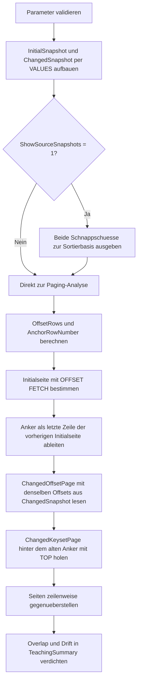

# PaginationConsistencyCheck.sql

Dieses Lab vergleicht zwei verbreitete Paging-Strategien in einer kontrollierten Demo: klassisches `OFFSET ... FETCH` und eine Keyset-Fortsetzung ueber den letzten Sortierschluessel der vorigen Seite. Die Datenbasis wird zwischen den beiden Abrufen bewusst veraendert, damit sichtbar wird, wie eine neue oder umsortierte Zeile die Seitenzusammensetzung beeinflussen kann.

## Uebersicht

<!-- SQLDOC:SUMMARY_TABLE:BEGIN -->
| Feld | Wert |
|---|---|
| Script | [PaginationConsistencyCheck.sql](PaginationConsistencyCheck.sql) |
| Version | `1.0` |
| Typ | `didactic-lab` |
| Kapitel | `02_Select` |
| Sicherheit | `read-only` |
| Zweck | Vergleicht OFFSET/FETCH und Keyset-Pagination auf Konsistenz bei verschobener Sortiermenge. |
<!-- SQLDOC:SUMMARY_TABLE:END -->

## Einordnung

Im Kapitel `02_Select` schliesst das Skript die Luecke zwischen einem korrekt formulierten `ORDER BY` und einer stabilen Seitennavigation. Das Lab zeigt nicht nur die Syntax von `OFFSET ... FETCH`, sondern vor allem die fachliche Frage, ob Seite 2 nach einer parallelen Aenderung noch dieselbe Fortsetzung der vorherigen Seite darstellt.

## Annahmen

- Das Skript arbeitet mit zwei fest eingebetteten Schnappschuessen derselben Demo-Daten und startet keine echten parallelen Sessions.
- Die Sortierung ist bewusst eindeutig definiert ueber `OrderDate DESC`, abgeleitetes Prioritaetsgewicht und `SalesOrderID DESC`.
- `Jade Mobility` simuliert eine neu eingefuegte Zeile zwischen zwei Seitenabrufen, waehrend `Forum Clinic` eine geaenderte Prioritaet repraesentiert.
- Die Keyset-Variante verwendet den letzten Datensatz der vorherigen Initialseite als Anker fuer die Fortsetzung.

## Anwendungsfall

Das Skript eignet sich fuer Unterricht, Architekturgespraeche und Reviews zu Paging in UIs oder APIs. Es ist besonders hilfreich, wenn Lernende sehen sollen, warum `OFFSET ... FETCH` zwar einfach zu schreiben ist, aber unter veraenderten Sortiermengen zu Drift, Duplikaten oder uebersprungenen Zeilen fuehren kann.

## Parameter

<!-- SQLDOC:PARAMETERS_TABLE:BEGIN -->
| Parameter | SQL-Typ | Pflicht | Beschreibung |
|---|---|---|---|
| `@PageSize` | `INT` | Nein | Anzahl der Zeilen pro Seite in der Demo. |
| `@TargetPageNumber` | `INT` | Nein | Zielseite fuer den Vergleich; ab `2` sinnvoll wegen des benoetigten Ankers. |
| `@ShowSourceSnapshots` | `BIT` | Nein | Gibt bei `1` beide Daten-Schnappschuesse vor der Paging-Analyse aus. |
<!-- SQLDOC:PARAMETERS_TABLE:END -->

## Abhaengigkeiten

<!-- SQLDOC:DEPENDENCIES_LIST:BEGIN -->
- `CTE`
- `VALUES`-Konstruktor
- `CASE`
- `ROW_NUMBER`
- `OFFSET ... FETCH`
- `TOP`
- `EXISTS`
<!-- SQLDOC:DEPENDENCIES_LIST:END -->

## Hinweise

- Die Initialseite dient als Referenz fuer das, was eine Benutzerin nach dem ersten Abruf bereits gesehen hat.
- Die veraenderte OFFSET-Seite springt anhand der neuen Positionsnummern in die geaenderte Menge und kann dadurch andere Zeilen liefern als die urspruengliche Fortsetzung.
- Die veraenderte Keyset-Seite sucht stattdessen alle Zeilen hinter dem alten Anker und liefert damit die stabilere fachliche Fortsetzung.
- Die Summary zaehlt, wie viele Zeilen pro Strategie mit der urspruenglichen Zielseite ueberlappen und wie viele neue Zeilen nur durch die Verschiebung sichtbar werden.

## Versionshistorie

<!-- SQLDOC:VERSION_HISTORY_TABLE:BEGIN -->
| Version | Datum | User | Beschreibung |
|---|---|---|---|
| `1.0` | `2026-04-19` | `ER` | Erstversion des Labs fuer Paging-Konsistenz bei veraenderter Sortiermenge |
<!-- SQLDOC:VERSION_HISTORY_TABLE:END -->

## Ablauf

<!-- SQLDOC:MERMAID:BEGIN -->

<!-- SQLDOC:MERMAID:END -->

## SQL-Code

<!-- SQLDOC:SQL_CODE:BEGIN -->
```sql
/*
BEGIN:SQL-HEADER v1
---
sql_header: v1
script_name: "PaginationConsistencyCheck.sql"
script_version: "1.0"
script_type: "didactic-lab"
chapter: "02_Select"

purpose: >
  Vergleicht OFFSET/FETCH und Keyset-Pagination auf Konsistenz, wenn sich
  zwischen zwei Seitenabrufen die sortierte Datenmenge durch eine neue Zeile
  oder geaenderte Prioritaeten verschiebt.

parameters:
  - name: "@PageSize"
    sql_type: "INT"
    direction: "IN"
    required: false
    description: "Anzahl der Zeilen pro Seite in der Demo"
  - name: "@TargetPageNumber"
    sql_type: "INT"
    direction: "IN"
    required: false
    description: "Zielseite fuer den Vergleich; ab 2 sinnvoll wegen des Anchor-Konzepts"
  - name: "@ShowSourceSnapshots"
    sql_type: "BIT"
    direction: "IN"
    required: false
    description: "1 = beide Schnappschuesse der Demo-Daten vor der Paging-Analyse ausgeben"

result_sets:
  - name: "SourceSnapshots"
    description: "Optionale Vorschau auf den Ausgangs- und Veraenderungszustand der Demo-Daten"
  - name: "PaginationComparison"
    description: "Stellt Initialseite, veraenderte OFFSET-Seite und veraenderte Keyset-Seite direkt gegenueber"
  - name: "TeachingSummary"
    description: "Verdichtet Anchor, Ueberschneidungen und sichtbare Drift zwischen den Strategien"

dependencies:
  - "CTE"
  - "VALUES constructor"
  - "CASE"
  - "ROW_NUMBER"
  - "OFFSET FETCH"
  - "TOP"
  - "EXISTS"

safety:
  level: "read-only"
  writes_data: false

documentation:
  markdown_file: "T-SQL/02_Select/SQLScripts/PaginationConsistencyCheck.md"
  sync_blocks:
    - "SUMMARY_TABLE"
    - "PARAMETERS_TABLE"
    - "DEPENDENCIES_LIST"
    - "VERSION_HISTORY_TABLE"
    - "SQL_CODE"
  mermaid:
    mode: "ai-agent-from-sql"
    source: "script-body"

main_responsible:
  name: "Erhard Rainer"
  initials: "ER"

version_history:
  - version: "1.0"
    date: "2026-04-19"
    user: "ER"
    description: "Erstversion des Labs fuer Paging-Konsistenz bei veraenderter Sortiermenge"

notes:
  - "Das Skript nutzt zwei feste Schnappschuesse statt echter paralleler Sessions, um Paging-Drift reproduzierbar zu zeigen"
  - "Keyset-Pagination wird ueber den letzten Sortierschluessel der Vorausseite modelliert"
---
END:SQL-HEADER v1
*/

SET NOCOUNT ON;

DECLARE @PageSize INT = 3;
DECLARE @TargetPageNumber INT = 2;
DECLARE @ShowSourceSnapshots BIT = 1;

DECLARE @OffsetRows INT = (@TargetPageNumber - 1) * @PageSize;
DECLARE @AnchorRowNumber INT = @OffsetRows;

IF @PageSize IS NULL OR @PageSize < 1
BEGIN
    THROW 50000, '@PageSize muss mindestens 1 sein.', 1;
END;

IF @TargetPageNumber IS NULL OR @TargetPageNumber < 2
BEGIN
    THROW 50001, '@TargetPageNumber muss mindestens 2 sein.', 1;
END;

IF @ShowSourceSnapshots NOT IN (0, 1)
BEGIN
    THROW 50002, '@ShowSourceSnapshots muss 0 oder 1 sein.', 1;
END;

;WITH InitialOrders AS
(
    SELECT
        sample.SalesOrderID,
        sample.CustomerName,
        sample.PriorityCode,
        sample.OrderDate,
        sample.OrderAmount,
        sample.ChangeNote
    FROM
    (
        VALUES
            (3109, 'Iris Pharma',      'A', CAST('2026-04-18' AS DATE), CAST(980.00 AS DECIMAL(10,2)), 'Initial dataset'),
            (3108, 'Helios Foods',     'B', CAST('2026-04-18' AS DATE), CAST(910.00 AS DECIMAL(10,2)), 'Initial dataset'),
            (3107, 'Gipfel Retail',    'A', CAST('2026-04-17' AS DATE), CAST(890.00 AS DECIMAL(10,2)), 'Initial dataset'),
            (3106, 'Forum Clinic',     'B', CAST('2026-04-17' AS DATE), CAST(870.00 AS DECIMAL(10,2)), 'Initial dataset'),
            (3105, 'Eiger Systems',    'C', CAST('2026-04-16' AS DATE), CAST(860.00 AS DECIMAL(10,2)), 'Initial dataset'),
            (3104, 'Delta Schools',    'B', CAST('2026-04-16' AS DATE), CAST(845.00 AS DECIMAL(10,2)), 'Initial dataset'),
            (3103, 'City Market',      'A', CAST('2026-04-15' AS DATE), CAST(835.00 AS DECIMAL(10,2)), 'Initial dataset'),
            (3102, 'Bergblick GmbH',   'B', CAST('2026-04-15' AS DATE), CAST(820.00 AS DECIMAL(10,2)), 'Initial dataset'),
            (3101, 'Alpen Office',     'C', CAST('2026-04-14' AS DATE), CAST(800.00 AS DECIMAL(10,2)), 'Initial dataset')
    ) AS sample
    (
        SalesOrderID,
        CustomerName,
        PriorityCode,
        OrderDate,
        OrderAmount,
        ChangeNote
    )
),
ChangedOrders AS
(
    SELECT
        sample.SalesOrderID,
        sample.CustomerName,
        sample.PriorityCode,
        sample.OrderDate,
        sample.OrderAmount,
        sample.ChangeNote
    FROM
    (
        VALUES
            (3110, 'Jade Mobility',    'A', CAST('2026-04-19' AS DATE), CAST(995.00 AS DECIMAL(10,2)), 'Inserted between page requests'),
            (3109, 'Iris Pharma',      'A', CAST('2026-04-18' AS DATE), CAST(980.00 AS DECIMAL(10,2)), 'Unchanged'),
            (3108, 'Helios Foods',     'B', CAST('2026-04-18' AS DATE), CAST(910.00 AS DECIMAL(10,2)), 'Unchanged'),
            (3107, 'Gipfel Retail',    'A', CAST('2026-04-17' AS DATE), CAST(890.00 AS DECIMAL(10,2)), 'Unchanged'),
            (3106, 'Forum Clinic',     'A', CAST('2026-04-17' AS DATE), CAST(870.00 AS DECIMAL(10,2)), 'Priority raised after page 1'),
            (3105, 'Eiger Systems',    'C', CAST('2026-04-16' AS DATE), CAST(860.00 AS DECIMAL(10,2)), 'Unchanged'),
            (3104, 'Delta Schools',    'B', CAST('2026-04-16' AS DATE), CAST(845.00 AS DECIMAL(10,2)), 'Unchanged'),
            (3103, 'City Market',      'A', CAST('2026-04-15' AS DATE), CAST(835.00 AS DECIMAL(10,2)), 'Unchanged'),
            (3102, 'Bergblick GmbH',   'B', CAST('2026-04-15' AS DATE), CAST(820.00 AS DECIMAL(10,2)), 'Unchanged'),
            (3101, 'Alpen Office',     'C', CAST('2026-04-14' AS DATE), CAST(800.00 AS DECIMAL(10,2)), 'Unchanged')
    ) AS sample
    (
        SalesOrderID,
        CustomerName,
        PriorityCode,
        OrderDate,
        OrderAmount,
        ChangeNote
    )
),
SourcePreview AS
(
    SELECT
        'InitialSnapshot' AS SnapshotName,
        io.SalesOrderID,
        io.CustomerName,
        io.PriorityCode,
        io.OrderDate,
        io.OrderAmount,
        io.ChangeNote
    FROM InitialOrders AS io

    UNION ALL

    SELECT
        'ChangedSnapshot' AS SnapshotName,
        co.SalesOrderID,
        co.CustomerName,
        co.PriorityCode,
        co.OrderDate,
        co.OrderAmount,
        co.ChangeNote
    FROM ChangedOrders AS co
)
SELECT
    sp.SnapshotName,
    sp.SalesOrderID,
    sp.CustomerName,
    sp.PriorityCode,
    sp.OrderDate,
    sp.OrderAmount,
    sp.ChangeNote
FROM SourcePreview AS sp
WHERE @ShowSourceSnapshots = 1
ORDER BY
    sp.SnapshotName,
    sp.OrderDate DESC,
    CASE sp.PriorityCode WHEN 'A' THEN 3 WHEN 'B' THEN 2 ELSE 1 END DESC,
    sp.SalesOrderID DESC;

;WITH InitialOrders AS
(
    SELECT
        sample.SalesOrderID,
        sample.CustomerName,
        sample.PriorityCode,
        sample.OrderDate,
        sample.OrderAmount
    FROM
    (
        VALUES
            (3109, 'Iris Pharma',      'A', CAST('2026-04-18' AS DATE), CAST(980.00 AS DECIMAL(10,2))),
            (3108, 'Helios Foods',     'B', CAST('2026-04-18' AS DATE), CAST(910.00 AS DECIMAL(10,2))),
            (3107, 'Gipfel Retail',    'A', CAST('2026-04-17' AS DATE), CAST(890.00 AS DECIMAL(10,2))),
            (3106, 'Forum Clinic',     'B', CAST('2026-04-17' AS DATE), CAST(870.00 AS DECIMAL(10,2))),
            (3105, 'Eiger Systems',    'C', CAST('2026-04-16' AS DATE), CAST(860.00 AS DECIMAL(10,2))),
            (3104, 'Delta Schools',    'B', CAST('2026-04-16' AS DATE), CAST(845.00 AS DECIMAL(10,2))),
            (3103, 'City Market',      'A', CAST('2026-04-15' AS DATE), CAST(835.00 AS DECIMAL(10,2))),
            (3102, 'Bergblick GmbH',   'B', CAST('2026-04-15' AS DATE), CAST(820.00 AS DECIMAL(10,2))),
            (3101, 'Alpen Office',     'C', CAST('2026-04-14' AS DATE), CAST(800.00 AS DECIMAL(10,2)))
    ) AS sample
    (
        SalesOrderID,
        CustomerName,
        PriorityCode,
        OrderDate,
        OrderAmount
    )
),
ChangedOrders AS
(
    SELECT
        sample.SalesOrderID,
        sample.CustomerName,
        sample.PriorityCode,
        sample.OrderDate,
        sample.OrderAmount
    FROM
    (
        VALUES
            (3110, 'Jade Mobility',    'A', CAST('2026-04-19' AS DATE), CAST(995.00 AS DECIMAL(10,2))),
            (3109, 'Iris Pharma',      'A', CAST('2026-04-18' AS DATE), CAST(980.00 AS DECIMAL(10,2))),
            (3108, 'Helios Foods',     'B', CAST('2026-04-18' AS DATE), CAST(910.00 AS DECIMAL(10,2))),
            (3107, 'Gipfel Retail',    'A', CAST('2026-04-17' AS DATE), CAST(890.00 AS DECIMAL(10,2))),
            (3106, 'Forum Clinic',     'A', CAST('2026-04-17' AS DATE), CAST(870.00 AS DECIMAL(10,2))),
            (3105, 'Eiger Systems',    'C', CAST('2026-04-16' AS DATE), CAST(860.00 AS DECIMAL(10,2))),
            (3104, 'Delta Schools',    'B', CAST('2026-04-16' AS DATE), CAST(845.00 AS DECIMAL(10,2))),
            (3103, 'City Market',      'A', CAST('2026-04-15' AS DATE), CAST(835.00 AS DECIMAL(10,2))),
            (3102, 'Bergblick GmbH',   'B', CAST('2026-04-15' AS DATE), CAST(820.00 AS DECIMAL(10,2))),
            (3101, 'Alpen Office',     'C', CAST('2026-04-14' AS DATE), CAST(800.00 AS DECIMAL(10,2)))
    ) AS sample
    (
        SalesOrderID,
        CustomerName,
        PriorityCode,
        OrderDate,
        OrderAmount
    )
),
InitialPrepared AS
(
    SELECT
        io.SalesOrderID,
        io.CustomerName,
        io.PriorityCode,
        CASE io.PriorityCode WHEN 'A' THEN 3 WHEN 'B' THEN 2 ELSE 1 END AS PriorityWeight,
        io.OrderDate,
        io.OrderAmount
    FROM InitialOrders AS io
),
ChangedPrepared AS
(
    SELECT
        co.SalesOrderID,
        co.CustomerName,
        co.PriorityCode,
        CASE co.PriorityCode WHEN 'A' THEN 3 WHEN 'B' THEN 2 ELSE 1 END AS PriorityWeight,
        co.OrderDate,
        co.OrderAmount
    FROM ChangedOrders AS co
),
InitialOrdered AS
(
    SELECT
        ip.SalesOrderID,
        ip.CustomerName,
        ip.PriorityCode,
        ip.PriorityWeight,
        ip.OrderDate,
        ip.OrderAmount,
        ROW_NUMBER() OVER
        (
            ORDER BY
                ip.OrderDate DESC,
                ip.PriorityWeight DESC,
                ip.SalesOrderID DESC
        ) AS AbsoluteRowNumber
    FROM InitialPrepared AS ip
),
AnchorRow AS
(
    SELECT
        io.SalesOrderID AS AnchorSalesOrderID,
        io.OrderDate AS AnchorOrderDate,
        io.PriorityWeight AS AnchorPriorityWeight
    FROM InitialOrdered AS io
    WHERE io.AbsoluteRowNumber = @AnchorRowNumber
),
InitialOffsetBase AS
(
    SELECT
        io.SalesOrderID,
        io.CustomerName,
        io.PriorityCode,
        io.OrderDate,
        io.OrderAmount
    FROM InitialPrepared AS io
    ORDER BY
        io.OrderDate DESC,
        io.PriorityWeight DESC,
        io.SalesOrderID DESC
    OFFSET @OffsetRows ROWS FETCH NEXT @PageSize ROWS ONLY
),
ChangedOffsetBase AS
(
    SELECT
        co.SalesOrderID,
        co.CustomerName,
        co.PriorityCode,
        co.OrderDate,
        co.OrderAmount
    FROM ChangedPrepared AS co
    ORDER BY
        co.OrderDate DESC,
        co.PriorityWeight DESC,
        co.SalesOrderID DESC
    OFFSET @OffsetRows ROWS FETCH NEXT @PageSize ROWS ONLY
),
ChangedKeysetBase AS
(
    SELECT TOP (@PageSize)
        co.SalesOrderID,
        co.CustomerName,
        co.PriorityCode,
        co.OrderDate,
        co.OrderAmount
    FROM ChangedPrepared AS co
    CROSS JOIN AnchorRow AS ar
    WHERE
        co.OrderDate < ar.AnchorOrderDate
        OR (co.OrderDate = ar.AnchorOrderDate AND co.PriorityWeight < ar.AnchorPriorityWeight)
        OR (co.OrderDate = ar.AnchorOrderDate AND co.PriorityWeight = ar.AnchorPriorityWeight AND co.SalesOrderID < ar.AnchorSalesOrderID)
    ORDER BY
        co.OrderDate DESC,
        co.PriorityWeight DESC,
        co.SalesOrderID DESC
),
InitialOffsetPage AS
(
    SELECT
        ROW_NUMBER() OVER (ORDER BY ib.OrderDate DESC, CASE ib.PriorityCode WHEN 'A' THEN 3 WHEN 'B' THEN 2 ELSE 1 END DESC, ib.SalesOrderID DESC) AS PageSlot,
        'InitialOffsetPage' AS StrategyName,
        ib.SalesOrderID,
        ib.CustomerName,
        ib.PriorityCode,
        ib.OrderDate,
        ib.OrderAmount
    FROM InitialOffsetBase AS ib
),
ChangedOffsetPage AS
(
    SELECT
        ROW_NUMBER() OVER (ORDER BY cb.OrderDate DESC, CASE cb.PriorityCode WHEN 'A' THEN 3 WHEN 'B' THEN 2 ELSE 1 END DESC, cb.SalesOrderID DESC) AS PageSlot,
        'ChangedOffsetPage' AS StrategyName,
        cb.SalesOrderID,
        cb.CustomerName,
        cb.PriorityCode,
        cb.OrderDate,
        cb.OrderAmount
    FROM ChangedOffsetBase AS cb
),
ChangedKeysetPage AS
(
    SELECT
        ROW_NUMBER() OVER (ORDER BY kb.OrderDate DESC, CASE kb.PriorityCode WHEN 'A' THEN 3 WHEN 'B' THEN 2 ELSE 1 END DESC, kb.SalesOrderID DESC) AS PageSlot,
        'ChangedKeysetPage' AS StrategyName,
        kb.SalesOrderID,
        kb.CustomerName,
        kb.PriorityCode,
        kb.OrderDate,
        kb.OrderAmount
    FROM ChangedKeysetBase AS kb
),
ComparisonRows AS
(
    SELECT * FROM InitialOffsetPage
    UNION ALL
    SELECT * FROM ChangedOffsetPage
    UNION ALL
    SELECT * FROM ChangedKeysetPage
)
SELECT
    cr.StrategyName,
    cr.PageSlot,
    cr.SalesOrderID,
    cr.CustomerName,
    cr.PriorityCode,
    cr.OrderDate,
    cr.OrderAmount,
    CASE
        WHEN cr.StrategyName = 'ChangedOffsetPage'
             AND EXISTS
             (
                 SELECT 1
                 FROM InitialOffsetPage AS iop
                 WHERE iop.SalesOrderID = cr.SalesOrderID
             ) THEN 'Offset kept an initial row'
        WHEN cr.StrategyName = 'ChangedOffsetPage' THEN 'Offset drifted to a different row'
        WHEN cr.StrategyName = 'ChangedKeysetPage'
             AND EXISTS
             (
                 SELECT 1
                 FROM InitialOffsetPage AS iop
                 WHERE iop.SalesOrderID = cr.SalesOrderID
             ) THEN 'Keyset preserved the initial continuation'
        WHEN cr.StrategyName = 'ChangedKeysetPage' THEN 'Keyset exposed a later row after the anchor'
        ELSE 'Initial reference page'
    END AS ComparisonSignal
FROM ComparisonRows AS cr
ORDER BY
    cr.PageSlot,
    CASE cr.StrategyName
        WHEN 'InitialOffsetPage' THEN 1
        WHEN 'ChangedOffsetPage' THEN 2
        ELSE 3
    END;

;WITH InitialOrders AS
(
    SELECT
        sample.SalesOrderID,
        sample.CustomerName,
        sample.PriorityCode,
        sample.OrderDate,
        sample.OrderAmount
    FROM
    (
        VALUES
            (3109, 'Iris Pharma',      'A', CAST('2026-04-18' AS DATE), CAST(980.00 AS DECIMAL(10,2))),
            (3108, 'Helios Foods',     'B', CAST('2026-04-18' AS DATE), CAST(910.00 AS DECIMAL(10,2))),
            (3107, 'Gipfel Retail',    'A', CAST('2026-04-17' AS DATE), CAST(890.00 AS DECIMAL(10,2))),
            (3106, 'Forum Clinic',     'B', CAST('2026-04-17' AS DATE), CAST(870.00 AS DECIMAL(10,2))),
            (3105, 'Eiger Systems',    'C', CAST('2026-04-16' AS DATE), CAST(860.00 AS DECIMAL(10,2))),
            (3104, 'Delta Schools',    'B', CAST('2026-04-16' AS DATE), CAST(845.00 AS DECIMAL(10,2))),
            (3103, 'City Market',      'A', CAST('2026-04-15' AS DATE), CAST(835.00 AS DECIMAL(10,2))),
            (3102, 'Bergblick GmbH',   'B', CAST('2026-04-15' AS DATE), CAST(820.00 AS DECIMAL(10,2))),
            (3101, 'Alpen Office',     'C', CAST('2026-04-14' AS DATE), CAST(800.00 AS DECIMAL(10,2)))
    ) AS sample
    (
        SalesOrderID,
        CustomerName,
        PriorityCode,
        OrderDate,
        OrderAmount
    )
),
ChangedOrders AS
(
    SELECT
        sample.SalesOrderID,
        sample.CustomerName,
        sample.PriorityCode,
        sample.OrderDate,
        sample.OrderAmount
    FROM
    (
        VALUES
            (3110, 'Jade Mobility',    'A', CAST('2026-04-19' AS DATE), CAST(995.00 AS DECIMAL(10,2))),
            (3109, 'Iris Pharma',      'A', CAST('2026-04-18' AS DATE), CAST(980.00 AS DECIMAL(10,2))),
            (3108, 'Helios Foods',     'B', CAST('2026-04-18' AS DATE), CAST(910.00 AS DECIMAL(10,2))),
            (3107, 'Gipfel Retail',    'A', CAST('2026-04-17' AS DATE), CAST(890.00 AS DECIMAL(10,2))),
            (3106, 'Forum Clinic',     'A', CAST('2026-04-17' AS DATE), CAST(870.00 AS DECIMAL(10,2))),
            (3105, 'Eiger Systems',    'C', CAST('2026-04-16' AS DATE), CAST(860.00 AS DECIMAL(10,2))),
            (3104, 'Delta Schools',    'B', CAST('2026-04-16' AS DATE), CAST(845.00 AS DECIMAL(10,2))),
            (3103, 'City Market',      'A', CAST('2026-04-15' AS DATE), CAST(835.00 AS DECIMAL(10,2))),
            (3102, 'Bergblick GmbH',   'B', CAST('2026-04-15' AS DATE), CAST(820.00 AS DECIMAL(10,2))),
            (3101, 'Alpen Office',     'C', CAST('2026-04-14' AS DATE), CAST(800.00 AS DECIMAL(10,2)))
    ) AS sample
    (
        SalesOrderID,
        CustomerName,
        PriorityCode,
        OrderDate,
        OrderAmount
    )
),
InitialPrepared AS
(
    SELECT
        io.SalesOrderID,
        io.CustomerName,
        io.PriorityCode,
        CASE io.PriorityCode WHEN 'A' THEN 3 WHEN 'B' THEN 2 ELSE 1 END AS PriorityWeight,
        io.OrderDate,
        io.OrderAmount
    FROM InitialOrders AS io
),
ChangedPrepared AS
(
    SELECT
        co.SalesOrderID,
        co.CustomerName,
        co.PriorityCode,
        CASE co.PriorityCode WHEN 'A' THEN 3 WHEN 'B' THEN 2 ELSE 1 END AS PriorityWeight,
        co.OrderDate,
        co.OrderAmount
    FROM ChangedOrders AS co
),
InitialOrdered AS
(
    SELECT
        ip.SalesOrderID,
        ip.OrderDate,
        ip.PriorityWeight,
        ROW_NUMBER() OVER
        (
            ORDER BY
                ip.OrderDate DESC,
                ip.PriorityWeight DESC,
                ip.SalesOrderID DESC
        ) AS AbsoluteRowNumber
    FROM InitialPrepared AS ip
),
AnchorRow AS
(
    SELECT
        io.SalesOrderID AS AnchorSalesOrderID,
        io.OrderDate AS AnchorOrderDate,
        io.PriorityWeight AS AnchorPriorityWeight
    FROM InitialOrdered AS io
    WHERE io.AbsoluteRowNumber = @AnchorRowNumber
),
InitialOffsetPage AS
(
    SELECT
        io.SalesOrderID
    FROM InitialPrepared AS io
    ORDER BY
        io.OrderDate DESC,
        io.PriorityWeight DESC,
        io.SalesOrderID DESC
    OFFSET @OffsetRows ROWS FETCH NEXT @PageSize ROWS ONLY
),
ChangedOffsetPage AS
(
    SELECT
        co.SalesOrderID
    FROM ChangedPrepared AS co
    ORDER BY
        co.OrderDate DESC,
        co.PriorityWeight DESC,
        co.SalesOrderID DESC
    OFFSET @OffsetRows ROWS FETCH NEXT @PageSize ROWS ONLY
),
ChangedKeysetPage AS
(
    SELECT TOP (@PageSize)
        co.SalesOrderID
    FROM ChangedPrepared AS co
    CROSS JOIN AnchorRow AS ar
    WHERE
        co.OrderDate < ar.AnchorOrderDate
        OR (co.OrderDate = ar.AnchorOrderDate AND co.PriorityWeight < ar.AnchorPriorityWeight)
        OR (co.OrderDate = ar.AnchorOrderDate AND co.PriorityWeight = ar.AnchorPriorityWeight AND co.SalesOrderID < ar.AnchorSalesOrderID)
    ORDER BY
        co.OrderDate DESC,
        co.PriorityWeight DESC,
        co.SalesOrderID DESC
),
TeachingSummary AS
(
    SELECT
        'TargetPageNumber' AS SummaryKey,
        CAST(@TargetPageNumber AS VARCHAR(20)) AS SummaryValue,
        'Die Zielseite, fuer die Drift und stabile Fortsetzung verglichen werden' AS Explanation

    UNION ALL

    SELECT
        'AnchorSalesOrderID',
        CAST(ar.AnchorSalesOrderID AS VARCHAR(20)),
        'Letzter Datensatz der vorherigen Initialseite; dient als Keyset-Anker'
    FROM AnchorRow AS ar

    UNION ALL

    SELECT
        'ChangedOffsetOverlap',
        CAST(COUNT(*) AS VARCHAR(20)),
        'Wie viele Zeilen der veraenderten OFFSET-Seite weiterhin auf der Initialseite lagen'
    FROM ChangedOffsetPage AS cop
    WHERE EXISTS
    (
        SELECT 1
        FROM InitialOffsetPage AS iop
        WHERE iop.SalesOrderID = cop.SalesOrderID
    )

    UNION ALL

    SELECT
        'ChangedKeysetOverlap',
        CAST(COUNT(*) AS VARCHAR(20)),
        'Wie viele Zeilen der veraenderten Keyset-Seite weiterhin auf der Initialseite lagen'
    FROM ChangedKeysetPage AS ckp
    WHERE EXISTS
    (
        SELECT 1
        FROM InitialOffsetPage AS iop
        WHERE iop.SalesOrderID = ckp.SalesOrderID
    )

    UNION ALL

    SELECT
        'OffsetOnlyRows',
        CAST(COUNT(*) AS VARCHAR(20)),
        'Zeilen, die nur wegen der Verschiebung in die veraenderte OFFSET-Seite geraten sind'
    FROM ChangedOffsetPage AS cop
    WHERE NOT EXISTS
    (
        SELECT 1
        FROM InitialOffsetPage AS iop
        WHERE iop.SalesOrderID = cop.SalesOrderID
    )

    UNION ALL

    SELECT
        'KeysetOnlyRows',
        CAST(COUNT(*) AS VARCHAR(20)),
        'Zeilen, die nach dem Anker als saubere Fortsetzung sichtbar bleiben'
    FROM ChangedKeysetPage AS ckp
    WHERE NOT EXISTS
    (
        SELECT 1
        FROM InitialOffsetPage AS iop
        WHERE iop.SalesOrderID = ckp.SalesOrderID
    )
)
SELECT
    ts.SummaryKey,
    ts.SummaryValue,
    ts.Explanation
FROM TeachingSummary AS ts
ORDER BY
    ts.SummaryKey;
```
<!-- SQLDOC:SQL_CODE:END -->
