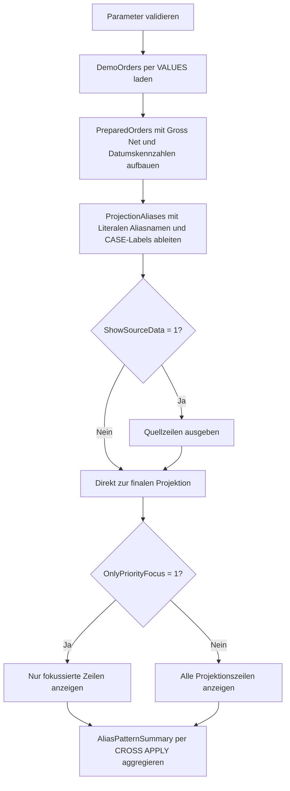

# ProjectionAliasPatterns.sql

Dieses Lab zeigt eine kompakte `SELECT`-Projektion mit Literalen, umbenannten Basisspalten, berechneten Kennzahlen und sprechenden Aliasnamen. Der Schwerpunkt liegt darauf, wie aus wenigen Quellspalten eine lesbare Berichtssicht entsteht, ohne auf produktive Tabellen angewiesen zu sein.

## Uebersicht

<!-- SQLDOC:SUMMARY_TABLE:BEGIN -->
| Feld | Wert |
|---|---|
| Script | [ProjectionAliasPatterns.sql](ProjectionAliasPatterns.sql) |
| Version | `1.0` |
| Typ | `didactic-lab` |
| Kapitel | `02_Select` |
| Sicherheit | `read-only` |
| Zweck | Zeigt Projektionen, Literale, berechnete Spalten und Alias-Muster kompakt in einem didaktischen SELECT-Skript fuer Demo-Auftragsdaten. |
<!-- SQLDOC:SUMMARY_TABLE:END -->

## Einordnung

Im Kapitel `02_Select` verbindet dieses Skript mehrere typische Projektionsmuster in einer einzelnen, bewusst lesbaren Ausgabe. Die Datenbasis bleibt klein, damit die Rolle der Aliasnamen direkt sichtbar wird: Einige Spalten benennen Quellwerte nur um, andere verdichten Berechnungen oder markieren fachliche Sichtweisen wie Prioritaet und Faelligkeitsfenster.

## Annahmen

- Das Skript arbeitet ausschliesslich mit eingebetteten Demo-Auftragsdaten.
- Die finale Projektion wird ueber eine vorbereitende CTE aufgebaut, weil T-SQL Aliasnamen innerhalb derselben `SELECT`-Liste nicht allgemein wiederverwenden kann.
- `PriorityFocusFlag` ist ein didaktisches Filtersignal und kombiniert hohe Prioritaet mit kurzer Restlaufzeit.
- Die Literale `ProjectionLabel` und `DemoSnapshotDate` dienen nur der Sichtbarmachung konstanter Projektionsspalten.

## Anwendungsfall

Das Lab eignet sich fuer Unterricht, Review und Stilgespraeche zu `SELECT`-Listen. Lernende sehen in einer kompakten Abfrage, wie feste Werte, umbenannte Quellspalten, berechnete Betragsfelder, zusammengesetzte Labels und `CASE`-basierte Status-Aliase zusammenwirken.

## Parameter

<!-- SQLDOC:PARAMETERS_TABLE:BEGIN -->
| Parameter | SQL-Typ | Pflicht | Beschreibung |
|---|---|---|---|
| `@AsOfDate` | `DATE` | Nein | Stichtag fuer reproduzierbare Alters- und Faelligkeitsableitungen. |
| `@ShowSourceData` | `BIT` | Nein | Gibt bei `1` den Demo-Datensatz vor der finalen Projektion aus. |
| `@OnlyPriorityFocus` | `BIT` | Nein | Filtert bei `1` auf Zeilen mit hoher Prioritaet oder kurzer Restlaufzeit. |
<!-- SQLDOC:PARAMETERS_TABLE:END -->

## Abhaengigkeiten

<!-- SQLDOC:DEPENDENCIES_LIST:BEGIN -->
- `CTE`
- `VALUES`-Konstruktor
- `CASE`
- `CAST`
- `CONCAT`
- `DATEDIFF`
- `LOWER`
- `CROSS APPLY`
<!-- SQLDOC:DEPENDENCIES_LIST:END -->

## Hinweise

- `PreparedOrders` sammelt zunaechst berechnete Kennzahlen, damit die finale Projektion lesbar bleibt.
- `ProjectionAliases` zeigt in einer CTE mehrere Alias-Kategorien nebeneinander: umbenannte Basisspalten, Literale, Betragsberechnungen und `CASE`-Labels.
- `AliasPatternSummary` verdichtet die sichtbaren Muster und macht daraus ein kleines Nachschlage-Resultset fuer Unterricht oder Review.

## Versionshistorie

<!-- SQLDOC:VERSION_HISTORY_TABLE:BEGIN -->
| Version | Datum | User | Beschreibung |
|---|---|---|---|
| `1.0` | `2026-04-19` | `ER` | Erstversion des Labs fuer kompakte Projektionen und Alias-Muster |
<!-- SQLDOC:VERSION_HISTORY_TABLE:END -->

## Ablauf

<!-- SQLDOC:MERMAID:BEGIN -->

<!-- SQLDOC:MERMAID:END -->

## SQL-Code

<!-- SQLDOC:SQL_CODE:BEGIN -->
```sql
/*
BEGIN:SQL-HEADER v1
---
sql_header: v1
script_name: "ProjectionAliasPatterns.sql"
script_version: "1.0"
script_type: "didactic-lab"
chapter: "02_Select"

purpose: >
  Zeigt Projektionen, Literale, berechnete Spalten und Alias-Muster kompakt
  in einem didaktischen SELECT-Skript fuer Demo-Auftragsdaten.

parameters:
  - name: "@AsOfDate"
    sql_type: "DATE"
    direction: "IN"
    required: false
    description: "Stichtag fuer reproduzierbare Alters- und Faelligkeitsableitungen"
  - name: "@ShowSourceData"
    sql_type: "BIT"
    direction: "IN"
    required: false
    description: "1 = den Demo-Datensatz vor der finalen Projektion anzeigen"
  - name: "@OnlyPriorityFocus"
    sql_type: "BIT"
    direction: "IN"
    required: false
    description: "1 = nur Zeilen mit hoher Prioritaet oder kurzer Restlaufzeit zeigen"

result_sets:
  - name: "SourceDataPreview"
    description: "Optionale Vorschau auf die Demo-Auftragsdaten"
  - name: "ProjectionAliasPreview"
    description: "Kompakte SELECT-Ausgabe mit Literalen, berechneten Spalten und sprechenden Aliasnamen"
  - name: "AliasPatternSummary"
    description: "Zaehlt, welche Alias-Kategorien in der finalen Projektion sichtbar sind"

dependencies:
  - "CTE"
  - "VALUES constructor"
  - "CASE"
  - "CAST"
  - "CONCAT"
  - "DATEDIFF"
  - "LOWER"
  - "CROSS APPLY"

safety:
  level: "read-only"
  writes_data: false

documentation:
  markdown_file: "T-SQL/02_Select/SQLScripts/ProjectionAliasPatterns.md"
  sync_blocks:
    - "SUMMARY_TABLE"
    - "PARAMETERS_TABLE"
    - "DEPENDENCIES_LIST"
    - "VERSION_HISTORY_TABLE"
    - "SQL_CODE"
  mermaid:
    mode: "ai-agent-from-sql"
    source: "script-body"

main_responsible:
  name: "Erhard Rainer"
  initials: "ER"

version_history:
  - version: "1.0"
    date: "2026-04-19"
    user: "ER"
    description: "Erstversion des Labs fuer kompakte Projektionen und Alias-Muster"

notes:
  - "Die Beispiele arbeiten ausschliesslich mit eingebetteten Demo-Daten"
  - "Berechnete Spalten werden in einer Vorstufe vorbereitet, damit die finale Projektion lesbar bleibt"
---
END:SQL-HEADER v1
*/

SET NOCOUNT ON;

DECLARE @AsOfDate DATE = '2026-04-19';
DECLARE @ShowSourceData BIT = 1;
DECLARE @OnlyPriorityFocus BIT = 0;

IF @AsOfDate IS NULL
BEGIN
    THROW 50000, '@AsOfDate darf nicht NULL sein.', 1;
END;

IF @ShowSourceData NOT IN (0, 1)
BEGIN
    THROW 50001, '@ShowSourceData muss 0 oder 1 sein.', 1;
END;

IF @OnlyPriorityFocus NOT IN (0, 1)
BEGIN
    THROW 50002, '@OnlyPriorityFocus muss 0 oder 1 sein.', 1;
END;

;WITH DemoOrders AS
(
    SELECT
        sample.OrderID,
        sample.CustomerName,
        sample.RegionCode,
        sample.SalesChannel,
        sample.OrderDate,
        sample.DueDate,
        sample.Quantity,
        sample.UnitPrice,
        sample.DiscountRate,
        sample.PriorityCode,
        sample.OwnerInitials
    FROM
    (
        VALUES
            (7101, 'Alpenmarkt GmbH', 'DE-NORTH', 'Direct',     CAST('2026-04-10' AS DATE), CAST('2026-04-21' AS DATE), 12, CAST( 39.90 AS DECIMAL(10,2)), CAST(0.05 AS DECIMAL(5,2)), 'A', 'NR'),
            (7102, 'Bergblick AG',    'AT-WEST',  'Partner',    CAST('2026-04-11' AS DATE), CAST('2026-04-18' AS DATE),  5, CAST(129.00 AS DECIMAL(10,2)), CAST(0.00 AS DECIMAL(5,2)), 'B', 'IV'),
            (7103, 'City Clinic',     'CH-CENTRAL','Direct',    CAST('2026-04-13' AS DATE), CAST('2026-04-24' AS DATE),  2, CAST(540.00 AS DECIMAL(10,2)), CAST(0.03 AS DECIMAL(5,2)), 'A', 'MN'),
            (7104, 'Delta Stores',    'DE-SOUTH', 'Inside',     CAST('2026-04-15' AS DATE), CAST('2026-04-28' AS DATE), 20, CAST( 18.50 AS DECIMAL(10,2)), CAST(0.08 AS DECIMAL(5,2)), 'C', 'TR'),
            (7105, 'Eiger Systems',   'DE-NORTH', 'KeyAccount', CAST('2026-04-16' AS DATE), CAST('2026-04-20' AS DATE),  1, CAST(980.00 AS DECIMAL(10,2)), CAST(0.10 AS DECIMAL(5,2)), 'A', 'NR')
    ) AS sample
    (
        OrderID,
        CustomerName,
        RegionCode,
        SalesChannel,
        OrderDate,
        DueDate,
        Quantity,
        UnitPrice,
        DiscountRate,
        PriorityCode,
        OwnerInitials
    )
),
PreparedOrders AS
(
    SELECT
        d.OrderID,
        d.CustomerName,
        d.RegionCode,
        d.SalesChannel,
        d.OrderDate,
        d.DueDate,
        d.Quantity,
        d.UnitPrice,
        d.DiscountRate,
        d.PriorityCode,
        d.OwnerInitials,
        CAST(d.Quantity * d.UnitPrice AS DECIMAL(12,2)) AS GrossAmount,
        CAST((d.Quantity * d.UnitPrice) * (1 - d.DiscountRate) AS DECIMAL(12,2)) AS NetAmount,
        DATEDIFF(DAY, d.OrderDate, @AsOfDate) AS DaysOpen,
        DATEDIFF(DAY, @AsOfDate, d.DueDate) AS DaysUntilDue
    FROM DemoOrders AS d
),
ProjectionAliases AS
(
    SELECT
        p.OrderID AS OrderIdentifier,
        p.CustomerName AS CustomerDisplayName,
        p.RegionCode AS SalesRegionCode,
        CONCAT(p.RegionCode, ' / ', p.SalesChannel) AS RegionChannelAlias,
        p.OrderDate AS CreatedOn,
        p.DueDate AS DueOn,
        p.Quantity AS OrderQuantity,
        p.UnitPrice AS UnitPriceAmount,
        p.GrossAmount AS GrossRevenueAmount,
        p.NetAmount AS NetRevenueAmount,
        CAST(p.GrossAmount - p.NetAmount AS DECIMAL(12,2)) AS DiscountValueAmount,
        p.DaysOpen AS OrderAgeDays,
        p.DaysUntilDue AS RemainingDays,
        CONCAT('owner-', LOWER(p.OwnerInitials)) AS OwnerAliasTag,
        CAST('2026-04-19' AS DATE) AS DemoSnapshotDate,
        'projection-alias-lab' AS ProjectionLabel,
        CASE p.PriorityCode
            WHEN 'A' THEN 'PriorityCritical'
            WHEN 'B' THEN 'PriorityPlanned'
            ELSE 'PriorityRoutine'
        END AS PriorityLabel,
        CASE
            WHEN p.DaysUntilDue < 0 THEN 'DueOver'
            WHEN p.DaysUntilDue <= 3 THEN 'DueSoon'
            ELSE 'DueLater'
        END AS DueWindowLabel,
        CASE
            WHEN p.NetAmount >= 900 THEN 'RevenueTierHigh'
            WHEN p.NetAmount >= 300 THEN 'RevenueTierMedium'
            ELSE 'RevenueTierEntry'
        END AS RevenueTierLabel,
        CASE
            WHEN p.PriorityCode = 'A' OR p.DaysUntilDue <= 3 THEN 1
            ELSE 0
        END AS PriorityFocusFlag
    FROM PreparedOrders AS p
)
SELECT
    d.OrderID,
    d.CustomerName,
    d.RegionCode,
    d.SalesChannel,
    d.OrderDate,
    d.DueDate,
    d.Quantity,
    d.UnitPrice,
    d.DiscountRate,
    d.PriorityCode,
    d.OwnerInitials
FROM DemoOrders AS d
WHERE @ShowSourceData = 1
ORDER BY
    d.OrderID;

SELECT
    pa.ProjectionLabel,
    pa.DemoSnapshotDate,
    pa.OrderIdentifier,
    pa.CustomerDisplayName,
    pa.SalesRegionCode,
    pa.RegionChannelAlias,
    pa.CreatedOn,
    pa.DueOn,
    pa.OrderQuantity,
    pa.UnitPriceAmount,
    pa.GrossRevenueAmount,
    pa.NetRevenueAmount,
    pa.DiscountValueAmount,
    pa.OrderAgeDays,
    pa.RemainingDays,
    pa.OwnerAliasTag,
    pa.PriorityLabel,
    pa.DueWindowLabel,
    pa.RevenueTierLabel,
    pa.PriorityFocusFlag
FROM ProjectionAliases AS pa
WHERE @OnlyPriorityFocus = 0
   OR pa.PriorityFocusFlag = 1
ORDER BY
    pa.PriorityFocusFlag DESC,
    pa.PriorityLabel,
    pa.NetRevenueAmount DESC,
    pa.OrderIdentifier;

SELECT
    summary.PatternName,
    COUNT(*) AS MatchingRows
FROM ProjectionAliases AS pa
CROSS APPLY
(
    VALUES
        ('Literal column', 1),
        ('Renamed base column', CASE WHEN pa.CustomerDisplayName IS NOT NULL THEN 1 ELSE 0 END),
        ('Calculated amount alias', CASE WHEN pa.DiscountValueAmount >= 0 THEN 1 ELSE 0 END),
        ('Concatenated label alias', CASE WHEN pa.RegionChannelAlias IS NOT NULL THEN 1 ELSE 0 END),
        ('CASE status alias', CASE WHEN pa.PriorityLabel IN ('PriorityCritical', 'PriorityPlanned', 'PriorityRoutine') THEN 1 ELSE 0 END),
        ('Filter signal alias', CASE WHEN pa.PriorityFocusFlag IN (0, 1) THEN 1 ELSE 0 END)
) AS summary(PatternName, IsMatch)
WHERE (@OnlyPriorityFocus = 0 OR pa.PriorityFocusFlag = 1)
  AND summary.IsMatch = 1
GROUP BY
    summary.PatternName
ORDER BY
    summary.PatternName;
```
<!-- SQLDOC:SQL_CODE:END -->
