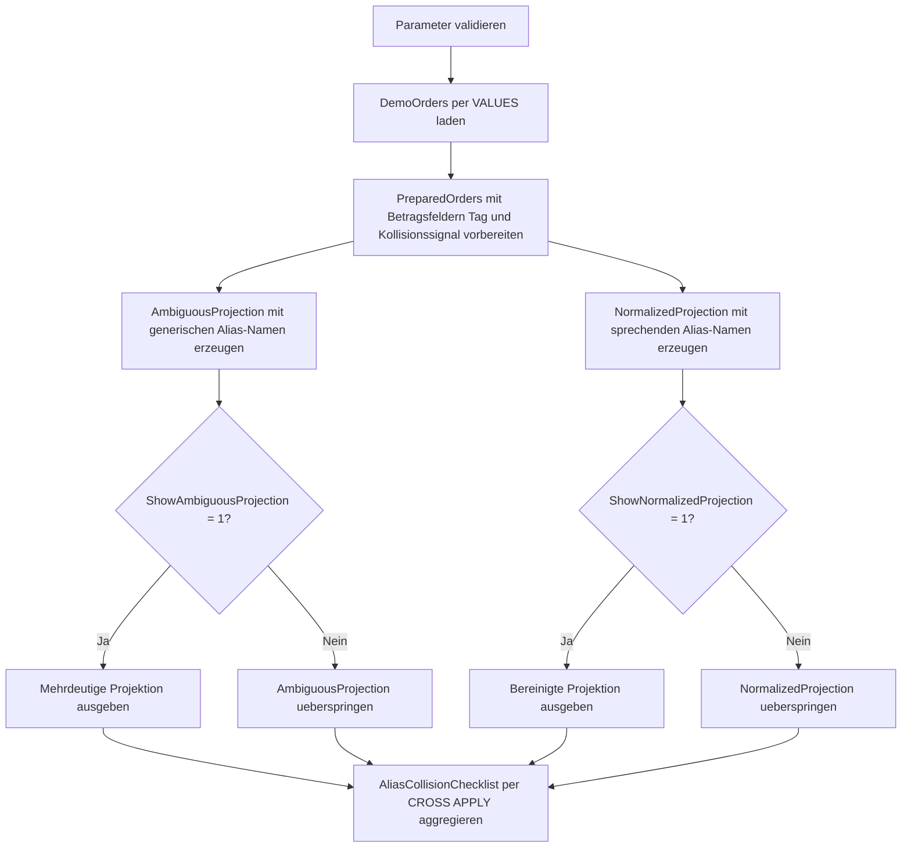

# SelectAliasCollisionCheck.sql

Dieses Lab stellt zwei Projektionen auf denselben Demo-Datensatz gegenueber. Zuerst erscheinen absichtlich mehrdeutige Alias-Namen wie `Code`, `Status` oder `Amount`, danach dieselben Inhalte mit stabilen, sprechenden Spaltennamen, die in Reviews und Folgeabfragen weniger Reibung erzeugen.

## Uebersicht

<!-- SQLDOC:SUMMARY_TABLE:BEGIN -->
| Feld | Wert |
|---|---|
| Script | [SelectAliasCollisionCheck.sql](SelectAliasCollisionCheck.sql) |
| Version | `1.0` |
| Typ | `didactic-lab` |
| Kapitel | `02_Select` |
| Sicherheit | `read-only` |
| Zweck | Demonstriert problematische Alias-Kollisionen in SELECT-Projektionen und zeigt eine saubere Gegenueberstellung mit stabilen Namenskonventionen. |
<!-- SQLDOC:SUMMARY_TABLE:END -->

## Einordnung

Im Kapitel `02_Select` liegt der Fokus hier nicht auf Datenlogik, sondern auf Lesbarkeit. Alias-Kollisionen entstehen oft nicht als Syntaxfehler, sondern als Kommunikationsproblem: Zwei Spalten tragen fast denselben Namen oder benennen unterschiedliche Bedeutungen zu generisch. Das Skript zeigt deshalb eine bewusst schwache und eine bereinigte Projektion direkt nebeneinander.

## Annahmen

- Das Skript arbeitet ausschliesslich mit eingebetteten Demo-Daten.
- Die problematische Projektion bleibt absichtlich syntaktisch gueltig; demonstriert werden semantische Kollisionen und unklare Namensmuster, keine absichtlichen Parse-Fehler.
- `HasAliasCollisionRisk` ist ein didaktisches Signal fuer Zeilen, bei denen generische Alias-Namen besonders schwer unterscheidbar waeren.
- Die bereinigte Projektion priorisiert explizite Fachrollen wie `SalesRegionCode`, `OrderLifecycleStatusCode` und `NetRevenueAmount`.

## Anwendungsfall

Das Lab eignet sich fuer Unterricht, Review und SQL-Style-Diskussionen. Lernende sehen, wie schnell harmlose Kurzformen wie `Code`, `Status` oder `Owner2` den Informationswert einer Projektion senken und wie wenig Zusatzaufwand erforderlich ist, um dieselbe Ausgabe klarer zu benennen.

## Parameter

<!-- SQLDOC:PARAMETERS_TABLE:BEGIN -->
| Parameter | SQL-Typ | Pflicht | Beschreibung |
|---|---|---|---|
| `@ShowAmbiguousProjection` | `BIT` | Nein | Zeigt bei `1` die bewusst mehrdeutige Projektion mit kollidierenden Alias-Namen. |
| `@ShowNormalizedProjection` | `BIT` | Nein | Zeigt bei `1` die bereinigte Projektion mit eindeutigen Alias-Namen. |
| `@OnlyCollisionRows` | `BIT` | Nein | Beschraenkt bei `1` die Ausgabe auf Zeilen mit hohem Kollisionsrisiko. |
<!-- SQLDOC:PARAMETERS_TABLE:END -->

## Abhaengigkeiten

<!-- SQLDOC:DEPENDENCIES_LIST:BEGIN -->
- `CTE`
- `VALUES`-Konstruktor
- `CASE`
- `CAST`
- `CONCAT`
- `LOWER`
- `REPLACE`
<!-- SQLDOC:DEPENDENCIES_LIST:END -->

## Hinweise

- `AmbiguousProjection` verwendet absichtlich generische Namen wie `Code`, `Status`, `Owner` und `Amount`, damit die Kollision visuell sofort auffaellt.
- `NormalizedProjection` nutzt denselben Informationsgehalt, trennt aber fachliche Rollen eindeutig in Region, Kanal, Prioritaet, Lifecycle-Status und Betragsarten.
- Die Abschlussliste `AliasCollisionChecklist` ordnet typische Kollisionstypen einem besseren Benennungsmuster zu.

## Versionshistorie

<!-- SQLDOC:VERSION_HISTORY_TABLE:BEGIN -->
| Version | Datum | User | Beschreibung |
|---|---|---|---|
| `1.0` | `2026-04-19` | `ER` | Erstversion des Labs fuer Alias-Kollisionen und Namenskonventionen |
<!-- SQLDOC:VERSION_HISTORY_TABLE:END -->

## Ablauf

<!-- SQLDOC:MERMAID:BEGIN -->

<!-- SQLDOC:MERMAID:END -->

## SQL-Code

<!-- SQLDOC:SQL_CODE:BEGIN -->
```sql
/*
BEGIN:SQL-HEADER v1
---
sql_header: v1
script_name: "SelectAliasCollisionCheck.sql"
script_version: "1.0"
script_type: "didactic-lab"
chapter: "02_Select"

purpose: >
  Demonstriert problematische Alias-Kollisionen in SELECT-Projektionen und
  zeigt eine saubere Gegenueberstellung mit stabilen Namenskonventionen.

parameters:
  - name: "@ShowAmbiguousProjection"
    sql_type: "BIT"
    direction: "IN"
    required: false
    description: "1 = zeigt die bewusst mehrdeutige Projektion mit kollidierenden Alias-Namen"
  - name: "@ShowNormalizedProjection"
    sql_type: "BIT"
    direction: "IN"
    required: false
    description: "1 = zeigt die bereinigte Projektion mit sprechenden und stabilen Alias-Namen"
  - name: "@OnlyCollisionRows"
    sql_type: "BIT"
    direction: "IN"
    required: false
    description: "1 = beschraenkt die Ausgabe auf Zeilen mit hohem Kollisionsrisiko"

result_sets:
  - name: "SourceDataPreview"
    description: "Zeigt den kleinen Demo-Datensatz fuer das Alias-Lab"
  - name: "AmbiguousProjectionPreview"
    description: "Bewusst mehrdeutige Projektion, in der unterschiedliche Bedeutungen sehr aehnliche Alias-Namen erhalten"
  - name: "NormalizedProjectionPreview"
    description: "Bereinigte Projektion mit sprechenden und stabilen Alias-Konventionen"
  - name: "AliasCollisionChecklist"
    description: "Ordnet die Demo-Zeilen nach Kollisionstypen und empfohlener Namensstrategie ein"

dependencies:
  - "CTE"
  - "VALUES constructor"
  - "CASE"
  - "CAST"
  - "CONCAT"
  - "LOWER"
  - "REPLACE"

safety:
  level: "read-only"
  writes_data: false

documentation:
  markdown_file: "T-SQL/02_Select/SQLScripts/SelectAliasCollisionCheck.md"
  sync_blocks:
    - "SUMMARY_TABLE"
    - "PARAMETERS_TABLE"
    - "DEPENDENCIES_LIST"
    - "VERSION_HISTORY_TABLE"
    - "SQL_CODE"
  mermaid:
    mode: "ai-agent-from-sql"
    source: "script-body"

main_responsible:
  name: "Erhard Rainer"
  initials: "ER"

version_history:
  - version: "1.0"
    date: "2026-04-19"
    user: "ER"
    description: "Erstversion des Labs fuer Alias-Kollisionen und Namenskonventionen"

notes:
  - "Die problematische Projektion bleibt syntaktisch gueltig, nutzt aber absichtlich mehrdeutige Alias-Namen"
  - "Die bereinigte Projektion zeigt denselben Informationsgehalt mit stabilen, weiterverwendbaren Spaltennamen"
---
END:SQL-HEADER v1
*/

SET NOCOUNT ON;

DECLARE @ShowAmbiguousProjection BIT = 1;
DECLARE @ShowNormalizedProjection BIT = 1;
DECLARE @OnlyCollisionRows BIT = 0;

IF @ShowAmbiguousProjection NOT IN (0, 1)
BEGIN
    THROW 50000, '@ShowAmbiguousProjection muss 0 oder 1 sein.', 1;
END;

IF @ShowNormalizedProjection NOT IN (0, 1)
BEGIN
    THROW 50001, '@ShowNormalizedProjection muss 0 oder 1 sein.', 1;
END;

IF @OnlyCollisionRows NOT IN (0, 1)
BEGIN
    THROW 50002, '@OnlyCollisionRows muss 0 oder 1 sein.', 1;
END;

IF @ShowAmbiguousProjection = 0 AND @ShowNormalizedProjection = 0
BEGIN
    THROW 50003, 'Mindestens eine Projektion muss aktiviert sein.', 1;
END;

;WITH DemoOrders AS
(
    SELECT
        sample.OrderID,
        sample.CustomerName,
        sample.SalesRegionCode,
        sample.SalesChannelCode,
        sample.AccountManager,
        sample.PriorityCode,
        sample.OrderStatusCode,
        sample.Quantity,
        sample.UnitPrice,
        sample.DiscountRate
    FROM
    (
        VALUES
            (8201, 'Alpenmarkt GmbH', 'DE-NORTH',  'DIR', 'Nina Roth',  'A', 'OPEN',    12, CAST( 49.00 AS DECIMAL(10,2)), CAST(0.05 AS DECIMAL(5,2))),
            (8202, 'Bergblick AG',    'AT-WEST',   'PAR', 'Ivo Brandt', 'B', 'OPEN',     4, CAST(210.00 AS DECIMAL(10,2)), CAST(0.00 AS DECIMAL(5,2))),
            (8203, 'City Clinic',     'CH-CENTRAL','DIR', 'Mara Novak', 'A', 'REVIEW',   2, CAST(540.00 AS DECIMAL(10,2)), CAST(0.03 AS DECIMAL(5,2))),
            (8204, 'Delta Stores',    'DE-SOUTH',  'INS', 'Tara Reim',  'C', 'BACKLOG', 20, CAST( 18.50 AS DECIMAL(10,2)), CAST(0.08 AS DECIMAL(5,2))),
            (8205, 'Eiger Systems',   'DE-NORTH',  'KEY', 'Nina Roth',  'A', 'OPEN',     1, CAST(980.00 AS DECIMAL(10,2)), CAST(0.10 AS DECIMAL(5,2)))
    ) AS sample
    (
        OrderID,
        CustomerName,
        SalesRegionCode,
        SalesChannelCode,
        AccountManager,
        PriorityCode,
        OrderStatusCode,
        Quantity,
        UnitPrice,
        DiscountRate
    )
),
PreparedOrders AS
(
    SELECT
        d.OrderID,
        d.CustomerName,
        d.SalesRegionCode,
        d.SalesChannelCode,
        d.AccountManager,
        d.PriorityCode,
        d.OrderStatusCode,
        d.Quantity,
        d.UnitPrice,
        d.DiscountRate,
        CAST(d.Quantity * d.UnitPrice AS DECIMAL(12,2)) AS GrossAmount,
        CAST((d.Quantity * d.UnitPrice) * (1 - d.DiscountRate) AS DECIMAL(12,2)) AS NetAmount,
        CONCAT(d.SalesRegionCode, '-', d.SalesChannelCode) AS RegionChannelKey,
        LOWER(REPLACE(d.AccountManager, ' ', '.')) AS AccountManagerTag,
        CASE
            WHEN d.PriorityCode = 'A' AND d.OrderStatusCode IN ('OPEN', 'REVIEW') THEN 1
            WHEN d.SalesRegionCode = 'DE-NORTH' AND d.SalesChannelCode IN ('DIR', 'KEY') THEN 1
            ELSE 0
        END AS HasAliasCollisionRisk
    FROM DemoOrders AS d
),
AmbiguousProjection AS
(
    SELECT
        p.OrderID AS [ID],
        p.CustomerName AS [Name],
        p.SalesRegionCode AS [Code],
        p.SalesChannelCode AS [Code2],
        p.PriorityCode AS [Status],
        p.OrderStatusCode AS [Status2],
        p.AccountManager AS [Owner],
        p.AccountManagerTag AS [Owner2],
        p.GrossAmount AS [Amount],
        p.NetAmount AS [Amount2],
        p.RegionChannelKey AS [Label],
        CASE
            WHEN p.HasAliasCollisionRisk = 1 THEN 'collision-risk'
            ELSE 'stable-enough'
        END AS [Label2]
    FROM PreparedOrders AS p
),
NormalizedProjection AS
(
    SELECT
        p.OrderID AS OrderIdentifier,
        p.CustomerName AS CustomerDisplayName,
        p.SalesRegionCode AS SalesRegionCode,
        p.SalesChannelCode AS SalesChannelCode,
        p.PriorityCode AS PriorityCode,
        p.OrderStatusCode AS OrderLifecycleStatusCode,
        p.AccountManager AS AccountManagerName,
        p.AccountManagerTag AS AccountManagerAliasTag,
        p.GrossAmount AS GrossRevenueAmount,
        p.NetAmount AS NetRevenueAmount,
        p.RegionChannelKey AS RegionChannelKey,
        CASE
            WHEN p.HasAliasCollisionRisk = 1 THEN 'NeedsExplicitPrefixes'
            ELSE 'AlreadyDistinct'
        END AS AliasQualityLabel,
        p.HasAliasCollisionRisk AS HasAliasCollisionRisk
    FROM PreparedOrders AS p
)
SELECT
    d.OrderID,
    d.CustomerName,
    d.SalesRegionCode,
    d.SalesChannelCode,
    d.AccountManager,
    d.PriorityCode,
    d.OrderStatusCode,
    d.Quantity,
    d.UnitPrice,
    d.DiscountRate
FROM DemoOrders AS d
ORDER BY
    d.OrderID;

SELECT
    ap.ID,
    ap.Name,
    ap.Code,
    ap.Code2,
    ap.Status,
    ap.Status2,
    ap.Owner,
    ap.Owner2,
    ap.Amount,
    ap.Amount2,
    ap.Label,
    ap.Label2
FROM AmbiguousProjection AS ap
WHERE @ShowAmbiguousProjection = 1
  AND (@OnlyCollisionRows = 0 OR EXISTS
    (
        SELECT 1
        FROM PreparedOrders AS p
        WHERE p.OrderID = ap.ID
          AND p.HasAliasCollisionRisk = 1
    ))
ORDER BY
    ap.ID;

SELECT
    np.OrderIdentifier,
    np.CustomerDisplayName,
    np.SalesRegionCode,
    np.SalesChannelCode,
    np.PriorityCode,
    np.OrderLifecycleStatusCode,
    np.AccountManagerName,
    np.AccountManagerAliasTag,
    np.GrossRevenueAmount,
    np.NetRevenueAmount,
    np.RegionChannelKey,
    np.AliasQualityLabel,
    np.HasAliasCollisionRisk
FROM NormalizedProjection AS np
WHERE @ShowNormalizedProjection = 1
  AND (@OnlyCollisionRows = 0 OR np.HasAliasCollisionRisk = 1)
ORDER BY
    np.HasAliasCollisionRisk DESC,
    np.OrderIdentifier;

SELECT
    checklist.CollisionType,
    checklist.AmbiguousAliasExample,
    checklist.PreferredAliasExample,
    COUNT(*) AS MatchingRows
FROM PreparedOrders AS p
CROSS APPLY
(
    VALUES
        ('Code bucket',   'Code / Code2',   'SalesRegionCode / SalesChannelCode', 1),
        ('Status bucket', 'Status / Status2', 'PriorityCode / OrderLifecycleStatusCode', 1),
        ('Owner bucket',  'Owner / Owner2', 'AccountManagerName / AccountManagerAliasTag', 1),
        ('Amount bucket', 'Amount / Amount2', 'GrossRevenueAmount / NetRevenueAmount', 1),
        ('Risk bucket',   'Label / Label2', 'RegionChannelKey / AliasQualityLabel', CASE WHEN p.HasAliasCollisionRisk = 1 THEN 1 ELSE 0 END)
) AS checklist(CollisionType, AmbiguousAliasExample, PreferredAliasExample, IsMatch)
WHERE checklist.IsMatch = 1
  AND (@OnlyCollisionRows = 0 OR p.HasAliasCollisionRisk = 1)
GROUP BY
    checklist.CollisionType,
    checklist.AmbiguousAliasExample,
    checklist.PreferredAliasExample
ORDER BY
    checklist.CollisionType;
```
<!-- SQLDOC:SQL_CODE:END -->
