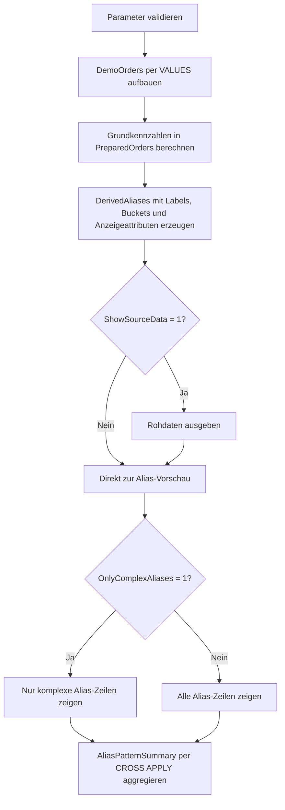

# SelectDerivedAliasCatalogue.sql

Dieses Lab sammelt typische Alias- und Ausdrucksmuster fuer `SELECT`-Projektionen an einem kleinen Demo-Datensatz. Es zeigt sprechende Namen fuer Kennzahlen, Status, Buckets, Anzeigeattribute und normalisierte Texte in einer kompakten, direkt lesbaren Form.

## Uebersicht

<!-- SQLDOC:SUMMARY_TABLE:BEGIN -->
| Feld | Wert |
|---|---|
| Script | [SelectDerivedAliasCatalogue.sql](SelectDerivedAliasCatalogue.sql) |
| Version | `1.0` |
| Typ | `didactic-lab` |
| Kapitel | `02_Select` |
| Sicherheit | `read-only` |
| Zweck | Demonstriert typische Alias- und Ausdrucksmuster fuer lesbare SELECT-Projektionen anhand eines Demo-Datensatzes. |
<!-- SQLDOC:SUMMARY_TABLE:END -->

## Einordnung

Im Kapitel `02_Select` positioniert sich das Skript zwischen einfachen Projektionen und spaeteren Labs zu Formatierung oder Style. Der Fokus liegt nicht auf fachlicher Logik, sondern auf der Frage, wie rohe Ausdruecke durch sprechende Aliasnamen besser lesbar, diskutierbar und weiterverwendbar werden.

## Annahmen

- Das Skript arbeitet ausschliesslich mit eingebetteten Demo-Daten und greift auf keine produktiven Tabellen zu.
- `@AsOfDate` steuert reproduzierbar alle Ableitungen fuer Faelligkeitsfenster.
- `HasComplexAliasMix` ist ein didaktisches Signal und markiert Zeilen mit mehreren gleichzeitig sichtbaren Alias-Mustern.
- Die Aliasnamen sind bewusst sprechend formuliert und priorisieren Lehrwert vor maximaler Kuerze.

## Anwendungsfall

Das Lab eignet sich fuer Unterricht, Code-Review und Stilgespraeche zu Projektionen. Lernende sehen direkt, wie aus denselben Basisfeldern Labels wie `PriorityLabel`, `RevenueTierLabel` oder `RegionChannelLabel` entstehen und wie solche Aliasnamen spaeter in Berichten, Exporten oder Folgeabfragen wieder aufgegriffen werden koennen.

## Parameter

<!-- SQLDOC:PARAMETERS_TABLE:BEGIN -->
| Parameter | SQL-Typ | Pflicht | Beschreibung |
|---|---|---|---|
| `@AsOfDate` | `DATE` | Nein | Stichtag fuer Status- und Faelligkeitsableitungen. |
| `@ShowSourceData` | `BIT` | Nein | Gibt bei `1` den Demo-Datensatz vor den Alias-Beispielen zusaetzlich aus. |
| `@OnlyComplexAliases` | `BIT` | Nein | Filtert bei `1` auf Zeilen mit mehreren abgeleiteten Alias-Spalten. |
<!-- SQLDOC:PARAMETERS_TABLE:END -->

## Abhaengigkeiten

<!-- SQLDOC:DEPENDENCIES_LIST:BEGIN -->
- `CTE`
- `VALUES`-Konstruktor
- `CASE`
- `CAST`
- `CONCAT`
- `COALESCE`
- `NULLIF`
- `DATEDIFF`
<!-- SQLDOC:DEPENDENCIES_LIST:END -->

## Hinweise

- `RegionChannelLabel` zeigt ein typisches zusammengesetztes Anzeigeattribut aus zwei Basisfeldern.
- `MarginPercent` nutzt `NULLIF`, damit auch bei didaktischen Kennzahlen der Schutz gegen Division durch null sichtbar bleibt.
- `CommentNormalized` demonstriert das Zusammenspiel aus `NULLIF` und `COALESCE` fuer leere oder fehlende Texte.
- `AliasPatternSummary` verdichtet die sichtbaren Alias-Kategorien und macht deren Wiederverwendung in Folgeabfragen nachvollziehbar.

## Versionshistorie

<!-- SQLDOC:VERSION_HISTORY_TABLE:BEGIN -->
| Version | Datum | User | Beschreibung |
|---|---|---|---|
| `1.0` | `2026-04-17` | `ER` | Erstversion des Katalogs fuer abgeleitete Alias-Muster in SELECT-Projektionen |
<!-- SQLDOC:VERSION_HISTORY_TABLE:END -->

## Ablauf

<!-- SQLDOC:MERMAID:BEGIN -->

<!-- SQLDOC:MERMAID:END -->

## SQL-Code

<!-- SQLDOC:SQL_CODE:BEGIN -->
```sql
/*
BEGIN:SQL-HEADER v1
---
sql_header: v1
script_name: "SelectDerivedAliasCatalogue.sql"
script_version: "1.0"
script_type: "didactic-lab"
chapter: "02_Select"

purpose: >
  Sammelt an einem kleinen Demo-Datensatz typische Alias- und
  Ausdrucksmuster fuer Projektionen, etwa sprechende Kennzahlen, Labels,
  Buckets, Statusnamen und zusammengesetzte Anzeigeattribute.

parameters:
  - name: "@AsOfDate"
    sql_type: "DATE"
    direction: "IN"
    required: false
    description: "Stichtag fuer Status- und Faelligkeitsableitungen"
  - name: "@ShowSourceData"
    sql_type: "BIT"
    direction: "IN"
    required: false
    description: "1 = den Demo-Datensatz vor den Alias-Beispielen zusaetzlich anzeigen"
  - name: "@OnlyComplexAliases"
    sql_type: "BIT"
    direction: "IN"
    required: false
    description: "1 = nur Zeilen mit mehreren abgeleiteten Alias-Spalten zeigen"

result_sets:
  - name: "SourceDataPreview"
    description: "Optionale Vorschau des didaktischen Demo-Datensatzes"
  - name: "DerivedAliasPreview"
    description: "Zeigt typische Alias- und Ausdrucksmuster in einer SELECT-Liste"
  - name: "AliasPatternSummary"
    description: "Verdichtet die Anzahl sichtbarer Zeilen je Alias-Muster"

dependencies:
  - "CTE"
  - "VALUES constructor"
  - "CASE"
  - "CAST"
  - "CONCAT"
  - "COALESCE"
  - "NULLIF"
  - "DATEDIFF"

safety:
  level: "read-only"
  writes_data: false

documentation:
  markdown_file: "T-SQL/02_Select/SQLScripts/SelectDerivedAliasCatalogue.md"
  sync_blocks:
    - "SUMMARY_TABLE"
    - "PARAMETERS_TABLE"
    - "DEPENDENCIES_LIST"
    - "VERSION_HISTORY_TABLE"
    - "SQL_CODE"
  mermaid:
    mode: "ai-agent-from-sql"
    source: "script-body"

main_responsible:
  name: "Erhard Rainer"
  initials: "ER"

version_history:
  - version: "1.0"
    date: "2026-04-17"
    user: "ER"
    description: "Erstversion des Katalogs fuer abgeleitete Alias-Muster in SELECT-Projektionen"

notes:
  - "Das Skript nutzt ausschliesslich Demo-Daten und dient der didaktischen Projektionserklaerung"
  - "Die Aliasnamen priorisieren Lesbarkeit und Unterrichtsgespraeche vor maximaler fachlicher Verdichtung"
---
END:SQL-HEADER v1
*/

SET NOCOUNT ON;

DECLARE @AsOfDate DATE = '2026-04-17';
DECLARE @ShowSourceData BIT = 1;
DECLARE @OnlyComplexAliases BIT = 0;

IF @AsOfDate IS NULL
BEGIN
    THROW 50000, '@AsOfDate darf nicht NULL sein.', 1;
END;

IF @ShowSourceData NOT IN (0, 1)
BEGIN
    THROW 50001, '@ShowSourceData muss 0 oder 1 sein.', 1;
END;

IF @OnlyComplexAliases NOT IN (0, 1)
BEGIN
    THROW 50002, '@OnlyComplexAliases muss 0 oder 1 sein.', 1;
END;

;WITH DemoOrders AS
(
    SELECT
        sample.OrderID,
        sample.CustomerName,
        sample.RegionCode,
        sample.SalesChannel,
        sample.OrderDate,
        sample.DueDate,
        sample.Quantity,
        sample.UnitPrice,
        sample.DiscountRate,
        sample.StandardCost,
        sample.PriorityCode,
        sample.OwnerName,
        sample.CommentText
    FROM
    (
        VALUES
            (3001, 'Alpine Retail', 'DE-NORTH', 'Direct', CAST('2026-04-08' AS DATE), CAST('2026-04-17' AS DATE), 10, CAST(49.00 AS DECIMAL(10,2)), CAST(0.05 AS DECIMAL(5,2)), CAST(33.00 AS DECIMAL(10,2)), 'A', 'Anika', 'renewal ready'),
            (3002, 'Bergmann AG', 'AT-WEST', 'Partner', CAST('2026-04-09' AS DATE), CAST('2026-04-15' AS DATE), 4, CAST(210.00 AS DECIMAL(10,2)), CAST(0.12 AS DECIMAL(5,2)), CAST(160.00 AS DECIMAL(10,2)), 'B', 'Bora', NULL),
            (3003, 'City Health', 'CH-CENTRAL', 'Direct', CAST('2026-04-10' AS DATE), CAST('2026-04-23' AS DATE), 2, CAST(680.00 AS DECIMAL(10,2)), CAST(0.03 AS DECIMAL(5,2)), CAST(510.00 AS DECIMAL(10,2)), 'A', 'Cem', 'board review'),
            (3004, 'Delta Schools', 'DE-SOUTH', 'Inside', CAST('2026-04-11' AS DATE), CAST('2026-04-29' AS DATE), 25, CAST(18.50 AS DECIMAL(10,2)), CAST(0.00 AS DECIMAL(5,2)), CAST(11.00 AS DECIMAL(10,2)), 'C', 'Dina', ''),
            (3005, 'Eiger Systems', 'DE-NORTH', 'KeyAccount', CAST('2026-04-12' AS DATE), CAST('2026-04-19' AS DATE), 1, CAST(1450.00 AS DECIMAL(10,2)), CAST(0.08 AS DECIMAL(5,2)), CAST(1180.00 AS DECIMAL(10,2)), 'A', 'Emir', 'exec sync'),
            (3006, 'Fjord Clinic', 'AT-WEST', 'Partner', CAST('2026-04-13' AS DATE), CAST('2026-04-17' AS DATE), 7, CAST(96.00 AS DECIMAL(10,2)), CAST(0.10 AS DECIMAL(5,2)), CAST(71.00 AS DECIMAL(10,2)), 'B', 'Fina', 'needs callback')
    ) AS sample
    (
        OrderID,
        CustomerName,
        RegionCode,
        SalesChannel,
        OrderDate,
        DueDate,
        Quantity,
        UnitPrice,
        DiscountRate,
        StandardCost,
        PriorityCode,
        OwnerName,
        CommentText
    )
),
PreparedOrders AS
(
    SELECT
        d.OrderID,
        d.CustomerName,
        d.RegionCode,
        d.SalesChannel,
        d.OrderDate,
        d.DueDate,
        d.Quantity,
        d.UnitPrice,
        d.DiscountRate,
        d.StandardCost,
        d.PriorityCode,
        d.OwnerName,
        d.CommentText,
        CAST(d.Quantity * d.UnitPrice AS DECIMAL(12,2)) AS GrossAmount,
        CAST((d.Quantity * d.UnitPrice) * (1 - d.DiscountRate) AS DECIMAL(12,2)) AS NetAmount,
        CAST(d.Quantity * d.StandardCost AS DECIMAL(12,2)) AS TotalCost
    FROM DemoOrders AS d
),
DerivedAliases AS
(
    SELECT
        p.OrderID AS OrderIdentifier,
        p.CustomerName AS CustomerDisplayName,
        CONCAT(p.RegionCode, ' / ', p.SalesChannel) AS RegionChannelLabel,
        CONCAT(LEFT(p.OwnerName, 1), '.', RIGHT(p.OwnerName, LEN(p.OwnerName) - 1)) AS OwnerDisplayName,
        CONCAT(YEAR(p.OrderDate), '-', RIGHT('0' + CAST(MONTH(p.OrderDate) AS VARCHAR(2)), 2)) AS ReportingMonthKey,
        DATEDIFF(DAY, p.OrderDate, p.DueDate) AS LeadTimeDays,
        DATEDIFF(DAY, @AsOfDate, p.DueDate) AS DaysUntilDue,
        CAST(p.GrossAmount AS DECIMAL(12,2)) AS GrossRevenueAmount,
        CAST(p.NetAmount AS DECIMAL(12,2)) AS NetRevenueAmount,
        CAST(p.NetAmount - p.TotalCost AS DECIMAL(12,2)) AS MarginAmount,
        CAST(100.0 * (p.NetAmount - p.TotalCost) / NULLIF(p.NetAmount, 0) AS DECIMAL(6,2)) AS MarginPercent,
        CASE p.PriorityCode
            WHEN 'A' THEN 'PriorityCritical'
            WHEN 'B' THEN 'PriorityPlanned'
            ELSE 'PriorityRoutine'
        END AS PriorityLabel,
        CASE
            WHEN DATEDIFF(DAY, @AsOfDate, p.DueDate) < 0 THEN 'DueOver'
            WHEN DATEDIFF(DAY, @AsOfDate, p.DueDate) <= 3 THEN 'DueSoon'
            ELSE 'DueLater'
        END AS DueWindowLabel,
        CASE
            WHEN p.NetAmount >= 1000 THEN 'RevenueTierHigh'
            WHEN p.NetAmount >= 400 THEN 'RevenueTierMedium'
            ELSE 'RevenueTierEntry'
        END AS RevenueTierLabel,
        CASE
            WHEN p.SalesChannel IN ('Direct', 'KeyAccount') THEN 'OwnedPipeline'
            ELSE 'PartnerPipeline'
        END AS ChannelFamilyLabel,
        COALESCE(NULLIF(p.CommentText, ''), 'no comment provided') AS CommentNormalized,
        CONCAT('Order ', p.OrderID, ' for ', p.CustomerName) AS OrderStoryLabel,
        CAST(CASE
            WHEN p.PriorityCode = 'A' THEN 1
            WHEN p.NetAmount >= 1000 THEN 1
            WHEN DATEDIFF(DAY, @AsOfDate, p.DueDate) <= 3 THEN 1
            ELSE 0
        END AS BIT) AS HasComplexAliasMix
    FROM PreparedOrders AS p
)
SELECT
    p.OrderID,
    p.CustomerName,
    p.RegionCode,
    p.SalesChannel,
    p.OrderDate,
    p.DueDate,
    p.Quantity,
    p.UnitPrice,
    p.DiscountRate,
    p.StandardCost,
    p.PriorityCode,
    p.OwnerName,
    p.CommentText
FROM PreparedOrders AS p
WHERE @ShowSourceData = 1
ORDER BY
    p.OrderID;

SELECT
    da.OrderIdentifier,
    da.CustomerDisplayName,
    da.RegionChannelLabel,
    da.OwnerDisplayName,
    da.ReportingMonthKey,
    da.LeadTimeDays,
    da.DaysUntilDue,
    da.GrossRevenueAmount,
    da.NetRevenueAmount,
    da.MarginAmount,
    da.MarginPercent,
    da.PriorityLabel,
    da.DueWindowLabel,
    da.RevenueTierLabel,
    da.ChannelFamilyLabel,
    da.CommentNormalized,
    da.OrderStoryLabel,
    da.HasComplexAliasMix
FROM DerivedAliases AS da
WHERE @OnlyComplexAliases = 0
   OR da.HasComplexAliasMix = 1
ORDER BY
    da.HasComplexAliasMix DESC,
    da.MarginPercent,
    da.OrderIdentifier;

SELECT
    summary.PatternName,
    COUNT(*) AS MatchingRows
FROM DerivedAliases AS da
CROSS APPLY
(
    VALUES
        ('PriorityLabel', CASE WHEN da.PriorityLabel IN ('PriorityCritical', 'PriorityPlanned', 'PriorityRoutine') THEN 1 ELSE 0 END),
        ('DueWindowLabel', CASE WHEN da.DueWindowLabel IN ('DueOver', 'DueSoon', 'DueLater') THEN 1 ELSE 0 END),
        ('RevenueTierLabel', CASE WHEN da.RevenueTierLabel IN ('RevenueTierHigh', 'RevenueTierMedium', 'RevenueTierEntry') THEN 1 ELSE 0 END),
        ('RegionChannelLabel', CASE WHEN da.RegionChannelLabel IS NOT NULL THEN 1 ELSE 0 END),
        ('CommentNormalized', CASE WHEN da.CommentNormalized IS NOT NULL THEN 1 ELSE 0 END),
        ('OrderStoryLabel', CASE WHEN da.OrderStoryLabel IS NOT NULL THEN 1 ELSE 0 END)
) AS summary(PatternName, IsMatch)
WHERE (@OnlyComplexAliases = 0 OR da.HasComplexAliasMix = 1)
  AND summary.IsMatch = 1
GROUP BY
    summary.PatternName
ORDER BY
    summary.PatternName;
```
<!-- SQLDOC:SQL_CODE:END -->
