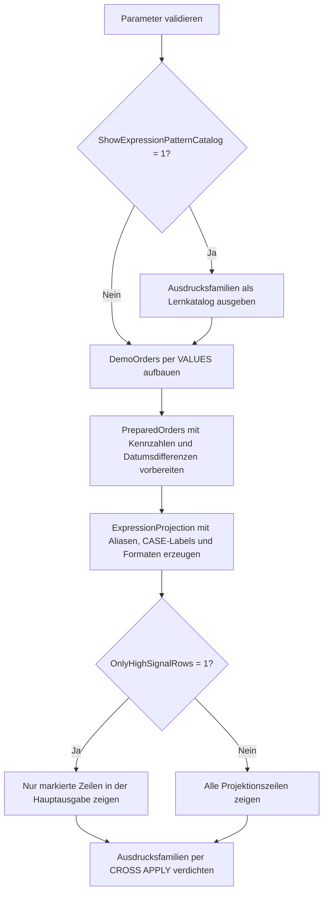

# SelectExpressionCatalog.sql

Dieses Lab sammelt gaengige Ausdrucksformen fuer `SELECT`-Projektionen in einem kompakten, direkt vergleichbaren Skript. Es zeigt dieselben Demo-Daten parallel als umbenannte Spalten, berechnete Kennzahlen, `CASE`-Labels, zusammengesetzte Texte, Datumsformate und normalisierte Freitextwerte.

## Uebersicht

<!-- SQLDOC:SUMMARY_TABLE:BEGIN -->
| Feld | Wert |
|---|---|
| Script | [SelectExpressionCatalog.sql](SelectExpressionCatalog.sql) |
| Version | `1.0` |
| Typ | `didactic-lab` |
| Kapitel | `02_Select` |
| Sicherheit | `read-only` |
| Zweck | Katalogisiert typische Ausdrucksformen fuer SELECT-Projektionen anhand eines kleinen Demo-Datensatzes. |
<!-- SQLDOC:SUMMARY_TABLE:END -->

## Einordnung

Im Kapitel `02_Select` liegt der Schwerpunkt hier nicht auf Filterung oder Gruppierung, sondern auf der Frage, wie Projektionen lesbarer und fachlich aussagekraeftiger werden. Das Skript eignet sich als Uebersicht zwischen einfachen Spaltenauswahlen und spaeteren Spezialthemen wie Stil, Formatierung oder Wiederverwendung komplexerer Ausdruecke.

## Annahmen

- Das Skript arbeitet ausschliesslich mit eingebetteten Demo-Daten und greift auf keine produktiven Tabellen zu.
- `@AsOfDate` fixiert relative Datumsableitungen, damit Ergebnisse im Unterricht reproduzierbar bleiben.
- `HighSignalRowFlag` ist ein didaktischer Filterindikator und keine fachlich produktive Priorisierungsregel.
- Das Resultset `ExpressionPatternCatalog` dient als Lernkatalog fuer Ausdrucksfamilien und ist bewusst kompakt gehalten.

## Anwendungsfall

Das Lab ist fuer Unterricht, Selbststudium und Code-Review gedacht. Lernende koennen nachvollziehen, wie sich dieselben Basisfelder ueber unterschiedliche Ausdrucksformen in sprechende Ergebnisattribute transformieren lassen und welche Ausdruecke fuer Kennzahlen, Anzeigeformate oder Klassifizierungen besonders haeufig in `SELECT`-Listen auftauchen.

## Parameter

<!-- SQLDOC:PARAMETERS_TABLE:BEGIN -->
| Parameter | SQL-Typ | Pflicht | Beschreibung |
|---|---|---|---|
| `@AsOfDate` | `DATE` | Nein | Stichtag fuer reproduzierbare Datums- und Statusableitungen. |
| `@ShowExpressionPatternCatalog` | `BIT` | Nein | Gibt bei `1` ein zusaetzliches Resultset mit Ausdrucksfamilien und Beispielsyntax aus. |
| `@OnlyHighSignalRows` | `BIT` | Nein | Filtert bei `1` auf Zeilen mit hoher Prioritaet, grossem Umsatz oder naher Faelligkeit. |
<!-- SQLDOC:PARAMETERS_TABLE:END -->

## Abhaengigkeiten

<!-- SQLDOC:DEPENDENCIES_LIST:BEGIN -->
- `CTE`
- `VALUES`-Konstruktor
- `CASE`
- `CAST`
- `CONCAT`
- `COALESCE`
- `NULLIF`
- `CONVERT`
- `DATEDIFF`
- `CROSS APPLY`
<!-- SQLDOC:DEPENDENCIES_LIST:END -->

## Hinweise

- `ExpressionPatternCatalog` gibt zuerst eine kleine Landkarte typischer Ausdrucksfamilien aus, bevor die eigentliche Projektion folgt.
- `ExpressionProjection` sammelt vorberechnete Kennzahlen und Anzeigeattribute, damit die Hauptabfrage lesbar bleibt.
- `CommentNormalized` demonstriert das Zusammenspiel aus `NULLIF` und `COALESCE` fuer leere oder fehlende Texte.
- `ExpressionFamilySummary` zaehlt, welche Ausdrucksfamilien in der sichtbaren Hauptausgabe vertreten sind.

## Versionshistorie

<!-- SQLDOC:VERSION_HISTORY_TABLE:BEGIN -->
| Version | Datum | User | Beschreibung |
|---|---|---|---|
| `1.0` | `2026-04-19` | `ER` | Erstversion des Ausdruckskatalogs fuer SELECT-Projektionen |
<!-- SQLDOC:VERSION_HISTORY_TABLE:END -->

## Ablauf

<!-- SQLDOC:MERMAID:BEGIN -->

<!-- SQLDOC:MERMAID:END -->

## SQL-Code

<!-- SQLDOC:SQL_CODE:BEGIN -->
```sql
/*
BEGIN:SQL-HEADER v1
---
sql_header: v1
script_name: "SelectExpressionCatalog.sql"
script_version: "1.0"
script_type: "didactic-lab"
chapter: "02_Select"

purpose: >
  Katalogisiert gaengige Ausdrucksformen in SELECT-Projektionen, darunter
  Umbenennungen, Berechnungen, CASE-Labels, Typkonvertierungen,
  Nullbehandlung und Anzeigeformate auf einem kleinen Demo-Datensatz.

parameters:
  - name: "@AsOfDate"
    sql_type: "DATE"
    direction: "IN"
    required: false
    description: "Stichtag fuer reproduzierbare Datums- und Statusableitungen"
  - name: "@ShowExpressionPatternCatalog"
    sql_type: "BIT"
    direction: "IN"
    required: false
    description: "1 = zusaetzliches Resultset mit Ausdrucksfamilien und Beispielsyntax anzeigen"
  - name: "@OnlyHighSignalRows"
    sql_type: "BIT"
    direction: "IN"
    required: false
    description: "1 = nur Zeilen mit hoher Prioritaet, grossem Umsatz oder naher Faelligkeit ausgeben"

result_sets:
  - name: "ExpressionPatternCatalog"
    description: "Optionaler Katalog typischer Ausdrucksfamilien fuer SELECT-Projektionen"
  - name: "ExpressionCatalogPreview"
    description: "Hauptausgabe mit denselben Basisdaten in mehreren Ausdrucksformen"
  - name: "ExpressionFamilySummary"
    description: "Verdichtet, welche Ausdrucksfamilien in der Projektion sichtbar sind"

dependencies:
  - "CTE"
  - "VALUES constructor"
  - "CASE"
  - "CAST"
  - "CONCAT"
  - "COALESCE"
  - "NULLIF"
  - "CONVERT"
  - "DATEDIFF"
  - "CROSS APPLY"

safety:
  level: "read-only"
  writes_data: false

documentation:
  markdown_file: "T-SQL/02_Select/SQLScripts/SelectExpressionCatalog.md"
  sync_blocks:
    - "SUMMARY_TABLE"
    - "PARAMETERS_TABLE"
    - "DEPENDENCIES_LIST"
    - "VERSION_HISTORY_TABLE"
    - "SQL_CODE"
  mermaid:
    mode: "ai-agent-from-sql"
    source: "script-body"

main_responsible:
  name: "Erhard Rainer"
  initials: "ER"

version_history:
  - version: "1.0"
    date: "2026-04-19"
    user: "ER"
    description: "Erstversion des Ausdruckskatalogs fuer SELECT-Projektionen"

notes:
  - "Das Skript nutzt ausschliesslich eingebettete Demo-Daten"
  - "Die Projektion zeigt mehrere Ausdrucksfamilien parallel, damit Unterschiede direkt vergleichbar bleiben"
---
END:SQL-HEADER v1
*/

SET NOCOUNT ON;

DECLARE @AsOfDate DATE = '2026-04-19';
DECLARE @ShowExpressionPatternCatalog BIT = 1;
DECLARE @OnlyHighSignalRows BIT = 0;

IF @AsOfDate IS NULL
BEGIN
    THROW 50000, '@AsOfDate darf nicht NULL sein.', 1;
END;

IF @ShowExpressionPatternCatalog NOT IN (0, 1)
BEGIN
    THROW 50001, '@ShowExpressionPatternCatalog muss 0 oder 1 sein.', 1;
END;

IF @OnlyHighSignalRows NOT IN (0, 1)
BEGIN
    THROW 50002, '@OnlyHighSignalRows muss 0 oder 1 sein.', 1;
END;

IF @ShowExpressionPatternCatalog = 1
BEGIN
    SELECT
        patterns.ExpressionFamily,
        patterns.ExampleExpression,
        patterns.TeachingIntent
    FROM
    (
        VALUES
            ('Renamed base column', 'CustomerName AS CustomerDisplayName', 'Zeigt sprechende Aliase fuer rohe Quellspalten'),
            ('Arithmetic expression', 'Quantity * UnitPrice AS GrossAmount', 'Macht Kennzahlen direkt in der Projektion sichtbar'),
            ('CASE classification', 'CASE WHEN NetAmount >= 500 THEN ''High'' ELSE ''Standard'' END', 'Klassifiziert Zeilen ohne Voraggregation'),
            ('String composition', 'CONCAT(RegionCode, '' / '', SalesChannel)', 'Baut Anzeigeattribute aus mehreren Spalten auf'),
            ('Date expression', 'DATEDIFF(DAY, @AsOfDate, DueDate)', 'Leitet relative Datumsinformationen reproduzierbar ab'),
            ('Null handling', 'COALESCE(NULLIF(CommentText, ''''), ''no note'')', 'Normalisiert leere oder fehlende Texte'),
            ('Type conversion', 'CONVERT(char(10), OrderDate, 23)', 'Zeigt kontrollierte Ausgabeformate fuer Datumswerte')
    ) AS patterns
    (
        ExpressionFamily,
        ExampleExpression,
        TeachingIntent
    )
    ORDER BY
        patterns.ExpressionFamily;
END;

;WITH DemoOrders AS
(
    SELECT
        sample.OrderID,
        sample.CustomerName,
        sample.RegionCode,
        sample.SalesChannel,
        sample.OrderDate,
        sample.DueDate,
        sample.Quantity,
        sample.UnitPrice,
        sample.DiscountRate,
        sample.PriorityCode,
        sample.OwnerInitials,
        sample.CommentText
    FROM
    (
        VALUES
            (8201, 'Alpenmarkt GmbH', 'DE-NORTH', 'Direct',     CAST('2026-04-11' AS DATE), CAST('2026-04-20' AS DATE), 12, CAST( 39.90 AS DECIMAL(10,2)), CAST(0.05 AS DECIMAL(5,2)), 'A', 'NR', 'renewal ready'),
            (8202, 'Bergblick AG',    'AT-WEST',  'Partner',    CAST('2026-04-12' AS DATE), CAST('2026-04-18' AS DATE),  5, CAST(129.00 AS DECIMAL(10,2)), CAST(0.00 AS DECIMAL(5,2)), 'B', 'IV', NULL),
            (8203, 'City Clinic',     'CH-CENTRAL','Direct',    CAST('2026-04-13' AS DATE), CAST('2026-04-25' AS DATE),  2, CAST(540.00 AS DECIMAL(10,2)), CAST(0.03 AS DECIMAL(5,2)), 'A', 'MN', 'board review'),
            (8204, 'Delta Stores',    'DE-SOUTH', 'Inside',     CAST('2026-04-15' AS DATE), CAST('2026-04-29' AS DATE), 20, CAST( 18.50 AS DECIMAL(10,2)), CAST(0.08 AS DECIMAL(5,2)), 'C', 'TR', ''),
            (8205, 'Eiger Systems',   'DE-NORTH', 'KeyAccount', CAST('2026-04-16' AS DATE), CAST('2026-04-19' AS DATE),  1, CAST(980.00 AS DECIMAL(10,2)), CAST(0.10 AS DECIMAL(5,2)), 'A', 'NR', 'exec sync')
    ) AS sample
    (
        OrderID,
        CustomerName,
        RegionCode,
        SalesChannel,
        OrderDate,
        DueDate,
        Quantity,
        UnitPrice,
        DiscountRate,
        PriorityCode,
        OwnerInitials,
        CommentText
    )
),
PreparedOrders AS
(
    SELECT
        d.OrderID,
        d.CustomerName,
        d.RegionCode,
        d.SalesChannel,
        d.OrderDate,
        d.DueDate,
        d.Quantity,
        d.UnitPrice,
        d.DiscountRate,
        d.PriorityCode,
        d.OwnerInitials,
        d.CommentText,
        CAST(d.Quantity * d.UnitPrice AS DECIMAL(12,2)) AS GrossAmount,
        CAST((d.Quantity * d.UnitPrice) * (1 - d.DiscountRate) AS DECIMAL(12,2)) AS NetAmount,
        DATEDIFF(DAY, d.OrderDate, @AsOfDate) AS DaysOpen,
        DATEDIFF(DAY, @AsOfDate, d.DueDate) AS DaysUntilDue
    FROM DemoOrders AS d
),
ExpressionProjection AS
(
    SELECT
        p.OrderID AS OrderIdentifier,
        p.CustomerName AS CustomerDisplayName,
        CONCAT(p.RegionCode, ' / ', p.SalesChannel) AS RegionChannelLabel,
        CONVERT(char(10), p.OrderDate, 23) AS OrderDateIso,
        CONVERT(char(10), p.DueDate, 23) AS DueDateIso,
        p.Quantity AS OrderedUnits,
        CAST(p.UnitPrice AS DECIMAL(10,2)) AS UnitPriceAmount,
        p.GrossAmount AS GrossAmount,
        p.NetAmount AS NetAmount,
        CAST(p.GrossAmount - p.NetAmount AS DECIMAL(12,2)) AS DiscountAmount,
        p.DaysOpen AS OrderAgeDays,
        p.DaysUntilDue AS RemainingDays,
        CASE p.PriorityCode
            WHEN 'A' THEN 'PriorityCritical'
            WHEN 'B' THEN 'PriorityPlanned'
            ELSE 'PriorityRoutine'
        END AS PriorityLabel,
        CASE
            WHEN p.NetAmount >= 500 THEN 'RevenueHigh'
            WHEN p.NetAmount >= 150 THEN 'RevenueMedium'
            ELSE 'RevenueEntry'
        END AS RevenueBand,
        CASE
            WHEN p.DaysUntilDue < 0 THEN 'DueOver'
            WHEN p.DaysUntilDue <= 3 THEN 'DueSoon'
            ELSE 'DueLater'
        END AS DueWindowLabel,
        COALESCE(NULLIF(p.CommentText, ''), 'no note provided') AS CommentNormalized,
        CONCAT('owner-', LOWER(p.OwnerInitials)) AS OwnerTag,
        CONCAT('Order ', p.OrderID, ' / ', p.CustomerName) AS OrderCaption,
        CASE
            WHEN p.PriorityCode = 'A'
              OR p.NetAmount >= 500
              OR p.DaysUntilDue <= 3 THEN 1
            ELSE 0
        END AS HighSignalRowFlag
    FROM PreparedOrders AS p
)
SELECT
    ep.OrderIdentifier,
    ep.CustomerDisplayName,
    ep.RegionChannelLabel,
    ep.OrderDateIso,
    ep.DueDateIso,
    ep.OrderedUnits,
    ep.UnitPriceAmount,
    ep.GrossAmount,
    ep.NetAmount,
    ep.DiscountAmount,
    ep.OrderAgeDays,
    ep.RemainingDays,
    ep.PriorityLabel,
    ep.RevenueBand,
    ep.DueWindowLabel,
    ep.CommentNormalized,
    ep.OwnerTag,
    ep.OrderCaption,
    ep.HighSignalRowFlag
FROM ExpressionProjection AS ep
WHERE @OnlyHighSignalRows = 0
   OR ep.HighSignalRowFlag = 1
ORDER BY
    ep.HighSignalRowFlag DESC,
    ep.NetAmount DESC,
    ep.OrderIdentifier;

SELECT
    summary.ExpressionFamily,
    COUNT(*) AS MatchingRows
FROM ExpressionProjection AS ep
CROSS APPLY
(
    VALUES
        ('Renamed base column', CASE WHEN ep.CustomerDisplayName IS NOT NULL THEN 1 ELSE 0 END),
        ('String composition', CASE WHEN ep.RegionChannelLabel IS NOT NULL THEN 1 ELSE 0 END),
        ('Type conversion', CASE WHEN ep.OrderDateIso IS NOT NULL AND ep.DueDateIso IS NOT NULL THEN 1 ELSE 0 END),
        ('Arithmetic expression', CASE WHEN ep.DiscountAmount >= 0 THEN 1 ELSE 0 END),
        ('CASE classification', CASE WHEN ep.PriorityLabel IN ('PriorityCritical', 'PriorityPlanned', 'PriorityRoutine') THEN 1 ELSE 0 END),
        ('Null handling', CASE WHEN ep.CommentNormalized IS NOT NULL THEN 1 ELSE 0 END),
        ('Filter signal', CASE WHEN ep.HighSignalRowFlag IN (0, 1) THEN 1 ELSE 0 END)
) AS summary(ExpressionFamily, IsMatch)
WHERE (@OnlyHighSignalRows = 0 OR ep.HighSignalRowFlag = 1)
  AND summary.IsMatch = 1
GROUP BY
    summary.ExpressionFamily
ORDER BY
    summary.ExpressionFamily;
```
<!-- SQLDOC:SQL_CODE:END -->
