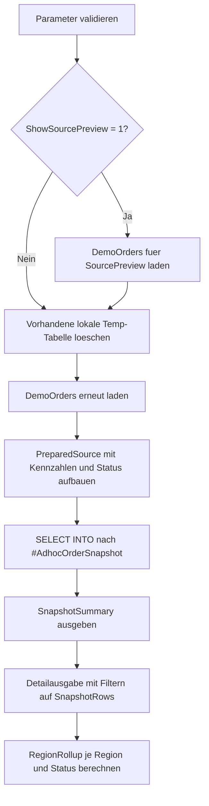

# SelectIntoTempSnapshot.sql

Dieses Lab zeigt `SELECT INTO` als schnelles Muster fuer einen Session-Snapshot in einer lokalen Temp-Tabelle. Der Fokus liegt auf einer Ad-hoc-Analyse, bei der eine vorbereitete Projektion sofort materialisiert und anschliessend mehrfach ausgewertet werden kann.

## Uebersicht

<!-- SQLDOC:SUMMARY_TABLE:BEGIN -->
| Feld | Wert |
|---|---|
| Script | [SelectIntoTempSnapshot.sql](SelectIntoTempSnapshot.sql) |
| Version | `1.0` |
| Typ | `didactic-lab` |
| Kapitel | `02_Select` |
| Sicherheit | `demo-write-tempdb` |
| Zweck | Erstellt mit `SELECT INTO` einen schnellen Session-Snapshot in einer lokalen Temp-Tabelle fuer Ad-hoc-Analysen. |
<!-- SQLDOC:SUMMARY_TABLE:END -->

## Einordnung

Im Kapitel `02_Select` ergaenzt das Skript die bisherigen Projektionsbeispiele um den Schritt von der reinen Abfrage zur materialisierten Arbeitssicht. Die Temp-Tabelle eignet sich dabei als kurzer Zwischenspeicher, wenn auf derselben Ergebnismenge mehrere Detail- oder Verdichtungsabfragen ausgefuehrt werden sollen.

## Annahmen

- Das Skript verwendet ausschliesslich eingebettete Demo-Auftragsdaten statt produktiver Quelltabellen.
- Der Snapshot wird bewusst als lokale Temp-Tabelle `#AdhocOrderSnapshot` angelegt und bleibt bis zum Session-Ende verfuegbar.
- `DROP TABLE IF EXISTS` entfernt bei wiederholten Demos einen vorhandenen Snapshot im selben Query-Fenster.
- `@OnlyOpenOrders` behandelt sowohl `Open` als auch `Overdue` als aktive Arbeitsmenge fuer die Ad-hoc-Sicht.
- `@MinimumNetAmount` filtert nur die Detailausgabe, nicht die eigentliche Snapshot-Erzeugung.

## Anwendungsfall

Das Lab eignet sich fuer Unterricht, wenn `SELECT INTO` nicht nur als Kopierbefehl, sondern als Werkzeug fuer eine schnelle Arbeitskopie besprochen werden soll. Sichtbar werden dabei drei typische Schritte: Quelldaten aufbereiten, Snapshot materialisieren und anschliessend verschiedene Auswertungen auf derselben Temp-Tabelle fahren.

## Parameter

<!-- SQLDOC:PARAMETERS_TABLE:BEGIN -->
| Parameter | SQL-Typ | Pflicht | Beschreibung |
|---|---|---|---|
| `@AsOfDate` | `DATE` | Nein | Stichtag fuer reproduzierbare Liefer- und Alterskennzahlen. |
| `@OnlyOpenOrders` | `BIT` | Nein | Zeigt bei `1` nur noch offene oder ueberfaellige Auftraege in der Detailausgabe. |
| `@MinimumNetAmount` | `DECIMAL(12,2)` | Nein | Untergrenze fuer die Detailausgabe nach Erzeugung des Snapshots. |
| `@ShowSourcePreview` | `BIT` | Nein | Zeigt bei `1` den Quelldatensatz vor der Snapshot-Erzeugung zusaetzlich an. |
<!-- SQLDOC:PARAMETERS_TABLE:END -->

## Abhaengigkeiten

<!-- SQLDOC:DEPENDENCIES_LIST:BEGIN -->
- `CTE`
- `VALUES`-Konstruktor
- `CASE`
- `DATEDIFF`
- `DROP TABLE IF EXISTS`
- lokale Temp-Tabelle
- `SELECT INTO`
<!-- SQLDOC:DEPENDENCIES_LIST:END -->

## Hinweise

- `PreparedSource` trennt die fachliche Vorbereitung von der eigentlichen Materialisierung in `#AdhocOrderSnapshot`.
- Die Summary-Ausgabe zeigt direkt, ob der Snapshot die erwartete Groesse und Statusverteilung hat.
- Die anschliessende Detailausgabe nutzt bereits die Temp-Tabelle statt die Ursprungs-CTE noch einmal zu berechnen.
- Das Region-Rollup demonstriert, warum ein Snapshot fuer mehrere Folgeschritte innerhalb derselben Session hilfreich sein kann.

## Versionshistorie

<!-- SQLDOC:VERSION_HISTORY_TABLE:BEGIN -->
| Version | Datum | User | Beschreibung |
|---|---|---|---|
| `1.0` | `2026-04-17` | `ER` | Erstversion des Labs fuer `SELECT INTO` in eine lokale Temp-Snapshot-Tabelle |
<!-- SQLDOC:VERSION_HISTORY_TABLE:END -->

## Ablauf

<!-- SQLDOC:MERMAID:BEGIN -->

<!-- SQLDOC:MERMAID:END -->

## SQL-Code

<!-- SQLDOC:SQL_CODE:BEGIN -->
```sql
/*
BEGIN:SQL-HEADER v1
---
sql_header: v1
script_name: "SelectIntoTempSnapshot.sql"
script_version: "1.0"
script_type: "didactic-lab"
chapter: "02_Select"

purpose: >
  Erstellt mit SELECT INTO einen schnellen Session-Snapshot in einer lokalen
  Temp-Tabelle fuer Ad-hoc-Analysen auf einem didaktischen Auftragsdatensatz.

parameters:
  - name: "@AsOfDate"
    sql_type: "DATE"
    direction: "IN"
    required: false
    description: "Stichtag fuer reproduzierbare Liefer- und Alterskennzahlen"
  - name: "@OnlyOpenOrders"
    sql_type: "BIT"
    direction: "IN"
    required: false
    description: "1 = nur noch offene oder ueberfaellige Auftraege im Snapshot ausgeben"
  - name: "@MinimumNetAmount"
    sql_type: "DECIMAL(12,2)"
    direction: "IN"
    required: false
    description: "Untergrenze fuer die Detailausgabe nach Erzeugung des Snapshots"
  - name: "@ShowSourcePreview"
    sql_type: "BIT"
    direction: "IN"
    required: false
    description: "1 = Quelldatensatz vor der Snapshot-Erzeugung zusaetzlich anzeigen"

result_sets:
  - name: "SourcePreview"
    description: "Optionale Vorschau des didaktischen Quelldatensatzes"
  - name: "SnapshotSummary"
    description: "Kennzahlen zum erzeugten Temp-Snapshot"
  - name: "SnapshotRows"
    description: "Detailansicht der Snapshot-Zeilen fuer Ad-hoc-Analysen"
  - name: "RegionRollup"
    description: "Verdichtung des Snapshots nach Region und Status"

dependencies:
  - "CTE"
  - "VALUES constructor"
  - "CASE"
  - "DATEDIFF"
  - "DROP TABLE IF EXISTS"
  - "local temporary table"
  - "SELECT INTO"

safety:
  level: "demo-write-tempdb"
  writes_data: true

documentation:
  markdown_file: "T-SQL/02_Select/SQLScripts/SelectIntoTempSnapshot.md"
  sync_blocks:
    - "SUMMARY_TABLE"
    - "PARAMETERS_TABLE"
    - "DEPENDENCIES_LIST"
    - "VERSION_HISTORY_TABLE"
    - "SQL_CODE"
  mermaid:
    mode: "ai-agent-from-sql"
    source: "script-body"

main_responsible:
  name: "Erhard Rainer"
  initials: "ER"

version_history:
  - version: "1.0"
    date: "2026-04-17"
    user: "ER"
    description: "Erstversion des Labs fuer SELECT INTO in eine lokale Temp-Snapshot-Tabelle"

notes:
  - "Die Demo verwendet nur eingebettete Beispieldaten und schreibt ausschliesslich nach tempdb ueber eine lokale Temp-Tabelle"
  - "Die Snapshot-Tabelle bleibt bis zum Session-Ende oder bis zu einem manuellen DROP TABLE verfuegbar"
---
END:SQL-HEADER v1
*/

SET NOCOUNT ON;

DECLARE @AsOfDate DATE = '2026-04-17';
DECLARE @OnlyOpenOrders BIT = 0;
DECLARE @MinimumNetAmount DECIMAL(12,2) = 0.00;
DECLARE @ShowSourcePreview BIT = 1;

IF @AsOfDate IS NULL
BEGIN
    THROW 50000, '@AsOfDate darf nicht NULL sein.', 1;
END;

IF @OnlyOpenOrders NOT IN (0, 1)
BEGIN
    THROW 50001, '@OnlyOpenOrders muss 0 oder 1 sein.', 1;
END;

IF @ShowSourcePreview NOT IN (0, 1)
BEGIN
    THROW 50002, '@ShowSourcePreview muss 0 oder 1 sein.', 1;
END;

IF @MinimumNetAmount < 0
BEGIN
    THROW 50003, '@MinimumNetAmount darf nicht negativ sein.', 1;
END;
IF @ShowSourcePreview = 1
BEGIN
    ;WITH DemoOrders AS
    (
        SELECT
            sample.OrderID,
            sample.CustomerName,
            sample.RegionCode,
            sample.OrderDate,
            sample.RequiredDate,
            sample.Quantity,
            sample.UnitPrice,
            sample.DiscountRate,
            sample.PriorityCode,
            sample.SalesChannel,
            sample.OwnerName
        FROM
        (
            VALUES
                (5101, 'Alpenmarkt GmbH', 'DE-NORTH', CAST('2026-04-09' AS DATE), CAST('2026-04-18' AS DATE), 12, CAST(29.90 AS DECIMAL(10,2)), CAST(0.05 AS DECIMAL(5,2)), 'A', 'Field', 'Nora'),
                (5102, 'Bergwerk AG', 'AT-WEST', CAST('2026-04-10' AS DATE), CAST('2026-04-15' AS DATE), 4, CAST(180.00 AS DECIMAL(10,2)), CAST(0.00 AS DECIMAL(5,2)), 'B', 'Partner', 'Ivo'),
                (5103, 'City Clinic', 'CH-CENTRAL', CAST('2026-04-11' AS DATE), CAST('2026-04-16' AS DATE), 2, CAST(520.00 AS DECIMAL(10,2)), CAST(0.02 AS DECIMAL(5,2)), 'A', 'Direct', 'Mina'),
                (5104, 'Delta Stores', 'DE-SOUTH', CAST('2026-04-12' AS DATE), CAST('2026-04-25' AS DATE), 30, CAST(15.50 AS DECIMAL(10,2)), CAST(0.08 AS DECIMAL(5,2)), 'C', 'ECommerce', 'Tariq'),
                (5105, 'Eiger Systems', 'DE-NORTH', CAST('2026-04-13' AS DATE), CAST('2026-04-14' AS DATE), 1, CAST(1290.00 AS DECIMAL(10,2)), CAST(0.10 AS DECIMAL(5,2)), 'A', 'Direct', 'Nora'),
                (5106, 'Fjord Retail', 'AT-WEST', CAST('2026-04-14' AS DATE), CAST('2026-04-30' AS DATE), 8, CAST(74.00 AS DECIMAL(10,2)), CAST(0.03 AS DECIMAL(5,2)), 'B', 'Field', 'Ivo')
        ) AS sample
        (
            OrderID,
            CustomerName,
            RegionCode,
            OrderDate,
            RequiredDate,
            Quantity,
            UnitPrice,
            DiscountRate,
            PriorityCode,
            SalesChannel,
            OwnerName
        )
    )
    SELECT
        d.OrderID,
        d.CustomerName,
        d.RegionCode,
        d.OrderDate,
        d.RequiredDate,
        d.Quantity,
        d.UnitPrice,
        d.DiscountRate,
        CASE d.PriorityCode
            WHEN 'A' THEN 'priority'
            WHEN 'B' THEN 'planned'
            ELSE 'standard'
        END AS PriorityLabel
    FROM DemoOrders AS d
    ORDER BY
        d.OrderID;
END;

DROP TABLE IF EXISTS #AdhocOrderSnapshot;

;WITH DemoOrders AS
(
    SELECT
        sample.OrderID,
        sample.CustomerName,
        sample.RegionCode,
        sample.OrderDate,
        sample.RequiredDate,
        sample.Quantity,
        sample.UnitPrice,
        sample.DiscountRate,
        sample.PriorityCode,
        sample.SalesChannel,
        sample.OwnerName
    FROM
    (
        VALUES
            (5101, 'Alpenmarkt GmbH', 'DE-NORTH', CAST('2026-04-09' AS DATE), CAST('2026-04-18' AS DATE), 12, CAST(29.90 AS DECIMAL(10,2)), CAST(0.05 AS DECIMAL(5,2)), 'A', 'Field', 'Nora'),
            (5102, 'Bergwerk AG', 'AT-WEST', CAST('2026-04-10' AS DATE), CAST('2026-04-15' AS DATE), 4, CAST(180.00 AS DECIMAL(10,2)), CAST(0.00 AS DECIMAL(5,2)), 'B', 'Partner', 'Ivo'),
            (5103, 'City Clinic', 'CH-CENTRAL', CAST('2026-04-11' AS DATE), CAST('2026-04-16' AS DATE), 2, CAST(520.00 AS DECIMAL(10,2)), CAST(0.02 AS DECIMAL(5,2)), 'A', 'Direct', 'Mina'),
            (5104, 'Delta Stores', 'DE-SOUTH', CAST('2026-04-12' AS DATE), CAST('2026-04-25' AS DATE), 30, CAST(15.50 AS DECIMAL(10,2)), CAST(0.08 AS DECIMAL(5,2)), 'C', 'ECommerce', 'Tariq'),
            (5105, 'Eiger Systems', 'DE-NORTH', CAST('2026-04-13' AS DATE), CAST('2026-04-14' AS DATE), 1, CAST(1290.00 AS DECIMAL(10,2)), CAST(0.10 AS DECIMAL(5,2)), 'A', 'Direct', 'Nora'),
            (5106, 'Fjord Retail', 'AT-WEST', CAST('2026-04-14' AS DATE), CAST('2026-04-30' AS DATE), 8, CAST(74.00 AS DECIMAL(10,2)), CAST(0.03 AS DECIMAL(5,2)), 'B', 'Field', 'Ivo')
    ) AS sample
    (
        OrderID,
        CustomerName,
        RegionCode,
        OrderDate,
        RequiredDate,
        Quantity,
        UnitPrice,
        DiscountRate,
        PriorityCode,
        SalesChannel,
        OwnerName
    )
),
PreparedSource AS
(
    SELECT
        d.OrderID,
        d.CustomerName,
        d.RegionCode,
        d.OrderDate,
        d.RequiredDate,
        d.Quantity,
        d.UnitPrice,
        d.DiscountRate,
        d.PriorityCode,
        d.SalesChannel,
        d.OwnerName,
        CAST(d.Quantity * d.UnitPrice AS DECIMAL(12,2)) AS GrossAmount,
        CAST((d.Quantity * d.UnitPrice) * (1 - d.DiscountRate) AS DECIMAL(12,2)) AS NetAmount,
        DATEDIFF(DAY, d.OrderDate, d.RequiredDate) AS LeadTimeDays,
        DATEDIFF(DAY, @AsOfDate, d.RequiredDate) AS DaysUntilRequired,
        CASE
            WHEN d.RequiredDate < @AsOfDate THEN 'Overdue'
            WHEN d.RequiredDate = @AsOfDate THEN 'DueToday'
            ELSE 'Open'
        END AS SnapshotStatus,
        CASE d.PriorityCode
            WHEN 'A' THEN 'priority'
            WHEN 'B' THEN 'planned'
            ELSE 'standard'
        END AS PriorityLabel
    FROM DemoOrders AS d
)
SELECT
    p.OrderID,
    p.CustomerName,
    p.RegionCode,
    p.OrderDate,
    p.RequiredDate,
    p.Quantity,
    p.UnitPrice,
    p.DiscountRate,
    p.GrossAmount,
    p.NetAmount,
    p.LeadTimeDays,
    p.DaysUntilRequired,
    p.SnapshotStatus,
    p.PriorityLabel,
    p.SalesChannel,
    p.OwnerName,
    CAST(SYSDATETIME() AS DATETIME2(0)) AS SnapshotCreatedAt
INTO #AdhocOrderSnapshot
FROM PreparedSource AS p;

SELECT
    COUNT(*) AS SnapshotRowCount,
    SUM(CASE WHEN s.SnapshotStatus = 'Overdue' THEN 1 ELSE 0 END) AS OverdueCount,
    SUM(CASE WHEN s.SnapshotStatus = 'DueToday' THEN 1 ELSE 0 END) AS DueTodayCount,
    SUM(CASE WHEN s.SnapshotStatus = 'Open' THEN 1 ELSE 0 END) AS OpenCount,
    MIN(s.SnapshotCreatedAt) AS FirstSnapshotCreatedAt,
    MAX(s.SnapshotCreatedAt) AS LastSnapshotCreatedAt
FROM #AdhocOrderSnapshot AS s;

SELECT
    s.OrderID,
    s.CustomerName,
    s.RegionCode,
    s.OrderDate,
    s.RequiredDate,
    s.DaysUntilRequired,
    s.SnapshotStatus,
    s.PriorityLabel,
    s.SalesChannel,
    s.OwnerName,
    s.GrossAmount,
    s.NetAmount,
    s.SnapshotCreatedAt
FROM #AdhocOrderSnapshot AS s
WHERE s.NetAmount >= @MinimumNetAmount
  AND (
        @OnlyOpenOrders = 0
        OR s.SnapshotStatus IN ('Open', 'Overdue')
      )
ORDER BY
    CASE s.SnapshotStatus
        WHEN 'Overdue' THEN 0
        WHEN 'DueToday' THEN 1
        ELSE 2
    END,
    s.NetAmount DESC,
    s.OrderID;

SELECT
    s.RegionCode,
    s.SnapshotStatus,
    COUNT(*) AS OrderCount,
    CAST(SUM(s.NetAmount) AS DECIMAL(12,2)) AS NetAmountTotal,
    CAST(AVG(s.NetAmount) AS DECIMAL(12,2)) AS NetAmountAverage
FROM #AdhocOrderSnapshot AS s
GROUP BY
    s.RegionCode,
    s.SnapshotStatus
ORDER BY
    s.RegionCode,
    s.SnapshotStatus;
```
<!-- SQLDOC:SQL_CODE:END -->
