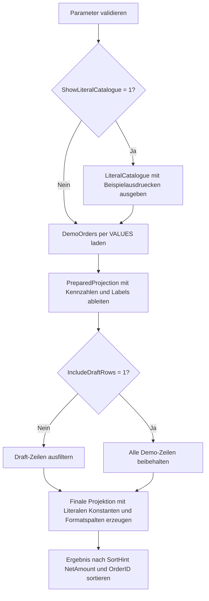

# SelectLiteralProjectionShowcase.sql

Dieses Lab zeigt, wie Literale, Konstanten und einfache Anzeigeformate direkt in der `SELECT`-Liste eingesetzt werden koennen. Der Fokus liegt auf der Projektion: feste Berichtstags, numerische Konstanten, Datums-Literale und fachliche Label werden bewusst sichtbar in der Ausgabe aufgebaut.

## Uebersicht

<!-- SQLDOC:SUMMARY_TABLE:BEGIN -->
| Feld | Wert |
|---|---|
| Script | [SelectLiteralProjectionShowcase.sql](SelectLiteralProjectionShowcase.sql) |
| Version | `1.0` |
| Typ | `didactic-lab` |
| Kapitel | `02_Select` |
| Sicherheit | `read-only` |
| Zweck | Demonstriert Literale, Konstanten und einfache Formatspalten direkt in der `SELECT`-Liste auf einem didaktischen Auftragsdatensatz. |
<!-- SQLDOC:SUMMARY_TABLE:END -->

## Einordnung

Im Kapitel `02_Select` erweitert das Skript einfache Projektionen um feste Textmarken, Konstanten und menschengerechte Ausgabespalten. Damit wird sichtbar, dass eine `SELECT`-Liste nicht nur Rohspalten weiterreicht, sondern auch eine kompakte Berichtssicht formen kann.

## Annahmen

- Das Skript arbeitet ausschliesslich mit eingebetteten Demo-Auftragsdaten statt produktiver Tabellen.
- Anzeigeformate werden absichtlich mit einfachen T-SQL-Bausteinen wie `CONCAT`, `CAST` und `CONVERT` erstellt.
- `@CurrencySymbol` ist nur ein Praefix fuer die Ausgabe und keine vollstaendige Lokalisierungslogik.
- Zeilen mit Status `D` gelten als didaktische Draft-Beispiele und werden standardmaessig ausgeblendet.
- Das optionale Resultset `LiteralCatalogue` dient nur der Einordnung typischer Literalmuster vor der Hauptprojektion.

## Anwendungsfall

Das Lab eignet sich fuer Unterricht und Uebungen, wenn gezeigt werden soll, wie Berichtstags, Referenzwerte, Datumsdarstellungen und fachliche Labels direkt in einer Projektion entstehen. Besonders sichtbar werden dabei der Unterschied zwischen Quellspalten und abgeleiteten Anzeigeelementen sowie die Lesbarkeit einer bewusst gestalteten Resultset-Ausgabe.

## Parameter

<!-- SQLDOC:PARAMETERS_TABLE:BEGIN -->
| Parameter | SQL-Typ | Pflicht | Beschreibung |
|---|---|---|---|
| `@AsOfDate` | `DATE` | Nein | Stichtag fuer reproduzierbare Datums- und Statusspalten. |
| `@IncludeDraftRows` | `BIT` | Nein | Nimmt bei `1` auch Demo-Zeilen mit Status `Draft` in die Hauptausgabe auf. |
| `@CurrencySymbol` | `NVARCHAR(5)` | Nein | Praefix fuer einfache Preis- und Umsatzanzeige in Formatspalten. |
| `@ShowLiteralCatalogue` | `BIT` | Nein | Zeigt bei `1` ein zusaetzliches Resultset mit typischen Literal- und Konstantenmustern an. |
<!-- SQLDOC:PARAMETERS_TABLE:END -->

## Abhaengigkeiten

<!-- SQLDOC:DEPENDENCIES_LIST:BEGIN -->
- `CTE`
- `VALUES`-Konstruktor
- `CASE`
- `CONCAT`
- `CONVERT`
- `CAST`
- `REPLICATE`
- `LOWER`
- `UPPER`
<!-- SQLDOC:DEPENDENCIES_LIST:END -->

## Hinweise

- `LiteralCatalogue` trennt die didaktische Einordnung von der eigentlichen Hauptabfrage.
- `PreparedProjection` bildet zuerst fachliche Kennzahlen und Labels, bevor die finale `SELECT`-Liste feste Literale und Anzeigeformate kombiniert.
- Die Spalten `ProjectionTag`, `LessonLabel`, `FixedDemoDate` und `ReferenceScore` sind bewusste Beispiele fuer konstante Projektionselemente.
- Spalten wie `NetAmountDisplay`, `RegionStatusBanner` und `QuantityBadge` zeigen, wie reine Anzeigelogik die Lesbarkeit eines Resultsets erhoehen kann.

## Versionshistorie

<!-- SQLDOC:VERSION_HISTORY_TABLE:BEGIN -->
| Version | Datum | User | Beschreibung |
|---|---|---|---|
| `1.0` | `2026-04-17` | `ER` | Erstversion des Labs fuer Literale, Konstanten und Formatspalten in `SELECT`-Projektionen |
<!-- SQLDOC:VERSION_HISTORY_TABLE:END -->

## Ablauf

<!-- SQLDOC:MERMAID:BEGIN -->

<!-- SQLDOC:MERMAID:END -->

## SQL-Code

<!-- SQLDOC:SQL_CODE:BEGIN -->
```sql
/*
BEGIN:SQL-HEADER v1
---
sql_header: v1
script_name: "SelectLiteralProjectionShowcase.sql"
script_version: "1.0"
script_type: "didactic-lab"
chapter: "02_Select"

purpose: >
  Demonstriert Literale, Konstanten und einfache Formatspalten direkt in der
  SELECT-Liste auf einem didaktischen Auftragsdatensatz.

parameters:
  - name: "@AsOfDate"
    sql_type: "DATE"
    direction: "IN"
    required: false
    description: "Stichtag fuer reproduzierbare Datums- und Statusspalten"
  - name: "@IncludeDraftRows"
    sql_type: "BIT"
    direction: "IN"
    required: false
    description: "1 = auch Demo-Zeilen mit Status Draft in die Hauptausgabe aufnehmen"
  - name: "@CurrencySymbol"
    sql_type: "NVARCHAR(5)"
    direction: "IN"
    required: false
    description: "Praefix fuer einfache Preis- und Umsatzanzeige in Formatspalten"
  - name: "@ShowLiteralCatalogue"
    sql_type: "BIT"
    direction: "IN"
    required: false
    description: "1 = zusaetzliches Resultset mit typischen Literal- und Konstantenmustern anzeigen"

result_sets:
  - name: "LiteralCatalogue"
    description: "Optionaler Ueberblick ueber verwendete Literal- und Konstantentypen"
  - name: "ProjectionShowcase"
    description: "Hauptausgabe mit Literalspalten, Konstanten und Anzeigeformaten in der Projektion"

dependencies:
  - "CTE"
  - "VALUES constructor"
  - "CASE"
  - "CONCAT"
  - "CONVERT"
  - "CAST"
  - "REPLICATE"
  - "LOWER"
  - "UPPER"

safety:
  level: "read-only"
  writes_data: false

documentation:
  markdown_file: "T-SQL/02_Select/SQLScripts/SelectLiteralProjectionShowcase.md"
  sync_blocks:
    - "SUMMARY_TABLE"
    - "PARAMETERS_TABLE"
    - "DEPENDENCIES_LIST"
    - "VERSION_HISTORY_TABLE"
    - "SQL_CODE"
  mermaid:
    mode: "ai-agent-from-sql"
    source: "script-body"

main_responsible:
  name: "Erhard Rainer"
  initials: "ER"

version_history:
  - version: "1.0"
    date: "2026-04-17"
    user: "ER"
    description: "Erstversion des Labs fuer Literale, Konstanten und Formatspalten in SELECT-Projektionen"

notes:
  - "Die Demo arbeitet ausschliesslich mit eingebetteten Beispieldaten"
  - "Anzeigeformate bleiben bewusst einfach und transparent statt kulturabhaengige FORMAT-Aufrufe zu erzwingen"
---
END:SQL-HEADER v1
*/

SET NOCOUNT ON;

DECLARE @AsOfDate DATE = '2026-04-17';
DECLARE @IncludeDraftRows BIT = 0;
DECLARE @CurrencySymbol NVARCHAR(5) = N'EUR ';
DECLARE @ShowLiteralCatalogue BIT = 1;

IF @AsOfDate IS NULL
BEGIN
    THROW 50000, '@AsOfDate darf nicht NULL sein.', 1;
END;

IF @IncludeDraftRows NOT IN (0, 1)
BEGIN
    THROW 50001, '@IncludeDraftRows muss 0 oder 1 sein.', 1;
END;

IF @ShowLiteralCatalogue NOT IN (0, 1)
BEGIN
    THROW 50002, '@ShowLiteralCatalogue muss 0 oder 1 sein.', 1;
END;

IF @CurrencySymbol IS NULL OR LTRIM(RTRIM(@CurrencySymbol)) = N''
BEGIN
    THROW 50003, '@CurrencySymbol darf nicht leer sein.', 1;
END;

IF @ShowLiteralCatalogue = 1
BEGIN
    SELECT
        patterns.PatternName,
        patterns.ExampleExpression,
        patterns.TeachingIntent
    FROM
    (
        VALUES
            ('String literal', '''training-run''', 'Feste Textmarke fuer Berichte oder Tags'),
            ('Numeric constant', '100', 'Konstante fuer Schwellenwerte oder Vergleichswerte'),
            ('Date literal', 'CAST(''2026-04-17'' AS DATE)', 'Reproduzierbarer Stichtag in Demos'),
            ('Computed display column', 'CONCAT(@CurrencySymbol, CAST(NetAmount AS varchar(20)))', 'Menschenlesbare Anzeige direkt in der Projektion'),
            ('Conditional label', 'CASE WHEN StatusCode = ''A'' THEN ''active'' ELSE ''draft'' END', 'Geschachtelte Fachbedeutung fuer kompakte Ausgaben')
    ) AS patterns
    (
        PatternName,
        ExampleExpression,
        TeachingIntent
    )
    ORDER BY
        patterns.PatternName;
END;

;WITH DemoOrders AS
(
    SELECT
        sample.OrderID,
        sample.CustomerName,
        sample.RegionCode,
        sample.OrderDate,
        sample.Quantity,
        sample.UnitPrice,
        sample.DiscountRate,
        sample.StatusCode,
        sample.OwnerInitials
    FROM
    (
        VALUES
            (6101, 'Alpenmarkt GmbH', 'DE-NORTH', CAST('2026-04-09' AS DATE), 12, CAST(29.90 AS DECIMAL(10,2)), CAST(0.05 AS DECIMAL(5,2)), 'A', 'NR'),
            (6102, 'Bergwerk AG', 'AT-WEST', CAST('2026-04-10' AS DATE), 4, CAST(180.00 AS DECIMAL(10,2)), CAST(0.00 AS DECIMAL(5,2)), 'P', 'IV'),
            (6103, 'City Clinic', 'CH-CENTRAL', CAST('2026-04-11' AS DATE), 2, CAST(520.00 AS DECIMAL(10,2)), CAST(0.02 AS DECIMAL(5,2)), 'A', 'MN'),
            (6104, 'Delta Stores', 'DE-SOUTH', CAST('2026-04-13' AS DATE), 30, CAST(15.50 AS DECIMAL(10,2)), CAST(0.08 AS DECIMAL(5,2)), 'D', 'TR'),
            (6105, 'Eiger Systems', 'DE-NORTH', CAST('2026-04-14' AS DATE), 1, CAST(1290.00 AS DECIMAL(10,2)), CAST(0.10 AS DECIMAL(5,2)), 'A', 'NR')
    ) AS sample
    (
        OrderID,
        CustomerName,
        RegionCode,
        OrderDate,
        Quantity,
        UnitPrice,
        DiscountRate,
        StatusCode,
        OwnerInitials
    )
),
PreparedProjection AS
(
    SELECT
        d.OrderID,
        d.CustomerName,
        d.RegionCode,
        d.OrderDate,
        d.Quantity,
        d.UnitPrice,
        d.DiscountRate,
        d.StatusCode,
        d.OwnerInitials,
        CAST(d.Quantity * d.UnitPrice AS DECIMAL(12,2)) AS GrossAmount,
        CAST((d.Quantity * d.UnitPrice) * (1 - d.DiscountRate) AS DECIMAL(12,2)) AS NetAmount,
        DATEDIFF(DAY, d.OrderDate, @AsOfDate) AS DaysSinceOrder,
        CASE d.StatusCode
            WHEN 'A' THEN 'active'
            WHEN 'P' THEN 'planned'
            ELSE 'draft'
        END AS StatusLabel,
        CASE
            WHEN d.Quantity >= 10 THEN 'bulk'
            WHEN d.Quantity >= 3 THEN 'standard'
            ELSE 'small'
        END AS QuantityBand
    FROM DemoOrders AS d
    WHERE @IncludeDraftRows = 1
       OR d.StatusCode <> 'D'
)
SELECT
    'training-run' AS ProjectionTag,
    'SELECT literal showcase' AS LessonLabel,
    CAST('2026-04-17' AS DATE) AS FixedDemoDate,
    100 AS ReferenceScore,
    p.OrderID,
    p.CustomerName,
    p.RegionCode,
    p.OrderDate,
    CONVERT(char(10), p.OrderDate, 23) AS OrderDateIso,
    p.Quantity,
    p.UnitPrice,
    p.DiscountRate,
    p.GrossAmount,
    p.NetAmount,
    CONCAT(@CurrencySymbol, CAST(p.NetAmount AS varchar(20))) AS NetAmountDisplay,
    CONCAT('owner-', LOWER(p.OwnerInitials)) AS OwnerTag,
    CONCAT(UPPER(p.RegionCode), ' / ', p.StatusLabel) AS RegionStatusBanner,
    CONCAT('days+', CAST(p.DaysSinceOrder AS varchar(10))) AS AgeLabel,
    CONCAT(REPLICATE('*', CASE WHEN p.Quantity >= 10 THEN 3 WHEN p.Quantity >= 3 THEN 2 ELSE 1 END), ' ', p.QuantityBand) AS QuantityBadge,
    CASE
        WHEN p.StatusCode = 'A' AND p.NetAmount >= 300 THEN 'focus-now'
        WHEN p.StatusCode = 'P' THEN 'watch-list'
        ELSE 'review-later'
    END AS ActionHint,
    CASE
        WHEN p.StatusCode = 'A' THEN 1
        WHEN p.StatusCode = 'P' THEN 2
        ELSE 3
    END AS SortHint
FROM PreparedProjection AS p
ORDER BY
    SortHint,
    p.NetAmount DESC,
    p.OrderID;
```
<!-- SQLDOC:SQL_CODE:END -->
