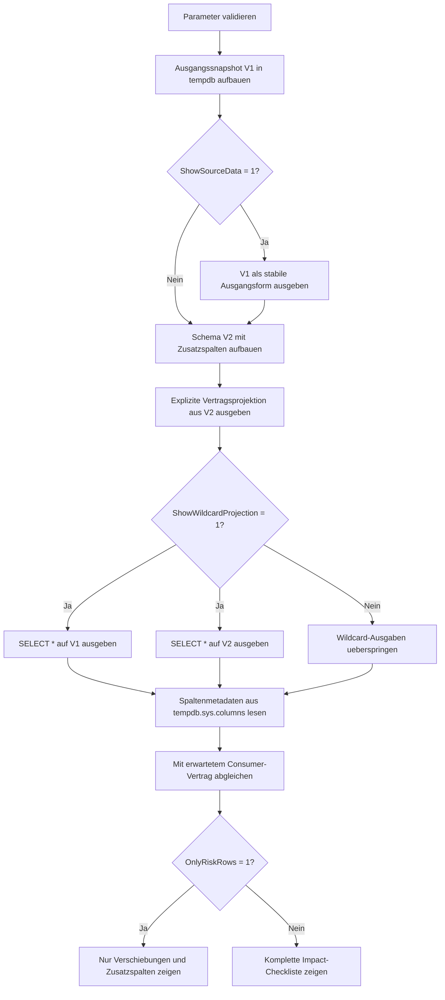

# SelectWildcardDependencyCheck.sql

Dieses Lab zeigt an zwei tempdb-Snapshots, warum `SELECT *` ein impliziter Vertrag mit allen aktuellen Spalten und ihrer Reihenfolge ist. Sobald ein spaeteres Schema zwischen bestehende Felder neue Spalten einschiebt oder zusaetzliche Attribute anhaengt, veraendert sich die Form des Resultsets, obwohl sich die eigentliche Anfrage nicht aendert.

## Uebersicht

<!-- SQLDOC:SUMMARY_TABLE:BEGIN -->
| Feld | Wert |
|---|---|
| Script | [SelectWildcardDependencyCheck.sql](SelectWildcardDependencyCheck.sql) |
| Version | `1.0` |
| Typ | `didactic-lab` |
| Kapitel | `02_Select` |
| Sicherheit | `read-only-tempdb` |
| Zweck | Veranschaulicht Risiken von `SELECT *` bei Schemaaenderungen und kontrastiert sie mit einer expliziten Projektion. |
<!-- SQLDOC:SUMMARY_TABLE:END -->

## Einordnung

Im Kapitel `02_Select` geht es hier nicht um Performance, sondern um Vertragstreue. `SELECT *` ist bequem, koppelt aber Konsumenten an jede aktuelle Spalte eines Snapshots oder Views. Das Skript baut deshalb zuerst einen einfachen Ausgangssnapshot, erweitert danach das Schema und zeigt, dass eine explizite Projektion stabil bleibt, waehrend die Wildcard-Ausgabe Form und Reihenfolge aendert.

## Annahmen

- Das Skript nutzt ausschliesslich tempdb-Objekte und Demo-Daten.
- Der Consumer-Vertrag orientiert sich an einer festen Spaltenreihenfolge aus dem ersten Snapshot.
- `PreferredLanguage` repraesentiert eine spaeter eingefuehrte Fachspalte, die zwischen bestehende Vertragsfelder eingeschoben wird.
- `CreditHoldFlag` repraesentiert eine zusaetzliche technische oder fachliche Erweiterung, die bei `SELECT *` automatisch mit ausgeliefert wird.

## Anwendungsfall

Das Lab eignet sich fuer Unterricht, Code-Review und API-nahe SQL-Diskussionen. Lernende sehen direkt, warum Exporte, ETL-Strecken oder leichte ORM-Mappings mit positionsabhaengigen Erwartungen bei `SELECT *` fragil werden und warum explizite Projektionen auch bei kleinen Abfragen oft die robustere Wahl sind.

## Parameter

<!-- SQLDOC:PARAMETERS_TABLE:BEGIN -->
| Parameter | SQL-Typ | Pflicht | Beschreibung |
|---|---|---|---|
| `@ShowSourceData` | `BIT` | Nein | Gibt bei `1` den Ausgangssnapshot vor der Schemaaenderung aus. |
| `@ShowWildcardProjection` | `BIT` | Nein | Gibt bei `1` die Wildcard-Projektionen fuer Schema v1 und v2 aus. |
| `@OnlyRiskRows` | `BIT` | Nein | Filtert bei `1` die Checkliste auf erkannte Vertragsabweichungen. |
<!-- SQLDOC:PARAMETERS_TABLE:END -->

## Abhaengigkeiten

<!-- SQLDOC:DEPENDENCIES_LIST:BEGIN -->
- `tempdb` fuer temporaere Tabellen
- `tempdb.sys.columns`
- `CASE`
<!-- SQLDOC:DEPENDENCIES_LIST:END -->

## Hinweise

- `ExplicitProjectionContract` waehlt dieselben fuenf Vertragsfelder auch nach der Schemaaenderung explizit aus und bleibt deshalb fuer Konsumenten stabil.
- `WildcardProjectionV2` liefert zusaetzlich `PreferredLanguage` und `CreditHoldFlag`; ausserdem verschiebt sich `RegionCode` relativ zur urspruenglichen Erwartung.
- Die Checkliste vergleicht die echten Spaltenpositionen aus `tempdb.sys.columns` mit einem didaktischen Consumer-Vertrag.

## Versionshistorie

<!-- SQLDOC:VERSION_HISTORY_TABLE:BEGIN -->
| Version | Datum | User | Beschreibung |
|---|---|---|---|
| `1.0` | `2026-04-19` | `ER` | Erstversion des Labs zu `SELECT *` und instabilen Projektionsvertraegen |
<!-- SQLDOC:VERSION_HISTORY_TABLE:END -->

## Ablauf

<!-- SQLDOC:MERMAID:BEGIN -->

<!-- SQLDOC:MERMAID:END -->

## SQL-Code

<!-- SQLDOC:SQL_CODE:BEGIN -->
```sql
/*
BEGIN:SQL-HEADER v1
---
sql_header: v1
script_name: "SelectWildcardDependencyCheck.sql"
script_version: "1.0"
script_type: "didactic-lab"
chapter: "02_Select"

purpose: >
  Veranschaulicht an zwei tempdb-Snapshots, wie SELECT * bei
  Schemaaenderungen Spaltenreihenfolge, Umfang und implizite
  Consumer-Erwartungen verschieben kann, waehrend eine explizite
  Projektion stabil bleibt.

parameters:
  - name: "@ShowSourceData"
    sql_type: "BIT"
    direction: "IN"
    required: false
    description: "1 = zeigt den Ausgangssnapshot vor der Schemaaenderung"
  - name: "@ShowWildcardProjection"
    sql_type: "BIT"
    direction: "IN"
    required: false
    description: "1 = gibt die Wildcard-Projektionen fuer Schema v1 und v2 aus"
  - name: "@OnlyRiskRows"
    sql_type: "BIT"
    direction: "IN"
    required: false
    description: "1 = zeigt in der Checkliste nur Zeilen mit erkannter Vertragsabweichung"

result_sets:
  - name: "SourceDataPreview"
    description: "Optionale Vorschau des Ausgangssnapshots ohne spaetere Zusatzspalten"
  - name: "ExplicitProjectionContract"
    description: "Explizite Projektion aus dem erweiterten Snapshot mit stabiler Spaltenauswahl"
  - name: "WildcardProjectionV1"
    description: "SELECT * auf dem Ausgangssnapshot als Referenz fuer die urspruengliche Form"
  - name: "WildcardProjectionV2"
    description: "SELECT * auf dem erweiterten Snapshot mit zusaetzlichen und verschobenen Spalten"
  - name: "ConsumerImpactChecklist"
    description: "Vergleicht erwartete Vertragspositionen mit den realen Spalten von Schema v1 und v2"

dependencies:
  - "tempdb temporary tables"
  - "tempdb.sys.columns"
  - "CASE"

safety:
  level: "read-only-tempdb"
  writes_data: false

documentation:
  markdown_file: "T-SQL/02_Select/SQLScripts/SelectWildcardDependencyCheck.md"
  sync_blocks:
    - "SUMMARY_TABLE"
    - "PARAMETERS_TABLE"
    - "DEPENDENCIES_LIST"
    - "VERSION_HISTORY_TABLE"
    - "SQL_CODE"
  mermaid:
    mode: "ai-agent-from-sql"
    source: "script-body"

main_responsible:
  name: "Erhard Rainer"
  initials: "ER"

version_history:
  - version: "1.0"
    date: "2026-04-19"
    user: "ER"
    description: "Erstversion des Labs zu SELECT * und instabilen Projektionsvertraegen"

notes:
  - "Das Skript nutzt tempdb-Snapshots, um eine Schemaaenderung ohne produktive Tabellen zu simulieren"
  - "Die Checkliste vergleicht einen expliziten Consumer-Vertrag mit den echten Wildcard-Spaltenpositionen"
---
END:SQL-HEADER v1
*/

SET NOCOUNT ON;

DECLARE @ShowSourceData BIT = 1;
DECLARE @ShowWildcardProjection BIT = 1;
DECLARE @OnlyRiskRows BIT = 0;

IF @ShowSourceData NOT IN (0, 1)
BEGIN
    THROW 50000, '@ShowSourceData muss 0 oder 1 sein.', 1;
END;

IF @ShowWildcardProjection NOT IN (0, 1)
BEGIN
    THROW 50001, '@ShowWildcardProjection muss 0 oder 1 sein.', 1;
END;

IF @OnlyRiskRows NOT IN (0, 1)
BEGIN
    THROW 50002, '@OnlyRiskRows muss 0 oder 1 sein.', 1;
END;

DROP TABLE IF EXISTS #CustomerSnapshotV1;
DROP TABLE IF EXISTS #CustomerSnapshotV2;
DROP TABLE IF EXISTS #ExpectedContract;

CREATE TABLE #CustomerSnapshotV1
(
    CustomerID     INT           NOT NULL,
    CustomerName   VARCHAR(80)   NOT NULL,
    RegionCode     VARCHAR(20)   NOT NULL,
    CreditLimit    DECIMAL(12,2) NOT NULL,
    AccountStatus  VARCHAR(20)   NOT NULL
);

INSERT INTO #CustomerSnapshotV1
(
    CustomerID,
    CustomerName,
    RegionCode,
    CreditLimit,
    AccountStatus
)
VALUES
    (1001, 'Alpenmarkt GmbH',  'DE-NORTH',  50000.00, 'Active'),
    (1002, 'Bergblick AG',     'AT-WEST',   18000.00, 'Review'),
    (1003, 'City Clinic',      'CH-CENTRAL',72000.00, 'Active'),
    (1004, 'Delta Services',   'DE-SOUTH',  12000.00, 'OnHold'),
    (1005, 'Eiger Systems',    'DE-NORTH', 110000.00, 'Active');

IF @ShowSourceData = 1
BEGIN
    SELECT
        snapshot.CustomerID,
        snapshot.CustomerName,
        snapshot.RegionCode,
        snapshot.CreditLimit,
        snapshot.AccountStatus
    FROM #CustomerSnapshotV1 AS snapshot
    ORDER BY
        snapshot.CustomerID;
END;

CREATE TABLE #CustomerSnapshotV2
(
    CustomerID           INT           NOT NULL,
    CustomerName         VARCHAR(80)   NOT NULL,
    PreferredLanguage    VARCHAR(20)   NOT NULL,
    RegionCode           VARCHAR(20)   NOT NULL,
    CreditLimit          DECIMAL(12,2) NOT NULL,
    AccountStatus        VARCHAR(20)   NOT NULL,
    CreditHoldFlag       BIT           NOT NULL
);

INSERT INTO #CustomerSnapshotV2
(
    CustomerID,
    CustomerName,
    PreferredLanguage,
    RegionCode,
    CreditLimit,
    AccountStatus,
    CreditHoldFlag
)
SELECT
    source.CustomerID,
    source.CustomerName,
    CASE
        WHEN source.RegionCode LIKE 'DE-%' THEN 'de-DE'
        WHEN source.RegionCode LIKE 'AT-%' THEN 'de-AT'
        ELSE 'en-CH'
    END AS PreferredLanguage,
    source.RegionCode,
    source.CreditLimit,
    source.AccountStatus,
    CAST(CASE WHEN source.AccountStatus IN ('OnHold', 'Review') THEN 1 ELSE 0 END AS BIT) AS CreditHoldFlag
FROM #CustomerSnapshotV1 AS source;

CREATE TABLE #ExpectedContract
(
    ExpectedPosition   INT          NOT NULL,
    ExpectedColumn     VARCHAR(80)  NOT NULL,
    ConsumerMeaning    VARCHAR(140) NOT NULL
);

INSERT INTO #ExpectedContract
(
    ExpectedPosition,
    ExpectedColumn,
    ConsumerMeaning
)
VALUES
    (1, 'CustomerID', 'Technischer Identifier fuer Downstream-Mapping'),
    (2, 'CustomerName', 'Lesbarer Anzeigename fuer Exporte'),
    (3, 'RegionCode', 'Region fuer Routing und Filter'),
    (4, 'CreditLimit', 'Finanzkennzahl fuer Limitpruefung'),
    (5, 'AccountStatus', 'Statussignal fuer Folgeaktionen');

SELECT
    contract.CustomerID,
    contract.CustomerName,
    contract.RegionCode,
    contract.CreditLimit,
    contract.AccountStatus
FROM #CustomerSnapshotV2 AS contract
ORDER BY
    contract.CustomerID;

IF @ShowWildcardProjection = 1
BEGIN
    SELECT
        v1.*
    FROM #CustomerSnapshotV1 AS v1
    ORDER BY
        v1.CustomerID;

    SELECT
        v2.*
    FROM #CustomerSnapshotV2 AS v2
    ORDER BY
        v2.CustomerID;
END;

;WITH WildcardColumns AS
(
    SELECT
        'v1' AS SchemaVersion,
        c.column_id AS ColumnPosition,
        c.name AS ColumnName
    FROM tempdb.sys.columns AS c
    WHERE c.object_id = OBJECT_ID('tempdb..#CustomerSnapshotV1')

    UNION ALL

    SELECT
        'v2' AS SchemaVersion,
        c.column_id AS ColumnPosition,
        c.name AS ColumnName
    FROM tempdb.sys.columns AS c
    WHERE c.object_id = OBJECT_ID('tempdb..#CustomerSnapshotV2')
),
AnnotatedContract AS
(
    SELECT
        wildcard.SchemaVersion,
        wildcard.ColumnPosition,
        wildcard.ColumnName,
        contract.ExpectedPosition,
        contract.ConsumerMeaning,
        CASE
            WHEN contract.ExpectedColumn IS NULL THEN 'unexpected_addition'
            WHEN contract.ExpectedPosition <> wildcard.ColumnPosition THEN 'shifted_position'
            ELSE 'stable_position'
        END AS RiskSignal
    FROM WildcardColumns AS wildcard
    LEFT JOIN #ExpectedContract AS contract
        ON contract.ExpectedColumn = wildcard.ColumnName
)
SELECT
    contract.SchemaVersion,
    contract.ColumnPosition,
    contract.ColumnName,
    ISNULL(contract.ExpectedPosition, 0) AS ExpectedPosition,
    ISNULL(contract.ConsumerMeaning, 'Nicht Teil des urspruenglichen Consumer-Vertrags') AS ConsumerMeaning,
    contract.RiskSignal,
    CASE
        WHEN contract.RiskSignal = 'stable_position' THEN 'SELECT * liefert hier noch denselben Slot wie erwartet.'
        WHEN contract.RiskSignal = 'shifted_position' THEN 'Die Spalte existiert weiter, liegt aber an einer anderen Position.'
        ELSE 'Die Spalte ist neu und taucht im Wildcard-Ergebnis ohne Vertragsupdate auf.'
    END AS WhyItMatters
FROM AnnotatedContract AS contract
WHERE @OnlyRiskRows = 0
   OR contract.RiskSignal <> 'stable_position'
ORDER BY
    contract.SchemaVersion,
    contract.ColumnPosition;
```
<!-- SQLDOC:SQL_CODE:END -->
