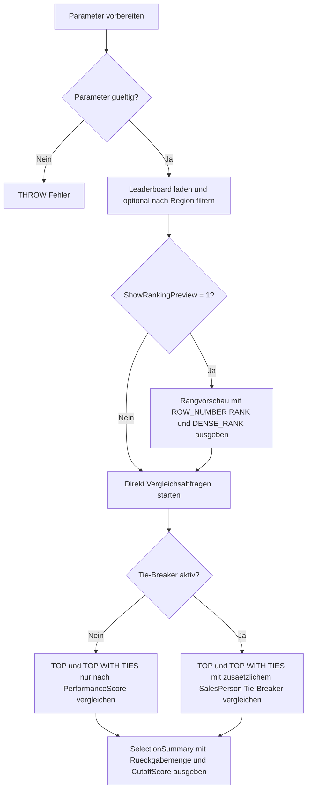

# TopWithTiesShowcase.sql

Dieses Lab zeigt auf einem kleinen Leaderboard, wie `TOP` und `TOP WITH TIES` an der Abschneidekante reagieren. Der Fokus liegt auf einer didaktischen Gegenueberstellung: einmal nur nach Score sortiert und optional mit einem zusaetzlichen eindeutigen Tie-Breaker.

## Uebersicht

<!-- SQLDOC:SUMMARY_TABLE:BEGIN -->
| Feld | Wert |
|---|---|
| Script | [TopWithTiesShowcase.sql](TopWithTiesShowcase.sql) |
| Version | `1.0` |
| Typ | `didactic-lab` |
| Kapitel | `02_Select` |
| Sicherheit | `read-only` |
| Zweck | Zeigt an einem Leaderboard-Datensatz das Verhalten von `TOP` und `TOP WITH TIES` bei Gleichstaenden an der Abschneidekante. |
<!-- SQLDOC:SUMMARY_TABLE:END -->

## Einordnung

Im Kapitel `02_Select` ist `TOP WITH TIES` oft der erste Moment, in dem eine Abfrage bewusst mehr Zeilen als erwartet zurueckgibt. Das Skript macht sichtbar, dass nicht nur die Zahl hinter `TOP`, sondern vor allem die verwendete `ORDER BY`-Logik darueber entscheidet, welche Zeilen auf derselben Rangstufe liegen.

## Annahmen

- Das Lab verwendet nur eingebettete Demo-Daten und keine produktiven Tabellen.
- Der Score `91` ist absichtlich dreifach vergeben, damit bei `@TopCount = 3` ein Gleichstand genau an der Abschneidekante entsteht.
- `@IncludeDeterministicTieBreaker = 1` nutzt `SalesPerson` als zweite Sortierspalte und macht damit die Reihenfolge eindeutig.
- Die Rangvorschau mit `ROW_NUMBER`, `RANK` und `DENSE_RANK` dient nur der Einordnung und ist nicht die eigentliche `TOP WITH TIES`-Mechanik.

## Anwendungsfall

Das Skript eignet sich fuer Unterricht, Reviews oder Selbststudium, wenn der Unterschied zwischen "genau n Zeilen" und "alle Zeilen auf derselben Rangstufe" nachvollziehbar demonstriert werden soll. Besonders hilfreich ist der direkte Vergleich zwischen einer nicht eindeutigen und einer eindeutigen Sortierung.

## Parameter

<!-- SQLDOC:PARAMETERS_TABLE:BEGIN -->
| Parameter | SQL-Typ | Pflicht | Beschreibung |
|---|---|---|---|
| `@TopCount` | `INT` | Nein | Anzahl der vorderen Positionen, die verglichen werden sollen. |
| `@RegionFilter` | `NVARCHAR(20)` | Nein | Optionaler Filter auf eine Region. |
| `@IncludeDeterministicTieBreaker` | `BIT` | Nein | Verwendet bei `1` `SalesPerson` als zusaetzlichen Tie-Breaker im `ORDER BY`. |
| `@ShowRankingPreview` | `BIT` | Nein | Zeigt bei `1` die komplette Rangvorschau vor den `TOP`-Abfragen an. |
<!-- SQLDOC:PARAMETERS_TABLE:END -->

## Abhaengigkeiten

<!-- SQLDOC:DEPENDENCIES_LIST:BEGIN -->
- `Table variable`
- `CTE`
- `TOP`
- `TOP WITH TIES`
- `ROW_NUMBER`
- `RANK`
- `DENSE_RANK`
- `CASE`
- `STRING_AGG`
<!-- SQLDOC:DEPENDENCIES_LIST:END -->

## Hinweise

- Ohne weiteren Tie-Breaker vergroessert `TOP WITH TIES` die Rueckgabemenge, wenn der letzte ausgewaehlte Score mehrfach vorkommt.
- Mit einem zusaetzlichen eindeutigen `ORDER BY` auf `SalesPerson` werden dieselben Scores zwar weiterhin sichtbar, aber nicht mehr als gleichrangige Ties behandelt.
- `RankingPreview` zeigt bewusst sowohl `ROW_NUMBER` als auch `RANK` und `DENSE_RANK`, damit der Unterschied zwischen eindeutiger Zeilenreihenfolge und echter Ranggleichheit klar wird.
- `SelectionSummary` verdichtet pro Auswahlvariante die Rueckgabemenge und die Score-Grenze.

## Versionshistorie

<!-- SQLDOC:VERSION_HISTORY_TABLE:BEGIN -->
| Version | Datum | User | Beschreibung |
|---|---|---|---|
| `1.0` | `2026-04-17` | `ER` | Erstversion des Labs fuer `TOP WITH TIES` und Gleichstaende an der Abschneidekante |
<!-- SQLDOC:VERSION_HISTORY_TABLE:END -->

## Ablauf

<!-- SQLDOC:MERMAID:BEGIN -->

<!-- SQLDOC:MERMAID:END -->

## SQL-Code

<!-- SQLDOC:SQL_CODE:BEGIN -->
```sql
/*
BEGIN:SQL-HEADER v1
---
sql_header: v1
script_name: "TopWithTiesShowcase.sql"
script_version: "1.0"
script_type: "didactic-lab"
chapter: "02_Select"

purpose: >
  Zeigt an einem kleinen Leaderboard-Datensatz, wie sich TOP und TOP WITH TIES
  an der Abschneidekante verhalten und warum ein zusaetzlicher Tie-Breaker das
  Ergebnis veraendert.

parameters:
  - name: "@TopCount"
    sql_type: "INT"
    direction: "IN"
    required: false
    description: "Anzahl der vorderen Positionen, die verglichen werden sollen"
  - name: "@RegionFilter"
    sql_type: "NVARCHAR(20)"
    direction: "IN"
    required: false
    description: "Optionaler Filter auf eine Region"
  - name: "@IncludeDeterministicTieBreaker"
    sql_type: "BIT"
    direction: "IN"
    required: false
    description: "1 = SalesPerson als zusaetzlichen ORDER BY Tie-Breaker verwenden, 0 = nur nach Score sortieren"
  - name: "@ShowRankingPreview"
    sql_type: "BIT"
    direction: "IN"
    required: false
    description: "1 = vollstaendige Rangvorschau vor den TOP-Abfragen anzeigen"

result_sets:
  - name: "RankingPreview"
    description: "Optionale Gesamtansicht mit ROW_NUMBER, RANK und DENSE_RANK fuer den Demo-Datensatz"
  - name: "TopSelectionComparison"
    description: "Vergleicht TOP und TOP WITH TIES fuer dieselbe Sortierlogik"
  - name: "SelectionSummary"
    description: "Verdichtet die Anzahl Zeilen und die Abschneidekante pro Auswahlvariante"

dependencies:
  - "Table variable"
  - "CTE"
  - "TOP"
  - "TOP WITH TIES"
  - "ROW_NUMBER"
  - "RANK"
  - "DENSE_RANK"
  - "CASE"
  - "STRING_AGG"

safety:
  level: "read-only"
  writes_data: false

documentation:
  markdown_file: "T-SQL/02_Select/SQLScripts/TopWithTiesShowcase.md"
  sync_blocks:
    - "SUMMARY_TABLE"
    - "PARAMETERS_TABLE"
    - "DEPENDENCIES_LIST"
    - "VERSION_HISTORY_TABLE"
    - "SQL_CODE"
  mermaid:
    mode: "ai-agent-from-sql"
    source: "script-body"

main_responsible:
  name: "Erhard Rainer"
  initials: "ER"

version_history:
  - version: "1.0"
    date: "2026-04-17"
    user: "ER"
    description: "Erstversion des Labs fuer TOP WITH TIES und Gleichstaende an der Abschneidekante"

notes:
  - "Das Lab nutzt nur eingebettete Demo-Daten und keine produktiven Tabellen."
  - "WITH TIES erweitert das Ergebnis nur fuer Werte, die im ORDER BY ohne weiteren eindeutigen Tie-Breaker gleich liegen."
---
END:SQL-HEADER v1
*/

SET NOCOUNT ON;

DECLARE @TopCount INT = 3;
DECLARE @RegionFilter NVARCHAR(20) = NULL;
DECLARE @IncludeDeterministicTieBreaker BIT = 0;
DECLARE @ShowRankingPreview BIT = 1;

DECLARE @Leaderboard TABLE
(
    SalesPerson NVARCHAR(50) NOT NULL,
    RegionCode NVARCHAR(20) NOT NULL,
    DealCount INT NOT NULL,
    WinRatePercent DECIMAL(5,2) NOT NULL,
    PerformanceScore INT NOT NULL,
    LastDealDate DATE NOT NULL
);

SET @RegionFilter = NULLIF(LTRIM(RTRIM(@RegionFilter)), N'');

IF @TopCount < 1
BEGIN
    THROW 50000, '@TopCount muss groesser oder gleich 1 sein.', 1;
END;

IF @IncludeDeterministicTieBreaker NOT IN (0, 1)
BEGIN
    THROW 50001, '@IncludeDeterministicTieBreaker muss 0 oder 1 sein.', 1;
END;

IF @ShowRankingPreview NOT IN (0, 1)
BEGIN
    THROW 50002, '@ShowRankingPreview muss 0 oder 1 sein.', 1;
END;

INSERT INTO @Leaderboard
(
    SalesPerson,
    RegionCode,
    DealCount,
    WinRatePercent,
    PerformanceScore,
    LastDealDate
)
VALUES
    ('Anika', 'DE-NORTH', 11, CAST(74.0 AS DECIMAL(5,2)), 97, CAST('2026-04-14' AS DATE)),
    ('Bora', 'AT-WEST', 10, CAST(71.0 AS DECIMAL(5,2)), 93, CAST('2026-04-12' AS DATE)),
    ('Cem', 'CH-CENTRAL', 9, CAST(68.0 AS DECIMAL(5,2)), 91, CAST('2026-04-13' AS DATE)),
    ('Dina', 'DE-SOUTH', 8, CAST(67.0 AS DECIMAL(5,2)), 91, CAST('2026-04-11' AS DATE)),
    ('Emir', 'DE-NORTH', 7, CAST(64.0 AS DECIMAL(5,2)), 91, CAST('2026-04-10' AS DATE)),
    ('Fina', 'AT-WEST', 7, CAST(62.0 AS DECIMAL(5,2)), 88, CAST('2026-04-09' AS DATE)),
    ('Gero', 'DE-SOUTH', 6, CAST(58.0 AS DECIMAL(5,2)), 84, CAST('2026-04-08' AS DATE)),
    ('Hana', 'CH-CENTRAL', 5, CAST(57.0 AS DECIMAL(5,2)), 84, CAST('2026-04-07' AS DATE));

IF @ShowRankingPreview = 1
BEGIN
    ;WITH FilteredRows AS
    (
        SELECT
            l.SalesPerson,
            l.RegionCode,
            l.DealCount,
            l.WinRatePercent,
            l.PerformanceScore,
            l.LastDealDate,
            CASE
                WHEN l.PerformanceScore >= 95 THEN 'elite'
                WHEN l.PerformanceScore >= 90 THEN 'tie-zone'
                WHEN l.PerformanceScore >= 85 THEN 'solid'
                ELSE 'build-up'
            END AS ScoreBand
        FROM @Leaderboard AS l
        WHERE @RegionFilter IS NULL
           OR l.RegionCode = @RegionFilter
    ),
    RankingPreview AS
    (
        SELECT
            f.SalesPerson,
            f.RegionCode,
            f.DealCount,
            f.WinRatePercent,
            f.PerformanceScore,
            f.LastDealDate,
            f.ScoreBand,
            ROW_NUMBER() OVER (ORDER BY f.PerformanceScore DESC, f.SalesPerson ASC) AS RowNumberByScore,
            RANK() OVER (ORDER BY f.PerformanceScore DESC) AS RankByScore,
            DENSE_RANK() OVER (ORDER BY f.PerformanceScore DESC) AS DenseRankByScore
        FROM FilteredRows AS f
    )
    SELECT
        @TopCount AS AppliedTopCount,
        @RegionFilter AS AppliedRegionFilter,
        @IncludeDeterministicTieBreaker AS AppliedTieBreaker,
        rp.SalesPerson,
        rp.RegionCode,
        rp.DealCount,
        rp.WinRatePercent,
        rp.PerformanceScore,
        rp.LastDealDate,
        rp.ScoreBand,
        rp.RowNumberByScore,
        rp.RankByScore,
        rp.DenseRankByScore,
        CASE
            WHEN rp.RankByScore < @TopCount THEN 'above-cutoff'
            WHEN rp.RankByScore = @TopCount THEN 'cutoff-tie'
            ELSE 'below-cutoff'
        END AS CutoffRole
    FROM RankingPreview AS rp
    ORDER BY
        rp.RowNumberByScore;
END;

IF @IncludeDeterministicTieBreaker = 1
BEGIN
    ;WITH FilteredRows AS
    (
        SELECT
            l.SalesPerson,
            l.RegionCode,
            l.DealCount,
            l.WinRatePercent,
            l.PerformanceScore,
            l.LastDealDate
        FROM @Leaderboard AS l
        WHERE @RegionFilter IS NULL
           OR l.RegionCode = @RegionFilter
    ),
    ComparisonRows AS
    (
        SELECT
            'TOP' AS SelectionVariant,
            s.SalesPerson,
            s.RegionCode,
            s.DealCount,
            s.WinRatePercent,
            s.PerformanceScore,
            s.LastDealDate
        FROM
        (
            SELECT TOP (@TopCount)
                f.SalesPerson,
                f.RegionCode,
                f.DealCount,
                f.WinRatePercent,
                f.PerformanceScore,
                f.LastDealDate
            FROM FilteredRows AS f
            ORDER BY f.PerformanceScore DESC, f.SalesPerson ASC
        ) AS s
        UNION ALL
        SELECT
            'TOP WITH TIES' AS SelectionVariant,
            s.SalesPerson,
            s.RegionCode,
            s.DealCount,
            s.WinRatePercent,
            s.PerformanceScore,
            s.LastDealDate
        FROM
        (
            SELECT TOP (@TopCount) WITH TIES
                f.SalesPerson,
                f.RegionCode,
                f.DealCount,
                f.WinRatePercent,
                f.PerformanceScore,
                f.LastDealDate
            FROM FilteredRows AS f
            ORDER BY f.PerformanceScore DESC, f.SalesPerson ASC
        ) AS s
    )
    SELECT
        @TopCount AS AppliedTopCount,
        @RegionFilter AS AppliedRegionFilter,
        CAST(1 AS BIT) AS AppliedTieBreaker,
        cr.SelectionVariant,
        cr.SalesPerson,
        cr.RegionCode,
        cr.DealCount,
        cr.WinRatePercent,
        cr.PerformanceScore,
        cr.LastDealDate,
        'ORDER BY PerformanceScore DESC, SalesPerson ASC' AS OrderByPattern,
        'SalesPerson macht die Sortierung eindeutig; WITH TIES vergroessert das Ergebnis hier nicht.' AS TeachingNote
    FROM ComparisonRows AS cr
    ORDER BY
        cr.SelectionVariant,
        cr.PerformanceScore DESC,
        cr.SalesPerson ASC;

    ;WITH FilteredRows AS
    (
        SELECT
            l.SalesPerson,
            l.RegionCode,
            l.PerformanceScore
        FROM @Leaderboard AS l
        WHERE @RegionFilter IS NULL
           OR l.RegionCode = @RegionFilter
    ),
    ComparisonRows AS
    (
        SELECT 'TOP' AS SelectionVariant, s.SalesPerson, s.PerformanceScore
        FROM
        (
            SELECT TOP (@TopCount) f.SalesPerson, f.PerformanceScore
            FROM FilteredRows AS f
            ORDER BY f.PerformanceScore DESC, f.SalesPerson ASC
        ) AS s
        UNION ALL
        SELECT 'TOP WITH TIES' AS SelectionVariant, s.SalesPerson, s.PerformanceScore
        FROM
        (
            SELECT TOP (@TopCount) WITH TIES f.SalesPerson, f.PerformanceScore
            FROM FilteredRows AS f
            ORDER BY f.PerformanceScore DESC, f.SalesPerson ASC
        ) AS s
    )
    SELECT
        cr.SelectionVariant,
        COUNT(*) AS ReturnedRowCount,
        MIN(cr.PerformanceScore) AS CutoffScore,
        MAX(cr.PerformanceScore) AS HighestScore,
        STRING_AGG(cr.SalesPerson, ', ') WITHIN GROUP (ORDER BY cr.PerformanceScore DESC, cr.SalesPerson ASC) AS SelectedPeople
    FROM ComparisonRows AS cr
    GROUP BY cr.SelectionVariant
    ORDER BY cr.SelectionVariant;
END;
ELSE
BEGIN
    ;WITH FilteredRows AS
    (
        SELECT
            l.SalesPerson,
            l.RegionCode,
            l.DealCount,
            l.WinRatePercent,
            l.PerformanceScore,
            l.LastDealDate
        FROM @Leaderboard AS l
        WHERE @RegionFilter IS NULL
           OR l.RegionCode = @RegionFilter
    ),
    ComparisonRows AS
    (
        SELECT
            'TOP' AS SelectionVariant,
            s.SalesPerson,
            s.RegionCode,
            s.DealCount,
            s.WinRatePercent,
            s.PerformanceScore,
            s.LastDealDate
        FROM
        (
            SELECT TOP (@TopCount)
                f.SalesPerson,
                f.RegionCode,
                f.DealCount,
                f.WinRatePercent,
                f.PerformanceScore,
                f.LastDealDate
            FROM FilteredRows AS f
            ORDER BY f.PerformanceScore DESC
        ) AS s
        UNION ALL
        SELECT
            'TOP WITH TIES' AS SelectionVariant,
            s.SalesPerson,
            s.RegionCode,
            s.DealCount,
            s.WinRatePercent,
            s.PerformanceScore,
            s.LastDealDate
        FROM
        (
            SELECT TOP (@TopCount) WITH TIES
                f.SalesPerson,
                f.RegionCode,
                f.DealCount,
                f.WinRatePercent,
                f.PerformanceScore,
                f.LastDealDate
            FROM FilteredRows AS f
            ORDER BY f.PerformanceScore DESC
        ) AS s
    )
    SELECT
        @TopCount AS AppliedTopCount,
        @RegionFilter AS AppliedRegionFilter,
        CAST(0 AS BIT) AS AppliedTieBreaker,
        cr.SelectionVariant,
        cr.SalesPerson,
        cr.RegionCode,
        cr.DealCount,
        cr.WinRatePercent,
        cr.PerformanceScore,
        cr.LastDealDate,
        'ORDER BY PerformanceScore DESC' AS OrderByPattern,
        'Gleiche Score-Werte an der Abschneidekante vergroessern bei WITH TIES die Rueckgabemenge.' AS TeachingNote
    FROM ComparisonRows AS cr
    ORDER BY
        cr.SelectionVariant,
        cr.PerformanceScore DESC,
        cr.SalesPerson ASC;

    ;WITH FilteredRows AS
    (
        SELECT
            l.SalesPerson,
            l.RegionCode,
            l.PerformanceScore
        FROM @Leaderboard AS l
        WHERE @RegionFilter IS NULL
           OR l.RegionCode = @RegionFilter
    ),
    ComparisonRows AS
    (
        SELECT 'TOP' AS SelectionVariant, s.SalesPerson, s.PerformanceScore
        FROM
        (
            SELECT TOP (@TopCount) f.SalesPerson, f.PerformanceScore
            FROM FilteredRows AS f
            ORDER BY f.PerformanceScore DESC
        ) AS s
        UNION ALL
        SELECT 'TOP WITH TIES' AS SelectionVariant, s.SalesPerson, s.PerformanceScore
        FROM
        (
            SELECT TOP (@TopCount) WITH TIES f.SalesPerson, f.PerformanceScore
            FROM FilteredRows AS f
            ORDER BY f.PerformanceScore DESC
        ) AS s
    )
    SELECT
        cr.SelectionVariant,
        COUNT(*) AS ReturnedRowCount,
        MIN(cr.PerformanceScore) AS CutoffScore,
        MAX(cr.PerformanceScore) AS HighestScore,
        STRING_AGG(cr.SalesPerson, ', ') WITHIN GROUP (ORDER BY cr.PerformanceScore DESC, cr.SalesPerson ASC) AS SelectedPeople
    FROM ComparisonRows AS cr
    GROUP BY cr.SelectionVariant
    ORDER BY cr.SelectionVariant;
END;
```
<!-- SQLDOC:SQL_CODE:END -->