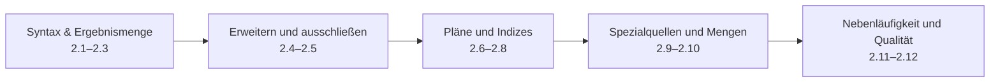
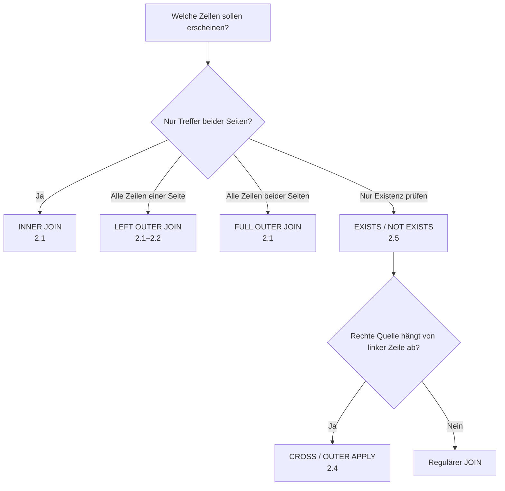
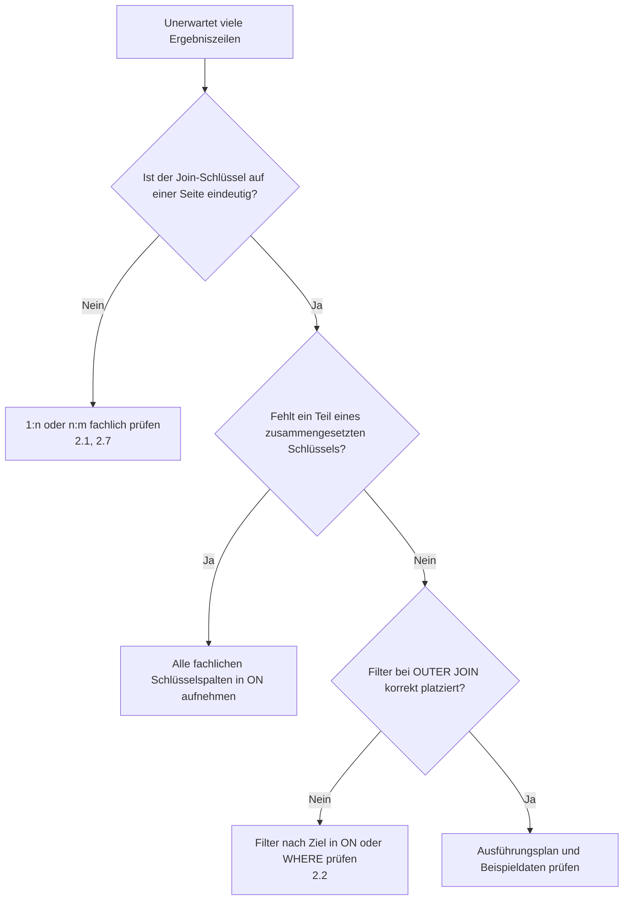

# T-SQL JOIN – Übersicht

*Tabellen sicher verknüpfen, Kardinalitäten verstehen und Join-Abfragen performant gestalten*

## Inhaltsverzeichnis

- [1 | Begriffsdefinition](#1--begriffsdefinition)
- [2 | Struktur](#2--struktur)
  - [2.0 | Lernpfad, Ressourcen und Entscheidungshilfen](#20--lernpfad-ressourcen-und-entscheidungshilfen)
  - [2.1 | Join-Grundlagen & Syntax](#21--join-grundlagen--syntax)
  - [2.2 | ON vs WHERE bei OUTER JOINs](#22--on-vs-where-bei-outer-joins)
  - [2.3 | Self-Join & Aliasierung](#23--self-join--aliasierung)
  - [2.4 | APPLY – Lateral Joins](#24--apply-crossouter--lateral-joins)
  - [2.5 | Semi-/Anti-Joins](#25--semi-anti-joins-exists-in-not-exists-except)
  - [2.6 | Physische Join-Algorithmen & Hints](#26--physische-join-algorithmen--hints)
  - [2.7 | Performance: Indizes, Kardinalität, IQP](#27--performance-indizes-kardinalität-iqp)
  - [2.8 | Collation & JOINs](#28--collation--joins-strings)
  - [2.9 | Joins mit JSON/XML/TVFs](#29--joins-mit-jsonxmltvfs)
  - [2.10 | Set-Operatoren vs JOIN](#210--set-operatoren-vs-join)
  - [2.11 | Transaktionen, Isolation & Sperren](#211--transaktionen-isolation--sperren-bei-joins)
  - [2.12 | Best Practices & Anti-Patterns](#212--best-practices--anti-patterns)
- [3 | Häufige Fehler & Merksätze](#3--häufige-fehler--merksätze)
- [4 | Weiterführende Informationen](#4--weiterführende-informationen)

## 1 | Begriffsdefinition

| SQL-Term | Beschreibung |
|---|---|
| JOIN (allgemein) | Verknüpft Zeilen aus zwei (oder mehr) Tabellen basierend auf einer Bedingung in der `ON`-Klausel. |
| INNER JOIN | Liefert nur übereinstimmende Zeilen beider Seiten. `INNER` kann weggelassen werden. |
| LEFT/RIGHT OUTER JOIN | Liefert alle Zeilen der linken/rechten Tabelle plus passende Zeilen der anderen Tabelle; fehlende Werte als `NULL`. |
| FULL OUTER JOIN | Liefert alle Zeilen beider Tabellen; bei fehlenden Matches `NULL`-Werte. |
| CROSS JOIN | Kartesisches Produkt beider Eingaben (jede Zeile links mit jeder Zeile rechts). |
| SELF JOIN | Eine Tabelle wird mit sich selbst verknüpft (erfordert Aliasse). |
| APPLY (CROSS/OUTER) | Lateral Join in T-SQL: führt eine TVF/abgeleitete Tabelle pro linker Zeile aus; `CROSS` wie `INNER`, `OUTER` wie `LEFT`. |
| ON-Klausel | Definiert die Join-Prädikate (Schlüssel/Spalten, ggf. mehrere Bedingungen). |
| WHERE-Klausel | Filtert **nach** dem Join; bei OUTER JOINs kann ein Filter in `WHERE` den OUTER-Effekt aufheben. |
| Join-Bedingung | Ausdrücke, die Zeilen matchen; ideal: Gleichheit auf Schlüsseln/indizierten Spalten. |
| Semi-Join / Anti-Join | Existenzprüfungen: `EXISTS/IN` (semi), `NOT EXISTS`/`EXCEPT` (anti); liefern nur Zeilen der linken Seite. |
| Join-Kardinalität | 1:1, 1:n, n:m; Joins können Duplikate erzeugen – ggf. mit Aggregaten/`DISTINCT` behandeln. |
| Join-Reihenfolge | Der Optimizer ordnet assoziativ/kommutativ um; kann mit Hinweisen beeinflusst werden. |
| Join-Algorithmen | Physische Operatoren: Nested Loops, Merge, Hash; Wahl basiert auf Kardinalität, Sortierung, Indizes. |
| Join-Hints | `LOOP`, `MERGE`, `HASH` auf Join-Ebene bzw. `OPTION(LOOP|MERGE|HASH JOIN)` global. Sparsam einsetzen. |
| SARGability | Funktionen/Konvertierungen auf Join-Spalten verhindern Index-Seeks → schlechtere Pläne. |
| Indizes & FK | Passende (komposite) Indizes/FKs verbessern Kostenmodell & Kardinalitätsschätzung. |
| Collation | Unterschiedliche Kollationen bei String-Joins führen zu Fehlern oder impliziten Konvertierungen (`COLLATE`). |
| OUTER-Null-Semantik | Bei OUTER JOINs sind Werte einer Seite ggf. `NULL`; Bedingungen entsprechend formulieren (`IS NULL`). |
| Set-Operatoren vs JOIN | `UNION/INTERSECT/EXCEPT` kombinieren vertikal; Joins kombinieren horizontal. |
| `rowversion`/`timestamp` | Binärer Zähler pro Zeile. Nützlich für Änderungsdetektion/optimistische Sperrung in Join-Szenarien. |

---

## 2 | Struktur

### 2.0 | Lernpfad, Ressourcen und Entscheidungshilfen

**Zielgruppe und Voraussetzungen:** Diese Übersicht setzt voraus, dass `SELECT`, `WHERE` und einfache Datentypen bekannt sind. Arbeite zuerst 2.1–2.3 durch, bevor du mit lateralem Zugriff, Existenzprüfungen und Ausführungsplänen fortfährst. Die Abschnitte 2.6–2.12 richten sich besonders an Leserinnen und Leser, die Abfragen in produktiven Systemen bewerten oder optimieren.

**Ressourcen richtig nutzen:** Starte pro Abschnitt mit Notebook und Video. Der erste Microsoft-Learn-Link ist der Referenzeinstieg, zusätzliche Docs sind die Vertiefung; Blogbeiträge ergänzen typische Praxismuster und Performance-Fallen.

**Verwandte Kapitel im Repository:** [SELECT](../02_Select/02_Select.md) erklärt Projektion, Filter und Fensterfunktionen; [Normalformen](../01_Normalformen/README.md) liefert die Grundlage für Join-Schlüssel; [CTEs und Unterabfragen](../61_SubQuery_CTE_TMP/61_SubQuery_CTE_TMP.md) vertieft Teilergebnisse; [Transaktionen](../19_Transaktions/19_Transactions.md) ergänzt die Isolationsthemen.

**Blog-Praxis nach Thema:** [Join-Grundlagen und Pläne – SQLPerformance](https://www.sqlperformance.com/tag/joins) · [ON vs. WHERE – SQLServerCentral](https://www.sqlservercentral.com/articles/outer-joins-and-where-clauses) · [Self-Joins – SQLServerTutorial](https://www.sqlservertutorial.net/sql-server-basics/sql-server-self-join/) · [APPLY für Berechnungen – Kendra Little](https://kendralittle.com/2011/03/29/crossapplycolumn/) · [`NOT EXISTS` und Alternativen – SQLPerformance](https://sqlperformance.com/2012/12/t-sql-queries/left-anti-semi-join) · [Join-Hints und Pläne – SQLPerformance](https://www.sqlperformance.com/tag/paul-white) · [Index- und Abfrageleistung – Brent Ozar](https://www.brentozar.com/archive/category/performance-tuning/) · [Kollationen – SQLShack](https://www.sqlshack.com/sql-server-collation-introduction-with-collate-sql-casting/) · [JSON mit APPLY – Redgate Simple Talk](https://www.red-gate.com/simple-talk/databases/sql-server/t-sql-programming-sql-server/working-with-json-in-sql-server/) · [Set-Operatoren – SQLShack](https://www.sqlshack.com/sql-union-overview-usage-and-examples/) · [Isolation – Brent Ozar](https://www.brentozar.com/archive/2021/08/why-nolock-is-bad-and-you-probably-shouldnt-use-it/) · [Join-Anti-Patterns – Erik Darling](https://www.erikdarlingdata.com/).

#### Schnellauswahl: Welcher Join passt?

#### Schnellauswahl: Warum vervielfacht sich das Resultset?

#### Mini-Beispiele zu allen Unterkapiteln

| Kapitel | Minimaler Einstieg |
|---|---|
| 2.1 | `SELECT * FROM dbo.Customer AS c INNER JOIN dbo.OrderHeader AS o ON o.CustomerId = c.CustomerId;` |
| 2.2 | `SELECT * FROM dbo.Customer AS c LEFT JOIN dbo.OrderHeader AS o ON o.CustomerId = c.CustomerId AND o.Status = 'Open';` |
| 2.3 | `SELECT e.Name, m.Name FROM dbo.Employee AS e LEFT JOIN dbo.Employee AS m ON m.EmployeeId = e.ManagerId;` |
| 2.4 | `SELECT * FROM dbo.Customer AS c CROSS APPLY (SELECT TOP (1) * FROM dbo.OrderHeader AS o WHERE o.CustomerId = c.CustomerId ORDER BY o.OrderDate DESC) AS x;` |
| 2.5 | `SELECT * FROM dbo.Customer AS c WHERE EXISTS (SELECT 1 FROM dbo.OrderHeader AS o WHERE o.CustomerId = c.CustomerId);` |
| 2.6 | `SELECT * FROM dbo.A AS a HASH JOIN dbo.B AS b ON b.Id = a.Id;` |
| 2.7 | `CREATE INDEX IX_Order_CustomerId ON dbo.OrderHeader(CustomerId);` |
| 2.8 | `SELECT * FROM #Import AS i JOIN dbo.Customer AS c ON c.Name COLLATE DATABASE_DEFAULT = i.Name;` |
| 2.9 | `SELECT * FROM dbo.Event AS e CROSS APPLY OPENJSON(e.Payload) AS j;` |
| 2.10 | `SELECT CustomerId FROM dbo.A EXCEPT SELECT CustomerId FROM dbo.B;` |
| 2.11 | `SET TRANSACTION ISOLATION LEVEL READ COMMITTED;` |
| 2.12 | `SELECT * FROM dbo.A AS a JOIN dbo.B AS b ON b.Id = a.Id;` |

### 2.1 | Join-Grundlagen & Syntax
> **Kurzbeschreibung:** Überblick über `FROM … JOIN … ON …`, INNER/OUTER/CROSS, Aliasse und die logische Lesereihenfolge der Abfrage.

> **Ausführliche Beschreibung:** Ein Join kombiniert Zeilen aus zwei Quellen über eine fachliche Beziehung. `INNER JOIN` liefert nur Treffer, `LEFT OUTER JOIN` erhält alle Zeilen der linken Quelle und `CROSS JOIN` bildet jede mögliche Kombination. Formuliere die Beziehung in `ON` und nutze kurze, eindeutige Aliasse, damit Herkunft und Kardinalität jeder Spalte sichtbar bleiben. Die Zahl der Ergebniszeilen folgt immer dem Datenmodell und der Join-Bedingung, nicht der Reihenfolge der Tabellen im Text.

- 📓 **Notebook:**  
  - [`08_01_join_grundlagen.ipynb`](08_01_join_grundlagen.ipynb)

- 🎥 **YouTube:**  
  - [SQL Server Joins Tutorial (Grundlagen)](https://www.youtube.com/watch?v=iwP_adDNUPQ)  
  - [Combining multiple tables with JOINs in T-SQL (MS Learn Video)](https://www.youtube.com/watch?v=oKgFNNadCNY)

- 📘 **Docs:**  
  - [FROM + JOIN (Transact-SQL)](https://learn.microsoft.com/en-us/sql/t-sql/queries/from-transact-sql?view=sql-server-ver17)  
  - [Joins (SQL Server) – Grundlagen](https://learn.microsoft.com/en-us/sql/relational-databases/performance/joins?view=sql-server-ver17)

---

### 2.2 | ON vs WHERE bei OUTER JOINs
> **Kurzbeschreibung:** Warum Filter in `WHERE` nach dem Join wirken und einen LEFT OUTER faktisch zum INNER machen können; korrekte Platzierung von Filtern.

> **Ausführliche Beschreibung:** Bei einem OUTER JOIN entscheidet `ON`, welche rechte Zeile zugeordnet wird; `WHERE` filtert anschließend das entstandene Resultset. Ein Prädikat wie `WHERE r.Status = 'Open'` entfernt daher auch alle linken Zeilen ohne rechte Zuordnung, weil dort `r.Status` `NULL` ist. Soll die linke Zeile erhalten bleiben, gehört ein Filter auf die rechte Quelle meist in `ON`. Prüfe dieses Verhalten immer mit Beispieldaten inklusive fehlender Treffer.

- 📓 **Notebook:**  
  - [`08_02_outer_join_on_vs_where.ipynb`](08_02_outer_join_on_vs_where.ipynb)

- 🎥 **YouTube:**  
  - [LEFT OUTER JOIN mit Ausschlüssen](https://www.youtube.com/watch?v=RFPT4aCQaSA)  
  - [SQL Joins anschaulich erklärt](https://www.youtube.com/watch?v=Yh4CrPHVBdE)

- 📘 **Docs:**  
  - [FROM + JOIN – Logik & Beispiele](https://learn.microsoft.com/en-us/sql/t-sql/queries/from-transact-sql?view=sql-server-ver17)  
  - [Query Processing Architecture (logische Verarbeitung)](https://learn.microsoft.com/en-us/sql/relational-databases/query-processing-architecture-guide?view=sql-server-ver17)

---

### 2.3 | Self-Join & Aliasierung
> **Kurzbeschreibung:** Selbstverknüpfungen für Hierarchien/Beziehungen; saubere Aliasse und mehrfache Joins derselben Tabelle.

> **Ausführliche Beschreibung:** Beim Self-Join tritt dieselbe Tabelle in unterschiedlichen Rollen auf, etwa als Mitarbeitende und Führungskraft oder als Vorgänger und Nachfolger. Aliasse sind dabei keine kosmetische Hilfe, sondern machen die zwei Instanzen eindeutig. Für optionale Beziehungen ist meist ein `LEFT JOIN` nötig, damit Wurzelknoten oder Zeilen ohne Referenz erhalten bleiben. Bei tiefen Hierarchien ergänzt ein rekursiver CTE den einfachen Self-Join.

- 📓 **Notebook:**  
  - [`08_03_self_join_aliases.ipynb`](08_03_self_join_aliases.ipynb)

- 🎥 **YouTube:**  
  - [SQL Server Joins (Beispiele)](https://www.youtube.com/watch?v=duAkYyKMgfE)  
  - [SQL Joins Tutorial (Einsteiger)](https://www.youtube.com/watch?v=0OQJDd3QqQM)

- 📘 **Docs:**  
  - [FROM + JOIN (Self-Join Hinweise)](https://learn.microsoft.com/en-us/sql/t-sql/queries/from-transact-sql?view=sql-server-ver17)  
  - [Showplan Operator Reference (Pläne lesen)](https://learn.microsoft.com/en-us/sql/relational-databases/showplan-logical-and-physical-operators-reference?view=sql-server-ver17)

---

### 2.4 | APPLY (CROSS/OUTER) – Lateral Joins
> **Kurzbeschreibung:** Zeilenweise Auswertung mit TVFs/abgeleiteten Tabellen; Muster wie JSON/XML-Parsing, Top-N-pro-Gruppe, „per row Top 1“.

> **Ausführliche Beschreibung:** `APPLY` wertet die rechte Tabellenquelle für jede Zeile der linken Quelle aus. `CROSS APPLY` verhält sich dabei wie ein INNER JOIN und verwirft Zeilen ohne Ergebnis; `OUTER APPLY` erhält diese Zeilen wie ein LEFT JOIN. Das Muster eignet sich für Tabellenwertfunktionen, `OPENJSON`, XML-`nodes()` und gezielte Top-N-Abfragen je Gruppe. Da die rechte Seite korreliert sein kann, sind passende Indizes und eine begrenzte Ergebnismenge besonders wichtig.

- 📓 **Notebook:**  
  - [`08_04_apply_lateral_joins.ipynb`](08_04_apply_lateral_joins.ipynb)

- 🎥 **YouTube:**  
  - [Itzik Ben-Gan – Creative Uses of APPLY](https://www.youtube.com/watch?v=-m426WYclz8)  
  - [Boost Your T-SQL with APPLY](https://www.youtube.com/watch?v=VMH2y_3XBa0)

- 📘 **Docs:**  
  - [APPLY (Transact-SQL)](https://learn.microsoft.com/en-us/sql/t-sql/queries/from-transact-sql?view=sql-server-ver17)  
  - [XML `nodes()` + `CROSS APPLY`](https://learn.microsoft.com/en-us/sql/t-sql/xml/nodes-method-xml-data-type?view=sql-server-ver17)

---

### 2.5 | Semi-/Anti-Joins: EXISTS, IN, NOT EXISTS, EXCEPT
> **Kurzbeschreibung:** Effiziente Existenzprüfungen/Ausschlüsse ohne Duplikatsvervielfältigung; typische Fehlerbilder und Performance.

> **Ausführliche Beschreibung:** Semi-Joins beantworten nur die Frage, ob ein passender Datensatz existiert, und geben deshalb ausschließlich Spalten der linken Seite zurück. `EXISTS` verhindert damit die Vervielfältigung, die ein regulärer Join bei mehreren Treffern erzeugen würde; `NOT EXISTS` bildet den robusten Anti-Join. `IN` und `EXCEPT` sind mögliche Alternativen, unterscheiden sich aber bei Duplikaten und `NULL`. Verwende für Ausschlüsse bei potenziellen `NULL`-Werten bevorzugt `NOT EXISTS` statt `NOT IN`.

- 📓 **Notebook:**  
  - [`08_05_semi_anti_joins.ipynb`](08_05_semi_anti_joins.ipynb)

- 🎥 **YouTube:**  
  - [Joins vs EXISTS – Set-basiertes Denken](https://www.youtube.com/watch?v=LFqbtk-Mi-M)  
  - [Join-Methoden kompakt](https://www.youtube.com/watch?v=MFazkaZKs1s)

- 📘 **Docs:**  
  - [`EXISTS` (Transact-SQL)](https://learn.microsoft.com/en-us/sql/t-sql/language-elements/exists-transact-sql?view=sql-server-ver17)  
  - [`EXCEPT`/`INTERSECT`](https://learn.microsoft.com/en-us/sql/t-sql/language-elements/set-operators-except-and-intersect-transact-sql?view=sql-server-ver17)

---

### 2.6 | Physische Join-Algorithmen & Hints
> **Kurzbeschreibung:** Nested Loops, Merge, Hash – wann welcher Operator; gezielte Nutzung von Join-/Query-Hints und Risiken.

> **Ausführliche Beschreibung:** Der Optimizer wählt den physischen Join-Algorithmus anhand geschätzter Zeilenzahlen, Indizes und Sortierung. Nested Loops passt oft zu einer kleinen äußeren Eingabe mit schnellen Seeks, Merge Join zu bereits sortierten Quellen und Hash Join zu größeren, unsortierten Mengen. Ein Hint kann kurzfristig einen bekannten Planfehler umgehen, bindet die Abfrage aber an heutige Datenverteilung und Indizes. Analysiere daher zuerst Schätzfehler, Statistiken und Indizes, bevor du einen Join-Hint erzwingst.

- 📓 **Notebook:**  
  - [`08_06_join_algorithmen_hints.ipynb`](08_06_join_algorithmen_hints.ipynb)

- 🎥 **YouTube:**  
  - [How do Nested Loop, Hash & Merge Joins work?](https://www.youtube.com/watch?v=pJWCwfv983Q)  
  - [Merge Join Internals](https://www.youtube.com/watch?v=IFUB8iw46RI)

- 📘 **Docs:**  
  - [Join Hints (Join-Ebene)](https://learn.microsoft.com/en-us/sql/t-sql/queries/hints-transact-sql-join?view=sql-server-ver17)  
  - [Query Hints `OPTION(... JOIN)`](https://learn.microsoft.com/en-us/sql/t-sql/queries/hints-transact-sql-query?view=sql-server-ver17)

---

### 2.7 | Performance: Indizes, Kardinalität, IQP
> **Kurzbeschreibung:** SARGability, passende (komposite) Indizes, Kardinalitätsschätzung & Intelligent Query Processing; typische Fallstricke.

> **Ausführliche Beschreibung:** Join-Performance hängt wesentlich von korrekten Kardinalitätsschätzungen und Zugriffspfaden ab. Indizes sollten die Join-Schlüssel – bei Bedarf zusammen mit selektiven Filtern – in der tatsächlich verwendeten Reihenfolge abdecken. Funktionen, Berechnungen oder implizite Konvertierungen auf Join-Spalten verhindern oft effiziente Seeks. Stimmen geschätzte und tatsächliche Zeilen im Ausführungsplan nicht überein, sind Statistiken, Datenverteilung, fehlende Prädikate und Parameterwerte die ersten Prüfpunkte.

- 📓 **Notebook:**  
  - [`08_07_performance_indexes_ce.ipynb`](08_07_performance_indexes_ce.ipynb)

- 🎥 **YouTube:**  
  - [How to Think Like the SQL Server Engine](https://www.youtube.com/watch?v=SMw2knRuIlE)  
  - [Watch Brent Tune Queries](https://www.youtube.com/watch?v=IVqvwNlwXuI)

- 📘 **Docs:**  
  - [Query Processing Architecture Guide](https://learn.microsoft.com/en-us/sql/relational-databases/query-processing-architecture-guide?view=sql-server-ver17)  
  - [IQP & CE-Feedback](https://learn.microsoft.com/en-us/sql/relational-databases/performance/intelligent-query-processing-cardinality-estimation-feedback?view=sql-server-ver17)

---

### 2.8 | Collation & JOINs (Strings)
> **Kurzbeschreibung:** Kollationskonflikte in String-Joins erkennen/beheben (`COLLATE`, `DATABASE_DEFAULT`, tempdb-Fallen).

> **Ausführliche Beschreibung:** String-Spalten können nur direkt verglichen werden, wenn ihre Kollationen kompatibel sind. Konflikte treten häufig zwischen Benutzer- und temporären Tabellen auf, weil `tempdb` eine andere Serverkollation haben kann. `COLLATE DATABASE_DEFAULT` ist für temporäre Strukturen oft eine bewusste Angleichung; ein `COLLATE` direkt im Join kann jedoch Indexnutzung erschweren. Lege die Kollationsstrategie möglichst im Schema fest und betrachte eine Abfragekonvertierung als gezielte Ausnahme.

- 📓 **Notebook:**  
  - [`08_08_collation_in_joins.ipynb`](08_08_collation_in_joins.ipynb)

- 🎥 **YouTube:**  
  - [Joins & Text – typische Fehler (Allgemein)](https://www.youtube.com/watch?v=xGuAAp4J3UE)  
  - [Joins Tutorial (Joey Blue)](https://www.youtube.com/%40joeyblue1)

- 📘 **Docs:**  
  - [Collation Precedence](https://learn.microsoft.com/en-us/sql/t-sql/statements/collation-precedence-transact-sql?view=sql-server-ver17)  
  - [`COLLATE` / Collation & Unicode Support](https://learn.microsoft.com/en-us/sql/relational-databases/collations/collation-and-unicode-support?view=sql-server-ver17)

---

### 2.9 | Joins mit JSON/XML/TVFs
> **Kurzbeschreibung:** Typische Muster mit `CROSS APPLY OPENJSON`, `CROSS APPLY … nodes()` und Table-Valued Functions.

> **Ausführliche Beschreibung:** JSON, XML und Tabellenwertfunktionen liefern häufig pro Quellzeile eine variierende Anzahl von Detailzeilen. `CROSS APPLY` zerlegt diese Werte in relationale Spalten und verknüpft sie direkt mit dem Ursprung; mit `OUTER APPLY` bleiben auch Zeilen ohne Inhalt sichtbar. Definiere bei `OPENJSON` ein `WITH`-Schema, damit Pfade und Datentypen kontrollierbar bleiben. Für große Datenmengen sollten häufig abgefragte Werte möglichst relational modelliert oder gezielt indexierbar bereitgestellt werden.

- 📓 **Notebook:**  
  - [`08_09_apply_json_xml_tvf.ipynb`](08_09_apply_json_xml_tvf.ipynb)

- 🎥 **YouTube:**  
  - [cross apply – coole Tricks](https://www.youtube.com/watch?v=eVsG9oQsr-c)  
  - [APPLY Use-Cases (Itzik)](https://www.youtube.com/watch?v=goyWzAu-AA0)

- 📘 **Docs:**  
  - [`OPENJSON` + `CROSS APPLY`](https://learn.microsoft.com/en-us/sql/t-sql/functions/openjson-transact-sql?view=sql-server-ver17)  
  - [XML `nodes()`](https://learn.microsoft.com/en-us/sql/t-sql/xml/nodes-method-xml-data-type?view=sql-server-ver17)

---

### 2.10 | Set-Operatoren vs JOIN
> **Kurzbeschreibung:** Wann `UNION/UNION ALL/INTERSECT/EXCEPT` statt Join sinnvoll ist; kombinierte Strategien.

> **Ausführliche Beschreibung:** Joins erweitern Zeilen horizontal um Spalten anderer Quellen, Set-Operatoren kombinieren dagegen gleichartige Resultsets vertikal. `UNION ALL` hängt Mengen ohne Dublettenprüfung aneinander; `UNION`, `INTERSECT` und `EXCEPT` wenden Mengenlogik an und können Sortier- oder Hash-Aufwand verursachen. Für Existenz- oder Differenzfragen ist `EXCEPT` oft gut lesbar, bei benötigten Zusatzspalten ist ein Join oder `EXISTS` geeigneter. Alle beteiligten Abfragen müssen kompatible Spaltenanzahl und Datentypen liefern.

- 📓 **Notebook:**  
  - [`08_10_set_operatoren_vs_joins.ipynb`](08_10_set_operatoren_vs_joins.ipynb)

- 🎥 **YouTube:**  
  - [SQL Set Operators kompakt](https://www.youtube.com/watch?v=KwMOfV0GVbs)  
  - [SQL Joins & Set Ops (Einsteiger)](https://www.youtube.com/watch?v=dkUquiko2Pg)

- 📘 **Docs:**  
  - [`UNION` (Transact-SQL)](https://learn.microsoft.com/en-us/sql/t-sql/language-elements/set-operators-union-transact-sql?view=sql-server-ver17)  
  - [`EXCEPT`/`INTERSECT`](https://learn.microsoft.com/en-us/sql/t-sql/language-elements/set-operators-except-and-intersect-transact-sql?view=sql-server-ver17)

---

### 2.11 | Transaktionen, Isolation & Sperren bei Joins
> **Kurzbeschreibung:** Wie Isolation Levels, Blocking und Versioning (RCSI/SI) Join-Abfragen beeinflussen; Deadlocks vermeiden.

> **Ausführliche Beschreibung:** Eine Join-Abfrage kann auf mehreren Tabellen Sperren berühren und dadurch blockieren oder selbst andere Transaktionen warten lassen. `READ COMMITTED SNAPSHOT` reduziert viele Leser-Schreiber-Blockierungen über Zeilenversionen, benötigt aber Kapazität im Version Store. `NOLOCK` verhindert keine vollständige Synchronisation und kann unvollständige oder doppelte Ergebnisse liefern. Halte Transaktionen kurz, greife Objekte konsistent in derselben Reihenfolge an und prüfe fehlende Indizes, bevor du die Isolation abschwächst.

- 📓 **Notebook:**  
  - [`08_11_isolation_locking_joins.ipynb`](08_11_isolation_locking_joins.ipynb)

- 🎥 **YouTube:**  
  - [SQL Server Q&A (Blocking/Isolation häufig)](https://www.brentozar.com/archive/2024/11/video-office-hours-sql-server-questions-and-answers/)  
  - [Joins in Ausführungsplänen](https://www.youtube.com/watch?v=Roubv_TpXYY)

- 📘 **Docs:**  
  - [Locking & Row Versioning Guide](https://learn.microsoft.com/en-us/sql/relational-databases/sql-server-transaction-locking-and-row-versioning-guide?view=sql-server-ver16)  
  - [Nie endende Abfragen analysieren](https://learn.microsoft.com/en-us/troubleshoot/sql/database-engine/performance/troubleshoot-never-ending-query)

---

### 2.12 | Best Practices & Anti-Patterns
> **Kurzbeschreibung:** Saubere Join-Schlüssel, passende Indizes, keine Funktionen auf Join-Spalten, `RIGHT JOIN` selten nötig, Hints nur gezielt.

> **Ausführliche Beschreibung:** Gute Join-Abfragen dokumentieren die fachliche Beziehung durch vollständige Schlüsselbedingungen, klar benannte Aliasse und eine explizite Spaltenliste. Bevorzuge `LEFT JOIN` gegenüber `RIGHT JOIN`, weil sich der erhaltene Datensatz leichter von links nach rechts lesen lässt. Vermeide `SELECT *`, unbedachte Konvertierungen und `DISTINCT` als Reparatur von Join-Fehlern. Prüfe bei Änderungen stets die Kardinalität mit Testdaten und den tatsächlichen Ausführungsplan mit realistischen Parametern.

- 📓 **Notebook:**  
  - [`08_12_best_practices_joins.ipynb`](08_12_best_practices_joins.ipynb)

- 🎥 **YouTube:**  
  - [Brent Ozar – Free SQL Server Training](https://www.brentozar.com/free-sql-server-training-videos/)  
  - [SQL Server Engine – Denkweise](https://www.youtube.com/watch?v=SMw2knRuIlE)

- 📘 **Docs:**  
  - [Showplan Operator Reference](https://learn.microsoft.com/en-us/sql/relational-databases/showplan-logical-and-physical-operators-reference?view=sql-server-ver17)  
  - [Query Hints – `OPTION`-Klausel](https://learn.microsoft.com/en-us/sql/t-sql/queries/option-clause-transact-sql?view=sql-server-ver17)

---

## 3 | Häufige Fehler & Merksätze

| Thema | Häufiger Fehler | Merksatz |
|---|---|---|
| Join-Schlüssel | Nur einen Teil eines fachlichen Schlüssels verknüpfen | Jede `ON`-Klausel muss die gewünschte Kardinalität ausdrücken. |
| OUTER JOIN | Bedingungen der rechten Tabelle unbedacht in `WHERE` setzen | Ein `WHERE`-Filter auf die rechte Seite kann den LEFT JOIN zum INNER JOIN machen. |
| Duplikate | `DISTINCT` als erste Reaktion einsetzen | Erst die Ursache der Vervielfältigung verstehen, dann bewusst verdichten. |
| Anti-Join | `NOT IN` bei möglichen `NULL`-Werten verwenden | `NOT EXISTS` ist für Ausschlüsse meist robuster. |
| Performance | Funktionen oder Konvertierungen auf Join-Spalten anwenden | Join-Spalten möglichst SARGable und typgleich vergleichen. |
| Hints | `HASH`-, `MERGE`- oder `LOOP JOIN` dauerhaft erzwingen | Hints sind eine gezielte Ausnahme nach Plananalyse, keine Standardoptimierung. |
| Nebenläufigkeit | `NOLOCK` gegen Blocking einsetzen | Konsistenz vor scheinbarer Geschwindigkeit: Isolation und Indizes zuerst prüfen. |

**Prüfreihenfolge vor Produktivsetzung:** fachliche Kardinalität → vollständige `ON`-Bedingung → `NULL`- und OUTER-Join-Semantik → Datentypen/Kollation → Ausführungsplan und Indizes → gleichzeitige Änderungen.

---

## 4 | Weiterführende Informationen

- 📘 Microsoft Learn: [Joins (SQL Server) – Überblick & Beispiele](https://learn.microsoft.com/en-us/sql/relational-databases/performance/joins?view=sql-server-ver17)  
- 📘 Microsoft Learn: [FROM + JOIN, APPLY, PIVOT (T-SQL)](https://learn.microsoft.com/en-us/sql/t-sql/queries/from-transact-sql?view=sql-server-ver17)  
- 📘 Microsoft Learn: [Join Hints (LOOP/MERGE/HASH)](https://learn.microsoft.com/en-us/sql/t-sql/queries/hints-transact-sql-join?view=sql-server-ver17)  
- 📘 Microsoft Learn: [Query Hints – `OPTION(... JOIN)`](https://learn.microsoft.com/en-us/sql/t-sql/queries/hints-transact-sql-query?view=sql-server-ver17)  
- 📘 Microsoft Learn: [Query Processing Architecture Guide](https://learn.microsoft.com/en-us/sql/relational-databases/query-processing-architecture-guide?view=sql-server-ver17)  
- 📘 Microsoft Learn: [Cardinality Estimation & IQP](https://learn.microsoft.com/en-us/sql/relational-databases/performance/intelligent-query-processing-cardinality-estimation-feedback?view=sql-server-ver17)  
- 📘 Microsoft Learn: [Collation Precedence & `COLLATE`](https://learn.microsoft.com/en-us/sql/t-sql/statements/collation-precedence-transact-sql?view=sql-server-ver17)  
- 📘 Microsoft Learn: [`EXISTS` (Semi-Join)](https://learn.microsoft.com/en-us/sql/t-sql/language-elements/exists-transact-sql?view=sql-server-ver17)  
- 📝 Blog: Kendra Little – [Using APPLY for calculations](https://kendralittle.com/2011/03/29/crossapplycolumn/)  
- 🎥 YouTube: Itzik Ben-Gan – [Creative Uses of the APPLY Operator](https://www.youtube.com/watch?v=-m426WYclz8)  
- 🎥 YouTube: Brent Ozar Unlimited – [SQL Server Trainings (Playlist)](https://www.youtube.com/c/BrentOzarUnlimited/playlists)  
- 📘 Docs: [`OPENJSON` + `CROSS APPLY` Beispiel](https://learn.microsoft.com/en-us/sql/t-sql/functions/openjson-transact-sql?view=sql-server-ver17)  
- 📘 Docs: [Set Operators – `UNION` / `EXCEPT` / `INTERSECT`](https://learn.microsoft.com/en-us/sql/t-sql/language-elements/set-operators-union-transact-sql?view=sql-server-ver17)
