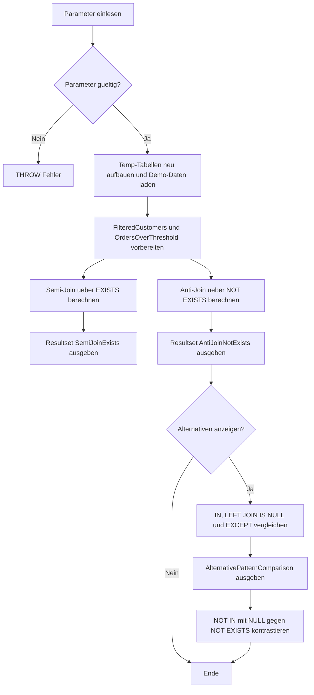

# AntiSemiJoinPatterns.sql

Dieses Skript stellt Semi- und Anti-Join-Muster im Kapitel `03_JOIN` auf einer kleinen tempdb-Demobasis gegenueber. Der Schwerpunkt liegt auf `EXISTS` und `NOT EXISTS`, ergaenzt um Alternativen ueber `IN`, `LEFT JOIN ... IS NULL` und `EXCEPT`.

## Uebersicht

<!-- SQLDOC:SUMMARY_TABLE:BEGIN -->
| Feld | Wert |
|---|---|
| Script | [AntiSemiJoinPatterns.sql](AntiSemiJoinPatterns.sql) |
| Version | `1.0` |
| Typ | `didactic-lab` |
| Kapitel | `03_JOIN` |
| Sicherheit | `read-only-tempdb` |
| Zweck | Zeigt Semi- und Anti-Join-Muster mit `EXISTS`, `NOT EXISTS`, `IN`, `LEFT JOIN ... IS NULL` und `EXCEPT` auf einer kontrollierten Demobasis. |
<!-- SQLDOC:SUMMARY_TABLE:END -->

## Einordnung

Semi-Joins liefern nur Zeilen der linken Seite, fuer die auf der rechten Seite mindestens ein Match existiert. Anti-Joins liefern nur Zeilen der linken Seite, fuer die bewusst kein Match existiert. Genau deshalb sind `EXISTS` und `NOT EXISTS` oft klarer als ein normaler Join mit spaeterem `DISTINCT`.

## Annahmen

- Das Skript arbeitet rein didaktisch mit `#Customers`, `#Orders` und `#SuspendedCustomers` in tempdb.
- Die Bestellschwelle ueber `@MinOrderAmount` steuert bewusst eine kleine und nachvollziehbare Treffermenge.
- Die `NOT IN`-Variante dient nur zur Demonstration der Null-Semantik und nicht als bevorzugtes Anti-Join-Muster.
- `EXCEPT` wird als set-basierte Alternative gezeigt und entfernt dabei Duplikate gemaess Mengenlogik.

## Anwendungsfall

Die erste Ausgabe zeigt Kunden mit mindestens einer passenden Bestellung ueber `EXISTS`. Die zweite Ausgabe zeigt Kunden ohne passende Bestellung ueber `NOT EXISTS`. Optional erscheinen zusaetzlich ein direkter Mustervergleich und eine kompakte Gegenueberstellung von `NOT IN` gegen `NOT EXISTS`, sobald in der Vergleichsmenge `NULL` vorkommt.

## Parameter

<!-- SQLDOC:PARAMETERS_TABLE:BEGIN -->
| Parameter | SQL-Typ | Pflicht | Beschreibung |
|---|---|---|---|
| `@RegionFilter` | `NVARCHAR(20)` | Nein | Optionaler Filter auf eine Kundenregion. |
| `@MinOrderAmount` | `DECIMAL(10,2)` | Nein | Mindestbetrag fuer die Existenzpruefung gegen Bestellungen. |
| `@IncludeAlternatives` | `BIT` | Nein | Steuert, ob Alternativmuster und die `NOT IN`-Nullfalle zusaetzlich ausgegeben werden. |
<!-- SQLDOC:PARAMETERS_TABLE:END -->

## Abhaengigkeiten

<!-- SQLDOC:DEPENDENCIES_LIST:BEGIN -->
- `tempdb`
- `temp tables`
- `EXISTS`
- `NOT EXISTS`
- `IN`
- `LEFT JOIN`
- `EXCEPT`
<!-- SQLDOC:DEPENDENCIES_LIST:END -->

## Hinweise

- `EXISTS` stoppt logisch bereits beim ersten Match und eignet sich gut fuer reine Existenzpruefungen.
- `NOT EXISTS` ist das robuste Standardmuster fuer Anti-Joins, auch wenn die rechte Seite `NULL` enthalten kann.
- `LEFT JOIN ... IS NULL` kann denselben fachlichen Effekt zeigen, ist aber bei komplexeren Joins leichter fehlzuformulieren.
- `IN` ist fuer einfache Semi-Join-Faelle lesbar, braucht aber bei Null- oder Duplikatfragen mehr Aufmerksamkeit.

## Versionshistorie

<!-- SQLDOC:VERSION_HISTORY_TABLE:BEGIN -->
| Version | Datum | User | Beschreibung |
|---|---|---|---|
| `1.0` | `2026-04-17` | `ER` | Erstversion fuer didaktische Semi- und Anti-Join-Muster |
<!-- SQLDOC:VERSION_HISTORY_TABLE:END -->

## Ablauf

<!-- SQLDOC:MERMAID:BEGIN -->

<!-- SQLDOC:MERMAID:END -->

## SQL-Code

<!-- SQLDOC:SQL_CODE:BEGIN -->
```sql
/*
BEGIN:SQL-HEADER v1
---
sql_header: v1
script_name: "AntiSemiJoinPatterns.sql"
script_version: "1.0"
script_type: "didactic-lab"
chapter: "03_JOIN"
purpose: >
  Zeigt Semi- und Anti-Join-Muster mit EXISTS, NOT EXISTS, IN,
  LEFT JOIN ... IS NULL und EXCEPT auf einer kleinen, kontrollierten
  Demobasis.
parameters:
  - name: "@RegionFilter"
    sql_type: "NVARCHAR(20)"
    direction: "IN"
    required: false
    description: "Optionaler Filter auf eine Kundenregion"
  - name: "@MinOrderAmount"
    sql_type: "DECIMAL(10,2)"
    direction: "IN"
    required: false
    description: "Mindestbetrag fuer die Semi- und Anti-Join-Pruefung gegen Bestellungen"
  - name: "@IncludeAlternatives"
    sql_type: "BIT"
    direction: "IN"
    required: false
    description: "1 = Alternativmuster und NOT IN-Fallstrick ausgeben, 0 = nur EXISTS und NOT EXISTS zeigen"
result_sets:
  - name: "SemiJoinExists"
    description: "Kunden mit mindestens einer Bestellung ueber dem Schwellwert"
  - name: "AntiJoinNotExists"
    description: "Kunden ohne passende Bestellung ueber dem Schwellwert"
  - name: "AlternativePatternComparison"
    description: "Vergleich von EXISTS, IN, LEFT JOIN ... IS NULL und EXCEPT"
  - name: "NotInNullPitfall"
    description: "Demonstriert die Null-Semantik von NOT IN mit einer Null in der Vergleichsmenge"
dependencies:
  - "tempdb"
  - "temp tables"
  - "EXISTS"
  - "NOT EXISTS"
  - "IN"
  - "LEFT JOIN"
  - "EXCEPT"
safety:
  level: "read-only-tempdb"
  writes_data: false
documentation:
  markdown_file: "T-SQL/03_JOIN/SQLScripts/AntiSemiJoinPatterns.md"
  sync_blocks:
    - "SUMMARY_TABLE"
    - "PARAMETERS_TABLE"
    - "DEPENDENCIES_LIST"
    - "VERSION_HISTORY_TABLE"
    - "SQL_CODE"
  mermaid:
    mode: "ai-agent-from-sql"
    source: "script-body"
main_responsible:
  name: "Erhard Rainer"
  initials: "ER"
version_history:
  - version: "1.0"
    date: "2026-04-17"
    user: "ER"
    description: "Erstversion fuer didaktische Semi- und Anti-Join-Muster"
notes:
  - "Das Skript arbeitet nur mit temp-Objekten und setzt keine produktiven Tabellen voraus."
  - "Die Alternative ueber NOT IN wird bewusst nur als Fallstrick-Demo gezeigt."
---
END:SQL-HEADER v1
*/

SET NOCOUNT ON;

DECLARE @RegionFilter NVARCHAR(20) = NULL;
DECLARE @MinOrderAmount DECIMAL(10,2) = 100.00;
DECLARE @IncludeAlternatives BIT = 1;

IF @IncludeAlternatives NOT IN (0, 1)
BEGIN
    THROW 50000, '@IncludeAlternatives muss 0 oder 1 sein.', 1;
END;

IF @MinOrderAmount < 0
BEGIN
    THROW 50000, '@MinOrderAmount darf nicht negativ sein.', 1;
END;

DROP TABLE IF EXISTS #Customers;
DROP TABLE IF EXISTS #Orders;
DROP TABLE IF EXISTS #SuspendedCustomers;
DROP TABLE IF EXISTS #FilteredCustomers;
DROP TABLE IF EXISTS #OrdersOverThreshold;

CREATE TABLE #Customers
(
    CustomerID INT NOT NULL PRIMARY KEY,
    CustomerName NVARCHAR(100) NOT NULL,
    RegionCode NVARCHAR(20) NOT NULL
);

CREATE TABLE #Orders
(
    OrderID INT NOT NULL PRIMARY KEY,
    CustomerID INT NULL,
    OrderAmount DECIMAL(10,2) NOT NULL,
    OrderDate DATE NOT NULL
);

CREATE TABLE #SuspendedCustomers
(
    CustomerID INT NULL,
    ReasonCode NVARCHAR(30) NOT NULL
);

INSERT INTO #Customers (CustomerID, CustomerName, RegionCode)
VALUES
    (1, N'Alpenrad GmbH', N'DE-SOUTH'),
    (2, N'Baltic Bikes', N'DE-NORTH'),
    (3, N'City Couriers', N'AT-EAST'),
    (4, N'Delta Retail', N'AT-WEST'),
    (5, N'Elbe Stores', N'DE-NORTH'),
    (6, N'Fjord Sports', N'CH-ZURICH');

INSERT INTO #Orders (OrderID, CustomerID, OrderAmount, OrderDate)
VALUES
    (101, 1, 180.00, '2026-04-01'),
    (102, 1, 75.00, '2026-04-03'),
    (103, 2, 220.00, '2026-04-02'),
    (104, 2, 115.00, '2026-04-05'),
    (105, 3, 65.00, '2026-04-04'),
    (106, 5, 140.00, '2026-04-08'),
    (107, NULL, 999.00, '2026-04-09');

INSERT INTO #SuspendedCustomers (CustomerID, ReasonCode)
VALUES
    (2, N'CREDIT_HOLD'),
    (NULL, N'UNKNOWN_REFERENCE');

SELECT
    c.CustomerID,
    c.CustomerName,
    c.RegionCode
INTO #FilteredCustomers
FROM #Customers AS c
WHERE @RegionFilter IS NULL
   OR c.RegionCode = @RegionFilter;

SELECT
    o.OrderID,
    o.CustomerID,
    o.OrderAmount,
    o.OrderDate
INTO #OrdersOverThreshold
FROM #Orders AS o
WHERE o.OrderAmount >= @MinOrderAmount;

SELECT
    fc.CustomerID,
    fc.CustomerName,
    fc.RegionCode,
    @MinOrderAmount AS MinimumOrderAmount,
    N'Semi-Join ueber EXISTS' AS PatternUsed
FROM #FilteredCustomers AS fc
WHERE EXISTS
(
    SELECT 1
    FROM #OrdersOverThreshold AS oot
    WHERE oot.CustomerID = fc.CustomerID
)
ORDER BY
    fc.CustomerID;

SELECT
    fc.CustomerID,
    fc.CustomerName,
    fc.RegionCode,
    @MinOrderAmount AS MinimumOrderAmount,
    N'Anti-Join ueber NOT EXISTS' AS PatternUsed
FROM #FilteredCustomers AS fc
WHERE NOT EXISTS
(
    SELECT 1
    FROM #OrdersOverThreshold AS oot
    WHERE oot.CustomerID = fc.CustomerID
)
ORDER BY
    fc.CustomerID;

IF @IncludeAlternatives = 1
BEGIN
    SELECT
        pattern.PatternName,
        pattern.CustomerID,
        pattern.CustomerName,
        pattern.RegionCode
    FROM
    (
        SELECT N'EXISTS' AS PatternName, CustomerID, CustomerName, RegionCode
        FROM #FilteredCustomers AS fc
        WHERE EXISTS
        (
            SELECT 1
            FROM #OrdersOverThreshold AS oot
            WHERE oot.CustomerID = fc.CustomerID
        )

        UNION ALL

        SELECT N'IN', CustomerID, CustomerName, RegionCode
        FROM #FilteredCustomers AS fc
        WHERE fc.CustomerID IN
        (
            SELECT oot.CustomerID
            FROM #OrdersOverThreshold AS oot
            WHERE oot.CustomerID IS NOT NULL
        )

        UNION ALL

        SELECT N'LEFT JOIN IS NULL', CustomerID, CustomerName, RegionCode
        FROM #FilteredCustomers AS fc
        LEFT JOIN #OrdersOverThreshold AS oot
            ON oot.CustomerID = fc.CustomerID
        WHERE oot.CustomerID IS NULL

        UNION ALL

        SELECT N'EXCEPT', CustomerID, CustomerName, RegionCode
        FROM #FilteredCustomers AS fc

        EXCEPT

        SELECT N'EXCEPT', fc.CustomerID, fc.CustomerName, fc.RegionCode
        FROM #FilteredCustomers AS fc
        INNER JOIN #OrdersOverThreshold AS oot
            ON oot.CustomerID = fc.CustomerID
    ) AS pattern
    ORDER BY
        pattern.PatternName,
        pattern.CustomerID;

    SELECT
        N'NOT IN gegen #SuspendedCustomers' AS PatternName,
        COUNT(*) AS ReturnedRows,
        N'Enthaelt die Vergleichsmenge NULL, liefert NOT IN hier keine Zeilen.' AS Explanation
    FROM #FilteredCustomers AS fc
    WHERE fc.CustomerID NOT IN
    (
        SELECT sc.CustomerID
        FROM #SuspendedCustomers AS sc
    )

    UNION ALL

    SELECT
        N'NOT EXISTS gegen #SuspendedCustomers' AS PatternName,
        COUNT(*) AS ReturnedRows,
        N'NOT EXISTS prueft zeilenweise und bleibt trotz NULL in der Vergleichsmenge robust.' AS Explanation
    FROM #FilteredCustomers AS fc
    WHERE NOT EXISTS
    (
        SELECT 1
        FROM #SuspendedCustomers AS sc
        WHERE sc.CustomerID = fc.CustomerID
    );
END;
```
<!-- SQLDOC:SQL_CODE:END -->
