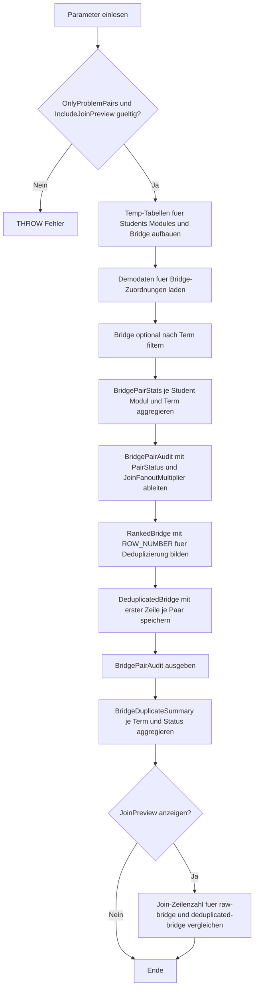

# JoinBridgeDuplicateCheck.sql

Dieses Skript prueft im Kapitel `03_JOIN`, ob eine didaktische n:m-Zuordnungstabelle dasselbe Student-Modul-Paar mehrfach fuehrt. So wird sichtbar, welche Bridge-Zeilen spaetere Joins aufblaehen und wie eine einfache Deduplizierung die Treffermenge veraendert.

## Uebersicht

<!-- SQLDOC:SUMMARY_TABLE:BEGIN -->
| Feld | Wert |
|---|---|
| Script | [JoinBridgeDuplicateCheck.sql](JoinBridgeDuplicateCheck.sql) |
| Version | `1.0` |
| Typ | `didactic-lab` |
| Kapitel | `03_JOIN` |
| Sicherheit | `read-only-tempdb` |
| Zweck | Prueft eine didaktische Bridge-Tabelle auf doppelte Paarungen und deren Join-Fanout. |
<!-- SQLDOC:SUMMARY_TABLE:END -->

## Einordnung

In n:m-Beziehungen ist nicht nur relevant, ob ein Paar vorkommt, sondern auch wie oft. Sobald dieselbe Kombination aus linkem und rechtem Schluessel mehrfach in der Bridge-Tabelle steht, vervielfacht ein spaeterer `JOIN` dieselben fachlichen Treffer. Das Skript kapselt diese Vorpruefung in einer kleinen tempdb-Demo.

## Annahmen

- Die Trainingsdaten modellieren Studierende, Module und eine Bridge-Tabelle fuer Kurszuordnungen.
- Eine Dublette liegt hier vor, wenn dasselbe Paar aus `StudentID`, `ModuleID` und `TermCode` mehrfach vorkommt.
- Die Deduplizierung fuer die Join-Vorschau behaelt je Paar bewusst nur die erste Zeile nach `AssignedAt` und `BridgeID`.
- Unterschiedliche `TermCode`-Werte gelten als getrennte Join-Kontexte und nicht als Dubletten.

## Anwendungsfall

Die Detailausgabe zeigt pro Student-Modul-Paar, ob es genau einmal oder mehrfach in der Bridge vorkommt. Die Zusammenfassung zaehlt saubere und doppelte Paarungen je Term. Optional vergleicht ein drittes Resultset, wie viele Join-Zeilen die Roh-Bridge gegenueber einer deduplizierten Sicht erzeugt.

## Parameter

<!-- SQLDOC:PARAMETERS_TABLE:BEGIN -->
| Parameter | SQL-Typ | Pflicht | Beschreibung |
|---|---|---|---|
| `@TermFilter` | `NVARCHAR(20)` | Nein | Optionaler Filter auf einen Term oder Kurslauf. |
| `@OnlyProblemPairs` | `BIT` | Nein | Zeigt bei `1` nur doppelte Paarungen, bei `0` auch unauffaellige Paarungen. |
| `@IncludeJoinPreview` | `BIT` | Nein | Steuert ein zusaetzliches Resultset fuer den Vergleich zwischen Rohdaten und deduplizierter Sicht. |
<!-- SQLDOC:PARAMETERS_TABLE:END -->

## Abhaengigkeiten

<!-- SQLDOC:DEPENDENCIES_LIST:BEGIN -->
- `tempdb`
- `temp tables`
- `CTE`
- `ROW_NUMBER`
- `STRING_AGG`
<!-- SQLDOC:DEPENDENCIES_LIST:END -->

## Hinweise

- Das Skript schreibt nicht in dauerhafte Tabellen und ist fuer Unterricht, Review und Diagnose gedacht.
- `JoinFanoutMultiplier` zeigt direkt, um welchen Faktor ein spaeterer Join durch doppelte Bridge-Zeilen aufgeblasen werden kann.
- Die Join-Vorschau demonstriert nur den strukturellen Effekt der Deduplizierung und ersetzt keine fachliche Entscheidung darueber, welche Zeile pro Paar gueltig ist.

## Versionshistorie

<!-- SQLDOC:VERSION_HISTORY_TABLE:BEGIN -->
| Version | Datum | User | Beschreibung |
|---|---|---|---|
| `1.0` | `2026-04-17` | `ER` | Erstversion fuer die didaktische Dublettenpruefung in Bridge-Tabellen |
<!-- SQLDOC:VERSION_HISTORY_TABLE:END -->

## Ablauf

<!-- SQLDOC:MERMAID:BEGIN -->

<!-- SQLDOC:MERMAID:END -->

## SQL-Code

<!-- SQLDOC:SQL_CODE:BEGIN -->
```sql
/*
BEGIN:SQL-HEADER v1
---
sql_header: v1
script_name: "JoinBridgeDuplicateCheck.sql"
script_version: "1.0"
script_type: "didactic-lab"
chapter: "03_JOIN"
purpose: >
  Prueft eine didaktische n:m-Zuordnungstabelle auf doppelte Paarungen,
  quantifiziert deren Join-Fanout und zeigt eine deduplizierte
  Vergleichssicht fuer anschliessende JOIN-Analysen.
parameters:
  - name: "@TermFilter"
    sql_type: "NVARCHAR(20)"
    direction: "IN"
    required: false
    description: "Optionaler Filter auf einen Term oder Kurslauf"
  - name: "@OnlyProblemPairs"
    sql_type: "BIT"
    direction: "IN"
    required: false
    description: "1 = nur doppelte Paarungen zeigen, 0 = auch unauffaellige Paarungen ausgeben"
  - name: "@IncludeJoinPreview"
    sql_type: "BIT"
    direction: "IN"
    required: false
    description: "1 = zusaetzliches Resultset zum Fanout-Vergleich zwischen Rohdaten und deduplizierter Sicht ausgeben"
result_sets:
  - name: "BridgePairAudit"
    description: "Detailpruefung je Student-Modul-Paar mit Dublettenstatus und Fanout-Risiko"
  - name: "BridgeDuplicateSummary"
    description: "Zusammenfassung doppelter und sauberer Paarungen je Term"
  - name: "JoinPreviewComparison"
    description: "Optionaler Vergleich der Join-Zeilenzahl vor und nach Deduplizierung"
dependencies:
  - "tempdb"
  - "temp tables"
  - "CTE"
  - "ROW_NUMBER"
  - "STRING_AGG"
safety:
  level: "read-only-tempdb"
  writes_data: false
documentation:
  markdown_file: "T-SQL/03_JOIN/SQLScripts/JoinBridgeDuplicateCheck.md"
  sync_blocks:
    - "SUMMARY_TABLE"
    - "PARAMETERS_TABLE"
    - "DEPENDENCIES_LIST"
    - "VERSION_HISTORY_TABLE"
    - "SQL_CODE"
  mermaid:
    mode: "ai-agent-from-sql"
    source: "script-body"
main_responsible:
  name: "Erhard Rainer"
  initials: "ER"
version_history:
  - version: "1.0"
    date: "2026-04-17"
    user: "ER"
    description: "Erstversion fuer die didaktische Dublettenpruefung in Bridge-Tabellen"
notes:
  - "Das Skript arbeitet ausschliesslich mit temp-Objekten und modelliert eine Trainingssituation fuer n:m-JOINs."
  - "Dubletten werden als mehrfach vorkommendes Student-Modul-Paar interpretiert und nicht als produktive Regelverletzung behauptet."
---
END:SQL-HEADER v1
*/

SET NOCOUNT ON;

DECLARE @TermFilter NVARCHAR(20) = NULL;
DECLARE @OnlyProblemPairs BIT = 1;
DECLARE @IncludeJoinPreview BIT = 1;

IF @OnlyProblemPairs NOT IN (0, 1)
BEGIN
    THROW 50000, '@OnlyProblemPairs muss 0 oder 1 sein.', 1;
END;

IF @IncludeJoinPreview NOT IN (0, 1)
BEGIN
    THROW 50000, '@IncludeJoinPreview muss 0 oder 1 sein.', 1;
END;

DROP TABLE IF EXISTS #Students;
DROP TABLE IF EXISTS #Modules;
DROP TABLE IF EXISTS #StudentModuleBridge;
DROP TABLE IF EXISTS #FilteredBridge;
DROP TABLE IF EXISTS #DeduplicatedBridge;

CREATE TABLE #Students
(
    StudentID INT NOT NULL PRIMARY KEY,
    StudentName NVARCHAR(100) NOT NULL,
    CohortCode NVARCHAR(20) NOT NULL
);

CREATE TABLE #Modules
(
    ModuleID INT NOT NULL PRIMARY KEY,
    ModuleCode NVARCHAR(20) NOT NULL,
    ModuleName NVARCHAR(100) NOT NULL
);

CREATE TABLE #StudentModuleBridge
(
    BridgeID INT NOT NULL PRIMARY KEY,
    StudentID INT NOT NULL,
    ModuleID INT NOT NULL,
    TermCode NVARCHAR(20) NOT NULL,
    EnrollmentStatus NVARCHAR(20) NOT NULL,
    SourceSystem NVARCHAR(30) NOT NULL,
    AssignedAt DATE NOT NULL
);

INSERT INTO #Students (StudentID, StudentName, CohortCode)
VALUES
    (101, N'Anna Berger', N'2026-A'),
    (102, N'Ben Krueger', N'2026-A'),
    (103, N'Clara Stein', N'2026-B'),
    (104, N'Denis Wolf', N'2026-B'),
    (105, N'Eva Kurz', N'2026-C');

INSERT INTO #Modules (ModuleID, ModuleCode, ModuleName)
VALUES
    (201, N'JOIN-101', N'Inner Join Basics'),
    (202, N'JOIN-201', N'Outer Join Diagnostics'),
    (203, N'JOIN-301', N'Bridge Table Workshop');

INSERT INTO #StudentModuleBridge (BridgeID, StudentID, ModuleID, TermCode, EnrollmentStatus, SourceSystem, AssignedAt)
VALUES
    (1, 101, 201, N'2026-Q2', N'active', N'LMS', '2026-04-01'),
    (2, 101, 201, N'2026-Q2', N'active', N'CRM', '2026-04-02'),
    (3, 101, 202, N'2026-Q2', N'active', N'LMS', '2026-04-02'),
    (4, 102, 201, N'2026-Q2', N'active', N'LMS', '2026-04-01'),
    (5, 102, 201, N'2026-Q2', N'waitlist', N'Portal', '2026-04-03'),
    (6, 103, 202, N'2026-Q2', N'active', N'LMS', '2026-04-04'),
    (7, 103, 203, N'2026-Q2', N'active', N'LMS', '2026-04-04'),
    (8, 104, 203, N'2026-Q2', N'active', N'LMS', '2026-04-05'),
    (9, 104, 203, N'2026-Q3', N'planned', N'Planner', '2026-06-01'),
    (10, 105, 202, N'2026-Q2', N'active', N'LMS', '2026-04-06');

SELECT
    smb.BridgeID,
    smb.StudentID,
    smb.ModuleID,
    smb.TermCode,
    smb.EnrollmentStatus,
    smb.SourceSystem,
    smb.AssignedAt
INTO #FilteredBridge
FROM #StudentModuleBridge AS smb
WHERE @TermFilter IS NULL
   OR smb.TermCode = @TermFilter;

;WITH BridgePairStats AS
(
    SELECT
        fb.StudentID,
        fb.ModuleID,
        fb.TermCode,
        COUNT(*) AS BridgeRowCount,
        MIN(fb.AssignedAt) AS FirstAssignedAt,
        MAX(fb.AssignedAt) AS LastAssignedAt,
        STRING_AGG(CONCAT(fb.EnrollmentStatus, ' via ', fb.SourceSystem), ', ')
            WITHIN GROUP (ORDER BY fb.AssignedAt, fb.BridgeID) AS RowFootprint
    FROM #FilteredBridge AS fb
    GROUP BY
        fb.StudentID,
        fb.ModuleID,
        fb.TermCode
),
BridgePairAudit AS
(
    SELECT
        s.CohortCode,
        bps.TermCode,
        bps.StudentID,
        s.StudentName,
        bps.ModuleID,
        m.ModuleCode,
        m.ModuleName,
        bps.BridgeRowCount,
        bps.FirstAssignedAt,
        bps.LastAssignedAt,
        bps.RowFootprint,
        CASE
            WHEN bps.BridgeRowCount > 1 THEN 'duplicate'
            ELSE 'single'
        END AS PairStatus,
        CASE
            WHEN bps.BridgeRowCount > 1 THEN bps.BridgeRowCount
            ELSE 1
        END AS JoinFanoutMultiplier,
        CASE
            WHEN bps.BridgeRowCount > 1
                THEN 'Dasselbe Student-Modul-Paar ist mehrfach vorhanden und vervielfacht spaetere Join-Treffer.'
            ELSE 'Das Student-Modul-Paar ist genau einmal vorhanden.'
        END AS AuditMessage
    FROM BridgePairStats AS bps
    INNER JOIN #Students AS s
        ON s.StudentID = bps.StudentID
    INNER JOIN #Modules AS m
        ON m.ModuleID = bps.ModuleID
),
RankedBridge AS
(
    SELECT
        fb.BridgeID,
        fb.StudentID,
        fb.ModuleID,
        fb.TermCode,
        fb.EnrollmentStatus,
        fb.SourceSystem,
        fb.AssignedAt,
        ROW_NUMBER() OVER
        (
            PARTITION BY fb.StudentID, fb.ModuleID, fb.TermCode
            ORDER BY fb.AssignedAt, fb.BridgeID
        ) AS PairRowNumber
    FROM #FilteredBridge AS fb
)
SELECT
    rb.BridgeID,
    rb.StudentID,
    rb.ModuleID,
    rb.TermCode,
    rb.EnrollmentStatus,
    rb.SourceSystem,
    rb.AssignedAt
INTO #DeduplicatedBridge
FROM RankedBridge AS rb
WHERE rb.PairRowNumber = 1;

SELECT
    bpa.CohortCode,
    bpa.TermCode,
    bpa.StudentID,
    bpa.StudentName,
    bpa.ModuleID,
    bpa.ModuleCode,
    bpa.ModuleName,
    bpa.BridgeRowCount,
    bpa.JoinFanoutMultiplier,
    bpa.FirstAssignedAt,
    bpa.LastAssignedAt,
    bpa.RowFootprint,
    bpa.PairStatus,
    bpa.AuditMessage
FROM BridgePairAudit AS bpa
WHERE @OnlyProblemPairs = 0
   OR bpa.PairStatus = 'duplicate'
ORDER BY
    CASE bpa.PairStatus
        WHEN 'duplicate' THEN 1
        ELSE 2
    END,
    bpa.TermCode,
    bpa.StudentID,
    bpa.ModuleID;

SELECT
    bpa.TermCode,
    bpa.PairStatus,
    COUNT(*) AS PairCount,
    SUM(bpa.BridgeRowCount) AS BridgeRowsRepresented,
    SUM(CASE WHEN bpa.PairStatus = 'duplicate' THEN bpa.BridgeRowCount - 1 ELSE 0 END) AS ExtraRowsBeyondOnePair
FROM BridgePairAudit AS bpa
GROUP BY
    bpa.TermCode,
    bpa.PairStatus
ORDER BY
    bpa.TermCode,
    CASE bpa.PairStatus
        WHEN 'duplicate' THEN 1
        ELSE 2
    END;

IF @IncludeJoinPreview = 1
BEGIN
    SELECT
        resultset.JoinVariant,
        resultset.TermCode,
        resultset.StudentID,
        resultset.StudentName,
        resultset.JoinedRowCount
    FROM
    (
        SELECT
            'raw-bridge' AS JoinVariant,
            fb.TermCode,
            s.StudentID,
            s.StudentName,
            COUNT(*) AS JoinedRowCount
        FROM #Students AS s
        INNER JOIN #FilteredBridge AS fb
            ON fb.StudentID = s.StudentID
        INNER JOIN #Modules AS m
            ON m.ModuleID = fb.ModuleID
        GROUP BY
            fb.TermCode,
            s.StudentID,
            s.StudentName

        UNION ALL

        SELECT
            'deduplicated-bridge' AS JoinVariant,
            db.TermCode,
            s.StudentID,
            s.StudentName,
            COUNT(*) AS JoinedRowCount
        FROM #Students AS s
        INNER JOIN #DeduplicatedBridge AS db
            ON db.StudentID = s.StudentID
        INNER JOIN #Modules AS m
            ON m.ModuleID = db.ModuleID
        GROUP BY
            db.TermCode,
            s.StudentID,
            s.StudentName
    ) AS resultset
    ORDER BY
        resultset.TermCode,
        resultset.StudentID,
        resultset.JoinVariant;
END;
```
<!-- SQLDOC:SQL_CODE:END -->
