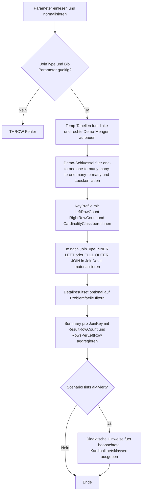

# JoinCardinalitySmokeTest.sql

Dieses Skript vergleicht im Kapitel `03_JOIN` typische Join-Kardinalitaeten auf einer kleinen, kontrollierten Demobasis. Es zeigt fuer einen gewaehlten Join-Typ, wie sich `1:1`, `1:n`, `n:1`, `n:m` sowie Luecken-Faelle in den Ergebniszeilen und in einer kompakten Summary niederschlagen.

## Uebersicht

<!-- SQLDOC:SUMMARY_TABLE:BEGIN -->
| Feld | Wert |
|---|---|
| Script | [JoinCardinalitySmokeTest.sql](JoinCardinalitySmokeTest.sql) |
| Version | `1.0` |
| Typ | `didactic-lab` |
| Kapitel | `03_JOIN` |
| Sicherheit | `read-only-tempdb` |
| Zweck | Vergleicht Join-Ergebnisse und Kardinalitaeten fuer typische 1:1-, 1:n-, n:1-, n:m- sowie Luecken-Faelle auf einer kleinen didaktischen Demobasis. |
<!-- SQLDOC:SUMMARY_TABLE:END -->

## Einordnung

Viele Join-Probleme sind keine Syntaxfehler, sondern Grain-Probleme. Dieses Skript trennt deshalb die Schluesselprofile von den eigentlichen Join-Ergebniszeilen. So wird sichtbar, wann ein Join stabil bleibt, wann er auffaechert und wann ein `LEFT`- oder `FULL OUTER JOIN` noetig ist, um fehlende Treffer ueberhaupt noch zu sehen.

## Annahmen

- Die linke Seite repraesentiert eine fachliche Ausgangsmenge mit genau einem gewuenschten Grain pro `LeftRowID`.
- Die rechte Seite repraesentiert verbundene Fakten oder Referenzen, die je `JoinKey` bewusst verschiedene Kardinalitaeten besitzen.
- Der Join erfolgt absichtlich nur ueber `JoinKey`, damit die Zeilenwirkung der Kardinalitaet klar lesbar bleibt.
- `K-LEFT` und `K-RIGHT` sind didaktische Luecken-Faelle fuer `LEFT JOIN` beziehungsweise `FULL OUTER JOIN`.

## Anwendungsfall

Die erste Ausgabe listet die konkreten Join-Zeilen fuer den gewaehlten Join-Typ. Die zweite Ausgabe verdichtet pro `JoinKey`, wie viele linke und rechte Zeilen beteiligt sind, wie viele Resultatzeilen entstehen und wie stark das Resultset pro linker Zeile waechst. Optional folgt ein drittes Resultset mit Review-Fragen, Risiken und empfohlenen Checks je beobachteter Kardinalitaetsklasse.

## Parameter

<!-- SQLDOC:PARAMETERS_TABLE:BEGIN -->
| Parameter | SQL-Typ | Pflicht | Beschreibung |
|---|---|---|---|
| `@JoinType` | `NVARCHAR(10)` | Nein | `INNER`, `LEFT` oder `FULL` waehlen den auszugebenden Join-Typ. |
| `@OnlyProblemScenarios` | `BIT` | Nein | Zeigt bei `1` nur Szenarien ausserhalb von `one_to_one`, bei `0` alle Schluesselprofile. |
| `@IncludeScenarioHints` | `BIT` | Nein | Steuert ein zusaetzliches Resultset mit didaktischen Hinweisen pro Kardinalitaetsklasse. |
<!-- SQLDOC:PARAMETERS_TABLE:END -->

## Abhaengigkeiten

<!-- SQLDOC:DEPENDENCIES_LIST:BEGIN -->
- `tempdb`
- `temp tables`
- `CTE`
- `INNER JOIN`
- `LEFT JOIN`
- `FULL OUTER JOIN`
- `GROUP BY`
- `UNION ALL`
<!-- SQLDOC:DEPENDENCIES_LIST:END -->

## Hinweise

- `RowsPerLeftRow` hilft dabei, den Fanout des gewaehlten Join-Typs kompakt zu lesen.
- `many_to_many` zeigt das klassische multiplikative Muster, bei dem mehrere linke und mehrere rechte Zeilen pro `JoinKey` aufeinander treffen.
- `right_only` wird nur sichtbar, wenn `@JoinType = 'FULL'` gesetzt ist.
- `one_to_many` und `many_to_many` sind typische Warnsignale vor spaeteren Summenbildungen ohne Voraggregation.

## Versionshistorie

<!-- SQLDOC:VERSION_HISTORY_TABLE:BEGIN -->
| Version | Datum | User | Beschreibung |
|---|---|---|---|
| `1.0` | `2026-04-19` | `ER` | Erstversion fuer einen didaktischen Smoke Test zu Join-Kardinalitaeten |
<!-- SQLDOC:VERSION_HISTORY_TABLE:END -->

## Ablauf

<!-- SQLDOC:MERMAID:BEGIN -->

<!-- SQLDOC:MERMAID:END -->

## SQL-Code

<!-- SQLDOC:SQL_CODE:BEGIN -->
```sql
/*
BEGIN:SQL-HEADER v1
---
sql_header: v1
script_name: "JoinCardinalitySmokeTest.sql"
script_version: "1.0"
script_type: "didactic-lab"
chapter: "03_JOIN"
purpose: >
  Vergleicht Join-Ergebnisse und Kardinalitaeten fuer typische 1:1-,
  1:n-, n:1-, n:m- sowie Luecken-Faelle auf einer kleinen didaktischen
  Demobasis. Das Skript zeigt, wie viele Ergebniszeilen ein gewaehlter
  Join-Typ pro Schluessel produziert und wo Fanout oder fehlende Treffer
  entstehen.
parameters:
  - name: "@JoinType"
    sql_type: "NVARCHAR(10)"
    direction: "IN"
    required: false
    description: "INNER, LEFT oder FULL steuern den auszugebenden Join-Typ"
  - name: "@OnlyProblemScenarios"
    sql_type: "BIT"
    direction: "IN"
    required: false
    description: "1 = nur Szenarien ausserhalb von 1:1 anzeigen, 0 = alle Kardinalitaetsfaelle anzeigen"
  - name: "@IncludeScenarioHints"
    sql_type: "BIT"
    direction: "IN"
    required: false
    description: "1 = zusaetzliches Resultset mit didaktischen Hinweisen pro Kardinalitaetsklasse ausgeben"
result_sets:
  - name: "JoinCardinalityDetail"
    description: "Zeigt die einzelnen Join-Ergebniszeilen fuer den gewaehlten Join-Typ inklusive Kardinalitaetsklasse"
  - name: "JoinCardinalitySummary"
    description: "Verdichtet pro JoinKey die linke und rechte Kardinalitaet sowie Ergebniszeilen und Fanout"
  - name: "JoinScenarioHints"
    description: "Optionale didaktische Hinweise fuer die beobachteten Kardinalitaetsklassen"
dependencies:
  - "tempdb"
  - "temp tables"
  - "CTE"
  - "INNER JOIN"
  - "LEFT JOIN"
  - "FULL OUTER JOIN"
  - "GROUP BY"
  - "UNION ALL"
safety:
  level: "read-only-tempdb"
  writes_data: false
documentation:
  markdown_file: "T-SQL/03_JOIN/SQLScripts/JoinCardinalitySmokeTest.md"
  sync_blocks:
    - "SUMMARY_TABLE"
    - "PARAMETERS_TABLE"
    - "DEPENDENCIES_LIST"
    - "VERSION_HISTORY_TABLE"
    - "SQL_CODE"
  mermaid:
    mode: "ai-agent-from-sql"
    source: "script-body"
main_responsible:
  name: "Erhard Rainer"
  initials: "ER"
version_history:
  - version: "1.0"
    date: "2026-04-19"
    user: "ER"
    description: "Erstversion fuer einen didaktischen Smoke Test zu Join-Kardinalitaeten"
notes:
  - "Die Demodaten nutzen bewusst kleine Schluesselmengen fuer one-to-one, one-to-many, many-to-one, many-to-many sowie Luecken-Faelle."
  - "Der Join erfolgt absichtlich nur ueber JoinKey, damit sich die Kardinalitaetseffekte direkt an den Ergebniszeilen zeigen."
---
END:SQL-HEADER v1
*/

SET NOCOUNT ON;

DECLARE @JoinType NVARCHAR(10) = N'INNER';
DECLARE @OnlyProblemScenarios BIT = 0;
DECLARE @IncludeScenarioHints BIT = 1;

SET @JoinType = UPPER(@JoinType);

IF @JoinType NOT IN (N'INNER', N'LEFT', N'FULL')
BEGIN
    THROW 50000, '@JoinType muss INNER, LEFT oder FULL sein.', 1;
END;

IF @OnlyProblemScenarios NOT IN (0, 1)
BEGIN
    THROW 50001, '@OnlyProblemScenarios muss 0 oder 1 sein.', 1;
END;

IF @IncludeScenarioHints NOT IN (0, 1)
BEGIN
    THROW 50002, '@IncludeScenarioHints muss 0 oder 1 sein.', 1;
END;

DROP TABLE IF EXISTS #LeftCases;
DROP TABLE IF EXISTS #RightCases;
DROP TABLE IF EXISTS #KeyProfile;
DROP TABLE IF EXISTS #JoinDetail;
DROP TABLE IF EXISTS #ScenarioHints;

CREATE TABLE #LeftCases
(
    LeftRowID INT NOT NULL PRIMARY KEY,
    JoinKey NVARCHAR(20) NOT NULL,
    LeftEntity NVARCHAR(80) NOT NULL,
    LeftGroup NVARCHAR(40) NOT NULL
);

CREATE TABLE #RightCases
(
    RightRowID INT NOT NULL PRIMARY KEY,
    JoinKey NVARCHAR(20) NOT NULL,
    RightEntity NVARCHAR(80) NOT NULL,
    RightGroup NVARCHAR(40) NOT NULL
);

INSERT INTO #LeftCases (LeftRowID, JoinKey, LeftEntity, LeftGroup)
VALUES
    (101, N'K-ONE',  N'Order 101', N'one-to-one'),
    (102, N'K-ONE2', N'Order 102', N'one-to-one'),
    (103, N'K-1N',   N'Order 103', N'one-to-many'),
    (104, N'K-N1',   N'Order 104', N'many-to-one'),
    (105, N'K-N1',   N'Order 105', N'many-to-one'),
    (106, N'K-N1',   N'Order 106', N'many-to-one'),
    (107, N'K-NM',   N'Order 107', N'many-to-many'),
    (108, N'K-NM',   N'Order 108', N'many-to-many'),
    (109, N'K-LEFT', N'Order 109', N'left-only');

INSERT INTO #RightCases (RightRowID, JoinKey, RightEntity, RightGroup)
VALUES
    (201, N'K-ONE',   N'Invoice 201',    N'one-to-one'),
    (202, N'K-ONE2',  N'Invoice 202',    N'one-to-one'),
    (203, N'K-1N',    N'Shipment 203',   N'one-to-many'),
    (204, N'K-1N',    N'Shipment 204',   N'one-to-many'),
    (205, N'K-1N',    N'Shipment 205',   N'one-to-many'),
    (206, N'K-N1',    N'Batch 206',      N'many-to-one'),
    (207, N'K-NM',    N'Rule 207',       N'many-to-many'),
    (208, N'K-NM',    N'Rule 208',       N'many-to-many'),
    (209, N'K-RIGHT', N'Orphan Rule 209', N'right-only'),
    (210, N'K-RIGHT', N'Orphan Rule 210', N'right-only');

CREATE TABLE #KeyProfile
(
    JoinKey NVARCHAR(20) NOT NULL PRIMARY KEY,
    LeftRowCount INT NOT NULL,
    RightRowCount INT NOT NULL,
    CardinalityClass NVARCHAR(30) NOT NULL,
    ScenarioExplanation NVARCHAR(220) NOT NULL
);

;WITH KeyUniverse AS
(
    SELECT lc.JoinKey
    FROM #LeftCases AS lc
    UNION
    SELECT rc.JoinKey
    FROM #RightCases AS rc
),
LeftCounts AS
(
    SELECT
        lc.JoinKey,
        COUNT(*) AS LeftRowCount
    FROM #LeftCases AS lc
    GROUP BY
        lc.JoinKey
),
RightCounts AS
(
    SELECT
        rc.JoinKey,
        COUNT(*) AS RightRowCount
    FROM #RightCases AS rc
    GROUP BY
        rc.JoinKey
)
INSERT INTO #KeyProfile
(
    JoinKey,
    LeftRowCount,
    RightRowCount,
    CardinalityClass,
    ScenarioExplanation
)
SELECT
    ku.JoinKey,
    ISNULL(lc.LeftRowCount, 0) AS LeftRowCount,
    ISNULL(rc.RightRowCount, 0) AS RightRowCount,
    CASE
        WHEN ISNULL(lc.LeftRowCount, 0) = 0 THEN N'right_only'
        WHEN ISNULL(rc.RightRowCount, 0) = 0 THEN N'left_only'
        WHEN ISNULL(lc.LeftRowCount, 0) = 1 AND ISNULL(rc.RightRowCount, 0) = 1 THEN N'one_to_one'
        WHEN ISNULL(lc.LeftRowCount, 0) = 1 AND ISNULL(rc.RightRowCount, 0) > 1 THEN N'one_to_many'
        WHEN ISNULL(lc.LeftRowCount, 0) > 1 AND ISNULL(rc.RightRowCount, 0) = 1 THEN N'many_to_one'
        ELSE N'many_to_many'
    END AS CardinalityClass,
    CASE
        WHEN ISNULL(lc.LeftRowCount, 0) = 0 THEN N'Der Schluessel existiert nur rechts und wird erst mit FULL OUTER JOIN sichtbar.'
        WHEN ISNULL(rc.RightRowCount, 0) = 0 THEN N'Der Schluessel existiert nur links; LEFT oder FULL behalten die linke Zeile.'
        WHEN ISNULL(lc.LeftRowCount, 0) = 1 AND ISNULL(rc.RightRowCount, 0) = 1 THEN N'Genau eine linke und eine rechte Zeile erzeugen eine stabile 1:1-Beziehung.'
        WHEN ISNULL(lc.LeftRowCount, 0) = 1 AND ISNULL(rc.RightRowCount, 0) > 1 THEN N'Eine linke Zeile trifft auf mehrere rechte Zeilen und faechert das Resultset auf.'
        WHEN ISNULL(lc.LeftRowCount, 0) > 1 AND ISNULL(rc.RightRowCount, 0) = 1 THEN N'Mehrere linke Zeilen teilen sich eine rechte Zeile; das ist fachlich oft many-to-one aus Sicht der linken Menge.'
        ELSE N'Mehrere linke und mehrere rechte Zeilen erzeugen ein n:m-Muster mit multiplikativer Zeilenzahl.'
    END AS ScenarioExplanation
FROM KeyUniverse AS ku
LEFT JOIN LeftCounts AS lc
    ON lc.JoinKey = ku.JoinKey
LEFT JOIN RightCounts AS rc
    ON rc.JoinKey = ku.JoinKey;

CREATE TABLE #JoinDetail
(
    JoinType NVARCHAR(20) NOT NULL,
    JoinKey NVARCHAR(20) NOT NULL,
    CardinalityClass NVARCHAR(30) NOT NULL,
    MatchOutcome NVARCHAR(20) NOT NULL,
    LeftRowID INT NULL,
    LeftEntity NVARCHAR(80) NULL,
    RightRowID INT NULL,
    RightEntity NVARCHAR(80) NULL
);

INSERT INTO #JoinDetail
(
    JoinType,
    JoinKey,
    CardinalityClass,
    MatchOutcome,
    LeftRowID,
    LeftEntity,
    RightRowID,
    RightEntity
)
SELECT
    jd.JoinType,
    jd.JoinKey,
    kp.CardinalityClass,
    jd.MatchOutcome,
    jd.LeftRowID,
    jd.LeftEntity,
    jd.RightRowID,
    jd.RightEntity
FROM
(
    SELECT
        N'INNER JOIN' AS JoinType,
        lc.JoinKey,
        N'matched' AS MatchOutcome,
        lc.LeftRowID,
        lc.LeftEntity,
        rc.RightRowID,
        rc.RightEntity
    FROM #LeftCases AS lc
    INNER JOIN #RightCases AS rc
        ON rc.JoinKey = lc.JoinKey
    WHERE @JoinType = N'INNER'

    UNION ALL

    SELECT
        N'LEFT JOIN' AS JoinType,
        lc.JoinKey,
        CASE
            WHEN rc.RightRowID IS NULL THEN N'left_only'
            ELSE N'matched'
        END AS MatchOutcome,
        lc.LeftRowID,
        lc.LeftEntity,
        rc.RightRowID,
        rc.RightEntity
    FROM #LeftCases AS lc
    LEFT JOIN #RightCases AS rc
        ON rc.JoinKey = lc.JoinKey
    WHERE @JoinType = N'LEFT'

    UNION ALL

    SELECT
        N'FULL OUTER JOIN' AS JoinType,
        ISNULL(lc.JoinKey, rc.JoinKey) AS JoinKey,
        CASE
            WHEN lc.LeftRowID IS NULL THEN N'right_only'
            WHEN rc.RightRowID IS NULL THEN N'left_only'
            ELSE N'matched'
        END AS MatchOutcome,
        lc.LeftRowID,
        lc.LeftEntity,
        rc.RightRowID,
        rc.RightEntity
    FROM #LeftCases AS lc
    FULL OUTER JOIN #RightCases AS rc
        ON rc.JoinKey = lc.JoinKey
    WHERE @JoinType = N'FULL'
) AS jd
INNER JOIN #KeyProfile AS kp
    ON kp.JoinKey = jd.JoinKey;

SELECT
    jd.JoinType,
    jd.JoinKey,
    kp.LeftRowCount,
    kp.RightRowCount,
    jd.CardinalityClass,
    jd.MatchOutcome,
    jd.LeftRowID,
    jd.LeftEntity,
    jd.RightRowID,
    jd.RightEntity
FROM #JoinDetail AS jd
INNER JOIN #KeyProfile AS kp
    ON kp.JoinKey = jd.JoinKey
WHERE @OnlyProblemScenarios = 0
   OR jd.CardinalityClass <> N'one_to_one'
ORDER BY
    CASE jd.CardinalityClass
        WHEN N'one_to_one' THEN 1
        WHEN N'one_to_many' THEN 2
        WHEN N'many_to_one' THEN 3
        WHEN N'many_to_many' THEN 4
        WHEN N'left_only' THEN 5
        ELSE 6
    END,
    jd.JoinKey,
    ISNULL(jd.LeftRowID, 2147483647),
    ISNULL(jd.RightRowID, 2147483647);

SELECT
    kp.JoinKey,
    kp.LeftRowCount,
    kp.RightRowCount,
    kp.CardinalityClass,
    COUNT(*) AS ResultRowCount,
    SUM(CASE WHEN jd.MatchOutcome = N'matched' THEN 1 ELSE 0 END) AS MatchedRowCount,
    SUM(CASE WHEN jd.MatchOutcome = N'left_only' THEN 1 ELSE 0 END) AS LeftOnlyRowCount,
    SUM(CASE WHEN jd.MatchOutcome = N'right_only' THEN 1 ELSE 0 END) AS RightOnlyRowCount,
    CAST(COUNT(*) AS DECIMAL(10,2)) / NULLIF(CAST(NULLIF(kp.LeftRowCount, 0) AS DECIMAL(10,2)), 0) AS RowsPerLeftRow,
    kp.ScenarioExplanation
FROM #JoinDetail AS jd
INNER JOIN #KeyProfile AS kp
    ON kp.JoinKey = jd.JoinKey
WHERE @OnlyProblemScenarios = 0
   OR kp.CardinalityClass <> N'one_to_one'
GROUP BY
    kp.JoinKey,
    kp.LeftRowCount,
    kp.RightRowCount,
    kp.CardinalityClass,
    kp.ScenarioExplanation
ORDER BY
    CASE kp.CardinalityClass
        WHEN N'one_to_one' THEN 1
        WHEN N'one_to_many' THEN 2
        WHEN N'many_to_one' THEN 3
        WHEN N'many_to_many' THEN 4
        WHEN N'left_only' THEN 5
        ELSE 6
    END,
    kp.JoinKey;

CREATE TABLE #ScenarioHints
(
    CardinalityClass NVARCHAR(30) NOT NULL PRIMARY KEY,
    ReviewQuestion NVARCHAR(220) NOT NULL,
    TypicalRisk NVARCHAR(220) NOT NULL,
    RecommendedCheck NVARCHAR(220) NOT NULL
);

INSERT INTO #ScenarioHints
(
    CardinalityClass,
    ReviewQuestion,
    TypicalRisk,
    RecommendedCheck
)
VALUES
    (N'one_to_one', N'Ist der Join-Schluessel auf beiden Seiten wirklich eindeutig?', N'Vermeintlich stabile Keys koennen spaeter doppelte Treffer erzeugen.', N'Unique-Checks oder COUNT DISTINCT pro JoinKey ausfuehren.'),
    (N'one_to_many', N'Ist die rechte Mehrfachheit fachlich gewollt oder nur ein technisches Nebenprodukt?', N'Summen und Counts auf der linken Menge werden leicht mehrfach gezaehlt.', N'Vor Aggregationen den gewuenschten Grain festlegen oder rechts vorverdichten.'),
    (N'many_to_one', N'Teilen sich mehrere linke Zeilen bewusst eine gemeinsame Referenz?', N'Die rechte Zeile wirkt stabil, aber linke Kennzahlen koennen falsch als Duplikate gelesen werden.', N'Den Join aus Sicht der linken Grain dokumentieren und Schluesselrollen benennen.'),
    (N'many_to_many', N'Benoetigt das Modell eine Brueckentabelle oder eine explizite Voraggregation?', N'Die Ergebniszeilen wachsen multiplikativ und erschweren fachlich korrekte Kennzahlen.', N'JoinKey-Kombinationen und Ziel-Grain vor dem Join explizit modellieren.'),
    (N'left_only', N'Sollen linke Luecken erhalten bleiben oder als Qualitaetsproblem markiert werden?', N'Fehlende rechte Treffer werden bei INNER JOIN unsichtbar.', N'LEFT JOIN oder Anti-Join einsetzen und fehlende Schluessel separat pruefen.'),
    (N'right_only', N'Sind rechte Datensaetze ohne linkes Gegenstueck fachlich erlaubt?', N'Orphan-Datensaetze bleiben ohne FULL OUTER JOIN oder Anti-Join oft verborgen.', N'FULL OUTER JOIN oder Right-only-Pruefung fuer die Datenqualitaet einbauen.');

IF @IncludeScenarioHints = 1
BEGIN
    SELECT
        sh.CardinalityClass,
        sh.ReviewQuestion,
        sh.TypicalRisk,
        sh.RecommendedCheck
    FROM #ScenarioHints AS sh
    WHERE EXISTS
    (
        SELECT 1
        FROM #KeyProfile AS kp
        WHERE kp.CardinalityClass = sh.CardinalityClass
          AND (@OnlyProblemScenarios = 0 OR kp.CardinalityClass <> N'one_to_one')
    )
    ORDER BY
        CASE sh.CardinalityClass
            WHEN N'one_to_one' THEN 1
            WHEN N'one_to_many' THEN 2
            WHEN N'many_to_one' THEN 3
            WHEN N'many_to_many' THEN 4
            WHEN N'left_only' THEN 5
            ELSE 6
        END;
END;
```
<!-- SQLDOC:SQL_CODE:END -->
