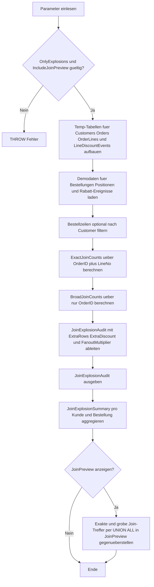

# JoinDuplicateExplosionCheck.sql

Dieses Skript zeigt im Kapitel `03_JOIN`, wie eine zu grobe Join-Bedingung auf Bestellebene dieselben Rabattzeilen mehrfach an unterschiedliche Bestellpositionen anhaengt. Dadurch werden Treffermengen, Summen und Detailzeilen kuenstlich aufgeblasen.

## Uebersicht

<!-- SQLDOC:SUMMARY_TABLE:BEGIN -->
| Feld | Wert |
|---|---|
| Script | [JoinDuplicateExplosionCheck.sql](JoinDuplicateExplosionCheck.sql) |
| Version | `1.0` |
| Typ | `didactic-lab` |
| Kapitel | `03_JOIN` |
| Sicherheit | `read-only-tempdb` |
| Zweck | Vergleicht einen exakten Zeilen-Join mit einem zu groben Order-Join und macht daraus entstehende Duplicate-Explosionen sichtbar. |
<!-- SQLDOC:SUMMARY_TABLE:END -->

## Einordnung

Join-Probleme entstehen nicht nur durch fehlende Datensaetze, sondern oft durch die falsche fachliche Granularitaet der Join-Bedingung. Wenn ein Detailobjekt wie ein Rabatt-Ereignis eigentlich an `OrderID + LineNo` haengt, aber nur ueber `OrderID` verknuepft wird, erscheinen fremde Detailzeilen ploetzlich bei jeder Position derselben Bestellung.

## Annahmen

- Die Trainingsdaten modellieren Bestellungen, Bestellzeilen und positionsbezogene Rabatt-Ereignisse.
- Der exakte Join verwendet `OrderID` und `LineNo` als gemeinsame Granularitaet.
- Die fehlerhafte Vergleichsvariante joint absichtlich nur ueber `OrderID`, um den Fanout sichtbar zu machen.
- Ein groesserer Rabattbetrag im breiten Join ist hier ein Diagnose-Signal und keine fachlich gueltige Kennzahl.

## Anwendungsfall

Die erste Ausgabe zeigt je Bestellzeile, wie viele Rabatt-Treffer der exakte Join und die zu grobe Variante erzeugen. Die zweite Ausgabe verdichtet diese Differenz pro Bestellung. Optional liefert ein drittes Resultset die einzelnen Join-Treffer, damit die Ursache der Zeilenvervielfachung direkt nachvollziehbar bleibt.

## Parameter

<!-- SQLDOC:PARAMETERS_TABLE:BEGIN -->
| Parameter | SQL-Typ | Pflicht | Beschreibung |
|---|---|---|---|
| `@CustomerFilter` | `NVARCHAR(50)` | Nein | Optionaler Filter auf einen Kundennamen. |
| `@OnlyExplosions` | `BIT` | Nein | Zeigt bei `1` nur Bestellzeilen mit Fanout durch den groben Join, bei `0` alle Zeilen. |
| `@IncludeJoinPreview` | `BIT` | Nein | Steuert ein zusaetzliches Resultset mit exakten und groben Join-Treffern. |
<!-- SQLDOC:PARAMETERS_TABLE:END -->

## Abhaengigkeiten

<!-- SQLDOC:DEPENDENCIES_LIST:BEGIN -->
- `tempdb`
- `temp tables`
- `CTE`
- `UNION ALL`
- `ROW_NUMBER`
<!-- SQLDOC:DEPENDENCIES_LIST:END -->

## Hinweise

- `FanoutMultiplier` vergleicht die Anzahl der Treffer aus dem groben Join direkt mit der exakten Variante.
- `ExtraDiscountFromBroadJoin` illustriert, wie schnell aggregierte Werte durch einen Join auf falscher Granularitaet ueberzaehlt werden.
- Das Preview-Resultset ist bewusst redundant gehalten, damit die zusatzlichen Treffer der breiten Join-Bedingung pro Position sichtbar bleiben.

## Versionshistorie

<!-- SQLDOC:VERSION_HISTORY_TABLE:BEGIN -->
| Version | Datum | User | Beschreibung |
|---|---|---|---|
| `1.0` | `2026-04-17` | `ER` | Erstversion fuer die didaktische Pruefung auf Join-Duplicate-Explosionen |
<!-- SQLDOC:VERSION_HISTORY_TABLE:END -->

## Ablauf

<!-- SQLDOC:MERMAID:BEGIN -->

<!-- SQLDOC:MERMAID:END -->

## SQL-Code

<!-- SQLDOC:SQL_CODE:BEGIN -->
```sql
/*
BEGIN:SQL-HEADER v1
---
sql_header: v1
script_name: "JoinDuplicateExplosionCheck.sql"
script_version: "1.0"
script_type: "didactic-lab"
chapter: "03_JOIN"
purpose: >
  Demonstriert, wie ein zu grober JOIN auf Bestellebene statt auf
  Bestellzeilenebene unbeabsichtigte Zeilenvervielfachung erzeugt, und
  stellt die exakte Join-Bedingung der fehleranfaelligen Variante
  gegenueber.
parameters:
  - name: "@CustomerFilter"
    sql_type: "NVARCHAR(50)"
    direction: "IN"
    required: false
    description: "Optionaler Filter auf einen Kundennamen"
  - name: "@OnlyExplosions"
    sql_type: "BIT"
    direction: "IN"
    required: false
    description: "1 = nur Zeilen mit Fanout durch den groben JOIN anzeigen, 0 = alle Zeilen zeigen"
  - name: "@IncludeJoinPreview"
    sql_type: "BIT"
    direction: "IN"
    required: false
    description: "1 = zusaetzliches Resultset mit exakten und groben Join-Treffern anzeigen"
result_sets:
  - name: "JoinExplosionAudit"
    description: "Vergleicht exakte und zu grobe Join-Treffer je Bestellzeile"
  - name: "JoinExplosionSummary"
    description: "Verdichtet Fanout und Auffaelligkeiten je Kunde und Bestellung"
  - name: "JoinPreview"
    description: "Optionaler Vergleich einzelner Join-Treffer fuer exakte und grobe Bedingung"
dependencies:
  - "tempdb"
  - "temp tables"
  - "CTE"
  - "UNION ALL"
  - "ROW_NUMBER"
safety:
  level: "read-only-tempdb"
  writes_data: false
documentation:
  markdown_file: "T-SQL/03_JOIN/SQLScripts/JoinDuplicateExplosionCheck.md"
  sync_blocks:
    - "SUMMARY_TABLE"
    - "PARAMETERS_TABLE"
    - "DEPENDENCIES_LIST"
    - "VERSION_HISTORY_TABLE"
    - "SQL_CODE"
  mermaid:
    mode: "ai-agent-from-sql"
    source: "script-body"
main_responsible:
  name: "Erhard Rainer"
  initials: "ER"
version_history:
  - version: "1.0"
    date: "2026-04-17"
    user: "ER"
    description: "Erstversion fuer die didaktische Pruefung auf Join-Duplicate-Explosionen"
notes:
  - "Das Skript nutzt ausschliesslich temp-Objekte und modelliert eine Lehrsituation fuer Join-Grain und Fanout."
  - "Die fehlerhafte Variante ist absichtlich didaktisch verkuerzt und zeigt eine zu grobe Join-Bedingung auf OrderID."
---
END:SQL-HEADER v1
*/

SET NOCOUNT ON;

DECLARE @CustomerFilter NVARCHAR(50) = NULL;
DECLARE @OnlyExplosions BIT = 1;
DECLARE @IncludeJoinPreview BIT = 1;

IF @OnlyExplosions NOT IN (0, 1)
BEGIN
    THROW 50000, '@OnlyExplosions muss 0 oder 1 sein.', 1;
END;

IF @IncludeJoinPreview NOT IN (0, 1)
BEGIN
    THROW 50000, '@IncludeJoinPreview muss 0 oder 1 sein.', 1;
END;

DROP TABLE IF EXISTS #Customers;
DROP TABLE IF EXISTS #Orders;
DROP TABLE IF EXISTS #OrderLines;
DROP TABLE IF EXISTS #LineDiscountEvents;
DROP TABLE IF EXISTS #FilteredOrderLines;

CREATE TABLE #Customers
(
    CustomerID INT NOT NULL PRIMARY KEY,
    CustomerName NVARCHAR(100) NOT NULL,
    SegmentCode NVARCHAR(20) NOT NULL
);

CREATE TABLE #Orders
(
    OrderID INT NOT NULL PRIMARY KEY,
    CustomerID INT NOT NULL,
    OrderDate DATE NOT NULL,
    SalesChannel NVARCHAR(30) NOT NULL
);

CREATE TABLE #OrderLines
(
    OrderID INT NOT NULL,
    LineNo INT NOT NULL,
    ProductCode NVARCHAR(30) NOT NULL,
    Quantity INT NOT NULL,
    NetAmount DECIMAL(10,2) NOT NULL,
    CONSTRAINT PK_OrderLines PRIMARY KEY (OrderID, LineNo)
);

CREATE TABLE #LineDiscountEvents
(
    DiscountEventID INT NOT NULL PRIMARY KEY,
    OrderID INT NOT NULL,
    LineNo INT NOT NULL,
    DiscountCode NVARCHAR(20) NOT NULL,
    DiscountReason NVARCHAR(100) NOT NULL,
    DiscountAmount DECIMAL(10,2) NOT NULL
);

INSERT INTO #Customers (CustomerID, CustomerName, SegmentCode)
VALUES
    (1, N'Aster Bikes', N'B2B'),
    (2, N'Blue Harbor Retail', N'Retail'),
    (3, N'Cedar Labs', N'Education');

INSERT INTO #Orders (OrderID, CustomerID, OrderDate, SalesChannel)
VALUES
    (1001, 1, '2026-04-01', N'Portal'),
    (1002, 1, '2026-04-02', N'Portal'),
    (1003, 2, '2026-04-03', N'SalesDesk'),
    (1004, 3, '2026-04-03', N'Marketplace');

INSERT INTO #OrderLines (OrderID, LineNo, ProductCode, Quantity, NetAmount)
VALUES
    (1001, 1, N'ROAD-100', 2, 400.00),
    (1001, 2, N'LOCK-020', 1, 25.00),
    (1001, 3, N'LIGHT-010', 1, 35.00),
    (1002, 1, N'HELM-300', 4, 320.00),
    (1002, 2, N'BOTTLE-050', 4, 40.00),
    (1003, 1, N'CITY-500', 1, 650.00),
    (1003, 2, N'PUMP-010', 1, 18.00),
    (1004, 1, N'KIDS-200', 2, 260.00);

INSERT INTO #LineDiscountEvents (DiscountEventID, OrderID, LineNo, DiscountCode, DiscountReason, DiscountAmount)
VALUES
    (1, 1001, 1, N'SPRING10', N'Fruehjahrsaktion', 40.00),
    (2, 1001, 1, N'VIP5', N'B2B-Rabatt', 20.00),
    (3, 1001, 2, N'BUNDLE', N'Zubehoerpaket', 5.00),
    (4, 1002, 1, N'TEAM15', N'Sammelbestellung', 48.00),
    (5, 1003, 1, N'STORE5', N'Filialrabatt', 32.50),
    (6, 1003, 1, N'LOYALTY', N'Kundenbonus', 12.00),
    (7, 1004, 1, N'SCHOOL', N'Bildungsrabatt', 26.00);

SELECT
    c.CustomerName,
    c.SegmentCode,
    o.OrderID,
    o.OrderDate,
    o.SalesChannel,
    ol.LineNo,
    ol.ProductCode,
    ol.Quantity,
    ol.NetAmount
INTO #FilteredOrderLines
FROM #OrderLines AS ol
INNER JOIN #Orders AS o
    ON o.OrderID = ol.OrderID
INNER JOIN #Customers AS c
    ON c.CustomerID = o.CustomerID
WHERE @CustomerFilter IS NULL
   OR c.CustomerName = @CustomerFilter;

;WITH ExactJoinCounts AS
(
    SELECT
        fol.OrderID,
        fol.LineNo,
        COUNT(lde.DiscountEventID) AS ExactJoinRows,
        COALESCE(SUM(lde.DiscountAmount), 0.00) AS ExactDiscountAmount
    FROM #FilteredOrderLines AS fol
    LEFT JOIN #LineDiscountEvents AS lde
        ON lde.OrderID = fol.OrderID
       AND lde.LineNo = fol.LineNo
    GROUP BY
        fol.OrderID,
        fol.LineNo
),
BroadJoinCounts AS
(
    SELECT
        fol.OrderID,
        fol.LineNo,
        COUNT(lde.DiscountEventID) AS BroadJoinRows,
        COALESCE(SUM(lde.DiscountAmount), 0.00) AS BroadDiscountAmount
    FROM #FilteredOrderLines AS fol
    LEFT JOIN #LineDiscountEvents AS lde
        ON lde.OrderID = fol.OrderID
    GROUP BY
        fol.OrderID,
        fol.LineNo
),
JoinExplosionAudit AS
(
    SELECT
        fol.CustomerName,
        fol.SegmentCode,
        fol.OrderID,
        fol.OrderDate,
        fol.SalesChannel,
        fol.LineNo,
        fol.ProductCode,
        fol.Quantity,
        fol.NetAmount,
        ejc.ExactJoinRows,
        bjc.BroadJoinRows,
        ejc.ExactDiscountAmount,
        bjc.BroadDiscountAmount,
        bjc.BroadJoinRows - ejc.ExactJoinRows AS ExtraRowsFromBroadJoin,
        bjc.BroadDiscountAmount - ejc.ExactDiscountAmount AS ExtraDiscountFromBroadJoin,
        CAST(
            CASE
                WHEN ejc.ExactJoinRows = 0 AND bjc.BroadJoinRows > 0 THEN bjc.BroadJoinRows
                WHEN ejc.ExactJoinRows = 0 THEN 1
                ELSE CAST(bjc.BroadJoinRows AS DECIMAL(10,2)) / NULLIF(ejc.ExactJoinRows, 0)
            END AS DECIMAL(10,2)
        ) AS FanoutMultiplier,
        CASE
            WHEN bjc.BroadJoinRows > ejc.ExactJoinRows
                THEN 'explosion-risk'
            WHEN ejc.ExactJoinRows = 0 AND bjc.BroadJoinRows = 0
                THEN 'no-discounts'
            ELSE 'stable'
        END AS JoinStatus,
        CASE
            WHEN bjc.BroadJoinRows > ejc.ExactJoinRows
                THEN 'Die zu grobe Join-Bedingung auf OrderID zieht Rabattzeilen anderer Positionen mit hinein.'
            WHEN ejc.ExactJoinRows = 0 AND bjc.BroadJoinRows = 0
                THEN 'Fuer diese Bestellzeile existiert in beiden Varianten kein Rabatt-Treffer.'
            ELSE 'Exakter und grober Join liefern hier dieselbe Treffermenge.'
        END AS AuditMessage
    FROM #FilteredOrderLines AS fol
    INNER JOIN ExactJoinCounts AS ejc
        ON ejc.OrderID = fol.OrderID
       AND ejc.LineNo = fol.LineNo
    INNER JOIN BroadJoinCounts AS bjc
        ON bjc.OrderID = fol.OrderID
       AND bjc.LineNo = fol.LineNo
),
JoinPreview AS
(
    SELECT
        'exact-line-join' AS JoinVariant,
        fol.CustomerName,
        fol.OrderID,
        fol.LineNo,
        fol.ProductCode,
        lde.DiscountEventID,
        lde.LineNo AS MatchedDiscountLineNo,
        lde.DiscountCode,
        lde.DiscountAmount,
        lde.DiscountReason,
        ROW_NUMBER() OVER
        (
            PARTITION BY fol.OrderID, fol.LineNo
            ORDER BY lde.DiscountEventID
        ) AS MatchOrdinal
    FROM #FilteredOrderLines AS fol
    LEFT JOIN #LineDiscountEvents AS lde
        ON lde.OrderID = fol.OrderID
       AND lde.LineNo = fol.LineNo

    UNION ALL

    SELECT
        'broad-order-join' AS JoinVariant,
        fol.CustomerName,
        fol.OrderID,
        fol.LineNo,
        fol.ProductCode,
        lde.DiscountEventID,
        lde.LineNo AS MatchedDiscountLineNo,
        lde.DiscountCode,
        lde.DiscountAmount,
        lde.DiscountReason,
        ROW_NUMBER() OVER
        (
            PARTITION BY fol.OrderID, fol.LineNo
            ORDER BY lde.DiscountEventID
        ) AS MatchOrdinal
    FROM #FilteredOrderLines AS fol
    LEFT JOIN #LineDiscountEvents AS lde
        ON lde.OrderID = fol.OrderID
)
SELECT
    jea.CustomerName,
    jea.SegmentCode,
    jea.OrderID,
    jea.OrderDate,
    jea.SalesChannel,
    jea.LineNo,
    jea.ProductCode,
    jea.Quantity,
    jea.NetAmount,
    jea.ExactJoinRows,
    jea.BroadJoinRows,
    jea.ExtraRowsFromBroadJoin,
    jea.ExactDiscountAmount,
    jea.BroadDiscountAmount,
    jea.ExtraDiscountFromBroadJoin,
    jea.FanoutMultiplier,
    jea.JoinStatus,
    jea.AuditMessage
FROM JoinExplosionAudit AS jea
WHERE @OnlyExplosions = 0
   OR jea.JoinStatus = 'explosion-risk'
ORDER BY
    jea.CustomerName,
    jea.OrderID,
    jea.LineNo;

SELECT
    jea.CustomerName,
    jea.OrderID,
    COUNT(*) AS OrderLineCount,
    SUM(CASE WHEN jea.JoinStatus = 'explosion-risk' THEN 1 ELSE 0 END) AS ExplosionRiskLines,
    SUM(jea.ExactJoinRows) AS ExactJoinRows,
    SUM(jea.BroadJoinRows) AS BroadJoinRows,
    SUM(jea.ExtraRowsFromBroadJoin) AS ExtraRowsFromBroadJoin,
    SUM(jea.ExactDiscountAmount) AS ExactDiscountAmount,
    SUM(jea.BroadDiscountAmount) AS BroadDiscountAmount,
    SUM(jea.ExtraDiscountFromBroadJoin) AS ExtraDiscountFromBroadJoin
FROM JoinExplosionAudit AS jea
GROUP BY
    jea.CustomerName,
    jea.OrderID
ORDER BY
    jea.CustomerName,
    jea.OrderID;

IF @IncludeJoinPreview = 1
BEGIN
    SELECT
        jp.JoinVariant,
        jp.CustomerName,
        jp.OrderID,
        jp.LineNo,
        jp.ProductCode,
        jp.MatchOrdinal,
        jp.DiscountEventID,
        jp.MatchedDiscountLineNo,
        jp.DiscountCode,
        jp.DiscountAmount,
        jp.DiscountReason
    FROM JoinPreview AS jp
    WHERE jp.DiscountEventID IS NOT NULL
      AND
      (
          @OnlyExplosions = 0
          OR EXISTS
          (
              SELECT 1
              FROM JoinExplosionAudit AS jea
              WHERE jea.OrderID = jp.OrderID
                AND jea.LineNo = jp.LineNo
                AND jea.JoinStatus = 'explosion-risk'
          )
      )
    ORDER BY
        jp.CustomerName,
        jp.OrderID,
        jp.LineNo,
        CASE jp.JoinVariant
            WHEN 'exact-line-join' THEN 1
            ELSE 2
        END,
        jp.MatchOrdinal,
        jp.DiscountEventID;
END;
```
<!-- SQLDOC:SQL_CODE:END -->
