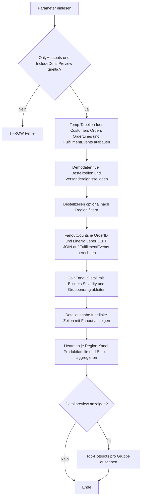

# JoinFanoutHeatmap.sql

Dieses Skript macht im Kapitel `03_JOIN` sichtbar, wie stark ein fachlich sauberer Join auf Bestellzeilenebene nachgelagerte Versandereignisse auffaechert. Statt nur einzelne Ausreisser zu listen, verdichtet es die Trefferzahl pro linker Zeile zu einer kleinen Heatmap je Region, Vertriebskanal und Produktfamilie.

## Uebersicht

<!-- SQLDOC:SUMMARY_TABLE:BEGIN -->
| Feld | Wert |
|---|---|
| Script | [JoinFanoutHeatmap.sql](JoinFanoutHeatmap.sql) |
| Version | `1.0` |
| Typ | `didactic-lab` |
| Kapitel | `03_JOIN` |
| Sicherheit | `read-only-tempdb` |
| Zweck | Macht sichtbar, wie stark ein Join auf Zeilenebene je Region, Vertriebskanal und Produktfamilie auffaechert, und verdichtet die Trefferzahl pro linker Zeile zu einer kleinen Fanout-Heatmap. |
<!-- SQLDOC:SUMMARY_TABLE:END -->

## Einordnung

Join-Fanout ist nicht automatisch ein Fehler. In vielen Prozessen haengen an einer fachlichen Zeile mehrere technische Ereignisse, etwa Picking-, Packing- oder Carrier-Scans. Kritisch wird es erst, wenn diese Mehrfachtreffer unbemerkt in spaetere Aggregationen einfliessen. Das Skript macht deshalb nicht nur Einzelzeilen sichtbar, sondern zeigt die Verteilung der Treffermengen pro Gruppe.

## Annahmen

- Die linke Seite des Joins ist die Bestellzeile mit dem Grain `OrderID + LineNo`.
- Die rechte Seite modelliert Versand- und Fulfillment-Ereignisse, die fachlich legitim mehrfach pro Zeile auftreten duerfen.
- Ein hoher Fanout ist hier ein Diagnose-Signal fuer Review und Aggregations-Checks, nicht automatisch eine fachliche Verletzung.
- Die Heatmap bleibt bewusst didaktisch und nutzt nur tempdb-Objekte statt produktiver Tabellen.

## Anwendungsfall

Die erste Ausgabe zeigt jede linke Zeile mit ihrer Trefferzahl und einem Fanout-Bucket. Die zweite Ausgabe verdichtet diese Werte zu einer Heatmap je Region, Vertriebskanal und Produktfamilie. Optional liefert ein drittes Resultset die fanout-staerksten Einzelzeilen pro Gruppe, damit Hotspots sofort nachvollziehbar bleiben.

## Parameter

<!-- SQLDOC:PARAMETERS_TABLE:BEGIN -->
| Parameter | SQL-Typ | Pflicht | Beschreibung |
|---|---|---|---|
| `@RegionFilter` | `NVARCHAR(20)` | Nein | Optionaler Filter auf eine Vertriebsregion. |
| `@OnlyHotspots` | `BIT` | Nein | Zeigt bei `1` nur Gruppen oder Zeilen mit Fanout ueber 1, bei `0` auch stabile Gruppen. |
| `@IncludeDetailPreview` | `BIT` | Nein | Steuert ein zusaetzliches Resultset mit den fanout-staerksten Einzelzeilen. |
<!-- SQLDOC:PARAMETERS_TABLE:END -->

## Abhaengigkeiten

<!-- SQLDOC:DEPENDENCIES_LIST:BEGIN -->
- `tempdb`
- `temp tables`
- `CTE`
- `LEFT JOIN`
- `GROUP BY`
- `ROW_NUMBER`
<!-- SQLDOC:DEPENDENCIES_LIST:END -->

## Hinweise

- `MatchedEventCount` ist die Zahl rechter Treffer pro linker Bestellzeile nach dem exakten Join ueber `OrderID + LineNo`.
- Die Bucketisierung `0`, `1`, `2`, `3`, `4+` hilft dabei, aus Detailtreffern schnell eine gruppierte Fanout-Sicht zu bauen.
- `HotspotRowCount` in der Heatmap zaehlt nur Zeilen mit mehr als einem Treffer und eignet sich als kompakter Review-Indikator vor spaeteren Summenbildungen.

## Versionshistorie

<!-- SQLDOC:VERSION_HISTORY_TABLE:BEGIN -->
| Version | Datum | User | Beschreibung |
|---|---|---|---|
| `1.0` | `2026-04-17` | `ER` | Erstversion fuer eine didaktische Heatmap zu Join-Fanout |
<!-- SQLDOC:VERSION_HISTORY_TABLE:END -->

## Ablauf

<!-- SQLDOC:MERMAID:BEGIN -->

<!-- SQLDOC:MERMAID:END -->

## SQL-Code

<!-- SQLDOC:SQL_CODE:BEGIN -->
```sql
/*
BEGIN:SQL-HEADER v1
---
sql_header: v1
script_name: "JoinFanoutHeatmap.sql"
script_version: "1.0"
script_type: "didactic-lab"
chapter: "03_JOIN"
purpose: >
  Macht sichtbar, wie stark ein Join auf Zeilenebene je Region,
  Vertriebskanal und Produktfamilie auffaechert, und verdichtet die
  Trefferzahl pro linker Zeile zu einer kleinen Fanout-Heatmap.
parameters:
  - name: "@RegionFilter"
    sql_type: "NVARCHAR(20)"
    direction: "IN"
    required: false
    description: "Optionaler Filter auf eine Vertriebsregion"
  - name: "@OnlyHotspots"
    sql_type: "BIT"
    direction: "IN"
    required: false
    description: "1 = nur Gruppen mit Fanout ueber 1 zeigen, 0 = auch stabile Gruppen anzeigen"
  - name: "@IncludeDetailPreview"
    sql_type: "BIT"
    direction: "IN"
    required: false
    description: "1 = zusaetzliches Resultset mit den fanout-staerksten Einzelzeilen ausgeben"
result_sets:
  - name: "JoinFanoutDetail"
    description: "Zeigt pro linker Join-Zeile die Anzahl passender rechter Zeilen und den Fanout-Bucket"
  - name: "JoinFanoutHeatmap"
    description: "Verdichtet Fanout-Buckets je Region, Vertriebskanal und Produktfamilie"
  - name: "FanoutHotspotPreview"
    description: "Optionaler Ausschnitt der linken Zeilen mit besonders hohem Fanout"
dependencies:
  - "tempdb"
  - "temp tables"
  - "CTE"
  - "LEFT JOIN"
  - "GROUP BY"
  - "ROW_NUMBER"
safety:
  level: "read-only-tempdb"
  writes_data: false
documentation:
  markdown_file: "T-SQL/03_JOIN/SQLScripts/JoinFanoutHeatmap.md"
  sync_blocks:
    - "SUMMARY_TABLE"
    - "PARAMETERS_TABLE"
    - "DEPENDENCIES_LIST"
    - "VERSION_HISTORY_TABLE"
    - "SQL_CODE"
  mermaid:
    mode: "ai-agent-from-sql"
    source: "script-body"
main_responsible:
  name: "Erhard Rainer"
  initials: "ER"
version_history:
  - version: "1.0"
    date: "2026-04-17"
    user: "ER"
    description: "Erstversion fuer eine didaktische Heatmap zu Join-Fanout"
notes:
  - "Das Skript nutzt nur temp-Objekte und modelliert Versandereignisse pro Bestellzeile."
  - "Fanout meint hier die Anzahl passender rechter Join-Zeilen pro linker Zeile nach einem exakten Join ueber OrderID und LineNo."
---
END:SQL-HEADER v1
*/

SET NOCOUNT ON;

DECLARE @RegionFilter NVARCHAR(20) = NULL;
DECLARE @OnlyHotspots BIT = 1;
DECLARE @IncludeDetailPreview BIT = 1;

IF @OnlyHotspots NOT IN (0, 1)
BEGIN
    THROW 50000, '@OnlyHotspots muss 0 oder 1 sein.', 1;
END;

IF @IncludeDetailPreview NOT IN (0, 1)
BEGIN
    THROW 50000, '@IncludeDetailPreview muss 0 oder 1 sein.', 1;
END;

DROP TABLE IF EXISTS #Customers;
DROP TABLE IF EXISTS #Orders;
DROP TABLE IF EXISTS #OrderLines;
DROP TABLE IF EXISTS #FulfillmentEvents;
DROP TABLE IF EXISTS #FilteredOrderLines;

CREATE TABLE #Customers
(
    CustomerID INT NOT NULL PRIMARY KEY,
    CustomerName NVARCHAR(100) NOT NULL,
    RegionCode NVARCHAR(20) NOT NULL,
    SegmentCode NVARCHAR(20) NOT NULL
);

CREATE TABLE #Orders
(
    OrderID INT NOT NULL PRIMARY KEY,
    CustomerID INT NOT NULL,
    SalesChannel NVARCHAR(30) NOT NULL,
    OrderDate DATE NOT NULL
);

CREATE TABLE #OrderLines
(
    OrderID INT NOT NULL,
    LineNo INT NOT NULL,
    ProductFamily NVARCHAR(30) NOT NULL,
    Quantity INT NOT NULL,
    NetAmount DECIMAL(10,2) NOT NULL,
    CONSTRAINT PK_OrderLines PRIMARY KEY (OrderID, LineNo)
);

CREATE TABLE #FulfillmentEvents
(
    EventID INT NOT NULL PRIMARY KEY,
    OrderID INT NOT NULL,
    LineNo INT NOT NULL,
    EventType NVARCHAR(30) NOT NULL,
    EventSource NVARCHAR(30) NOT NULL,
    EventTime DATETIME2(0) NOT NULL
);

INSERT INTO #Customers (CustomerID, CustomerName, RegionCode, SegmentCode)
VALUES
    (1, N'Aster Bikes', N'NORTH', N'B2B'),
    (2, N'Blue Harbor Retail', N'NORTH', N'Retail'),
    (3, N'Cedar Labs', N'SOUTH', N'Education'),
    (4, N'Delta Outfitters', N'WEST', N'Retail');

INSERT INTO #Orders (OrderID, CustomerID, SalesChannel, OrderDate)
VALUES
    (1001, 1, N'Portal', '2026-04-01'),
    (1002, 1, N'Portal', '2026-04-02'),
    (1003, 2, N'SalesDesk', '2026-04-02'),
    (1004, 3, N'Marketplace', '2026-04-03'),
    (1005, 4, N'Marketplace', '2026-04-03');

INSERT INTO #OrderLines (OrderID, LineNo, ProductFamily, Quantity, NetAmount)
VALUES
    (1001, 1, N'Bike', 2, 400.00),
    (1001, 2, N'Accessory', 1, 25.00),
    (1002, 1, N'Accessory', 4, 40.00),
    (1002, 2, N'Service', 1, 90.00),
    (1003, 1, N'Bike', 1, 650.00),
    (1003, 2, N'Accessory', 2, 36.00),
    (1004, 1, N'Bike', 1, 510.00),
    (1004, 2, N'Service', 1, 120.00),
    (1005, 1, N'Accessory', 3, 54.00);

INSERT INTO #FulfillmentEvents (EventID, OrderID, LineNo, EventType, EventSource, EventTime)
VALUES
    (1, 1001, 1, N'picking', N'WMS', '2026-04-01T09:00:00'),
    (2, 1001, 1, N'packing', N'WMS', '2026-04-01T09:20:00'),
    (3, 1001, 1, N'label', N'ShippingAPI', '2026-04-01T09:25:00'),
    (4, 1001, 2, N'picking', N'WMS', '2026-04-01T09:05:00'),
    (5, 1002, 1, N'picking', N'WMS', '2026-04-02T10:00:00'),
    (6, 1002, 1, N'packing', N'WMS', '2026-04-02T10:10:00'),
    (7, 1002, 1, N'label', N'ShippingAPI', '2026-04-02T10:12:00'),
    (8, 1002, 1, N'handover', N'Carrier', '2026-04-02T10:40:00'),
    (9, 1002, 2, N'picking', N'WMS', '2026-04-02T10:05:00'),
    (10, 1003, 1, N'picking', N'WMS', '2026-04-02T11:00:00'),
    (11, 1003, 1, N'packing', N'WMS', '2026-04-02T11:15:00'),
    (12, 1003, 2, N'picking', N'WMS', '2026-04-02T11:02:00'),
    (13, 1004, 1, N'picking', N'WMS', '2026-04-03T08:00:00'),
    (14, 1004, 1, N'packing', N'WMS', '2026-04-03T08:20:00'),
    (15, 1004, 1, N'label', N'ShippingAPI', '2026-04-03T08:24:00'),
    (16, 1004, 1, N'carrier-scan', N'Carrier', '2026-04-03T08:55:00'),
    (17, 1004, 2, N'picking', N'WMS', '2026-04-03T08:05:00'),
    (18, 1005, 1, N'picking', N'WMS', '2026-04-03T12:10:00'),
    (19, 1005, 1, N'packing', N'WMS', '2026-04-03T12:18:00'),
    (20, 1005, 1, N'label', N'ShippingAPI', '2026-04-03T12:19:00'),
    (21, 1005, 1, N'carrier-scan', N'Carrier', '2026-04-03T12:50:00'),
    (22, 1005, 1, N'delivery-confirmed', N'Carrier', '2026-04-04T15:10:00');

SELECT
    c.RegionCode,
    c.SegmentCode,
    c.CustomerName,
    o.OrderID,
    o.SalesChannel,
    o.OrderDate,
    ol.LineNo,
    ol.ProductFamily,
    ol.Quantity,
    ol.NetAmount
INTO #FilteredOrderLines
FROM #OrderLines AS ol
INNER JOIN #Orders AS o
    ON o.OrderID = ol.OrderID
INNER JOIN #Customers AS c
    ON c.CustomerID = o.CustomerID
WHERE @RegionFilter IS NULL
   OR c.RegionCode = @RegionFilter;

;WITH FanoutCounts AS
(
    SELECT
        fol.RegionCode,
        fol.SegmentCode,
        fol.CustomerName,
        fol.OrderID,
        fol.SalesChannel,
        fol.OrderDate,
        fol.LineNo,
        fol.ProductFamily,
        fol.Quantity,
        fol.NetAmount,
        COUNT(fe.EventID) AS MatchedEventCount,
        MIN(fe.EventTime) AS FirstEventTime,
        MAX(fe.EventTime) AS LastEventTime
    FROM #FilteredOrderLines AS fol
    LEFT JOIN #FulfillmentEvents AS fe
        ON fe.OrderID = fol.OrderID
       AND fe.LineNo = fol.LineNo
    GROUP BY
        fol.RegionCode,
        fol.SegmentCode,
        fol.CustomerName,
        fol.OrderID,
        fol.SalesChannel,
        fol.OrderDate,
        fol.LineNo,
        fol.ProductFamily,
        fol.Quantity,
        fol.NetAmount
),
JoinFanoutDetail AS
(
    SELECT
        fc.RegionCode,
        fc.SegmentCode,
        fc.CustomerName,
        fc.OrderID,
        fc.SalesChannel,
        fc.OrderDate,
        fc.LineNo,
        fc.ProductFamily,
        fc.Quantity,
        fc.NetAmount,
        fc.MatchedEventCount,
        fc.FirstEventTime,
        fc.LastEventTime,
        CASE
            WHEN fc.MatchedEventCount = 0 THEN '0'
            WHEN fc.MatchedEventCount = 1 THEN '1'
            WHEN fc.MatchedEventCount = 2 THEN '2'
            WHEN fc.MatchedEventCount = 3 THEN '3'
            ELSE '4+'
        END AS FanoutBucket,
        CASE
            WHEN fc.MatchedEventCount >= 4 THEN 'hotspot'
            WHEN fc.MatchedEventCount >= 2 THEN 'elevated'
            WHEN fc.MatchedEventCount = 1 THEN 'stable'
            ELSE 'unmatched'
        END AS FanoutSeverity,
        ROW_NUMBER() OVER
        (
            PARTITION BY fc.RegionCode, fc.SalesChannel, fc.ProductFamily
            ORDER BY fc.MatchedEventCount DESC, fc.NetAmount DESC, fc.OrderID, fc.LineNo
        ) AS SeverityRankInGroup
    FROM FanoutCounts AS fc
)
SELECT
    jfd.RegionCode,
    jfd.SegmentCode,
    jfd.CustomerName,
    jfd.SalesChannel,
    jfd.ProductFamily,
    jfd.OrderID,
    jfd.OrderDate,
    jfd.LineNo,
    jfd.Quantity,
    jfd.NetAmount,
    jfd.MatchedEventCount,
    jfd.FanoutBucket,
    jfd.FanoutSeverity,
    jfd.FirstEventTime,
    jfd.LastEventTime
FROM JoinFanoutDetail AS jfd
WHERE @OnlyHotspots = 0
   OR jfd.MatchedEventCount > 1
ORDER BY
    jfd.MatchedEventCount DESC,
    jfd.RegionCode,
    jfd.SalesChannel,
    jfd.ProductFamily,
    jfd.OrderID,
    jfd.LineNo;

SELECT
    jfd.RegionCode,
    jfd.SalesChannel,
    jfd.ProductFamily,
    jfd.FanoutBucket,
    COUNT(*) AS LeftRowCount,
    SUM(jfd.MatchedEventCount) AS JoinedRowCount,
    CAST(AVG(CAST(jfd.MatchedEventCount AS DECIMAL(10,2))) AS DECIMAL(10,2)) AS AvgMatchesPerLeftRow,
    MAX(jfd.MatchedEventCount) AS MaxMatchesPerLeftRow,
    SUM(CASE WHEN jfd.MatchedEventCount > 1 THEN 1 ELSE 0 END) AS HotspotRowCount
FROM JoinFanoutDetail AS jfd
WHERE @OnlyHotspots = 0
   OR jfd.MatchedEventCount > 1
GROUP BY
    jfd.RegionCode,
    jfd.SalesChannel,
    jfd.ProductFamily,
    jfd.FanoutBucket
ORDER BY
    jfd.RegionCode,
    jfd.SalesChannel,
    jfd.ProductFamily,
    CASE jfd.FanoutBucket
        WHEN '0' THEN 0
        WHEN '1' THEN 1
        WHEN '2' THEN 2
        WHEN '3' THEN 3
        ELSE 4
    END;

IF @IncludeDetailPreview = 1
BEGIN
    SELECT
        jfd.RegionCode,
        jfd.SalesChannel,
        jfd.ProductFamily,
        jfd.CustomerName,
        jfd.OrderID,
        jfd.LineNo,
        jfd.NetAmount,
        jfd.MatchedEventCount,
        jfd.FanoutBucket,
        jfd.FanoutSeverity,
        jfd.FirstEventTime,
        jfd.LastEventTime
    FROM JoinFanoutDetail AS jfd
    WHERE jfd.SeverityRankInGroup <= 3
      AND jfd.MatchedEventCount > 1
    ORDER BY
        jfd.RegionCode,
        jfd.SalesChannel,
        jfd.ProductFamily,
        jfd.MatchedEventCount DESC,
        jfd.OrderID,
        jfd.LineNo;
END;
```
<!-- SQLDOC:SQL_CODE:END -->
