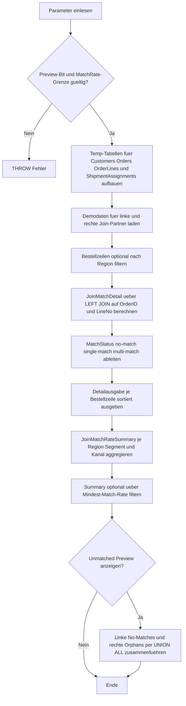

# JoinMatchRateProfiler.sql

Dieses Skript profiliert im Kapitel `03_JOIN`, wie gut zwei Join-Partner wirklich zueinander passen. Auf der linken Seite stehen Bestellzeilen, auf der rechten Seite Versandzuordnungen. Die Auswertung zeigt pro linker Zeile, ob kein Treffer, genau ein Treffer oder mehrere Treffer vorliegen, und verdichtet diese Sicht zu Match- und Nicht-Match-Raten.

## Uebersicht

<!-- SQLDOC:SUMMARY_TABLE:BEGIN -->
| Feld | Wert |
|---|---|
| Script | [JoinMatchRateProfiler.sql](JoinMatchRateProfiler.sql) |
| Version | `1.0` |
| Typ | `didactic-lab` |
| Kapitel | `03_JOIN` |
| Sicherheit | `read-only-tempdb` |
| Zweck | Profiliert Match- und Nicht-Match-Raten zwischen Bestellzeilen und Versandzuordnungen, damit Join-Luecken und asymmetrische Trefferbilder frueh sichtbar werden. |
<!-- SQLDOC:SUMMARY_TABLE:END -->

## Einordnung

Bei Join-Reviews reicht es oft nicht, nur auf komplett fehlende Treffer zu schauen. Auch Mehrfachtreffer koennen problematisch sein, weil sie spaetere Aggregationen aufblasen. Das Skript trennt deshalb `no-match`, `single-match` und `multi-match` und verdichtet diese Kategorien anschliessend pro Region, Segment und Vertriebskanal.

## Annahmen

- Die linke Seite modelliert Bestellzeilen mit dem Grain `OrderID + LineNo`.
- Die rechte Seite modelliert Versandzuordnungen, die je nach Prozess einmalig, mehrfach oder gar nicht zu einer Bestellzeile existieren koennen.
- Ein `multi-match` ist hier zunaechst ein Diagnose-Signal fuer Daten- oder Prozessreview und nicht automatisch fachlich falsch.
- Das Beispiel nutzt nur tempdb-Objekte und dokumentiert bewusst auch rechte Orphan-Zeilen ohne passenden linken Join-Partner.

## Anwendungsfall

Die Detailausgabe zeigt pro linker Zeile die Trefferzahl und den Match-Status. Die Summary verdichtet daraus Match-, No-Match- und Multi-Match-Raten je Gruppe. Optional zeigt ein drittes Resultset sowohl linke Zeilen ohne Treffer als auch rechte Versandzuordnungen ohne passende linke Zeile.

## Parameter

<!-- SQLDOC:PARAMETERS_TABLE:BEGIN -->
| Parameter | SQL-Typ | Pflicht | Beschreibung |
|---|---|---|---|
| `@RegionFilter` | `NVARCHAR(20)` | Nein | Optionaler Filter auf eine Vertriebsregion. |
| `@MinimumMatchRatePct` | `DECIMAL(5,2)` | Nein | Untergrenze fuer die Summary-Ausgabe in Prozent; `NULL` zeigt alle Gruppen. |
| `@IncludeUnmatchedPreview` | `BIT` | Nein | Steuert eine zusaetzliche Vorschau auf nicht gematchte linke und rechte Zeilen. |
<!-- SQLDOC:PARAMETERS_TABLE:END -->

## Abhaengigkeiten

<!-- SQLDOC:DEPENDENCIES_LIST:BEGIN -->
- `tempdb`
- `temp tables`
- `CTE`
- `LEFT JOIN`
- `UNION ALL`
- `GROUP BY`
<!-- SQLDOC:DEPENDENCIES_LIST:END -->

## Hinweise

- `MatchRatePct` misst den Anteil linker Zeilen mit mindestens einem Treffer.
- `NoMatchRatePct` zeigt Luecken auf der linken Seite, also Bestellzeilen ohne Versandzuordnung.
- `MultiMatchRatePct` zeigt Gruppen, in denen eine linke Zeile mehrfach an Versandzuordnungen haengt.
- Die Preview kombiniert linke und rechte Nicht-Matches in einem Resultset, damit beide Richtungen des Problems sichtbar bleiben.

## Versionshistorie

<!-- SQLDOC:VERSION_HISTORY_TABLE:BEGIN -->
| Version | Datum | User | Beschreibung |
|---|---|---|---|
| `1.0` | `2026-04-22` | `ER` | Erstversion fuer didaktisches Match-Rate-Profiling von Join-Partnern |
<!-- SQLDOC:VERSION_HISTORY_TABLE:END -->

## Ablauf

<!-- SQLDOC:MERMAID:BEGIN -->

<!-- SQLDOC:MERMAID:END -->

## SQL-Code

<!-- SQLDOC:SQL_CODE:BEGIN -->
```sql
/*
BEGIN:SQL-HEADER v1
---
sql_header: v1
script_name: "JoinMatchRateProfiler.sql"
script_version: "1.0"
script_type: "didactic-lab"
chapter: "03_JOIN"
purpose: >
  Profiliert Match- und Nicht-Match-Raten zwischen einer linken Menge aus
  Bestellzeilen und einer rechten Menge aus Versandzuordnungen, damit
  Join-Luecken und asymmetrische Trefferbilder frueh sichtbar werden.
parameters:
  - name: "@RegionFilter"
    sql_type: "NVARCHAR(20)"
    direction: "IN"
    required: false
    description: "Optionaler Filter auf eine Vertriebsregion"
  - name: "@MinimumMatchRatePct"
    sql_type: "DECIMAL(5,2)"
    direction: "IN"
    required: false
    description: "Untergrenze fuer die Summary-Ausgabe in Prozent; NULL zeigt alle Gruppen"
  - name: "@IncludeUnmatchedPreview"
    sql_type: "BIT"
    direction: "IN"
    required: false
    description: "1 = zusaetzliche Vorschau auf nicht gematchte linke und rechte Zeilen anzeigen"
result_sets:
  - name: "JoinMatchDetail"
    description: "Zeigt pro Bestellzeile, ob und wie oft eine Versandzuordnung getroffen wurde"
  - name: "JoinMatchRateSummary"
    description: "Verdichtet Match- und Nicht-Match-Raten je Region, Kanal und Segment"
  - name: "JoinUnmatchedPreview"
    description: "Optionaler Auszug nicht gematchter linker und rechter Zeilen"
dependencies:
  - "tempdb"
  - "temp tables"
  - "CTE"
  - "LEFT JOIN"
  - "UNION ALL"
  - "GROUP BY"
safety:
  level: "read-only-tempdb"
  writes_data: false
documentation:
  markdown_file: "T-SQL/03_JOIN/SQLScripts/JoinMatchRateProfiler.md"
  sync_blocks:
    - "SUMMARY_TABLE"
    - "PARAMETERS_TABLE"
    - "DEPENDENCIES_LIST"
    - "VERSION_HISTORY_TABLE"
    - "SQL_CODE"
  mermaid:
    mode: "ai-agent-from-sql"
    source: "script-body"
main_responsible:
  name: "Erhard Rainer"
  initials: "ER"
version_history:
  - version: "1.0"
    date: "2026-04-22"
    user: "ER"
    description: "Erstversion fuer didaktisches Match-Rate-Profiling von Join-Partnern"
notes:
  - "Die linke Seite repraesentiert Bestellzeilen, die rechte Seite absichtlich unvollstaendige Versandzuordnungen."
  - "Nicht-Matches werden bewusst als Diagnose-Signal modelliert und nicht als fachlicher Fehlerfall automatisiert behandelt."
---
END:SQL-HEADER v1
*/

SET NOCOUNT ON;

DECLARE @RegionFilter NVARCHAR(20) = NULL;
DECLARE @MinimumMatchRatePct DECIMAL(5,2) = NULL;
DECLARE @IncludeUnmatchedPreview BIT = 1;

IF @IncludeUnmatchedPreview NOT IN (0, 1)
BEGIN
    THROW 50000, '@IncludeUnmatchedPreview muss 0 oder 1 sein.', 1;
END;

IF @MinimumMatchRatePct IS NOT NULL
   AND (@MinimumMatchRatePct < 0 OR @MinimumMatchRatePct > 100)
BEGIN
    THROW 50000, '@MinimumMatchRatePct muss zwischen 0 und 100 liegen.', 1;
END;

DROP TABLE IF EXISTS #Customers;
DROP TABLE IF EXISTS #Orders;
DROP TABLE IF EXISTS #OrderLines;
DROP TABLE IF EXISTS #ShipmentAssignments;
DROP TABLE IF EXISTS #FilteredOrderLines;

CREATE TABLE #Customers
(
    CustomerID INT NOT NULL PRIMARY KEY,
    CustomerName NVARCHAR(100) NOT NULL,
    RegionCode NVARCHAR(20) NOT NULL,
    SegmentCode NVARCHAR(20) NOT NULL
);

CREATE TABLE #Orders
(
    OrderID INT NOT NULL PRIMARY KEY,
    CustomerID INT NOT NULL,
    SalesChannel NVARCHAR(30) NOT NULL,
    OrderDate DATE NOT NULL
);

CREATE TABLE #OrderLines
(
    OrderID INT NOT NULL,
    LineNo INT NOT NULL,
    ProductFamily NVARCHAR(30) NOT NULL,
    Quantity INT NOT NULL,
    NetAmount DECIMAL(10,2) NOT NULL,
    CONSTRAINT PK_OrderLines PRIMARY KEY (OrderID, LineNo)
);

CREATE TABLE #ShipmentAssignments
(
    AssignmentID INT NOT NULL PRIMARY KEY,
    OrderID INT NOT NULL,
    LineNo INT NOT NULL,
    ShipmentBatch NVARCHAR(30) NOT NULL,
    AssignmentStatus NVARCHAR(20) NOT NULL,
    AssignedAt DATETIME2(0) NOT NULL
);

INSERT INTO #Customers (CustomerID, CustomerName, RegionCode, SegmentCode)
VALUES
    (1, N'Aster Bikes', N'NORTH', N'B2B'),
    (2, N'Blue Harbor Retail', N'NORTH', N'Retail'),
    (3, N'Cedar Labs', N'SOUTH', N'Education'),
    (4, N'Delta Outfitters', N'WEST', N'Retail');

INSERT INTO #Orders (OrderID, CustomerID, SalesChannel, OrderDate)
VALUES
    (1001, 1, N'Portal', '2026-04-01'),
    (1002, 1, N'Portal', '2026-04-02'),
    (1003, 2, N'SalesDesk', '2026-04-02'),
    (1004, 3, N'Marketplace', '2026-04-03'),
    (1005, 4, N'Marketplace', '2026-04-03');

INSERT INTO #OrderLines (OrderID, LineNo, ProductFamily, Quantity, NetAmount)
VALUES
    (1001, 1, N'Bike', 2, 400.00),
    (1001, 2, N'Accessory', 1, 25.00),
    (1001, 3, N'Service', 1, 90.00),
    (1002, 1, N'Accessory', 4, 40.00),
    (1002, 2, N'Service', 1, 120.00),
    (1003, 1, N'Bike', 1, 650.00),
    (1003, 2, N'Accessory', 2, 36.00),
    (1004, 1, N'Bike', 1, 510.00),
    (1004, 2, N'Service', 1, 120.00),
    (1005, 1, N'Accessory', 3, 54.00);

INSERT INTO #ShipmentAssignments (AssignmentID, OrderID, LineNo, ShipmentBatch, AssignmentStatus, AssignedAt)
VALUES
    (1, 1001, 1, N'BATCH-001', N'assigned', '2026-04-01T09:10:00'),
    (2, 1001, 2, N'BATCH-001', N'assigned', '2026-04-01T09:12:00'),
    (3, 1001, 2, N'BATCH-RECHECK', N'reassigned', '2026-04-01T09:25:00'),
    (4, 1002, 1, N'BATCH-002', N'assigned', '2026-04-02T10:15:00'),
    (5, 1003, 1, N'BATCH-003', N'assigned', '2026-04-02T11:15:00'),
    (6, 1003, 1, N'BATCH-003A', N'reassigned', '2026-04-02T11:21:00'),
    (7, 1004, 1, N'BATCH-004', N'assigned', '2026-04-03T08:10:00'),
    (8, 1004, 3, N'BATCH-ORPHAN', N'assigned', '2026-04-03T08:30:00'),
    (9, 1005, 1, N'BATCH-005', N'assigned', '2026-04-03T12:20:00');

SELECT
    c.RegionCode,
    c.SegmentCode,
    c.CustomerName,
    o.OrderID,
    o.SalesChannel,
    o.OrderDate,
    ol.LineNo,
    ol.ProductFamily,
    ol.Quantity,
    ol.NetAmount
INTO #FilteredOrderLines
FROM #OrderLines AS ol
INNER JOIN #Orders AS o
    ON o.OrderID = ol.OrderID
INNER JOIN #Customers AS c
    ON c.CustomerID = o.CustomerID
WHERE @RegionFilter IS NULL
   OR c.RegionCode = @RegionFilter;

;WITH JoinMatchDetail AS
(
    SELECT
        fol.RegionCode,
        fol.SegmentCode,
        fol.CustomerName,
        fol.OrderID,
        fol.SalesChannel,
        fol.OrderDate,
        fol.LineNo,
        fol.ProductFamily,
        fol.Quantity,
        fol.NetAmount,
        COUNT(sa.AssignmentID) AS MatchCount,
        CASE
            WHEN COUNT(sa.AssignmentID) = 0 THEN N'no-match'
            WHEN COUNT(sa.AssignmentID) = 1 THEN N'single-match'
            ELSE N'multi-match'
        END AS MatchStatus,
        MIN(sa.AssignedAt) AS FirstAssignedAt,
        MAX(sa.AssignedAt) AS LastAssignedAt
    FROM #FilteredOrderLines AS fol
    LEFT JOIN #ShipmentAssignments AS sa
        ON sa.OrderID = fol.OrderID
       AND sa.LineNo = fol.LineNo
    GROUP BY
        fol.RegionCode,
        fol.SegmentCode,
        fol.CustomerName,
        fol.OrderID,
        fol.SalesChannel,
        fol.OrderDate,
        fol.LineNo,
        fol.ProductFamily,
        fol.Quantity,
        fol.NetAmount
),
JoinMatchRateSummary AS
(
    SELECT
        jmd.RegionCode,
        jmd.SegmentCode,
        jmd.SalesChannel,
        COUNT(*) AS LeftRowCount,
        SUM(CASE WHEN jmd.MatchCount > 0 THEN 1 ELSE 0 END) AS MatchedLeftRows,
        SUM(CASE WHEN jmd.MatchCount = 0 THEN 1 ELSE 0 END) AS UnmatchedLeftRows,
        SUM(CASE WHEN jmd.MatchCount > 1 THEN 1 ELSE 0 END) AS MultiMatchLeftRows,
        CAST(100.0 * SUM(CASE WHEN jmd.MatchCount > 0 THEN 1 ELSE 0 END) / NULLIF(COUNT(*), 0) AS DECIMAL(5,2)) AS MatchRatePct,
        CAST(100.0 * SUM(CASE WHEN jmd.MatchCount = 0 THEN 1 ELSE 0 END) / NULLIF(COUNT(*), 0) AS DECIMAL(5,2)) AS NoMatchRatePct,
        CAST(100.0 * SUM(CASE WHEN jmd.MatchCount > 1 THEN 1 ELSE 0 END) / NULLIF(COUNT(*), 0) AS DECIMAL(5,2)) AS MultiMatchRatePct
    FROM JoinMatchDetail AS jmd
    GROUP BY
        jmd.RegionCode,
        jmd.SegmentCode,
        jmd.SalesChannel
)
SELECT
    jmd.RegionCode,
    jmd.SegmentCode,
    jmd.CustomerName,
    jmd.OrderID,
    jmd.SalesChannel,
    jmd.OrderDate,
    jmd.LineNo,
    jmd.ProductFamily,
    jmd.Quantity,
    jmd.NetAmount,
    jmd.MatchCount,
    jmd.MatchStatus,
    jmd.FirstAssignedAt,
    jmd.LastAssignedAt
FROM JoinMatchDetail AS jmd
ORDER BY
    CASE jmd.MatchStatus
        WHEN N'no-match' THEN 0
        WHEN N'multi-match' THEN 1
        ELSE 2
    END,
    jmd.RegionCode,
    jmd.SalesChannel,
    jmd.OrderID,
    jmd.LineNo;

SELECT
    jmrs.RegionCode,
    jmrs.SegmentCode,
    jmrs.SalesChannel,
    jmrs.LeftRowCount,
    jmrs.MatchedLeftRows,
    jmrs.UnmatchedLeftRows,
    jmrs.MultiMatchLeftRows,
    jmrs.MatchRatePct,
    jmrs.NoMatchRatePct,
    jmrs.MultiMatchRatePct
FROM JoinMatchRateSummary AS jmrs
WHERE @MinimumMatchRatePct IS NULL
   OR jmrs.MatchRatePct >= @MinimumMatchRatePct
ORDER BY
    jmrs.MatchRatePct ASC,
    jmrs.NoMatchRatePct DESC,
    jmrs.MultiMatchRatePct DESC,
    jmrs.RegionCode,
    jmrs.SalesChannel;

IF @IncludeUnmatchedPreview = 1
BEGIN
    ;WITH LeftUnmatched AS
    (
        SELECT
            N'left-no-match' AS PreviewType,
            fol.RegionCode,
            fol.CustomerName,
            fol.OrderID,
            fol.LineNo,
            fol.ProductFamily,
            CAST(NULL AS NVARCHAR(30)) AS ShipmentBatch,
            CAST(NULL AS NVARCHAR(20)) AS AssignmentStatus,
            CAST(NULL AS DATETIME2(0)) AS AssignedAt
        FROM #FilteredOrderLines AS fol
        LEFT JOIN #ShipmentAssignments AS sa
            ON sa.OrderID = fol.OrderID
           AND sa.LineNo = fol.LineNo
        WHERE sa.AssignmentID IS NULL
    ),
    RightUnmatched AS
    (
        SELECT
            N'right-no-match' AS PreviewType,
            CAST(NULL AS NVARCHAR(20)) AS RegionCode,
            CAST(NULL AS NVARCHAR(100)) AS CustomerName,
            sa.OrderID,
            sa.LineNo,
            CAST(NULL AS NVARCHAR(30)) AS ProductFamily,
            sa.ShipmentBatch,
            sa.AssignmentStatus,
            sa.AssignedAt
        FROM #ShipmentAssignments AS sa
        LEFT JOIN #FilteredOrderLines AS fol
            ON fol.OrderID = sa.OrderID
           AND fol.LineNo = sa.LineNo
        WHERE fol.OrderID IS NULL
    )
    SELECT
        preview.PreviewType,
        preview.RegionCode,
        preview.CustomerName,
        preview.OrderID,
        preview.LineNo,
        preview.ProductFamily,
        preview.ShipmentBatch,
        preview.AssignmentStatus,
        preview.AssignedAt
    FROM
    (
        SELECT * FROM LeftUnmatched
        UNION ALL
        SELECT * FROM RightUnmatched
    ) AS preview
    ORDER BY
        preview.PreviewType,
        preview.OrderID,
        preview.LineNo,
        preview.AssignedAt;
END;
```
<!-- SQLDOC:SQL_CODE:END -->
