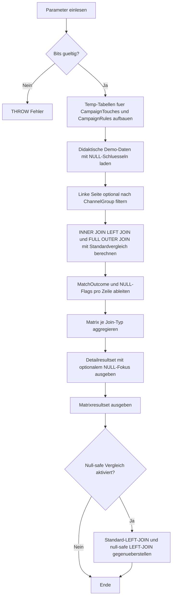

# JoinNullPropagationDemo.sql

Dieses Skript macht im Kapitel `03_JOIN` sichtbar, wie `NULL`-Werte in Join-Schluesseln durch verschiedene Join-Typen laufen. Es kontrastiert Standard-SQL-Semantik fuer `INNER JOIN`, `LEFT JOIN` und `FULL OUTER JOIN` mit einer optionalen null-safe Vergleichslogik, damit die Unterschiede direkt am Resultset lesbar werden.

## Uebersicht

<!-- SQLDOC:SUMMARY_TABLE:BEGIN -->
| Feld | Wert |
|---|---|
| Script | [JoinNullPropagationDemo.sql](JoinNullPropagationDemo.sql) |
| Version | `1.0` |
| Typ | `didactic-lab` |
| Kapitel | `03_JOIN` |
| Sicherheit | `read-only-tempdb` |
| Zweck | Macht sichtbar, wie NULL-Werte in Join-Schluesseln bei INNER JOIN, LEFT JOIN und FULL OUTER JOIN propagieren und wie sich eine explizit null-safe Vergleichslogik davon unterscheidet. |
<!-- SQLDOC:SUMMARY_TABLE:END -->

## Einordnung

Viele Join-Fehler entstehen nicht durch den Join-Typ allein, sondern durch stillschweigende Annahmen ueber `NULL`. In SQL Server gilt `NULL = NULL` nicht als wahr. Deshalb bleiben Zeilen mit fehlendem Join-Schluessel selbst dann ungematcht, wenn auf beiden Seiten `NULL` steht. Das Skript zeigt diese Semantik explizit und stellt ihr eine bewusst emulierte null-safe Variante gegenueber.

## Annahmen

- Die linke Seite modelliert Marketing-Touches mit optionalem `CampaignCode`.
- Die rechte Seite enthaelt Kampagnenregeln, darunter eine Fallback-Zeile mit `NULL` als fehlendem Schluessel.
- Die Datenbasis ist didaktisch und lebt ausschliesslich in tempdb-Objekten.
- Die null-safe Gegenueberstellung ist ein bewusstes Lernmuster und keine implizite Empfehlung fuer jede Produktionsabfrage.

## Anwendungsfall

Die Detailausgabe zeigt pro Join-Typ, welche Zeilen gematcht wurden, welche nur links oder nur rechts erscheinen und wo `NULL` im Join-Schluessel beteiligt war. Die zweite Ausgabe verdichtet die Zeilen zu einer kleinen Matrix je Join-Typ. Optional folgt eine dritte Ausgabe, die einen normalen `LEFT JOIN` direkt mit einer expliziten `NULL`-Gleichbehandlung vergleicht.

## Parameter

<!-- SQLDOC:PARAMETERS_TABLE:BEGIN -->
| Parameter | SQL-Typ | Pflicht | Beschreibung |
|---|---|---|---|
| `@ChannelGroupFilter` | `NVARCHAR(20)` | Nein | Optionaler Filter auf eine `ChannelGroup` der linken Seite. |
| `@IncludeNullSafeComparison` | `BIT` | Nein | Steuert die zusaetzliche Gegenueberstellung zwischen Standard-LEFT-JOIN und null-safe LEFT-JOIN. |
| `@OnlyShowNullSensitiveRows` | `BIT` | Nein | Zeigt bei `1` nur Zeilen mit `NULL`-Beteiligung oder fehlendem Match, bei `0` alle Zeilen. |
<!-- SQLDOC:PARAMETERS_TABLE:END -->

## Abhaengigkeiten

<!-- SQLDOC:DEPENDENCIES_LIST:BEGIN -->
- `tempdb`
- `temp tables`
- `CTE`
- `INNER JOIN`
- `LEFT JOIN`
- `FULL OUTER JOIN`
- `UNION ALL`
<!-- SQLDOC:DEPENDENCIES_LIST:END -->

## Hinweise

- Die Fallback-Regel mit `CampaignCode = NULL` matcht im Standard-Join nicht gegen linke `NULL`-Werte.
- `MatchedRowsWithLeftNull` bleibt in der Standardmatrix bewusst `0`, um diese Semantik sichtbar zu halten.
- Die null-safe Vergleichsausgabe zeigt, wie stark sich Resultsets aendern, sobald `NULL` explizit als Gleichheit behandelt wird.

## Versionshistorie

<!-- SQLDOC:VERSION_HISTORY_TABLE:BEGIN -->
| Version | Datum | User | Beschreibung |
|---|---|---|---|
| `1.0` | `2026-04-17` | `ER` | Erstversion fuer ein JOIN-Lab zur NULL-Propagation |
<!-- SQLDOC:VERSION_HISTORY_TABLE:END -->

## Ablauf

<!-- SQLDOC:MERMAID:BEGIN -->

<!-- SQLDOC:MERMAID:END -->

## SQL-Code

<!-- SQLDOC:SQL_CODE:BEGIN -->
```sql
/*
BEGIN:SQL-HEADER v1
---
sql_header: v1
script_name: "JoinNullPropagationDemo.sql"
script_version: "1.0"
script_type: "didactic-lab"
chapter: "03_JOIN"
purpose: >
  Macht sichtbar, wie NULL-Werte in Join-Schluesseln bei INNER JOIN,
  LEFT JOIN und FULL OUTER JOIN propagieren und wie sich eine explizit
  null-safe Vergleichslogik davon unterscheidet.
parameters:
  - name: "@ChannelGroupFilter"
    sql_type: "NVARCHAR(20)"
    direction: "IN"
    required: false
    description: "Optionaler Filter auf eine ChannelGroup der linken Seite"
  - name: "@IncludeNullSafeComparison"
    sql_type: "BIT"
    direction: "IN"
    required: false
    description: "1 = zusaetzliche Gegenueberstellung zwischen Standard-LEFT-JOIN und null-safe LEFT-JOIN ausgeben"
  - name: "@OnlyShowNullSensitiveRows"
    sql_type: "BIT"
    direction: "IN"
    required: false
    description: "1 = nur Zeilen mit NULL-Beteiligung oder fehlendem Match zeigen, 0 = alle Zeilen zeigen"
result_sets:
  - name: "JoinNullDetail"
    description: "Zeigt pro Join-Typ die resultierenden Zeilen inklusive Herkunft und NULL-Beteiligung"
  - name: "JoinNullMatrix"
    description: "Verdichtet pro Join-Typ, wie viele Matches, linke Luecken und rechte Luecken auftreten"
  - name: "NullSafeComparison"
    description: "Optionaler Vergleich zwischen Standard-LEFT-JOIN und emulierter NULL-Gleichbehandlung"
dependencies:
  - "tempdb"
  - "temp tables"
  - "CTE"
  - "INNER JOIN"
  - "LEFT JOIN"
  - "FULL OUTER JOIN"
  - "UNION ALL"
safety:
  level: "read-only-tempdb"
  writes_data: false
documentation:
  markdown_file: "T-SQL/03_JOIN/SQLScripts/JoinNullPropagationDemo.md"
  sync_blocks:
    - "SUMMARY_TABLE"
    - "PARAMETERS_TABLE"
    - "DEPENDENCIES_LIST"
    - "VERSION_HISTORY_TABLE"
    - "SQL_CODE"
  mermaid:
    mode: "ai-agent-from-sql"
    source: "script-body"
main_responsible:
  name: "Erhard Rainer"
  initials: "ER"
version_history:
  - version: "1.0"
    date: "2026-04-17"
    user: "ER"
    description: "Erstversion fuer ein JOIN-Lab zur NULL-Propagation"
notes:
  - "Das Skript arbeitet ausschliesslich mit temp-Objekten."
  - "Eine NULL in beiden Join-Schluesseln fuehrt im Standardvergleich nicht zu einem Match."
---
END:SQL-HEADER v1
*/

SET NOCOUNT ON;

DECLARE @ChannelGroupFilter NVARCHAR(20) = NULL;
DECLARE @IncludeNullSafeComparison BIT = 1;
DECLARE @OnlyShowNullSensitiveRows BIT = 0;

IF @IncludeNullSafeComparison NOT IN (0, 1)
BEGIN
    THROW 50000, '@IncludeNullSafeComparison muss 0 oder 1 sein.', 1;
END;

IF @OnlyShowNullSensitiveRows NOT IN (0, 1)
BEGIN
    THROW 50000, '@OnlyShowNullSensitiveRows muss 0 oder 1 sein.', 1;
END;

DROP TABLE IF EXISTS #CampaignTouches;
DROP TABLE IF EXISTS #CampaignRules;

CREATE TABLE #CampaignTouches
(
    TouchID INT NOT NULL PRIMARY KEY,
    CustomerName NVARCHAR(100) NOT NULL,
    ChannelGroup NVARCHAR(20) NOT NULL,
    CampaignCode NVARCHAR(20) NULL,
    TouchStage NVARCHAR(30) NOT NULL
);

CREATE TABLE #CampaignRules
(
    RuleID INT NOT NULL PRIMARY KEY,
    CampaignCode NVARCHAR(20) NULL,
    RuleOwner NVARCHAR(50) NOT NULL,
    DiscountTier NVARCHAR(20) NOT NULL,
    IsFallbackRule BIT NOT NULL
);

INSERT INTO #CampaignTouches (TouchID, CustomerName, ChannelGroup, CampaignCode, TouchStage)
VALUES
    (1, N'Aster Bikes', N'Email', N'CAMP-100', N'Lead'),
    (2, N'Blue Harbor Retail', N'Email', NULL, N'Lead'),
    (3, N'Cedar Labs', N'Web', N'CAMP-200', N'Quote'),
    (4, N'Delta Outfitters', N'Partner', NULL, N'Opportunity'),
    (5, N'Echo Systems', N'Web', N'CAMP-300', N'Quote'),
    (6, N'Fjord Service', N'Email', N'CAMP-100', N'Renewal');

INSERT INTO #CampaignRules (RuleID, CampaignCode, RuleOwner, DiscountTier, IsFallbackRule)
VALUES
    (10, N'CAMP-100', N'GrowthOps', N'Gold', 0),
    (11, N'CAMP-200', N'GrowthOps', N'Silver', 0),
    (12, NULL, N'RevenueOps', N'Standard', 1),
    (13, N'CAMP-400', N'GrowthOps', N'Bronze', 0);

;WITH FilteredTouches AS
(
    SELECT
        ct.TouchID,
        ct.CustomerName,
        ct.ChannelGroup,
        ct.CampaignCode,
        ct.TouchStage
    FROM #CampaignTouches AS ct
    WHERE @ChannelGroupFilter IS NULL
       OR ct.ChannelGroup = @ChannelGroupFilter
),
JoinNullDetail AS
(
    SELECT
        'INNER JOIN' AS JoinType,
        'standard' AS ComparisonMode,
        ft.TouchID,
        ft.CustomerName,
        ft.ChannelGroup,
        ft.TouchStage,
        ft.CampaignCode AS LeftCampaignCode,
        cr.RuleID,
        cr.CampaignCode AS RightCampaignCode,
        cr.RuleOwner,
        cr.DiscountTier,
        cr.IsFallbackRule,
        'matched' AS MatchOutcome,
        CAST(CASE WHEN ft.CampaignCode IS NULL THEN 1 ELSE 0 END AS BIT) AS LeftKeyIsNull,
        CAST(CASE WHEN cr.CampaignCode IS NULL THEN 1 ELSE 0 END AS BIT) AS RightKeyIsNull
    FROM FilteredTouches AS ft
    INNER JOIN #CampaignRules AS cr
        ON cr.CampaignCode = ft.CampaignCode

    UNION ALL

    SELECT
        'LEFT JOIN' AS JoinType,
        'standard' AS ComparisonMode,
        ft.TouchID,
        ft.CustomerName,
        ft.ChannelGroup,
        ft.TouchStage,
        ft.CampaignCode AS LeftCampaignCode,
        cr.RuleID,
        cr.CampaignCode AS RightCampaignCode,
        cr.RuleOwner,
        cr.DiscountTier,
        cr.IsFallbackRule,
        CASE WHEN cr.RuleID IS NULL THEN 'left_only' ELSE 'matched' END AS MatchOutcome,
        CAST(CASE WHEN ft.CampaignCode IS NULL THEN 1 ELSE 0 END AS BIT) AS LeftKeyIsNull,
        CAST(CASE WHEN cr.CampaignCode IS NULL THEN 1 ELSE 0 END AS BIT) AS RightKeyIsNull
    FROM FilteredTouches AS ft
    LEFT JOIN #CampaignRules AS cr
        ON cr.CampaignCode = ft.CampaignCode

    UNION ALL

    SELECT
        'FULL OUTER JOIN' AS JoinType,
        'standard' AS ComparisonMode,
        ft.TouchID,
        ft.CustomerName,
        ft.ChannelGroup,
        ft.TouchStage,
        ft.CampaignCode AS LeftCampaignCode,
        cr.RuleID,
        cr.CampaignCode AS RightCampaignCode,
        cr.RuleOwner,
        cr.DiscountTier,
        cr.IsFallbackRule,
        CASE
            WHEN ft.TouchID IS NULL THEN 'right_only'
            WHEN cr.RuleID IS NULL THEN 'left_only'
            ELSE 'matched'
        END AS MatchOutcome,
        CAST(CASE WHEN ft.CampaignCode IS NULL THEN 1 ELSE 0 END AS BIT) AS LeftKeyIsNull,
        CAST(CASE WHEN cr.CampaignCode IS NULL THEN 1 ELSE 0 END AS BIT) AS RightKeyIsNull
    FROM FilteredTouches AS ft
    FULL OUTER JOIN #CampaignRules AS cr
        ON cr.CampaignCode = ft.CampaignCode
),
JoinNullMatrix AS
(
    SELECT
        jnd.JoinType,
        jnd.ComparisonMode,
        COUNT(*) AS RowCount,
        SUM(CASE WHEN jnd.MatchOutcome = 'matched' THEN 1 ELSE 0 END) AS MatchedRows,
        SUM(CASE WHEN jnd.MatchOutcome = 'left_only' THEN 1 ELSE 0 END) AS LeftOnlyRows,
        SUM(CASE WHEN jnd.MatchOutcome = 'right_only' THEN 1 ELSE 0 END) AS RightOnlyRows,
        SUM(CASE WHEN jnd.LeftKeyIsNull = 1 THEN 1 ELSE 0 END) AS LeftNullKeyRows,
        SUM(CASE WHEN jnd.RightKeyIsNull = 1 THEN 1 ELSE 0 END) AS RightNullKeyRows,
        SUM(CASE WHEN jnd.LeftKeyIsNull = 1 AND jnd.MatchOutcome = 'matched' THEN 1 ELSE 0 END) AS MatchedRowsWithLeftNull
    FROM JoinNullDetail AS jnd
    GROUP BY
        jnd.JoinType,
        jnd.ComparisonMode
),
NullSafeComparison AS
(
    SELECT
        'LEFT JOIN standard' AS ComparisonLabel,
        ft.TouchID,
        ft.CustomerName,
        ft.ChannelGroup,
        ft.TouchStage,
        ft.CampaignCode AS LeftCampaignCode,
        cr.RuleID,
        cr.CampaignCode AS RightCampaignCode,
        cr.RuleOwner,
        cr.DiscountTier,
        CASE WHEN cr.RuleID IS NULL THEN 'left_only' ELSE 'matched' END AS MatchOutcome
    FROM FilteredTouches AS ft
    LEFT JOIN #CampaignRules AS cr
        ON cr.CampaignCode = ft.CampaignCode

    UNION ALL

    SELECT
        'LEFT JOIN null-safe' AS ComparisonLabel,
        ft.TouchID,
        ft.CustomerName,
        ft.ChannelGroup,
        ft.TouchStage,
        ft.CampaignCode AS LeftCampaignCode,
        cr.RuleID,
        cr.CampaignCode AS RightCampaignCode,
        cr.RuleOwner,
        cr.DiscountTier,
        CASE WHEN cr.RuleID IS NULL THEN 'left_only' ELSE 'matched' END AS MatchOutcome
    FROM FilteredTouches AS ft
    LEFT JOIN #CampaignRules AS cr
        ON cr.CampaignCode = ft.CampaignCode
        OR (cr.CampaignCode IS NULL AND ft.CampaignCode IS NULL)
)
SELECT
    jnd.JoinType,
    jnd.TouchID,
    jnd.CustomerName,
    jnd.ChannelGroup,
    jnd.TouchStage,
    jnd.LeftCampaignCode,
    jnd.RuleID,
    jnd.RightCampaignCode,
    jnd.RuleOwner,
    jnd.DiscountTier,
    jnd.IsFallbackRule,
    jnd.MatchOutcome,
    jnd.LeftKeyIsNull,
    jnd.RightKeyIsNull
FROM JoinNullDetail AS jnd
WHERE @OnlyShowNullSensitiveRows = 0
   OR jnd.MatchOutcome <> 'matched'
   OR jnd.LeftKeyIsNull = 1
   OR jnd.RightKeyIsNull = 1
ORDER BY
    CASE jnd.JoinType
        WHEN 'INNER JOIN' THEN 1
        WHEN 'LEFT JOIN' THEN 2
        ELSE 3
    END,
    CASE jnd.MatchOutcome
        WHEN 'matched' THEN 1
        WHEN 'left_only' THEN 2
        ELSE 3
    END,
    ISNULL(jnd.TouchID, 2147483647),
    ISNULL(jnd.RuleID, 2147483647);

SELECT
    jnm.JoinType,
    jnm.RowCount,
    jnm.MatchedRows,
    jnm.LeftOnlyRows,
    jnm.RightOnlyRows,
    jnm.LeftNullKeyRows,
    jnm.RightNullKeyRows,
    jnm.MatchedRowsWithLeftNull
FROM JoinNullMatrix AS jnm
ORDER BY
    CASE jnm.JoinType
        WHEN 'INNER JOIN' THEN 1
        WHEN 'LEFT JOIN' THEN 2
        ELSE 3
    END;

IF @IncludeNullSafeComparison = 1
BEGIN
    SELECT
        nsc.ComparisonLabel,
        nsc.TouchID,
        nsc.CustomerName,
        nsc.ChannelGroup,
        nsc.TouchStage,
        nsc.LeftCampaignCode,
        nsc.RuleID,
        nsc.RightCampaignCode,
        nsc.RuleOwner,
        nsc.DiscountTier,
        nsc.MatchOutcome
    FROM NullSafeComparison AS nsc
    WHERE @OnlyShowNullSensitiveRows = 0
       OR nsc.MatchOutcome <> 'matched'
       OR nsc.LeftCampaignCode IS NULL
       OR nsc.RightCampaignCode IS NULL
    ORDER BY
        CASE nsc.ComparisonLabel
            WHEN 'LEFT JOIN standard' THEN 1
            ELSE 2
        END,
        nsc.TouchID,
        ISNULL(nsc.RuleID, 2147483647);
END;
```
<!-- SQLDOC:SQL_CODE:END -->
