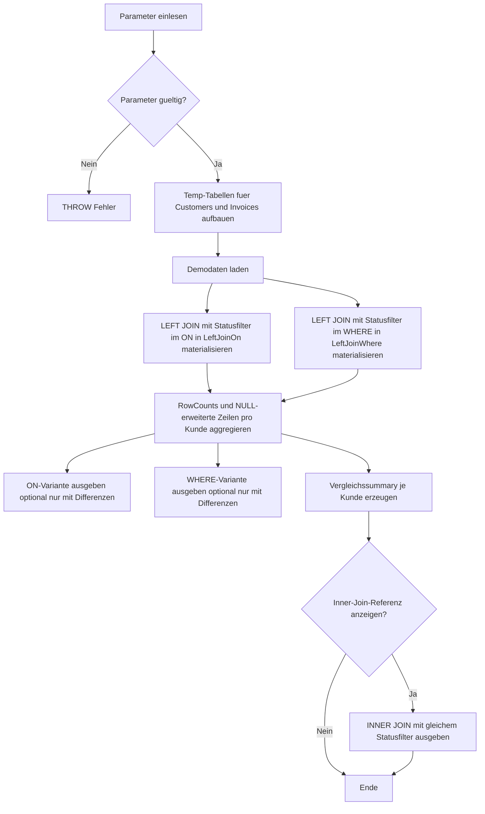

# JoinOnVsWhereComparison.sql

Dieses Skript zeigt im Kapitel `03_JOIN`, warum die Position eines Filters bei `LEFT JOIN` fachlich relevant ist. Dasselbe Statuskriterium auf der rechten Tabelle liefert im `ON` eine andere Zeilenmenge als im `WHERE`, obwohl die Join-Partner sonst identisch bleiben.

## Uebersicht

<!-- SQLDOC:SUMMARY_TABLE:BEGIN -->
| Feld | Wert |
|---|---|
| Script | [JoinOnVsWhereComparison.sql](JoinOnVsWhereComparison.sql) |
| Version | `1.0` |
| Typ | `didactic-lab` |
| Kapitel | `03_JOIN` |
| Sicherheit | `read-only-tempdb` |
| Zweck | Vergleicht bei derselben LEFT-JOIN-Situation einen Filter im ON mit einem Filter im WHERE. |
<!-- SQLDOC:SUMMARY_TABLE:END -->

## Einordnung

Der didaktische Kern ist hier nicht die Rechnungslogik, sondern die Join-Semantik. Ein Filter in der `ON`-Klausel schraenkt nur die Treffer auf der rechten Seite ein, waehrend ein Filter im `WHERE` nach dem Join auf das Gesamtergebnis wirkt und dadurch NULL-erhaltene Zeilen wieder entfernen kann.

## Annahmen

- Die Demo-Daten modellieren Kunden und Rechnungen nur als Trainingsbasis fuer `LEFT JOIN`-Semantik.
- `@TargetInvoiceStatus` repraesentiert einen exemplarischen Filter auf der rechten Tabelle.
- Kunden ohne passende Ziel-Rechnung bleiben in der `ON`-Variante als NULL-erweiterte Zeilen sichtbar.
- Die `WHERE`-Variante demonstriert bewusst den typischen Effekt, dass ein `LEFT JOIN` fuer diese Bedingung praktisch wie ein `INNER JOIN` wirkt.

## Anwendungsfall

Die ersten beiden Resultsets zeigen dieselbe Ausgangsmenge einmal mit Filter in `ON` und einmal mit Filter in `WHERE`. Das dritte Resultset fasst pro Kunde zusammen, wer nur in der `ON`-Variante sichtbar bleibt. Optional liefert ein viertes Resultset die direkte `INNER JOIN`-Referenz fuer denselben Statusfilter.

## Parameter

<!-- SQLDOC:PARAMETERS_TABLE:BEGIN -->
| Parameter | SQL-Typ | Pflicht | Beschreibung |
|---|---|---|---|
| `@TargetInvoiceStatus` | `NVARCHAR(20)` | Nein | Status, der auf Rechnungen verglichen werden soll. |
| `@OnlyDifferences` | `BIT` | Nein | Zeigt bei `1` nur Kunden mit unterschiedlichem Ergebnis je Filterposition. |
| `@IncludeInnerJoinReference` | `BIT` | Nein | Steuert ein zusaetzliches INNER-JOIN-Referenzresultset. |
<!-- SQLDOC:PARAMETERS_TABLE:END -->

## Abhaengigkeiten

<!-- SQLDOC:DEPENDENCIES_LIST:BEGIN -->
- `tempdb`
- `temp tables`
- `LEFT JOIN`
- `INNER JOIN`
<!-- SQLDOC:DEPENDENCIES_LIST:END -->

## Hinweise

- Besonders sichtbar ist der Unterschied bei Kunden ohne Rechnung im Zielstatus oder ganz ohne Rechnungen.
- Die `ON`-Variante kann deshalb fuer Analyse- oder Coverage-Fragen sinnvoll sein, bei denen linke Stammdatensaetze erhalten bleiben muessen.
- Die `WHERE`-Variante ist fachlich korrekt, wenn nur Treffer mit Zielstatus uebrig bleiben sollen und nicht passende linke Zeilen verworfen werden duerfen.

## Versionshistorie

<!-- SQLDOC:VERSION_HISTORY_TABLE:BEGIN -->
| Version | Datum | User | Beschreibung |
|---|---|---|---|
| `1.0` | `2026-04-17` | `ER` | Erstversion fuer den didaktischen Vergleich von Filterpositionen in LEFT JOINs |
<!-- SQLDOC:VERSION_HISTORY_TABLE:END -->

## Ablauf

<!-- SQLDOC:MERMAID:BEGIN -->

<!-- SQLDOC:MERMAID:END -->

## SQL-Code

<!-- SQLDOC:SQL_CODE:BEGIN -->
```sql
/*
BEGIN:SQL-HEADER v1
---
sql_header: v1
script_name: "JoinOnVsWhereComparison.sql"
script_version: "1.0"
script_type: "didactic-lab"
chapter: "03_JOIN"
purpose: >
  Vergleicht bei derselben LEFT-JOIN-Situation einen Filter im ON mit
  einem Filter im WHERE und macht sichtbar, wie sich dadurch erhaltene
  und verworfene Zeilen unterscheiden.
parameters:
  - name: "@TargetInvoiceStatus"
    sql_type: "NVARCHAR(20)"
    direction: "IN"
    required: false
    description: "Status, der auf Rechnungen verglichen werden soll"
  - name: "@OnlyDifferences"
    sql_type: "BIT"
    direction: "IN"
    required: false
    description: "1 = nur Kunden mit unterschiedlichem Ergebnis je Filterposition zeigen"
  - name: "@IncludeInnerJoinReference"
    sql_type: "BIT"
    direction: "IN"
    required: false
    description: "1 = zusaetzliches INNER-JOIN-Referenzresultset ausgeben"
result_sets:
  - name: "LeftJoinFilterInOn"
    description: "LEFT JOIN mit Statusfilter direkt in der ON-Klausel"
  - name: "LeftJoinFilterInWhere"
    description: "LEFT JOIN mit Statusfilter erst in der WHERE-Klausel"
  - name: "JoinPlacementSummary"
    description: "Vergleich je Kunde, ob beide Varianten gleich viele oder unterschiedliche Zeilen behalten"
  - name: "InnerJoinReference"
    description: "Optionale Referenz, wie sich die WHERE-Variante zum INNER JOIN verhaelt"
dependencies:
  - "tempdb"
  - "temp tables"
  - "LEFT JOIN"
  - "INNER JOIN"
safety:
  level: "read-only-tempdb"
  writes_data: false
documentation:
  markdown_file: "T-SQL/03_JOIN/SQLScripts/JoinOnVsWhereComparison.md"
  sync_blocks:
    - "SUMMARY_TABLE"
    - "PARAMETERS_TABLE"
    - "DEPENDENCIES_LIST"
    - "VERSION_HISTORY_TABLE"
    - "SQL_CODE"
  mermaid:
    mode: "ai-agent-from-sql"
    source: "script-body"
main_responsible:
  name: "Erhard Rainer"
  initials: "ER"
version_history:
  - version: "1.0"
    date: "2026-04-17"
    user: "ER"
    description: "Erstversion fuer den didaktischen Vergleich von Filterpositionen in LEFT JOINs"
notes:
  - "Das Skript arbeitet nur mit temp-Objekten und modelliert keinen produktiven Fakturenprozess."
  - "Die WHERE-Variante zeigt bewusst, wie ein Filter auf der rechten Tabelle die NULL-erhaltenen LEFT-JOIN-Zeilen entfernt."
---
END:SQL-HEADER v1
*/

SET NOCOUNT ON;

DECLARE @TargetInvoiceStatus NVARCHAR(20) = N'open';
DECLARE @OnlyDifferences BIT = 1;
DECLARE @IncludeInnerJoinReference BIT = 1;

IF NULLIF(LTRIM(RTRIM(@TargetInvoiceStatus)), N'') IS NULL
BEGIN
    THROW 50000, '@TargetInvoiceStatus darf nicht leer sein.', 1;
END;

IF @OnlyDifferences NOT IN (0, 1)
BEGIN
    THROW 50000, '@OnlyDifferences muss 0 oder 1 sein.', 1;
END;

IF @IncludeInnerJoinReference NOT IN (0, 1)
BEGIN
    THROW 50000, '@IncludeInnerJoinReference muss 0 oder 1 sein.', 1;
END;

DROP TABLE IF EXISTS #Customers;
DROP TABLE IF EXISTS #Invoices;
DROP TABLE IF EXISTS #LeftJoinOn;
DROP TABLE IF EXISTS #LeftJoinWhere;

CREATE TABLE #Customers
(
    CustomerID INT NOT NULL PRIMARY KEY,
    CustomerName NVARCHAR(100) NOT NULL,
    SalesRegion NVARCHAR(20) NOT NULL,
    SegmentName NVARCHAR(20) NOT NULL
);

CREATE TABLE #Invoices
(
    InvoiceID INT NOT NULL PRIMARY KEY,
    CustomerID INT NOT NULL,
    InvoiceStatus NVARCHAR(20) NOT NULL,
    InvoiceAmount DECIMAL(10,2) NOT NULL,
    DueDate DATE NOT NULL
);

INSERT INTO #Customers (CustomerID, CustomerName, SalesRegion, SegmentName)
VALUES
    (1, N'Alpenrad GmbH', N'South', N'enterprise'),
    (2, N'Baltic Bikes', N'North', N'smb'),
    (3, N'City Couriers', N'East', N'enterprise'),
    (4, N'Delta Retail', N'West', N'smb'),
    (5, N'Elbe Stores', N'North', N'public');

INSERT INTO #Invoices (InvoiceID, CustomerID, InvoiceStatus, InvoiceAmount, DueDate)
VALUES
    (1001, 1, N'open', 1200.00, '2026-04-10'),
    (1002, 1, N'paid', 1200.00, '2026-03-10'),
    (1003, 2, N'paid', 450.00, '2026-04-12'),
    (1004, 3, N'open', 990.00, '2026-04-15'),
    (1005, 3, N'open', 300.00, '2026-04-21'),
    (1006, 4, N'cancelled', 180.00, '2026-04-09');

SELECT
    c.CustomerID,
    c.CustomerName,
    c.SalesRegion,
    c.SegmentName,
    i.InvoiceID,
    i.InvoiceStatus,
    i.InvoiceAmount,
    i.DueDate,
    CASE
        WHEN i.InvoiceID IS NULL THEN 'customer preserved without matching status row'
        ELSE 'customer matched target-status invoice in ON'
    END AS PlacementOutcome
INTO #LeftJoinOn
FROM #Customers AS c
LEFT JOIN #Invoices AS i
    ON i.CustomerID = c.CustomerID
   AND i.InvoiceStatus = @TargetInvoiceStatus;

SELECT
    c.CustomerID,
    c.CustomerName,
    c.SalesRegion,
    c.SegmentName,
    i.InvoiceID,
    i.InvoiceStatus,
    i.InvoiceAmount,
    i.DueDate,
    'customer kept only when a target-status invoice exists after WHERE filtering' AS PlacementOutcome
INTO #LeftJoinWhere
FROM #Customers AS c
LEFT JOIN #Invoices AS i
    ON i.CustomerID = c.CustomerID
WHERE i.InvoiceStatus = @TargetInvoiceStatus;

;WITH OnCounts AS
(
    SELECT
        ljo.CustomerID,
        COUNT(*) AS RowCountOn,
        SUM(CASE WHEN ljo.InvoiceID IS NULL THEN 1 ELSE 0 END) AS NullExtendedRowsOn
    FROM #LeftJoinOn AS ljo
    GROUP BY
        ljo.CustomerID
),
WhereCounts AS
(
    SELECT
        ljw.CustomerID,
        COUNT(*) AS RowCountWhere
    FROM #LeftJoinWhere AS ljw
    GROUP BY
        ljw.CustomerID
)
SELECT
    ljo.CustomerID,
    ljo.CustomerName,
    ljo.SalesRegion,
    ljo.SegmentName,
    ljo.InvoiceID,
    ljo.InvoiceStatus,
    ljo.InvoiceAmount,
    ljo.DueDate,
    ljo.PlacementOutcome
FROM #LeftJoinOn AS ljo
LEFT JOIN OnCounts AS oc
    ON oc.CustomerID = ljo.CustomerID
LEFT JOIN WhereCounts AS wc
    ON wc.CustomerID = ljo.CustomerID
WHERE @OnlyDifferences = 0
   OR COALESCE(oc.RowCountOn, 0) <> COALESCE(wc.RowCountWhere, 0)
ORDER BY
    ljo.CustomerID,
    ljo.InvoiceID;

SELECT
    ljw.CustomerID,
    ljw.CustomerName,
    ljw.SalesRegion,
    ljw.SegmentName,
    ljw.InvoiceID,
    ljw.InvoiceStatus,
    ljw.InvoiceAmount,
    ljw.DueDate,
    ljw.PlacementOutcome
FROM #LeftJoinWhere AS ljw
LEFT JOIN OnCounts AS oc
    ON oc.CustomerID = ljw.CustomerID
LEFT JOIN WhereCounts AS wc
    ON wc.CustomerID = ljw.CustomerID
WHERE @OnlyDifferences = 0
   OR COALESCE(oc.RowCountOn, 0) <> COALESCE(wc.RowCountWhere, 0)
ORDER BY
    ljw.CustomerID,
    ljw.InvoiceID;

SELECT
    c.CustomerID,
    c.CustomerName,
    c.SalesRegion,
    c.SegmentName,
    COALESCE(oc.RowCountOn, 0) AS RowsWithFilterInOn,
    COALESCE(oc.NullExtendedRowsOn, 0) AS NullExtendedRowsInOnVariant,
    COALESCE(wc.RowCountWhere, 0) AS RowsWithFilterInWhere,
    CASE
        WHEN COALESCE(oc.RowCountOn, 0) = COALESCE(wc.RowCountWhere, 0) THEN 'same-row-count'
        WHEN COALESCE(wc.RowCountWhere, 0) = 0 THEN 'customer disappears in WHERE variant'
        ELSE 'different-row-count'
    END AS ComparisonStatus,
    CASE
        WHEN COALESCE(wc.RowCountWhere, 0) = 0 AND COALESCE(oc.NullExtendedRowsOn, 0) > 0
            THEN 'LEFT JOIN keeps the customer as NULL-extended row when the filter sits in ON.'
        WHEN COALESCE(oc.RowCountOn, 0) <> COALESCE(wc.RowCountWhere, 0)
            THEN 'The filter location changes how many rows survive for this customer.'
        ELSE 'Both variants keep the same number of rows for this customer.'
    END AS TeachingNote
FROM #Customers AS c
LEFT JOIN OnCounts AS oc
    ON oc.CustomerID = c.CustomerID
LEFT JOIN WhereCounts AS wc
    ON wc.CustomerID = c.CustomerID
WHERE @OnlyDifferences = 0
   OR COALESCE(oc.RowCountOn, 0) <> COALESCE(wc.RowCountWhere, 0)
ORDER BY
    c.CustomerID;

IF @IncludeInnerJoinReference = 1
BEGIN
    SELECT
        c.CustomerID,
        c.CustomerName,
        c.SalesRegion,
        c.SegmentName,
        i.InvoiceID,
        i.InvoiceStatus,
        i.InvoiceAmount,
        i.DueDate,
        'INNER JOIN reference for the target status' AS PlacementOutcome
    FROM #Customers AS c
    INNER JOIN #Invoices AS i
        ON i.CustomerID = c.CustomerID
       AND i.InvoiceStatus = @TargetInvoiceStatus
    ORDER BY
        c.CustomerID,
        i.InvoiceID;
END;
```
<!-- SQLDOC:SQL_CODE:END -->
