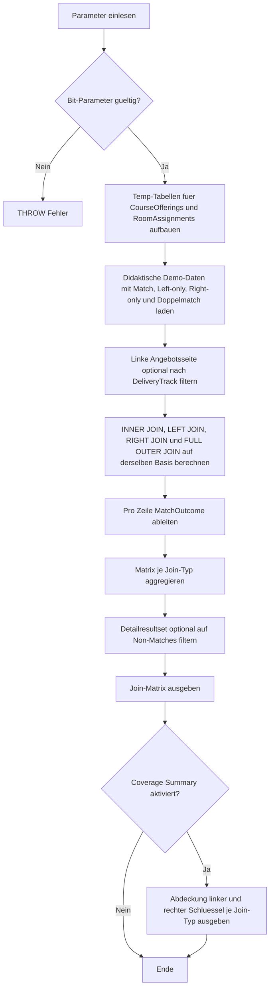

# JoinTypeOutcomeMatrix.sql

Dieses Skript vergleicht im Kapitel `03_JOIN` vier klassische Join-Typen auf derselben Demobasis. Statt nur die Syntax nebeneinanderzustellen, macht es sichtbar, wie sich `INNER JOIN`, `LEFT JOIN`, `RIGHT JOIN` und `FULL OUTER JOIN` auf Match-Zeilen, linke Luecken und rechte Luecken auswirken.

## Uebersicht

<!-- SQLDOC:SUMMARY_TABLE:BEGIN -->
| Feld | Wert |
|---|---|
| Script | [JoinTypeOutcomeMatrix.sql](JoinTypeOutcomeMatrix.sql) |
| Version | `1.0` |
| Typ | `didactic-lab` |
| Kapitel | `03_JOIN` |
| Sicherheit | `read-only-tempdb` |
| Zweck | Vergleicht INNER JOIN, LEFT JOIN, RIGHT JOIN und FULL OUTER JOIN auf derselben Demo-Basis und verdichtet das Ergebnisverhalten in einer kompakten Matrix. |
<!-- SQLDOC:SUMMARY_TABLE:END -->

## Einordnung

Die reine Definition der Join-Typen bleibt oft abstrakt, solange man nicht dieselben Schluesselbeziehungen durch alle Varianten laufen laesst. Dieses Skript nutzt daher eine identische linke Kursangebotsmenge und eine identische rechte Raumzuordnung, damit die Unterschiede direkt als Zeilenmuster und als verdichtete Matrix lesbar werden.

## Annahmen

- Die linke Seite repraesentiert geplante Kursangebote, die rechte Seite Raumzuordnungen fuer dieselben `CourseCode`-Werte.
- `SQL-201` hat bewusst zwei Raumzuordnungen, damit sichtbare Mehrfachtreffer entstehen.
- `SQL-301` und `OPS-120` besitzen absichtlich keine rechte Zuordnung.
- `SEC-500` existiert nur rechts, damit `RIGHT JOIN` und `FULL OUTER JOIN` einen echten Right-only-Fall zeigen.
- Das Skript arbeitet ausschliesslich mit tempdb-Objekten und ist als didaktische Demobasis gedacht.

## Anwendungsfall

Die erste Ausgabe zeigt pro Join-Typ jede resultierende Zeile mit einer klaren Klassifikation als `matched`, `left_only` oder `right_only`. Die zweite Ausgabe verdichtet diese Detailmenge in eine Matrix je Join-Typ. Optional folgt eine dritte Ausgabe, die auf Schluesselabdeckung fokussiert und damit verdeutlicht, welche Angebote oder Zuordnungen je Variante ueberhaupt sichtbar bleiben.

## Parameter

<!-- SQLDOC:PARAMETERS_TABLE:BEGIN -->
| Parameter | SQL-Typ | Pflicht | Beschreibung |
|---|---|---|---|
| `@DeliveryTrackFilter` | `NVARCHAR(20)` | Nein | Optionaler Filter auf einen `DeliveryTrack` der linken Angebotsseite. |
| `@OnlyShowNonMatchedRows` | `BIT` | Nein | Zeigt bei `1` im Detail nur `left_only`- und `right_only`-Zeilen, bei `0` alle Resultatzeilen. |
| `@IncludeCoverageSummary` | `BIT` | Nein | Steuert ein zusaetzliches Resultset zur Abdeckung linker und rechter Schluessel je Join-Typ. |
<!-- SQLDOC:PARAMETERS_TABLE:END -->

## Abhaengigkeiten

<!-- SQLDOC:DEPENDENCIES_LIST:BEGIN -->
- `tempdb`
- `temp tables`
- `CTE`
- `INNER JOIN`
- `LEFT JOIN`
- `RIGHT JOIN`
- `FULL OUTER JOIN`
- `UNION ALL`
<!-- SQLDOC:DEPENDENCIES_LIST:END -->

## Hinweise

- `INNER JOIN` zeigt nur gemeinsame Schluessel und blendet alle Luecken aus.
- `LEFT JOIN` behaelt die linke Angebotsmenge vollstaendig, selbst wenn rechts kein Raum gefunden wird.
- `RIGHT JOIN` spiegelt dieselbe Logik fuer die rechte Seite; didaktisch ist er hilfreich, obwohl viele Teams in der Praxis lieber `LEFT JOIN` verwenden.
- `FULL OUTER JOIN` vereint beide Perspektiven und ist damit die direkteste Variante fuer eine Vollstaendigkeitsmatrix.

## Versionshistorie

<!-- SQLDOC:VERSION_HISTORY_TABLE:BEGIN -->
| Version | Datum | User | Beschreibung |
|---|---|---|---|
| `1.0` | `2026-04-17` | `ER` | Erstversion fuer die Vergleichsmatrix der vier klassischen Join-Typen |
<!-- SQLDOC:VERSION_HISTORY_TABLE:END -->

## Ablauf

<!-- SQLDOC:MERMAID:BEGIN -->

<!-- SQLDOC:MERMAID:END -->

## SQL-Code

<!-- SQLDOC:SQL_CODE:BEGIN -->
```sql
/*
BEGIN:SQL-HEADER v1
---
sql_header: v1
script_name: "JoinTypeOutcomeMatrix.sql"
script_version: "1.0"
script_type: "didactic-lab"
chapter: "03_JOIN"
purpose: >
  Vergleicht INNER JOIN, LEFT JOIN, RIGHT JOIN und FULL OUTER JOIN auf
  derselben Demo-Basis und verdichtet das Ergebnisverhalten in einer
  kompakten Matrix fuer Match-, Left-only- und Right-only-Faelle.
parameters:
  - name: "@DeliveryTrackFilter"
    sql_type: "NVARCHAR(20)"
    direction: "IN"
    required: false
    description: "Optionaler Filter auf einen DeliveryTrack der linken Angebotsseite"
  - name: "@OnlyShowNonMatchedRows"
    sql_type: "BIT"
    direction: "IN"
    required: false
    description: "1 = im Detail nur Left-only- und Right-only-Zeilen zeigen, 0 = alle Zeilen zeigen"
  - name: "@IncludeCoverageSummary"
    sql_type: "BIT"
    direction: "IN"
    required: false
    description: "1 = zusaetzliche Zusammenfassung zur Abdeckung der linken und rechten Schluessel ausgeben"
result_sets:
  - name: "JoinTypeOutcomeDetail"
    description: "Zeigt pro Join-Typ jede resultierende Zeile samt Match-Kategorie"
  - name: "JoinTypeOutcomeMatrix"
    description: "Aggregiert je Join-Typ die Anzahl von Match-, Left-only- und Right-only-Zeilen"
  - name: "JoinCoverageSummary"
    description: "Optionaler Blick auf die Anzahl abgedeckter linker und rechter Schluessel pro Join-Typ"
dependencies:
  - "tempdb"
  - "temp tables"
  - "CTE"
  - "INNER JOIN"
  - "LEFT JOIN"
  - "RIGHT JOIN"
  - "FULL OUTER JOIN"
  - "UNION ALL"
safety:
  level: "read-only-tempdb"
  writes_data: false
documentation:
  markdown_file: "T-SQL/03_JOIN/SQLScripts/JoinTypeOutcomeMatrix.md"
  sync_blocks:
    - "SUMMARY_TABLE"
    - "PARAMETERS_TABLE"
    - "DEPENDENCIES_LIST"
    - "VERSION_HISTORY_TABLE"
    - "SQL_CODE"
  mermaid:
    mode: "ai-agent-from-sql"
    source: "script-body"
main_responsible:
  name: "Erhard Rainer"
  initials: "ER"
version_history:
  - version: "1.0"
    date: "2026-04-17"
    user: "ER"
    description: "Erstversion fuer die Vergleichsmatrix der vier klassischen Join-Typen"
notes:
  - "Die Demo nutzt nur temp-Objekte und bewusst kleine Datensaetze."
  - "Ein Kurs auf der rechten Seite kommt absichtlich ohne linkes Angebot vor."
  - "Ein Kurs auf der linken Seite besitzt bewusst zwei rechte Zuordnungen, damit Mehrfachtreffer sichtbar werden."
---
END:SQL-HEADER v1
*/

SET NOCOUNT ON;

DECLARE @DeliveryTrackFilter NVARCHAR(20) = NULL;
DECLARE @OnlyShowNonMatchedRows BIT = 0;
DECLARE @IncludeCoverageSummary BIT = 1;

IF @OnlyShowNonMatchedRows NOT IN (0, 1)
BEGIN
    THROW 50000, '@OnlyShowNonMatchedRows muss 0 oder 1 sein.', 1;
END;

IF @IncludeCoverageSummary NOT IN (0, 1)
BEGIN
    THROW 50000, '@IncludeCoverageSummary muss 0 oder 1 sein.', 1;
END;

DROP TABLE IF EXISTS #CourseOfferings;
DROP TABLE IF EXISTS #RoomAssignments;

CREATE TABLE #CourseOfferings
(
    OfferingID INT NOT NULL PRIMARY KEY,
    CourseCode NVARCHAR(20) NOT NULL,
    CourseTitle NVARCHAR(100) NOT NULL,
    DeliveryTrack NVARCHAR(20) NOT NULL,
    CohortSize INT NOT NULL
);

CREATE TABLE #RoomAssignments
(
    AssignmentID INT NOT NULL PRIMARY KEY,
    CourseCode NVARCHAR(20) NOT NULL,
    RoomCode NVARCHAR(20) NOT NULL,
    AssignmentStatus NVARCHAR(20) NOT NULL
);

INSERT INTO #CourseOfferings (OfferingID, CourseCode, CourseTitle, DeliveryTrack, CohortSize)
VALUES
    (101, N'SQL-101', N'SQL Fundamentals', N'Analytics', 24),
    (102, N'SQL-201', N'Join Workshop', N'Analytics', 18),
    (103, N'SQL-301', N'Window Functions Lab', N'Analytics', 16),
    (104, N'BI-110', N'Reporting Basics', N'Reporting', 20),
    (105, N'OPS-120', N'Batch Operations Clinic', N'Platform', 12);

INSERT INTO #RoomAssignments (AssignmentID, CourseCode, RoomCode, AssignmentStatus)
VALUES
    (1001, N'SQL-101', N'Room-A', N'confirmed'),
    (1002, N'SQL-201', N'Room-B', N'confirmed'),
    (1003, N'SQL-201', N'Room-C', N'backup'),
    (1004, N'BI-110', N'Room-D', N'confirmed'),
    (1005, N'SEC-500', N'Room-Z', N'draft');

;WITH FilteredOfferings AS
(
    SELECT
        co.OfferingID,
        co.CourseCode,
        co.CourseTitle,
        co.DeliveryTrack,
        co.CohortSize
    FROM #CourseOfferings AS co
    WHERE @DeliveryTrackFilter IS NULL
       OR co.DeliveryTrack = @DeliveryTrackFilter
),
JoinTypeOutcomeDetail AS
(
    SELECT
        'INNER JOIN' AS JoinType,
        fo.OfferingID,
        fo.CourseCode AS LeftCourseCode,
        fo.CourseTitle,
        fo.DeliveryTrack,
        fo.CohortSize,
        ra.AssignmentID,
        ra.CourseCode AS RightCourseCode,
        ra.RoomCode,
        ra.AssignmentStatus,
        'matched' AS MatchOutcome
    FROM FilteredOfferings AS fo
    INNER JOIN #RoomAssignments AS ra
        ON ra.CourseCode = fo.CourseCode

    UNION ALL

    SELECT
        'LEFT JOIN' AS JoinType,
        fo.OfferingID,
        fo.CourseCode AS LeftCourseCode,
        fo.CourseTitle,
        fo.DeliveryTrack,
        fo.CohortSize,
        ra.AssignmentID,
        ra.CourseCode AS RightCourseCode,
        ra.RoomCode,
        ra.AssignmentStatus,
        CASE WHEN ra.AssignmentID IS NULL THEN 'left_only' ELSE 'matched' END AS MatchOutcome
    FROM FilteredOfferings AS fo
    LEFT JOIN #RoomAssignments AS ra
        ON ra.CourseCode = fo.CourseCode

    UNION ALL

    SELECT
        'RIGHT JOIN' AS JoinType,
        fo.OfferingID,
        fo.CourseCode AS LeftCourseCode,
        fo.CourseTitle,
        fo.DeliveryTrack,
        fo.CohortSize,
        ra.AssignmentID,
        ra.CourseCode AS RightCourseCode,
        ra.RoomCode,
        ra.AssignmentStatus,
        CASE WHEN fo.OfferingID IS NULL THEN 'right_only' ELSE 'matched' END AS MatchOutcome
    FROM FilteredOfferings AS fo
    RIGHT JOIN #RoomAssignments AS ra
        ON ra.CourseCode = fo.CourseCode

    UNION ALL

    SELECT
        'FULL OUTER JOIN' AS JoinType,
        fo.OfferingID,
        fo.CourseCode AS LeftCourseCode,
        fo.CourseTitle,
        fo.DeliveryTrack,
        fo.CohortSize,
        ra.AssignmentID,
        ra.CourseCode AS RightCourseCode,
        ra.RoomCode,
        ra.AssignmentStatus,
        CASE
            WHEN fo.OfferingID IS NULL THEN 'right_only'
            WHEN ra.AssignmentID IS NULL THEN 'left_only'
            ELSE 'matched'
        END AS MatchOutcome
    FROM FilteredOfferings AS fo
    FULL OUTER JOIN #RoomAssignments AS ra
        ON ra.CourseCode = fo.CourseCode
),
JoinTypeOutcomeMatrix AS
(
    SELECT
        jtod.JoinType,
        COUNT(*) AS RowCount,
        SUM(CASE WHEN jtod.MatchOutcome = 'matched' THEN 1 ELSE 0 END) AS MatchedRows,
        SUM(CASE WHEN jtod.MatchOutcome = 'left_only' THEN 1 ELSE 0 END) AS LeftOnlyRows,
        SUM(CASE WHEN jtod.MatchOutcome = 'right_only' THEN 1 ELSE 0 END) AS RightOnlyRows,
        COUNT(DISTINCT jtod.OfferingID) AS DistinctLeftKeysRepresented,
        COUNT(DISTINCT jtod.AssignmentID) AS DistinctRightKeysRepresented
    FROM JoinTypeOutcomeDetail AS jtod
    GROUP BY
        jtod.JoinType
),
JoinCoverageSummary AS
(
    SELECT
        jtod.JoinType,
        COUNT(DISTINCT CASE WHEN jtod.OfferingID IS NOT NULL THEN jtod.OfferingID END) AS CoveredOfferings,
        COUNT(DISTINCT CASE WHEN jtod.AssignmentID IS NOT NULL THEN jtod.AssignmentID END) AS CoveredAssignments,
        COUNT(DISTINCT CASE WHEN jtod.MatchOutcome = 'left_only' THEN jtod.OfferingID END) AS UnmatchedOfferings,
        COUNT(DISTINCT CASE WHEN jtod.MatchOutcome = 'right_only' THEN jtod.AssignmentID END) AS UnmatchedAssignments,
        COUNT(DISTINCT CASE WHEN jtod.MatchOutcome = 'matched' THEN jtod.LeftCourseCode END) AS MatchedCourseCodes
    FROM JoinTypeOutcomeDetail AS jtod
    GROUP BY
        jtod.JoinType
)
SELECT
    jtod.JoinType,
    jtod.OfferingID,
    jtod.LeftCourseCode,
    jtod.CourseTitle,
    jtod.DeliveryTrack,
    jtod.CohortSize,
    jtod.AssignmentID,
    jtod.RightCourseCode,
    jtod.RoomCode,
    jtod.AssignmentStatus,
    jtod.MatchOutcome
FROM JoinTypeOutcomeDetail AS jtod
WHERE @OnlyShowNonMatchedRows = 0
   OR jtod.MatchOutcome <> 'matched'
ORDER BY
    CASE jtod.JoinType
        WHEN 'INNER JOIN' THEN 1
        WHEN 'LEFT JOIN' THEN 2
        WHEN 'RIGHT JOIN' THEN 3
        ELSE 4
    END,
    CASE jtod.MatchOutcome
        WHEN 'matched' THEN 1
        WHEN 'left_only' THEN 2
        ELSE 3
    END,
    ISNULL(jtod.OfferingID, 2147483647),
    ISNULL(jtod.AssignmentID, 2147483647);

SELECT
    jtom.JoinType,
    jtom.RowCount,
    jtom.MatchedRows,
    jtom.LeftOnlyRows,
    jtom.RightOnlyRows,
    jtom.DistinctLeftKeysRepresented,
    jtom.DistinctRightKeysRepresented
FROM JoinTypeOutcomeMatrix AS jtom
ORDER BY
    CASE jtom.JoinType
        WHEN 'INNER JOIN' THEN 1
        WHEN 'LEFT JOIN' THEN 2
        WHEN 'RIGHT JOIN' THEN 3
        ELSE 4
    END;

IF @IncludeCoverageSummary = 1
BEGIN
    SELECT
        jcs.JoinType,
        jcs.CoveredOfferings,
        jcs.CoveredAssignments,
        jcs.UnmatchedOfferings,
        jcs.UnmatchedAssignments,
        jcs.MatchedCourseCodes
    FROM JoinCoverageSummary AS jcs
    ORDER BY
        CASE jcs.JoinType
            WHEN 'INNER JOIN' THEN 1
            WHEN 'LEFT JOIN' THEN 2
            WHEN 'RIGHT JOIN' THEN 3
            ELSE 4
        END;
END;
```
<!-- SQLDOC:SQL_CODE:END -->
