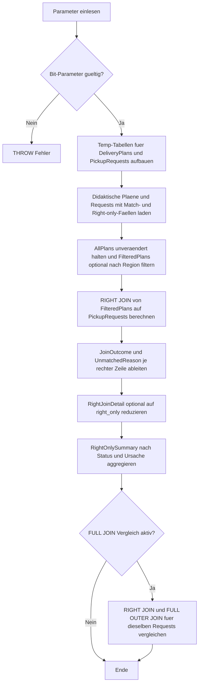

# JoinUnmatchedRightRows.sql

Dieses Skript zeigt im Kapitel `03_JOIN` gezielt die Zeilen der rechten Seite, die in einem `RIGHT JOIN` keinen passenden linken Treffer erhalten. Die Demobasis trennt dabei bewusst zwischen wirklich fehlenden linken Schluesseln und Faellen, in denen eine linke Zeile nur durch einen Filter aus dem Join verschwindet.

## Uebersicht

<!-- SQLDOC:SUMMARY_TABLE:BEGIN -->
| Feld | Wert |
|---|---|
| Script | [JoinUnmatchedRightRows.sql](JoinUnmatchedRightRows.sql) |
| Version | `1.0` |
| Typ | `didactic-lab` |
| Kapitel | `03_JOIN` |
| Sicherheit | `read-only-tempdb` |
| Zweck | Zeigt gezielt rechtsseitig nicht gematchte Zeilen in einem RIGHT JOIN und unterscheidet fehlende Schluessel von filterbedingten Luecken. |
<!-- SQLDOC:SUMMARY_TABLE:END -->

## Einordnung

Rechtsseitig unmatched Zeilen wirken auf den ersten Blick wie klassische Fremdschluessel-Luecken. In Trainingssituationen ist aber oft wichtig, ob die rechte Zeile wirklich keinen linken Schluessel besitzt oder ob eine vorhandene linke Zeile durch einen Filter auf der linken Teilmenge nicht mehr im Join landet. Das Skript macht diesen Unterschied explizit sichtbar.

## Annahmen

- Die linke Seite repraesentiert geplante Delivery-Plans, die rechte Seite konkrete Pickup-Requests.
- `PLAN-777` und `PLAN-888` stehen absichtlich nur rechts zur Verfuegung und erzeugen echte `missing-left-key`-Faelle.
- Ein gesetzter `@RegionFilter` darf vorhandene linke Plaene ausblenden; solche Requests werden als `filtered-out-left-row` markiert.
- Die Umsetzung bleibt rein didaktisch und verwendet ausschliesslich tempdb-Objekte.

## Anwendungsfall

Das erste Resultset zeigt je Request, ob er im `RIGHT JOIN` gematcht oder `right_only` bleibt. Das zweite Resultset verdichtet nur die unmatched rechten Zeilen nach Status und Ursache. Optional folgt ein drittes Resultset, das den `RIGHT JOIN` mit einem `FULL OUTER JOIN` abgleicht, um die rechte Perspektive didaktisch zu verankern.

## Parameter

<!-- SQLDOC:PARAMETERS_TABLE:BEGIN -->
| Parameter | SQL-Typ | Pflicht | Beschreibung |
|---|---|---|---|
| `@RegionFilter` | `NVARCHAR(20)` | Nein | Optionaler Filter auf die linke Delivery-Plan-Region. |
| `@OnlyRightOnlyRows` | `BIT` | Nein | Zeigt bei `1` nur rechtsseitig unmatched Zeilen, bei `0` auch gematchte Requests. |
| `@IncludeFullJoinComparison` | `BIT` | Nein | Steuert ein zusaetzliches Vergleichs-Resultset zwischen RIGHT JOIN und FULL OUTER JOIN. |
<!-- SQLDOC:PARAMETERS_TABLE:END -->

## Abhaengigkeiten

<!-- SQLDOC:DEPENDENCIES_LIST:BEGIN -->
- `tempdb`
- `temp tables`
- `CTE`
- `RIGHT JOIN`
- `FULL OUTER JOIN`
- `CASE`
- `GROUP BY`
<!-- SQLDOC:DEPENDENCIES_LIST:END -->

## Hinweise

- `UnmatchedReason = missing-left-key` bedeutet, dass fuer den `PlanCode` keinerlei linker Delivery-Plan existiert.
- `UnmatchedReason = filtered-out-left-row` bedeutet, dass ein passender Plan grundsaetzlich existiert, aber durch `@RegionFilter` nicht in `FilteredPlans` landet.
- Der `FULL OUTER JOIN` dient hier nur als Kontrollperspektive; fuer den Fokus auf rechte Luecken bleibt das erste Resultset die eigentliche Lehrsicht.

## Versionshistorie

<!-- SQLDOC:VERSION_HISTORY_TABLE:BEGIN -->
| Version | Datum | User | Beschreibung |
|---|---|---|---|
| `1.0` | `2026-04-19` | `ER` | Erstversion fuer die didaktische Analyse rechtsseitig nicht gematchter Zeilen |
<!-- SQLDOC:VERSION_HISTORY_TABLE:END -->

## Ablauf

<!-- SQLDOC:MERMAID:BEGIN -->

<!-- SQLDOC:MERMAID:END -->

## SQL-Code

<!-- SQLDOC:SQL_CODE:BEGIN -->
```sql
/*
BEGIN:SQL-HEADER v1
---
sql_header: v1
script_name: "JoinUnmatchedRightRows.sql"
script_version: "1.0"
script_type: "didactic-lab"
chapter: "03_JOIN"
purpose: >
  Zeigt gezielt rechtsseitig nicht gematchte Zeilen in einem RIGHT JOIN
  und unterscheidet, ob eine rechte Zeile wegen eines fehlenden linken
  Schluessels oder nur wegen eines linken Filters unmatched bleibt.
parameters:
  - name: "@RegionFilter"
    sql_type: "NVARCHAR(20)"
    direction: "IN"
    required: false
    description: "Optionaler Filter auf die linke Delivery-Plan-Region"
  - name: "@OnlyRightOnlyRows"
    sql_type: "BIT"
    direction: "IN"
    required: false
    description: "1 = nur rechtsseitig unmatched Zeilen zeigen, 0 = auch gematchte Zeilen ausgeben"
  - name: "@IncludeFullJoinComparison"
    sql_type: "BIT"
    direction: "IN"
    required: false
    description: "1 = zusaetzliches Vergleichs-Resultset mit FULL OUTER JOIN ausgeben"
result_sets:
  - name: "RightJoinDetail"
    description: "Detailansicht der rechten Zeilen mit JoinOutcome und UnmatchedReason"
  - name: "RightOnlySummary"
    description: "Zusammenfassung rechter unmatched Zeilen nach RequestStatus und Ursache"
  - name: "FullJoinComparison"
    description: "Optionaler Vergleich, ob RIGHT JOIN und FULL OUTER JOIN dieselben right_only-Faelle markieren"
dependencies:
  - "tempdb"
  - "temp tables"
  - "CTE"
  - "RIGHT JOIN"
  - "FULL OUTER JOIN"
  - "CASE"
  - "GROUP BY"
safety:
  level: "read-only-tempdb"
  writes_data: false
documentation:
  markdown_file: "T-SQL/03_JOIN/SQLScripts/JoinUnmatchedRightRows.md"
  sync_blocks:
    - "SUMMARY_TABLE"
    - "PARAMETERS_TABLE"
    - "DEPENDENCIES_LIST"
    - "VERSION_HISTORY_TABLE"
    - "SQL_CODE"
  mermaid:
    mode: "ai-agent-from-sql"
    source: "script-body"
main_responsible:
  name: "Erhard Rainer"
  initials: "ER"
version_history:
  - version: "1.0"
    date: "2026-04-19"
    user: "ER"
    description: "Erstversion fuer die didaktische Analyse rechtsseitig nicht gematchter Zeilen"
notes:
  - "Das Skript arbeitet nur mit temp-Objekten und einer bewusst kleinen Trainingsbasis."
  - "Right-only-Zeilen werden in missing-left-key und filtered-out-left-row unterschieden."
---
END:SQL-HEADER v1
*/

SET NOCOUNT ON;

DECLARE @RegionFilter NVARCHAR(20) = NULL;
DECLARE @OnlyRightOnlyRows BIT = 1;
DECLARE @IncludeFullJoinComparison BIT = 1;

IF @OnlyRightOnlyRows NOT IN (0, 1)
BEGIN
    THROW 50000, '@OnlyRightOnlyRows muss 0 oder 1 sein.', 1;
END;

IF @IncludeFullJoinComparison NOT IN (0, 1)
BEGIN
    THROW 50000, '@IncludeFullJoinComparison muss 0 oder 1 sein.', 1;
END;

DROP TABLE IF EXISTS #DeliveryPlans;
DROP TABLE IF EXISTS #PickupRequests;

CREATE TABLE #DeliveryPlans
(
    PlanID INT NOT NULL PRIMARY KEY,
    PlanCode NVARCHAR(20) NOT NULL,
    RegionCode NVARCHAR(20) NOT NULL,
    RouteGroup NVARCHAR(20) NOT NULL,
    DispatcherName NVARCHAR(100) NOT NULL
);

CREATE TABLE #PickupRequests
(
    RequestID INT NOT NULL PRIMARY KEY,
    PlanCode NVARCHAR(20) NOT NULL,
    CustomerName NVARCHAR(100) NOT NULL,
    RequestStatus NVARCHAR(20) NOT NULL,
    RequestedPickupDate DATE NOT NULL
);

INSERT INTO #DeliveryPlans (PlanID, PlanCode, RegionCode, RouteGroup, DispatcherName)
VALUES
    (101, N'PLAN-100', N'NORTH', N'CITY', N'Anna Berger'),
    (102, N'PLAN-110', N'NORTH', N'RURAL', N'Anna Berger'),
    (103, N'PLAN-200', N'SOUTH', N'CITY', N'Boris Klein'),
    (104, N'PLAN-210', N'WEST', N'CITY', N'Clara Vogel'),
    (105, N'PLAN-300', N'EAST', N'RURAL', N'Daniel Roth');

INSERT INTO #PickupRequests (RequestID, PlanCode, CustomerName, RequestStatus, RequestedPickupDate)
VALUES
    (1001, N'PLAN-100', N'Aster Retail', N'confirmed', '2026-04-20'),
    (1002, N'PLAN-110', N'Baltic Bikes', N'confirmed', '2026-04-20'),
    (1003, N'PLAN-200', N'Cedar Labs', N'pending', '2026-04-21'),
    (1004, N'PLAN-210', N'Delta Stores', N'confirmed', '2026-04-21'),
    (1005, N'PLAN-777', N'Echo Health', N'pending', '2026-04-22'),
    (1006, N'PLAN-888', N'Fjord Market', N'escalated', '2026-04-22'),
    (1007, N'PLAN-300', N'Green Campus', N'cancelled', '2026-04-23');

;WITH AllPlans AS
(
    SELECT
        dp.PlanID,
        dp.PlanCode,
        dp.RegionCode,
        dp.RouteGroup,
        dp.DispatcherName
    FROM #DeliveryPlans AS dp
),
FilteredPlans AS
(
    SELECT
        ap.PlanID,
        ap.PlanCode,
        ap.RegionCode,
        ap.RouteGroup,
        ap.DispatcherName
    FROM AllPlans AS ap
    WHERE @RegionFilter IS NULL
       OR ap.RegionCode = @RegionFilter
),
RightJoinDetail AS
(
    SELECT
        pr.RequestID,
        pr.PlanCode AS RequestedPlanCode,
        pr.CustomerName,
        pr.RequestStatus,
        pr.RequestedPickupDate,
        fp.PlanID,
        fp.RegionCode,
        fp.RouteGroup,
        fp.DispatcherName,
        CASE
            WHEN fp.PlanID IS NULL THEN 'right_only'
            ELSE 'matched'
        END AS JoinOutcome,
        CASE
            WHEN fp.PlanID IS NOT NULL THEN 'matched'
            WHEN EXISTS
            (
                SELECT 1
                FROM AllPlans AS ap
                WHERE ap.PlanCode = pr.PlanCode
            ) THEN 'filtered-out-left-row'
            ELSE 'missing-left-key'
        END AS UnmatchedReason
    FROM FilteredPlans AS fp
    RIGHT JOIN #PickupRequests AS pr
        ON pr.PlanCode = fp.PlanCode
),
RightOnlySummary AS
(
    SELECT
        rjd.RequestStatus,
        rjd.UnmatchedReason,
        COUNT(*) AS RequestCount,
        MIN(rjd.RequestedPickupDate) AS FirstPickupDate,
        MAX(rjd.RequestedPickupDate) AS LastPickupDate
    FROM RightJoinDetail AS rjd
    WHERE rjd.JoinOutcome = 'right_only'
    GROUP BY
        rjd.RequestStatus,
        rjd.UnmatchedReason
),
FullJoinComparison AS
(
    SELECT
        pr.RequestID,
        pr.PlanCode AS RequestedPlanCode,
        CASE
            WHEN fp.PlanID IS NULL THEN 'right_only'
            ELSE 'matched'
        END AS RightJoinOutcome,
        CASE
            WHEN fp2.PlanID IS NULL THEN 'right_only'
            WHEN pr.RequestID IS NULL THEN 'left_only'
            ELSE 'matched'
        END AS FullJoinOutcome
    FROM FilteredPlans AS fp
    RIGHT JOIN #PickupRequests AS pr
        ON pr.PlanCode = fp.PlanCode
    FULL OUTER JOIN FilteredPlans AS fp2
        ON fp2.PlanCode = pr.PlanCode
)
SELECT
    rjd.RequestID,
    rjd.RequestedPlanCode,
    rjd.CustomerName,
    rjd.RequestStatus,
    rjd.RequestedPickupDate,
    rjd.PlanID,
    rjd.RegionCode,
    rjd.RouteGroup,
    rjd.DispatcherName,
    rjd.JoinOutcome,
    rjd.UnmatchedReason
FROM RightJoinDetail AS rjd
WHERE @OnlyRightOnlyRows = 0
   OR rjd.JoinOutcome = 'right_only'
ORDER BY
    rjd.RequestedPickupDate,
    rjd.RequestID;

SELECT
    ros.RequestStatus,
    ros.UnmatchedReason,
    ros.RequestCount,
    ros.FirstPickupDate,
    ros.LastPickupDate
FROM RightOnlySummary AS ros
ORDER BY
    ros.RequestStatus,
    ros.UnmatchedReason;

IF @IncludeFullJoinComparison = 1
BEGIN
    SELECT
        fjc.RequestID,
        fjc.RequestedPlanCode,
        fjc.RightJoinOutcome,
        fjc.FullJoinOutcome,
        CASE
            WHEN fjc.RightJoinOutcome = fjc.FullJoinOutcome THEN 'same-right-side-signal'
            ELSE 'different'
        END AS ComparisonResult
    FROM FullJoinComparison AS fjc
    WHERE fjc.RequestID IS NOT NULL
      AND (@OnlyRightOnlyRows = 0 OR fjc.RightJoinOutcome = 'right_only')
    ORDER BY
        fjc.RequestID;
END;
```
<!-- SQLDOC:SQL_CODE:END -->
