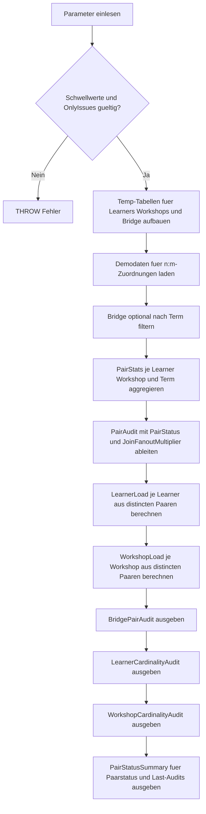

# ManyToManyBridgeAudit.sql

Dieses Skript prueft im Kapitel `03_JOIN` eine didaktische n:m-Bridge-Tabelle zwischen Learnern und Workshops. Es kombiniert eine Dublettenpruefung pro Paar mit einer Kardinalitaetspruefung je linker und rechter Seite, damit typische JOIN-Risiken frueh sichtbar werden.

## Uebersicht

<!-- SQLDOC:SUMMARY_TABLE:BEGIN -->
| Feld | Wert |
|---|---|
| Script | [ManyToManyBridgeAudit.sql](ManyToManyBridgeAudit.sql) |
| Version | `1.0` |
| Typ | `didactic-lab` |
| Kapitel | `03_JOIN` |
| Sicherheit | `read-only-tempdb` |
| Zweck | Prueft eine didaktische n:m-Bridge-Tabelle auf Dubletten und auffaellige Kardinalitaeten je Seite. |
<!-- SQLDOC:SUMMARY_TABLE:END -->

## Einordnung

Viele JOIN-Probleme entstehen schon vor dem eigentlichen `SELECT`: dieselbe Beziehung steht mehrfach in der Bridge oder eine Seite sammelt deutlich mehr Zuordnungen als fachlich erwartet. Das Skript trennt diese beiden Perspektiven in Paar-Audit und Last-Audit, damit Fanout-Effekte und unausgewogene Belegungen leichter diskutiert werden koennen.

## Annahmen

- Die Daten modellieren eine didaktische Lernplattform mit `Learner`, `Workshop` und einer n:m-Bridge fuer Einschreibungen.
- `duplicate-pair` bedeutet, dass dieselbe Kombination aus `LearnerID`, `WorkshopID` und `TermCode` mehrfach vorkommt.
- Die Schwellwerte `@MaxWorkshopsPerLearner` und `@MaxLearnersPerWorkshop` sind bewusst didaktische Richtwerte und keine produktiven Fachregeln.
- Eine Workshop-Belegung unter zwei Learnern wird hier als `underfilled-workshop` markiert, um schwache Abdeckung in der Demo sichtbar zu machen.

## Anwendungsfall

Das erste Resultset zeigt problematische Paare samt Fanout-Multiplikator. Das zweite und dritte Resultset pruefen danach, ob einzelne Learner oder Workshops fuer den gewaehlten Term zu viele oder zu wenige Zuordnungen tragen. Die abschliessende Zusammenfassung verdichtet diese Befunde pro Term und Audit-Typ.

## Parameter

<!-- SQLDOC:PARAMETERS_TABLE:BEGIN -->
| Parameter | SQL-Typ | Pflicht | Beschreibung |
|---|---|---|---|
| `@TermCode` | `NVARCHAR(20)` | Nein | Optionaler Filter auf einen Trainings-Term oder Lauf. |
| `@MaxWorkshopsPerLearner` | `INT` | Nein | Didaktischer Schwellwert fuer zu viele Workshop-Zuordnungen pro Learner. |
| `@MaxLearnersPerWorkshop` | `INT` | Nein | Didaktischer Schwellwert fuer zu viele Learner-Zuordnungen pro Workshop. |
| `@OnlyIssues` | `BIT` | Nein | Zeigt bei `1` nur auffaellige Zeilen, bei `0` auch unauffaellige Referenzen. |
<!-- SQLDOC:PARAMETERS_TABLE:END -->

## Abhaengigkeiten

<!-- SQLDOC:DEPENDENCIES_LIST:BEGIN -->
- `tempdb`
- `temp tables`
- `CTE`
- `STRING_AGG`
<!-- SQLDOC:DEPENDENCIES_LIST:END -->

## Hinweise

- Der Audit arbeitet komplett mit temp-Objekten und eignet sich fuer Unterricht, Review und Diagnose.
- Der `JoinFanoutMultiplier` zeigt direkt, wie stark doppelte Paare spaetere Join-Treffer vervielfachen koennen.
- Die beiden Last-Audits betrachten nur die distincten Paare des gefilterten Terms und trennen damit Dubletten sauber von der Frage nach Ueber- oder Unterbelegung.

## Versionshistorie

<!-- SQLDOC:VERSION_HISTORY_TABLE:BEGIN -->
| Version | Datum | User | Beschreibung |
|---|---|---|---|
| `1.0` | `2026-04-17` | `ER` | Erstversion fuer die didaktische n:m-Bridge-Auditierung |
<!-- SQLDOC:VERSION_HISTORY_TABLE:END -->

## Ablauf

<!-- SQLDOC:MERMAID:BEGIN -->

<!-- SQLDOC:MERMAID:END -->

## SQL-Code

<!-- SQLDOC:SQL_CODE:BEGIN -->
```sql
/*
BEGIN:SQL-HEADER v1
---
sql_header: v1
script_name: "ManyToManyBridgeAudit.sql"
script_version: "1.0"
script_type: "didactic-lab"
chapter: "03_JOIN"
purpose: >
  Prueft eine didaktische n:m-Bridge-Tabelle auf doppelte Paarungen und
  auffaellige Kardinalitaeten je linker und rechter Seite, damit Join-Risiken
  vor einer fachlichen Auswertung sichtbar werden.
parameters:
  - name: "@TermCode"
    sql_type: "NVARCHAR(20)"
    direction: "IN"
    required: false
    description: "Optionaler Filter auf einen Trainings-Term oder Lauf"
  - name: "@MaxWorkshopsPerLearner"
    sql_type: "INT"
    direction: "IN"
    required: false
    description: "Didaktischer Schwellwert fuer zu viele Workshop-Zuordnungen pro Learner"
  - name: "@MaxLearnersPerWorkshop"
    sql_type: "INT"
    direction: "IN"
    required: false
    description: "Didaktischer Schwellwert fuer zu viele Learner-Zuordnungen pro Workshop"
  - name: "@OnlyIssues"
    sql_type: "BIT"
    direction: "IN"
    required: false
    description: "1 = nur auffaellige Zeilen zeigen, 0 = auch unauffaellige Referenzen ausgeben"
result_sets:
  - name: "BridgePairAudit"
    description: "Detailpruefung je Learner-Workshop-Paar mit Dubletten- und Fanout-Hinweis"
  - name: "LearnerCardinalityAudit"
    description: "Kardinalitaetspruefung je Learner fuer fehlende oder ueberladene Workshop-Zuordnungen"
  - name: "WorkshopCardinalityAudit"
    description: "Kardinalitaetspruefung je Workshop fuer geringe oder hohe Belegung"
  - name: "PairStatusSummary"
    description: "Zusammenfassung der Paar- und Kardinalitaetsbefunde je Term"
dependencies:
  - "tempdb"
  - "temp tables"
  - "CTE"
  - "STRING_AGG"
safety:
  level: "read-only-tempdb"
  writes_data: false
documentation:
  markdown_file: "T-SQL/03_JOIN/SQLScripts/ManyToManyBridgeAudit.md"
  sync_blocks:
    - "SUMMARY_TABLE"
    - "PARAMETERS_TABLE"
    - "DEPENDENCIES_LIST"
    - "VERSION_HISTORY_TABLE"
    - "SQL_CODE"
  mermaid:
    mode: "ai-agent-from-sql"
    source: "script-body"
main_responsible:
  name: "Erhard Rainer"
  initials: "ER"
version_history:
  - version: "1.0"
    date: "2026-04-17"
    user: "ER"
    description: "Erstversion fuer die didaktische n:m-Bridge-Auditierung"
notes:
  - "Das Skript verwendet nur temp-Objekte und modelliert eine Trainingssituation fuer JOIN-Analysen."
  - "Kardinalitaetsgrenzen sind bewusst didaktische Schwellenwerte und keine produktiven Regeln."
---
END:SQL-HEADER v1
*/

SET NOCOUNT ON;

DECLARE @TermCode NVARCHAR(20) = N'2026-Q2';
DECLARE @MaxWorkshopsPerLearner INT = 3;
DECLARE @MaxLearnersPerWorkshop INT = 3;
DECLARE @OnlyIssues BIT = 1;

IF @MaxWorkshopsPerLearner IS NULL OR @MaxWorkshopsPerLearner < 1
BEGIN
    THROW 50000, '@MaxWorkshopsPerLearner muss mindestens 1 sein.', 1;
END;

IF @MaxLearnersPerWorkshop IS NULL OR @MaxLearnersPerWorkshop < 1
BEGIN
    THROW 50000, '@MaxLearnersPerWorkshop muss mindestens 1 sein.', 1;
END;

IF @OnlyIssues NOT IN (0, 1)
BEGIN
    THROW 50000, '@OnlyIssues muss 0 oder 1 sein.', 1;
END;

DROP TABLE IF EXISTS #Learners;
DROP TABLE IF EXISTS #Workshops;
DROP TABLE IF EXISTS #LearnerWorkshopBridge;
DROP TABLE IF EXISTS #FilteredBridge;

CREATE TABLE #Learners
(
    LearnerID INT NOT NULL PRIMARY KEY,
    LearnerName NVARCHAR(100) NOT NULL,
    TrackCode NVARCHAR(20) NOT NULL
);

CREATE TABLE #Workshops
(
    WorkshopID INT NOT NULL PRIMARY KEY,
    WorkshopCode NVARCHAR(20) NOT NULL,
    WorkshopName NVARCHAR(100) NOT NULL,
    CapacityHint INT NOT NULL
);

CREATE TABLE #LearnerWorkshopBridge
(
    BridgeID INT NOT NULL PRIMARY KEY,
    LearnerID INT NOT NULL,
    WorkshopID INT NOT NULL,
    TermCode NVARCHAR(20) NOT NULL,
    AssignmentSource NVARCHAR(30) NOT NULL,
    EnrollmentStatus NVARCHAR(20) NOT NULL,
    AssignedAt DATE NOT NULL
);

INSERT INTO #Learners (LearnerID, LearnerName, TrackCode)
VALUES
    (101, N'Anna Berger', N'analytics'),
    (102, N'Ben Krueger', N'analytics'),
    (103, N'Clara Stein', N'data-eng'),
    (104, N'Denis Wolf', N'data-eng'),
    (105, N'Eva Kurz', N'automation'),
    (106, N'Farid Noor', N'automation');

INSERT INTO #Workshops (WorkshopID, WorkshopCode, WorkshopName, CapacityHint)
VALUES
    (201, N'JOIN-101', N'Bridge Basics', 3),
    (202, N'JOIN-201', N'Join Fanout Clinic', 2),
    (203, N'JOIN-301', N'Cardinality Deep Dive', 3),
    (204, N'JOIN-401', N'Bridge Refactoring Lab', 2);

INSERT INTO #LearnerWorkshopBridge
(
    BridgeID,
    LearnerID,
    WorkshopID,
    TermCode,
    AssignmentSource,
    EnrollmentStatus,
    AssignedAt
)
VALUES
    (1, 101, 201, N'2026-Q2', N'LMS', N'active', '2026-04-01'),
    (2, 101, 202, N'2026-Q2', N'LMS', N'active', '2026-04-02'),
    (3, 101, 202, N'2026-Q2', N'Portal', N'active', '2026-04-03'),
    (4, 101, 203, N'2026-Q2', N'Planner', N'active', '2026-04-04'),
    (5, 101, 204, N'2026-Q2', N'Planner', N'active', '2026-04-05'),
    (6, 102, 201, N'2026-Q2', N'LMS', N'active', '2026-04-01'),
    (7, 102, 203, N'2026-Q2', N'LMS', N'active', '2026-04-02'),
    (8, 103, 202, N'2026-Q2', N'LMS', N'active', '2026-04-02'),
    (9, 103, 203, N'2026-Q2', N'LMS', N'active', '2026-04-03'),
    (10, 104, 202, N'2026-Q2', N'Portal', N'waitlist', '2026-04-04'),
    (11, 105, 202, N'2026-Q2', N'LMS', N'active', '2026-04-04'),
    (12, 106, 202, N'2026-Q2', N'LMS', N'active', '2026-04-05'),
    (13, 106, 204, N'2026-Q2', N'Planner', N'active', '2026-04-06'),
    (14, 103, 201, N'2026-Q3', N'LMS', N'planned', '2026-06-01'),
    (15, 104, 204, N'2026-Q3', N'Planner', N'planned', '2026-06-02');

SELECT
    lwb.BridgeID,
    lwb.LearnerID,
    lwb.WorkshopID,
    lwb.TermCode,
    lwb.AssignmentSource,
    lwb.EnrollmentStatus,
    lwb.AssignedAt
INTO #FilteredBridge
FROM #LearnerWorkshopBridge AS lwb
WHERE @TermCode IS NULL
   OR lwb.TermCode = @TermCode;

;WITH PairStats AS
(
    SELECT
        fb.LearnerID,
        fb.WorkshopID,
        fb.TermCode,
        COUNT(*) AS PairRowCount,
        MIN(fb.AssignedAt) AS FirstAssignedAt,
        MAX(fb.AssignedAt) AS LastAssignedAt,
        STRING_AGG(CONCAT(fb.EnrollmentStatus, ' via ', fb.AssignmentSource), ', ')
            WITHIN GROUP (ORDER BY fb.AssignedAt, fb.BridgeID) AS PairFootprint
    FROM #FilteredBridge AS fb
    GROUP BY
        fb.LearnerID,
        fb.WorkshopID,
        fb.TermCode
),
PairAudit AS
(
    SELECT
        ps.TermCode,
        l.TrackCode,
        ps.LearnerID,
        l.LearnerName,
        ps.WorkshopID,
        w.WorkshopCode,
        w.WorkshopName,
        ps.PairRowCount,
        ps.FirstAssignedAt,
        ps.LastAssignedAt,
        ps.PairFootprint,
        CASE
            WHEN ps.PairRowCount > 1 THEN 'duplicate-pair'
            ELSE 'single-pair'
        END AS PairStatus,
        CASE
            WHEN ps.PairRowCount > 1 THEN ps.PairRowCount
            ELSE 1
        END AS JoinFanoutMultiplier,
        CASE
            WHEN ps.PairRowCount > 1
                THEN 'Dasselbe Learner-Workshop-Paar ist mehrfach vorhanden und vervielfacht spaetere Join-Treffer.'
            ELSE 'Das Learner-Workshop-Paar ist genau einmal vorhanden.'
        END AS AuditMessage
    FROM PairStats AS ps
    INNER JOIN #Learners AS l
        ON l.LearnerID = ps.LearnerID
    INNER JOIN #Workshops AS w
        ON w.WorkshopID = ps.WorkshopID
),
LearnerLoad AS
(
    SELECT
        pa.TermCode,
        pa.LearnerID,
        pa.LearnerName,
        pa.TrackCode,
        COUNT(*) AS DistinctWorkshopCount,
        SUM(CASE WHEN pa.PairStatus = 'duplicate-pair' THEN pa.PairRowCount - 1 ELSE 0 END) AS ExtraPairRows,
        STRING_AGG(pa.WorkshopCode, ', ')
            WITHIN GROUP (ORDER BY pa.WorkshopCode) AS WorkshopList
    FROM PairAudit AS pa
    GROUP BY
        pa.TermCode,
        pa.LearnerID,
        pa.LearnerName,
        pa.TrackCode
),
WorkshopLoad AS
(
    SELECT
        pa.TermCode,
        pa.WorkshopID,
        pa.WorkshopCode,
        pa.WorkshopName,
        w.CapacityHint,
        COUNT(*) AS DistinctLearnerCount,
        SUM(CASE WHEN pa.PairStatus = 'duplicate-pair' THEN pa.PairRowCount - 1 ELSE 0 END) AS ExtraPairRows,
        STRING_AGG(pa.LearnerName, ', ')
            WITHIN GROUP (ORDER BY pa.LearnerName) AS LearnerList
    FROM PairAudit AS pa
    INNER JOIN #Workshops AS w
        ON w.WorkshopID = pa.WorkshopID
    GROUP BY
        pa.TermCode,
        pa.WorkshopID,
        pa.WorkshopCode,
        pa.WorkshopName,
        w.CapacityHint
),
PairStatusSummary AS
(
    SELECT
        pa.TermCode,
        'pair-status' AS SummaryType,
        pa.PairStatus AS AuditStatus,
        COUNT(*) AS EntityCount,
        SUM(pa.PairRowCount) AS ReferencedRows,
        SUM(CASE WHEN pa.PairStatus = 'duplicate-pair' THEN pa.PairRowCount - 1 ELSE 0 END) AS ExtraRows
    FROM PairAudit AS pa
    GROUP BY
        pa.TermCode,
        pa.PairStatus

    UNION ALL

    SELECT
        ll.TermCode,
        'learner-load' AS SummaryType,
        CASE
            WHEN ll.DistinctWorkshopCount > @MaxWorkshopsPerLearner THEN 'overloaded-learner'
            ELSE 'within-threshold'
        END AS AuditStatus,
        COUNT(*) AS EntityCount,
        SUM(ll.DistinctWorkshopCount) AS ReferencedRows,
        SUM(ll.ExtraPairRows) AS ExtraRows
    FROM LearnerLoad AS ll
    GROUP BY
        ll.TermCode,
        CASE
            WHEN ll.DistinctWorkshopCount > @MaxWorkshopsPerLearner THEN 'overloaded-learner'
            ELSE 'within-threshold'
        END

    UNION ALL

    SELECT
        wl.TermCode,
        'workshop-load' AS SummaryType,
        CASE
            WHEN wl.DistinctLearnerCount > @MaxLearnersPerWorkshop THEN 'overloaded-workshop'
            WHEN wl.DistinctLearnerCount < 2 THEN 'underfilled-workshop'
            ELSE 'within-threshold'
        END AS AuditStatus,
        COUNT(*) AS EntityCount,
        SUM(wl.DistinctLearnerCount) AS ReferencedRows,
        SUM(wl.ExtraPairRows) AS ExtraRows
    FROM WorkshopLoad AS wl
    GROUP BY
        wl.TermCode,
        CASE
            WHEN wl.DistinctLearnerCount > @MaxLearnersPerWorkshop THEN 'overloaded-workshop'
            WHEN wl.DistinctLearnerCount < 2 THEN 'underfilled-workshop'
            ELSE 'within-threshold'
        END
)
SELECT
    pa.TermCode,
    pa.TrackCode,
    pa.LearnerID,
    pa.LearnerName,
    pa.WorkshopID,
    pa.WorkshopCode,
    pa.WorkshopName,
    pa.PairRowCount,
    pa.JoinFanoutMultiplier,
    pa.FirstAssignedAt,
    pa.LastAssignedAt,
    pa.PairFootprint,
    pa.PairStatus,
    pa.AuditMessage
FROM PairAudit AS pa
WHERE @OnlyIssues = 0
   OR pa.PairStatus = 'duplicate-pair'
ORDER BY
    CASE pa.PairStatus
        WHEN 'duplicate-pair' THEN 1
        ELSE 2
    END,
    pa.TermCode,
    pa.LearnerID,
    pa.WorkshopID;

SELECT
    ll.TermCode,
    ll.TrackCode,
    ll.LearnerID,
    ll.LearnerName,
    ll.DistinctWorkshopCount,
    ll.ExtraPairRows,
    @MaxWorkshopsPerLearner AS MaxAllowedWorkshops,
    ll.WorkshopList,
    CASE
        WHEN ll.DistinctWorkshopCount > @MaxWorkshopsPerLearner THEN 'overloaded-learner'
        ELSE 'within-threshold'
    END AS LoadStatus,
    CASE
        WHEN ll.DistinctWorkshopCount > @MaxWorkshopsPerLearner
            THEN 'Learner hat mehr Workshop-Zuordnungen als der didaktische Schwellwert erlaubt.'
        ELSE 'Learner liegt innerhalb des didaktischen Schwellwerts.'
    END AS AuditMessage
FROM LearnerLoad AS ll
WHERE @OnlyIssues = 0
   OR ll.DistinctWorkshopCount > @MaxWorkshopsPerLearner
ORDER BY
    CASE
        WHEN ll.DistinctWorkshopCount > @MaxWorkshopsPerLearner THEN 1
        ELSE 2
    END,
    ll.TermCode,
    ll.LearnerID;

SELECT
    wl.TermCode,
    wl.WorkshopID,
    wl.WorkshopCode,
    wl.WorkshopName,
    wl.CapacityHint,
    wl.DistinctLearnerCount,
    wl.ExtraPairRows,
    @MaxLearnersPerWorkshop AS MaxAllowedLearners,
    wl.LearnerList,
    CASE
        WHEN wl.DistinctLearnerCount > @MaxLearnersPerWorkshop THEN 'overloaded-workshop'
        WHEN wl.DistinctLearnerCount < 2 THEN 'underfilled-workshop'
        ELSE 'within-threshold'
    END AS LoadStatus,
    CASE
        WHEN wl.DistinctLearnerCount > @MaxLearnersPerWorkshop
            THEN 'Workshop ist dichter belegt als der didaktische Schwellwert vorsieht.'
        WHEN wl.DistinctLearnerCount < 2
            THEN 'Workshop hat fuer das Beispiel nur sehr wenige Zuordnungen und zeigt geringe Abdeckung.'
        ELSE 'Workshop liegt innerhalb des didaktischen Schwellwerts.'
    END AS AuditMessage
FROM WorkshopLoad AS wl
WHERE @OnlyIssues = 0
   OR wl.DistinctLearnerCount > @MaxLearnersPerWorkshop
   OR wl.DistinctLearnerCount < 2
ORDER BY
    CASE
        WHEN wl.DistinctLearnerCount > @MaxLearnersPerWorkshop THEN 1
        WHEN wl.DistinctLearnerCount < 2 THEN 2
        ELSE 3
    END,
    wl.TermCode,
    wl.WorkshopID;

SELECT
    pss.TermCode,
    pss.SummaryType,
    pss.AuditStatus,
    pss.EntityCount,
    pss.ReferencedRows,
    pss.ExtraRows
FROM PairStatusSummary AS pss
ORDER BY
    pss.TermCode,
    pss.SummaryType,
    pss.AuditStatus;
```
<!-- SQLDOC:SQL_CODE:END -->
