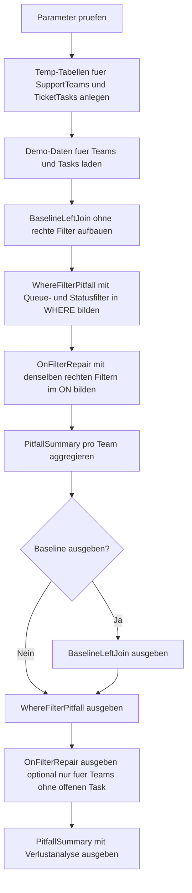

# OuterJoinFilterPitfallDemo.sql

Dieses Skript zeigt eine klassische LEFT-JOIN-Falle mit einem kleinen Support-Beispiel. Ein Filter auf der rechten Task-Tabelle in `WHERE` laesst Teams ohne passenden offenen Task verschwinden, obwohl genau diese Teams in einer Diagnose oft sichtbar bleiben sollen.

## Uebersicht

<!-- SQLDOC:SUMMARY_TABLE:BEGIN -->
| Feld | Wert |
|---|---|
| Script | [OuterJoinFilterPitfallDemo.sql](OuterJoinFilterPitfallDemo.sql) |
| Version | `1.0` |
| Typ | `didactic-lab` |
| Kapitel | `03_JOIN` |
| Sicherheit | `read-only-tempdb` |
| Zweck | Zeigt, wie ein rechter Filter in `WHERE` einen LEFT JOIN unbeabsichtigt wie einen INNER JOIN wirken laesst. |
<!-- SQLDOC:SUMMARY_TABLE:END -->

## Einordnung

Die Demo stellt drei Sichtweisen gegenueber: eine ungefilterte LEFT-JOIN-Baseline, die fehlerhafte WHERE-Variante und die reparierte ON-Variante. So wird klar, dass nicht der `LEFT JOIN` selbst falsch ist, sondern die spaete Platzierung eines Filters auf der rechten Tabelle.

## Annahmen

- Das Skript ist eine didaktische Erstversion und arbeitet ausschliesslich mit `tempdb`-Objekten.
- Support-Teams und Ticket-Tasks sind nur Trainingsdaten fuer JOIN-Semantik, keine produktive Queue-Struktur.
- Ein passender Treffer liegt nur dann vor, wenn Queue und Status auf der rechten Task-Tabelle zum linken Team passen.
- Teams ohne offenen Task sollen fuer den Lernfall gerade sichtbar bleiben und nicht versehentlich ausgeblendet werden.

## Anwendungsfall

Das Skript eignet sich fuer Join-Reviews, Unterricht und Query-Walkthroughs, wenn Coverage-Fragen im Vordergrund stehen: "Welche linken Stammsaetze haben keinen passenden rechten Treffer?" Die Zusammenfassung markiert pro Team, ob die WHERE-Variante diese Diagnosefaehigkeit verliert.

## Parameter

<!-- SQLDOC:PARAMETERS_TABLE:BEGIN -->
| Parameter | SQL-Typ | Pflicht | Beschreibung |
|---|---|---|---|
| `@TargetQueue` | `NVARCHAR(20)` | Nein | Vergleicht eine konkrete Queue oder `all` fuer alle Queues. |
| `@OpenStatus` | `NVARCHAR(20)` | Nein | Status auf der rechten Task-Tabelle, der als aktiver Treffer zaehlt. |
| `@OnlyTeamsWithoutOpenTask` | `BIT` | Nein | Zeigt bei `1` nur Teams ohne passenden offenen Task in der ON-Variante. |
| `@IncludeBaseline` | `BIT` | Nein | Gibt bei `1` zusaetzlich die ungefilterte LEFT-JOIN-Baseline aus. |
<!-- SQLDOC:PARAMETERS_TABLE:END -->

## Abhaengigkeiten

<!-- SQLDOC:DEPENDENCIES_LIST:BEGIN -->
- `tempdb`
- `temp tables`
- `LEFT JOIN`
- `CTE`
- `CASE`
<!-- SQLDOC:DEPENDENCIES_LIST:END -->

## Hinweise

- `BaselineLeftJoin` zeigt zunaechst alle Teams mitsamt beliebigen Tasks oder als NULL-erweiterte Zeilen.
- `WhereFilterPitfall` demonstriert den Fehlerfall: rechte Filter in `WHERE` entfernen Teams ohne offenen Treffer vollstaendig.
- `OnFilterRepair` behaelt dieselben Teams im Resultset und markiert fehlende Treffer ueber `NULL`.
- `PitfallSummary` verdichtet, welche linken Teams nur dank Filterplatzierung im `ON` sichtbar bleiben.

## Versionshistorie

<!-- SQLDOC:VERSION_HISTORY_TABLE:BEGIN -->
| Version | Datum | User | Beschreibung |
|---|---|---|---|
| `1.0` | `2026-04-17` | `ER` | Erstversion fuer eine didaktische Outer-Join-Pitfall-Demo |
<!-- SQLDOC:VERSION_HISTORY_TABLE:END -->

## Ablauf

<!-- SQLDOC:MERMAID:BEGIN -->

<!-- SQLDOC:MERMAID:END -->

## SQL-Code

<!-- SQLDOC:SQL_CODE:BEGIN -->
```sql
/*
BEGIN:SQL-HEADER v1
---
sql_header: v1
script_name: "OuterJoinFilterPitfallDemo.sql"
script_version: "1.0"
script_type: "didactic-lab"
chapter: "03_JOIN"
purpose: >
  Zeigt an einer Support- und Ticket-Demo, wie ein Filter auf der rechten
  Tabelle in der WHERE-Klausel einen LEFT JOIN unbeabsichtigt in Richtung
  INNER JOIN verschiebt und linke Zeilen verschwinden laesst.

parameters:
  - name: "@TargetQueue"
    sql_type: "NVARCHAR(20)"
    direction: "IN"
    required: false
    description: "Vergleicht genau eine Ticket-Queue oder all fuer alle Queues"
  - name: "@OpenStatus"
    sql_type: "NVARCHAR(20)"
    direction: "IN"
    required: false
    description: "Status auf der rechten Task-Tabelle, der als aktiver Treffer gilt"
  - name: "@OnlyTeamsWithoutOpenTask"
    sql_type: "BIT"
    direction: "IN"
    required: false
    description: "1 zeigt nur Teams ohne passenden offenen Task in der reparierten ON-Variante"
  - name: "@IncludeBaseline"
    sql_type: "BIT"
    direction: "IN"
    required: false
    description: "1 gibt zusaetzlich die ungefilterte LEFT-JOIN-Baseline aus"

result_sets:
  - name: "BaselineLeftJoin"
    description: "LEFT JOIN ohne Statusfilter als Referenz fuer alle Ticket-Zuordnungen"
  - name: "WhereFilterPitfall"
    description: "LEFT JOIN mit Queue- und Statusfilter in WHERE; Teams ohne rechten Treffer verschwinden"
  - name: "OnFilterRepair"
    description: "LEFT JOIN mit denselben rechten Filtern im ON; Teams bleiben als NULL-erweiterte Zeilen sichtbar"
  - name: "PitfallSummary"
    description: "Vergleicht pro Team, welche Variante linke Zeilen verliert oder korrekt erhaelt"

dependencies:
  - "tempdb"
  - "temp tables"
  - "LEFT JOIN"
  - "CTE"
  - "CASE"

safety:
  level: "read-only-tempdb"
  writes_data: false

documentation:
  markdown_file: "T-SQL/03_JOIN/SQLScripts/OuterJoinFilterPitfallDemo.md"
  sync_blocks:
    - "SUMMARY_TABLE"
    - "PARAMETERS_TABLE"
    - "DEPENDENCIES_LIST"
    - "VERSION_HISTORY_TABLE"
    - "SQL_CODE"
  mermaid:
    mode: "ai-agent-from-sql"
    source: "script-body"

main_responsible:
  name: "Erhard Rainer"
  initials: "ER"

version_history:
  - version: "1.0"
    date: "2026-04-17"
    user: "ER"
    description: "Erstversion fuer eine didaktische Outer-Join-Pitfall-Demo"

notes:
  - "Die Demo arbeitet ausschliesslich mit tempdb-Objekten und simuliert keine produktive Support-Queue."
  - "Der Lernfokus liegt auf NULL-erhaltenen LEFT-JOIN-Zeilen und auf der Position von Filtern gegen die rechte Tabelle."
---
END:SQL-HEADER v1
*/

SET NOCOUNT ON;

DECLARE @TargetQueue NVARCHAR(20) = N'all';
DECLARE @OpenStatus NVARCHAR(20) = N'open';
DECLARE @OnlyTeamsWithoutOpenTask BIT = 0;
DECLARE @IncludeBaseline BIT = 1;

IF NULLIF(LTRIM(RTRIM(@TargetQueue)), N'') IS NULL
BEGIN
    THROW 50020, '@TargetQueue darf nicht leer sein.', 1;
END;

IF NULLIF(LTRIM(RTRIM(@OpenStatus)), N'') IS NULL
BEGIN
    THROW 50021, '@OpenStatus darf nicht leer sein.', 1;
END;

IF @OnlyTeamsWithoutOpenTask NOT IN (0, 1)
BEGIN
    THROW 50022, '@OnlyTeamsWithoutOpenTask muss 0 oder 1 sein.', 1;
END;

IF @IncludeBaseline NOT IN (0, 1)
BEGIN
    THROW 50023, '@IncludeBaseline muss 0 oder 1 sein.', 1;
END;

DROP TABLE IF EXISTS #SupportTeams;
DROP TABLE IF EXISTS #TicketTasks;

CREATE TABLE #SupportTeams
(
    TeamID INT NOT NULL PRIMARY KEY,
    TeamCode NVARCHAR(20) NOT NULL,
    TeamName NVARCHAR(100) NOT NULL,
    QueueCode NVARCHAR(20) NOT NULL
);

CREATE TABLE #TicketTasks
(
    TaskID INT NOT NULL PRIMARY KEY,
    TeamID INT NOT NULL,
    QueueCode NVARCHAR(20) NOT NULL,
    TaskStatus NVARCHAR(20) NOT NULL,
    TicketRef NVARCHAR(20) NOT NULL,
    TaskOwner NVARCHAR(100) NOT NULL
);

INSERT INTO #SupportTeams (TeamID, TeamCode, TeamName, QueueCode)
VALUES
    (10, N'TEAM-OPS', N'Operations Desk', N'incident'),
    (20, N'TEAM-BILL', N'Billing Support', N'billing'),
    (30, N'TEAM-APP', N'Application Care', N'incident'),
    (40, N'TEAM-DATA', N'Data Quality', N'data'),
    (50, N'TEAM-PROC', N'Process Review', N'billing');

INSERT INTO #TicketTasks (TaskID, TeamID, QueueCode, TaskStatus, TicketRef, TaskOwner)
VALUES
    (1001, 10, N'incident', N'open', N'INC-1001', N'Anna Berger'),
    (1002, 10, N'incident', N'closed', N'INC-1002', N'Ben Krueger'),
    (1003, 20, N'billing', N'closed', N'BIL-2001', N'Clara Stein'),
    (1004, 20, N'billing', N'on-hold', N'BIL-2002', N'Denis Wolf'),
    (1005, 30, N'incident', N'open', N'INC-3001', N'Eva Kurz'),
    (1006, 40, N'data', N'planned', N'DAT-4001', N'Farid Meier');

;WITH BaselineLeftJoin AS
(
    SELECT
        st.TeamID,
        st.TeamCode,
        st.TeamName,
        st.QueueCode AS TeamQueueCode,
        tt.TaskID,
        tt.QueueCode AS TaskQueueCode,
        tt.TaskStatus,
        tt.TicketRef,
        tt.TaskOwner,
        CASE
            WHEN tt.TaskID IS NULL THEN 'team-without-any-task'
            ELSE 'team-with-related-task'
        END AS BaselineState
    FROM #SupportTeams AS st
    LEFT JOIN #TicketTasks AS tt
        ON tt.TeamID = st.TeamID
),
WhereFilterPitfall AS
(
    SELECT
        st.TeamID,
        st.TeamCode,
        st.TeamName,
        st.QueueCode AS TeamQueueCode,
        tt.TaskID,
        tt.QueueCode AS TaskQueueCode,
        tt.TaskStatus,
        tt.TicketRef,
        tt.TaskOwner,
        CAST('right-filter-in-where' AS NVARCHAR(40)) AS PatternName,
        CASE
            WHEN tt.TaskID IS NULL THEN 'would-have-been-null-extended'
            ELSE 'matched-open-task'
        END AS OutcomeNote
    FROM #SupportTeams AS st
    LEFT JOIN #TicketTasks AS tt
        ON tt.TeamID = st.TeamID
    WHERE (@TargetQueue = N'all' OR st.QueueCode = @TargetQueue)
      AND tt.QueueCode = st.QueueCode
      AND tt.TaskStatus = @OpenStatus
),
OnFilterRepair AS
(
    SELECT
        st.TeamID,
        st.TeamCode,
        st.TeamName,
        st.QueueCode AS TeamQueueCode,
        tt.TaskID,
        tt.QueueCode AS TaskQueueCode,
        tt.TaskStatus,
        tt.TicketRef,
        tt.TaskOwner,
        CAST('right-filter-in-on' AS NVARCHAR(40)) AS PatternName,
        CASE
            WHEN tt.TaskID IS NULL THEN 'left-row-preserved'
            ELSE 'matched-open-task'
        END AS OutcomeNote
    FROM #SupportTeams AS st
    LEFT JOIN #TicketTasks AS tt
        ON tt.TeamID = st.TeamID
       AND tt.QueueCode = st.QueueCode
       AND tt.TaskStatus = @OpenStatus
    WHERE (@TargetQueue = N'all' OR st.QueueCode = @TargetQueue)
),
BaselineSummary AS
(
    SELECT
        blj.TeamID,
        SUM(CASE WHEN blj.TaskID IS NULL THEN 1 ELSE 0 END) AS BaselineNullExtendedRows
    FROM BaselineLeftJoin AS blj
    WHERE (@TargetQueue = N'all' OR blj.TeamQueueCode = @TargetQueue)
    GROUP BY
        blj.TeamID
),
WhereSummary AS
(
    SELECT
        wfp.TeamID,
        COUNT(*) AS WhereFilterMatches
    FROM WhereFilterPitfall AS wfp
    GROUP BY
        wfp.TeamID
),
OnSummary AS
(
    SELECT
        ofr.TeamID,
        SUM(CASE WHEN ofr.TaskID IS NULL THEN 1 ELSE 0 END) AS OnFilterNullExtendedRows,
        COUNT(*) AS OnFilterRows
    FROM OnFilterRepair AS ofr
    GROUP BY
        ofr.TeamID
),
PitfallSummary AS
(
    SELECT
        st.TeamID,
        st.TeamCode,
        st.TeamName,
        st.QueueCode,
        COALESCE(bs.BaselineNullExtendedRows, 0) AS BaselineNullExtendedRows,
        COALESCE(os.OnFilterNullExtendedRows, 0) AS OnFilterNullExtendedRows,
        COALESCE(ws.WhereFilterMatches, 0) AS WhereFilterMatches,
        COALESCE(os.OnFilterRows, 0) AS OnFilterRows
    FROM #SupportTeams AS st
    LEFT JOIN BaselineSummary AS bs
        ON bs.TeamID = st.TeamID
    LEFT JOIN WhereSummary AS ws
        ON ws.TeamID = st.TeamID
    LEFT JOIN OnSummary AS os
        ON os.TeamID = st.TeamID
    WHERE (@TargetQueue = N'all' OR st.QueueCode = @TargetQueue)
)
SELECT
    blj.TeamCode,
    blj.TeamName,
    blj.TeamQueueCode,
    blj.TaskID,
    blj.TaskQueueCode,
    blj.TaskStatus,
    blj.TicketRef,
    blj.TaskOwner,
    blj.BaselineState
FROM BaselineLeftJoin AS blj
WHERE @IncludeBaseline = 1
  AND (@TargetQueue = N'all' OR blj.TeamQueueCode = @TargetQueue)
ORDER BY
    blj.TeamCode,
    blj.TaskID;

SELECT
    wfp.TeamCode,
    wfp.TeamName,
    wfp.TeamQueueCode,
    wfp.TaskID,
    wfp.TaskQueueCode,
    wfp.TaskStatus,
    wfp.TicketRef,
    wfp.TaskOwner,
    wfp.PatternName,
    CAST(N'Filter in WHERE entfernt Teams ohne offenen Task derselben Queue aus dem Resultset.' AS NVARCHAR(160)) AS LearningNote
FROM WhereFilterPitfall AS wfp
WHERE @OnlyTeamsWithoutOpenTask = 0
ORDER BY
    wfp.TeamCode,
    wfp.TaskID;

SELECT
    ofr.TeamCode,
    ofr.TeamName,
    ofr.TeamQueueCode,
    ofr.TaskID,
    ofr.TaskQueueCode,
    ofr.TaskStatus,
    ofr.TicketRef,
    ofr.TaskOwner,
    ofr.PatternName,
    CASE
        WHEN ofr.TaskID IS NULL THEN N'Das Team bleibt als NULL-erweiterte Zeile sichtbar.'
        ELSE N'Passender offener Task derselben Queue gefunden.'
    END AS LearningNote
FROM OnFilterRepair AS ofr
WHERE @OnlyTeamsWithoutOpenTask = 0
   OR ofr.TaskID IS NULL
ORDER BY
    ofr.TeamCode,
    ofr.TaskID;

SELECT
    ps.TeamCode,
    ps.TeamName,
    ps.QueueCode,
    ps.BaselineNullExtendedRows,
    ps.OnFilterNullExtendedRows,
    ps.WhereFilterMatches,
    ps.OnFilterRows,
    CASE
        WHEN ps.WhereFilterMatches = 0 AND ps.OnFilterNullExtendedRows > 0 THEN 'team-lost-by-where-filter'
        WHEN ps.WhereFilterMatches = ps.OnFilterRows THEN 'same-visible-rows'
        ELSE 'different-visible-rows'
    END AS ComparisonStatus,
    CASE
        WHEN ps.WhereFilterMatches = 0 AND ps.OnFilterNullExtendedRows > 0
            THEN 'Der LEFT JOIN war fuer dieses Team nur in der ON-Variante diagnosefaehig.'
        WHEN ps.WhereFilterMatches < ps.OnFilterRows
            THEN 'Die WHERE-Variante blendet mindestens eine linke Zeile aus.'
        ELSE 'Beide Varianten zeigen fuer dieses Team dieselbe sichtbare Menge.'
    END AS TeachingNote
FROM PitfallSummary AS ps
ORDER BY
    ps.TeamCode;
```
<!-- SQLDOC:SQL_CODE:END -->
