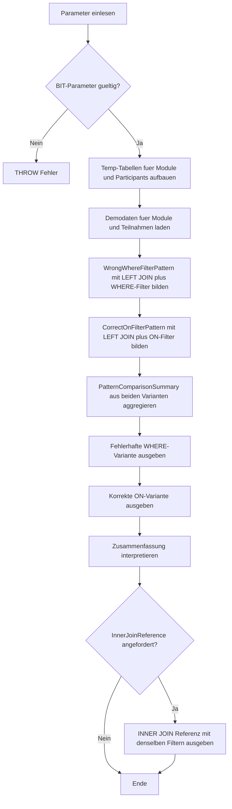

# OuterJoinFilterTrap.sql

Dieses Skript zeigt eine der haeufigsten Stolperstellen bei `LEFT JOIN`: Ein Filter auf die rechte Tabelle in der `WHERE`-Klausel entfernt unbeabsichtigt genau jene linken Zeilen, die man eigentlich mit `NULL` sichtbar machen wollte. Die Demo stellt dem Fehlerbild direkt die korrekte Variante mit Filter im `ON`-Teil gegenueber.

## Uebersicht

<!-- SQLDOC:SUMMARY_TABLE:BEGIN -->
| Feld | Wert |
|---|---|
| Script | [OuterJoinFilterTrap.sql](OuterJoinFilterTrap.sql) |
| Version | `1.0` |
| Typ | `didactic-lab` |
| Kapitel | `03_JOIN` |
| Sicherheit | `read-only-tempdb` |
| Zweck | Zeigt die LEFT JOIN Filterfalle und die korrekte Platzierung des rechten Filters im `ON`. |
<!-- SQLDOC:SUMMARY_TABLE:END -->

## Einordnung

Didaktisch ist diese Falle wichtig, weil ein `LEFT JOIN` oft gerade dazu dient, fehlende Zuordnungen zu finden. Sobald Bedingungen auf die rechte Tabelle erst in `WHERE` landen, bleiben nur noch Zeilen uebrig, bei denen rechts bereits ein Treffer existiert. Damit verschwindet der Diagnosezweck des Outer Joins.

## Annahmen

- Die Demo nutzt nur tempdb-Objekte mit einem kleinen Modul- und Teilnehmerbestand.
- Als typischer Suchfall gilt: "Zeige alle Module und markiere, ob es einen aktiven Teilnehmer im Zielterm gibt."
- `cancelled`, `planned` und andere nicht aktive Zustaende sollen keinen Match fuer den Lernfall liefern.
- Das optionale Referenz-Resultset dient nur dem direkten Vergleich zum faktischen Verhalten eines `INNER JOIN`.

## Anwendungsfall

Das Skript eignet sich fuer Trainings, Reviews und Code Walkthroughs, in denen Join-Bedingungen bewusst sortiert werden sollen: Schluesselbeziehung zuerst, rechte Filter fuer den Outer-Join-Fall in den `ON`-Teil, abschliessende globale Filter erst danach. Die Zusammenfassung zeigt, wie stark sich die Zeilenmenge beider Varianten unterscheidet.

## Parameter

<!-- SQLDOC:PARAMETERS_TABLE:BEGIN -->
| Parameter | SQL-Typ | Pflicht | Beschreibung |
|---|---|---|---|
| `@TargetTerm` | `NVARCHAR(20)` | Nein | Optionaler Zielterm fuer die rechte Teilnehmermenge. |
| `@OnlyModulesWithoutMatch` | `BIT` | Nein | Zeigt bei `1` nur Module ohne passenden rechten Treffer. |
| `@IncludeInnerJoinReference` | `BIT` | Nein | Gibt bei `1` ein zusaetzliches Referenz-Resultset mit explizitem `INNER JOIN` aus. |
<!-- SQLDOC:PARAMETERS_TABLE:END -->

## Abhaengigkeiten

<!-- SQLDOC:DEPENDENCIES_LIST:BEGIN -->
- `tempdb`
- `temp tables`
- `LEFT JOIN`
- `CTE`
- `CASE`
<!-- SQLDOC:DEPENDENCIES_LIST:END -->

## Hinweise

- `WrongWhereFilterPattern` zeigt den klassischen Fehler: Der rechte Filter in `WHERE` entfernt unverknuepfte Module.
- `CorrectOnFilterPattern` behaelt alle Module der linken Seite und liefert fuer fehlende Treffer `NULL`.
- `PatternComparisonSummary` verdichtet den Unterschied auf Zeilenmenge und Anzahl unverknuepfter Module.
- Mit `@OnlyModulesWithoutMatch = 1` laesst sich der eigentliche Diagnosefall fokussiert anschauen.

## Versionshistorie

<!-- SQLDOC:VERSION_HISTORY_TABLE:BEGIN -->
| Version | Datum | User | Beschreibung |
|---|---|---|---|
| `1.0` | `2026-04-17` | `ER` | Erstversion fuer die didaktische LEFT JOIN Filterfalle |
<!-- SQLDOC:VERSION_HISTORY_TABLE:END -->

## Ablauf

<!-- SQLDOC:MERMAID:BEGIN -->

<!-- SQLDOC:MERMAID:END -->

## SQL-Code

<!-- SQLDOC:SQL_CODE:BEGIN -->
```sql
/*
BEGIN:SQL-HEADER v1
---
sql_header: v1
script_name: "OuterJoinFilterTrap.sql"
script_version: "1.0"
script_type: "didactic-lab"
chapter: "03_JOIN"
purpose: >
  Zeigt eine typische Filterfalle bei LEFT JOINs, indem derselbe
  Demo-Datensatz einmal mit einem Filter in der WHERE-Klausel und einmal
  mit dem korrekten Filter im ON-Teil ausgewertet wird.
parameters:
  - name: "@TargetTerm"
    sql_type: "NVARCHAR(20)"
    direction: "IN"
    required: false
    description: "Filtert optional auf einen bestimmten Term"
  - name: "@OnlyModulesWithoutMatch"
    sql_type: "BIT"
    direction: "IN"
    required: false
    description: "1 = nur Module ohne passenden rechten Treffer zeigen"
  - name: "@IncludeInnerJoinReference"
    sql_type: "BIT"
    direction: "IN"
    required: false
    description: "1 = zusaetzlich ein Referenz-Resultset mit echtem INNER JOIN ausgeben"
result_sets:
  - name: "WrongWhereFilterPattern"
    description: "LEFT JOIN mit Filter in WHERE; unverknuepfte linke Zeilen gehen verloren"
  - name: "CorrectOnFilterPattern"
    description: "LEFT JOIN mit Filter im ON-Teil; unverknuepfte linke Zeilen bleiben erhalten"
  - name: "PatternComparisonSummary"
    description: "Vergleicht Zeilenmenge und Anzahl unverknuepfter Module beider Varianten"
  - name: "InnerJoinReference"
    description: "Optionale Referenz auf das Resultat eines echten INNER JOINs"
dependencies:
  - "tempdb"
  - "temp tables"
  - "LEFT JOIN"
  - "CTE"
  - "CASE"
safety:
  level: "read-only-tempdb"
  writes_data: false
documentation:
  markdown_file: "T-SQL/03_JOIN/SQLScripts/OuterJoinFilterTrap.md"
  sync_blocks:
    - "SUMMARY_TABLE"
    - "PARAMETERS_TABLE"
    - "DEPENDENCIES_LIST"
    - "VERSION_HISTORY_TABLE"
    - "SQL_CODE"
  mermaid:
    mode: "ai-agent-from-sql"
    source: "script-body"
main_responsible:
  name: "Erhard Rainer"
  initials: "ER"
version_history:
  - version: "1.0"
    date: "2026-04-17"
    user: "ER"
    description: "Erstversion fuer die didaktische LEFT JOIN Filterfalle"
notes:
  - "Die Demo verwendet nur tempdb-Objekte und eine kleine Modul- und Teilnehmertabelle."
  - "Der fachliche Fokus liegt auf der Position des Filters, nicht auf produktiven Kursregeln."
---
END:SQL-HEADER v1
*/

SET NOCOUNT ON;

DECLARE @TargetTerm NVARCHAR(20) = N'2026-Q2';
DECLARE @OnlyModulesWithoutMatch BIT = 0;
DECLARE @IncludeInnerJoinReference BIT = 1;

IF @OnlyModulesWithoutMatch NOT IN (0, 1)
BEGIN
    THROW 50000, '@OnlyModulesWithoutMatch muss 0 oder 1 sein.', 1;
END;

IF @IncludeInnerJoinReference NOT IN (0, 1)
BEGIN
    THROW 50000, '@IncludeInnerJoinReference muss 0 oder 1 sein.', 1;
END;

DROP TABLE IF EXISTS #Modules;
DROP TABLE IF EXISTS #Participants;

CREATE TABLE #Modules
(
    ModuleID INT NOT NULL PRIMARY KEY,
    ModuleCode NVARCHAR(20) NOT NULL,
    ModuleName NVARCHAR(100) NOT NULL,
    DeliveryMode NVARCHAR(20) NOT NULL
);

CREATE TABLE #Participants
(
    ParticipantID INT NOT NULL PRIMARY KEY,
    ModuleID INT NOT NULL,
    ParticipantName NVARCHAR(100) NOT NULL,
    TermCode NVARCHAR(20) NOT NULL,
    EnrollmentStatus NVARCHAR(20) NOT NULL
);

INSERT INTO #Modules (ModuleID, ModuleCode, ModuleName, DeliveryMode)
VALUES
    (101, N'JOIN-101', N'Join Fundamentals', N'classroom'),
    (102, N'JOIN-201', N'Outer Join Diagnostics', N'virtual'),
    (103, N'JOIN-301', N'Bridge Pattern Review', N'classroom'),
    (104, N'JOIN-401', N'Performance Clinic', N'virtual');

INSERT INTO #Participants (ParticipantID, ModuleID, ParticipantName, TermCode, EnrollmentStatus)
VALUES
    (1, 101, N'Anna Berger', N'2026-Q2', N'active'),
    (2, 101, N'Ben Krueger', N'2026-Q2', N'waitlist'),
    (3, 102, N'Clara Stein', N'2026-Q1', N'active'),
    (4, 102, N'Denis Wolf', N'2026-Q2', N'cancelled'),
    (5, 103, N'Eva Kurz', N'2026-Q3', N'planned');

;WITH WrongWhereFilterPattern AS
(
    SELECT
        m.ModuleID,
        m.ModuleCode,
        m.ModuleName,
        m.DeliveryMode,
        p.ParticipantID,
        p.ParticipantName,
        p.TermCode,
        p.EnrollmentStatus,
        CASE
            WHEN p.ParticipantID IS NULL THEN 'missing-after-where-filter'
            ELSE 'matched-row'
        END AS MatchStatus
    FROM #Modules AS m
    LEFT JOIN #Participants AS p
        ON p.ModuleID = m.ModuleID
    WHERE (@TargetTerm IS NULL OR p.TermCode = @TargetTerm)
      AND p.EnrollmentStatus = N'active'
),
CorrectOnFilterPattern AS
(
    SELECT
        m.ModuleID,
        m.ModuleCode,
        m.ModuleName,
        m.DeliveryMode,
        p.ParticipantID,
        p.ParticipantName,
        p.TermCode,
        p.EnrollmentStatus,
        CASE
            WHEN p.ParticipantID IS NULL THEN 'left-row-preserved'
            ELSE 'matched-row'
        END AS MatchStatus
    FROM #Modules AS m
    LEFT JOIN #Participants AS p
        ON p.ModuleID = m.ModuleID
       AND (@TargetTerm IS NULL OR p.TermCode = @TargetTerm)
       AND p.EnrollmentStatus = N'active'
),
PatternComparisonSummary AS
(
    SELECT
        'wrong-where-filter' AS PatternName,
        COUNT(*) AS RowCount,
        SUM(CASE WHEN ParticipantID IS NULL THEN 1 ELSE 0 END) AS UnmatchedModuleCount
    FROM WrongWhereFilterPattern

    UNION ALL

    SELECT
        'correct-on-filter' AS PatternName,
        COUNT(*) AS RowCount,
        SUM(CASE WHEN ParticipantID IS NULL THEN 1 ELSE 0 END) AS UnmatchedModuleCount
    FROM CorrectOnFilterPattern
)
SELECT
    wwfp.ModuleCode,
    wwfp.ModuleName,
    wwfp.DeliveryMode,
    wwfp.ParticipantName,
    wwfp.TermCode,
    wwfp.EnrollmentStatus,
    wwfp.MatchStatus,
    CAST('Filter in WHERE entfernt Module ohne aktiven Treffer im Zielterm.' AS NVARCHAR(120)) AS LearningNote
FROM WrongWhereFilterPattern AS wwfp
WHERE @OnlyModulesWithoutMatch = 0
   OR wwfp.ParticipantID IS NULL
ORDER BY
    wwfp.ModuleCode,
    wwfp.ParticipantName;

SELECT
    cofp.ModuleCode,
    cofp.ModuleName,
    cofp.DeliveryMode,
    cofp.ParticipantName,
    cofp.TermCode,
    cofp.EnrollmentStatus,
    cofp.MatchStatus,
    CASE
        WHEN cofp.ParticipantID IS NULL THEN N'Modul bleibt trotz fehlendem rechten Treffer erhalten.'
        ELSE N'Passender aktiver Teilnehmer im Zielterm gefunden.'
    END AS LearningNote
FROM CorrectOnFilterPattern AS cofp
WHERE @OnlyModulesWithoutMatch = 0
   OR cofp.ParticipantID IS NULL
ORDER BY
    cofp.ModuleCode,
    cofp.ParticipantName;

SELECT
    pcs.PatternName,
    pcs.RowCount,
    pcs.UnmatchedModuleCount,
    CASE
        WHEN pcs.PatternName = 'wrong-where-filter'
            THEN 'Wirkt faktisch wie ein INNER JOIN fuer den aktiven Termfilter.'
        ELSE 'Bewahrt alle linken Module und markiert fehlende Treffer mit NULL.'
    END AS Interpretation
FROM PatternComparisonSummary AS pcs
ORDER BY
    pcs.PatternName;

IF @IncludeInnerJoinReference = 1
BEGIN
    SELECT
        m.ModuleCode,
        m.ModuleName,
        p.ParticipantName,
        p.TermCode,
        p.EnrollmentStatus,
        CAST('Referenz: expliziter INNER JOIN mit denselben Filterbedingungen.' AS NVARCHAR(100)) AS JoinReference
    FROM #Modules AS m
    INNER JOIN #Participants AS p
        ON p.ModuleID = m.ModuleID
       AND (@TargetTerm IS NULL OR p.TermCode = @TargetTerm)
       AND p.EnrollmentStatus = N'active'
    ORDER BY
        m.ModuleCode,
        p.ParticipantName;
END;
```
<!-- SQLDOC:SQL_CODE:END -->
