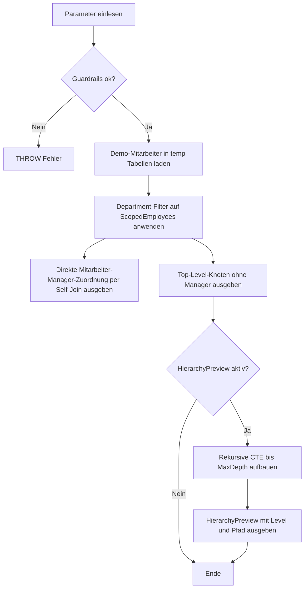

# SelfJoinHierarchyStarter.sql

Dieses Skript fuehrt in das Self-Join-Muster fuer Hierarchien ein. Auf einer kleinen Mitarbeiter-Demobasis werden zunaechst direkte Manager-Beziehungen ueber einen Join derselben Tabelle auf sich selbst sichtbar gemacht und optional anschliessend mehrere Ebenen per rekursiver CTE vorgelaufen.

## Uebersicht

<!-- SQLDOC:SUMMARY_TABLE:BEGIN -->
| Feld | Wert |
|---|---|
| Script | [SelfJoinHierarchyStarter.sql](SelfJoinHierarchyStarter.sql) |
| Version | `1.0` |
| Typ | `didactic-lab` |
| Kapitel | `03_JOIN` |
| Sicherheit | `read-only-tempdb` |
| Zweck | Zeigt ein Self-Join-Startermuster fuer Hierarchien und ergaenzt die direkte Manager-Zuordnung um eine optionale Ebenenvorschau. |
<!-- SQLDOC:SUMMARY_TABLE:END -->

## Einordnung

Ein Self-Join ist oft der erste Schritt, um Eltern-Kind-Beziehungen innerhalb derselben Tabelle lesbar zu machen. Bei Hierarchien bedeutet das meistens: eine Zeile repraesentiert den Mitarbeiter, eine zweite aliasierte Sicht derselben Tabelle repraesentiert den direkten Manager.

## Annahmen

- Das Skript arbeitet rein didaktisch mit einer kleinen Mitarbeiterhierarchie in temp-Objekten.
- Der direkte Self-Join ist das Kernmuster; die rekursive CTE ist eine bewusst einfache Erweiterung fuer mehrere Ebenen.
- Ein Department-Filter kann dazu fuehren, dass ein Manager ausserhalb des aktuellen Ausschnitts liegt und deshalb als fehlend markiert wird.
- `@MaxDepth` begrenzt die Vorschau absichtlich konservativ, damit der Ablauf im Training nachvollziehbar bleibt.

## Anwendungsfall

Die erste Ausgabe zeigt pro Mitarbeiter den direkten Manager oder kennzeichnet Top-Level-Knoten. Die zweite Ausgabe isoliert nur die Hierarchie-Wurzeln. Optional folgt eine dritte Ausgabe mit einem einfachen Ebenenpfad, damit Lernende den Schritt vom Self-Join zur rekursiven Hierarchieabfrage sehen koennen.

## Parameter

<!-- SQLDOC:PARAMETERS_TABLE:BEGIN -->
| Parameter | SQL-Typ | Pflicht | Beschreibung |
|---|---|---|---|
| `@DepartmentFilter` | `NVARCHAR(20)` | Nein | Optionaler Filter auf einen Fachbereich innerhalb der Demo-Hierarchie. |
| `@MaxDepth` | `INT` | Nein | Begrenzt die rekursive Hierarchie-Vorschau auf eine maximale Tiefe. |
| `@IncludeHierarchyPreview` | `BIT` | Nein | Steuert, ob die rekursive Ebenenvorschau zusaetzlich ausgegeben wird. |
<!-- SQLDOC:PARAMETERS_TABLE:END -->

## Abhaengigkeiten

<!-- SQLDOC:DEPENDENCIES_LIST:BEGIN -->
- `tempdb`
- `temp tables`
- `self join`
- `recursive CTE`
- `hierarchical ordering`
<!-- SQLDOC:DEPENDENCIES_LIST:END -->

## Hinweise

- Fuer direkte Hierarchiebeziehungen reicht ein normaler `LEFT JOIN` derselben Tabelle oft bereits aus.
- Der Alias des Kindknotens und der Alias des Elternknotens sollten im Training bewusst sprechend gewaehlt werden.
- Die rekursive CTE baut auf denselben Schluesselbeziehungen auf und erweitert nur die Anzahl der sichtbaren Ebenen.

## Versionshistorie

<!-- SQLDOC:VERSION_HISTORY_TABLE:BEGIN -->
| Version | Datum | User | Beschreibung |
|---|---|---|---|
| `1.0` | `2026-04-19` | `ER` | Erstversion fuer ein didaktisches Self-Join-Starterskript zu Hierarchien |
<!-- SQLDOC:VERSION_HISTORY_TABLE:END -->

## Ablauf

<!-- SQLDOC:MERMAID:BEGIN -->

<!-- SQLDOC:MERMAID:END -->

## SQL-Code

<!-- SQLDOC:SQL_CODE:BEGIN -->
```sql
/*
BEGIN:SQL-HEADER v1
---
sql_header: v1
script_name: "SelfJoinHierarchyStarter.sql"
script_version: "1.0"
script_type: "didactic-lab"
chapter: "03_JOIN"
purpose: >
  Zeigt ein Self-Join-Startermuster fuer Hierarchien auf einer kleinen
  Mitarbeiter-Demobasis und kombiniert direkte Manager-Zuordnungen mit
  einer rekursiven Ebenenvorschau.
parameters:
  - name: "@DepartmentFilter"
    sql_type: "NVARCHAR(20)"
    direction: "IN"
    required: false
    description: "Optionaler Filter auf einen Fachbereich innerhalb der Demo-Hierarchie"
  - name: "@MaxDepth"
    sql_type: "INT"
    direction: "IN"
    required: false
    description: "Begrenzt die rekursive Hierarchie-Vorschau auf eine maximale Tiefe"
  - name: "@IncludeHierarchyPreview"
    sql_type: "BIT"
    direction: "IN"
    required: false
    description: "1 = rekursive Ebenenvorschau zusaetzlich ausgeben, 0 = nur direkte Self-Join-Ergebnisse zeigen"
result_sets:
  - name: "DirectManagerMapping"
    description: "Direkte Mitarbeiter-Manager-Zuordnungen ueber ein Self-Join-Muster"
  - name: "TopLevelNodes"
    description: "Top-Level-Knoten ohne Manager als Einstiegspunkt in die Hierarchie"
  - name: "HierarchyPreview"
    description: "Optionale rekursive Vorschau mit Ebenenpfad innerhalb der Demo-Hierarchie"
dependencies:
  - "tempdb"
  - "temp tables"
  - "self join"
  - "recursive CTE"
  - "hierarchical ordering"
safety:
  level: "read-only-tempdb"
  writes_data: false
documentation:
  markdown_file: "T-SQL/03_JOIN/SQLScripts/SelfJoinHierarchyStarter.md"
  sync_blocks:
    - "SUMMARY_TABLE"
    - "PARAMETERS_TABLE"
    - "DEPENDENCIES_LIST"
    - "VERSION_HISTORY_TABLE"
    - "SQL_CODE"
  mermaid:
    mode: "ai-agent-from-sql"
    source: "script-body"
main_responsible:
  name: "Erhard Rainer"
  initials: "ER"
version_history:
  - version: "1.0"
    date: "2026-04-19"
    user: "ER"
    description: "Erstversion fuer ein didaktisches Self-Join-Starterskript zu Hierarchien"
notes:
  - "Die Demo-Hierarchie wird ausschliesslich in temp-Objekten aufgebaut."
  - "Der direkte Self-Join bleibt die Hauptidee; die rekursive CTE dient nur als Erweiterung fuer mehrere Ebenen."
---
END:SQL-HEADER v1
*/

SET NOCOUNT ON;

DECLARE @DepartmentFilter NVARCHAR(20) = NULL;
DECLARE @MaxDepth INT = 4;
DECLARE @IncludeHierarchyPreview BIT = 1;

IF @MaxDepth < 1 OR @MaxDepth > 10
BEGIN
    THROW 50000, '@MaxDepth muss zwischen 1 und 10 liegen.', 1;
END;

IF @IncludeHierarchyPreview NOT IN (0, 1)
BEGIN
    THROW 50001, '@IncludeHierarchyPreview muss 0 oder 1 sein.', 1;
END;

DROP TABLE IF EXISTS #Employees;
DROP TABLE IF EXISTS #ScopedEmployees;

CREATE TABLE #Employees
(
    EmployeeID INT NOT NULL PRIMARY KEY,
    EmployeeName NVARCHAR(100) NOT NULL,
    ManagerID INT NULL,
    DepartmentCode NVARCHAR(20) NOT NULL,
    JobTitle NVARCHAR(80) NOT NULL
);

INSERT INTO #Employees
(
    EmployeeID,
    EmployeeName,
    ManagerID,
    DepartmentCode,
    JobTitle
)
VALUES
    (1, N'Anika Berg',   NULL, N'SALES', N'Head of Sales'),
    (2, N'Bora Klein',      1, N'SALES', N'Sales Lead'),
    (3, N'Cem Yilmaz',      2, N'SALES', N'Account Manager'),
    (4, N'Dina Roth',       2, N'SALES', N'Inside Sales Specialist'),
    (5, N'Elif Mert',    NULL, N'DATA',  N'Head of Data'),
    (6, N'Faris Noor',      5, N'DATA',  N'Data Engineering Lead'),
    (7, N'Greta Hahn',      6, N'DATA',  N'Data Engineer'),
    (8, N'Hugo Weiss',      5, N'DATA',  N'Analytics Engineer'),
    (9, N'Ina Vogel',    NULL, N'OPS',   N'Head of Operations'),
    (10, N'Jan Sturm',      9, N'OPS',   N'Operations Coordinator');

SELECT
    e.EmployeeID,
    e.EmployeeName,
    e.ManagerID,
    e.DepartmentCode,
    e.JobTitle
INTO #ScopedEmployees
FROM #Employees AS e
WHERE @DepartmentFilter IS NULL
   OR e.DepartmentCode = @DepartmentFilter;

SELECT
    child.EmployeeID,
    child.EmployeeName,
    child.DepartmentCode,
    child.JobTitle,
    child.ManagerID,
    parent.EmployeeName AS ManagerName,
    parent.JobTitle AS ManagerTitle,
    CASE
        WHEN child.ManagerID IS NULL THEN N'Top-level node'
        WHEN parent.EmployeeID IS NULL THEN N'Manager missing in current filter'
        ELSE N'Direct self join match'
    END AS JoinInterpretation
FROM #ScopedEmployees AS child
LEFT JOIN #ScopedEmployees AS parent
    ON parent.EmployeeID = child.ManagerID
ORDER BY
    child.DepartmentCode,
    child.EmployeeID;

SELECT
    root.EmployeeID,
    root.EmployeeName,
    root.DepartmentCode,
    root.JobTitle
FROM #ScopedEmployees AS root
WHERE root.ManagerID IS NULL
ORDER BY
    root.DepartmentCode,
    root.EmployeeID;

IF @IncludeHierarchyPreview = 1
BEGIN
    ;WITH Hierarchy AS
    (
        SELECT
            root.EmployeeID,
            root.EmployeeName,
            root.ManagerID,
            root.DepartmentCode,
            root.JobTitle,
            CAST(root.EmployeeName AS NVARCHAR(400)) AS HierarchyPath,
            0 AS HierarchyLevel
        FROM #ScopedEmployees AS root
        WHERE root.ManagerID IS NULL

        UNION ALL

        SELECT
            child.EmployeeID,
            child.EmployeeName,
            child.ManagerID,
            child.DepartmentCode,
            child.JobTitle,
            CAST(parent.HierarchyPath + N' > ' + child.EmployeeName AS NVARCHAR(400)) AS HierarchyPath,
            parent.HierarchyLevel + 1 AS HierarchyLevel
        FROM #ScopedEmployees AS child
        INNER JOIN Hierarchy AS parent
            ON parent.EmployeeID = child.ManagerID
        WHERE parent.HierarchyLevel + 1 <= @MaxDepth
    )
    SELECT
        h.EmployeeID,
        h.EmployeeName,
        h.DepartmentCode,
        h.JobTitle,
        h.ManagerID,
        h.HierarchyLevel,
        h.HierarchyPath
    FROM Hierarchy AS h
    ORDER BY
        h.DepartmentCode,
        h.HierarchyPath
    OPTION (MAXRECURSION 10);
END;
```
<!-- SQLDOC:SQL_CODE:END -->
