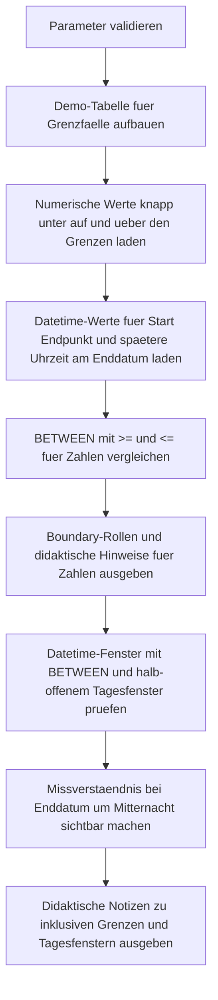

# BetweenBoundaryCheck.sql

Dieses Skript zeigt anhand einer kleinen Demo-Menge, dass `BETWEEN` beide Grenzen einschliesst. Zusaetzlich kontrastiert es numerische Grenzpruefungen mit einer Datumsvariante, bei der ein Endzeitpunkt um Mitternacht haeufig falsch interpretiert wird.

## Uebersicht

<!-- SQLDOC:SUMMARY_TABLE:BEGIN -->
| Feld | Wert |
|---|---|
| Script | [BetweenBoundaryCheck.sql](BetweenBoundaryCheck.sql) |
| Version | `1.0` |
| Typ | `didactic-lab` |
| Kapitel | `04_Where` |
| Sicherheit | `read-only-tempdb` |
| Zweck | Macht inklusive BETWEEN-Grenzen und typische Missverstaendnisse bei Datums-Endpunkten sichtbar. |
<!-- SQLDOC:SUMMARY_TABLE:END -->

## Einordnung

`BETWEEN` wird oft als kompakte Kurzform fuer Bereichsfilter gelesen, aber die genaue Inklusivitaet der Grenzen wird im Alltag leicht uebersehen. Das Skript stellt deshalb direkte Randfaelle den expliziten Vergleichen mit `>=` und `<=` gegenueber.

## Annahmen

- Es handelt sich um eine didaktische Erstversion mit tempdb-basierten Demo-Daten.
- Die Datumsdemo verwendet absichtlich einen Endzeitpunkt um Mitternacht, um ein haeufiges Missverstaendnis zu zeigen.
- Fuer Tagesfenster wird zusaetzlich ein halb-offenes Intervall als robuste Alternative gezeigt.

## Anwendungsfall

Das Skript eignet sich fuer Schulung, Review und Selbstkontrolle, wenn Bereichsfilter mit `BETWEEN` verstanden oder gegen explizite Vergleichsausdruecke abgeglichen werden sollen. Besonders nuetzlich ist es fuer Zahlenbereiche und Datumsfilter mit Endpunkten.

## Parameter

<!-- SQLDOC:PARAMETERS_TABLE:BEGIN -->
| Parameter | SQL-Typ | Pflicht | Beschreibung |
|---|---|---|---|
| `@AmountLowerBound` | `DECIMAL(10,2)` | Nein | Untere inklusive Grenze fuer die numerische BETWEEN-Demo. |
| `@AmountUpperBound` | `DECIMAL(10,2)` | Nein | Obere inklusive Grenze fuer die numerische BETWEEN-Demo. |
| `@WindowStart` | `DATETIME2(0)` | Nein | Startzeitpunkt fuer die Datumsfenster-Demo. |
| `@WindowEnd` | `DATETIME2(0)` | Nein | Endzeitpunkt fuer die BETWEEN-Datumsdemo; absichtlich als Grenzwert statt Tagesende. |
| `@ResultMode` | `VARCHAR(20)` | Nein | Filtert `all`, `numeric`, `datetime` oder `notes`. |
<!-- SQLDOC:PARAMETERS_TABLE:END -->

## Abhaengigkeiten

<!-- SQLDOC:DEPENDENCIES_LIST:BEGIN -->
- `tempdb temporary tables`
- `BETWEEN`
- `CASE`
- `DATEADD`
- `DATETIME2`
<!-- SQLDOC:DEPENDENCIES_LIST:END -->

## Hinweise

- Die erste Ausgabe zeigt direkt, dass `BETWEEN` und `>=`/`<=` bei Zahlen dieselben Treffer liefern.
- Die Datumsausgabe macht sichtbar, dass ein Endwert um `00:00:00` nur genau diesen Zeitpunkt einschliesst.
- Die Notiz-Ausgabe verdichtet die zentrale Lernbotschaft fuer Reviews oder Unterricht.

## Versionshistorie

<!-- SQLDOC:VERSION_HISTORY_TABLE:BEGIN -->
| Version | Datum | User | Beschreibung |
|---|---|---|---|
| `1.0` | `2026-04-19` | `ER` | Erstversion fuer ein didaktisches Lab zu inklusiven BETWEEN-Grenzen |
<!-- SQLDOC:VERSION_HISTORY_TABLE:END -->

## Ablauf

<!-- SQLDOC:MERMAID:BEGIN -->

<!-- SQLDOC:MERMAID:END -->

## SQL-Code

<!-- SQLDOC:SQL_CODE:BEGIN -->
```sql
/*
BEGIN:SQL-HEADER v1
---
sql_header: v1
script_name: "BetweenBoundaryCheck.sql"
script_version: "1.0"
script_type: "didactic-lab"
chapter: "04_Where"

purpose: >
  Macht sichtbar, dass BETWEEN beide Grenzen einschliesst, zeigt die
  Gleichwertigkeit zu >= und <= fuer numerische Grenzen und kontrastiert
  dies mit einem typischen Datums-Missverstaendnis bei Endzeitpunkten.

parameters:
  - name: "@AmountLowerBound"
    sql_type: "DECIMAL(10,2)"
    direction: "IN"
    required: false
    description: "Untere inklusive Grenze fuer die numerische BETWEEN-Demo"
  - name: "@AmountUpperBound"
    sql_type: "DECIMAL(10,2)"
    direction: "IN"
    required: false
    description: "Obere inklusive Grenze fuer die numerische BETWEEN-Demo"
  - name: "@WindowStart"
    sql_type: "DATETIME2(0)"
    direction: "IN"
    required: false
    description: "Startzeitpunkt fuer die Datumsfenster-Demo"
  - name: "@WindowEnd"
    sql_type: "DATETIME2(0)"
    direction: "IN"
    required: false
    description: "Endzeitpunkt fuer die BETWEEN-Datumsdemo; absichtlich als Grenzwert statt Tagesende"
  - name: "@ResultMode"
    sql_type: "VARCHAR(20)"
    direction: "IN"
    required: false
    description: "Filtert all, numeric, datetime oder notes"

result_sets:
  - name: "NumericBoundaryCheck"
    description: "Vergleicht BETWEEN mit >= und <= und markiert Treffer genau auf den Grenzen"
  - name: "DatetimeBoundaryCheck"
    description: "Zeigt inklusive Endpunkte und das Missverstaendnis eines Enddatums um Mitternacht"
  - name: "BoundaryTeachingNotes"
    description: "Fasst die didaktischen Kernaussagen zu BETWEEN-Grenzen zusammen"

dependencies:
  - "tempdb temporary tables"
  - "BETWEEN"
  - "CASE"
  - "DATEADD"
  - "DATETIME2"

safety:
  level: "read-only-tempdb"
  writes_data: false

documentation:
  markdown_file: "T-SQL/04_Where/SQLScripts/BetweenBoundaryCheck.md"
  sync_blocks:
    - "SUMMARY_TABLE"
    - "PARAMETERS_TABLE"
    - "DEPENDENCIES_LIST"
    - "VERSION_HISTORY_TABLE"
    - "SQL_CODE"
  mermaid:
    mode: "ai-agent-from-sql"
    source: "script-body"

main_responsible:
  name: "Erhard Rainer"
  initials: "ER"

version_history:
  - version: "1.0"
    date: "2026-04-19"
    user: "ER"
    description: "Erstversion fuer ein didaktisches Lab zu inklusiven BETWEEN-Grenzen"

notes:
  - "Das Skript arbeitet ausschliesslich mit tempdb-Objekten und Demo-Daten."
  - "Die Datumsdemo kontrastiert BETWEEN mit einem halb-offenen Fenster fuer Tagesbereiche."
---
END:SQL-HEADER v1
*/

SET NOCOUNT ON;

DECLARE @AmountLowerBound DECIMAL(10, 2) = 100.00;
DECLARE @AmountUpperBound DECIMAL(10, 2) = 150.00;
DECLARE @WindowStart DATETIME2(0) = '2026-03-01 00:00:00';
DECLARE @WindowEnd DATETIME2(0) = '2026-03-03 00:00:00';
DECLARE @ResultMode VARCHAR(20) = 'all';

IF @AmountLowerBound IS NULL OR @AmountUpperBound IS NULL
BEGIN
    THROW 50470, '@AmountLowerBound und @AmountUpperBound duerfen nicht NULL sein.', 1;
END;

IF @AmountLowerBound > @AmountUpperBound
BEGIN
    THROW 50471, '@AmountLowerBound darf nicht groesser als @AmountUpperBound sein.', 1;
END;

IF @WindowStart IS NULL OR @WindowEnd IS NULL
BEGIN
    THROW 50472, '@WindowStart und @WindowEnd duerfen nicht NULL sein.', 1;
END;

IF @WindowStart > @WindowEnd
BEGIN
    THROW 50473, '@WindowStart darf nicht spaeter als @WindowEnd sein.', 1;
END;

IF @ResultMode NOT IN ('all', 'numeric', 'datetime', 'notes')
BEGIN
    THROW 50474, '@ResultMode muss all, numeric, datetime oder notes sein.', 1;
END;

DROP TABLE IF EXISTS #BoundarySamples;

CREATE TABLE #BoundarySamples
(
    SampleID INT NOT NULL PRIMARY KEY,
    ScenarioGroup VARCHAR(20) NOT NULL,
    SampleLabel NVARCHAR(140) NOT NULL,
    AmountValue DECIMAL(10, 2) NULL,
    EventTime DATETIME2(0) NULL
);

INSERT INTO #BoundarySamples
(
    SampleID,
    ScenarioGroup,
    SampleLabel,
    AmountValue,
    EventTime
)
VALUES
    (1, 'numeric', N'Knapp unter der unteren Grenze', 99.99, NULL),
    (2, 'numeric', N'Exakt auf der unteren Grenze', 100.00, NULL),
    (3, 'numeric', N'Wert innerhalb des Bereichs', 125.00, NULL),
    (4, 'numeric', N'Exakt auf der oberen Grenze', 150.00, NULL),
    (5, 'numeric', N'Knapp oberhalb der oberen Grenze', 150.01, NULL),
    (6, 'datetime', N'Exakt zum Startzeitpunkt', NULL, '2026-03-01 00:00:00'),
    (7, 'datetime', N'Innerhalb des Fensters am Folgetag', NULL, '2026-03-02 15:30:00'),
    (8, 'datetime', N'Exakt auf dem Endzeitpunkt um Mitternacht', NULL, '2026-03-03 00:00:00'),
    (9, 'datetime', N'Spaeter am selben Enddatum', NULL, '2026-03-03 09:15:00'),
    (10, 'datetime', N'Kurz nach dem Zieltag', NULL, '2026-03-04 00:00:00');

;WITH NumericChecks AS
(
    SELECT
        bs.SampleID,
        bs.SampleLabel,
        bs.AmountValue,
        IsBetweenInclusive =
            CASE
                WHEN bs.AmountValue BETWEEN @AmountLowerBound AND @AmountUpperBound THEN 1
                ELSE 0
            END,
        IsExplicitInclusive =
            CASE
                WHEN bs.AmountValue >= @AmountLowerBound
                 AND bs.AmountValue <= @AmountUpperBound THEN 1
                ELSE 0
            END,
        BoundaryRole =
            CASE
                WHEN bs.AmountValue = @AmountLowerBound THEN 'lower-bound'
                WHEN bs.AmountValue = @AmountUpperBound THEN 'upper-bound'
                WHEN bs.AmountValue BETWEEN @AmountLowerBound AND @AmountUpperBound THEN 'inside-range'
                ELSE 'outside-range'
            END
    FROM #BoundarySamples AS bs
    WHERE bs.ScenarioGroup = 'numeric'
)
SELECT
    nc.SampleID,
    nc.SampleLabel,
    nc.AmountValue,
    RangeText = CONCAT(@AmountLowerBound, ' bis ', @AmountUpperBound),
    nc.IsBetweenInclusive,
    nc.IsExplicitInclusive,
    ExpressionsMatch =
        CASE
            WHEN nc.IsBetweenInclusive = nc.IsExplicitInclusive THEN 1
            ELSE 0
        END,
    nc.BoundaryRole,
    TeachingNote =
        CASE
            WHEN nc.BoundaryRole IN ('lower-bound', 'upper-bound')
                THEN 'Grenzwert wird von BETWEEN eingeschlossen.'
            WHEN nc.BoundaryRole = 'inside-range'
                THEN 'Innenliegender Wert wird von beiden Schreibweisen getroffen.'
            ELSE 'Wert ausserhalb des Bereichs bleibt bei beiden Schreibweisen draussen.'
        END
FROM NumericChecks AS nc
WHERE @ResultMode IN ('all', 'numeric')
ORDER BY
    nc.SampleID;

;WITH DatetimeChecks AS
(
    SELECT
        bs.SampleID,
        bs.SampleLabel,
        bs.EventTime,
        IncludedByBetween =
            CASE
                WHEN bs.EventTime BETWEEN @WindowStart AND @WindowEnd THEN 1
                ELSE 0
            END,
        IncludedByExplicitInclusive =
            CASE
                WHEN bs.EventTime >= @WindowStart
                 AND bs.EventTime <= @WindowEnd THEN 1
                ELSE 0
            END,
        IncludedByHalfOpenDayWindow =
            CASE
                WHEN bs.EventTime >= @WindowStart
                 AND bs.EventTime < DATEADD(DAY, 1, CAST(@WindowEnd AS DATE)) THEN 1
                ELSE 0
            END,
        BoundaryRole =
            CASE
                WHEN bs.EventTime = @WindowStart THEN 'start-boundary'
                WHEN bs.EventTime = @WindowEnd THEN 'end-boundary'
                WHEN CAST(bs.EventTime AS DATE) = CAST(@WindowEnd AS DATE)
                 AND bs.EventTime > @WindowEnd THEN 'same-date-after-end-time'
                WHEN bs.EventTime > @WindowStart AND bs.EventTime < @WindowEnd THEN 'inside-window'
                ELSE 'outside-window'
            END
    FROM #BoundarySamples AS bs
    WHERE bs.ScenarioGroup = 'datetime'
)
SELECT
    dc.SampleID,
    dc.SampleLabel,
    dc.EventTime,
    BetweenWindow = CONCAT(CONVERT(VARCHAR(19), @WindowStart, 120), ' bis ', CONVERT(VARCHAR(19), @WindowEnd, 120)),
    HalfOpenWindow = CONCAT(CONVERT(VARCHAR(19), @WindowStart, 120), ' bis < ', CONVERT(VARCHAR(19), DATEADD(DAY, 1, CAST(@WindowEnd AS DATE)), 120)),
    dc.IncludedByBetween,
    dc.IncludedByExplicitInclusive,
    dc.IncludedByHalfOpenDayWindow,
    dc.BoundaryRole,
    TeachingNote =
        CASE
            WHEN dc.BoundaryRole = 'start-boundary'
                THEN 'Der Startzeitpunkt ist bei BETWEEN eingeschlossen.'
            WHEN dc.BoundaryRole = 'end-boundary'
                THEN 'Der exakte Endzeitpunkt ist ebenfalls eingeschlossen.'
            WHEN dc.BoundaryRole = 'same-date-after-end-time'
                THEN 'Spaetere Uhrzeiten am Enddatum liegen ausserhalb eines bis Mitternacht definierten BETWEEN.'
            WHEN dc.BoundaryRole = 'inside-window'
                THEN 'Wert liegt sauber innerhalb des Zeitfensters.'
            ELSE 'Der Wert liegt ausserhalb beider Fensterdefinitionen.'
        END
FROM DatetimeChecks AS dc
WHERE @ResultMode IN ('all', 'datetime')
ORDER BY
    dc.SampleID;

SELECT
    NoteOrder,
    NoteTitle,
    NoteText
FROM
(
    VALUES
        (1, N'BETWEEN ist inklusiv', N'BETWEEN schliesst sowohl die untere als auch die obere Grenze ein.'),
        (2, N'Numerische Gleichwertigkeit', N'Fuer Zahlen ist BETWEEN logisch gleichbedeutend zu >= untere Grenze und <= obere Grenze.'),
        (3, N'Datums-Missverstaendnis', N'Ein Endwert wie 2026-03-03 00:00:00 deckt nur Mitternacht dieses Tages ab, nicht den restlichen Tag.'),
        (4, N'Halb-offenes Fenster', N'Fuer ganze Tage ist oft >= Start und < naechster Tag robuster als BETWEEN mit einem Mitternachts-Endwert.')
) AS notes(NoteOrder, NoteTitle, NoteText)
WHERE @ResultMode IN ('all', 'notes')
ORDER BY
    NoteOrder;
```
<!-- SQLDOC:SQL_CODE:END -->
