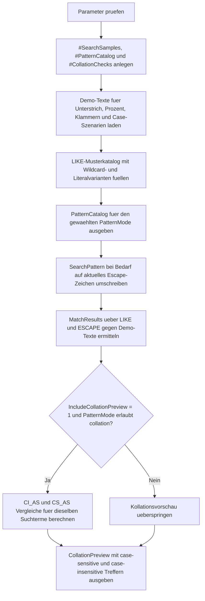

# LikePatternEdgeCases.sql

Dieses Skript zeigt typische Stolperstellen von `LIKE` in `WHERE`-Bedingungen: `_`, `%`, Zeichenklassen mit `[]`, literale Suche via `ESCAPE` und den Einfluss von Kollationen auf Gross- und Kleinschreibung.

## Uebersicht

<!-- SQLDOC:SUMMARY_TABLE:BEGIN -->
| Feld | Wert |
|---|---|
| Script | [LikePatternEdgeCases.sql](LikePatternEdgeCases.sql) |
| Version | `1.0` |
| Typ | `didactic-lab` |
| Kapitel | `04_Where` |
| Sicherheit | `read-only-tempdb` |
| Zweck | Zeigt LIKE-Sonderfaelle mit Wildcards, ESCAPE und Kollationsvorschau. |
<!-- SQLDOC:SUMMARY_TABLE:END -->

## Einordnung

`LIKE` wirkt auf den ersten Blick simpel, kippt aber schnell in Mehrdeutigkeit: Ein Unterstrich ist ohne Schutz kein Literal, ein Prozentzeichen erweitert ein Muster drastisch und eckige Klammern koennen entweder Zeichenklassen oder echte Zeichen meinen. Das Lab macht diese Unterschiede auf einer kleinen, kontrollierten Demo-Menge sichtbar.

## Annahmen

- Das Skript arbeitet ausschliesslich mit tempdb-nahen Demo-Objekten und setzt keine produktiven Tabellen voraus.
- Das Escape-Zeichen ist standardmaessig `!`, weil es in den Demo-Texten nicht natuerlich vorkommt.
- Die Kollationsvorschau konzentriert sich auf Gross- und Kleinschreibung, nicht auf sprachspezifische Sortier- oder Akzentregeln.
- Literale eckige Klammern werden in T-SQL ueber `[[]` gezeigt, weil dies im Alltag haeufiger vorkommt als eine generische Escape-Strategie fuer alle Sonderzeichen.

## Anwendungsfall

Das Lab eignet sich fuer Unterricht, Query-Reviews und Fehlersuche, wenn Filter scheinbar "zu viele" oder "zu wenige" Treffer liefern. Besonders nuetzlich ist es fuer Suchmasken, Dateinamenmuster, Importpruefungen und Code-Refactorings rund um freie Textfilter.

## Parameter

<!-- SQLDOC:PARAMETERS_TABLE:BEGIN -->
| Parameter | SQL-Typ | Pflicht | Beschreibung |
|---|---|---|---|
| `@PatternMode` | `VARCHAR(20)` | Nein | Filtert `all`, `wildcards`, `literals` oder `collation`. |
| `@EscapeChar` | `NCHAR(1)` | Nein | Escape-Zeichen fuer literale Unterstriche und Prozentzeichen. |
| `@IncludeCollationPreview` | `BIT` | Nein | Zeigt bei `1` zusaetzlich case-sensitive und case-insensitive Vergleiche. |
<!-- SQLDOC:PARAMETERS_TABLE:END -->

## Abhaengigkeiten

<!-- SQLDOC:DEPENDENCIES_LIST:BEGIN -->
- `tempdb` fuer die temporaeren Demo-Tabellen
- `LIKE`
- `ESCAPE`
- `COLLATE`
- Window Functions fuer Match-Zaehlungen pro Pattern
<!-- SQLDOC:DEPENDENCIES_LIST:END -->

## Hinweise

- `PatternCatalog` beschreibt jedes Muster als Unterrichtsbaustein, bevor echte Treffer angezeigt werden.
- `MatchResults` zeigt, dass dasselbe Zeichen je nach Schreibweise einmal Wildcard und einmal Literal sein kann.
- Die Escape-Varianten verwenden denselben `@EscapeChar`, damit der Unterschied im Pattern und nicht im Query-Geruest liegt.
- `CollationPreview` demonstriert, dass selbst ohne `%` oder `_` die gewaehlte Kollation das Match-Verhalten veraendert.

## Versionshistorie

<!-- SQLDOC:VERSION_HISTORY_TABLE:BEGIN -->
| Version | Datum | User | Beschreibung |
|---|---|---|---|
| `1.0` | `2026-04-17` | `ER` | Erstversion fuer LIKE-Sonderfaelle mit ESCAPE und Kollationsvorschau |
<!-- SQLDOC:VERSION_HISTORY_TABLE:END -->

## Ablauf

<!-- SQLDOC:MERMAID:BEGIN -->

<!-- SQLDOC:MERMAID:END -->

## SQL-Code

<!-- SQLDOC:SQL_CODE:BEGIN -->
```sql
/*
BEGIN:SQL-HEADER v1
---
sql_header: v1
script_name: "LikePatternEdgeCases.sql"
script_version: "1.0"
script_type: "didactic-lab"
chapter: "04_Where"

purpose: >
  Zeigt typische Sonderfaelle von LIKE mit Unterstrich, Prozentzeichen,
  eckigen Klammern, ESCAPE-Mustern und kollationsabhaengiger Gross- und
  Kleinschreibung in einem tempdb-basierten Demo-Szenario.

parameters:
  - name: "@PatternMode"
    sql_type: "VARCHAR(20)"
    direction: "IN"
    required: false
    description: "Filtert all, wildcards, literals oder collation"
  - name: "@EscapeChar"
    sql_type: "NCHAR(1)"
    direction: "IN"
    required: false
    description: "Escape-Zeichen fuer literale Unterstriche und Prozentzeichen"
  - name: "@IncludeCollationPreview"
    sql_type: "BIT"
    direction: "IN"
    required: false
    description: "1 zeigt zusaetzlich eine Vorschau auf case-sensitive und case-insensitive LIKE-Vergleiche"

result_sets:
  - name: "PatternCatalog"
    description: "Beschreibt die vorbereiteten LIKE-Muster und ihren didaktischen Zweck"
  - name: "MatchResults"
    description: "Zeigt je Muster, welche Demo-Texte unter LIKE und ESCAPE getroffen werden"
  - name: "CollationPreview"
    description: "Vergleicht dieselben Suchbegriffe unter case-insensitive und case-sensitive Kollation"

dependencies:
  - "tempdb temporary tables"
  - "LIKE"
  - "ESCAPE"
  - "COLLATE"
  - "window functions"

safety:
  level: "read-only-tempdb"
  writes_data: false

documentation:
  markdown_file: "T-SQL/04_Where/SQLScripts/LikePatternEdgeCases.md"
  sync_blocks:
    - "SUMMARY_TABLE"
    - "PARAMETERS_TABLE"
    - "DEPENDENCIES_LIST"
    - "VERSION_HISTORY_TABLE"
    - "SQL_CODE"
  mermaid:
    mode: "ai-agent-from-sql"
    source: "script-body"

main_responsible:
  name: "Erhard Rainer"
  initials: "ER"

version_history:
  - version: "1.0"
    date: "2026-04-17"
    user: "ER"
    description: "Erstversion fuer LIKE-Sonderfaelle mit ESCAPE und Kollationsvorschau"

notes:
  - "Das Skript arbeitet ausschliesslich mit tempdb-Objekten und Demo-Texten."
  - "Die Kollationsvorschau fokussiert bewusst auf Gross- und Kleinschreibung statt auf sprachspezifische Sonderregeln."
---
END:SQL-HEADER v1
*/

SET NOCOUNT ON;

DECLARE @PatternMode VARCHAR(20) = 'all';
DECLARE @EscapeChar NCHAR(1) = N'!';
DECLARE @IncludeCollationPreview BIT = 1;

IF @PatternMode NOT IN ('all', 'wildcards', 'literals', 'collation')
BEGIN
    THROW 50430, '@PatternMode muss all, wildcards, literals oder collation sein.', 1;
END;

IF @EscapeChar IS NULL OR LEN(@EscapeChar) <> 1
BEGIN
    THROW 50431, '@EscapeChar muss genau ein Zeichen enthalten.', 1;
END;

IF @EscapeChar IN (N'%', N'_', N'[', N']')
BEGIN
    THROW 50432, '@EscapeChar darf kein LIKE-Sonderzeichen sein.', 1;
END;

IF @IncludeCollationPreview NOT IN (0, 1)
BEGIN
    THROW 50433, '@IncludeCollationPreview muss 0 oder 1 sein.', 1;
END;

DROP TABLE IF EXISTS #SearchSamples;
DROP TABLE IF EXISTS #PatternCatalog;
DROP TABLE IF EXISTS #CollationChecks;

CREATE TABLE #SearchSamples
(
    SampleID INT NOT NULL PRIMARY KEY,
    SampleGroup VARCHAR(20) NOT NULL,
    SampleText NVARCHAR(100) NOT NULL
);

CREATE TABLE #PatternCatalog
(
    PatternID INT NOT NULL PRIMARY KEY,
    PatternName VARCHAR(40) NOT NULL,
    PatternMode VARCHAR(20) NOT NULL,
    SearchPattern NVARCHAR(100) NOT NULL,
    UsesEscape BIT NOT NULL,
    TeachingGoal NVARCHAR(220) NOT NULL
);

CREATE TABLE #CollationChecks
(
    CheckID INT NOT NULL PRIMARY KEY,
    SearchTerm NVARCHAR(40) NOT NULL,
    ExpectedFocus NVARCHAR(120) NOT NULL
);

INSERT INTO #SearchSamples
(
    SampleID,
    SampleGroup,
    SampleText
)
VALUES
    (1, 'underscore', N'Alpha_01'),
    (2, 'underscore', N'AlphaX01'),
    (3, 'underscore', N'AlphaA01'),
    (4, 'percent', N'Discount 100'),
    (5, 'percent', N'Discount 100 bonus'),
    (6, 'percent', N'Discount 100%'),
    (7, 'bracket', N'Code1'),
    (8, 'bracket', N'Code2'),
    (9, 'bracket', N'Code[12]'),
    (10, 'combined', N'Plan[Q]_2026%'),
    (11, 'combined', N'PlanQ_2026X'),
    (12, 'collation', N'CaseDemo'),
    (13, 'collation', N'CASEDEMO'),
    (14, 'collation', N'Invoice_A'),
    (15, 'collation', N'invoice_a');

INSERT INTO #PatternCatalog
(
    PatternID,
    PatternName,
    PatternMode,
    SearchPattern,
    UsesEscape,
    TeachingGoal
)
VALUES
    (1, 'underscore-wildcard', 'wildcards', N'Alpha_01', 0, N'Unterstrich steht fuer genau ein beliebiges Zeichen.'),
    (2, 'underscore-literal', 'literals', N'Alpha!_01', 1, N'Unterstrich wird mit ESCAPE als Literal gesucht.'),
    (3, 'percent-wildcard', 'wildcards', N'Discount 100%', 0, N'Prozent erweitert das Muster auf null bis viele Zeichen.'),
    (4, 'percent-literal', 'literals', N'Discount 100!%', 1, N'Prozent wird mit ESCAPE als echtes Zeichen behandelt.'),
    (5, 'bracket-set', 'wildcards', N'Code[12]', 0, N'Eckige Klammern bilden eine Zeichenklasse fuer einen einzelnen Slot.'),
    (6, 'bracket-literal', 'literals', N'Code[[]12]', 0, N'Doppelte oeffnende Klammer sucht ein literales [ im Text.'),
    (7, 'combined-literal', 'literals', N'Plan[[]Q]!_2026!%', 1, N'Kombiniert literale Klammer, Unterstrich und Prozentzeichen in einem Muster.');

INSERT INTO #CollationChecks
(
    CheckID,
    SearchTerm,
    ExpectedFocus
)
VALUES
    (1, N'CaseDemo', N'Case-insensitive soll beide Schreibweisen treffen.'),
    (2, N'Invoice_A', N'Case-sensitive trennt Gross- und Kleinschreibung in LIKE-Matches.');

;WITH VisiblePatterns AS
(
    SELECT
        pc.PatternID,
        pc.PatternName,
        pc.PatternMode,
        pc.SearchPattern,
        pc.UsesEscape,
        pc.TeachingGoal
    FROM #PatternCatalog AS pc
    WHERE @PatternMode = 'all'
       OR pc.PatternMode = @PatternMode
)
SELECT
    vp.PatternID,
    vp.PatternName,
    vp.PatternMode,
    vp.SearchPattern,
    vp.UsesEscape,
    vp.TeachingGoal,
    CASE
        WHEN vp.UsesEscape = 1 THEN CONCAT(N'ESCAPE ', QUOTENAME(@EscapeChar, ''''))
        ELSE N'kein ESCAPE erforderlich'
    END AS ExecutionHint
FROM VisiblePatterns AS vp
ORDER BY
    vp.PatternID;

;WITH VisiblePatterns AS
(
    SELECT
        pc.PatternID,
        pc.PatternName,
        pc.PatternMode,
        pc.SearchPattern,
        pc.UsesEscape,
        pc.TeachingGoal
    FROM #PatternCatalog AS pc
    WHERE @PatternMode = 'all'
       OR pc.PatternMode = @PatternMode
),
PatternMatches AS
(
    SELECT
        vp.PatternID,
        vp.PatternName,
        vp.PatternMode,
        vp.SearchPattern,
        vp.UsesEscape,
        ss.SampleID,
        ss.SampleGroup,
        ss.SampleText,
        COUNT(*) OVER (PARTITION BY vp.PatternID) AS MatchCountPerPattern
    FROM VisiblePatterns AS vp
    INNER JOIN #SearchSamples AS ss
        ON ss.SampleText LIKE
           CASE
               WHEN vp.UsesEscape = 1 THEN REPLACE(vp.SearchPattern, N'!', @EscapeChar)
               ELSE vp.SearchPattern
           END
           ESCAPE @EscapeChar
)
SELECT
    pm.PatternID,
    pm.PatternName,
    pm.PatternMode,
    pm.SearchPattern,
    pm.SampleID,
    pm.SampleGroup,
    pm.SampleText,
    pm.MatchCountPerPattern,
    CASE
        WHEN pm.PatternMode = 'wildcards' THEN 'Wildcard-Match'
        ELSE 'Literal-Suche ueber ESCAPE oder [[]'
    END AS MatchInterpretation
FROM PatternMatches AS pm
ORDER BY
    pm.PatternID,
    pm.SampleID;

;WITH SelectedCollations AS
(
    SELECT
        'Latin1_General_100_CI_AS' AS CollationName,
        'case-insensitive' AS ComparisonMode
    UNION ALL
    SELECT
        'Latin1_General_100_CS_AS',
        'case-sensitive'
),
CollationPreview AS
(
    SELECT
        sc.CollationName,
        sc.ComparisonMode,
        cc.SearchTerm,
        cc.ExpectedFocus,
        ss.SampleText,
        CASE
            WHEN sc.CollationName = 'Latin1_General_100_CI_AS'
                 AND ss.SampleText COLLATE Latin1_General_100_CI_AS LIKE cc.SearchTerm COLLATE Latin1_General_100_CI_AS
                THEN 1
            WHEN sc.CollationName = 'Latin1_General_100_CS_AS'
                 AND ss.SampleText COLLATE Latin1_General_100_CS_AS LIKE cc.SearchTerm COLLATE Latin1_General_100_CS_AS
                THEN 1
            ELSE 0
        END AS IsMatch
    FROM SelectedCollations AS sc
    CROSS JOIN #CollationChecks AS cc
    INNER JOIN #SearchSamples AS ss
        ON ss.SampleGroup = 'collation'
    WHERE @IncludeCollationPreview = 1
      AND @PatternMode IN ('all', 'collation')
)
SELECT
    cp.CollationName,
    cp.ComparisonMode,
    cp.SearchTerm,
    cp.SampleText,
    cp.IsMatch,
    cp.ExpectedFocus
FROM CollationPreview AS cp
WHERE cp.IsMatch = 1
ORDER BY
    cp.CollationName,
    cp.SearchTerm,
    cp.SampleText;
```
<!-- SQLDOC:SQL_CODE:END -->
