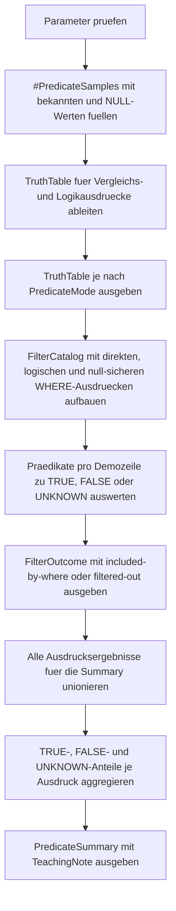

# NullPredicateTruthTable.sql

Dieses Skript macht die dreiwertige Logik von `WHERE` mit `NULL` sichtbar. Es trennt die eigentliche Praedikatsbewertung von der Frage, welche Zeilen ein `WHERE`-Ausdruck am Ende wirklich durchlaesst.

## Uebersicht

<!-- SQLDOC:SUMMARY_TABLE:BEGIN -->
| Feld | Wert |
|---|---|
| Script | [NullPredicateTruthTable.sql](NullPredicateTruthTable.sql) |
| Version | `1.0` |
| Typ | `didactic-lab` |
| Kapitel | `04_Where` |
| Sicherheit | `read-only-tempdb` |
| Zweck | Macht TRUE, FALSE und UNKNOWN fuer `NULL`-Praedikate im `WHERE` sichtbar. |
<!-- SQLDOC:SUMMARY_TABLE:END -->

## Einordnung

Im Alltag werden `NULL`-Vergleiche oft versehentlich wie normale boolesche Bedingungen gelesen. Das Lab zeigt deshalb bewusst zwei Ebenen: erstens den Wahrheitswert eines Ausdrucks und zweitens das reale `WHERE`-Verhalten, das nur Zeilen mit `TRUE` beibehalt.

## Annahmen

- Das Skript arbeitet ausschliesslich mit einer kleinen tempdb-nahen Demo-Menge und setzt keine produktiven Tabellen voraus.
- `UNKNOWN` wird als eigener didaktischer Zustand explizit ausgeschrieben, obwohl SQL intern kein drittes Bool-Literal anzeigt.
- Die null-sichere Umschreibung wird ueber `OR ... IS NULL` gezeigt, weil dieses Muster in Reviews haeufig auftaucht und direkt lesbar ist.
- Das Lab demonstriert Logik und Filterwirkung, nicht Optimizer- oder Indexverhalten.

## Anwendungsfall

Das Skript eignet sich fuer Schulung, Fehlersuche und Query-Reviews, wenn Filter mit `NULL` zu unerwartet leeren oder unvollstaendigen Resultsets fuehren. Besonders hilfreich ist es fuer Stellen, an denen `=` oder `<>` unbewusst auf nullable Spalten angewendet werden.

## Parameter

<!-- SQLDOC:PARAMETERS_TABLE:BEGIN -->
| Parameter | SQL-Typ | Pflicht | Beschreibung |
|---|---|---|---|
| `@ComparisonValue` | `INT` | Nein | Vergleichswert fuer Equality- und Greater-Than-Praedikate. |
| `@PredicateMode` | `VARCHAR(20)` | Nein | Filtert `all`, `comparisons`, `logical` oder `filters`. |
| `@IncludeNullSafeRewrite` | `BIT` | Nein | Zeigt bei `1` zusaetzlich die null-sichere Umschreibung mit `IS NULL`. |
<!-- SQLDOC:PARAMETERS_TABLE:END -->

## Abhaengigkeiten

<!-- SQLDOC:DEPENDENCIES_LIST:BEGIN -->
- `tempdb` fuer die temporaere Demo-Tabelle
- `CASE`
- `IS NULL`
- Window Functions fuer die verdichtete Summary-Ausgabe
<!-- SQLDOC:DEPENDENCIES_LIST:END -->

## Hinweise

- `TruthTable` zeigt pro Demozeile die Bewertung einzelner Vergleichs- und Logikausdruecke als `TRUE`, `FALSE` oder `UNKNOWN`.
- `FilterOutcome` uebersetzt dieselben Muster in echtes `WHERE`-Verhalten und markiert, ob eine Zeile im Resultset bleibt.
- `LeftValue <> @ComparisonValue` ist ein bewusstes Gegenbeispiel: Bei `NULL` entsteht nicht automatisch `TRUE`, sondern `UNKNOWN`.
- Die null-sichere Umschreibung `LeftValue = @ComparisonValue OR LeftValue IS NULL` macht sichtbar, wie `NULL` explizit in einen Einschlussfall verwandelt werden kann.

## Versionshistorie

<!-- SQLDOC:VERSION_HISTORY_TABLE:BEGIN -->
| Version | Datum | User | Beschreibung |
|---|---|---|---|
| `1.0` | `2026-04-17` | `ER` | Erstversion fuer ein didaktisches Lab zur dreiwertigen Logik mit `NULL` im `WHERE` |
<!-- SQLDOC:VERSION_HISTORY_TABLE:END -->

## Ablauf

<!-- SQLDOC:MERMAID:BEGIN -->

<!-- SQLDOC:MERMAID:END -->

## SQL-Code

<!-- SQLDOC:SQL_CODE:BEGIN -->
```sql
/*
BEGIN:SQL-HEADER v1
---
sql_header: v1
script_name: "NullPredicateTruthTable.sql"
script_version: "1.0"
script_type: "didactic-lab"
chapter: "04_Where"

purpose: >
  Macht die dreiwertige Logik mit NULL in WHERE-Praedikaten sichtbar,
  indem Vergleichsergebnisse, logische Verknuepfungen und das reale
  Filterverhalten fuer TRUE, FALSE und UNKNOWN nebeneinander gezeigt
  werden.

parameters:
  - name: "@ComparisonValue"
    sql_type: "INT"
    direction: "IN"
    required: false
    description: "Vergleichswert fuer Equality- und Greater-Than-Praedikate"
  - name: "@PredicateMode"
    sql_type: "VARCHAR(20)"
    direction: "IN"
    required: false
    description: "Filtert all, comparisons, logical oder filters"
  - name: "@IncludeNullSafeRewrite"
    sql_type: "BIT"
    direction: "IN"
    required: false
    description: "1 zeigt zusaetzlich null-sichere Umschreibungen mit IS NULL"

result_sets:
  - name: "TruthTable"
    description: "Zeigt pro Demozeile die Bewertung einzelner Praedikate und ihre Einordnung in TRUE, FALSE oder UNKNOWN"
  - name: "FilterOutcome"
    description: "Zeigt, welche Zeilen ein WHERE-Ausdruck wirklich durchlaesst und wie eine null-sichere Umschreibung wirkt"
  - name: "PredicateSummary"
    description: "Verdichtet pro Ausdruck die Anzahl von TRUE, FALSE und UNKNOWN fuer den didaktischen Vergleich"

dependencies:
  - "tempdb temporary tables"
  - "CASE"
  - "IS NULL"
  - "window functions"

safety:
  level: "read-only-tempdb"
  writes_data: false

documentation:
  markdown_file: "T-SQL/04_Where/SQLScripts/NullPredicateTruthTable.md"
  sync_blocks:
    - "SUMMARY_TABLE"
    - "PARAMETERS_TABLE"
    - "DEPENDENCIES_LIST"
    - "VERSION_HISTORY_TABLE"
    - "SQL_CODE"
  mermaid:
    mode: "ai-agent-from-sql"
    source: "script-body"

main_responsible:
  name: "Erhard Rainer"
  initials: "ER"

version_history:
  - version: "1.0"
    date: "2026-04-17"
    user: "ER"
    description: "Erstversion fuer ein didaktisches Lab zur dreiwertigen Logik mit NULL im WHERE"

notes:
  - "Das Skript arbeitet ausschliesslich mit tempdb-Objekten und einer kleinen Demo-Menge."
  - "UNKNOWN wird explizit sichtbar gemacht, weil WHERE standardmaessig nur TRUE durchlaesst."
---
END:SQL-HEADER v1
*/

SET NOCOUNT ON;

DECLARE @ComparisonValue INT = 5;
DECLARE @PredicateMode VARCHAR(20) = 'all';
DECLARE @IncludeNullSafeRewrite BIT = 1;

IF @ComparisonValue IS NULL
BEGIN
    THROW 50450, '@ComparisonValue darf nicht NULL sein.', 1;
END;

IF @PredicateMode NOT IN ('all', 'comparisons', 'logical', 'filters')
BEGIN
    THROW 50451, '@PredicateMode muss all, comparisons, logical oder filters sein.', 1;
END;

IF @IncludeNullSafeRewrite NOT IN (0, 1)
BEGIN
    THROW 50452, '@IncludeNullSafeRewrite muss 0 oder 1 sein.', 1;
END;

DROP TABLE IF EXISTS #PredicateSamples;

CREATE TABLE #PredicateSamples
(
    SampleID INT NOT NULL PRIMARY KEY,
    SampleGroup VARCHAR(20) NOT NULL,
    LeftValue INT NULL,
    RightValue INT NULL,
    SampleLabel NVARCHAR(120) NOT NULL
);

INSERT INTO #PredicateSamples
(
    SampleID,
    SampleGroup,
    LeftValue,
    RightValue,
    SampleLabel
)
VALUES
    (1, 'known-match', 5, 5, N'Beide Operanden sind bekannt und gleich dem Vergleichswert.'),
    (2, 'known-lower', 3, 5, N'Linker Operand ist bekannt, aber kleiner als der Vergleichswert.'),
    (3, 'known-higher', 9, 5, N'Linker Operand ist bekannt und groesser als der Vergleichswert.'),
    (4, 'left-null', NULL, 5, N'Linker Operand ist NULL, rechter Operand bekannt.'),
    (5, 'right-null', 5, NULL, N'Rechter Operand ist NULL, linker Operand bekannt.'),
    (6, 'both-null', NULL, NULL, N'Beide Operanden sind NULL.'),
    (7, 'mixed-known', 5, 9, N'Linker Operand trifft Equality, rechter Operand ist groesser.'),
    (8, 'mixed-null', NULL, 9, N'Linker Operand ist NULL, rechter Operand groesser als der Vergleichswert.');

;WITH BaseStates AS
(
    SELECT
        ps.SampleID,
        ps.SampleGroup,
        ps.LeftValue,
        ps.RightValue,
        ps.SampleLabel,
        CASE
            WHEN ps.LeftValue = @ComparisonValue THEN 'TRUE'
            WHEN ps.LeftValue IS NULL THEN 'UNKNOWN'
            ELSE 'FALSE'
        END AS LeftEqualsStatus,
        CASE
            WHEN ps.LeftValue > @ComparisonValue THEN 'TRUE'
            WHEN ps.LeftValue IS NULL THEN 'UNKNOWN'
            ELSE 'FALSE'
        END AS LeftGreaterStatus,
        CASE
            WHEN ps.RightValue > @ComparisonValue THEN 'TRUE'
            WHEN ps.RightValue IS NULL THEN 'UNKNOWN'
            ELSE 'FALSE'
        END AS RightGreaterStatus,
        CASE
            WHEN ps.LeftValue IS NULL THEN 'TRUE'
            ELSE 'FALSE'
        END AS LeftIsNullStatus
    FROM #PredicateSamples AS ps
),
PredicateEvaluation AS
(
    SELECT
        bs.SampleID,
        bs.SampleGroup,
        bs.LeftValue,
        bs.RightValue,
        bs.SampleLabel,
        bs.LeftEqualsStatus AS EqualsComparison,
        bs.LeftGreaterStatus AS GreaterThanComparison,
        bs.LeftIsNullStatus AS IsNullCheck,
        CASE
            WHEN bs.LeftEqualsStatus = 'FALSE' OR bs.RightGreaterStatus = 'FALSE' THEN 'FALSE'
            WHEN bs.LeftEqualsStatus = 'TRUE' AND bs.RightGreaterStatus = 'TRUE' THEN 'TRUE'
            ELSE 'UNKNOWN'
        END AS EqualityAndRightGreater,
        CASE
            WHEN bs.LeftEqualsStatus = 'TRUE' OR bs.RightGreaterStatus = 'TRUE' THEN 'TRUE'
            WHEN bs.LeftEqualsStatus = 'FALSE' AND bs.RightGreaterStatus = 'FALSE' THEN 'FALSE'
            ELSE 'UNKNOWN'
        END AS EqualityOrRightGreater
    FROM BaseStates AS bs
)
SELECT
    pe.SampleID,
    pe.SampleGroup,
    pe.LeftValue,
    pe.RightValue,
    pe.SampleLabel,
    pe.EqualsComparison,
    pe.GreaterThanComparison,
    pe.IsNullCheck,
    pe.EqualityAndRightGreater,
    pe.EqualityOrRightGreater
FROM PredicateEvaluation AS pe
WHERE @PredicateMode IN ('all', 'comparisons', 'logical')
ORDER BY
    pe.SampleID;

;WITH BaseStates AS
(
    SELECT
        ps.SampleID,
        ps.SampleGroup,
        ps.LeftValue,
        ps.RightValue,
        ps.SampleLabel,
        CASE
            WHEN ps.LeftValue = @ComparisonValue THEN 'TRUE'
            WHEN ps.LeftValue IS NULL THEN 'UNKNOWN'
            ELSE 'FALSE'
        END AS LeftEqualsStatus,
        CASE
            WHEN ps.LeftValue <> @ComparisonValue THEN 'TRUE'
            WHEN ps.LeftValue IS NULL THEN 'UNKNOWN'
            ELSE 'FALSE'
        END AS LeftNotEqualsStatus,
        CASE
            WHEN ps.LeftValue > @ComparisonValue THEN 'TRUE'
            WHEN ps.LeftValue IS NULL THEN 'UNKNOWN'
            ELSE 'FALSE'
        END AS LeftGreaterStatus,
        CASE
            WHEN ps.RightValue > @ComparisonValue THEN 'TRUE'
            WHEN ps.RightValue IS NULL THEN 'UNKNOWN'
            ELSE 'FALSE'
        END AS RightGreaterStatus,
        CASE
            WHEN ps.LeftValue IS NULL THEN 'TRUE'
            ELSE 'FALSE'
        END AS LeftIsNullStatus
    FROM #PredicateSamples AS ps
),
FilterCatalog AS
(
    SELECT
        1 AS FilterID,
        'LeftValue = @ComparisonValue' AS FilterExpression,
        'direkter Vergleich' AS FilterFamily,
        'Zeigt, dass UNKNOWN im WHERE nicht durchkommt.' AS TeachingGoal
    UNION ALL
    SELECT
        2,
        'LeftValue <> @ComparisonValue',
        'direkter Vergleich',
        'Auch Ungleichheitsvergleiche werden bei NULL zu UNKNOWN statt TRUE.'
    UNION ALL
    SELECT
        3,
        'LeftValue = @ComparisonValue OR LeftValue IS NULL',
        'null-sichere Umschreibung',
        'Erlaubt es, NULL bewusst als eigenen Einschlussfall zu behandeln.'
    UNION ALL
    SELECT
        4,
        'LeftValue > @ComparisonValue AND RightValue > @ComparisonValue',
        'logische Verknuepfung',
        'AND zeigt, wie FALSE und UNKNOWN gemeinsam auf den Filter wirken.'
),
FilterEvaluation AS
(
    SELECT
        fc.FilterID,
        fc.FilterExpression,
        fc.FilterFamily,
        fc.TeachingGoal,
        bs.SampleID,
        bs.SampleGroup,
        bs.LeftValue,
        bs.RightValue,
        bs.SampleLabel,
        CASE fc.FilterID
            WHEN 1 THEN bs.LeftEqualsStatus
            WHEN 2 THEN bs.LeftNotEqualsStatus
            WHEN 3 THEN
                CASE
                    WHEN bs.LeftEqualsStatus = 'TRUE' OR bs.LeftIsNullStatus = 'TRUE' THEN 'TRUE'
                    ELSE 'FALSE'
                END
            WHEN 4 THEN
                CASE
                    WHEN bs.LeftGreaterStatus = 'FALSE' OR bs.RightGreaterStatus = 'FALSE' THEN 'FALSE'
                    WHEN bs.LeftGreaterStatus = 'TRUE' AND bs.RightGreaterStatus = 'TRUE' THEN 'TRUE'
                    ELSE 'UNKNOWN'
                END
        END AS PredicateResult
    FROM FilterCatalog AS fc
    CROSS JOIN BaseStates AS bs
)
SELECT
    fe.FilterID,
    fe.FilterExpression,
    fe.FilterFamily,
    fe.SampleID,
    fe.SampleGroup,
    fe.LeftValue,
    fe.RightValue,
    fe.SampleLabel,
    fe.PredicateResult,
    CASE
        WHEN fe.PredicateResult = 'TRUE' THEN 'included-by-where'
        ELSE 'filtered-out'
    END AS WhereOutcome,
    fe.TeachingGoal
FROM FilterEvaluation AS fe
WHERE @PredicateMode IN ('all', 'filters')
  AND (@IncludeNullSafeRewrite = 1 OR fe.FilterID <> 3)
ORDER BY
    fe.FilterID,
    fe.SampleID;

;WITH BaseStates AS
(
    SELECT
        ps.SampleID,
        CASE
            WHEN ps.LeftValue = @ComparisonValue THEN 'TRUE'
            WHEN ps.LeftValue IS NULL THEN 'UNKNOWN'
            ELSE 'FALSE'
        END AS LeftEqualsStatus,
        CASE
            WHEN ps.LeftValue > @ComparisonValue THEN 'TRUE'
            WHEN ps.LeftValue IS NULL THEN 'UNKNOWN'
            ELSE 'FALSE'
        END AS LeftGreaterStatus,
        CASE
            WHEN ps.RightValue > @ComparisonValue THEN 'TRUE'
            WHEN ps.RightValue IS NULL THEN 'UNKNOWN'
            ELSE 'FALSE'
        END AS RightGreaterStatus,
        CASE
            WHEN ps.LeftValue IS NULL THEN 'TRUE'
            ELSE 'FALSE'
        END AS LeftIsNullStatus
    FROM #PredicateSamples AS ps
),
SummarySource AS
(
    SELECT
        'LeftValue = @ComparisonValue' AS ExpressionLabel,
        bs.LeftEqualsStatus AS PredicateResult
    FROM BaseStates AS bs

    UNION ALL

    SELECT
        'LeftValue > @ComparisonValue',
        bs.LeftGreaterStatus
    FROM BaseStates AS bs

    UNION ALL

    SELECT
        'LeftValue IS NULL',
        bs.LeftIsNullStatus
    FROM BaseStates AS bs

    UNION ALL

    SELECT
        'LeftValue = @ComparisonValue AND RightValue > @ComparisonValue',
        CASE
            WHEN bs.LeftEqualsStatus = 'FALSE' OR bs.RightGreaterStatus = 'FALSE' THEN 'FALSE'
            WHEN bs.LeftEqualsStatus = 'TRUE' AND bs.RightGreaterStatus = 'TRUE' THEN 'TRUE'
            ELSE 'UNKNOWN'
        END
    FROM BaseStates AS bs

    UNION ALL

    SELECT
        'LeftValue = @ComparisonValue OR LeftValue IS NULL',
        CASE
            WHEN bs.LeftEqualsStatus = 'TRUE' OR bs.LeftIsNullStatus = 'TRUE' THEN 'TRUE'
            ELSE 'FALSE'
        END
    FROM BaseStates AS bs
    WHERE @IncludeNullSafeRewrite = 1
),
PredicateSummary AS
(
    SELECT
        ss.ExpressionLabel,
        SUM(CASE WHEN ss.PredicateResult = 'TRUE' THEN 1 ELSE 0 END) AS TrueCount,
        SUM(CASE WHEN ss.PredicateResult = 'FALSE' THEN 1 ELSE 0 END) AS FalseCount,
        SUM(CASE WHEN ss.PredicateResult = 'UNKNOWN' THEN 1 ELSE 0 END) AS UnknownCount,
        COUNT(*) AS TotalSamples
    FROM SummarySource AS ss
    GROUP BY
        ss.ExpressionLabel
)
SELECT
    ROW_NUMBER() OVER (ORDER BY ps.ExpressionLabel) AS SummaryID,
    ps.ExpressionLabel,
    ps.TrueCount,
    ps.FalseCount,
    ps.UnknownCount,
    ps.TotalSamples,
    CASE
        WHEN ps.UnknownCount > 0 THEN 'WHERE laesst nur TRUE durch; UNKNOWN bleibt draussen.'
        ELSE 'Kein UNKNOWN-Anteil in diesem Ausdruck.'
    END AS TeachingNote
FROM PredicateSummary AS ps
WHERE @PredicateMode IN ('all', 'comparisons', 'logical', 'filters')
ORDER BY
    ps.ExpressionLabel;
```
<!-- SQLDOC:SQL_CODE:END -->
