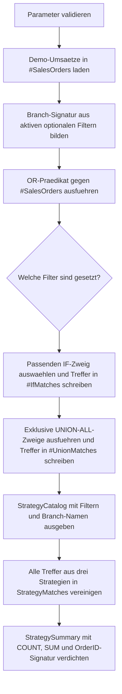

# OptionalFilterBranching.sql

Dieses Skript vergleicht drei gaengige Muster fuer optionale Filter im `WHERE`-Umfeld: ein kompaktes OR-Praedikat, explizite `IF`-Branches und ein in exklusive Zweige aufgeteiltes `UNION ALL`.

## Uebersicht

<!-- SQLDOC:SUMMARY_TABLE:BEGIN -->
| Feld | Wert |
|---|---|
| Script | [OptionalFilterBranching.sql](OptionalFilterBranching.sql) |
| Version | `1.0` |
| Typ | `didactic-lab` |
| Kapitel | `04_Where` |
| Sicherheit | `read-only-tempdb` |
| Zweck | Vergleicht optionale Filter mit `OR`, `IF`-Branches und `UNION ALL`. |
<!-- SQLDOC:SUMMARY_TABLE:END -->

## Einordnung

Optionale Suchparameter erzeugen oft einen Zielkonflikt zwischen kompakter Schreibweise und klaren Ausfuehrungspfaden. Das OR-Muster ist kurz, kann aber mit jedem weiteren optionalen Filter schwerer lesbar werden. `IF`-Branches und `UNION ALL` machen die aktiven Kombinationen expliziter, dafuer steigt der Pflegeaufwand mit der Zahl der moeglichen Filterzustande.

## Annahmen

- Das Skript ist eine didaktische Erstversion und arbeitet ausschliesslich mit einer tempdb-nahen Demo-Tabelle.
- Die Strategien werden auf dieselbe kleine Umsatzmenge angewendet und sollen deshalb dieselbe Treffermenge liefern.
- `STRING_AGG` dient nur dazu, die Gleichheit der Resultsets ueber eine OrderID-Signatur kompakt sichtbar zu machen.
- Der Fokus liegt auf Query-Formen und Branching, nicht auf realen Ausfuehrungsplaenen oder Benchmarking.

## Anwendungsfall

Das Lab eignet sich fuer Reviews und Schulungen, wenn aus einer einzelnen Suchmaske mehrere optionale Filter in T-SQL umgesetzt werden muessen. Es hilft dabei, die Frage zu beantworten, wann ein einzelnes Statement noch nachvollziehbar bleibt und wann explizite Branches die bessere Lehr- oder Wartungsform sind.

## Parameter

<!-- SQLDOC:PARAMETERS_TABLE:BEGIN -->
| Parameter | SQL-Typ | Pflicht | Beschreibung |
|---|---|---|---|
| `@RegionCode` | `CHAR(2)` | Nein | Optionaler Regionsfilter fuer `DE`, `AT` oder `CH`. |
| `@MinNetAmount` | `DECIMAL(10,2)` | Nein | Optionale Untergrenze fuer den Netto-Umsatz. |
| `@SalesChannel` | `VARCHAR(20)` | Nein | Optionaler Kanalfilter fuer `Online`, `Retail` oder `Partner`. |
<!-- SQLDOC:PARAMETERS_TABLE:END -->

## Abhaengigkeiten

<!-- SQLDOC:DEPENDENCIES_LIST:BEGIN -->
- `tempdb` fuer die temporaeren Demo-Tabellen
- `IF...ELSE` fuer den verzweigten Einzelpfad
- `UNION ALL` fuer die expliziten Kombinationszweige
- `STRING_AGG` fuer die kompakte OrderID-Signatur im Strategievergleich
- `ROW_NUMBER` fuer eine stabile Rangfolge innerhalb der Trefferlisten
<!-- SQLDOC:DEPENDENCIES_LIST:END -->

## Hinweise

- `StrategyCatalog` zeigt dieselben aktiven Filter fuer alle drei Muster und markiert die zugehoerige Branch-Signatur.
- `StrategyMatches` macht sichtbar, dass OR-, IF- und UNION-ALL-Variante bei gleicher Eingabe dieselben Auftraege liefern.
- `StrategySummary` verdichtet Trefferzahl, Umsatzsumme und OrderID-Signatur, um Resultset-Gleichheit schnell zu pruefen.
- Das Skript demonstriert Query-Formen fuer optionale Filter und fuehrt keine persistente Datenveraenderung aus.

## Versionshistorie

<!-- SQLDOC:VERSION_HISTORY_TABLE:BEGIN -->
| Version | Datum | User | Beschreibung |
|---|---|---|---|
| `1.0` | `2026-04-17` | `ER` | Erstversion fuer den Vergleich optionaler Filter mit `OR`, `IF` und `UNION ALL` |
<!-- SQLDOC:VERSION_HISTORY_TABLE:END -->

## Ablauf

<!-- SQLDOC:MERMAID:BEGIN -->

<!-- SQLDOC:MERMAID:END -->

## SQL-Code

<!-- SQLDOC:SQL_CODE:BEGIN -->
```sql
/*
BEGIN:SQL-HEADER v1
---
sql_header: v1
script_name: "OptionalFilterBranching.sql"
script_version: "1.0"
script_type: "didactic-lab"
chapter: "04_Where"

purpose: >
  Vergleicht drei didaktische Muster fuer optionale WHERE-Filter:
  direkte OR-Praedikate, explizite IF-Branches und eine UNION-ALL-
  Aufteilung der moeglichen Filterkombinationen.

parameters:
  - name: "@RegionCode"
    sql_type: "CHAR(2)"
    direction: "IN"
    required: false
    description: "Optionaler Regionsfilter fuer DE, AT oder CH"
  - name: "@MinNetAmount"
    sql_type: "DECIMAL(10,2)"
    direction: "IN"
    required: false
    description: "Optionale Untergrenze fuer den Netto-Umsatz"
  - name: "@SalesChannel"
    sql_type: "VARCHAR(20)"
    direction: "IN"
    required: false
    description: "Optionaler Kanalfilter fuer Online, Retail oder Partner"

result_sets:
  - name: "StrategyCatalog"
    description: "Zeigt die aktiven Filter und den Branch-Signaturtext fuer alle drei Muster"
  - name: "StrategyMatches"
    description: "Listet die Treffer je Strategie inklusive genutztem Branch"
  - name: "StrategySummary"
    description: "Vergleicht die Strategien ueber Trefferzahl, Summen und identische OrderID-Signaturen"

dependencies:
  - "tempdb temporary tables"
  - "IF...ELSE"
  - "UNION ALL"
  - "STRING_AGG"
  - "ROW_NUMBER"

safety:
  level: "read-only-tempdb"
  writes_data: false

documentation:
  markdown_file: "T-SQL/04_Where/SQLScripts/OptionalFilterBranching.md"
  sync_blocks:
    - "SUMMARY_TABLE"
    - "PARAMETERS_TABLE"
    - "DEPENDENCIES_LIST"
    - "VERSION_HISTORY_TABLE"
    - "SQL_CODE"
  mermaid:
    mode: "ai-agent-from-sql"
    source: "script-body"

main_responsible:
  name: "Erhard Rainer"
  initials: "ER"

version_history:
  - version: "1.0"
    date: "2026-04-17"
    user: "ER"
    description: "Erstversion fuer den Vergleich optionaler Filter mit OR, IF und UNION ALL"

notes:
  - "Das Skript arbeitet ausschliesslich mit tempdb-Objekten und Demo-Umsaetzen."
  - "Alle drei Strategien sollen dieselbe Treffermenge liefern, solange dieselben Filter aktiv sind."
---
END:SQL-HEADER v1
*/

SET NOCOUNT ON;

DECLARE @RegionCode CHAR(2) = 'DE';
DECLARE @MinNetAmount DECIMAL(10, 2) = 100.00;
DECLARE @SalesChannel VARCHAR(20) = NULL;

IF @RegionCode IS NOT NULL AND @RegionCode NOT IN ('DE', 'AT', 'CH')
BEGIN
    THROW 50460, '@RegionCode muss NULL, DE, AT oder CH sein.', 1;
END;

IF @MinNetAmount IS NOT NULL AND @MinNetAmount < 0
BEGIN
    THROW 50461, '@MinNetAmount darf nicht negativ sein.', 1;
END;

IF @SalesChannel IS NOT NULL AND @SalesChannel NOT IN ('Online', 'Retail', 'Partner')
BEGIN
    THROW 50462, '@SalesChannel muss NULL, Online, Retail oder Partner sein.', 1;
END;

DROP TABLE IF EXISTS #SalesOrders;
DROP TABLE IF EXISTS #OrMatches;
DROP TABLE IF EXISTS #IfMatches;
DROP TABLE IF EXISTS #UnionMatches;

CREATE TABLE #SalesOrders
(
    OrderID INT NOT NULL PRIMARY KEY,
    CustomerName NVARCHAR(80) NOT NULL,
    RegionCode CHAR(2) NOT NULL,
    SalesChannel VARCHAR(20) NOT NULL,
    NetAmount DECIMAL(10, 2) NOT NULL,
    OrderDate DATE NOT NULL
);

CREATE TABLE #OrMatches
(
    StrategyName VARCHAR(20) NOT NULL,
    BranchName VARCHAR(40) NOT NULL,
    OrderID INT NOT NULL,
    CustomerName NVARCHAR(80) NOT NULL,
    RegionCode CHAR(2) NOT NULL,
    SalesChannel VARCHAR(20) NOT NULL,
    NetAmount DECIMAL(10, 2) NOT NULL,
    OrderDate DATE NOT NULL
);

CREATE TABLE #IfMatches
(
    StrategyName VARCHAR(20) NOT NULL,
    BranchName VARCHAR(40) NOT NULL,
    OrderID INT NOT NULL,
    CustomerName NVARCHAR(80) NOT NULL,
    RegionCode CHAR(2) NOT NULL,
    SalesChannel VARCHAR(20) NOT NULL,
    NetAmount DECIMAL(10, 2) NOT NULL,
    OrderDate DATE NOT NULL
);

CREATE TABLE #UnionMatches
(
    StrategyName VARCHAR(20) NOT NULL,
    BranchName VARCHAR(40) NOT NULL,
    OrderID INT NOT NULL,
    CustomerName NVARCHAR(80) NOT NULL,
    RegionCode CHAR(2) NOT NULL,
    SalesChannel VARCHAR(20) NOT NULL,
    NetAmount DECIMAL(10, 2) NOT NULL,
    OrderDate DATE NOT NULL
);

INSERT INTO #SalesOrders
(
    OrderID,
    CustomerName,
    RegionCode,
    SalesChannel,
    NetAmount,
    OrderDate
)
VALUES
    (2001, N'Alpenmarkt GmbH', 'DE', 'Online', 95.00, '2026-01-05'),
    (2002, N'Bergblick AG', 'AT', 'Retail', 180.00, '2026-01-08'),
    (2003, N'City Office KG', 'DE', 'Partner', 240.00, '2026-01-12'),
    (2004, N'Delta Handel SA', 'CH', 'Online', 135.00, '2026-01-20'),
    (2005, N'Elbe Service GmbH', 'DE', 'Retail', 175.00, '2026-02-02'),
    (2006, N'Foxtrot Stores AG', 'AT', 'Partner', 88.00, '2026-02-07'),
    (2007, N'Gipfel Technik AG', 'CH', 'Retail', 310.00, '2026-02-16'),
    (2008, N'Hafenbedarf GmbH', 'DE', 'Online', 420.00, '2026-02-28'),
    (2009, N'Inselwaren eG', 'AT', 'Online', 160.00, '2026-03-03'),
    (2010, N'Jura Logistik AG', 'CH', 'Partner', 510.00, '2026-03-11');

DECLARE @BranchSignature VARCHAR(40) =
    CONCAT(
        CASE WHEN @RegionCode IS NULL THEN '0' ELSE '1' END,
        CASE WHEN @MinNetAmount IS NULL THEN '0' ELSE '1' END,
        CASE WHEN @SalesChannel IS NULL THEN '0' ELSE '1' END
    );

INSERT INTO #OrMatches
(
    StrategyName,
    BranchName,
    OrderID,
    CustomerName,
    RegionCode,
    SalesChannel,
    NetAmount,
    OrderDate
)
SELECT
    'OR-predicate' AS StrategyName,
    CONCAT('or-', @BranchSignature) AS BranchName,
    so.OrderID,
    so.CustomerName,
    so.RegionCode,
    so.SalesChannel,
    so.NetAmount,
    so.OrderDate
FROM #SalesOrders AS so
WHERE (@RegionCode IS NULL OR so.RegionCode = @RegionCode)
  AND (@MinNetAmount IS NULL OR so.NetAmount >= @MinNetAmount)
  AND (@SalesChannel IS NULL OR so.SalesChannel = @SalesChannel);

IF @RegionCode IS NULL AND @MinNetAmount IS NULL AND @SalesChannel IS NULL
BEGIN
    INSERT INTO #IfMatches
    SELECT
        'IF-branch',
        'if-000',
        so.OrderID,
        so.CustomerName,
        so.RegionCode,
        so.SalesChannel,
        so.NetAmount,
        so.OrderDate
    FROM #SalesOrders AS so;
END;
ELSE IF @RegionCode IS NOT NULL AND @MinNetAmount IS NULL AND @SalesChannel IS NULL
BEGIN
    INSERT INTO #IfMatches
    SELECT
        'IF-branch',
        'if-100',
        so.OrderID,
        so.CustomerName,
        so.RegionCode,
        so.SalesChannel,
        so.NetAmount,
        so.OrderDate
    FROM #SalesOrders AS so
    WHERE so.RegionCode = @RegionCode;
END;
ELSE IF @RegionCode IS NULL AND @MinNetAmount IS NOT NULL AND @SalesChannel IS NULL
BEGIN
    INSERT INTO #IfMatches
    SELECT
        'IF-branch',
        'if-010',
        so.OrderID,
        so.CustomerName,
        so.RegionCode,
        so.SalesChannel,
        so.NetAmount,
        so.OrderDate
    FROM #SalesOrders AS so
    WHERE so.NetAmount >= @MinNetAmount;
END;
ELSE IF @RegionCode IS NULL AND @MinNetAmount IS NULL AND @SalesChannel IS NOT NULL
BEGIN
    INSERT INTO #IfMatches
    SELECT
        'IF-branch',
        'if-001',
        so.OrderID,
        so.CustomerName,
        so.RegionCode,
        so.SalesChannel,
        so.NetAmount,
        so.OrderDate
    FROM #SalesOrders AS so
    WHERE so.SalesChannel = @SalesChannel;
END;
ELSE IF @RegionCode IS NOT NULL AND @MinNetAmount IS NOT NULL AND @SalesChannel IS NULL
BEGIN
    INSERT INTO #IfMatches
    SELECT
        'IF-branch',
        'if-110',
        so.OrderID,
        so.CustomerName,
        so.RegionCode,
        so.SalesChannel,
        so.NetAmount,
        so.OrderDate
    FROM #SalesOrders AS so
    WHERE so.RegionCode = @RegionCode
      AND so.NetAmount >= @MinNetAmount;
END;
ELSE IF @RegionCode IS NOT NULL AND @MinNetAmount IS NULL AND @SalesChannel IS NOT NULL
BEGIN
    INSERT INTO #IfMatches
    SELECT
        'IF-branch',
        'if-101',
        so.OrderID,
        so.CustomerName,
        so.RegionCode,
        so.SalesChannel,
        so.NetAmount,
        so.OrderDate
    FROM #SalesOrders AS so
    WHERE so.RegionCode = @RegionCode
      AND so.SalesChannel = @SalesChannel;
END;
ELSE IF @RegionCode IS NULL AND @MinNetAmount IS NOT NULL AND @SalesChannel IS NOT NULL
BEGIN
    INSERT INTO #IfMatches
    SELECT
        'IF-branch',
        'if-011',
        so.OrderID,
        so.CustomerName,
        so.RegionCode,
        so.SalesChannel,
        so.NetAmount,
        so.OrderDate
    FROM #SalesOrders AS so
    WHERE so.NetAmount >= @MinNetAmount
      AND so.SalesChannel = @SalesChannel;
END;
ELSE
BEGIN
    INSERT INTO #IfMatches
    SELECT
        'IF-branch',
        'if-111',
        so.OrderID,
        so.CustomerName,
        so.RegionCode,
        so.SalesChannel,
        so.NetAmount,
        so.OrderDate
    FROM #SalesOrders AS so
    WHERE so.RegionCode = @RegionCode
      AND so.NetAmount >= @MinNetAmount
      AND so.SalesChannel = @SalesChannel;
END;

INSERT INTO #UnionMatches
(
    StrategyName,
    BranchName,
    OrderID,
    CustomerName,
    RegionCode,
    SalesChannel,
    NetAmount,
    OrderDate
)
SELECT
    'UNION-ALL',
    'union-000',
    so.OrderID,
    so.CustomerName,
    so.RegionCode,
    so.SalesChannel,
    so.NetAmount,
    so.OrderDate
FROM #SalesOrders AS so
WHERE @RegionCode IS NULL
  AND @MinNetAmount IS NULL
  AND @SalesChannel IS NULL

UNION ALL

SELECT
    'UNION-ALL',
    'union-100',
    so.OrderID,
    so.CustomerName,
    so.RegionCode,
    so.SalesChannel,
    so.NetAmount,
    so.OrderDate
FROM #SalesOrders AS so
WHERE @RegionCode IS NOT NULL
  AND @MinNetAmount IS NULL
  AND @SalesChannel IS NULL
  AND so.RegionCode = @RegionCode

UNION ALL

SELECT
    'UNION-ALL',
    'union-010',
    so.OrderID,
    so.CustomerName,
    so.RegionCode,
    so.SalesChannel,
    so.NetAmount,
    so.OrderDate
FROM #SalesOrders AS so
WHERE @RegionCode IS NULL
  AND @MinNetAmount IS NOT NULL
  AND @SalesChannel IS NULL
  AND so.NetAmount >= @MinNetAmount

UNION ALL

SELECT
    'UNION-ALL',
    'union-001',
    so.OrderID,
    so.CustomerName,
    so.RegionCode,
    so.SalesChannel,
    so.NetAmount,
    so.OrderDate
FROM #SalesOrders AS so
WHERE @RegionCode IS NULL
  AND @MinNetAmount IS NULL
  AND @SalesChannel IS NOT NULL
  AND so.SalesChannel = @SalesChannel

UNION ALL

SELECT
    'UNION-ALL',
    'union-110',
    so.OrderID,
    so.CustomerName,
    so.RegionCode,
    so.SalesChannel,
    so.NetAmount,
    so.OrderDate
FROM #SalesOrders AS so
WHERE @RegionCode IS NOT NULL
  AND @MinNetAmount IS NOT NULL
  AND @SalesChannel IS NULL
  AND so.RegionCode = @RegionCode
  AND so.NetAmount >= @MinNetAmount

UNION ALL

SELECT
    'UNION-ALL',
    'union-101',
    so.OrderID,
    so.CustomerName,
    so.RegionCode,
    so.SalesChannel,
    so.NetAmount,
    so.OrderDate
FROM #SalesOrders AS so
WHERE @RegionCode IS NOT NULL
  AND @MinNetAmount IS NULL
  AND @SalesChannel IS NOT NULL
  AND so.RegionCode = @RegionCode
  AND so.SalesChannel = @SalesChannel

UNION ALL

SELECT
    'UNION-ALL',
    'union-011',
    so.OrderID,
    so.CustomerName,
    so.RegionCode,
    so.SalesChannel,
    so.NetAmount,
    so.OrderDate
FROM #SalesOrders AS so
WHERE @RegionCode IS NULL
  AND @MinNetAmount IS NOT NULL
  AND @SalesChannel IS NOT NULL
  AND so.NetAmount >= @MinNetAmount
  AND so.SalesChannel = @SalesChannel

UNION ALL

SELECT
    'UNION-ALL',
    'union-111',
    so.OrderID,
    so.CustomerName,
    so.RegionCode,
    so.SalesChannel,
    so.NetAmount,
    so.OrderDate
FROM #SalesOrders AS so
WHERE @RegionCode IS NOT NULL
  AND @MinNetAmount IS NOT NULL
  AND @SalesChannel IS NOT NULL
  AND so.RegionCode = @RegionCode
  AND so.NetAmount >= @MinNetAmount
  AND so.SalesChannel = @SalesChannel;

SELECT
    sc.StrategyName,
    sc.PatternShape,
    sc.ExpectedStrength,
    sc.ActiveBranch,
    sc.RegionFilter,
    sc.MinAmountFilter,
    sc.ChannelFilter
FROM
(
    SELECT
        'OR-predicate' AS StrategyName,
        'ein Statement mit optionalen OR-Praedikaten' AS PatternShape,
        'kurz und kompakt, aber Praedikate koennen schwerer lesbar werden' AS ExpectedStrength,
        CONCAT('or-', @BranchSignature) AS ActiveBranch,
        COALESCE(@RegionCode, 'ALL') AS RegionFilter,
        COALESCE(CONVERT(VARCHAR(30), @MinNetAmount), 'ALL') AS MinAmountFilter,
        COALESCE(@SalesChannel, 'ALL') AS ChannelFilter
    UNION ALL
    SELECT
        'IF-branch',
        'exklusive IF-Zweige pro Filterkombination',
        'klarer Query-Pfad je Fall, aber mehr Pflegeaufwand bei vielen Optionen',
        CONCAT('if-', @BranchSignature),
        COALESCE(@RegionCode, 'ALL'),
        COALESCE(CONVERT(VARCHAR(30), @MinNetAmount), 'ALL'),
        COALESCE(@SalesChannel, 'ALL')
    UNION ALL
    SELECT
        'UNION-ALL',
        'ein Statement mit exklusiven UNION-ALL-Zweigen',
        'kombiniert einen gemeinsamen Ausgabeweg mit expliziten Branches',
        CONCAT('union-', @BranchSignature),
        COALESCE(@RegionCode, 'ALL'),
        COALESCE(CONVERT(VARCHAR(30), @MinNetAmount), 'ALL'),
        COALESCE(@SalesChannel, 'ALL')
) AS sc
ORDER BY
    CASE sc.StrategyName
        WHEN 'OR-predicate' THEN 1
        WHEN 'IF-branch' THEN 2
        ELSE 3
    END;

;WITH StrategyMatches AS
(
    SELECT * FROM #OrMatches
    UNION ALL
    SELECT * FROM #IfMatches
    UNION ALL
    SELECT * FROM #UnionMatches
)
SELECT
    sm.StrategyName,
    sm.BranchName,
    ROW_NUMBER() OVER (PARTITION BY sm.StrategyName ORDER BY sm.OrderID) AS MatchRank,
    sm.OrderID,
    sm.CustomerName,
    sm.RegionCode,
    sm.SalesChannel,
    sm.NetAmount,
    sm.OrderDate
FROM StrategyMatches AS sm
ORDER BY
    CASE sm.StrategyName
        WHEN 'OR-predicate' THEN 1
        WHEN 'IF-branch' THEN 2
        ELSE 3
    END,
    sm.OrderID;

;WITH StrategyMatches AS
(
    SELECT * FROM #OrMatches
    UNION ALL
    SELECT * FROM #IfMatches
    UNION ALL
    SELECT * FROM #UnionMatches
),
StrategySummary AS
(
    SELECT
        sm.StrategyName,
        MIN(sm.BranchName) AS BranchName,
        COUNT(*) AS MatchCount,
        CAST(SUM(sm.NetAmount) AS DECIMAL(12, 2)) AS NetAmountTotal,
        MIN(sm.OrderDate) AS FirstOrderDate,
        MAX(sm.OrderDate) AS LastOrderDate,
        STRING_AGG(CONVERT(VARCHAR(12), sm.OrderID), ',') WITHIN GROUP (ORDER BY sm.OrderID) AS OrderIDSignature
    FROM StrategyMatches AS sm
    GROUP BY
        sm.StrategyName
)
SELECT
    ss.StrategyName,
    ss.BranchName,
    ss.MatchCount,
    ss.NetAmountTotal,
    ss.FirstOrderDate,
    ss.LastOrderDate,
    ss.OrderIDSignature,
    CASE
        WHEN ss.OrderIDSignature =
             MAX(CASE WHEN ss.StrategyName = 'OR-predicate' THEN ss.OrderIDSignature END) OVER ()
            THEN 'identisch zu OR-predicate'
        ELSE 'abweichend zu OR-predicate'
    END AS ComparisonToOrPattern
FROM StrategySummary AS ss
ORDER BY
    CASE ss.StrategyName
        WHEN 'OR-predicate' THEN 1
        WHEN 'IF-branch' THEN 2
        ELSE 3
    END;
```
<!-- SQLDOC:SQL_CODE:END -->
