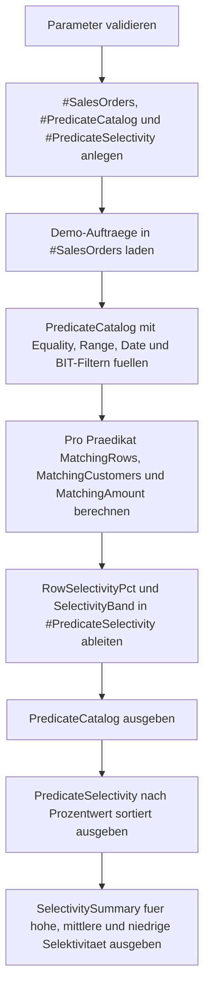

# PredicateSelectivityQuickCheck.sql

Dieses Skript misst an einer kleinen Demo-Auftragsmenge, wie stark typische `WHERE`-Praedikate die Datenmenge reduzieren. Die Ausgabe hilft dabei, Gleichheits-, Bereichs-, Datums- und BIT-Filter schnell nach ihrer Selektivitaet einzuordnen, ohne direkt in einen Ausfuehrungsplan einsteigen zu muessen.

## Uebersicht

<!-- SQLDOC:SUMMARY_TABLE:BEGIN -->
| Feld | Wert |
|---|---|
| Script | [PredicateSelectivityQuickCheck.sql](PredicateSelectivityQuickCheck.sql) |
| Version | `1.0` |
| Typ | `didactic-lab` |
| Kapitel | `04_Where` |
| Sicherheit | `read-only-tempdb` |
| Zweck | Misst schnell die Selektivitaet typischer WHERE-Praedikate auf Basisattributen. |
<!-- SQLDOC:SUMMARY_TABLE:END -->

## Einordnung

Die Frage "Ist dieser Filter selektiv genug?" taucht in Reviews sehr frueh auf, wird aber oft nur gefuehlt beantwortet. Das Lab fuehrt deshalb mehrere gaengige Predicate-Formen auf derselben Demo-Menge aus und zeigt pro Fall, wie viele Zeilen, Kunden und Umsatzwerte uebrig bleiben.

## Annahmen

- Das Skript ist eine didaktische Erstversion und arbeitet ausschliesslich mit tempdb-nahen Demo-Daten.
- Der Monatsfilter wird absichtlich als Datumsbereich umgesetzt, damit kein Funktionsaufruf direkt auf der Spalte noetig ist.
- `PriorityOrdersOnly` dient als Referenz fuer einen einfachen BIT-Filter ohne zusaetzliche Parameter.
- Die Resultate zeigen Trefferquoten, nicht die tatsaechliche Kostenrechnung des SQL-Optimizers.

## Anwendungsfall

Das Skript eignet sich fuer Schulungen, Query-Reviews und erste Indexdiskussionen. Es ist besonders nuetzlich, wenn Teams mehrere moegliche Suchbedingungen vergleichen und eine schnelle Einschaetzung brauchen, welche Filter sehr eng, mittel oder eher breit auf die Ausgangsmenge wirken.

## Parameter

<!-- SQLDOC:PARAMETERS_TABLE:BEGIN -->
| Parameter | SQL-Typ | Pflicht | Beschreibung |
|---|---|---|---|
| `@RegionCode` | `CHAR(2)` | Nein | Optionaler Regionswert fuer `DE`, `AT` oder `CH`. |
| `@MinNetAmount` | `DECIMAL(10,2)` | Nein | Optionaler Schwellenwert fuer einen Bereichsfilter auf `NetAmount`. |
| `@OrderMonth` | `TINYINT` | Nein | Optionaler Monatswert von `1` bis `12` fuer einen Datumsfilter. |
| `@CustomerSegment` | `VARCHAR(20)` | Nein | Optionaler Segmentfilter fuer `SMB`, `MidMarket` oder `Enterprise`. |
<!-- SQLDOC:PARAMETERS_TABLE:END -->

## Abhaengigkeiten

<!-- SQLDOC:DEPENDENCIES_LIST:BEGIN -->
- `tempdb` fuer die temporaere Demo-Tabelle und Ergebniscontainer
- `CASE` fuer Selektivitaetsbaender und didaktische Einordnung
- `DATEFROMPARTS` und `EOMONTH` fuer den Monatsfilter als Datumsbereich
- `UNION ALL` fuer den kompakten Scan mehrerer Predicate-Varianten
<!-- SQLDOC:DEPENDENCIES_LIST:END -->

## Hinweise

- `PredicateCatalog` beschreibt die geprueften Praedikate und ihre aktiven Vergleichswerte.
- `PredicateSelectivity` zeigt pro Praedikat Trefferzahl, Kundenanzahl, Umsatzsumme und Prozentwert.
- `SelectivitySummary` verdichtet die Ergebnisse in `highly-selective`, `medium-selective` und `low-selective`.
- Das Lab ist klein gehalten, damit die Selektivitaet ohne Nebeneffekte einer grossen Fachdomaine sichtbar bleibt.

## Versionshistorie

<!-- SQLDOC:VERSION_HISTORY_TABLE:BEGIN -->
| Version | Datum | User | Beschreibung |
|---|---|---|---|
| `1.0` | `2026-04-17` | `ER` | Erstversion fuer einen schnellen Selektivitaets-Check typischer WHERE-Praedikate |
<!-- SQLDOC:VERSION_HISTORY_TABLE:END -->

## Ablauf

<!-- SQLDOC:MERMAID:BEGIN -->

<!-- SQLDOC:MERMAID:END -->

## SQL-Code

<!-- SQLDOC:SQL_CODE:BEGIN -->
```sql
/*
BEGIN:SQL-HEADER v1
---
sql_header: v1
script_name: "PredicateSelectivityQuickCheck.sql"
script_version: "1.0"
script_type: "didactic-lab"
chapter: "04_Where"

purpose: >
  Misst an einer kleinen Demo-Auftragsmenge, wie selektiv typische
  WHERE-Praedikate auf Basisattributen sind, und verdichtet die
  Ergebnisse zu einer schnellen Entscheidungshilfe fuer Filter- und
  Indexdiskussionen.

parameters:
  - name: "@RegionCode"
    sql_type: "CHAR(2)"
    direction: "IN"
    required: false
    description: "Optionaler Regionswert fuer einen Equality-Check auf DE, AT oder CH"
  - name: "@MinNetAmount"
    sql_type: "DECIMAL(10,2)"
    direction: "IN"
    required: false
    description: "Optionaler Schwellenwert fuer einen Bereichsfilter auf den Netto-Betrag"
  - name: "@OrderMonth"
    sql_type: "TINYINT"
    direction: "IN"
    required: false
    description: "Optionaler Monatswert fuer einen Datumsfilter von 1 bis 12"
  - name: "@CustomerSegment"
    sql_type: "VARCHAR(20)"
    direction: "IN"
    required: false
    description: "Optionaler Segmentfilter fuer SMB, MidMarket oder Enterprise"

result_sets:
  - name: "PredicateCatalog"
    description: "Listet die geprueften Praedikate mit aktiven Vergleichswerten und Filtertyp"
  - name: "PredicateSelectivity"
    description: "Zeigt pro Praedikat Trefferzahl, Kundenanzahl und Selektivitaetsquote"
  - name: "SelectivitySummary"
    description: "Verdichtet niedrige, mittlere und hohe Selektivitaet fuer die Schnellbewertung"

dependencies:
  - "tempdb temporary tables"
  - "CASE"
  - "DATEFROMPARTS"
  - "EOMONTH"
  - "UNION ALL"

safety:
  level: "read-only-tempdb"
  writes_data: false

documentation:
  markdown_file: "T-SQL/04_Where/SQLScripts/PredicateSelectivityQuickCheck.md"
  sync_blocks:
    - "SUMMARY_TABLE"
    - "PARAMETERS_TABLE"
    - "DEPENDENCIES_LIST"
    - "VERSION_HISTORY_TABLE"
    - "SQL_CODE"
  mermaid:
    mode: "ai-agent-from-sql"
    source: "script-body"

main_responsible:
  name: "Erhard Rainer"
  initials: "ER"

version_history:
  - version: "1.0"
    date: "2026-04-17"
    user: "ER"
    description: "Erstversion fuer einen schnellen Selektivitaets-Check typischer WHERE-Praedikate"

notes:
  - "Das Skript nutzt ausschliesslich tempdb-nahe Demo-Daten und keine produktiven Tabellen."
  - "Selektivitaet wird ueber Trefferquoten auf einer kleinen Lehrmenge sichtbar gemacht, nicht ueber echte Optimizer-Kosten."
---
END:SQL-HEADER v1
*/

SET NOCOUNT ON;

DECLARE @RegionCode CHAR(2) = 'DE';
DECLARE @MinNetAmount DECIMAL(10, 2) = 250.00;
DECLARE @OrderMonth TINYINT = 3;
DECLARE @CustomerSegment VARCHAR(20) = 'Enterprise';

IF @RegionCode IS NOT NULL AND @RegionCode NOT IN ('DE', 'AT', 'CH')
BEGIN
    THROW 50480, '@RegionCode muss NULL, DE, AT oder CH sein.', 1;
END;

IF @MinNetAmount IS NOT NULL AND @MinNetAmount < 0
BEGIN
    THROW 50481, '@MinNetAmount darf nicht negativ sein.', 1;
END;

IF @OrderMonth IS NOT NULL AND (@OrderMonth < 1 OR @OrderMonth > 12)
BEGIN
    THROW 50482, '@OrderMonth muss NULL oder zwischen 1 und 12 sein.', 1;
END;

IF @CustomerSegment IS NOT NULL AND @CustomerSegment NOT IN ('SMB', 'MidMarket', 'Enterprise')
BEGIN
    THROW 50483, '@CustomerSegment muss NULL, SMB, MidMarket oder Enterprise sein.', 1;
END;

DROP TABLE IF EXISTS #SalesOrders;
DROP TABLE IF EXISTS #PredicateCatalog;
DROP TABLE IF EXISTS #PredicateSelectivity;

CREATE TABLE #SalesOrders
(
    OrderID INT NOT NULL PRIMARY KEY,
    CustomerName NVARCHAR(80) NOT NULL,
    RegionCode CHAR(2) NOT NULL,
    CustomerSegment VARCHAR(20) NOT NULL,
    OrderStatus VARCHAR(20) NOT NULL,
    IsPriority BIT NOT NULL,
    OrderDate DATE NOT NULL,
    NetAmount DECIMAL(10, 2) NOT NULL
);

CREATE TABLE #PredicateCatalog
(
    PredicateName VARCHAR(40) NOT NULL PRIMARY KEY,
    PredicateShape VARCHAR(20) NOT NULL,
    ComparedColumn VARCHAR(40) NOT NULL,
    ActiveValue NVARCHAR(80) NOT NULL,
    TeachingNote NVARCHAR(220) NOT NULL
);

CREATE TABLE #PredicateSelectivity
(
    PredicateName VARCHAR(40) NOT NULL PRIMARY KEY,
    PredicateShape VARCHAR(20) NOT NULL,
    ComparedColumn VARCHAR(40) NOT NULL,
    ActiveValue NVARCHAR(80) NOT NULL,
    MatchingRows INT NOT NULL,
    MatchingCustomers INT NOT NULL,
    MatchingAmount DECIMAL(12, 2) NOT NULL,
    TotalRows INT NOT NULL,
    RowSelectivityPct DECIMAL(5, 2) NOT NULL,
    SelectivityBand VARCHAR(20) NOT NULL,
    TeachingInterpretation NVARCHAR(220) NOT NULL
);

INSERT INTO #SalesOrders
(
    OrderID,
    CustomerName,
    RegionCode,
    CustomerSegment,
    OrderStatus,
    IsPriority,
    OrderDate,
    NetAmount
)
VALUES
    (4101, N'Alpenmarkt GmbH', 'DE', 'SMB', 'Open', 0, '2026-01-08', 95.00),
    (4102, N'Alpenmarkt GmbH', 'DE', 'SMB', 'Closed', 0, '2026-02-12', 145.00),
    (4103, N'Bergblick AG', 'AT', 'MidMarket', 'Open', 1, '2026-02-18', 210.00),
    (4104, N'Bergblick AG', 'AT', 'MidMarket', 'Closed', 0, '2026-03-03', 260.00),
    (4105, N'City Office KG', 'DE', 'MidMarket', 'Open', 1, '2026-03-07', 180.00),
    (4106, N'Delta Handel SA', 'CH', 'Enterprise', 'Open', 1, '2026-03-14', 520.00),
    (4107, N'Delta Handel SA', 'CH', 'Enterprise', 'Pending', 1, '2026-03-21', 480.00),
    (4108, N'Elbe Service GmbH', 'DE', 'Enterprise', 'Closed', 1, '2026-03-28', 610.00),
    (4109, N'Foxtrot Stores AG', 'AT', 'SMB', 'Open', 0, '2026-04-02', 85.00),
    (4110, N'Gipfel Technik AG', 'CH', 'Enterprise', 'Closed', 1, '2026-04-09', 730.00),
    (4111, N'Hafenbedarf GmbH', 'DE', 'MidMarket', 'Pending', 0, '2026-04-16', 305.00),
    (4112, N'Inselwaren eG', 'AT', 'SMB', 'Open', 0, '2026-04-19', 130.00),
    (4113, N'Jura Logistik AG', 'CH', 'Enterprise', 'Open', 1, '2026-05-04', 460.00),
    (4114, N'Kontor Nord GmbH', 'DE', 'Enterprise', 'Pending', 1, '2026-05-11', 390.00);

INSERT INTO #PredicateCatalog
(
    PredicateName,
    PredicateShape,
    ComparedColumn,
    ActiveValue,
    TeachingNote
)
VALUES
    (
        'RegionEquals',
        'equality',
        'RegionCode',
        COALESCE(@RegionCode, 'ALL'),
        N'Ein exakter Wertvergleich auf einer Basis-Spalte ist der klassische schnelle Selektivitaets-Check.'
    ),
    (
        'NetAmountAtLeast',
        'range',
        'NetAmount',
        COALESCE(CONVERT(NVARCHAR(80), @MinNetAmount), 'ALL'),
        N'Bereichsfilter zeigen, wie stark ein numerischer Schwellenwert die Zeilenmenge reduziert.'
    ),
    (
        'MonthEquals',
        'date-part',
        'OrderDate',
        COALESCE(CONVERT(NVARCHAR(80), @OrderMonth), 'ALL'),
        N'Der Monatsfilter nutzt eine Datumsrange, damit die Selektivitaet ohne Funktionsaufruf auf der Spalte sichtbar bleibt.'
    ),
    (
        'SegmentEquals',
        'equality',
        'CustomerSegment',
        COALESCE(@CustomerSegment, 'ALL'),
        N'Segmentfilter sind typisch fuer Suchmasken und helfen bei der Einschaetzung von Zielgruppenabfragen.'
    ),
    (
        'PriorityOrdersOnly',
        'boolean',
        'IsPriority',
        '1',
        N'Ein BIT-Filter kann sehr selektiv oder fast wirkungslos sein und ist deshalb als Referenzfall nuetzlich.'
    );

INSERT INTO #PredicateSelectivity
(
    PredicateName,
    PredicateShape,
    ComparedColumn,
    ActiveValue,
    MatchingRows,
    MatchingCustomers,
    MatchingAmount,
    TotalRows,
    RowSelectivityPct,
    SelectivityBand,
    TeachingInterpretation
)
SELECT
    pc.PredicateName,
    pc.PredicateShape,
    pc.ComparedColumn,
    pc.ActiveValue,
    scan.MatchingRows,
    scan.MatchingCustomers,
    scan.MatchingAmount,
    totals.TotalRows,
    CAST((100.0 * scan.MatchingRows) / NULLIF(totals.TotalRows, 0) AS DECIMAL(5, 2)) AS RowSelectivityPct,
    CASE
        WHEN (100.0 * scan.MatchingRows) / NULLIF(totals.TotalRows, 0) <= 20 THEN 'highly-selective'
        WHEN (100.0 * scan.MatchingRows) / NULLIF(totals.TotalRows, 0) <= 50 THEN 'medium-selective'
        ELSE 'low-selective'
    END AS SelectivityBand,
    CASE
        WHEN (100.0 * scan.MatchingRows) / NULLIF(totals.TotalRows, 0) <= 20 THEN N'Enger Filter: wenige Zeilen bleiben uebrig und der Vergleich ist didaktisch stark selektiv.'
        WHEN (100.0 * scan.MatchingRows) / NULLIF(totals.TotalRows, 0) <= 50 THEN N'Mittlere Selektivitaet: der Filter halbiert die Datenmenge grob oder besser.'
        ELSE N'Niedrige Selektivitaet: der Filter laesst viele Zeilen stehen und braucht meist weitere Kriterien.'
    END AS TeachingInterpretation
FROM #PredicateCatalog AS pc
CROSS JOIN
(
    SELECT COUNT(*) AS TotalRows
    FROM #SalesOrders
) AS totals
INNER JOIN
(
    SELECT
        'RegionEquals' AS PredicateName,
        COUNT(*) AS MatchingRows,
        COUNT(DISTINCT so.CustomerName) AS MatchingCustomers,
        CAST(SUM(so.NetAmount) AS DECIMAL(12, 2)) AS MatchingAmount
    FROM #SalesOrders AS so
    WHERE @RegionCode IS NULL OR so.RegionCode = @RegionCode

    UNION ALL

    SELECT
        'NetAmountAtLeast',
        COUNT(*),
        COUNT(DISTINCT so.CustomerName),
        CAST(SUM(so.NetAmount) AS DECIMAL(12, 2))
    FROM #SalesOrders AS so
    WHERE @MinNetAmount IS NULL OR so.NetAmount >= @MinNetAmount

    UNION ALL

    SELECT
        'MonthEquals',
        COUNT(*),
        COUNT(DISTINCT so.CustomerName),
        CAST(SUM(so.NetAmount) AS DECIMAL(12, 2))
    FROM #SalesOrders AS so
    WHERE @OrderMonth IS NULL
       OR (
            so.OrderDate >= DATEFROMPARTS(YEAR(so.OrderDate), @OrderMonth, 1)
            AND so.OrderDate < DATEADD(DAY, 1, EOMONTH(DATEFROMPARTS(YEAR(so.OrderDate), @OrderMonth, 1)))
          )

    UNION ALL

    SELECT
        'SegmentEquals',
        COUNT(*),
        COUNT(DISTINCT so.CustomerName),
        CAST(SUM(so.NetAmount) AS DECIMAL(12, 2))
    FROM #SalesOrders AS so
    WHERE @CustomerSegment IS NULL OR so.CustomerSegment = @CustomerSegment

    UNION ALL

    SELECT
        'PriorityOrdersOnly',
        COUNT(*),
        COUNT(DISTINCT so.CustomerName),
        CAST(SUM(so.NetAmount) AS DECIMAL(12, 2))
    FROM #SalesOrders AS so
    WHERE so.IsPriority = 1
) AS scan
    ON scan.PredicateName = pc.PredicateName;

SELECT
    pc.PredicateName,
    pc.PredicateShape,
    pc.ComparedColumn,
    pc.ActiveValue,
    pc.TeachingNote
FROM #PredicateCatalog AS pc
ORDER BY
    CASE pc.PredicateShape
        WHEN 'equality' THEN 1
        WHEN 'range' THEN 2
        WHEN 'date-part' THEN 3
        ELSE 4
    END,
    pc.PredicateName;

SELECT
    ps.PredicateName,
    ps.PredicateShape,
    ps.ComparedColumn,
    ps.ActiveValue,
    ps.MatchingRows,
    ps.MatchingCustomers,
    ps.MatchingAmount,
    ps.TotalRows,
    ps.RowSelectivityPct,
    ps.SelectivityBand,
    ps.TeachingInterpretation
FROM #PredicateSelectivity AS ps
ORDER BY
    ps.RowSelectivityPct ASC,
    ps.PredicateName;

SELECT
    summary.SelectivityBand,
    summary.PredicateCount,
    summary.MinRowSelectivityPct,
    summary.MaxRowSelectivityPct,
    summary.RecommendedReading
FROM
(
    SELECT
        ps.SelectivityBand,
        COUNT(*) AS PredicateCount,
        MIN(ps.RowSelectivityPct) AS MinRowSelectivityPct,
        MAX(ps.RowSelectivityPct) AS MaxRowSelectivityPct,
        CASE
            WHEN ps.SelectivityBand = 'highly-selective' THEN 'Kandidaten fuer gezielte Seek- oder Vorfilter-Diskussion.'
            WHEN ps.SelectivityBand = 'medium-selective' THEN 'Braucht Kontext: oft nuetzlich in Kombination mit weiteren Praedikaten.'
            ELSE 'Allein meist zu breit und eher als Zusatzfilter interessant.'
        END AS RecommendedReading
    FROM #PredicateSelectivity AS ps
    GROUP BY
        ps.SelectivityBand
) AS summary
ORDER BY
    CASE summary.SelectivityBand
        WHEN 'highly-selective' THEN 1
        WHEN 'medium-selective' THEN 2
        ELSE 3
    END;
```
<!-- SQLDOC:SQL_CODE:END -->
