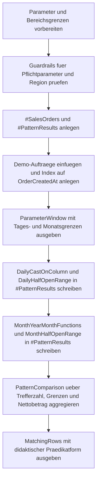

# SargableDateFilterPatterns.sql

Dieses Skript stellt typische Datumsfilter im `WHERE`-Kapitel nebeneinander und zeigt, dass fachlich gleiche Ergebnisse mit sehr unterschiedlichen Praedikatformen ausgedrueckt werden koennen. Die didaktische Kernidee ist, Tages- und Monatsfilter ueber vorbereitete Grenzen zu formulieren, statt `CAST`, `YEAR` oder `MONTH` direkt auf die Datums-Spalte anzuwenden.

## Uebersicht

<!-- SQLDOC:SUMMARY_TABLE:BEGIN -->
| Feld | Wert |
|---|---|
| Script | [SargableDateFilterPatterns.sql](SargableDateFilterPatterns.sql) |
| Version | `1.0` |
| Typ | `didactic-lab` |
| Kapitel | `04_Where` |
| Sicherheit | `read-only-tempdb` |
| Zweck | Demonstriert sargierbare Datumsfilter ohne Funktionsaufruf auf der Spalte und vergleicht sie mit funktionsbasierten Anti-Patterns. |
<!-- SQLDOC:SUMMARY_TABLE:END -->

## Einordnung

Das Lab greift einen sehr haeufigen Performance-Grundsatz aus dem Kapitel `WHERE` auf: Sobald eine Funktion auf der gefilterten Spalte liegt, wird aus einem klaren Bereichspraedikat oft eine schwerer nutzbare Ausdruckslogik. Das Skript erklaert diesen Unterschied bewusst an kleinen Demo-Auftraegen, damit die Form des Praedikats lesbar bleibt.

## Annahmen

- Das Skript ist eine didaktische Erstversion und arbeitet ausschliesslich mit tempdb-nahen Demo-Daten.
- Die Gegenueberstellung bewertet die Filterform selbst; echte Laufzeitmessungen oder Planoperatoren werden nicht simuliert.
- Fuer Tages- und Monatsfilter wird das halb-offene Bereichsmuster `>= Start` und `< EndeExklusiv` als bevorzugte Form verwendet.
- Der optionale Regionsfilter bleibt als einfaches Gleichheitspraedikat erhalten, damit der Fokus auf dem Datumsanteil des `WHERE`-Ausdrucks liegt.

## Anwendungsfall

Das Skript passt zu Reviews, Schulungen und Code-Refactorings, in denen funktionsbasierte Datumsfilter in robustere Bereichsfilter ueberfuehrt werden sollen. Es ist besonders nuetzlich, wenn Teams diskutieren, warum `CAST(OrderCreatedAt AS DATE)` oder `MONTH(OrderCreatedAt)` zwar fachlich plausibel wirken, aber als Standardmuster vermieden werden sollten.

## Parameter

<!-- SQLDOC:PARAMETERS_TABLE:BEGIN -->
| Parameter | SQL-Typ | Pflicht | Beschreibung |
|---|---|---|---|
| `@TargetDate` | `DATE` | Ja | Kalendertag, der als Einzel-Tagesscheibe ausgewertet wird. |
| `@TargetMonth` | `DATE` | Ja | Beliebiges Datum im Zielmonat; intern auf den Monatsanfang normalisiert. |
| `@RegionCode` | `CHAR(2)` | Nein | Optionaler Regionenfilter fuer `DE`, `AT` oder `CH`. |
<!-- SQLDOC:PARAMETERS_TABLE:END -->

## Abhaengigkeiten

<!-- SQLDOC:DEPENDENCIES_LIST:BEGIN -->
- `tempdb` fuer die temporaeren Demo-Tabellen und Vergleichscontainer
- `DATEFROMPARTS`, `EOMONTH` und `DATEADD` fuer vorbereitete Bereichsgrenzen
- `CAST`, `YEAR` und `MONTH` fuer die bewusst gezeigten Anti-Pattern-Praedikate
- `UNION ALL` fuer die gemeinsame Ablage aller Muster in einer Vergleichstabelle
<!-- SQLDOC:DEPENDENCIES_LIST:END -->

## Hinweise

- `ParameterWindow` zeigt die bereits vorbereiteten Start- und Endgrenzen fuer Tages- und Monatsfilter.
- `PatternComparison` macht sichtbar, dass beide Varianten pro Szenario dieselben Treffer liefern koennen, obwohl die Praedikatform unterschiedlich ist.
- `MatchingRows` dokumentiert jede einzelne Trefferzeile und kennzeichnet, ob die Datums-Spalte direkt vergleichbar bleibt oder nicht.
- Das angelegte Indexbeispiel auf `OrderCreatedAt` dient nur zur didaktischen Einordnung der Sargability und veraendert keine produktiven Objekte.

## Versionshistorie

<!-- SQLDOC:VERSION_HISTORY_TABLE:BEGIN -->
| Version | Datum | User | Beschreibung |
|---|---|---|---|
| `1.0` | `2026-04-19` | `ER` | Erstversion fuer sargierbare Datumsfiltermuster im WHERE-Kapitel |
<!-- SQLDOC:VERSION_HISTORY_TABLE:END -->

## Ablauf

<!-- SQLDOC:MERMAID:BEGIN -->

<!-- SQLDOC:MERMAID:END -->

## SQL-Code

<!-- SQLDOC:SQL_CODE:BEGIN -->
```sql
/*
BEGIN:SQL-HEADER v1
---
sql_header: v1
script_name: "SargableDateFilterPatterns.sql"
script_version: "1.0"
script_type: "didactic-lab"
chapter: "04_Where"

purpose: >
  Demonstriert sargierbare Datumsfilter ohne Funktionsaufruf auf der
  Spalte und stellt funktionsbasierte Anti-Patterns denselben
  Bereichsfiltern gegenueber.

parameters:
  - name: "@TargetDate"
    sql_type: "DATE"
    direction: "IN"
    required: true
    description: "Kalendertag, der einmal als Einzel-Tagesscheibe ausgewertet wird"
  - name: "@TargetMonth"
    sql_type: "DATE"
    direction: "IN"
    required: true
    description: "Beliebiges Datum im Zielmonat; der Monat wird auf den ersten Tag normalisiert"
  - name: "@RegionCode"
    sql_type: "CHAR(2)"
    direction: "IN"
    required: false
    description: "Optionaler Regionsfilter fuer DE, AT oder CH; NULL zeigt alle Regionen"

result_sets:
  - name: "ParameterWindow"
    description: "Zeigt die vorbereiteten Tages- und Monatsgrenzen fuer sargierbare Filter"
  - name: "PatternComparison"
    description: "Vergleicht nicht-sargierbare und sargierbare Datumsfilter auf derselben Demo-Datenbasis"
  - name: "MatchingRows"
    description: "Listet die Treffer je Muster mit markierten didaktischen Beobachtungen"

dependencies:
  - "tempdb temporary tables"
  - "DATEFROMPARTS"
  - "EOMONTH"
  - "DATEADD"
  - "CAST"
  - "YEAR"
  - "MONTH"
  - "UNION ALL"

safety:
  level: "read-only-tempdb"
  writes_data: false

documentation:
  markdown_file: "T-SQL/04_Where/SQLScripts/SargableDateFilterPatterns.md"
  sync_blocks:
    - "SUMMARY_TABLE"
    - "PARAMETERS_TABLE"
    - "DEPENDENCIES_LIST"
    - "VERSION_HISTORY_TABLE"
    - "SQL_CODE"
  mermaid:
    mode: "ai-agent-from-sql"
    source: "script-body"

main_responsible:
  name: "Erhard Rainer"
  initials: "ER"

version_history:
  - version: "1.0"
    date: "2026-04-19"
    user: "ER"
    description: "Erstversion fuer sargierbare Datumsfiltermuster im WHERE-Kapitel"

notes:
  - "Das Skript arbeitet ausschliesslich mit tempdb-nahen Demo-Auftragsdaten."
  - "Die demonstrierte Sargability wird didaktisch ueber Praedikatformen erklaert und nicht ueber echte Ausfuehrungsplaene gemessen."
---
END:SQL-HEADER v1
*/

SET NOCOUNT ON;

DECLARE @TargetDate DATE = '2026-04-15';
DECLARE @TargetMonth DATE = '2026-04-01';
DECLARE @RegionCode CHAR(2) = NULL;

DECLARE @TargetDateStart DATETIME2(0) = CAST(@TargetDate AS DATETIME2(0));
DECLARE @TargetDateEndExclusive DATETIME2(0) = DATEADD(DAY, 1, @TargetDateStart);
DECLARE @TargetMonthStart DATE = DATEFROMPARTS(YEAR(@TargetMonth), MONTH(@TargetMonth), 1);
DECLARE @TargetMonthStartDateTime DATETIME2(0) = CAST(@TargetMonthStart AS DATETIME2(0));
DECLARE @TargetMonthEndExclusive DATETIME2(0) = DATEADD(DAY, 1, CAST(EOMONTH(@TargetMonthStart) AS DATETIME2(0)));

IF @TargetDate IS NULL OR @TargetMonth IS NULL
BEGIN
    THROW 50510, '@TargetDate und @TargetMonth muessen gesetzt sein.', 1;
END;

IF @RegionCode IS NOT NULL AND @RegionCode NOT IN ('DE', 'AT', 'CH')
BEGIN
    THROW 50511, '@RegionCode muss NULL, DE, AT oder CH sein.', 1;
END;

DROP TABLE IF EXISTS #SalesOrders;
DROP TABLE IF EXISTS #PatternResults;

CREATE TABLE #SalesOrders
(
    OrderID INT NOT NULL PRIMARY KEY,
    CustomerName NVARCHAR(80) NOT NULL,
    RegionCode CHAR(2) NOT NULL,
    SalesChannel VARCHAR(20) NOT NULL,
    OrderCreatedAt DATETIME2(0) NOT NULL,
    NetAmount DECIMAL(10, 2) NOT NULL
);

CREATE TABLE #PatternResults
(
    PatternName VARCHAR(40) NOT NULL,
    PatternClass VARCHAR(20) NOT NULL,
    ScenarioName VARCHAR(20) NOT NULL,
    OrderID INT NOT NULL,
    CustomerName NVARCHAR(80) NOT NULL,
    RegionCode CHAR(2) NOT NULL,
    OrderCreatedAt DATETIME2(0) NOT NULL,
    NetAmount DECIMAL(10, 2) NOT NULL
);

INSERT INTO #SalesOrders
(
    OrderID,
    CustomerName,
    RegionCode,
    SalesChannel,
    OrderCreatedAt,
    NetAmount
)
VALUES
    (5101, N'Alpenmarkt GmbH', 'DE', 'online',  '2026-03-31T18:20:00', 180.00),
    (5102, N'Bergblick AG', 'AT', 'partner', '2026-04-01T00:00:00', 210.00),
    (5103, N'City Office KG', 'DE', 'online',  '2026-04-03T09:05:00', 145.00),
    (5104, N'Delta Handel SA', 'CH', 'field',   '2026-04-08T16:40:00', 340.00),
    (5105, N'Elbe Service GmbH', 'DE', 'partner', '2026-04-15T00:00:00', 260.00),
    (5106, N'Foxtrot Stores AG', 'AT', 'online', '2026-04-15T11:45:00', 125.00),
    (5107, N'Gipfel Technik AG', 'CH', 'field',  '2026-04-15T23:59:59', 490.00),
    (5108, N'Hafenbedarf GmbH', 'DE', 'online',  '2026-04-20T08:10:00', 275.00),
    (5109, N'Inselwaren eG', 'AT', 'partner', '2026-04-28T17:25:00', 160.00),
    (5110, N'Jura Logistik AG', 'CH', 'field',   '2026-04-30T23:15:00', 530.00),
    (5111, N'Kontor Nord GmbH', 'DE', 'online',  '2026-05-01T00:00:00', 310.00),
    (5112, N'Luna Transport AG', 'CH', 'partner', '2026-05-04T10:30:00', 295.00);

CREATE INDEX IX_SalesOrders_OrderCreatedAt
    ON #SalesOrders (OrderCreatedAt, RegionCode);

SELECT
    @TargetDate AS TargetDate,
    @TargetDateStart AS TargetDateStart,
    @TargetDateEndExclusive AS TargetDateEndExclusive,
    @TargetMonthStart AS TargetMonthStart,
    @TargetMonthEndExclusive AS TargetMonthEndExclusive,
    COALESCE(@RegionCode, 'ALL') AS RegionFilter,
    'Funktionen gehoeren auf den Parameter oder in vorbereitete Grenzwerte, nicht auf die Datums-Spalte.' AS TeachingNote;

INSERT INTO #PatternResults
(
    PatternName,
    PatternClass,
    ScenarioName,
    OrderID,
    CustomerName,
    RegionCode,
    OrderCreatedAt,
    NetAmount
)
SELECT
    'DailyCastOnColumn',
    'anti-pattern',
    'single-day',
    so.OrderID,
    so.CustomerName,
    so.RegionCode,
    so.OrderCreatedAt,
    so.NetAmount
FROM #SalesOrders AS so
WHERE (@RegionCode IS NULL OR so.RegionCode = @RegionCode)
  AND CAST(so.OrderCreatedAt AS DATE) = @TargetDate

UNION ALL

SELECT
    'DailyHalfOpenRange',
    'sargable',
    'single-day',
    so.OrderID,
    so.CustomerName,
    so.RegionCode,
    so.OrderCreatedAt,
    so.NetAmount
FROM #SalesOrders AS so
WHERE (@RegionCode IS NULL OR so.RegionCode = @RegionCode)
  AND so.OrderCreatedAt >= @TargetDateStart
  AND so.OrderCreatedAt < @TargetDateEndExclusive

UNION ALL

SELECT
    'MonthYearMonthFunctions',
    'anti-pattern',
    'month-window',
    so.OrderID,
    so.CustomerName,
    so.RegionCode,
    so.OrderCreatedAt,
    so.NetAmount
FROM #SalesOrders AS so
WHERE (@RegionCode IS NULL OR so.RegionCode = @RegionCode)
  AND YEAR(so.OrderCreatedAt) = YEAR(@TargetMonthStart)
  AND MONTH(so.OrderCreatedAt) = MONTH(@TargetMonthStart)

UNION ALL

SELECT
    'MonthHalfOpenRange',
    'sargable',
    'month-window',
    so.OrderID,
    so.CustomerName,
    so.RegionCode,
    so.OrderCreatedAt,
    so.NetAmount
FROM #SalesOrders AS so
WHERE (@RegionCode IS NULL OR so.RegionCode = @RegionCode)
  AND so.OrderCreatedAt >= @TargetMonthStartDateTime
  AND so.OrderCreatedAt < @TargetMonthEndExclusive;

;WITH PatternComparison AS
(
    SELECT
        pr.PatternName,
        pr.PatternClass,
        pr.ScenarioName,
        COUNT(*) AS MatchingRows,
        MIN(pr.OrderCreatedAt) AS FirstHitAt,
        MAX(pr.OrderCreatedAt) AS LastHitAt,
        CAST(SUM(pr.NetAmount) AS DECIMAL(12, 2)) AS TotalNetAmount,
        CASE
            WHEN pr.PatternName = 'DailyCastOnColumn' THEN N'CAST auf der Spalte trifft fachlich korrekt, blockiert aber den direkten Bereichszugriff.'
            WHEN pr.PatternName = 'DailyHalfOpenRange' THEN N'Grenzwerte werden vorab berechnet; die Spalte bleibt im Vergleich unveraendert.'
            WHEN pr.PatternName = 'MonthYearMonthFunctions' THEN N'YEAR und MONTH auf der Spalte machen aus einem Bereich zwei Funktionspruefungen.'
            ELSE N'Halb-offenes Monatsfenster ist die robuste Form fuer Datum/Uhrzeit-Spalten.'
        END AS TeachingObservation
    FROM #PatternResults AS pr
    GROUP BY
        pr.PatternName,
        pr.PatternClass,
        pr.ScenarioName
)
SELECT
    pc.PatternName,
    pc.PatternClass,
    pc.ScenarioName,
    pc.MatchingRows,
    pc.FirstHitAt,
    pc.LastHitAt,
    pc.TotalNetAmount,
    pc.TeachingObservation
FROM PatternComparison AS pc
ORDER BY
    CASE pc.ScenarioName
        WHEN 'single-day' THEN 1
        ELSE 2
    END,
    CASE pc.PatternClass
        WHEN 'anti-pattern' THEN 1
        ELSE 2
    END,
    pc.PatternName;

SELECT
    pr.PatternName,
    pr.PatternClass,
    pr.ScenarioName,
    pr.OrderID,
    pr.CustomerName,
    pr.RegionCode,
    pr.OrderCreatedAt,
    pr.NetAmount,
    CASE
        WHEN pr.PatternName IN ('DailyCastOnColumn', 'MonthYearMonthFunctions') THEN 'Funktion wird auf der Datums-Spalte ausgefuehrt.'
        ELSE 'Grenzwerte stehen rechts; die Datums-Spalte bleibt direkt vergleichbar.'
    END AS PredicateReading
FROM #PatternResults AS pr
ORDER BY
    CASE pr.ScenarioName
        WHEN 'single-day' THEN 1
        ELSE 2
    END,
    pr.PatternName,
    pr.OrderCreatedAt,
    pr.OrderID;
```
<!-- SQLDOC:SQL_CODE:END -->
