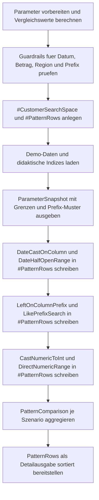

# SearchArgumentAntiPatterns.sql

Dieses Skript sammelt drei typische Muster, bei denen ein fachlich plausibler Filter in eine suchargumentfeindliche Form kippt: Funktionsaufruf auf der Datums-Spalte, Praefixbildung ueber `LEFT(...)` und unnoetige Typumwandlung auf dem numerischen Vergleichswert. Jedem Anti-Pattern steht im selben Demo-Datensatz eine sargierbare Alternative gegenueber.

## Uebersicht

<!-- SQLDOC:SUMMARY_TABLE:BEGIN -->
| Feld | Wert |
|---|---|
| Script | [SearchArgumentAntiPatterns.sql](SearchArgumentAntiPatterns.sql) |
| Version | `1.0` |
| Typ | `didactic-lab` |
| Kapitel | `04_Where` |
| Sicherheit | `read-only-tempdb` |
| Zweck | Vergleicht haeufige Search-Argument-Anti-Patterns mit direkt vergleichbaren WHERE-Praedikaten. |
<!-- SQLDOC:SUMMARY_TABLE:END -->

## Einordnung

Im `WHERE`-Kapitel reicht es nicht, dass ein Filter fachlich korrekt aussieht. Entscheidend ist auch, ob das Praedikat die Spalte direkt vergleicht oder ob Funktionen und Umwandlungen erst auf jeder Zeile ausgewertet werden muessen. Das Lab zeigt diesen Unterschied an kompakten DACH-Demoauftraegen, ohne echte Produktionsobjekte vorauszusetzen.

## Annahmen

- Das Skript arbeitet ausschliesslich mit tempdb-nahen Demo-Daten und veraendert keine produktiven Tabellen.
- Die Gegenueberstellung ist didaktisch: Sie erklaert typische Praedikatformen, misst aber keine echten Ausfuehrungsplaene oder IO-Werte.
- Fuer den Praefixvergleich wird `LIKE @Prefix + '%'` als bewusst einfaches Starts-With-Muster verwendet.
- Der numerische Vergleich zeigt absichtlich auch den Fall, dass ein Anti-Pattern durch Rundung oder Abschneiden zu leicht abweichenden Treffermengen fuehren kann.

## Anwendungsfall

Das Skript eignet sich fuer Code-Reviews, Schulungen und Refactorings, in denen aus gut gemeinten `WHERE`-Klauseln wieder robuste Suchargumente werden sollen. Besonders nuetzlich ist es bei Diskussionen ueber Datumsfilter, Textpraefixe und numerische Vergleiche in Reports oder Suchmasken.

## Parameter

<!-- SQLDOC:PARAMETERS_TABLE:BEGIN -->
| Parameter | SQL-Typ | Pflicht | Beschreibung |
|---|---|---|---|
| `@RegionCode` | `CHAR(2)` | Nein | Optionaler Regionsfilter fuer `DE`, `AT` oder `CH`; `NULL` zeigt alle Regionen. |
| `@CityPrefix` | `NVARCHAR(20)` | Nein | Praefix fuer Starts-With-Vergleiche auf `CityName`; `NULL` deaktiviert den Praefixfilter. |
| `@OrderDate` | `DATE` | Ja | Kalendertag fuer den Vergleich zwischen `CAST(... AS DATE)` und einem halb-offenen Bereich. |
| `@MinNetAmount` | `DECIMAL(10,2)` | Ja | Untergrenze fuer den Vergleich von CAST-basiertem und direktem numerischen Praedikat. |
<!-- SQLDOC:PARAMETERS_TABLE:END -->

## Abhaengigkeiten

<!-- SQLDOC:DEPENDENCIES_LIST:BEGIN -->
- `tempdb` fuer die temporaeren Demo-Tabellen
- `CAST` fuer bewusst gezeigte Datums- und Zahlen-Anti-Patterns
- `LEFT` und `LIKE` fuer den Prefix-Vergleich
- `DATEADD` fuer die halb-offene Tagesgrenze
- `UNION ALL` fuer die gemeinsame Ablage aller Pattern-Treffer
- `CASE` fuer die didaktische Vergleichsausgabe
<!-- SQLDOC:DEPENDENCIES_LIST:END -->

## Hinweise

- `ParameterSnapshot` zeigt zuerst die vorbereiteten Vergleichswerte, damit sichtbar bleibt, welche Grenzen und Prefix-Muster in die eigentlichen Praedikate eingehen.
- `PatternComparison` verdichtet die drei Szenarien auf Trefferzahl und Ergebnisparitaet zwischen Anti-Pattern und Alternative.
- `PatternRows` listet die einzelnen Treffer und markiert, ob die Zeile aus einem Anti-Pattern oder aus einer sargierbaren Form stammt.
- Beim numerischen Vergleich ist die Demo absichtlich so gewaehlt, dass `CAST(NetAmount AS INT)` fachlich nicht immer exakt dasselbe liefert wie der direkte Dezimalvergleich.

## Versionshistorie

<!-- SQLDOC:VERSION_HISTORY_TABLE:BEGIN -->
| Version | Datum | User | Beschreibung |
|---|---|---|---|
| `1.0` | `2026-04-22` | `ER` | Erstversion fuer Search-Argument-Anti-Patterns im WHERE-Kapitel |
<!-- SQLDOC:VERSION_HISTORY_TABLE:END -->

## Ablauf

<!-- SQLDOC:MERMAID:BEGIN -->

<!-- SQLDOC:MERMAID:END -->

## SQL-Code

<!-- SQLDOC:SQL_CODE:BEGIN -->
```sql
/*
BEGIN:SQL-HEADER v1
---
sql_header: v1
script_name: "SearchArgumentAntiPatterns.sql"
script_version: "1.0"
script_type: "didactic-lab"
chapter: "04_Where"

purpose: >
  Sammelt haeufige Search-Argument-Anti-Patterns und stellt ihnen
  sargierbare Alternativen gegenueber, damit Filter im WHERE-Kapitel
  lesbar und indexfreundlich diskutiert werden koennen.

parameters:
  - name: "@RegionCode"
    sql_type: "CHAR(2)"
    direction: "IN"
    required: false
    description: "Optionaler Regionsfilter fuer DE, AT oder CH; NULL zeigt alle Regionen"
  - name: "@CityPrefix"
    sql_type: "NVARCHAR(20)"
    direction: "IN"
    required: false
    description: "Praefix fuer Starts-With-Vergleiche auf CityName; NULL deaktiviert den Praefixfilter"
  - name: "@OrderDate"
    sql_type: "DATE"
    direction: "IN"
    required: true
    description: "Kalendertag fuer den Datumsfilter-Vergleich zwischen Anti-Pattern und Range-Praedikat"
  - name: "@MinNetAmount"
    sql_type: "DECIMAL(10,2)"
    direction: "IN"
    required: true
    description: "Untergrenze fuer den Vergleich von CAST-basiertem und direkten numerischen Praedikaten"

result_sets:
  - name: "ParameterSnapshot"
    description: "Zeigt die aufbereiteten Parameter und die didaktischen Vergleichswerte"
  - name: "PatternComparison"
    description: "Vergleicht je Anti-Pattern die Trefferzahl mit einer sargierbaren Alternative"
  - name: "PatternRows"
    description: "Listet die einzelnen Treffer mit Pattern-Klasse, Szenario und TeachingNote"

dependencies:
  - "tempdb temporary tables"
  - "CAST"
  - "LEFT"
  - "LIKE"
  - "DATEADD"
  - "UNION ALL"
  - "CASE"

safety:
  level: "read-only-tempdb"
  writes_data: false

documentation:
  markdown_file: "T-SQL/04_Where/SQLScripts/SearchArgumentAntiPatterns.md"
  sync_blocks:
    - "SUMMARY_TABLE"
    - "PARAMETERS_TABLE"
    - "DEPENDENCIES_LIST"
    - "VERSION_HISTORY_TABLE"
    - "SQL_CODE"
  mermaid:
    mode: "ai-agent-from-sql"
    source: "script-body"

main_responsible:
  name: "Erhard Rainer"
  initials: "ER"

version_history:
  - version: "1.0"
    date: "2026-04-22"
    user: "ER"
    description: "Erstversion fuer Search-Argument-Anti-Patterns im WHERE-Kapitel"

notes:
  - "Das Skript nutzt ausschliesslich tempdb-nahe Demo-Daten."
  - "Die Gegenueberstellung bewertet Praedikatformen didaktisch und misst keine echten Ausfuehrungsplaene."
---
END:SQL-HEADER v1
*/

SET NOCOUNT ON;

DECLARE @RegionCode CHAR(2) = NULL;
DECLARE @CityPrefix NVARCHAR(20) = N'Ber';
DECLARE @OrderDate DATE = '2026-04-15';
DECLARE @MinNetAmount DECIMAL(10, 2) = 200.00;

DECLARE @OrderDateStart DATETIME2(0) = CAST(@OrderDate AS DATETIME2(0));
DECLARE @OrderDateEndExclusive DATETIME2(0) = DATEADD(DAY, 1, @OrderDateStart);
DECLARE @CityPrefixPattern NVARCHAR(25) = COALESCE(@CityPrefix + N'%', NULL);

IF @OrderDate IS NULL
BEGIN
    THROW 50540, '@OrderDate muss gesetzt sein.', 1;
END;

IF @MinNetAmount IS NULL OR @MinNetAmount < 0
BEGIN
    THROW 50541, '@MinNetAmount muss gesetzt und darf nicht negativ sein.', 1;
END;

IF @RegionCode IS NOT NULL AND @RegionCode NOT IN ('DE', 'AT', 'CH')
BEGIN
    THROW 50542, '@RegionCode muss NULL, DE, AT oder CH sein.', 1;
END;

IF @CityPrefix IS NOT NULL AND LEN(@CityPrefix) = 0
BEGIN
    THROW 50543, '@CityPrefix darf nicht leer sein.', 1;
END;

DROP TABLE IF EXISTS #CustomerSearchSpace;
DROP TABLE IF EXISTS #PatternRows;

CREATE TABLE #CustomerSearchSpace
(
    CustomerID INT NOT NULL PRIMARY KEY,
    CustomerName NVARCHAR(80) NOT NULL,
    RegionCode CHAR(2) NOT NULL,
    CityName NVARCHAR(60) NOT NULL,
    OrderCreatedAt DATETIME2(0) NOT NULL,
    NetAmount DECIMAL(10, 2) NOT NULL
);

CREATE TABLE #PatternRows
(
    PatternName VARCHAR(40) NOT NULL,
    PatternClass VARCHAR(20) NOT NULL,
    ScenarioName VARCHAR(30) NOT NULL,
    CustomerID INT NOT NULL,
    CustomerName NVARCHAR(80) NOT NULL,
    RegionCode CHAR(2) NOT NULL,
    CityName NVARCHAR(60) NOT NULL,
    OrderCreatedAt DATETIME2(0) NOT NULL,
    NetAmount DECIMAL(10, 2) NOT NULL,
    TeachingNote NVARCHAR(220) NOT NULL
);

INSERT INTO #CustomerSearchSpace
(
    CustomerID,
    CustomerName,
    RegionCode,
    CityName,
    OrderCreatedAt,
    NetAmount
)
VALUES
    (4101, N'Alpenmarkt GmbH', 'DE', N'Berlin',      '2026-04-15T08:15:00', 180.00),
    (4102, N'Bergblick AG',    'AT', N'Bern',        '2026-04-15T10:05:00', 220.00),
    (4103, N'City Office KG',  'DE', N'Bremen',      '2026-04-15T11:40:00', 260.00),
    (4104, N'Delta Handel SA', 'CH', N'Basel',       '2026-04-14T16:10:00', 140.00),
    (4105, N'Elbe Service',    'DE', N'Bochum',      '2026-04-16T09:00:00', 310.00),
    (4106, N'Foxtrot Stores',  'AT', N'Bregenz',     '2026-04-15T13:20:00', 205.00),
    (4107, N'Gipfel Technik',  'CH', N'Zuerich',     '2026-04-15T17:45:00', 415.00),
    (4108, N'Hafenbedarf',     'DE', N'Berlin',      '2026-04-13T12:25:00', 199.00),
    (4109, N'Inselwaren eG',   'AT', N'Bonn',        '2026-04-15T19:15:00', 125.00),
    (4110, N'Jura Logistik',   'CH', N'Bern',        '2026-04-17T07:30:00', 275.00),
    (4111, N'Kontor Nord',     'DE', N'Braunschweig','2026-04-15T21:05:00', 360.00),
    (4112, N'Luna Transport',  'CH', N'Basel',       '2026-04-15T23:15:00', 210.00);

CREATE INDEX IX_CustomerSearchSpace_OrderCreatedAt
    ON #CustomerSearchSpace (OrderCreatedAt, RegionCode);

CREATE INDEX IX_CustomerSearchSpace_CityName
    ON #CustomerSearchSpace (CityName);

CREATE INDEX IX_CustomerSearchSpace_NetAmount
    ON #CustomerSearchSpace (NetAmount);

SELECT
    COALESCE(@RegionCode, 'ALL') AS RegionFilter,
    COALESCE(@CityPrefix, N'(NULL)') AS CityPrefix,
    COALESCE(@CityPrefixPattern, N'(NULL)') AS CityPrefixPattern,
    @OrderDate AS OrderDate,
    @OrderDateStart AS OrderDateStart,
    @OrderDateEndExclusive AS OrderDateEndExclusive,
    @MinNetAmount AS MinNetAmount,
    'Spaltenfunktionen und unnoetige Typumwandlungen verschieben Arbeit in den Praedikatausdruck.' AS TeachingNote;

INSERT INTO #PatternRows
(
    PatternName,
    PatternClass,
    ScenarioName,
    CustomerID,
    CustomerName,
    RegionCode,
    CityName,
    OrderCreatedAt,
    NetAmount,
    TeachingNote
)
SELECT
    'DateCastOnColumn',
    'anti-pattern',
    'date-filter',
    css.CustomerID,
    css.CustomerName,
    css.RegionCode,
    css.CityName,
    css.OrderCreatedAt,
    css.NetAmount,
    'CAST auf der Datums-Spalte macht aus einem Bereichsvergleich ein Ausdruckspraedikat.'
FROM #CustomerSearchSpace AS css
WHERE (@RegionCode IS NULL OR css.RegionCode = @RegionCode)
  AND CAST(css.OrderCreatedAt AS DATE) = @OrderDate

UNION ALL

SELECT
    'DateHalfOpenRange',
    'sargable',
    'date-filter',
    css.CustomerID,
    css.CustomerName,
    css.RegionCode,
    css.CityName,
    css.OrderCreatedAt,
    css.NetAmount,
    'Vorbereitete Start- und Endgrenzen halten die Spalte direkt vergleichbar.'
FROM #CustomerSearchSpace AS css
WHERE (@RegionCode IS NULL OR css.RegionCode = @RegionCode)
  AND css.OrderCreatedAt >= @OrderDateStart
  AND css.OrderCreatedAt < @OrderDateEndExclusive

UNION ALL

SELECT
    'LeftOnColumnPrefix',
    'anti-pattern',
    'prefix-filter',
    css.CustomerID,
    css.CustomerName,
    css.RegionCode,
    css.CityName,
    css.OrderCreatedAt,
    css.NetAmount,
    'LEFT auf CityName verhindert ein direktes Starts-With-Praedikat.'
FROM #CustomerSearchSpace AS css
WHERE (@RegionCode IS NULL OR css.RegionCode = @RegionCode)
  AND (
        @CityPrefix IS NULL
        OR LEFT(css.CityName, LEN(@CityPrefix)) = @CityPrefix
      )

UNION ALL

SELECT
    'LikePrefixSearch',
    'sargable',
    'prefix-filter',
    css.CustomerID,
    css.CustomerName,
    css.RegionCode,
    css.CityName,
    css.OrderCreatedAt,
    css.NetAmount,
    'Ein konstantes Prefix mit Prozentzeichen passt zum nativen Starts-With-Muster.'
FROM #CustomerSearchSpace AS css
WHERE (@RegionCode IS NULL OR css.RegionCode = @RegionCode)
  AND (
        @CityPrefixPattern IS NULL
        OR css.CityName LIKE @CityPrefixPattern
      )

UNION ALL

SELECT
    'CastNumericToInt',
    'anti-pattern',
    'amount-filter',
    css.CustomerID,
    css.CustomerName,
    css.RegionCode,
    css.CityName,
    css.OrderCreatedAt,
    css.NetAmount,
    'CAST(NetAmount AS INT) veraendert den Vergleichsausdruck auf der Spalte.'
FROM #CustomerSearchSpace AS css
WHERE (@RegionCode IS NULL OR css.RegionCode = @RegionCode)
  AND CAST(css.NetAmount AS INT) >= @MinNetAmount

UNION ALL

SELECT
    'DirectNumericRange',
    'sargable',
    'amount-filter',
    css.CustomerID,
    css.CustomerName,
    css.RegionCode,
    css.CityName,
    css.OrderCreatedAt,
    css.NetAmount,
    'Der direkte numerische Vergleich laesst den Spaltenwert unveraendert.'
FROM #CustomerSearchSpace AS css
WHERE (@RegionCode IS NULL OR css.RegionCode = @RegionCode)
  AND css.NetAmount >= @MinNetAmount;

SELECT
    pr.ScenarioName,
    MAX(CASE WHEN pr.PatternClass = 'anti-pattern' THEN pr.PatternName END) AS AntiPatternName,
    MAX(CASE WHEN pr.PatternClass = 'sargable' THEN pr.PatternName END) AS SargablePatternName,
    SUM(CASE WHEN pr.PatternClass = 'anti-pattern' THEN 1 ELSE 0 END) AS AntiPatternRows,
    SUM(CASE WHEN pr.PatternClass = 'sargable' THEN 1 ELSE 0 END) AS SargableRows,
    CASE
        WHEN SUM(CASE WHEN pr.PatternClass = 'anti-pattern' THEN 1 ELSE 0 END)
             = SUM(CASE WHEN pr.PatternClass = 'sargable' THEN 1 ELSE 0 END)
            THEN 'same logical result on demo data'
        ELSE 'different logical result due to comparison semantics'
    END AS ResultParity,
    MIN(pr.TeachingNote) AS TeachingNote
FROM #PatternRows AS pr
GROUP BY
    pr.ScenarioName
ORDER BY
    pr.ScenarioName;

SELECT
    pr.PatternName,
    pr.PatternClass,
    pr.ScenarioName,
    pr.CustomerID,
    pr.CustomerName,
    pr.RegionCode,
    pr.CityName,
    pr.OrderCreatedAt,
    pr.NetAmount,
    pr.TeachingNote
FROM #PatternRows AS pr
ORDER BY
    pr.ScenarioName,
    CASE
        WHEN pr.PatternClass = 'anti-pattern' THEN 0
        ELSE 1
    END,
    pr.CustomerID;
```
<!-- SQLDOC:SQL_CODE:END -->
