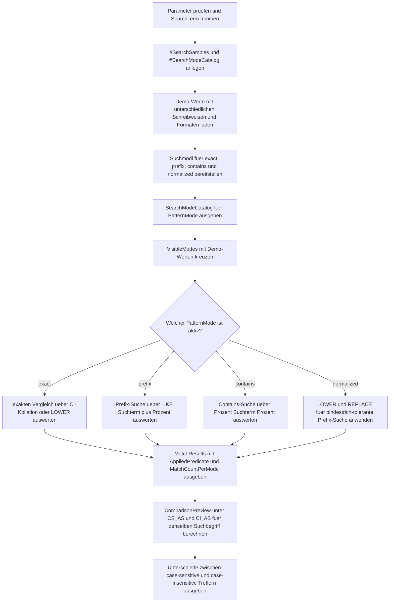

# WhereCaseInsensitiveSearchDemo.sql

Dieses Skript demonstriert mehrere Wege, um case-insensitive Suchmuster in `WHERE`-Klauseln kontrolliert zu formulieren: explizite Kollation, `LOWER`-Normalisierung und zusaetzliche Vereinheitlichung von Formatunterschieden.

## Uebersicht

<!-- SQLDOC:SUMMARY_TABLE:BEGIN -->
| Feld | Wert |
|---|---|
| Script | [WhereCaseInsensitiveSearchDemo.sql](WhereCaseInsensitiveSearchDemo.sql) |
| Version | `1.0` |
| Typ | `didactic-lab` |
| Kapitel | `04_Where` |
| Sicherheit | `read-only-tempdb` |
| Zweck | Demonstriert case-insensitive Suchmuster ueber Kollation und Normalisierung. |
<!-- SQLDOC:SUMMARY_TABLE:END -->

## Einordnung

Case-Insensitive Suche wirkt oft trivial, haengt in SQL Server aber vom Zusammenspiel aus Kollation, Pattern-Art und Datenform ab. Das Lab trennt diese Aspekte: exakte Vergleiche, Prefix-Suche, Contains-Suche und eine normalisierte Variante fuer Werte, die sich nicht nur in Gross- und Kleinschreibung, sondern auch in Bindestrichen unterscheiden.

## Annahmen

- Das Skript arbeitet ausschliesslich mit tempdb-basierten Demo-Daten und greift nicht auf produktive Tabellen zu.
- `Latin1_General_100_CI_AS` und `Latin1_General_100_CS_AS` dienen als didaktisch klare Gegenueberstellung fuer case-insensitive und case-sensitive Vergleiche.
- Die Normalisierungsvariante entfernt nur Bindestriche, damit der Effekt ueberschaubar bleibt und nicht zu viele Nebenaspekte vermischt.
- `@UseExplicitCollation = 0` zeigt bewusst die Alternative ueber `LOWER`, obwohl diese je nach realem Schema nicht immer die beste Performance-Eigenschaft hat.

## Anwendungsfall

Das Skript eignet sich fuer Query-Reviews, Suchmasken und Unterrichtsszenarien, in denen Suchbegriffe unabhaengig von der Schreibweise funktionieren sollen. Es ist besonders nuetzlich, wenn Teams entscheiden muessen, ob eine explizite Kollation im Pradikat, eine Normalisierung im Vergleich oder eine vorgelagerte Datenbereinigung den besseren Lern- oder Wartungswert hat.

## Parameter

<!-- SQLDOC:PARAMETERS_TABLE:BEGIN -->
| Parameter | SQL-Typ | Pflicht | Beschreibung |
|---|---|---|---|
| `@SearchTerm` | `NVARCHAR(50)` | Nein | Suchbegriff fuer `exact`, `prefix`, `contains` oder `normalized`. |
| `@PatternMode` | `VARCHAR(20)` | Nein | Filtert `all`, `exact`, `prefix`, `contains` oder `normalized`. |
| `@UseExplicitCollation` | `BIT` | Nein | `1` erzwingt eine case-insensitive Kollation; `0` nutzt `LOWER`-Normalisierung. |
<!-- SQLDOC:PARAMETERS_TABLE:END -->

## Abhaengigkeiten

<!-- SQLDOC:DEPENDENCIES_LIST:BEGIN -->
- `tempdb` fuer die temporaeren Demo-Tabellen
- `WHERE`
- `LIKE`
- `COLLATE`
- `LOWER`
<!-- SQLDOC:DEPENDENCIES_LIST:END -->

## Hinweise

- `SearchModeCatalog` beschreibt zuerst die Query-Form jedes Suchmodus, damit die spaeteren Treffer didaktisch eingeordnet werden koennen.
- `MatchResults` zeigt fuer denselben Suchbegriff unterschiedliche Treffermengen je nach Praedikat und Auswertungsstrategie.
- `ComparisonPreview` macht sichtbar, welche Werte erst durch eine case-insensitive Kollation zusaetzlich getroffen werden.
- Die normalisierte Prefix-Suche nutzt eine berechnete Spalte fuer `LOWER(REPLACE(...))`, um Formatunterschiede kompakt zu demonstrieren.

## Versionshistorie

<!-- SQLDOC:VERSION_HISTORY_TABLE:BEGIN -->
| Version | Datum | User | Beschreibung |
|---|---|---|---|
| `1.0` | `2026-04-17` | `ER` | Erstversion fuer case-insensitive Suchmuster in WHERE |
<!-- SQLDOC:VERSION_HISTORY_TABLE:END -->

## Ablauf

<!-- SQLDOC:MERMAID:BEGIN -->

<!-- SQLDOC:MERMAID:END -->

## SQL-Code

<!-- SQLDOC:SQL_CODE:BEGIN -->
```sql
/*
BEGIN:SQL-HEADER v1
---
sql_header: v1
script_name: "WhereCaseInsensitiveSearchDemo.sql"
script_version: "1.0"
script_type: "didactic-lab"
chapter: "04_Where"

purpose: >
  Demonstriert case-insensitive Suchmuster in der WHERE-Clause ueber
  explizite Kollation, Normalisierung und mehrere Pattern-Modi auf einer
  tempdb-basierten Demo-Datenbasis.

parameters:
  - name: "@SearchTerm"
    sql_type: "NVARCHAR(50)"
    direction: "IN"
    required: false
    description: "Suchbegriff fuer exact, prefix, contains oder normalized"
  - name: "@PatternMode"
    sql_type: "VARCHAR(20)"
    direction: "IN"
    required: false
    description: "Filtert all, exact, prefix, contains oder normalized"
  - name: "@UseExplicitCollation"
    sql_type: "BIT"
    direction: "IN"
    required: false
    description: "1 erzwingt eine case-insensitive Kollation im Match, 0 nutzt LOWER-basierte Normalisierung"

result_sets:
  - name: "SearchModeCatalog"
    description: "Beschreibt die verfuegbaren case-insensitive Suchmodi und ihre Query-Form"
  - name: "MatchResults"
    description: "Zeigt je Suchmodus, welche Demo-Werte den Suchbegriff treffen"
  - name: "ComparisonPreview"
    description: "Vergleicht denselben Suchbegriff unter case-sensitive und case-insensitive Kollation"

dependencies:
  - "tempdb temporary tables"
  - "WHERE"
  - "LIKE"
  - "COLLATE"
  - "LOWER"

safety:
  level: "read-only-tempdb"
  writes_data: false

documentation:
  markdown_file: "T-SQL/04_Where/SQLScripts/WhereCaseInsensitiveSearchDemo.md"
  sync_blocks:
    - "SUMMARY_TABLE"
    - "PARAMETERS_TABLE"
    - "DEPENDENCIES_LIST"
    - "VERSION_HISTORY_TABLE"
    - "SQL_CODE"
  mermaid:
    mode: "ai-agent-from-sql"
    source: "script-body"

main_responsible:
  name: "Erhard Rainer"
  initials: "ER"

version_history:
  - version: "1.0"
    date: "2026-04-17"
    user: "ER"
    description: "Erstversion fuer case-insensitive Suchmuster in WHERE"

notes:
  - "Das Skript verwendet ausschliesslich temporaere Demo-Daten in tempdb."
  - "Die Vorschau kontrastiert eine explizit case-sensitive mit einer case-insensitive Kollation."
---
END:SQL-HEADER v1
*/

SET NOCOUNT ON;

DECLARE @SearchTerm NVARCHAR(50) = N'alfa';
DECLARE @PatternMode VARCHAR(20) = 'all';
DECLARE @UseExplicitCollation BIT = 1;

IF @PatternMode NOT IN ('all', 'exact', 'prefix', 'contains', 'normalized')
BEGIN
    THROW 50410, '@PatternMode muss all, exact, prefix, contains oder normalized sein.', 1;
END;

IF @UseExplicitCollation NOT IN (0, 1)
BEGIN
    THROW 50411, '@UseExplicitCollation muss 0 oder 1 sein.', 1;
END;

IF NULLIF(LTRIM(RTRIM(@SearchTerm)), N'') IS NULL
BEGIN
    THROW 50412, '@SearchTerm darf nicht leer sein.', 1;
END;

SET @SearchTerm = LTRIM(RTRIM(@SearchTerm));

DROP TABLE IF EXISTS #SearchSamples;
DROP TABLE IF EXISTS #SearchModeCatalog;

CREATE TABLE #SearchSamples
(
    SampleID INT NOT NULL PRIMARY KEY,
    CategoryName VARCHAR(20) NOT NULL,
    SearchValue NVARCHAR(80) NOT NULL,
    SearchValueNormalized AS LOWER(REPLACE(SearchValue, N'-', N'')) PERSISTED
);

CREATE TABLE #SearchModeCatalog
(
    ModeID INT NOT NULL PRIMARY KEY,
    PatternMode VARCHAR(20) NOT NULL,
    PredicateShape NVARCHAR(180) NOT NULL,
    TeachingFocus NVARCHAR(220) NOT NULL
);

INSERT INTO #SearchSamples
(
    SampleID,
    CategoryName,
    SearchValue
)
VALUES
    (1, 'customer', N'Alfa Markt'),
    (2, 'customer', N'ALFA MARKT'),
    (3, 'customer', N'alfa-service'),
    (4, 'customer', N'Alpine Foods'),
    (5, 'customer', N'Beta Logistic'),
    (6, 'product', N'CaseFilter'),
    (7, 'product', N'casefilter'),
    (8, 'product', N'CASE FILTER'),
    (9, 'tag', N'Prefix_Alpha'),
    (10, 'tag', N'prefix_alpha'),
    (11, 'tag', N'Prefix-Beta'),
    (12, 'city', N'Zurich'),
    (13, 'city', N'ZURICH'),
    (14, 'city', N'zuerich'),
    (15, 'city', N'Basel');

INSERT INTO #SearchModeCatalog
(
    ModeID,
    PatternMode,
    PredicateShape,
    TeachingFocus
)
VALUES
    (1, 'exact', N'Spalte COLLATE CI = Suchwert oder LOWER(Spalte) = LOWER(Suchwert)', N'Geeignet fuer exakte Vergleiche mit bewusst case-insensitivem Verhalten.'),
    (2, 'prefix', N'Spalte LIKE Suchwert + ''%'' unter CI-Kollation oder LOWER-basierter Normalisierung', N'Zeigt Prefix-Suchen ohne Abhaengigkeit von der Standardsortierung der Datenbank.'),
    (3, 'contains', N'Spalte LIKE ''%'' + Suchwert + ''%'' unter case-insensitiver Auswertung', N'Visualisiert flexible Textsuche mit bewusstem Case-Handling.'),
    (4, 'normalized', N'LOWER(REPLACE(Spalte, ''-'', '''')) LIKE LOWER(REPLACE(Suchwert, ''-'', '''')) + ''%''', N'Zeigt, wie Formatierungsunterschiede wie Bindestriche zusaetzlich normalisiert werden koennen.');

;WITH VisibleModes AS
(
    SELECT
        smc.ModeID,
        smc.PatternMode,
        smc.PredicateShape,
        smc.TeachingFocus
    FROM #SearchModeCatalog AS smc
    WHERE @PatternMode = 'all'
       OR smc.PatternMode = @PatternMode
)
SELECT
    vm.ModeID,
    vm.PatternMode,
    vm.PredicateShape,
    vm.TeachingFocus,
    CASE
        WHEN @UseExplicitCollation = 1 THEN 'Explicit CI collation'
        ELSE 'LOWER normalization'
    END AS ExecutionStrategy
FROM VisibleModes AS vm
ORDER BY
    vm.ModeID;

;WITH VisibleModes AS
(
    SELECT
        smc.ModeID,
        smc.PatternMode,
        smc.PredicateShape,
        smc.TeachingFocus
    FROM #SearchModeCatalog AS smc
    WHERE @PatternMode = 'all'
       OR smc.PatternMode = @PatternMode
),
MatchedRows AS
(
    SELECT
        vm.ModeID,
        vm.PatternMode,
        ss.SampleID,
        ss.CategoryName,
        ss.SearchValue,
        CASE
            WHEN vm.PatternMode = 'exact' AND @UseExplicitCollation = 1
                AND ss.SearchValue COLLATE Latin1_General_100_CI_AS = @SearchTerm COLLATE Latin1_General_100_CI_AS
                THEN 1
            WHEN vm.PatternMode = 'exact' AND @UseExplicitCollation = 0
                AND LOWER(ss.SearchValue) = LOWER(@SearchTerm)
                THEN 1
            WHEN vm.PatternMode = 'prefix' AND @UseExplicitCollation = 1
                AND ss.SearchValue COLLATE Latin1_General_100_CI_AS LIKE (@SearchTerm + N'%') COLLATE Latin1_General_100_CI_AS
                THEN 1
            WHEN vm.PatternMode = 'prefix' AND @UseExplicitCollation = 0
                AND LOWER(ss.SearchValue) LIKE LOWER(@SearchTerm) + N'%'
                THEN 1
            WHEN vm.PatternMode = 'contains' AND @UseExplicitCollation = 1
                AND ss.SearchValue COLLATE Latin1_General_100_CI_AS LIKE (N'%' + @SearchTerm + N'%') COLLATE Latin1_General_100_CI_AS
                THEN 1
            WHEN vm.PatternMode = 'contains' AND @UseExplicitCollation = 0
                AND LOWER(ss.SearchValue) LIKE N'%' + LOWER(@SearchTerm) + N'%'
                THEN 1
            WHEN vm.PatternMode = 'normalized'
                AND ss.SearchValueNormalized LIKE LOWER(REPLACE(@SearchTerm, N'-', N'')) + N'%'
                THEN 1
            ELSE 0
        END AS IsMatch
    FROM VisibleModes AS vm
    CROSS JOIN #SearchSamples AS ss
)
SELECT
    mr.ModeID,
    mr.PatternMode,
    mr.SampleID,
    mr.CategoryName,
    mr.SearchValue,
    CASE
        WHEN mr.PatternMode = 'normalized' THEN 'LOWER + REPLACE fuer Bindestrich-tolerante Prefix-Suche'
        WHEN @UseExplicitCollation = 1 THEN 'COLLATE Latin1_General_100_CI_AS'
        ELSE 'LOWER(Spalte) gegen LOWER(Suchwert)'
    END AS AppliedPredicate,
    COUNT(*) OVER (PARTITION BY mr.PatternMode) AS MatchCountPerMode
FROM MatchedRows AS mr
WHERE mr.IsMatch = 1
ORDER BY
    mr.ModeID,
    mr.SampleID;

;WITH ComparisonPreview AS
(
    SELECT
        ss.SampleID,
        ss.SearchValue,
        CASE
            WHEN ss.SearchValue COLLATE Latin1_General_100_CS_AS LIKE (N'%' + @SearchTerm + N'%') COLLATE Latin1_General_100_CS_AS
                THEN 1
            ELSE 0
        END AS CaseSensitiveMatch,
        CASE
            WHEN ss.SearchValue COLLATE Latin1_General_100_CI_AS LIKE (N'%' + @SearchTerm + N'%') COLLATE Latin1_General_100_CI_AS
                THEN 1
            ELSE 0
        END AS CaseInsensitiveMatch
    FROM #SearchSamples AS ss
)
SELECT
    cp.SampleID,
    cp.SearchValue,
    cp.CaseSensitiveMatch,
    cp.CaseInsensitiveMatch,
    CASE
        WHEN cp.CaseSensitiveMatch = cp.CaseInsensitiveMatch THEN 'Kein Unterschied fuer diesen Wert'
        WHEN cp.CaseInsensitiveMatch = 1 THEN 'Treffer nur unter case-insensitiver Auswertung'
        ELSE 'Treffer nur unter case-sensitiver Auswertung'
    END AS TeachingNote
FROM ComparisonPreview AS cp
WHERE cp.CaseSensitiveMatch = 1
   OR cp.CaseInsensitiveMatch = 1
ORDER BY
    cp.SampleID;
```
<!-- SQLDOC:SQL_CODE:END -->
