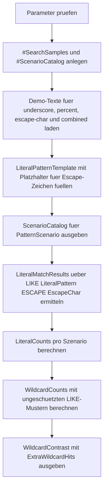

# WhereEscapeCharacterDemo.sql

Dieses Skript zeigt, warum ein explizites `ESCAPE`-Zeichen in `LIKE`-Praedikaten nuetzlich ist, sobald `_`, `%` oder sogar das Escape-Zeichen selbst als echte Literale gesucht werden sollen.

## Uebersicht

<!-- SQLDOC:SUMMARY_TABLE:BEGIN -->
| Feld | Wert |
|---|---|
| Script | [WhereEscapeCharacterDemo.sql](WhereEscapeCharacterDemo.sql) |
| Version | `1.0` |
| Typ | `didactic-lab` |
| Kapitel | `04_Where` |
| Sicherheit | `read-only-tempdb` |
| Zweck | Demonstriert LIKE-Suche mit explizitem ESCAPE fuer literale Sonderzeichen. |
<!-- SQLDOC:SUMMARY_TABLE:END -->

## Einordnung

Bei `LIKE` ist derselbe String je nach Schreibweise entweder ein Suchmuster oder ein Literal. Das Lab trennt diese beiden Lesarten bewusst: Fuer jedes Szenario steht ein geschuetztes Muster mit `ESCAPE` einem ungeschuetzten Wildcard-Muster gegenueber.

## Annahmen

- Das Skript verwendet nur temporaere Demo-Daten und greift nicht auf produktive Tabellen zu.
- `!` ist das Standard-Escape-Zeichen, weil es in den Demo-Texten selten vorkommt und den Unterschied gut sichtbar macht.
- Die Szenarien konzentrieren sich auf `_`, `%`, das Escape-Zeichen selbst und eine kombinierte Schreibweise, statt alle moeglichen `LIKE`-Sonderfaelle zugleich abzudecken.
- Der Kontrast zwischen `LiteralMatchCount` und `WildcardMatchCount` dient als didaktische Kurzmetrik fuer "zu viele Treffer ohne ESCAPE".

## Anwendungsfall

Das Skript eignet sich fuer Unterricht, Suchmasken-Reviews und Fehlersuche in Reports oder Importpruefungen, wenn Benutzer nach Dateinamen, Codes oder freien Texten mit Sonderzeichen filtern wollen. Es hilft besonders dann, wenn ein Filter augenscheinlich korrekt aussieht, aber wegen ungeschuetzter Wildcards unerwartete Zusatztreffer liefert.

## Parameter

<!-- SQLDOC:PARAMETERS_TABLE:BEGIN -->
| Parameter | SQL-Typ | Pflicht | Beschreibung |
|---|---|---|---|
| `@PatternScenario` | `VARCHAR(20)` | Nein | Filtert `all`, `underscore`, `percent`, `escape-char` oder `combined`. |
| `@EscapeChar` | `NCHAR(1)` | Nein | Escape-Zeichen fuer die literale `LIKE`-Suche. |
<!-- SQLDOC:PARAMETERS_TABLE:END -->

## Abhaengigkeiten

<!-- SQLDOC:DEPENDENCIES_LIST:BEGIN -->
- `tempdb` fuer die temporaeren Demo-Tabellen
- `LIKE`
- `ESCAPE`
- `REPLACE`
- Window Functions fuer Match-Zaehlungen pro Szenario
<!-- SQLDOC:DEPENDENCIES_LIST:END -->

## Hinweise

- `ScenarioCatalog` erklaert zuerst, welches Sonderzeichen pro Szenario literal gesucht werden soll.
- `LiteralMatchResults` fuehrt nur Treffer auf, die mit `LIKE ... ESCAPE` zustande kommen.
- `WildcardContrast` zeigt, wie viele Zusatztreffer entstehen, wenn dasselbe Muster ohne Schutz als Wildcard gelesen wird.
- Im Szenario `escape-char` wird das Escape-Zeichen selbst durch Verdoppelung im Pattern gesucht.

## Versionshistorie

<!-- SQLDOC:VERSION_HISTORY_TABLE:BEGIN -->
| Version | Datum | User | Beschreibung |
|---|---|---|---|
| `1.0` | `2026-04-17` | `ER` | Erstversion fuer ESCAPE-Zeichen in LIKE-Suchen |
<!-- SQLDOC:VERSION_HISTORY_TABLE:END -->

## Ablauf

<!-- SQLDOC:MERMAID:BEGIN -->

<!-- SQLDOC:MERMAID:END -->

## SQL-Code

<!-- SQLDOC:SQL_CODE:BEGIN -->
```sql
/*
BEGIN:SQL-HEADER v1
---
sql_header: v1
script_name: "WhereEscapeCharacterDemo.sql"
script_version: "1.0"
script_type: "didactic-lab"
chapter: "04_Where"

purpose: >
  Demonstriert die Verwendung eines expliziten ESCAPE-Zeichens in LIKE-
  Praedikaten, damit Prozentzeichen, Unterstriche und das Escape-Zeichen
  selbst als Literale gesucht werden koennen.

parameters:
  - name: "@PatternScenario"
    sql_type: "VARCHAR(20)"
    direction: "IN"
    required: false
    description: "Filtert all, underscore, percent, escape-char oder combined"
  - name: "@EscapeChar"
    sql_type: "NCHAR(1)"
    direction: "IN"
    required: false
    description: "Escape-Zeichen fuer die literale LIKE-Suche"

result_sets:
  - name: "ScenarioCatalog"
    description: "Beschreibt die verfuegbaren LIKE-Muster und ihren didaktischen Fokus"
  - name: "LiteralMatchResults"
    description: "Zeigt, welche Demo-Texte je Szenario ueber LIKE ... ESCAPE getroffen werden"
  - name: "WildcardContrast"
    description: "Stellt pro Szenario das literal geschuetzte Muster dem ungeschuetzten Wildcard-Muster gegenueber"

dependencies:
  - "tempdb temporary tables"
  - "LIKE"
  - "ESCAPE"
  - "REPLACE"
  - "window functions"

safety:
  level: "read-only-tempdb"
  writes_data: false

documentation:
  markdown_file: "T-SQL/04_Where/SQLScripts/WhereEscapeCharacterDemo.md"
  sync_blocks:
    - "SUMMARY_TABLE"
    - "PARAMETERS_TABLE"
    - "DEPENDENCIES_LIST"
    - "VERSION_HISTORY_TABLE"
    - "SQL_CODE"
  mermaid:
    mode: "ai-agent-from-sql"
    source: "script-body"

main_responsible:
  name: "Erhard Rainer"
  initials: "ER"

version_history:
  - version: "1.0"
    date: "2026-04-17"
    user: "ER"
    description: "Erstversion fuer ESCAPE-Zeichen in LIKE-Suchen"

notes:
  - "Das Skript arbeitet nur mit temporaeren Demo-Daten."
  - "Das Default-Escape-Zeichen ! wird vor der Musterauswertung in die Szenarien eingesetzt."
---
END:SQL-HEADER v1
*/

SET NOCOUNT ON;

DECLARE @PatternScenario VARCHAR(20) = 'all';
DECLARE @EscapeChar NCHAR(1) = N'!';

IF @PatternScenario NOT IN ('all', 'underscore', 'percent', 'escape-char', 'combined')
BEGIN
    THROW 50420, '@PatternScenario muss all, underscore, percent, escape-char oder combined sein.', 1;
END;

IF @EscapeChar IS NULL OR LEN(@EscapeChar) <> 1
BEGIN
    THROW 50421, '@EscapeChar muss genau ein Zeichen enthalten.', 1;
END;

IF @EscapeChar IN (N'%', N'_', N'[', N']')
BEGIN
    THROW 50422, '@EscapeChar darf kein LIKE-Sonderzeichen sein.', 1;
END;

DROP TABLE IF EXISTS #SearchSamples;
DROP TABLE IF EXISTS #ScenarioCatalog;

CREATE TABLE #SearchSamples
(
    SampleID INT NOT NULL PRIMARY KEY,
    ScenarioGroup VARCHAR(20) NOT NULL,
    SampleText NVARCHAR(100) NOT NULL
);

CREATE TABLE #ScenarioCatalog
(
    ScenarioID INT NOT NULL PRIMARY KEY,
    PatternScenario VARCHAR(20) NOT NULL,
    LiteralPatternTemplate NVARCHAR(100) NOT NULL,
    WildcardPattern NVARCHAR(100) NOT NULL,
    SearchGoal NVARCHAR(220) NOT NULL
);

INSERT INTO #SearchSamples
(
    SampleID,
    ScenarioGroup,
    SampleText
)
VALUES
    (1, 'underscore', N'Order_2026'),
    (2, 'underscore', N'OrderA2026'),
    (3, 'underscore', N'OrderX2026'),
    (4, 'percent', N'Budget 100%'),
    (5, 'percent', N'Budget 100'),
    (6, 'percent', N'Budget 100 percent'),
    (7, 'escape-char', N'Alert!Level'),
    (8, 'escape-char', N'AlertLevel'),
    (9, 'combined', N'Plan_50%!'),
    (10, 'combined', N'PlanA50percent'),
    (11, 'combined', N'Plan_50X!'),
    (12, 'combined', N'Plan_50%?');

INSERT INTO #ScenarioCatalog
(
    ScenarioID,
    PatternScenario,
    LiteralPatternTemplate,
    WildcardPattern,
    SearchGoal
)
VALUES
    (1, 'underscore', N'Order{{ESC}}_2026', N'Order_2026', N'Unterstrich als Literal statt Single-Character-Wildcard suchen.'),
    (2, 'percent', N'Budget 100{{ESC}}%', N'Budget 100%', N'Prozentzeichen als echtes Zeichen statt Multi-Character-Wildcard behandeln.'),
    (3, 'escape-char', N'Alert{{ESC}}{{ESC}}Level', N'Alert!Level', N'Das Escape-Zeichen selbst im Suchmuster verdoppeln und literal suchen.'),
    (4, 'combined', N'Plan{{ESC}}_50{{ESC}}%{{ESC}}!', N'Plan_50%!', N'Unterstrich, Prozent und Escape-Zeichen im selben Muster absichern.');

;WITH VisibleScenarios AS
(
    SELECT
        sc.ScenarioID,
        sc.PatternScenario,
        REPLACE(sc.LiteralPatternTemplate, N'{{ESC}}', @EscapeChar) AS LiteralPattern,
        sc.WildcardPattern,
        sc.SearchGoal
    FROM #ScenarioCatalog AS sc
    WHERE @PatternScenario = 'all'
       OR sc.PatternScenario = @PatternScenario
)
SELECT
    vs.ScenarioID,
    vs.PatternScenario,
    vs.LiteralPattern,
    vs.WildcardPattern,
    vs.SearchGoal,
    CONCAT(N'LIKE pattern ESCAPE ', QUOTENAME(@EscapeChar, '''')) AS ExecutionHint
FROM VisibleScenarios AS vs
ORDER BY
    vs.ScenarioID;

;WITH VisibleScenarios AS
(
    SELECT
        sc.ScenarioID,
        sc.PatternScenario,
        REPLACE(sc.LiteralPatternTemplate, N'{{ESC}}', @EscapeChar) AS LiteralPattern,
        sc.WildcardPattern,
        sc.SearchGoal
    FROM #ScenarioCatalog AS sc
    WHERE @PatternScenario = 'all'
       OR sc.PatternScenario = @PatternScenario
),
LiteralMatches AS
(
    SELECT
        vs.ScenarioID,
        vs.PatternScenario,
        vs.LiteralPattern,
        ss.SampleID,
        ss.SampleText,
        COUNT(*) OVER (PARTITION BY vs.ScenarioID) AS MatchCountPerScenario
    FROM VisibleScenarios AS vs
    INNER JOIN #SearchSamples AS ss
        ON ss.ScenarioGroup = vs.PatternScenario
       AND ss.SampleText LIKE vs.LiteralPattern ESCAPE @EscapeChar
)
SELECT
    lm.ScenarioID,
    lm.PatternScenario,
    lm.LiteralPattern,
    lm.SampleID,
    lm.SampleText,
    lm.MatchCountPerScenario,
    CASE lm.PatternScenario
        WHEN 'underscore' THEN 'Literaler Unterstrich getroffen'
        WHEN 'percent' THEN 'Literales Prozentzeichen getroffen'
        WHEN 'escape-char' THEN 'Escape-Zeichen selbst literal getroffen'
        ELSE 'Mehrere Sonderzeichen gleichzeitig literal getroffen'
    END AS TeachingNote
FROM LiteralMatches AS lm
ORDER BY
    lm.ScenarioID,
    lm.SampleID;

;WITH VisibleScenarios AS
(
    SELECT
        sc.ScenarioID,
        sc.PatternScenario,
        REPLACE(sc.LiteralPatternTemplate, N'{{ESC}}', @EscapeChar) AS LiteralPattern,
        sc.WildcardPattern,
        sc.SearchGoal
    FROM #ScenarioCatalog AS sc
    WHERE @PatternScenario = 'all'
       OR sc.PatternScenario = @PatternScenario
),
LiteralCounts AS
(
    SELECT
        vs.ScenarioID,
        COUNT(*) AS LiteralMatchCount
    FROM VisibleScenarios AS vs
    INNER JOIN #SearchSamples AS ss
        ON ss.ScenarioGroup = vs.PatternScenario
       AND ss.SampleText LIKE vs.LiteralPattern ESCAPE @EscapeChar
    GROUP BY
        vs.ScenarioID
),
WildcardCounts AS
(
    SELECT
        vs.ScenarioID,
        COUNT(*) AS WildcardMatchCount
    FROM VisibleScenarios AS vs
    INNER JOIN #SearchSamples AS ss
        ON ss.ScenarioGroup = vs.PatternScenario
       AND ss.SampleText LIKE vs.WildcardPattern
    GROUP BY
        vs.ScenarioID
)
SELECT
    vs.ScenarioID,
    vs.PatternScenario,
    vs.WildcardPattern,
    vs.LiteralPattern,
    ISNULL(lc.LiteralMatchCount, 0) AS LiteralMatchCount,
    ISNULL(wc.WildcardMatchCount, 0) AS WildcardMatchCount,
    ISNULL(wc.WildcardMatchCount, 0) - ISNULL(lc.LiteralMatchCount, 0) AS ExtraWildcardHits,
    vs.SearchGoal
FROM VisibleScenarios AS vs
LEFT JOIN LiteralCounts AS lc
    ON lc.ScenarioID = vs.ScenarioID
LEFT JOIN WildcardCounts AS wc
    ON wc.ScenarioID = vs.ScenarioID
ORDER BY
    vs.ScenarioID;
```
<!-- SQLDOC:SQL_CODE:END -->
