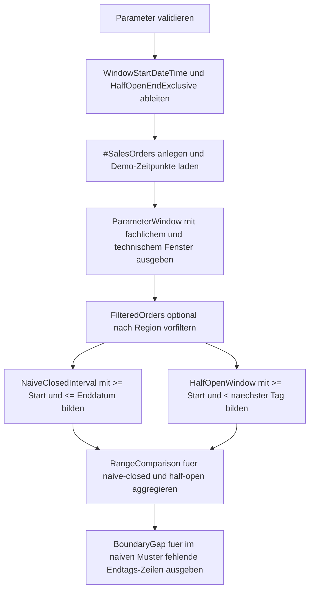

# WhereHalfOpenDateRange.sql

Dieses Skript demonstriert das robuste Halb-offen-Muster fuer Datumsbereiche. Auf einer kleinen Demo-Menge wird sichtbar, warum ein naiver Vergleich mit `<= @WindowEndDate` bei `DATETIME`-Spalten oft nur Mitternacht des letzten Tages erwischt, waehrend `< DATEADD(DAY, 1, @WindowEndDate)` den kompletten Kalendertag abdeckt.

## Uebersicht

<!-- SQLDOC:SUMMARY_TABLE:BEGIN -->
| Feld | Wert |
|---|---|
| Script | [WhereHalfOpenDateRange.sql](WhereHalfOpenDateRange.sql) |
| Version | `1.0` |
| Typ | `didactic-lab` |
| Kapitel | `04_Where` |
| Sicherheit | `read-only-tempdb` |
| Zweck | Zeigt das robuste Halb-offen-Muster fuer Datumsbereiche auf `DATETIME`-Werten. |
<!-- SQLDOC:SUMMARY_TABLE:END -->

## Einordnung

Datumsfilter sehen oft trivial aus, kippen aber schnell in Randfehler. Sobald die fachliche Eingabe ein Datum ohne Uhrzeit ist, die gespeicherte Spalte aber Uhrzeiten enthaelt, ist `<= Enddatum` fast immer zu eng. Das Lab stellt deshalb ein naives geschlossenes Fenster und das robuste Halb-offen-Muster direkt nebeneinander.

## Annahmen

- Das Skript ist eine didaktische Erstversion und arbeitet nur mit tempdb-nahen Demo-Bestellungen.
- Die fachliche Eingabe bleibt ein inklusives Enddatum, technisch wird fuer die Filterung ein exklusiver Grenzwert am Folgetag berechnet.
- `@RegionCode` ist optional, damit das Datumsfenster auch in Kombination mit einem einfachen Zusatzpraedikat sichtbar bleibt.
- Die Diagnose fokussiert bewusst auf Grenzzeilen am letzten Tag und nicht auf Optimizer-Metriken.

## Anwendungsfall

Das Skript eignet sich fuer Query-Reviews, Reports mit Zeitraumfiltern und Schulungen rund um `DATE` gegen `DATETIME`. Es ist besonders hilfreich, wenn Teams bereits Enddaten als Kalenderwerte entgegennehmen, aber Transaktions- oder Ereigniszeitpunkte mit Uhrzeit speichern.

## Parameter

<!-- SQLDOC:PARAMETERS_TABLE:BEGIN -->
| Parameter | SQL-Typ | Pflicht | Beschreibung |
|---|---|---|---|
| `@WindowStartDate` | `DATE` | Ja | Startdatum des Auswertefensters inklusive. |
| `@WindowEndDate` | `DATE` | Ja | Enddatum des Auswertefensters als fachliches Tagesende inklusive. |
| `@RegionCode` | `CHAR(2)` | Nein | Optionaler Regionsfilter fuer `DE`, `AT` oder `CH`; `NULL` zeigt alle Regionen. |
<!-- SQLDOC:PARAMETERS_TABLE:END -->

## Abhaengigkeiten

<!-- SQLDOC:DEPENDENCIES_LIST:BEGIN -->
- `tempdb` fuer die temporaere Demo-Tabelle
- `DATEADD` zum Ableiten des exklusiven Endes am Folgetag
- `DATETIME2` fuer klar sichtbare Zeitanteile
- `CTE` fuer den Vergleich von naivem und robustem Filtermuster
- `CASE` fuer die Boundary-Diagnose im Resultset
<!-- SQLDOC:DEPENDENCIES_LIST:END -->

## Hinweise

- `ParameterWindow` zeigt explizit das fachliche Enddatum und den technisch abgeleiteten exklusiven Grenzwert.
- `RangeComparison` vergleicht Trefferzahl, erstes und letztes Ereignis sowie den Summenbetrag zwischen beiden Filtermustern.
- `BoundaryGap` listet genau die Zeilen, die das naive Muster verliert, obwohl sie fachlich noch in den letzten Kalendertag fallen.
- Das Beispiel nutzt Zeitpunkte um `00:00:00`, mittags und kurz vor Mitternacht, damit der Grenzfehler ohne Zusatzerklaerung sichtbar bleibt.

## Versionshistorie

<!-- SQLDOC:VERSION_HISTORY_TABLE:BEGIN -->
| Version | Datum | User | Beschreibung |
|---|---|---|---|
| `1.0` | `2026-04-17` | `ER` | Erstversion fuer das Halb-offen-Muster bei Datumsfiltern |
<!-- SQLDOC:VERSION_HISTORY_TABLE:END -->

## Ablauf

<!-- SQLDOC:MERMAID:BEGIN -->

<!-- SQLDOC:MERMAID:END -->

## SQL-Code

<!-- SQLDOC:SQL_CODE:BEGIN -->
```sql
/*
BEGIN:SQL-HEADER v1
---
sql_header: v1
script_name: "WhereHalfOpenDateRange.sql"
script_version: "1.0"
script_type: "didactic-lab"
chapter: "04_Where"

purpose: >
  Demonstriert das robuste Halb-offen-Muster fuer Datumsbereiche und
  macht sichtbar, warum ein naiver <= Vergleich auf ein DATE-Ende bei
  DATETIME-Werten Zeilen vom letzten Kalendertag verlieren kann.

parameters:
  - name: "@WindowStartDate"
    sql_type: "DATE"
    direction: "IN"
    required: true
    description: "Startdatum des Auswertefensters inklusive"
  - name: "@WindowEndDate"
    sql_type: "DATE"
    direction: "IN"
    required: true
    description: "Enddatum des Auswertefensters als fachliches Tagesende inklusive"
  - name: "@RegionCode"
    sql_type: "CHAR(2)"
    direction: "IN"
    required: false
    description: "Optionaler Regionsfilter fuer DE, AT oder CH; NULL zeigt alle Regionen"

result_sets:
  - name: "ParameterWindow"
    description: "Zeigt Startdatum, Enddatum und das daraus abgeleitete exklusive Ende"
  - name: "RangeComparison"
    description: "Vergleicht naive und halb-offene Filterung auf derselben Demo-Datenbasis"
  - name: "BoundaryGap"
    description: "Listet Zeilen, die im Halb-offen-Muster enthalten sind, aber beim naiven <= Enddatum fehlen"

dependencies:
  - "tempdb temporary tables"
  - "DATEADD"
  - "DATETIME2"
  - "CASE"
  - "CTE"

safety:
  level: "read-only-tempdb"
  writes_data: false

documentation:
  markdown_file: "T-SQL/04_Where/SQLScripts/WhereHalfOpenDateRange.md"
  sync_blocks:
    - "SUMMARY_TABLE"
    - "PARAMETERS_TABLE"
    - "DEPENDENCIES_LIST"
    - "VERSION_HISTORY_TABLE"
    - "SQL_CODE"
  mermaid:
    mode: "ai-agent-from-sql"
    source: "script-body"

main_responsible:
  name: "Erhard Rainer"
  initials: "ER"

version_history:
  - version: "1.0"
    date: "2026-04-17"
    user: "ER"
    description: "Erstversion fuer das Halb-offen-Muster bei Datumsfiltern"

notes:
  - "Das Skript arbeitet nur mit tempdb-nahen Demo-Bestellungen und veraendert keine produktiven Tabellen."
  - "Die fachliche Eingabe bleibt ein inklusives Enddatum, technisch wird fuer DATETIME-Werte ein exklusives Ende am Folgetag verwendet."
---
END:SQL-HEADER v1
*/

SET NOCOUNT ON;

DECLARE @WindowStartDate DATE = '2026-03-01';
DECLARE @WindowEndDate DATE = '2026-03-31';
DECLARE @RegionCode CHAR(2) = NULL;

DECLARE @WindowStartDateTime DATETIME2(0) = CAST(@WindowStartDate AS DATETIME2(0));
DECLARE @WindowEndDateTime DATETIME2(0) = CAST(@WindowEndDate AS DATETIME2(0));
DECLARE @WindowEndExclusive DATETIME2(0) = DATEADD(DAY, 1, @WindowEndDateTime);

IF @WindowStartDate IS NULL OR @WindowEndDate IS NULL
BEGIN
    THROW 50470, '@WindowStartDate und @WindowEndDate muessen gesetzt sein.', 1;
END;

IF @WindowEndDate < @WindowStartDate
BEGIN
    THROW 50471, '@WindowEndDate darf nicht vor @WindowStartDate liegen.', 1;
END;

IF @RegionCode IS NOT NULL AND @RegionCode NOT IN ('DE', 'AT', 'CH')
BEGIN
    THROW 50472, '@RegionCode muss NULL, DE, AT oder CH sein.', 1;
END;

DROP TABLE IF EXISTS #SalesOrders;
DROP TABLE IF EXISTS #NaiveClosedInterval;
DROP TABLE IF EXISTS #HalfOpenWindow;

CREATE TABLE #SalesOrders
(
    OrderID INT NOT NULL PRIMARY KEY,
    CustomerName NVARCHAR(80) NOT NULL,
    RegionCode CHAR(2) NOT NULL,
    SalesChannel VARCHAR(20) NOT NULL,
    OrderCreatedAt DATETIME2(0) NOT NULL,
    NetAmount DECIMAL(10, 2) NOT NULL
);

INSERT INTO #SalesOrders
(
    OrderID,
    CustomerName,
    RegionCode,
    SalesChannel,
    OrderCreatedAt,
    NetAmount
)
VALUES
    (3001, N'Alpenmarkt GmbH', 'DE', 'online',  '2026-02-28T16:45:00', 125.00),
    (3002, N'Bergblick AG', 'AT', 'partner', '2026-03-01T00:00:00', 180.00),
    (3003, N'City Retail GmbH', 'DE', 'online',  '2026-03-10T09:15:00', 240.00),
    (3004, N'Delta Service SA', 'CH', 'field',   '2026-03-31T00:00:00', 135.00),
    (3005, N'Elbe Office KG', 'DE', 'partner',   '2026-03-31T12:34:00', 215.00),
    (3006, N'Foxtrot Stores AG', 'AT', 'online', '2026-03-31T23:59:59', 305.00),
    (3007, N'Gipfel Tech GmbH', 'CH', 'field',   '2026-04-01T00:00:00', 410.00),
    (3008, N'Hafenbedarf GmbH', 'DE', 'online',  '2026-04-02T08:05:00', 155.00);

SELECT
    @WindowStartDate AS WindowStartDate,
    @WindowEndDate AS WindowEndDate,
    @WindowStartDateTime AS WindowStartDateTime,
    @WindowEndDateTime AS NaiveInclusiveEndDateTime,
    @WindowEndExclusive AS HalfOpenEndExclusive,
    COALESCE(@RegionCode, 'ALL') AS RegionFilter,
    'Verwende fuer DATETIME-Spalten Start >= und Ende < naechster Kalendertag.' AS TeachingNote;

SELECT
    so.OrderID,
    so.CustomerName,
    so.RegionCode,
    so.SalesChannel,
    so.OrderCreatedAt,
    so.NetAmount
INTO #NaiveClosedInterval
FROM #SalesOrders AS so
WHERE (@RegionCode IS NULL OR so.RegionCode = @RegionCode)
  AND so.OrderCreatedAt >= @WindowStartDateTime
  AND so.OrderCreatedAt <= @WindowEndDateTime;

SELECT
    so.OrderID,
    so.CustomerName,
    so.RegionCode,
    so.SalesChannel,
    so.OrderCreatedAt,
    so.NetAmount
INTO #HalfOpenWindow
FROM #SalesOrders AS so
WHERE (@RegionCode IS NULL OR so.RegionCode = @RegionCode)
  AND so.OrderCreatedAt >= @WindowStartDateTime
  AND so.OrderCreatedAt < @WindowEndExclusive;

;WITH RangeComparison AS
(
    SELECT
        'naive-closed' AS FilterPattern,
        COUNT(*) AS MatchingRows,
        MIN(nci.OrderCreatedAt) AS FirstOrderAt,
        MAX(nci.OrderCreatedAt) AS LastOrderAt,
        CAST(SUM(nci.NetAmount) AS DECIMAL(12, 2)) AS TotalNetAmount,
        N'<= Enddatum trifft bei DATE nur Mitternacht des letzten Tages.' AS TeachingObservation
    FROM #NaiveClosedInterval AS nci

    UNION ALL

    SELECT
        'half-open' AS FilterPattern,
        COUNT(*) AS MatchingRows,
        MIN(how.OrderCreatedAt) AS FirstOrderAt,
        MAX(how.OrderCreatedAt) AS LastOrderAt,
        CAST(SUM(how.NetAmount) AS DECIMAL(12, 2)) AS TotalNetAmount,
        N'< naechster Kalendertag deckt den gesamten letzten Tag robust ab.' AS TeachingObservation
    FROM #HalfOpenWindow AS how
)
SELECT
    rc.FilterPattern,
    rc.MatchingRows,
    rc.FirstOrderAt,
    rc.LastOrderAt,
    rc.TotalNetAmount,
    rc.TeachingObservation
FROM RangeComparison AS rc
ORDER BY
    CASE rc.FilterPattern
        WHEN 'naive-closed' THEN 1
        ELSE 2
    END;

SELECT
    how.OrderID,
    how.CustomerName,
    how.RegionCode,
    how.SalesChannel,
    how.OrderCreatedAt,
    how.NetAmount,
    CASE
        WHEN CAST(how.OrderCreatedAt AS DATE) = @WindowEndDate THEN 'Zeitanteil am letzten Tag wird durch <= DATE-Ende uebersehen'
        ELSE 'Zeile liegt nur im robusten Halb-offen-Fenster'
    END AS BoundaryDiagnosis
FROM #HalfOpenWindow AS how
LEFT JOIN #NaiveClosedInterval AS nci
    ON nci.OrderID = how.OrderID
WHERE nci.OrderID IS NULL
ORDER BY
    how.OrderCreatedAt,
    how.OrderID;
```
<!-- SQLDOC:SQL_CODE:END -->
