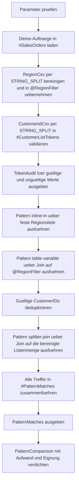

# WhereListExpansionPatterns.sql

Dieses Skript stellt drei gaengige Listenmuster fuer `WHERE`-Filter nebeneinander: eine kleine feste `IN`-Liste, eine vorbereitete Table Variable und eine per `STRING_SPLIT` aufbereitete CSV-Liste.

## Uebersicht

<!-- SQLDOC:SUMMARY_TABLE:BEGIN -->
| Feld | Wert |
|---|---|
| Script | [WhereListExpansionPatterns.sql](WhereListExpansionPatterns.sql) |
| Version | `1.0` |
| Typ | `didactic-lab` |
| Kapitel | `04_Where` |
| Sicherheit | `read-only-tempdb` |
| Zweck | Vergleicht Listenfilter mit `IN`, Table Variable und `STRING_SPLIT`. |
<!-- SQLDOC:SUMMARY_TABLE:END -->

## Einordnung

Listenfilter sehen auf den ersten Blick trivial aus, unterscheiden sich in T-SQL aber deutlich nach Herkunft und Groesse der Werte. Das Skript zeigt deshalb drei konkrete Muster auf derselben Demo-Datenbasis und macht sichtbar, wann eine kleine direkte `IN`-Liste noch lesbar bleibt und wann vorbereitende Aufbereitungsschritte sinnvoller werden.

## Annahmen

- Das Skript ist eine didaktische Erstversion und arbeitet nur mit tempdb-nahen Demo-Daten.
- `RegionCsv` wird bewusst in eine Table Variable uebernommen, damit die vorbereitete Filtermenge als eigener Schritt sichtbar bleibt.
- `CustomerIdCsv` wird per `STRING_SPLIT` verarbeitet, weil dieses Muster fuer wechselnde UI- oder Importlisten in Trainingskontexten haeufig vorkommt.
- Ungueltige Tokens wie fachfremde Regioncodes `XX` oder nicht numerische CustomerIDs wie `xyz` werden im Audit gezeigt, aber nicht in die effektive Filtermenge uebernommen.

## Anwendungsfall

Das Lab eignet sich fuer Unterricht, Reviews und Refactorings rund um Listenparameter in `WHERE`-Klauseln. Es beantwortet die Frage, welches Muster sich fuer kleine feste Werte, vorbereitete Batch-Listen oder wechselnde externe Eingaben am besten eignet.

## Parameter

<!-- SQLDOC:PARAMETERS_TABLE:BEGIN -->
| Parameter | SQL-Typ | Pflicht | Beschreibung |
|---|---|---|---|
| `@RegionCsv` | `NVARCHAR(100)` | Nein | CSV-Liste fuer Regionscodes, die in eine Table Variable uebernommen wird. |
| `@CustomerIdCsv` | `NVARCHAR(200)` | Nein | CSV-Liste fuer CustomerIDs, die per `STRING_SPLIT` validiert und dedupliziert wird. |
| `@MinNetAmount` | `DECIMAL(10,2)` | Nein | Optionale Untergrenze fuer die Demo-Auftragssumme. |
<!-- SQLDOC:PARAMETERS_TABLE:END -->

## Abhaengigkeiten

<!-- SQLDOC:DEPENDENCIES_LIST:BEGIN -->
- `tempdb` fuer die temporaeren Demo-Tabellen
- Table Variables fuer die vorbereitete Regionsliste
- `STRING_SPLIT` fuer die Aufbereitung wechselnder Listen
- `TRY_CONVERT` fuer die Validierung numerischer Tokens
- `ROW_NUMBER` fuer stabile Ausgaben in Audit und Ergebnislisten
<!-- SQLDOC:DEPENDENCIES_LIST:END -->

## Hinweise

- `TokenAudit` macht sichtbar, welche Eingabewerte gueltig sind und welche nur als Rohdaten vorliegen.
- `PatternMatches` fuehrt alle drei Listenmuster auf derselben Auftragsbasis zusammen.
- `PatternComparison` verdichtet die didaktische Eignung nach Eingabeform, Aufwand und Treffermenge.
- Das Skript demonstriert Filteraufbereitung und Lesbarkeit, nicht physische Performance-Messung.

## Versionshistorie

<!-- SQLDOC:VERSION_HISTORY_TABLE:BEGIN -->
| Version | Datum | User | Beschreibung |
|---|---|---|---|
| `1.0` | `2026-04-17` | `ER` | Erstversion fuer didaktische Listenfilter mit `IN`, Table Variable und `STRING_SPLIT` |
<!-- SQLDOC:VERSION_HISTORY_TABLE:END -->

## Ablauf

<!-- SQLDOC:MERMAID:BEGIN -->

<!-- SQLDOC:MERMAID:END -->

## SQL-Code

<!-- SQLDOC:SQL_CODE:BEGIN -->
```sql
/*
BEGIN:SQL-HEADER v1
---
sql_header: v1
script_name: "WhereListExpansionPatterns.sql"
script_version: "1.0"
script_type: "didactic-lab"
chapter: "04_Where"

purpose: >
  Vergleicht drei didaktische Muster fuer Listenfilter in WHERE-Klauseln:
  eine kleine feste IN-Liste, eine vorbereitete Table Variable und eine
  CSV-Aufbereitung per STRING_SPLIT mit Validierung.

parameters:
  - name: "@RegionCsv"
    sql_type: "NVARCHAR(100)"
    direction: "IN"
    required: false
    description: "CSV-Liste fuer Regionscodes, die in eine Table Variable uebernommen wird"
  - name: "@CustomerIdCsv"
    sql_type: "NVARCHAR(200)"
    direction: "IN"
    required: false
    description: "CSV-Liste fuer CustomerIDs, die per STRING_SPLIT validiert und dedupliziert wird"
  - name: "@MinNetAmount"
    sql_type: "DECIMAL(10,2)"
    direction: "IN"
    required: false
    description: "Optionale Untergrenze fuer die Demo-Auftragssumme"

result_sets:
  - name: "TokenAudit"
    description: "Zeigt gueltige und ungueltige Tokens aus beiden Listenmustern"
  - name: "PatternMatches"
    description: "Zeigt Treffer je Listenmuster auf derselben Demo-Datenbasis"
  - name: "PatternComparison"
    description: "Verdichtet die drei Muster didaktisch nach Eingabeform und Pflegeaufwand"

dependencies:
  - "tempdb temporary tables"
  - "table variables"
  - "STRING_SPLIT"
  - "TRY_CONVERT"
  - "ROW_NUMBER"

safety:
  level: "read-only-tempdb"
  writes_data: false

documentation:
  markdown_file: "T-SQL/04_Where/SQLScripts/WhereListExpansionPatterns.md"
  sync_blocks:
    - "SUMMARY_TABLE"
    - "PARAMETERS_TABLE"
    - "DEPENDENCIES_LIST"
    - "VERSION_HISTORY_TABLE"
    - "SQL_CODE"
  mermaid:
    mode: "ai-agent-from-sql"
    source: "script-body"

main_responsible:
  name: "Erhard Rainer"
  initials: "ER"

version_history:
  - version: "1.0"
    date: "2026-04-17"
    user: "ER"
    description: "Erstversion fuer didaktische Listenfilter mit IN, Table Variable und STRING_SPLIT"

notes:
  - "Das Skript nutzt nur Demo-Daten in tempdb-nahen Objekten."
  - "Ungueltige Tokens bleiben im Audit sichtbar, beeinflussen die Filtermenge aber nicht."
---
END:SQL-HEADER v1
*/

SET NOCOUNT ON;

DECLARE @RegionCsv NVARCHAR(100) = N'DE, AT, DE, XX';
DECLARE @CustomerIdCsv NVARCHAR(200) = N'202, 205, 205, xyz, 208, 999';
DECLARE @MinNetAmount DECIMAL(10, 2) = 120.00;

IF @RegionCsv IS NULL OR LTRIM(RTRIM(@RegionCsv)) = N''
BEGIN
    THROW 50470, '@RegionCsv darf nicht leer sein.', 1;
END;

IF @CustomerIdCsv IS NULL OR LTRIM(RTRIM(@CustomerIdCsv)) = N''
BEGIN
    THROW 50471, '@CustomerIdCsv darf nicht leer sein.', 1;
END;

IF @MinNetAmount IS NOT NULL AND @MinNetAmount < 0
BEGIN
    THROW 50472, '@MinNetAmount darf nicht negativ sein.', 1;
END;

DROP TABLE IF EXISTS #SalesOrders;
DROP TABLE IF EXISTS #CustomerListTokens;
DROP TABLE IF EXISTS #PatternMatches;

CREATE TABLE #SalesOrders
(
    OrderID INT NOT NULL PRIMARY KEY,
    CustomerID INT NOT NULL,
    CustomerName NVARCHAR(80) NOT NULL,
    RegionCode CHAR(2) NOT NULL,
    SalesChannel VARCHAR(20) NOT NULL,
    NetAmount DECIMAL(10, 2) NOT NULL,
    OrderDate DATE NOT NULL
);

CREATE TABLE #CustomerListTokens
(
    TokenOrdinal INT NOT NULL,
    RawToken NVARCHAR(30) NOT NULL,
    ParsedCustomerID INT NULL
);

CREATE TABLE #PatternMatches
(
    PatternName VARCHAR(30) NOT NULL,
    FilterSource NVARCHAR(80) NOT NULL,
    OrderID INT NOT NULL,
    CustomerID INT NOT NULL,
    CustomerName NVARCHAR(80) NOT NULL,
    RegionCode CHAR(2) NOT NULL,
    SalesChannel VARCHAR(20) NOT NULL,
    NetAmount DECIMAL(10, 2) NOT NULL,
    TeachingNote NVARCHAR(220) NOT NULL
);

DECLARE @RegionFilter TABLE
(
    RegionCode CHAR(2) NOT NULL PRIMARY KEY,
    RawToken NVARCHAR(20) NOT NULL
);

INSERT INTO #SalesOrders
(
    OrderID,
    CustomerID,
    CustomerName,
    RegionCode,
    SalesChannel,
    NetAmount,
    OrderDate
)
VALUES
    (3001, 201, N'Alpenmarkt GmbH', 'DE', 'online', 95.00, '2026-01-10'),
    (3002, 202, N'Bergblick AG', 'AT', 180.00, '2026-01-15'),
    (3003, 203, N'City Retail GmbH', 'DE', 'partner', 240.00, '2026-01-20'),
    (3004, 204, N'Delta Service SA', 'CH', 135.00, '2026-01-28'),
    (3005, 205, N'Elbe Office KG', 'DE', 'partner', 165.00, '2026-02-03'),
    (3006, 206, N'Fjord Handel AG', 'AT', 88.00, '2026-02-08'),
    (3007, 207, N'Gipfel Tech GmbH', 'CH', 275.00, '2026-02-13'),
    (3008, 208, N'Hafenbedarf GmbH', 'DE', 'field', 320.00, '2026-02-18'),
    (3009, 209, N'Insel Logistik AG', 'AT', 145.00, '2026-02-24'),
    (3010, 210, N'Jura Consulting SA', 'CH', 205.00, '2026-03-02');

INSERT INTO @RegionFilter
(
    RegionCode,
    RawToken
)
SELECT DISTINCT
    LEFT(LTRIM(RTRIM(split_item.value)), 2) AS RegionCode,
    LTRIM(RTRIM(split_item.value)) AS RawToken
FROM STRING_SPLIT(@RegionCsv, N',') AS split_item
WHERE LTRIM(RTRIM(split_item.value)) IN ('DE', 'AT', 'CH');

INSERT INTO #CustomerListTokens
(
    TokenOrdinal,
    RawToken,
    ParsedCustomerID
)
SELECT
    ROW_NUMBER() OVER (ORDER BY (SELECT NULL)) AS TokenOrdinal,
    LTRIM(RTRIM(split_item.value)) AS RawToken,
    TRY_CONVERT(INT, LTRIM(RTRIM(split_item.value))) AS ParsedCustomerID
FROM STRING_SPLIT(@CustomerIdCsv, N',') AS split_item;

;WITH RegionTokenAudit AS
(
    SELECT
        'RegionCsv' AS SourceList,
        LTRIM(RTRIM(split_item.value)) AS RawToken,
        CASE
            WHEN LTRIM(RTRIM(split_item.value)) IN ('DE', 'AT', 'CH') THEN 'valid'
            ELSE 'invalid'
        END AS TokenState,
        LTRIM(RTRIM(split_item.value)) AS NormalizedValue
    FROM STRING_SPLIT(@RegionCsv, N',') AS split_item
),
CustomerTokenAudit AS
(
    SELECT
        'CustomerIdCsv' AS SourceList,
        clt.RawToken,
        CASE
            WHEN clt.ParsedCustomerID IS NULL THEN 'invalid'
            ELSE 'valid'
        END AS TokenState,
        COALESCE(CONVERT(VARCHAR(20), clt.ParsedCustomerID), 'NULL') AS NormalizedValue
    FROM #CustomerListTokens AS clt
)
SELECT
    audit.SourceList,
    ROW_NUMBER() OVER (PARTITION BY audit.SourceList ORDER BY audit.RawToken, audit.NormalizedValue) AS TokenRowID,
    audit.RawToken,
    audit.TokenState,
    audit.NormalizedValue
FROM
(
    SELECT
        rta.SourceList,
        rta.RawToken,
        rta.TokenState,
        rta.NormalizedValue
    FROM RegionTokenAudit AS rta

    UNION ALL

    SELECT
        cta.SourceList,
        cta.RawToken,
        cta.TokenState,
        cta.NormalizedValue
    FROM CustomerTokenAudit AS cta
) AS audit
ORDER BY
    audit.SourceList,
    TokenRowID;

INSERT INTO #PatternMatches
(
    PatternName,
    FilterSource,
    OrderID,
    CustomerID,
    CustomerName,
    RegionCode,
    SalesChannel,
    NetAmount,
    TeachingNote
)
SELECT
    'inline-in' AS PatternName,
    'feste kleine Regionsliste' AS FilterSource,
    so.OrderID,
    so.CustomerID,
    so.CustomerName,
    so.RegionCode,
    so.SalesChannel,
    so.NetAmount,
    N'Kompakt fuer wenige stabile Werte direkt im Statement.' AS TeachingNote
FROM #SalesOrders AS so
WHERE so.RegionCode IN ('DE', 'AT')
  AND (@MinNetAmount IS NULL OR so.NetAmount >= @MinNetAmount);

INSERT INTO #PatternMatches
(
    PatternName,
    FilterSource,
    OrderID,
    CustomerID,
    CustomerName,
    RegionCode,
    SalesChannel,
    NetAmount,
    TeachingNote
)
SELECT
    'table-variable' AS PatternName,
    'RegionCsv ueber @RegionFilter' AS FilterSource,
    so.OrderID,
    so.CustomerID,
    so.CustomerName,
    so.RegionCode,
    so.SalesChannel,
    so.NetAmount,
    N'Gut fuer vorbereitete Listenmengen innerhalb desselben Batches.' AS TeachingNote
FROM #SalesOrders AS so
INNER JOIN @RegionFilter AS rf
    ON rf.RegionCode = so.RegionCode
WHERE (@MinNetAmount IS NULL OR so.NetAmount >= @MinNetAmount);

;WITH ValidCustomerFilter AS
(
    SELECT DISTINCT
        clt.ParsedCustomerID AS CustomerID
    FROM #CustomerListTokens AS clt
    WHERE clt.ParsedCustomerID IS NOT NULL
)
INSERT INTO #PatternMatches
(
    PatternName,
    FilterSource,
    OrderID,
    CustomerID,
    CustomerName,
    RegionCode,
    SalesChannel,
    NetAmount,
    TeachingNote
)
SELECT
    'splitter-join' AS PatternName,
    'CustomerIdCsv per STRING_SPLIT' AS FilterSource,
    so.OrderID,
    so.CustomerID,
    so.CustomerName,
    so.RegionCode,
    so.SalesChannel,
    so.NetAmount,
    N'Sinnvoll fuer wechselnde Eingabelisten mit expliziter Validierung.' AS TeachingNote
FROM #SalesOrders AS so
INNER JOIN ValidCustomerFilter AS vcf
    ON vcf.CustomerID = so.CustomerID
WHERE (@MinNetAmount IS NULL OR so.NetAmount >= @MinNetAmount);

SELECT
    ROW_NUMBER() OVER (ORDER BY pm.PatternName, pm.OrderID) AS PatternRowID,
    pm.PatternName,
    pm.FilterSource,
    pm.OrderID,
    pm.CustomerID,
    pm.CustomerName,
    pm.RegionCode,
    pm.SalesChannel,
    pm.NetAmount,
    pm.TeachingNote
FROM #PatternMatches AS pm
ORDER BY
    pm.PatternName,
    pm.OrderID;

;WITH PatternCounts AS
(
    SELECT
        pm.PatternName,
        COUNT(*) AS MatchingRows,
        MIN(pm.FilterSource) AS FilterSource,
        MIN(pm.TeachingNote) AS TeachingNote
    FROM #PatternMatches AS pm
    GROUP BY
        pm.PatternName
),
PatternComparison AS
(
    SELECT
        'inline-in' AS PatternName,
        'statische kleine Liste' AS BestFitInputShape,
        'gering' AS SetupEffort,
        'Direktes IN fuer wenige stabile Werte.' AS ReviewHint

    UNION ALL

    SELECT
        'table-variable',
        'vorbereitete Batch-Liste',
        'mittel',
        'Hilft, wenn eine Liste vor dem eigentlichen Filter bereinigt oder erweitert wird.'

    UNION ALL

    SELECT
        'splitter-join',
        'wechselnde externe Eingabe',
        'mittel bis hoch',
        'Besser fuer importierte CSV- oder UI-Listen mit Validierungsbedarf.'
)
SELECT
    pc.PatternName,
    pc.BestFitInputShape,
    pc.SetupEffort,
    pc.ReviewHint,
    COALESCE(pcnt.MatchingRows, 0) AS MatchingRows,
    pcnt.FilterSource,
    pcnt.TeachingNote
FROM PatternComparison AS pc
LEFT JOIN PatternCounts AS pcnt
    ON pcnt.PatternName = pc.PatternName
ORDER BY
    CASE pc.PatternName
        WHEN 'inline-in' THEN 1
        WHEN 'table-variable' THEN 2
        ELSE 3
    END;
```
<!-- SQLDOC:SQL_CODE:END -->
