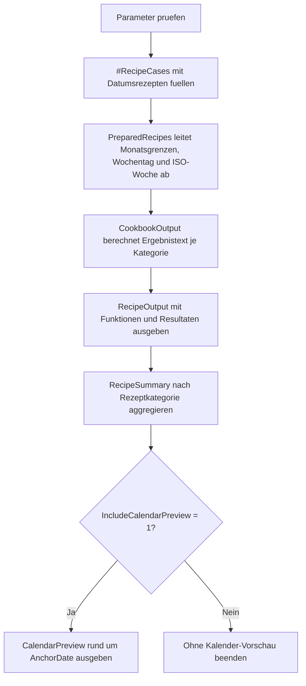

# DateFunctionCookbook.sql

Dieses Skript buendelt typische Datumsrezepte fuer T-SQL in einer kompakten Demo. Der Schwerpunkt liegt auf gut wiederverwendbaren Mustern fuer Monatsgrenzen, Intervallrechnungen und planbare Folgetermine.

## Uebersicht

<!-- SQLDOC:SUMMARY_TABLE:BEGIN -->
| Feld | Wert |
|---|---|
| Script | [DateFunctionCookbook.sql](DateFunctionCookbook.sql) |
| Version | `1.0` |
| Typ | `didactic-lab` |
| Kapitel | `05_Funktionen` |
| Sicherheit | `read-only-tempdb` |
| Zweck | Liefert praxisnahe Rezepte fuer Datumsfunktionen, Monatsgrenzen und Intervallrechnungen. |
<!-- SQLDOC:SUMMARY_TABLE:END -->

## Einordnung

Datumslogik wird in SQL oft an vielen Stellen wiederholt: Monatsanfang bestimmen, Monatsende berechnen, Tage zwischen zwei Ereignissen messen oder einen naechsten Wiedervorlage-Termin ableiten. Dieses Kochbuch zeigt solche Muster auf einer kleinen Demo-Basis und macht die eingesetzten Funktionen pro Rezept sichtbar.

## Annahmen

- Das Skript ist eine didaktische Erstversion ohne produktive Fachtabellen.
- `@AnchorDate` dient als neutraler Referenzpunkt fuer reproduzierbare Beispiele.
- Intervall- und Terminrezepte werden absichtlich aus wenigen klaren Ausgangsdaten aufgebaut.
- Die Kalender-Vorschau ist ein Lehrmittel, damit Monatsgrenzen und ISO-Wochen direkt am Referenztag nachvollzogen werden koennen.

## Anwendungsfall

Das Lab eignet sich fuer Unterricht, Reviews und Schnellreferenzen, wenn haeufig genutzte Datumsfunktionen in T-SQL zusammen erklaert werden sollen. Es kann spaeter leicht auf echte Rechnungs-, Vertrags- oder Terminspalten uebertragen werden.

## Parameter

<!-- SQLDOC:PARAMETERS_TABLE:BEGIN -->
| Parameter | SQL-Typ | Pflicht | Beschreibung |
|---|---|---|---|
| `@RecipeFocus` | `VARCHAR(20)` | Nein | Filtert `all`, `month-boundaries`, `intervals` oder `scheduling`. |
| `@AnchorDate` | `DATE` | Nein | Steuert den Referenztag fuer relative Datumsrezepte. |
| `@IncludeCalendarPreview` | `BIT` | Nein | `1` gibt eine kleine Kalender-Vorschau rund um den Referenztag aus. |
<!-- SQLDOC:PARAMETERS_TABLE:END -->

## Abhaengigkeiten

<!-- SQLDOC:DEPENDENCIES_LIST:BEGIN -->
- `tempdb` fuer die temporaere Demo-Tabelle
- `DATEADD`
- `DATEDIFF`
- `DATEFROMPARTS`
- `DATENAME`
- `DATEPART`
- `EOMONTH`
- `ROW_NUMBER`
<!-- SQLDOC:DEPENDENCIES_LIST:END -->

## Hinweise

- `month-boundaries` zeigt bewusst Monatsanfang, Monatsende und den Start des Folgemonats in einem Schritt.
- `intervals` stellt Tages-, Wochen-, Monats- und Jahresabstaende gegenueber, damit Unterschiede in `DATEDIFF` sichtbar bleiben.
- `scheduling` kombiniert relative Verschiebungen mit anschliessender Monatsend-Betrachtung.
- Die optionale Kalender-Vorschau rund um `@AnchorDate` hilft beim Debuggen von Wochen- und Monatsgrenzen.

## Versionshistorie

<!-- SQLDOC:VERSION_HISTORY_TABLE:BEGIN -->
| Version | Datum | User | Beschreibung |
|---|---|---|---|
| `1.0` | `2026-04-17` | `ER` | Erstversion fuer ein didaktisches Kochbuch zu Datumsfunktionen |
<!-- SQLDOC:VERSION_HISTORY_TABLE:END -->

## Ablauf

<!-- SQLDOC:MERMAID:BEGIN -->

<!-- SQLDOC:MERMAID:END -->

## SQL-Code

<!-- SQLDOC:SQL_CODE:BEGIN -->
```sql
/*
BEGIN:SQL-HEADER v1
---
sql_header: v1
script_name: "DateFunctionCookbook.sql"
script_version: "1.0"
script_type: "didactic-lab"
chapter: "05_Funktionen"

purpose: >
  Liefert ein Kochbuch fuer typische Datumsfunktionen in T-SQL, darunter
  Monatsgrenzen, Intervallberechnungen, relative Versatzlogik und
  nachvollziehbare Folgetermine auf einer didaktischen Demo-Basis.

parameters:
  - name: "@RecipeFocus"
    sql_type: "VARCHAR(20)"
    direction: "IN"
    required: false
    description: "Filtert all, month-boundaries, intervals oder scheduling"
  - name: "@AnchorDate"
    sql_type: "DATE"
    direction: "IN"
    required: false
    description: "Steuert den Referenztag fuer relative Datumsrezepte"
  - name: "@IncludeCalendarPreview"
    sql_type: "BIT"
    direction: "IN"
    required: false
    description: "1 gibt eine kleine Kalender-Vorschau rund um den Referenztag aus"

result_sets:
  - name: "RecipeOutput"
    description: "Zeigt pro Rezept die Eingabe, die eingesetzten Datumsfunktionen und das Resultat"
  - name: "RecipeSummary"
    description: "Verdichtet die Rezepte nach Kategorie und macht Grenz- und Intervalltypen sichtbar"
  - name: "CalendarPreview"
    description: "Zeigt optional eine kleine Tagesachse rund um den Referenztag"

dependencies:
  - "tempdb temporary tables"
  - "DATEADD"
  - "DATEDIFF"
  - "DATEFROMPARTS"
  - "DATENAME"
  - "DATEPART"
  - "EOMONTH"
  - "ROW_NUMBER"

safety:
  level: "read-only-tempdb"
  writes_data: false

documentation:
  markdown_file: "T-SQL/05_Funktionen/SQLScripts/DateFunctionCookbook.md"
  sync_blocks:
    - "SUMMARY_TABLE"
    - "PARAMETERS_TABLE"
    - "DEPENDENCIES_LIST"
    - "VERSION_HISTORY_TABLE"
    - "SQL_CODE"
  mermaid:
    mode: "ai-agent-from-sql"
    source: "script-body"

main_responsible:
  name: "Erhard Rainer"
  initials: "ER"

version_history:
  - version: "1.0"
    date: "2026-04-17"
    user: "ER"
    description: "Erstversion fuer ein didaktisches Kochbuch zu Datumsfunktionen"

notes:
  - "Das Skript arbeitet nur mit temporaeren Demo-Daten und relativen Datumsrezepten."
  - "Monatsgrenzen und Intervallwerte werden bewusst aus klaren Ausgangsdaten hergeleitet."
---
END:SQL-HEADER v1
*/

SET NOCOUNT ON;

DECLARE @RecipeFocus VARCHAR(20) = 'all';
DECLARE @AnchorDate DATE = '2026-04-17';
DECLARE @IncludeCalendarPreview BIT = 1;

IF @RecipeFocus NOT IN ('all', 'month-boundaries', 'intervals', 'scheduling')
BEGIN
    THROW 50710, '@RecipeFocus muss all, month-boundaries, intervals oder scheduling sein.', 1;
END;

IF @IncludeCalendarPreview NOT IN (0, 1)
BEGIN
    THROW 50711, '@IncludeCalendarPreview muss 0 oder 1 sein.', 1;
END;

DROP TABLE IF EXISTS #RecipeCases;

CREATE TABLE #RecipeCases
(
    RecipeId INT NOT NULL PRIMARY KEY,
    RecipeCategory VARCHAR(20) NOT NULL,
    RecipeName VARCHAR(80) NOT NULL,
    InputDate DATE NOT NULL,
    CompareDate DATE NULL,
    DayOffset INT NULL
);

INSERT INTO #RecipeCases
(
    RecipeId,
    RecipeCategory,
    RecipeName,
    InputDate,
    CompareDate,
    DayOffset
)
VALUES
    (1, 'month-boundaries', 'Current month boundaries', @AnchorDate, NULL, NULL),
    (2, 'month-boundaries', 'Previous month closure', DATEADD(MONTH, -1, @AnchorDate), NULL, NULL),
    (3, 'intervals', 'Days since invoice date', DATEADD(DAY, -19, @AnchorDate), @AnchorDate, NULL),
    (4, 'intervals', 'Months between contract milestones', DATEFROMPARTS(YEAR(@AnchorDate) - 1, 11, 5), DATEADD(MONTH, 6, @AnchorDate), NULL),
    (5, 'scheduling', 'Follow-up after 14 days', @AnchorDate, NULL, 14),
    (6, 'scheduling', 'Quarter-end review reminder', EOMONTH(@AnchorDate, 2), NULL, 3);

;WITH PreparedRecipes AS
(
    SELECT
        rc.RecipeId,
        rc.RecipeCategory,
        rc.RecipeName,
        rc.InputDate,
        rc.CompareDate,
        rc.DayOffset,
        DATEFROMPARTS(YEAR(rc.InputDate), MONTH(rc.InputDate), 1) AS MonthStartDate,
        EOMONTH(rc.InputDate) AS MonthEndDate,
        DATEADD(DAY, 1, EOMONTH(rc.InputDate)) AS NextMonthStartDate,
        DATEADD(MONTH, 1, EOMONTH(rc.InputDate)) AS NextMonthEndDate,
        DATENAME(WEEKDAY, rc.InputDate) AS WeekdayName,
        DATEPART(ISO_WEEK, rc.InputDate) AS IsoWeekNumber
    FROM #RecipeCases AS rc
    WHERE (@RecipeFocus = 'all' OR rc.RecipeCategory = @RecipeFocus)
),
CookbookOutput AS
(
    SELECT
        pr.RecipeId,
        pr.RecipeCategory,
        pr.RecipeName,
        pr.InputDate,
        pr.CompareDate,
        pr.DayOffset,
        pr.MonthStartDate,
        pr.MonthEndDate,
        pr.NextMonthStartDate,
        pr.NextMonthEndDate,
        pr.WeekdayName,
        pr.IsoWeekNumber,
        CASE pr.RecipeCategory
            WHEN 'month-boundaries' THEN 'DATEFROMPARTS + EOMONTH'
            WHEN 'intervals' THEN 'DATEDIFF'
            ELSE 'DATEADD + EOMONTH'
        END AS PrimaryFunctions,
        CASE
            WHEN pr.RecipeCategory = 'month-boundaries' THEN CONVERT(VARCHAR(10), pr.MonthStartDate, 23)
            WHEN pr.RecipeCategory = 'intervals' THEN CONCAT(
                DATEDIFF(DAY, pr.InputDate, pr.CompareDate),
                ' day(s) / ',
                DATEDIFF(MONTH, pr.InputDate, pr.CompareDate),
                ' month(s)'
            )
            WHEN pr.RecipeName = 'Quarter-end review reminder' THEN CONVERT(VARCHAR(10), DATEADD(DAY, pr.DayOffset, pr.InputDate), 23)
            ELSE CONVERT(VARCHAR(10), DATEADD(DAY, pr.DayOffset, pr.InputDate), 23)
        END AS RecipeResult,
        CASE
            WHEN pr.RecipeCategory = 'month-boundaries' THEN CONCAT(
                'MonthStart=',
                CONVERT(VARCHAR(10), pr.MonthStartDate, 23),
                '; MonthEnd=',
                CONVERT(VARCHAR(10), pr.MonthEndDate, 23),
                '; NextMonthStart=',
                CONVERT(VARCHAR(10), pr.NextMonthStartDate, 23)
            )
            WHEN pr.RecipeCategory = 'intervals' THEN CONCAT(
                'CompareDate=',
                CONVERT(VARCHAR(10), pr.CompareDate, 23),
                '; WeeksBetween=',
                DATEDIFF(WEEK, pr.InputDate, pr.CompareDate),
                '; YearsBetween=',
                DATEDIFF(YEAR, pr.InputDate, pr.CompareDate)
            )
            ELSE CONCAT(
                'ShiftedDate=',
                CONVERT(VARCHAR(10), DATEADD(DAY, pr.DayOffset, pr.InputDate), 23),
                '; MonthEndAfterShift=',
                CONVERT(VARCHAR(10), EOMONTH(DATEADD(DAY, pr.DayOffset, pr.InputDate)), 23)
            )
        END AS TeachingDetails
    FROM PreparedRecipes AS pr
),
CalendarPreview AS
(
    SELECT
        ROW_NUMBER() OVER (ORDER BY v.DayOffset) AS PreviewOrder,
        DATEADD(DAY, v.DayOffset, @AnchorDate) AS CalendarDate,
        DATENAME(WEEKDAY, DATEADD(DAY, v.DayOffset, @AnchorDate)) AS WeekdayName,
        DATEPART(ISO_WEEK, DATEADD(DAY, v.DayOffset, @AnchorDate)) AS IsoWeekNumber,
        DATEFROMPARTS(
            YEAR(DATEADD(DAY, v.DayOffset, @AnchorDate)),
            MONTH(DATEADD(DAY, v.DayOffset, @AnchorDate)),
            1
        ) AS MonthStartDate,
        EOMONTH(DATEADD(DAY, v.DayOffset, @AnchorDate)) AS MonthEndDate
    FROM (VALUES (-2), (-1), (0), (1), (2), (7), (14)) AS v(DayOffset)
)
SELECT
    co.RecipeId,
    co.RecipeCategory,
    co.RecipeName,
    co.InputDate,
    co.CompareDate,
    co.DayOffset,
    co.PrimaryFunctions,
    co.WeekdayName,
    co.IsoWeekNumber,
    co.RecipeResult,
    co.TeachingDetails
FROM CookbookOutput AS co
ORDER BY
    CASE co.RecipeCategory
        WHEN 'month-boundaries' THEN 1
        WHEN 'intervals' THEN 2
        ELSE 3
    END,
    co.RecipeId;

SELECT
    co.RecipeCategory,
    COUNT(*) AS RecipeCount,
    MIN(co.InputDate) AS EarliestInputDate,
    MAX(co.InputDate) AS LatestInputDate,
    MIN(co.MonthStartDate) AS EarliestMonthStart,
    MAX(co.MonthEndDate) AS LatestMonthEnd,
    SUM(CASE WHEN co.CompareDate IS NOT NULL THEN 1 ELSE 0 END) AS IntervalRecipeCount,
    SUM(CASE WHEN co.DayOffset IS NOT NULL THEN 1 ELSE 0 END) AS ShiftRecipeCount
FROM CookbookOutput AS co
GROUP BY
    co.RecipeCategory
ORDER BY
    CASE co.RecipeCategory
        WHEN 'month-boundaries' THEN 1
        WHEN 'intervals' THEN 2
        ELSE 3
    END;

IF @IncludeCalendarPreview = 1
BEGIN
    SELECT
        cp.PreviewOrder,
        cp.CalendarDate,
        cp.WeekdayName,
        cp.IsoWeekNumber,
        cp.MonthStartDate,
        cp.MonthEndDate,
        CASE
            WHEN cp.CalendarDate = @AnchorDate THEN 'anchor-date'
            WHEN cp.CalendarDate < @AnchorDate THEN 'before-anchor'
            ELSE 'after-anchor'
        END AS RelativePosition
    FROM CalendarPreview AS cp
    ORDER BY
        cp.PreviewOrder;
END;
```
<!-- SQLDOC:SQL_CODE:END -->
