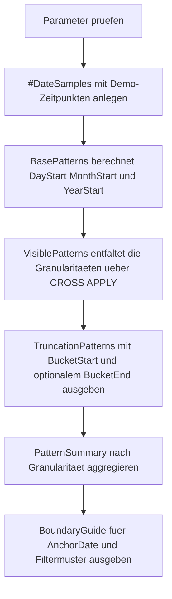

# DateTruncationPatterns.sql

Dieses Skript zeigt robuste Muster fuer Tages-, Monats- und Jahresanfang in T-SQL. Der Fokus liegt darauf, Uhrzeitanteile sauber auszublenden und Filter so zu formulieren, dass kein Grenzfall am Periodenende verloren geht.

## Uebersicht

<!-- SQLDOC:SUMMARY_TABLE:BEGIN -->
| Feld | Wert |
|---|---|
| Script | [DateTruncationPatterns.sql](DateTruncationPatterns.sql) |
| Version | `1.0` |
| Typ | `didactic-lab` |
| Kapitel | `05_Funktionen` |
| Sicherheit | `read-only-tempdb` |
| Zweck | Zeigt robuste Muster fuer Tages-, Monats- und Jahresanfang ohne Fehler durch Uhrzeiten. |
<!-- SQLDOC:SUMMARY_TABLE:END -->

## Einordnung

Zeitstempel enthalten haeufig eine Uhrzeit, waehrend Auswertungen auf Tages-, Monats- oder Jahresgrenzen beruhen. Das Skript stellt deshalb fuer dieselben Demo-Zeitpunkte die jeweiligen Bucket-Anfaenge und die passende exklusive Obergrenze gegenueber.

## Annahmen

- Das Skript ist eine didaktische Erstversion mit Demo-Zeitpunkten statt produktiver Fachtabellen.
- Tagesanfang wird bewusst ueber `CAST(timestamp AS date)` plus Rueckwandlung auf `datetime2` gezeigt.
- Monats- und Jahresanfang werden ueber `DATEFROMPARTS` gebildet, damit keine impliziten String-Konvertierungen noetig sind.
- Die empfohlene Filterlogik arbeitet mit inklusivem Start und exklusivem Ende.

## Anwendungsfall

Das Lab eignet sich fuer Trainings zu Datumsfiltern, Periodenaggregation und Grenzlogik in Reports oder ETL-Abfragen. Es kann direkt als Vorlage dienen, wenn Zeitstempel stabil auf Tag, Monat oder Jahr normiert werden sollen.

## Parameter

<!-- SQLDOC:PARAMETERS_TABLE:BEGIN -->
| Parameter | SQL-Typ | Pflicht | Beschreibung |
|---|---|---|---|
| `@Granularity` | `VARCHAR(10)` | Nein | Waehlt `day`, `month`, `year` oder `all` fuer die sichtbaren Muster. |
| `@AnchorDate` | `DATETIME2(0)` | Nein | Referenzzeitpunkt fuer zusaetzliche Grenzberechnungen. |
| `@ShowExclusiveEnd` | `BIT` | Nein | `1` zeigt die exklusive Obergrenze je Bucket, `0` blendet sie aus. |
<!-- SQLDOC:PARAMETERS_TABLE:END -->

## Abhaengigkeiten

<!-- SQLDOC:DEPENDENCIES_LIST:BEGIN -->
- `tempdb` fuer die temporaere Demo-Tabelle
- CTEs fuer Basis- und Sichtlogik
- `DATEADD`
- `DATEDIFF`
- `DATEFROMPARTS`
- `CAST`
- `CONVERT`
<!-- SQLDOC:DEPENDENCIES_LIST:END -->

## Hinweise

- `BasePatterns` berechnet zuerst die drei Bucket-Anfaenge sowie die jeweils passende exklusive Obergrenze.
- `VisiblePatterns` entfaltet diese Grenzen per `CROSS APPLY` zu einer vergleichbaren Zeilenansicht je Granularitaet.
- `SecondsFromBucketStart` macht sichtbar, wie weit ein Zeitstempel bereits in seiner Periode liegt.
- `BoundaryGuide` zeigt fuer `@AnchorDate` direkt das empfohlene Filtermuster `>= start` und `< end`.

## Versionshistorie

<!-- SQLDOC:VERSION_HISTORY_TABLE:BEGIN -->
| Version | Datum | User | Beschreibung |
|---|---|---|---|
| `1.0` | `2026-04-17` | `ER` | Erstversion fuer robuste Datums-Trunkierung ohne Uhrzeitfehler |
<!-- SQLDOC:VERSION_HISTORY_TABLE:END -->

## Ablauf

<!-- SQLDOC:MERMAID:BEGIN -->

<!-- SQLDOC:MERMAID:END -->

## SQL-Code

<!-- SQLDOC:SQL_CODE:BEGIN -->
```sql
/*
BEGIN:SQL-HEADER v1
---
sql_header: v1
script_name: "DateTruncationPatterns.sql"
script_version: "1.0"
script_type: "didactic-lab"
chapter: "05_Funktionen"

purpose: >
  Zeigt robuste Muster fuer Tages-, Monats- und Jahresanfang in T-SQL,
  damit Filter und Aggregationen nicht durch Uhrzeiten oder unsaubere
  Endgrenzen verfaelscht werden.

parameters:
  - name: "@Granularity"
    sql_type: "VARCHAR(10)"
    direction: "IN"
    required: false
    description: "Waehlt day, month, year oder all fuer die sichtbaren Muster"
  - name: "@AnchorDate"
    sql_type: "DATETIME2(0)"
    direction: "IN"
    required: false
    description: "Referenzzeitpunkt fuer zusatzliche Grenzberechnungen"
  - name: "@ShowExclusiveEnd"
    sql_type: "BIT"
    direction: "IN"
    required: false
    description: "1 zeigt die exklusive Obergrenze je Bucket, 0 blendet sie aus"

result_sets:
  - name: "TruncationPatterns"
    description: "Zeigt pro Demo-Zeitpunkt die robusten Tages-, Monats- und Jahresgrenzen"
  - name: "PatternSummary"
    description: "Verdichtet die Demo-Zeitpunkte nach Granularitaet und eindeutigen Bucket-Starts"
  - name: "BoundaryGuide"
    description: "Erlaeutert den aktiven Fokus und die empfohlene Filterlogik mit exklusiver Obergrenze"

dependencies:
  - "tempdb temporary tables"
  - "CTE"
  - "DATEADD"
  - "DATEDIFF"
  - "DATEFROMPARTS"
  - "CAST"
  - "CONVERT"

safety:
  level: "read-only-tempdb"
  writes_data: false

documentation:
  markdown_file: "T-SQL/05_Funktionen/SQLScripts/DateTruncationPatterns.md"
  sync_blocks:
    - "SUMMARY_TABLE"
    - "PARAMETERS_TABLE"
    - "DEPENDENCIES_LIST"
    - "VERSION_HISTORY_TABLE"
    - "SQL_CODE"
  mermaid:
    mode: "ai-agent-from-sql"
    source: "script-body"

main_responsible:
  name: "Erhard Rainer"
  initials: "ER"

version_history:
  - version: "1.0"
    date: "2026-04-17"
    user: "ER"
    description: "Erstversion fuer robuste Datums-Trunkierung ohne Uhrzeitfehler"

notes:
  - "Das Skript verwendet nur tempdb und didaktische Demo-Zeitpunkte."
  - "Filterempfehlungen arbeiten bewusst mit inklusivem Start und exklusivem Ende."
---
END:SQL-HEADER v1
*/

SET NOCOUNT ON;

DECLARE @Granularity VARCHAR(10) = 'all';
DECLARE @AnchorDate DATETIME2(0) = '2026-04-17 16:42:35';
DECLARE @ShowExclusiveEnd BIT = 1;

IF @Granularity NOT IN ('day', 'month', 'year', 'all')
BEGIN
    THROW 50810, '@Granularity muss day, month, year oder all sein.', 1;
END;

IF @ShowExclusiveEnd NOT IN (0, 1)
BEGIN
    THROW 50811, '@ShowExclusiveEnd muss 0 oder 1 sein.', 1;
END;

DROP TABLE IF EXISTS #DateSamples;

CREATE TABLE #DateSamples
(
    SampleId INT NOT NULL PRIMARY KEY,
    SampleLabel VARCHAR(80) NOT NULL,
    SampleTimestamp DATETIME2(0) NOT NULL
);

INSERT INTO #DateSamples
(
    SampleId,
    SampleLabel,
    SampleTimestamp
)
VALUES
    (1, 'Morning invoice timestamp', '2025-12-31 08:14:22'),
    (2, 'Last second before new year', '2025-12-31 23:59:59'),
    (3, 'First business minute in January', '2026-01-01 00:01:00'),
    (4, 'Leap day afternoon booking', '2024-02-29 15:47:05'),
    (5, 'Month-end close shortly before midnight', '2026-02-28 23:58:40'),
    (6, 'Month-start validation run', '2026-03-01 00:00:00'),
    (7, 'Mid-month review with time component', '2026-04-17 16:42:35');

;WITH BasePatterns AS
(
    SELECT
        ds.SampleId,
        ds.SampleLabel,
        ds.SampleTimestamp,
        CAST(ds.SampleTimestamp AS DATE) AS CalendarDate,
        CAST(ds.SampleTimestamp AS TIME(0)) AS TimeOfDay,
        CAST(CAST(ds.SampleTimestamp AS DATE) AS DATETIME2(0)) AS DayStartDateTime,
        DATEADD(DAY, 1, CAST(CAST(ds.SampleTimestamp AS DATE) AS DATETIME2(0))) AS DayEndExclusive,
        CAST(DATEFROMPARTS(YEAR(ds.SampleTimestamp), MONTH(ds.SampleTimestamp), 1) AS DATETIME2(0)) AS MonthStartDateTime,
        DATEADD(
            MONTH,
            1,
            CAST(DATEFROMPARTS(YEAR(ds.SampleTimestamp), MONTH(ds.SampleTimestamp), 1) AS DATETIME2(0))
        ) AS MonthEndExclusive,
        CAST(DATEFROMPARTS(YEAR(ds.SampleTimestamp), 1, 1) AS DATETIME2(0)) AS YearStartDateTime,
        DATEADD(
            YEAR,
            1,
            CAST(DATEFROMPARTS(YEAR(ds.SampleTimestamp), 1, 1) AS DATETIME2(0))
        ) AS YearEndExclusive
    FROM #DateSamples AS ds
),
VisiblePatterns AS
(
    SELECT
        bp.SampleId,
        bp.SampleLabel,
        bp.SampleTimestamp,
        bp.CalendarDate,
        bp.TimeOfDay,
        vp.Granularity,
        vp.BucketStartDateTime,
        vp.BucketEndExclusive,
        DATEDIFF(SECOND, vp.BucketStartDateTime, bp.SampleTimestamp) AS SecondsFromBucketStart,
        CASE vp.Granularity
            WHEN 'day' THEN 'CAST(timestamp AS date) auf Mitternacht zurueckfuehren'
            WHEN 'month' THEN 'DATEFROMPARTS(YEAR, MONTH, 1) fuer den Monatsanfang verwenden'
            ELSE 'DATEFROMPARTS(YEAR, 1, 1) fuer den Jahresanfang verwenden'
        END AS RecommendedPattern,
        CASE
            WHEN bp.SampleTimestamp >= vp.BucketStartDateTime
             AND bp.SampleTimestamp < vp.BucketEndExclusive THEN 'safe-half-open-filter'
            ELSE 'unexpected'
        END AS FilterPatternStatus
    FROM BasePatterns AS bp
    CROSS APPLY
    (
        VALUES
            ('day', bp.DayStartDateTime, bp.DayEndExclusive),
            ('month', bp.MonthStartDateTime, bp.MonthEndExclusive),
            ('year', bp.YearStartDateTime, bp.YearEndExclusive)
    ) AS vp(Granularity, BucketStartDateTime, BucketEndExclusive)
    WHERE (@Granularity = 'all' OR vp.Granularity = @Granularity)
),
AnchorGuide AS
(
    SELECT
        CAST(CAST(@AnchorDate AS DATE) AS DATETIME2(0)) AS AnchorDayStart,
        DATEADD(DAY, 1, CAST(CAST(@AnchorDate AS DATE) AS DATETIME2(0))) AS AnchorDayEndExclusive,
        CAST(DATEFROMPARTS(YEAR(@AnchorDate), MONTH(@AnchorDate), 1) AS DATETIME2(0)) AS AnchorMonthStart,
        DATEADD(
            MONTH,
            1,
            CAST(DATEFROMPARTS(YEAR(@AnchorDate), MONTH(@AnchorDate), 1) AS DATETIME2(0))
        ) AS AnchorMonthEndExclusive,
        CAST(DATEFROMPARTS(YEAR(@AnchorDate), 1, 1) AS DATETIME2(0)) AS AnchorYearStart,
        DATEADD(
            YEAR,
            1,
            CAST(DATEFROMPARTS(YEAR(@AnchorDate), 1, 1) AS DATETIME2(0))
        ) AS AnchorYearEndExclusive
)
SELECT
    vp.Granularity,
    vp.SampleId,
    vp.SampleLabel,
    vp.SampleTimestamp,
    vp.CalendarDate,
    vp.TimeOfDay,
    vp.BucketStartDateTime,
    CASE WHEN @ShowExclusiveEnd = 1 THEN vp.BucketEndExclusive END AS BucketEndExclusive,
    vp.SecondsFromBucketStart,
    vp.RecommendedPattern,
    vp.FilterPatternStatus
FROM VisiblePatterns AS vp
ORDER BY
    CASE vp.Granularity
        WHEN 'day' THEN 1
        WHEN 'month' THEN 2
        ELSE 3
    END,
    vp.SampleTimestamp,
    vp.SampleId;

SELECT
    vp.Granularity,
    COUNT(*) AS SampleCount,
    COUNT(DISTINCT vp.BucketStartDateTime) AS DistinctBucketStarts,
    MIN(vp.BucketStartDateTime) AS EarliestBucketStart,
    MAX(vp.BucketStartDateTime) AS LatestBucketStart,
    MIN(vp.SecondsFromBucketStart) AS MinSecondsFromBucketStart,
    MAX(vp.SecondsFromBucketStart) AS MaxSecondsFromBucketStart
FROM VisiblePatterns AS vp
GROUP BY
    vp.Granularity
ORDER BY
    CASE vp.Granularity
        WHEN 'day' THEN 1
        WHEN 'month' THEN 2
        ELSE 3
    END;

SELECT
    @Granularity AS RequestedGranularity,
    @AnchorDate AS AnchorDate,
    @ShowExclusiveEnd AS ShowExclusiveEnd,
    ag.AnchorDayStart,
    ag.AnchorDayEndExclusive,
    ag.AnchorMonthStart,
    ag.AnchorMonthEndExclusive,
    ag.AnchorYearStart,
    ag.AnchorYearEndExclusive,
    CASE
        WHEN @Granularity = 'day' THEN 'Nutze Tagesanfang plus exklusives Tagesende fuer zeitstabile Tagesfilter.'
        WHEN @Granularity = 'month' THEN 'Monatsanfang ueber DATEFROMPARTS ableiten und bis zum naechsten Monatsanfang filtern.'
        WHEN @Granularity = 'year' THEN 'Jahresanfang ueber DATEFROMPARTS ableiten und bis zum naechsten Jahresanfang filtern.'
        ELSE 'Vergleiche Tages-, Monats- und Jahresanfang direkt an denselben Zeitpunkten.'
    END AS TeachingFocus,
    'Empfohlenes Filtermuster: timestamp >= BucketStartDateTime AND timestamp < BucketEndExclusive.' AS FilterRecommendation
FROM AnchorGuide AS ag;
```
<!-- SQLDOC:SQL_CODE:END -->
