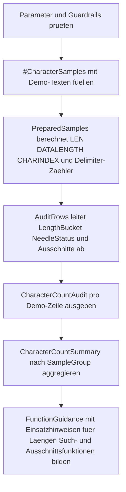

# FunctionCharacterCountAudit.sql

Dieses Skript stellt mehrere Zeichen- und Laengenfunktionen auf dieselben realistisch wirkenden Textbeispiele. Dadurch wird direkt sichtbar, wann `LEN` fuer die logische Laenge ausreicht, wann `DATALENGTH` gespeicherte Bytes oder ausgeblendete Auffaelligkeiten sichtbar macht und wie Ausschnitts- sowie Suchfunktionen dieselben Texte aus anderen Blickwinkeln beleuchten.

## Uebersicht

<!-- SQLDOC:SUMMARY_TABLE:BEGIN -->
| Feld | Wert |
|---|---|
| Script | [FunctionCharacterCountAudit.sql](FunctionCharacterCountAudit.sql) |
| Version | `1.0` |
| Typ | `didactic-lab` |
| Kapitel | `05_Funktionen` |
| Sicherheit | `read-only-tempdb` |
| Zweck | Prueft Zeichen- und Laengenfunktionen an realistischen Texten und kontrastiert `LEN`, `DATALENGTH`, Ausschnitts- und Suchfunktionen. |
<!-- SQLDOC:SUMMARY_TABLE:END -->

## Einordnung

Bei Textwerten tauchen in Reviews oft drei Fragen gleichzeitig auf: Wie lang wirkt der Wert fachlich, wie viele Zeichenplaetze oder Bytes sind real gespeichert, und an welcher Stelle beginnt ein relevantes Trennzeichen oder Token? Das Audit trennt diese Ebenen sauber auf und verbindet sie mit gut lesbaren Demo-Texten aus Produktlabels, Tickets, E-Mails, Pfaden und Notizen.

## Annahmen

- Das Skript arbeitet ausschliesslich mit einem didaktischen Demo-Katalog in einer temporaeren Tabelle.
- `@Needle` ist in der Erstversion auf den Bindestrich gesetzt, weil er in Produktcodes, Ticket-IDs und Batch-Bezeichnern haeufig vorkommt.
- `DATALENGTH / 2` wird hier als gespeicherte Zeichenplaetze fuer `NVARCHAR` genutzt; der Fokus liegt auf dem Vergleich zu `LEN`, nicht auf einer vollstaendigen Unicode-Graphem-Analyse.
- Nachgestellte Leerzeichen sind bewusst enthalten, damit der Unterschied zwischen logischer Textlaenge und gespeicherten Zeichen sichtbar bleibt.

## Anwendungsfall

Das Skript eignet sich fuer Unterricht, Debugging von Importdaten und Query-Reviews, wenn Stringspalten auf Plausibilitaet, Suchmuster oder Laengenregeln geprueft werden. Es ist besonders nuetzlich, wenn Teams diskutieren, ob ein Grenzwert auf `LEN` basieren soll oder ob verborgene Auffaelligkeiten wie Padding erst ueber `DATALENGTH` sichtbar werden.

## Parameter

<!-- SQLDOC:PARAMETERS_TABLE:BEGIN -->
| Parameter | SQL-Typ | Pflicht | Beschreibung |
|---|---|---|---|
| `@Needle` | `NVARCHAR(20)` | Nein | Zeichenfolge, deren erste Position pro Demo-Text mit `CHARINDEX` geprueft wird. |
| `@MinLogicalLength` | `INT` | Nein | Grenzwert fuer die Einordnung in kurze und lange Texte anhand von `LEN`. |
| `@ShowOnlyBelowThreshold` | `BIT` | Nein | `1` zeigt nur Demo-Zeilen mit `LEN` unterhalb des Grenzwerts. |
<!-- SQLDOC:PARAMETERS_TABLE:END -->

## Abhaengigkeiten

<!-- SQLDOC:DEPENDENCIES_LIST:BEGIN -->
- `tempdb` fuer die temporaere Demo-Tabelle
- `LEN`
- `DATALENGTH`
- `LEFT`
- `RIGHT`
- `SUBSTRING`
- `CHARINDEX`
- `REPLACE`
- `LTRIM`
- `RTRIM`
- `STRING_AGG`
- `CASE`
<!-- SQLDOC:DEPENDENCIES_LIST:END -->

## Hinweise

- `CharacterCountAudit` zeigt pro Zeile den direkten Kontrast zwischen `LEN`, `DATALENGTH`, gespeicherten Zeichenplaetzen und den durch `LEN` ignorierten Zeichen.
- `LeftSnippet`, `MiddleSnippet` und `RightSnippet` machen sichtbar, dass Ausschnitts-Funktionen nicht nur fuer Extraktion, sondern auch fuer schnelle Vorschauen im Review nuetzlich sind.
- Die Zaehler fuer Leerzeichen, Bindestriche und Slashes entstehen ueber `LEN - LEN(REPLACE(...))` und demonstrieren ein einfaches Muster fuer Delimiter-Audits.
- `CharacterCountSummary` aggregiert die Textprofile pro Fachgruppe, damit Grenzwerte und Suchmuster nicht nur auf Einzelfall-Ebene betrachtet werden.

## Versionshistorie

<!-- SQLDOC:VERSION_HISTORY_TABLE:BEGIN -->
| Version | Datum | User | Beschreibung |
|---|---|---|---|
| `1.0` | `2026-04-19` | `ER` | Erstversion fuer ein didaktisches Audit zu Zeichen- und Laengenfunktionen |
<!-- SQLDOC:VERSION_HISTORY_TABLE:END -->

## Ablauf

<!-- SQLDOC:MERMAID:BEGIN -->

<!-- SQLDOC:MERMAID:END -->

## SQL-Code

<!-- SQLDOC:SQL_CODE:BEGIN -->
```sql
/*
BEGIN:SQL-HEADER v1
---
sql_header: v1
script_name: "FunctionCharacterCountAudit.sql"
script_version: "1.0"
script_type: "didactic-lab"
chapter: "05_Funktionen"

purpose: >
  Prueft Zeichen- und Laengenfunktionen an realistischen Texten und zeigt,
  wie LEN, DATALENGTH, LEFT, RIGHT, SUBSTRING, CHARINDEX und REPLACE
  unterschiedliche Aspekte derselben Werte sichtbar machen.

parameters:
  - name: "@Needle"
    sql_type: "NVARCHAR(20)"
    direction: "IN"
    required: false
    description: "Zeichenfolge, deren erste Position pro Demo-Text mit CHARINDEX geprueft wird"
  - name: "@MinLogicalLength"
    sql_type: "INT"
    direction: "IN"
    required: false
    description: "Grenzwert fuer die Einordnung in kurze und lange Texte anhand von LEN"
  - name: "@ShowOnlyBelowThreshold"
    sql_type: "BIT"
    direction: "IN"
    required: false
    description: "1 zeigt nur Demo-Zeilen mit LEN unterhalb des Grenzwerts, 0 zeigt den gesamten Katalog"

result_sets:
  - name: "CharacterCountAudit"
    description: "Zeigt pro Demo-Text sichtbare Marker, LEN gegen DATALENGTH und typische String-Ausschnitte"
  - name: "CharacterCountSummary"
    description: "Aggregiert die Demo-Zeilen nach Fachgruppe und zeigt Laengen- sowie Trefferprofile"
  - name: "FunctionGuidance"
    description: "Leitet aus den beobachteten Werten kurze Einsatzhinweise fuer Laengen- und Zeichenfunktionen ab"

dependencies:
  - "tempdb temporary tables"
  - "LEN"
  - "DATALENGTH"
  - "LEFT"
  - "RIGHT"
  - "SUBSTRING"
  - "CHARINDEX"
  - "REPLACE"
  - "LTRIM"
  - "RTRIM"
  - "STRING_AGG"
  - "CASE"

safety:
  level: "read-only-tempdb"
  writes_data: false

documentation:
  markdown_file: "T-SQL/05_Funktionen/SQLScripts/FunctionCharacterCountAudit.md"
  sync_blocks:
    - "SUMMARY_TABLE"
    - "PARAMETERS_TABLE"
    - "DEPENDENCIES_LIST"
    - "VERSION_HISTORY_TABLE"
    - "SQL_CODE"
  mermaid:
    mode: "ai-agent-from-sql"
    source: "script-body"

main_responsible:
  name: "Erhard Rainer"
  initials: "ER"

version_history:
  - version: "1.0"
    date: "2026-04-19"
    user: "ER"
    description: "Erstversion fuer ein didaktisches Audit zu Zeichen- und Laengenfunktionen"

notes:
  - "Das Skript arbeitet mit einem kleinen Demo-Katalog in einer temporaeren Tabelle."
  - "DATALENGTH zeigt gespeicherte Bytes, waehrend LEN nachgestellte Leerzeichen ignoriert."
---
END:SQL-HEADER v1
*/

SET NOCOUNT ON;

DECLARE @Needle NVARCHAR(20) = N'-';
DECLARE @MinLogicalLength INT = 18;
DECLARE @ShowOnlyBelowThreshold BIT = 0;

IF NULLIF(LTRIM(RTRIM(@Needle)), N'') IS NULL
BEGIN
    THROW 50840, '@Needle darf nicht leer sein.', 1;
END;

IF @MinLogicalLength < 1
BEGIN
    THROW 50841, '@MinLogicalLength muss groesser als 0 sein.', 1;
END;

IF @ShowOnlyBelowThreshold NOT IN (0, 1)
BEGIN
    THROW 50842, '@ShowOnlyBelowThreshold muss 0 oder 1 sein.', 1;
END;

DROP TABLE IF EXISTS #CharacterSamples;

CREATE TABLE #CharacterSamples
(
    SampleId INT NOT NULL PRIMARY KEY,
    SampleGroup VARCHAR(30) NOT NULL,
    RawValue NVARCHAR(200) NOT NULL,
    BusinessMeaning NVARCHAR(160) NOT NULL
);

INSERT INTO #CharacterSamples
(
    SampleId,
    SampleGroup,
    RawValue,
    BusinessMeaning
)
VALUES
    (1, 'product-label', N'Premium-Widget-3000', N'Produktname mit Bindestrichen und Ziffern'),
    (2, 'branch-name', N'North Region Hub   ', N'Filialname mit nachgestellten Leerzeichen'),
    (3, 'ticket-title', N'INC-2045 Payment Retry', N'Ticket-Titel mit Code-Praefix und Fachbegriff'),
    (4, 'email', N'service.ops@contoso.de', N'E-Mail-Adresse mit Punkt und At-Zeichen'),
    (5, 'path', N'archive/2026/quarter-01/report.csv', N'Pfadartige Zeichenfolge mit Slash und Dateiname'),
    (6, 'customer-note', N'VIP  customer escalation', N'Notiz mit doppeltem Leerzeichen im Inneren'),
    (7, 'batch-code', N'BATCH-07-A ', N'Code mit nachgestelltem Leerzeichen fuer LEN gegen DATALENGTH'),
    (8, 'delimiter-free', N'WarehouseAlpha', N'Kontrollfall ohne Trennzeichen aus @Needle');

;WITH PreparedSamples AS
(
    SELECT
        src.SampleId,
        src.SampleGroup,
        src.RawValue,
        src.BusinessMeaning,
        REPLACE(REPLACE(REPLACE(src.RawValue, CHAR(13), '<CR>'), CHAR(10), '<LF>'), CHAR(9), '<TAB>') AS VisibleRawValue,
        LEN(src.RawValue) AS LogicalLength,
        DATALENGTH(src.RawValue) AS ByteLength,
        DATALENGTH(src.RawValue) / 2 AS StoredCharacterSlots,
        LEN(LTRIM(src.RawValue)) AS LeftTrimmedLength,
        LEN(RTRIM(src.RawValue)) AS RightTrimmedLength,
        CHARINDEX(@Needle, src.RawValue) AS NeedlePosition,
        LEN(src.RawValue) - LEN(REPLACE(src.RawValue, N' ', N'')) AS SpaceCount,
        LEN(src.RawValue) - LEN(REPLACE(src.RawValue, N'-', N'')) AS HyphenCount,
        LEN(src.RawValue) - LEN(REPLACE(src.RawValue, N'/', N'')) AS SlashCount,
        CASE WHEN LEN(src.RawValue) >= 12 THEN LEFT(src.RawValue, 12) ELSE src.RawValue END AS LeftSnippet,
        CASE WHEN LEN(src.RawValue) >= 12 THEN RIGHT(src.RawValue, 12) ELSE src.RawValue END AS RightSnippet,
        SUBSTRING(src.RawValue, CASE WHEN LEN(src.RawValue) >= 10 THEN 4 ELSE 1 END, 10) AS MiddleSnippet
    FROM #CharacterSamples AS src
),
AuditRows AS
(
    SELECT
        ps.SampleId,
        ps.SampleGroup,
        ps.RawValue,
        ps.VisibleRawValue,
        ps.BusinessMeaning,
        ps.LogicalLength,
        ps.ByteLength,
        ps.StoredCharacterSlots,
        ps.StoredCharacterSlots - ps.LogicalLength AS CharactersIgnoredByLen,
        ps.LeftTrimmedLength,
        ps.RightTrimmedLength,
        ps.NeedlePosition,
        ps.SpaceCount,
        ps.HyphenCount,
        ps.SlashCount,
        ps.LeftSnippet,
        ps.MiddleSnippet,
        ps.RightSnippet,
        CASE
            WHEN ps.LogicalLength < @MinLogicalLength THEN 'below-threshold'
            ELSE 'meets-threshold'
        END AS LengthBucket,
        CASE
            WHEN ps.NeedlePosition > 0 THEN 'needle-found'
            ELSE 'needle-missing'
        END AS NeedleStatus
    FROM PreparedSamples AS ps
)
SELECT
    ar.SampleId,
    ar.SampleGroup,
    ar.VisibleRawValue,
    ar.BusinessMeaning,
    ar.LogicalLength,
    ar.ByteLength,
    ar.StoredCharacterSlots,
    ar.CharactersIgnoredByLen,
    ar.LeftTrimmedLength,
    ar.RightTrimmedLength,
    ar.NeedlePosition,
    ar.SpaceCount,
    ar.HyphenCount,
    ar.SlashCount,
    ar.LeftSnippet,
    ar.MiddleSnippet,
    ar.RightSnippet,
    ar.LengthBucket,
    ar.NeedleStatus
FROM AuditRows AS ar
WHERE @ShowOnlyBelowThreshold = 0
   OR ar.LengthBucket = 'below-threshold'
ORDER BY
    ar.SampleId;

SELECT
    ar.SampleGroup,
    COUNT(*) AS SampleCount,
    MIN(ar.LogicalLength) AS MinLogicalLength,
    MAX(ar.LogicalLength) AS MaxLogicalLength,
    AVG(CONVERT(DECIMAL(10, 2), ar.LogicalLength)) AS AvgLogicalLength,
    SUM(CASE WHEN ar.CharactersIgnoredByLen > 0 THEN 1 ELSE 0 END) AS RowsWithTrailingPadding,
    SUM(CASE WHEN ar.NeedlePosition > 0 THEN 1 ELSE 0 END) AS RowsWithNeedle,
    SUM(ar.SpaceCount) AS TotalSpaces,
    SUM(ar.HyphenCount) AS TotalHyphens,
    SUM(ar.SlashCount) AS TotalSlashes,
    STRING_AGG(ar.VisibleRawValue, ' | ') WITHIN GROUP (ORDER BY ar.SampleId) AS SampleValues
FROM AuditRows AS ar
GROUP BY
    ar.SampleGroup
ORDER BY
    ar.SampleGroup;

SELECT
    fg.FunctionName,
    fg.WhenToUse,
    fg.ObservedPattern,
    fg.ExampleSamples
FROM
(
    SELECT
        'LEN vs DATALENGTH' AS FunctionName,
        'Sinnvoll, wenn logische Zeichenlaenge und gespeicherte Bytes getrennt betrachtet werden muessen.' AS WhenToUse,
        CONCAT(
            SUM(CASE WHEN ar.CharactersIgnoredByLen > 0 THEN 1 ELSE 0 END),
            ' Demo-Zeilen zeigen mehr gespeicherte Zeichenplaetze als LEN meldet, typischerweise durch nachgestellte Leerzeichen.'
        ) AS ObservedPattern,
        STRING_AGG(CASE WHEN ar.CharactersIgnoredByLen > 0 THEN ar.VisibleRawValue END, ', ') WITHIN GROUP (ORDER BY ar.SampleId) AS ExampleSamples
    FROM AuditRows AS ar

    UNION ALL

    SELECT
        'LEFT RIGHT SUBSTRING' AS FunctionName,
        'Sinnvoll fuer stabile Ausschnitte, Vorschauen und Extraktionsmuster innerhalb laengerer Texte.' AS WhenToUse,
        CONCAT(
            COUNT(*),
            ' Demo-Zeilen liefern gleichzeitig linken, mittleren und rechten Ausschnitt fuer schnelle Textinspektionen.'
        ) AS ObservedPattern,
        STRING_AGG(ar.LeftSnippet + N' ... ' + ar.RightSnippet, ', ') WITHIN GROUP (ORDER BY ar.SampleId) AS ExampleSamples
    FROM AuditRows AS ar

    UNION ALL

    SELECT
        'CHARINDEX' AS FunctionName,
        'Sinnvoll, wenn die erste Position eines Trennzeichens oder Tokens benoetigt wird.' AS WhenToUse,
        CONCAT(
            SUM(CASE WHEN ar.NeedlePosition > 0 THEN 1 ELSE 0 END),
            ' Demo-Zeilen enthalten die Zeichenfolge aus @Needle, ',
            SUM(CASE WHEN ar.NeedlePosition = 0 THEN 1 ELSE 0 END),
            ' Demo-Zeilen dienen als Negativfall.'
        ) AS ObservedPattern,
        STRING_AGG(CASE WHEN ar.NeedlePosition > 0 THEN ar.VisibleRawValue END, ', ') WITHIN GROUP (ORDER BY ar.SampleId) AS ExampleSamples
    FROM AuditRows AS ar

    UNION ALL

    SELECT
        'REPLACE-basierte Zaehler' AS FunctionName,
        'Sinnvoll, wenn Trennzeichen wie Leerzeichen, Bindestriche oder Slashes ohne Schleife gezaehlt werden sollen.' AS WhenToUse,
        CONCAT(
            'Der Demo-Katalog enthaelt insgesamt ',
            SUM(ar.SpaceCount),
            ' Leerzeichen, ',
            SUM(ar.HyphenCount),
            ' Bindestriche und ',
            SUM(ar.SlashCount),
            ' Slashes.'
        ) AS ObservedPattern,
        STRING_AGG(CASE WHEN ar.SpaceCount + ar.HyphenCount + ar.SlashCount > 0 THEN ar.VisibleRawValue END, ', ') WITHIN GROUP (ORDER BY ar.SampleId) AS ExampleSamples
    FROM AuditRows AS ar
) AS fg
ORDER BY
    CASE fg.FunctionName
        WHEN 'LEN vs DATALENGTH' THEN 1
        WHEN 'LEFT RIGHT SUBSTRING' THEN 2
        WHEN 'CHARINDEX' THEN 3
        ELSE 4
    END;
```
<!-- SQLDOC:SQL_CODE:END -->
