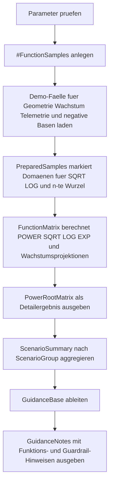

# FunctionPowerRootDemo.sql

Dieses Skript zeigt auf einer kleinen Demo-Datenbasis, wie `POWER`, `SQRT`, `EXP` und `LOG` zusammenhaengen. Der Fokus liegt auf gut lesbaren Potenzen, n-ten Wurzeln und einfachen Wachstumsprojektionen inklusive Guardrails fuer negative oder nicht-log-faehige Werte.

## Uebersicht

<!-- SQLDOC:SUMMARY_TABLE:BEGIN -->
| Feld | Wert |
|---|---|
| Script | [FunctionPowerRootDemo.sql](FunctionPowerRootDemo.sql) |
| Version | `1.0` |
| Typ | `didactic-lab` |
| Kapitel | `05_Funktionen` |
| Sicherheit | `read-only-tempdb` |
| Zweck | Demonstriert Potenzen, Wurzeln und Exponentialmuster mit sicheren Domaenenpruefungen. |
<!-- SQLDOC:SUMMARY_TABLE:END -->

## Einordnung

Potenz- und Wurzelfunktionen werden in T-SQL oft zusammen mit Wachstums- oder Skalierungsfragen benoetigt. Das Lab haelt deshalb direkte Potenzen, Wurzelableitungen und `EXP(LOG(x) * n)` im selben Ablauf sichtbar, damit mathematische Zusammenhaenge im SQL-Kontext nicht isoliert bleiben.

## Annahmen

- Das Skript nutzt ausschliesslich eine temporaere Demo-Tabelle und keine produktiven Fachtabellen.
- Negative Basen werden fuer `SQRT` und `LOG` nicht direkt ausgewertet, sondern als Guardrail-Faelle sichtbar gemacht.
- Ungerade n-te Wurzeln negativer Werte werden didaktisch ueber `ABS`, `POWER` und ein vorangestelltes Minus rekonstruiert.
- Die Wachstumsprojektion verwendet positive Faktoren und interpretiert Werte groesser `1` als Wachstum, kleinere positive Werte als Abnahme.

## Anwendungsfall

Das Skript eignet sich fuer Unterricht, Reviews und kleine Diagnoseaufgaben, wenn numerische Ausdruecke mit Potenzen, Wurzeln oder Wachstumsfaktoren erklaert werden muessen. Die Demo-Faelle lassen sich spaeter leicht gegen reale Messwerte, Preisindizes oder geometrische Skalierungsfaktoren austauschen.

## Parameter

<!-- SQLDOC:PARAMETERS_TABLE:BEGIN -->
| Parameter | SQL-Typ | Pflicht | Beschreibung |
|---|---|---|---|
| `@RootDegree` | `TINYINT` | Nein | Grad der n-ten Wurzel fuer den Vergleich ueber `POWER(..., 1.0 / n)`. |
| `@GrowthPeriods` | `TINYINT` | Nein | Anzahl der Perioden fuer das Exponentialwachstum je Demo-Szenario. |
| `@IncludeNegativeExamples` | `BIT` | Nein | `1` zeigt auch negative Basen und Guardrail-Faelle fuer Wurzeln und Logarithmen. |
<!-- SQLDOC:PARAMETERS_TABLE:END -->

## Abhaengigkeiten

<!-- SQLDOC:DEPENDENCIES_LIST:BEGIN -->
- `tempdb` fuer die temporaere Demo-Tabelle
- `POWER`
- `SQRT`
- `EXP`
- `LOG`
- `ABS` plus bewusst gesetztes negatives Vorzeichen fuer ungerade n-te Wurzeln negativer Basen
- CTEs fuer Domaenenpruefung, Vergleichsmatrix und didaktische Hinweise
<!-- SQLDOC:DEPENDENCIES_LIST:END -->

## Hinweise

- `PowerResult`, `SquareValue` und `CubeValue` zeigen direkte Potenzmuster auf derselben Basis.
- `SquareRootValue` und `NthRootValue` machen sichtbar, dass Wurzeln in T-SQL eine saubere Domaenenpruefung brauchen.
- `NaturalLogValue` und `ExpOfLogValue` erklaeren, warum `EXP(LOG(x))` bei positiven Werten wieder auf den Ausgangswert fuehrt.
- `GrowthProjection` nutzt `EXP(LOG(GrowthFactor) * @GrowthPeriods)` als gut lesbare Bruecke zwischen Logarithmus und multiplikativem Wachstum.

## Versionshistorie

<!-- SQLDOC:VERSION_HISTORY_TABLE:BEGIN -->
| Version | Datum | User | Beschreibung |
|---|---|---|---|
| `1.0` | `2026-04-19` | `ER` | Erstversion fuer ein didaktisches Lab zu Potenz-, Wurzel- und Exponentialfunktionen |
<!-- SQLDOC:VERSION_HISTORY_TABLE:END -->

## Ablauf

<!-- SQLDOC:MERMAID:BEGIN -->

<!-- SQLDOC:MERMAID:END -->

## SQL-Code

<!-- SQLDOC:SQL_CODE:BEGIN -->
```sql
/*
BEGIN:SQL-HEADER v1
---
sql_header: v1
script_name: "FunctionPowerRootDemo.sql"
script_version: "1.0"
script_type: "didactic-lab"
chapter: "05_Funktionen"

purpose: >
  Demonstriert auf einer kleinen Demo-Datenbasis, wie POWER, SQRT, EXP und
  LOG zusammenspielen und wie sich Potenzen, n-te Wurzeln und einfache
  Wachstumsmodelle in T-SQL mit Guardrails fuer Vorzeichen und Domaenen
  nachvollziehbar berechnen lassen.

parameters:
  - name: "@RootDegree"
    sql_type: "TINYINT"
    direction: "IN"
    required: false
    description: "Grad der n-ten Wurzel fuer den Vergleich ueber POWER(..., 1.0 / n)"
  - name: "@GrowthPeriods"
    sql_type: "TINYINT"
    direction: "IN"
    required: false
    description: "Anzahl der Perioden fuer das Exponentialwachstum je Demo-Szenario"
  - name: "@IncludeNegativeExamples"
    sql_type: "BIT"
    direction: "IN"
    required: false
    description: "1 zeigt auch negative Basen und Guardrail-Faelle fuer Wurzeln und Logarithmen"

result_sets:
  - name: "PowerRootMatrix"
    description: "Vergleicht Quadrate, Kuben, Quadratwurzeln, n-te Wurzeln sowie EXP- und LOG-Ableitungen je Demo-Fall"
  - name: "ScenarioSummary"
    description: "Aggregiert verwendbare Potenz-, Wurzel- und Wachstumsprofile nach Szenariogruppe"
  - name: "GuidanceNotes"
    description: "Leitet didaktische Hinweise fuer POWER, SQRT, EXP und LOG aus den Demo-Faellen ab"

dependencies:
  - "tempdb temporary tables"
  - "POWER"
  - "SQRT"
  - "EXP"
  - "LOG"
  - "ABS"
  - "CTE"

safety:
  level: "read-only-tempdb"
  writes_data: false

documentation:
  markdown_file: "T-SQL/05_Funktionen/SQLScripts/FunctionPowerRootDemo.md"
  sync_blocks:
    - "SUMMARY_TABLE"
    - "PARAMETERS_TABLE"
    - "DEPENDENCIES_LIST"
    - "VERSION_HISTORY_TABLE"
    - "SQL_CODE"
  mermaid:
    mode: "ai-agent-from-sql"
    source: "script-body"

main_responsible:
  name: "Erhard Rainer"
  initials: "ER"

version_history:
  - version: "1.0"
    date: "2026-04-19"
    user: "ER"
    description: "Erstversion fuer ein didaktisches Lab zu Potenz-, Wurzel- und Exponentialfunktionen"

notes:
  - "Das Skript nutzt nur eine temporaere Demo-Tabelle."
  - "LOG und SQRT werden nur fuer fachlich zulaessige positive Eingabewerte direkt berechnet."
---
END:SQL-HEADER v1
*/

SET NOCOUNT ON;

DECLARE @RootDegree TINYINT = 3;
DECLARE @GrowthPeriods TINYINT = 4;
DECLARE @IncludeNegativeExamples BIT = 1;

IF @RootDegree NOT BETWEEN 2 AND 5
BEGIN
    THROW 50860, '@RootDegree muss zwischen 2 und 5 liegen.', 1;
END;

IF @GrowthPeriods NOT BETWEEN 1 AND 12
BEGIN
    THROW 50861, '@GrowthPeriods muss zwischen 1 und 12 liegen.', 1;
END;

IF @IncludeNegativeExamples NOT IN (0, 1)
BEGIN
    THROW 50862, '@IncludeNegativeExamples muss 0 oder 1 sein.', 1;
END;

DROP TABLE IF EXISTS #FunctionSamples;

CREATE TABLE #FunctionSamples
(
    SampleID INT NOT NULL PRIMARY KEY,
    ScenarioGroup VARCHAR(20) NOT NULL,
    ScenarioName VARCHAR(100) NOT NULL,
    BaseValue DECIMAL(18, 6) NOT NULL,
    ExponentValue DECIMAL(10, 4) NOT NULL,
    GrowthFactor DECIMAL(10, 6) NOT NULL,
    CommentText VARCHAR(160) NOT NULL
);

INSERT INTO #FunctionSamples
(
    SampleID,
    ScenarioGroup,
    ScenarioName,
    BaseValue,
    ExponentValue,
    GrowthFactor,
    CommentText
)
VALUES
    (1, 'geometry', 'Area factor for square scaling', 9.000000, 2.0000, 1.080000, 'Quadrat und Quadratwurzel bleiben hier exakt nachvollziehbar'),
    (2, 'geometry', 'Volume factor for cubic scaling', 27.000000, 3.0000, 1.120000, 'Kubische Potenzen lassen sich ueber die dritte Wurzel wieder einordnen'),
    (3, 'finance', 'Growth base above one', 1.150000, 4.0000, 1.150000, 'EXP und LOG erklaeren dieselbe Wachstumsrate auf unterschiedlichen Wegen'),
    (4, 'telemetry', 'Small positive sensor ratio', 0.640000, 2.0000, 1.020000, 'Werte zwischen 0 und 1 zeigen schrumpfende Potenzen und stabile Wurzeln'),
    (5, 'signals', 'Negative correction value', -8.000000, 3.0000, 0.970000, 'Negative Basen zeigen Guardrails fuer SQRT und LOG sowie eine vorzeichenbewusste n-te Wurzel'),
    (6, 'signals', 'Zero baseline', 0.000000, 2.0000, 1.000000, 'Null erlaubt Potenzen und Wurzeln, aber keinen Logarithmus');

;WITH PreparedSamples AS
(
    SELECT
        fs.SampleID,
        fs.ScenarioGroup,
        fs.ScenarioName,
        fs.BaseValue,
        fs.ExponentValue,
        fs.GrowthFactor,
        fs.CommentText,
        CAST(CASE WHEN fs.BaseValue >= 0 THEN 1 ELSE 0 END AS BIT) AS CanUseSquareRoot,
        CAST(CASE WHEN fs.BaseValue > 0 THEN 1 ELSE 0 END AS BIT) AS CanUseNaturalLog,
        CAST(CASE WHEN @RootDegree % 2 = 1 OR fs.BaseValue >= 0 THEN 1 ELSE 0 END AS BIT) AS CanUseNthRoot,
        CAST(CASE WHEN fs.GrowthFactor > 0 THEN 1 ELSE 0 END AS BIT) AS CanUseGrowthLog
    FROM #FunctionSamples AS fs
    WHERE
        @IncludeNegativeExamples = 1
        OR fs.BaseValue >= 0
),
FunctionMatrix AS
(
    SELECT
        ps.SampleID,
        ps.ScenarioGroup,
        ps.ScenarioName,
        ps.BaseValue,
        ps.ExponentValue,
        ps.GrowthFactor,
        POWER(ps.BaseValue, ps.ExponentValue) AS PowerResult,
        POWER(ps.BaseValue, 2.0) AS SquareValue,
        POWER(ps.BaseValue, 3.0) AS CubeValue,
        CASE
            WHEN ps.CanUseSquareRoot = 1 THEN SQRT(ps.BaseValue)
            ELSE NULL
        END AS SquareRootValue,
        CASE
            WHEN ps.CanUseNthRoot = 1 AND ps.BaseValue < 0 AND @RootDegree % 2 = 1
                THEN -POWER(ABS(ps.BaseValue), 1.0 / @RootDegree)
            WHEN ps.CanUseNthRoot = 1
                THEN POWER(ps.BaseValue, 1.0 / @RootDegree)
            ELSE NULL
        END AS NthRootValue,
        CASE
            WHEN ps.CanUseNaturalLog = 1 THEN LOG(ps.BaseValue)
            ELSE NULL
        END AS NaturalLogValue,
        CASE
            WHEN ps.CanUseNaturalLog = 1 THEN EXP(LOG(ps.BaseValue))
            ELSE NULL
        END AS ExpOfLogValue,
        CASE
            WHEN ps.CanUseGrowthLog = 1 THEN EXP(LOG(ps.GrowthFactor) * @GrowthPeriods)
            ELSE NULL
        END AS GrowthProjection,
        CASE
            WHEN ps.BaseValue > 0 THEN 'power-root-log-ready'
            WHEN ps.BaseValue = 0 THEN 'power-root-only'
            ELSE 'guardrail-negative-base'
        END AS DomainProfile,
        CASE
            WHEN ps.GrowthFactor > 1 THEN 'growth'
            WHEN ps.GrowthFactor = 1 THEN 'stable'
            ELSE 'decay'
        END AS GrowthProfile,
        ps.CanUseSquareRoot,
        ps.CanUseNthRoot,
        ps.CanUseNaturalLog,
        ps.CommentText
    FROM PreparedSamples AS ps
),
GuidanceBase AS
(
    SELECT
        fm.ScenarioGroup,
        COUNT(*) AS ScenarioCount,
        SUM(CASE WHEN fm.CanUseSquareRoot = 1 THEN 1 ELSE 0 END) AS SquareRootReadyCount,
        SUM(CASE WHEN fm.CanUseNthRoot = 1 THEN 1 ELSE 0 END) AS NthRootReadyCount,
        SUM(CASE WHEN fm.CanUseNaturalLog = 1 THEN 1 ELSE 0 END) AS NaturalLogReadyCount,
        SUM(CASE WHEN fm.DomainProfile = 'guardrail-negative-base' THEN 1 ELSE 0 END) AS NegativeBaseCount,
        SUM(CASE WHEN fm.GrowthProfile = 'growth' THEN 1 ELSE 0 END) AS GrowthScenarioCount,
        SUM(CASE WHEN fm.GrowthProfile = 'decay' THEN 1 ELSE 0 END) AS DecayScenarioCount
    FROM FunctionMatrix AS fm
    GROUP BY
        fm.ScenarioGroup
)
SELECT
    fm.SampleID,
    fm.ScenarioGroup,
    fm.ScenarioName,
    fm.BaseValue,
    fm.ExponentValue,
    fm.GrowthFactor,
    fm.PowerResult,
    fm.SquareValue,
    fm.CubeValue,
    fm.SquareRootValue,
    fm.NthRootValue,
    fm.NaturalLogValue,
    fm.ExpOfLogValue,
    fm.GrowthProjection,
    fm.DomainProfile,
    fm.GrowthProfile,
    fm.CommentText
FROM FunctionMatrix AS fm
ORDER BY
    CASE fm.ScenarioGroup
        WHEN 'geometry' THEN 1
        WHEN 'finance' THEN 2
        WHEN 'telemetry' THEN 3
        ELSE 4
    END,
    fm.SampleID;

SELECT
    fm.ScenarioGroup,
    COUNT(*) AS ScenarioCount,
    SUM(CASE WHEN fm.CanUseSquareRoot = 1 THEN 1 ELSE 0 END) AS SquareRootReadyCount,
    SUM(CASE WHEN fm.CanUseNthRoot = 1 THEN 1 ELSE 0 END) AS NthRootReadyCount,
    SUM(CASE WHEN fm.CanUseNaturalLog = 1 THEN 1 ELSE 0 END) AS NaturalLogReadyCount,
    SUM(CASE WHEN fm.DomainProfile = 'guardrail-negative-base' THEN 1 ELSE 0 END) AS NegativeBaseCount,
    SUM(CASE WHEN fm.GrowthProfile = 'growth' THEN 1 ELSE 0 END) AS GrowthScenarioCount,
    SUM(CASE WHEN fm.GrowthProfile = 'decay' THEN 1 ELSE 0 END) AS DecayScenarioCount
FROM FunctionMatrix AS fm
GROUP BY
    fm.ScenarioGroup
ORDER BY
    fm.ScenarioGroup;

SELECT
    gb.ScenarioGroup,
    gb.ScenarioCount,
    gb.SquareRootReadyCount,
    gb.NthRootReadyCount,
    gb.NaturalLogReadyCount,
    gb.NegativeBaseCount,
    gb.GrowthScenarioCount,
    gb.DecayScenarioCount,
    CASE
        WHEN gb.NegativeBaseCount > 0 THEN 'Negative Basen vor SQRT und LOG abfangen; ungerade n-te Wurzeln koennen ueber ABS und ein bewusstes Vorzeichen didaktisch rekonstruiert werden.'
        WHEN gb.GrowthScenarioCount > 0 AND gb.NaturalLogReadyCount > 0 THEN 'POWER fuer direkte Potenzen zeigen und EXP(LOG(x) * n) als Bruecke zu Wachstumsmodellen erklaeren.'
        WHEN gb.DecayScenarioCount > 0 THEN 'Faktoren unter 1 fuehren zu Abnahme; Potenzen und Exponentialprojektionen sollten deshalb gemeinsam gelesen werden.'
        ELSE 'POWER, SQRT und LOG zuerst ueber zulaessige positive Beispiele einordnen und erst danach Guardrails erweitern.'
    END AS TeachingRecommendation
FROM GuidanceBase AS gb
ORDER BY
    gb.ScenarioGroup;
```
<!-- SQLDOC:SQL_CODE:END -->
