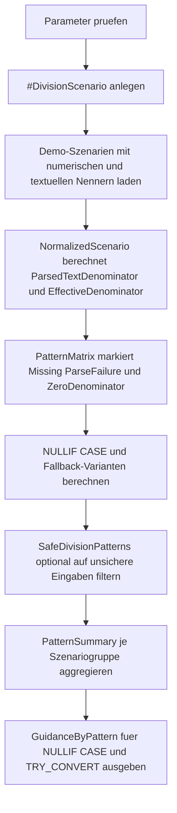

# FunctionSafeDivisionPatterns.sql

Dieses Skript zeigt sichere Rechenmuster gegen Division durch Null auf einer kleinen Demo-Datenbasis. Es trennt die eigentliche Quotientenbildung, die Normalisierung optionaler Textnenner und den fachlichen Fallback, damit Guardrails in Reviews und Schulungen klar lesbar bleiben.

## Uebersicht

<!-- SQLDOC:SUMMARY_TABLE:BEGIN -->
| Feld | Wert |
|---|---|
| Script | [FunctionSafeDivisionPatterns.sql](FunctionSafeDivisionPatterns.sql) |
| Version | `1.0` |
| Typ | `didactic-lab` |
| Kapitel | `05_Funktionen` |
| Sicherheit | `read-only-tempdb` |
| Zweck | Demonstriert sichere Divisionsmuster mit `NULLIF`, `CASE`, `COALESCE` und `TRY_CONVERT`. |
<!-- SQLDOC:SUMMARY_TABLE:END -->

## Einordnung

Division durch Null ist in T-SQL selten ein einzelnes Funktionsproblem, sondern eine Frage sauberer Guardrails. Das Lab zeigt deshalb nebeneinander, wann ein kompakter `NULLIF`-Ausdruck reicht, wann ein expliziter `CASE` lesbarer ist und wie textuell gelieferte Nenner erst normalisiert werden sollten, bevor ein Quotient berechnet wird.

## Annahmen

- Das Skript verwendet ausschliesslich eine temporaere Demo-Tabelle und keine produktiven Fachtabellen.
- `DenominatorText` repraesentiert didaktisch einen Nenner aus einer textuellen Vorstufe, etwa CSV- oder UI-Eingaben.
- `@FallbackRatio` und `@FallbackPercent` stehen fuer bewusst explizite Ersatzwerte; in produktiven Prozessen kann fachlich auch `NULL` oder ein Fehlerpfad richtiger sein.
- Kleine, aber gueltige Nenner wie `0.5` bleiben erlaubt, damit nicht jede ungewoehnliche Zahl vorschnell als Fehlerfall behandelt wird.

## Anwendungsfall

Das Skript eignet sich fuer Reporting- und KPI-Abfragen, in denen Quoten, Prozentwerte oder Auslastungen aus unsauberen Eingangsdaten entstehen. Es ist besonders nuetzlich, wenn ein Nenner aus mehreren Quellen kommen kann und das Team klar entscheiden muss, ob bei `0`, `NULL` oder unparsebaren Texten `NULL`, ein Fallback oder ein expliziter Hinweis entstehen soll.

## Parameter

<!-- SQLDOC:PARAMETERS_TABLE:BEGIN -->
| Parameter | SQL-Typ | Pflicht | Beschreibung |
|---|---|---|---|
| `@FallbackRatio` | `DECIMAL(12, 4)` | Nein | Ersatzwert fuer Quotienten, wenn kein gueltiger Nenner vorliegt. |
| `@FallbackPercent` | `DECIMAL(12, 2)` | Nein | Ersatzwert fuer Prozentanzeigen mit ungueltigem Nenner. |
| `@ShowOnlyUnsafeInputs` | `BIT` | Nein | `1` zeigt nur Szenarien mit fehlendem, unparsebarem oder `0`-Nenner. |
<!-- SQLDOC:PARAMETERS_TABLE:END -->

## Abhaengigkeiten

<!-- SQLDOC:DEPENDENCIES_LIST:BEGIN -->
- `tempdb` fuer die temporaere Demo-Tabelle
- `NULLIF`
- `CASE`
- `COALESCE`
- `TRY_CONVERT`
- CTEs fuer Normalisierung und Pattern-Matrix
<!-- SQLDOC:DEPENDENCIES_LIST:END -->

## Hinweise

- `ParsedTextDenominator` macht sichtbar, ob ein textueller Nenner vor der Division erfolgreich in einen numerischen Wert ueberfuehrt wurde.
- `NullIfRatio` und `CaseRatio` zeigen zwei sichere Varianten fuer dieselbe Quotientenbildung: kompakt mit `NULLIF` oder explizit mit `CASE`.
- `RatioWithFallback` und `ScaledValueWithFallback` verschieben die eigentliche Fachentscheidung auf einen klar benannten Ersatzwert.
- `InputProfile` und `RecommendedPattern` machen den Guardrail-Fall direkt im Resultset lesbar, statt ihn nur implizit im Ausdruck zu verstecken.

## Versionshistorie

<!-- SQLDOC:VERSION_HISTORY_TABLE:BEGIN -->
| Version | Datum | User | Beschreibung |
|---|---|---|---|
| `1.0` | `2026-04-19` | `ER` | Erstversion fuer sichere Divisionsmuster mit `NULLIF`, `CASE` und `TRY_CONVERT` |
<!-- SQLDOC:VERSION_HISTORY_TABLE:END -->

## Ablauf

<!-- SQLDOC:MERMAID:BEGIN -->

<!-- SQLDOC:MERMAID:END -->

## SQL-Code

<!-- SQLDOC:SQL_CODE:BEGIN -->
```sql
/*
BEGIN:SQL-HEADER v1
---
sql_header: v1
script_name: "FunctionSafeDivisionPatterns.sql"
script_version: "1.0"
script_type: "didactic-lab"
chapter: "05_Funktionen"

purpose: >
  Zeigt sichere Rechenmuster gegen Division durch Null auf einer kleinen
  Demo-Datenbasis. Das Skript vergleicht NULLIF-, CASE- und Fallback-Muster,
  verarbeitet auch textuell gelieferte Nenner per TRY_CONVERT und macht
  sichtbar, welche Guardrails je Szenario greifen.

parameters:
  - name: "@FallbackRatio"
    sql_type: "DECIMAL(12, 4)"
    direction: "IN"
    required: false
    description: "Ersatzwert fuer Quotienten, wenn kein gueltiger Nenner vorliegt"
  - name: "@FallbackPercent"
    sql_type: "DECIMAL(12, 2)"
    direction: "IN"
    required: false
    description: "Ersatzwert fuer Prozentanzeigen mit ungueltigem Nenner"
  - name: "@ShowOnlyUnsafeInputs"
    sql_type: "BIT"
    direction: "IN"
    required: false
    description: "1 zeigt nur Szenarien mit fehlendem, unparsebarem oder 0-Nenner"

result_sets:
  - name: "SafeDivisionPatterns"
    description: "Vergleicht pro Demo-Szenario mehrere sichere Divisionsmuster und ihre Guardrail-Profile"
  - name: "PatternSummary"
    description: "Aggregiert Divide-by-zero-Risiken und eingesetzte Schutzmuster je Szenariogruppe"
  - name: "GuidanceByPattern"
    description: "Leitet kompakte Empfehlungen fuer NULLIF, CASE und Fallback-Muster ab"

dependencies:
  - "tempdb temporary tables"
  - "NULLIF"
  - "CASE"
  - "COALESCE"
  - "TRY_CONVERT"
  - "CTE"

safety:
  level: "read-only-tempdb"
  writes_data: false

documentation:
  markdown_file: "T-SQL/05_Funktionen/SQLScripts/FunctionSafeDivisionPatterns.md"
  sync_blocks:
    - "SUMMARY_TABLE"
    - "PARAMETERS_TABLE"
    - "DEPENDENCIES_LIST"
    - "VERSION_HISTORY_TABLE"
    - "SQL_CODE"
  mermaid:
    mode: "ai-agent-from-sql"
    source: "script-body"

main_responsible:
  name: "Erhard Rainer"
  initials: "ER"

version_history:
  - version: "1.0"
    date: "2026-04-19"
    user: "ER"
    description: "Erstversion fuer sichere Divisionsmuster mit NULLIF, CASE und TRY_CONVERT"

notes:
  - "Das Skript nutzt ausschliesslich eine temporaere Demo-Tabelle."
  - "Textuelle Nenner werden didaktisch per TRY_CONVERT normalisiert, bevor Guardrails greifen."
---
END:SQL-HEADER v1
*/

SET NOCOUNT ON;

DECLARE @FallbackRatio DECIMAL(12, 4) = 0.0000;
DECLARE @FallbackPercent DECIMAL(12, 2) = 0.00;
DECLARE @ShowOnlyUnsafeInputs BIT = 0;

IF @FallbackPercent NOT BETWEEN 0 AND 999.99
BEGIN
    THROW 50780, '@FallbackPercent muss zwischen 0 und 999.99 liegen.', 1;
END;

IF @ShowOnlyUnsafeInputs NOT IN (0, 1)
BEGIN
    THROW 50781, '@ShowOnlyUnsafeInputs muss 0 oder 1 sein.', 1;
END;

DROP TABLE IF EXISTS #DivisionScenario;

CREATE TABLE #DivisionScenario
(
    ScenarioID INT NOT NULL PRIMARY KEY,
    ScenarioGroup VARCHAR(20) NOT NULL,
    ScenarioName VARCHAR(100) NOT NULL,
    NumeratorValue DECIMAL(19, 4) NOT NULL,
    DenominatorValue DECIMAL(19, 4) NULL,
    DenominatorText VARCHAR(20) NULL,
    ScaleFactor DECIMAL(19, 4) NOT NULL,
    CommentText VARCHAR(160) NOT NULL
);

INSERT INTO #DivisionScenario
(
    ScenarioID,
    ScenarioGroup,
    ScenarioName,
    NumeratorValue,
    DenominatorValue,
    DenominatorText,
    ScaleFactor,
    CommentText
)
VALUES
    (1, 'returns', 'Healthy denominator from numeric input', 42.0000, 84.0000, NULL, 100.0000, 'Baseline fuer eine normale Prozentberechnung'),
    (2, 'returns', 'Zero denominator in numeric column', 5.0000, 0.0000, NULL, 100.0000, 'NULLIF oder CASE muessen Divide-by-zero verhindern'),
    (3, 'service', 'Missing numeric denominator but valid text input', 18.0000, NULL, '12', 1.0000, 'TRY_CONVERT kann einen textuell gelieferten Nenner retten'),
    (4, 'service', 'Text denominator cannot be parsed', 18.0000, NULL, 'n/a', 1.0000, 'Unparsebare Texte sollen in einen klaren Fallback laufen'),
    (5, 'finance', 'Tiny denominator needs readable fallback profile', 1250.0000, 0.5000, NULL, 100.0000, 'Kleiner Nenner bleibt erlaubt, solange er nicht 0 ist'),
    (6, 'finance', 'Both denominator inputs missing', 27.0000, NULL, NULL, 100.0000, 'Fehlende Eingaben werden als Guardrail-Fall sichtbar gemacht');

;WITH NormalizedScenario AS
(
    SELECT
        ds.ScenarioID,
        ds.ScenarioGroup,
        ds.ScenarioName,
        ds.NumeratorValue,
        ds.DenominatorValue,
        ds.DenominatorText,
        ds.ScaleFactor,
        ds.CommentText,
        TRY_CONVERT(DECIMAL(19, 4), NULLIF(ds.DenominatorText, '')) AS ParsedTextDenominator,
        COALESCE(ds.DenominatorValue, TRY_CONVERT(DECIMAL(19, 4), NULLIF(ds.DenominatorText, ''))) AS EffectiveDenominator
    FROM #DivisionScenario AS ds
),
PatternMatrix AS
(
    SELECT
        ns.ScenarioID,
        ns.ScenarioGroup,
        ns.ScenarioName,
        ns.NumeratorValue,
        ns.DenominatorValue,
        ns.DenominatorText,
        ns.ParsedTextDenominator,
        ns.EffectiveDenominator,
        ns.ScaleFactor,
        ns.CommentText,
        CAST(CASE WHEN ns.DenominatorValue IS NULL AND ns.DenominatorText IS NULL THEN 1 ELSE 0 END AS BIT) AS MissingDenominatorFlag,
        CAST(
            CASE
                WHEN ns.DenominatorValue IS NULL
                     AND ns.DenominatorText IS NOT NULL
                     AND ns.ParsedTextDenominator IS NULL THEN 1
                ELSE 0
            END
            AS BIT
        ) AS ParseFailureFlag,
        CAST(CASE WHEN ns.EffectiveDenominator = 0 THEN 1 ELSE 0 END AS BIT) AS ZeroDenominatorFlag,
        CAST(ns.NumeratorValue / NULLIF(ns.EffectiveDenominator, 0) AS DECIMAL(19, 6)) AS NullIfRatio,
        CAST(
            CASE
                WHEN ns.EffectiveDenominator IS NULL OR ns.EffectiveDenominator = 0 THEN NULL
                ELSE ns.NumeratorValue / ns.EffectiveDenominator
            END
            AS DECIMAL(19, 6)
        ) AS CaseRatio,
        CAST(
            COALESCE(
                ns.NumeratorValue / NULLIF(ns.EffectiveDenominator, 0),
                @FallbackRatio
            )
            AS DECIMAL(19, 6)
        ) AS RatioWithFallback,
        CAST(
            COALESCE(
                CASE
                    WHEN ns.EffectiveDenominator IS NULL OR ns.EffectiveDenominator = 0 THEN NULL
                    ELSE (ns.NumeratorValue / ns.EffectiveDenominator) * ns.ScaleFactor
                END,
                @FallbackPercent
            )
            AS DECIMAL(19, 6)
        ) AS ScaledValueWithFallback,
        CASE
            WHEN ns.EffectiveDenominator = 0 THEN 'zero-denominator'
            WHEN ns.EffectiveDenominator IS NULL AND ns.DenominatorText IS NOT NULL THEN 'parse-or-input-gap'
            WHEN ns.EffectiveDenominator IS NULL THEN 'missing-denominator'
            ELSE 'safe-denominator'
        END AS InputProfile,
        CASE
            WHEN ns.EffectiveDenominator = 0 THEN 'NULLIF or CASE required'
            WHEN ns.EffectiveDenominator IS NULL AND ns.DenominatorText IS NOT NULL THEN 'TRY_CONVERT plus fallback'
            WHEN ns.EffectiveDenominator IS NULL THEN 'fallback only'
            ELSE 'direct safe division'
        END AS RecommendedPattern
    FROM NormalizedScenario AS ns
)
SELECT
    pm.ScenarioID,
    pm.ScenarioGroup,
    pm.ScenarioName,
    pm.NumeratorValue,
    pm.DenominatorValue,
    pm.DenominatorText,
    pm.ParsedTextDenominator,
    pm.EffectiveDenominator,
    pm.NullIfRatio,
    pm.CaseRatio,
    pm.RatioWithFallback,
    pm.ScaledValueWithFallback,
    pm.MissingDenominatorFlag,
    pm.ParseFailureFlag,
    pm.ZeroDenominatorFlag,
    pm.InputProfile,
    pm.RecommendedPattern,
    pm.CommentText
FROM PatternMatrix AS pm
WHERE
    @ShowOnlyUnsafeInputs = 0
    OR pm.MissingDenominatorFlag = 1
    OR pm.ParseFailureFlag = 1
    OR pm.ZeroDenominatorFlag = 1
ORDER BY
    CASE pm.ScenarioGroup
        WHEN 'returns' THEN 1
        WHEN 'service' THEN 2
        ELSE 3
    END,
    pm.ScenarioID;

SELECT
    pm.ScenarioGroup,
    COUNT(*) AS ScenarioCount,
    SUM(CASE WHEN pm.ZeroDenominatorFlag = 1 THEN 1 ELSE 0 END) AS ZeroDenominatorCases,
    SUM(CASE WHEN pm.ParseFailureFlag = 1 THEN 1 ELSE 0 END) AS ParseFailureCases,
    SUM(CASE WHEN pm.MissingDenominatorFlag = 1 THEN 1 ELSE 0 END) AS MissingDenominatorCases,
    SUM(CASE WHEN pm.InputProfile = 'safe-denominator' THEN 1 ELSE 0 END) AS SafeDivisionCases
FROM PatternMatrix AS pm
GROUP BY
    pm.ScenarioGroup
ORDER BY
    pm.ScenarioGroup;

SELECT
    gm.PatternName,
    gm.WhenToUse,
    gm.ObservedScenarios,
    gm.TeachingNote
FROM
(
    SELECT
        'NULLIF' AS PatternName,
        'Sinnvoll, wenn ein vorhandener Nenner nur gegen den Spezialfall 0 abgesichert werden muss.' AS WhenToUse,
        STRING_AGG(
            CASE
                WHEN pm.ZeroDenominatorFlag = 1 OR pm.InputProfile = 'safe-denominator' THEN pm.ScenarioName
            END,
            ', '
        ) WITHIN GROUP (ORDER BY pm.ScenarioID) AS ObservedScenarios,
        'NULLIF haelt den Ausdruck kompakt, liefert bei 0 aber bewusst NULL statt eines fachlichen Ersatzwerts.' AS TeachingNote
    FROM PatternMatrix AS pm

    UNION ALL

    SELECT
        'CASE' AS PatternName,
        'Sinnvoll, wenn Guardrails explizit lesbar sein oder weitere Sonderfaelle geprueft werden sollen.' AS WhenToUse,
        STRING_AGG(
            CASE
                WHEN pm.ZeroDenominatorFlag = 1 OR pm.MissingDenominatorFlag = 1 THEN pm.ScenarioName
            END,
            ', '
        ) WITHIN GROUP (ORDER BY pm.ScenarioID) AS ObservedScenarios,
        'CASE eignet sich fuer klar benannte Regeln, wenn 0, NULL und weitere Fachfaelle unterschiedlich behandelt werden sollen.' AS TeachingNote
    FROM PatternMatrix AS pm

    UNION ALL

    SELECT
        'TRY_CONVERT plus COALESCE' AS PatternName,
        'Sinnvoll, wenn Nenner zunaechst aus optionalen Textquellen normalisiert und danach mit Fallbacks versehen werden muessen.' AS WhenToUse,
        STRING_AGG(
            CASE
                WHEN pm.ParseFailureFlag = 1 OR pm.DenominatorText IS NOT NULL THEN pm.ScenarioName
            END,
            ', '
        ) WITHIN GROUP (ORDER BY pm.ScenarioID) AS ObservedScenarios,
        'TRY_CONVERT trennt parsebare von unparsebaren Texteingaengen, bevor die eigentliche Divisionslogik startet.' AS TeachingNote
    FROM PatternMatrix AS pm
) AS gm
ORDER BY
    CASE gm.PatternName
        WHEN 'NULLIF' THEN 1
        WHEN 'CASE' THEN 2
        ELSE 3
    END;
```
<!-- SQLDOC:SQL_CODE:END -->
